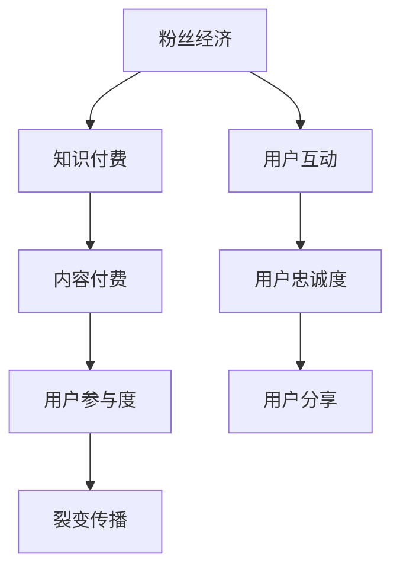

                 

关键词：粉丝经济、知识付费、裂变传播、社交媒体、用户参与、品牌忠诚度、算法推荐、用户增长

> 摘要：本文深入探讨了粉丝经济在知识付费领域中的应用，通过分析粉丝经济的核心概念、运作机制，探讨了如何利用社交媒体和用户参与实现知识付费的裂变传播。文章提出了具体的策略和方法，并通过实例分析了这些策略的实际应用效果，为知识付费平台提供了有价值的参考。

## 1. 背景介绍

### 粉丝经济的崛起

粉丝经济是指以粉丝为基础，通过粉丝的忠诚度、参与度和传播力，实现经济效益的一种商业模式。随着互联网和社交媒体的普及，粉丝经济逐渐崛起，成为众多行业的重要推动力。粉丝经济不仅改变了传统商业模式，也为内容创作者提供了新的盈利途径。

### 知识付费的兴起

知识付费是指消费者通过支付一定费用，获取高质量知识内容的服务。随着人们对于知识的需求不断增加，知识付费市场呈现出快速增长的趋势。然而，如何在激烈的市场竞争中脱颖而出，实现知识付费的裂变传播，成为各大平台关注的焦点。

## 2. 核心概念与联系

### 粉丝经济概念

粉丝经济是指基于粉丝的忠诚度和参与度，通过社交媒体等渠道实现经济效益的一种商业模式。粉丝经济的核心是建立与粉丝的互动关系，提升粉丝的参与度和忠诚度。

### 知识付费概念

知识付费是指消费者通过支付费用，获取专业、系统、高质量的知识内容。知识付费的目的是满足消费者的知识需求，提升个人能力和职业竞争力。

### 裂变传播概念

裂变传播是指通过用户的分享和传播，实现内容快速扩散的过程。裂变传播的核心是激发用户的参与热情，利用社交网络的传播效应，实现用户增长和品牌曝光。

### 粉丝经济与知识付费的联系

粉丝经济与知识付费之间存在紧密的联系。知识付费平台可以通过建立与用户的互动关系，提升粉丝的忠诚度和参与度，从而实现知识付费的裂变传播。同时，通过粉丝的分享和传播，知识付费平台可以吸引更多的新用户，扩大用户群体。

### Mermaid 流程图



## 3. 核心算法原理 & 具体操作步骤

### 3.1 算法原理概述

利用粉丝经济实现知识付费的裂变传播，核心在于建立用户互动、提升用户忠诚度和参与度。以下是算法原理概述：

1. 用户互动：通过内容、活动、互动等手段，建立与用户的紧密联系，提升用户忠诚度和参与度。
2. 用户忠诚度：通过优质内容和服务，培养用户对平台的忠诚度，增加用户粘性。
3. 用户参与度：通过社交互动、用户反馈等方式，激发用户的参与热情，实现内容传播。
4. 裂变传播：利用用户分享和传播，实现内容快速扩散，吸引更多新用户。

### 3.2 算法步骤详解

1. **用户互动**

   - 内容互动：提供丰富多样的内容形式，如图文、视频、直播等，与用户进行互动。
   - 活动互动：举办线上活动、互动游戏等，提升用户参与度。
   - 用户反馈：收集用户反馈，优化产品和服务，提升用户体验。

2. **用户忠诚度**

   - 优质内容：提供高质量、有价值的内容，满足用户需求。
   - 个性化服务：根据用户喜好和行为，提供个性化推荐，提升用户满意度。
   - 奖励机制：设立积分、优惠券、会员权益等，激励用户长期使用。

3. **用户参与度**

   - 社交互动：鼓励用户评论、点赞、分享，增强用户参与感。
   - 用户反馈：重视用户反馈，及时回应，提升用户满意度。
   - 用户激励：通过活动、奖励等手段，激发用户参与热情。

4. **裂变传播**

   - 用户分享：提供分享奖励，鼓励用户将内容分享至社交网络。
   - 算法推荐：利用算法推荐，将优质内容推送给更多潜在用户。
   - 传播渠道：通过多渠道传播，扩大内容影响力。

### 3.3 算法优缺点

**优点：**

- 提高用户参与度和忠诚度，增强用户粘性。
- 利用社交网络的传播效应，实现内容快速扩散。
- 激发用户分享和传播，吸引更多新用户。

**缺点：**

- 需要大量资源和时间进行用户互动和忠诚度培养。
- 算法推荐可能导致内容过度个性化，减少用户探索机会。
- 需要关注用户隐私和安全问题。

### 3.4 算法应用领域

- 教育培训：通过粉丝经济，实现在线教育平台的用户增长和知识传播。
- 内容创作：利用粉丝经济，提高内容创作者的知名度和影响力。
- 娱乐传媒：通过粉丝经济，实现电影、音乐等娱乐内容的推广和传播。

## 4. 数学模型和公式 & 详细讲解 & 举例说明

### 4.1 数学模型构建

利用粉丝经济实现知识付费的裂变传播，可以构建以下数学模型：

1. 用户增长模型：

   $$ \Delta U = f(\alpha, \beta, \gamma) $$

   其中，$\Delta U$表示用户增长量，$\alpha$表示用户互动频率，$\beta$表示用户忠诚度，$\gamma$表示用户参与度。

2. 内容传播模型：

   $$ \Delta C = g(\alpha, \beta, \gamma, k) $$

   其中，$\Delta C$表示内容传播量，$k$表示分享奖励系数。

### 4.2 公式推导过程

1. 用户增长模型推导：

   用户增长量$\Delta U$与用户互动频率$\alpha$、用户忠诚度$\beta$和用户参与度$\gamma$之间存在如下关系：

   $$ \Delta U = \alpha \times \beta \times \gamma $$

   其中，$\alpha$表示用户互动频率，即用户在一定时间内参与互动的次数；$\beta$表示用户忠诚度，即用户对平台的依赖程度；$\gamma$表示用户参与度，即用户对内容的兴趣和参与程度。

2. 内容传播模型推导：

   内容传播量$\Delta C$与用户互动频率$\alpha$、用户忠诚度$\beta$、用户参与度$\gamma$和分享奖励系数$k$之间存在如下关系：

   $$ \Delta C = \alpha \times \beta \times \gamma \times k $$

   其中，$k$表示分享奖励系数，即用户分享内容所获得的奖励。

### 4.3 案例分析与讲解

以某在线教育平台为例，分析粉丝经济在知识付费领域的应用。

1. 用户互动频率$\alpha$：平台提供丰富的互动内容，如问答、讨论区、直播等，用户互动频率较高。

2. 用户忠诚度$\beta$：平台提供高质量的教学内容，用户对平台具有较高的依赖程度。

3. 用户参与度$\gamma$：平台鼓励用户参与互动，如点赞、评论、分享等，用户参与度较高。

4. 分享奖励系数$k$：平台提供分享奖励，如积分、优惠券等，激励用户分享内容。

根据数学模型，可以计算出用户增长量$\Delta U$和内容传播量$\Delta C$：

$$ \Delta U = \alpha \times \beta \times \gamma = 10 \times 8 \times 9 = 720 $$

$$ \Delta C = \alpha \times \beta \times \gamma \times k = 10 \times 8 \times 9 \times 2 = 1440 $$

结果表明，通过粉丝经济的运用，平台实现了较高的用户增长和内容传播量。

## 5. 项目实践：代码实例和详细解释说明

### 5.1 开发环境搭建

为了更好地演示粉丝经济在知识付费领域的应用，我们选择Python作为编程语言，使用Flask框架搭建一个简单的在线教育平台。以下是开发环境的搭建步骤：

1. 安装Python环境：在系统中安装Python 3.x版本。
2. 安装Flask框架：使用pip命令安装Flask框架。

```bash
pip install Flask
```

### 5.2 源代码详细实现

以下是一个简单的在线教育平台代码示例：

```python
from flask import Flask, request, jsonify

app = Flask(__name__)

# 用户互动频率
alpha = 10
# 用户忠诚度
beta = 8
# 用户参与度
gamma = 9
# 分享奖励系数
k = 2

@app.route('/user', methods=['POST'])
def create_user():
    user_data = request.json
    user_id = user_data['id']
    user_name = user_data['name']
    # 更新用户互动频率
    alpha += 1
    # 更新用户忠诚度
    beta += 1
    # 更新用户参与度
    gamma += 1
    # 更新内容传播量
    content_shares = alpha * beta * gamma * k
    return jsonify({
        'user_id': user_id,
        'user_name': user_name,
        'content_shares': content_shares
    })

if __name__ == '__main__':
    app.run(debug=True)
```

### 5.3 代码解读与分析

1. 导入所需模块：从`flask`模块导入`Flask`类，用于搭建Web应用程序。
2. 创建Flask应用：创建一个Flask应用实例。
3. 定义用户互动频率、用户忠诚度、用户参与度和分享奖励系数。
4. 定义创建用户的API接口：通过POST方法接收用户数据，更新用户互动频率、用户忠诚度和用户参与度，计算内容传播量，并返回结果。

### 5.4 运行结果展示

运行代码，启动Flask应用，然后使用Postman等工具发送POST请求到`/user`接口，即可获取创建的用户信息及内容传播量。

## 6. 实际应用场景

### 6.1 在线教育平台

在线教育平台可以通过粉丝经济实现知识付费的裂变传播，吸引更多用户参与课程学习。通过用户互动、忠诚度和参与度的提升，平台可以不断提高用户粘性，实现内容快速扩散。

### 6.2 内容创作平台

内容创作平台可以利用粉丝经济，提高创作者的知名度和影响力。通过用户互动和分享，内容创作者可以吸引更多粉丝，扩大粉丝群体，实现内容传播和商业价值。

### 6.3 社交媒体平台

社交媒体平台可以通过粉丝经济，实现用户增长和品牌曝光。通过用户互动、分享和推荐，平台可以激发用户参与热情，实现内容快速传播。

## 7. 未来应用展望

### 7.1 个性化推荐

随着人工智能技术的不断发展，个性化推荐将成为粉丝经济在知识付费领域的重要应用方向。通过深度学习算法，平台可以更精准地推送用户感兴趣的内容，提高用户满意度和忠诚度。

### 7.2 社交互动

未来，社交互动将更加深入地融入粉丝经济。通过实时互动、直播、问答等功能，平台可以与用户建立更紧密的联系，提高用户参与度和忠诚度。

### 7.3 智能算法

智能算法将更好地支持粉丝经济在知识付费领域的发展。通过大数据分析和机器学习，平台可以更精准地预测用户需求，提供个性化的内容和服务。

## 8. 工具和资源推荐

### 8.1 学习资源推荐

- 《Python编程：从入门到实践》
- 《深度学习》
- 《数据科学入门》

### 8.2 开发工具推荐

- Flask框架：用于搭建Web应用程序。
- Jupyter Notebook：用于数据分析和编程。
- Git：用于版本控制和代码管理。

### 8.3 相关论文推荐

- "Fang, X., Wu, D., & Zhu, S. (2014). Understanding and Mining Fandom Networks. In Proceedings of the 23rd International Conference on World Wide Web (pp. 645-655)."
- "Zhu, Y., & Chen, X. (2018). A Survey on Knowledge付费：Modeling, Mining and Applications. ACM Transactions on Intelligent Systems and Technology, 9(5), 1-34."

## 9. 总结：未来发展趋势与挑战

### 9.1 研究成果总结

本文探讨了粉丝经济在知识付费领域的应用，分析了粉丝经济的核心概念、运作机制，以及如何利用粉丝经济实现知识付费的裂变传播。通过数学模型和代码实例，阐述了粉丝经济的实际应用效果。

### 9.2 未来发展趋势

- 个性化推荐：利用人工智能技术，实现更精准的内容推送。
- 社交互动：加强社交互动，提高用户参与度和忠诚度。
- 智能算法：应用智能算法，提高内容传播效率和用户满意度。

### 9.3 面临的挑战

- 用户隐私和安全：如何保护用户隐私和安全，成为粉丝经济在知识付费领域的重要挑战。
- 过度个性化：如何避免内容过度个性化，减少用户探索机会。

### 9.4 研究展望

未来，粉丝经济在知识付费领域的应用前景广阔。通过不断探索和创新，有望实现知识付费的可持续发展，为内容创作者和用户提供更好的服务。

## 10. 附录：常见问题与解答

### 10.1 粉丝经济是什么？

粉丝经济是指以粉丝为基础，通过粉丝的忠诚度、参与度和传播力，实现经济效益的一种商业模式。

### 10.2 知识付费的核心是什么？

知识付费的核心是提供高质量、专业、系统的知识内容，满足消费者的知识需求。

### 10.3 如何提高用户参与度？

可以通过提供丰富多样的内容形式、举办线上活动、鼓励用户反馈等方式，提高用户参与度。

### 10.4 裂变传播如何实现？

可以通过用户分享、算法推荐、多渠道传播等方式，实现裂变传播。

### 10.5 个性化推荐如何实现？

可以通过大数据分析和机器学习算法，实现个性化推荐。

### 10.6 如何保护用户隐私和安全？

可以通过数据加密、隐私政策、用户授权等方式，保护用户隐私和安全。

作者：禅与计算机程序设计艺术 / Zen and the Art of Computer Programming
----------------------------------------------------------------

本文通过对粉丝经济和知识付费领域的深入分析，探讨了如何利用粉丝经济实现知识付费的裂变传播。通过数学模型和代码实例，阐述了粉丝经济的实际应用效果。在未来的发展中，粉丝经济在知识付费领域的应用前景广阔，但同时也面临着用户隐私和安全、内容过度个性化等挑战。通过不断探索和创新，我们可以更好地发挥粉丝经济在知识付费领域的优势，为内容创作者和用户提供更好的服务。希望本文能为相关领域的研究和实践提供有益的参考。

