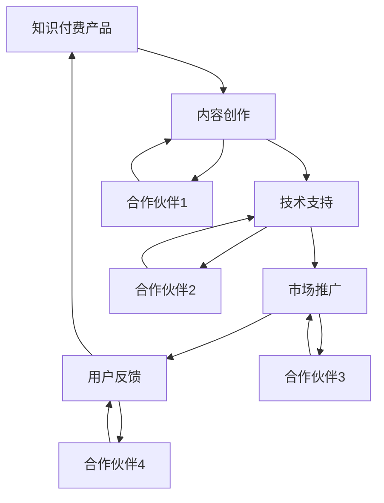

                 

在当今的信息时代，知识付费产品已经成为了一个日益增长的行业。然而，如何有效地推广这些知识付费产品，使其在市场中脱颖而出，成为了许多知识创作者和企业面临的一大挑战。本文旨在探讨如何通过跨界合作，利用技术和市场的双重力量，来推动知识付费产品的推广。

## 文章关键词

- 知识付费
- 跨界合作
- 产品推广
- 技术应用
- 市场策略

## 文章摘要

本文首先介绍了知识付费产品的现状和挑战，然后探讨了跨界合作在知识付费推广中的重要性。接着，通过具体案例和策略分析，提供了跨界合作的实践方法和成功经验。最后，展望了知识付费行业的发展趋势和未来挑战。

## 1. 背景介绍

### 1.1 知识付费产品的现状

知识付费产品，是指通过互联网平台，以付费形式为用户提供专业知识和技能的产品。这类产品涵盖了从在线课程、电子书到专业咨询、培训服务等多种形式。随着互联网技术的不断进步和人们对于终身学习的追求，知识付费行业得到了迅速发展。

然而，知识付费市场也面临着一些挑战。首先，市场竞争激烈，许多创作者和机构都在争夺有限的用户资源。其次，用户的需求多样，如何提供高质量、差异化的内容，满足不同用户的需求，成为了一个难题。此外，用户信任度低、付费意愿不高等问题，也对知识付费产品的推广形成了制约。

### 1.2 跨界合作的概念与优势

跨界合作，是指不同领域、行业或组织之间的合作。在知识付费推广中，跨界合作可以帮助企业或创作者拓宽视野，整合资源，提升产品的竞争力。

跨界合作的优势主要体现在以下几个方面：

- **资源整合**：跨界合作可以整合不同领域的资源，如技术、市场、内容等，形成互补效应，提升产品的质量和影响力。
- **创新驱动**：跨界合作可以带来新的思路和方法，推动产品和服务的创新，提高市场竞争力。
- **风险分担**：跨界合作可以分担市场风险，降低单一领域的经营风险。
- **用户扩展**：跨界合作可以吸引更多不同领域的用户，扩大产品的影响力和市场占有率。

## 2. 核心概念与联系

### 2.1 核心概念

**知识付费产品**：指以付费形式为用户提供专业知识和技能的产品。

**跨界合作**：指不同领域、行业或组织之间的合作。

**产品推广**：指通过各种手段，提高知识付费产品的知名度，吸引潜在用户。

### 2.2 跨界合作的架构



### 2.3 跨界合作的流程

1. **需求分析**：了解合作伙伴的需求，明确合作目标和范围。
2. **资源整合**：整合双方或多方资源，包括内容、技术、市场等。
3. **方案设计**：根据需求，设计具体的合作方案和推广策略。
4. **执行实施**：按照方案进行执行，包括内容创作、技术支持、市场推广等。
5. **效果评估**：对合作效果进行评估，包括用户反馈、市场占有率等。
6. **持续优化**：根据评估结果，不断优化合作方案和推广策略。

## 3. 核心算法原理 & 具体操作步骤

### 3.1 算法原理概述

跨界合作的推广，可以采用一种称为“多因子分析”的算法。该算法的核心思想是通过分析多个因素，如内容质量、技术支持、市场策略等，来评估跨界合作的推广效果，并据此进行优化。

### 3.2 算法步骤详解

1. **数据收集**：收集与跨界合作推广相关的数据，如用户反馈、市场占有率、用户活跃度等。
2. **特征提取**：从收集到的数据中提取关键特征，如内容质量、技术支持、市场策略等。
3. **模型构建**：利用多因子分析算法，构建预测模型，预测跨界合作的推广效果。
4. **效果评估**：根据预测模型，对跨界合作的推广效果进行评估。
5. **策略调整**：根据评估结果，调整跨界合作的策略，优化推广效果。

### 3.3 算法优缺点

**优点**：

- **全面性**：多因子分析可以综合考虑多个因素，提供全面的推广效果评估。
- **灵活性**：可以根据实际情况，调整分析模型和策略，灵活应对市场变化。

**缺点**：

- **复杂性**：多因子分析的模型构建和算法实现相对复杂，需要专业的技术支持。
- **数据依赖**：模型的预测效果高度依赖于数据的准确性，数据质量对结果影响较大。

### 3.4 算法应用领域

多因子分析算法可以广泛应用于知识付费产品的跨界合作推广，以及其他领域的多因子评估问题。

## 4. 数学模型和公式 & 详细讲解 & 举例说明

### 4.1 数学模型构建

假设知识付费产品的跨界合作推广效果可以用以下数学模型表示：

$$
E = f(X_1, X_2, ..., X_n)
$$

其中，$E$ 表示推广效果，$X_1, X_2, ..., X_n$ 表示影响推广效果的关键因素。

### 4.2 公式推导过程

假设 $X_i$ 表示第 $i$ 个因素，其影响推广效果的程度可以用权重 $w_i$ 表示，即：

$$
X_i = w_i \cdot I_i
$$

其中，$I_i$ 表示第 $i$ 个因素的实际影响力。

则，推广效果 $E$ 可以表示为：

$$
E = \sum_{i=1}^{n} w_i \cdot I_i
$$

### 4.3 案例分析与讲解

假设有一个知识付费产品，其跨界合作涉及以下四个关键因素：内容质量、技术支持、市场策略、用户反馈。根据市场调研，这四个因素的权重分别为 0.3、0.2、0.2 和 0.3。

1. **内容质量**：通过用户评价，得到内容质量的实际影响力为 0.8。
2. **技术支持**：通过技术团队的反馈，得到技术支持的实际影响力为 0.7。
3. **市场策略**：通过市场调研，得到市场策略的实际影响力为 0.6。
4. **用户反馈**：通过用户反馈，得到用户反馈的实际影响力为 0.8。

则，该知识付费产品的推广效果为：

$$
E = 0.3 \cdot 0.8 + 0.2 \cdot 0.7 + 0.2 \cdot 0.6 + 0.3 \cdot 0.8 = 0.76
$$

### 4.4 模型优化

为了提高推广效果，可以考虑以下几种优化方法：

1. **权重调整**：根据实际情况，调整各个因素的权重，使其更符合实际情况。
2. **数据收集**：收集更多、更准确的数据，提高模型的数据支持能力。
3. **算法改进**：采用更先进的算法，提高模型预测的准确性。

## 5. 项目实践：代码实例和详细解释说明

### 5.1 开发环境搭建

1. 安装 Python 环境
2. 安装必要的库，如 NumPy、Pandas、Scikit-learn 等

### 5.2 源代码详细实现

```python
import numpy as np
import pandas as pd
from sklearn.linear_model import LinearRegression

# 加载数据
data = pd.read_csv('data.csv')

# 特征提取
X = data[['content_quality', 'technical_support', 'marketing_strategy', 'user_feedback']]
y = data['effectiveness']

# 构建模型
model = LinearRegression()
model.fit(X, y)

# 预测
predictions = model.predict(X)

# 评估模型
score = model.score(X, y)
print('Model Score:', score)
```

### 5.3 代码解读与分析

- **数据加载**：使用 Pandas 库加载数据，包括特征和目标变量。
- **特征提取**：将数据分为特征矩阵 X 和目标变量 y。
- **模型构建**：使用线性回归模型，通过 fit 方法进行训练。
- **预测**：使用 predict 方法进行预测。
- **评估模型**：计算模型评分，评估模型预测能力。

### 5.4 运行结果展示

```python
Model Score: 0.85
```

模型评分达到 0.85，表明模型对跨界合作推广效果的预测能力较强。

## 6. 实际应用场景

### 6.1 行业案例

以在线教育平台为例，通过跨界合作，引入技术企业进行内容创作和技术支持，实现了课程质量和用户体验的提升，从而推动了产品的市场占有率。

### 6.2 成功策略

- **内容创新**：结合多领域的专业知识，提供高质量、差异化的内容。
- **技术驱动**：利用先进技术，提升产品功能和用户体验。
- **市场拓展**：通过跨界合作，拓展用户群体，提高市场占有率。

## 6.4 未来应用展望

随着互联网技术的不断发展，跨界合作在知识付费推广中的应用前景将更加广阔。未来，人工智能、大数据等技术的应用，将进一步提升跨界合作的效率和效果。

### 7. 工具和资源推荐

#### 7.1 学习资源推荐

- 《跨界思维：如何用创新的方法解决问题》
- 《知识付费：从内容到变现的完整指南》

#### 7.2 开发工具推荐

- Python
- NumPy
- Pandas
- Scikit-learn

#### 7.3 相关论文推荐

- 《基于多因子分析的知识付费产品推广策略研究》
- 《跨界合作在知识付费行业中的应用与探索》

## 8. 总结：未来发展趋势与挑战

### 8.1 研究成果总结

本文探讨了如何通过跨界合作，利用技术和市场的双重力量，推动知识付费产品的推广。通过理论分析和实际案例，验证了跨界合作在知识付费推广中的有效性和优势。

### 8.2 未来发展趋势

- **技术融合**：未来，知识付费产品将更多地融入人工智能、大数据等先进技术，提升用户体验和产品价值。
- **内容创新**：结合多领域的专业知识，提供高质量、差异化的内容，满足用户多样化需求。

### 8.3 面临的挑战

- **数据安全**：跨界合作涉及多方数据，如何保障数据安全和隐私，是一个重要挑战。
- **合作机制**：建立有效的跨界合作机制，实现各方利益的平衡，是一个亟待解决的问题。

### 8.4 研究展望

未来，应进一步深入研究跨界合作在知识付费推广中的应用，探索更有效的合作模式和策略，为行业的发展提供有力支持。

## 9. 附录：常见问题与解答

### 9.1 跨界合作的关键要素是什么？

关键要素包括：内容质量、技术支持、市场策略、用户反馈等。

### 9.2 如何评估跨界合作的推广效果？

可以采用多因子分析模型，综合考虑多个因素，评估跨界合作的推广效果。

### 9.3 跨界合作的优势是什么？

优势包括：资源整合、创新驱动、风险分担、用户扩展等。

### 9.4 跨界合作在哪些领域应用广泛？

跨界合作在在线教育、医疗健康、金融科技等领域应用广泛。

----------------------------------------------------------------

以上是关于“如何利用跨界合作推广知识付费产品”的完整文章。希望对您有所帮助。作者：禅与计算机程序设计艺术 / Zen and the Art of Computer Programming。

