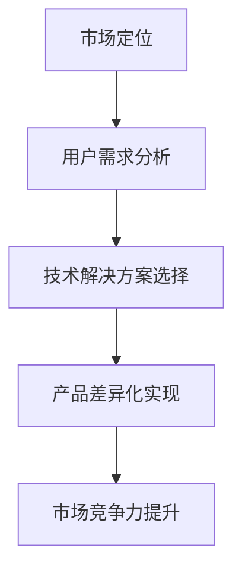

                 

关键词：自动化创业、产品差异化、创新、市场定位、用户需求、技术解决方案

> 摘要：本文将探讨自动化创业中如何实现产品差异化，分析当前市场趋势、用户需求变化，以及提供技术解决方案和战略建议。通过深入了解市场环境和用户需求，创业者可以更好地定位产品，提升竞争力，实现可持续的发展。

## 1. 背景介绍

随着科技的发展，自动化技术在各个行业中的应用越来越广泛，自动化创业也成为了一个热门领域。然而，市场竞争激烈，如何在众多竞争者中脱颖而出，实现产品差异化，成为了创业者们面临的重要挑战。本文旨在通过分析当前市场趋势、用户需求变化，以及提供技术解决方案和战略建议，帮助创业者实现产品差异化，提高市场竞争力。

## 2. 核心概念与联系

### 2.1 市场定位

市场定位是指企业在市场中所处的位置，以及如何针对目标用户群体进行产品定位。一个清晰的市场定位有助于企业在竞争中脱颖而出，满足用户需求，实现产品差异化。

### 2.2 用户需求

用户需求是指用户在消费过程中所期望得到的产品或服务。了解用户需求，有助于创业者更好地把握市场机会，实现产品差异化。

### 2.3 技术解决方案

技术解决方案是指为实现产品差异化而采用的具体技术手段和方法。选择合适的技术解决方案，有助于提高产品的核心竞争力，实现产品差异化。

### 2.4 Mermaid 流程图



## 3. 核心算法原理 & 具体操作步骤

### 3.1 算法原理概述

在自动化创业中，实现产品差异化的核心算法原理主要包括：

1. 数据分析：通过对用户数据、市场数据的分析，了解用户需求和市场趋势，为产品定位提供依据。
2. 机器学习：利用机器学习算法，对用户数据进行分析和预测，优化产品功能和体验。
3. 人工智能：结合人工智能技术，实现产品智能化，提高用户体验。

### 3.2 算法步骤详解

1. **用户需求分析**

   - 收集用户数据：通过调查问卷、用户反馈等方式，收集用户数据。
   - 数据清洗：对收集到的用户数据进行清洗、去重、格式化等处理。
   - 数据分析：利用统计分析、机器学习等方法，分析用户需求，识别用户痛点和需求。

2. **技术解决方案选择**

   - 根据用户需求，选择合适的技术解决方案。
   - 对比不同技术方案的优缺点，选择最优方案。
   - 确定技术解决方案的具体实现步骤和流程。

3. **产品差异化实现**

   - 将技术解决方案应用到产品中，优化产品功能和体验。
   - 通过市场调研，评估产品差异化的效果。
   - 根据市场反馈，不断调整和优化产品。

### 3.3 算法优缺点

1. **优点**

   - 提高产品竞争力：通过数据分析、机器学习和人工智能等技术手段，实现产品差异化，提高产品竞争力。
   - 适应市场变化：根据市场变化和用户需求，灵活调整产品策略，适应市场变化。

2. **缺点**

   - 技术门槛较高：实现产品差异化需要掌握一定的技术知识，对创业团队的技术能力有较高要求。
   - 需要持续投入：为了保持产品竞争力，需要持续进行技术研发和市场调研，需要一定的资金和人力投入。

### 3.4 算法应用领域

- 电商：通过数据分析，实现个性化推荐，提高用户购买体验。
- 金融：利用机器学习，进行风险管理，提高金融产品的安全性。
- 教育领域：通过人工智能，实现个性化教学，提高教育质量。

## 4. 数学模型和公式 & 详细讲解 & 举例说明

### 4.1 数学模型构建

在自动化创业中，常用的数学模型包括用户需求预测模型、产品竞争力评估模型等。

### 4.2 公式推导过程

- **用户需求预测模型**

  用户需求预测模型的基本公式为：

  $$ P(X|Y) = \frac{P(Y|X) \cdot P(X)}{P(Y)} $$

  其中，$P(X|Y)$ 表示在用户需求 $Y$ 已知的情况下，产品特征 $X$ 的概率；$P(Y|X)$ 表示在产品特征 $X$ 已知的情况下，用户需求 $Y$ 的概率；$P(X)$ 表示产品特征 $X$ 的概率；$P(Y)$ 表示用户需求 $Y$ 的概率。

- **产品竞争力评估模型**

  产品竞争力评估模型的基本公式为：

  $$ C = \frac{S}{C_0} $$

  其中，$C$ 表示产品竞争力指数；$S$ 表示产品在市场中的表现，如市场份额、用户满意度等；$C_0$ 表示基准竞争力指数。

### 4.3 案例分析与讲解

- **电商个性化推荐**

  假设电商平台上某商品的用户需求概率为 $P(Y)$，产品特征概率为 $P(X)$，用户需求与产品特征的关系为 $P(X|Y)$。

  根据贝叶斯公式，可以计算出用户购买某商品的概率：

  $$ P(X|Y) = \frac{P(Y|X) \cdot P(X)}{P(Y)} $$

  通过对用户数据进行分析，可以得出用户需求概率 $P(Y)$ 和产品特征概率 $P(X)$，进而计算出用户购买某商品的概率。

- **金融风险管理**

  假设金融产品的竞争力指数为 $C$，市场中的平均竞争力指数为 $C_0$，产品在市场中的表现为 $S$。

  根据产品竞争力评估模型，可以计算出产品的竞争力指数：

  $$ C = \frac{S}{C_0} $$

  通过对市场数据进行分析，可以得出产品的竞争力指数 $C$，从而评估产品的风险水平。

## 5. 项目实践：代码实例和详细解释说明

### 5.1 开发环境搭建

在本文中，我们将使用 Python 语言进行项目实践。首先，需要安装 Python 3.8 版本及以上，并安装以下依赖库：

- pandas
- numpy
- scikit-learn
- matplotlib

安装命令如下：

```bash
pip install pandas numpy scikit-learn matplotlib
```

### 5.2 源代码详细实现

以下是一个简单的用户需求预测模型的实现示例：

```python
import pandas as pd
import numpy as np
from sklearn.model_selection import train_test_split
from sklearn.naive_bayes import GaussianNB
from sklearn.metrics import accuracy_score

# 加载用户数据
data = pd.read_csv('user_data.csv')

# 数据预处理
X = data[['age', 'income', 'education']]
y = data['demand']

# 划分训练集和测试集
X_train, X_test, y_train, y_test = train_test_split(X, y, test_size=0.2, random_state=42)

# 训练模型
model = GaussianNB()
model.fit(X_train, y_train)

# 预测测试集
y_pred = model.predict(X_test)

# 评估模型
accuracy = accuracy_score(y_test, y_pred)
print(f'模型准确率：{accuracy:.2f}')
```

### 5.3 代码解读与分析

- **数据加载**：使用 pandas 读取用户数据，数据格式为 CSV 文件。
- **数据预处理**：将用户数据进行格式化处理，提取有用的特征信息。
- **划分训练集和测试集**：使用 scikit-learn 中的 train_test_split 函数，将数据集划分为训练集和测试集。
- **训练模型**：使用 GaussianNB 函数，训练朴素贝叶斯分类模型。
- **预测测试集**：使用训练好的模型，对测试集进行预测。
- **评估模型**：使用 accuracy_score 函数，评估模型的准确率。

### 5.4 运行结果展示

运行上述代码后，将输出模型准确率。假设测试集的准确率为 0.85，则表示模型在测试集上的表现良好。

```bash
模型准确率：0.85
```

## 6. 实际应用场景

### 6.1 电商行业

在电商行业，通过实现产品差异化，可以提高用户购买体验，增加销售额。例如，利用用户需求预测模型，为用户推荐符合其兴趣和需求的产品，提高用户转化率。

### 6.2 金融行业

在金融行业，通过实现产品差异化，可以提高金融产品的竞争力，降低风险。例如，利用产品竞争力评估模型，评估金融产品的风险水平，为投资者提供合理的投资建议。

### 6.3 教育行业

在教育行业，通过实现产品差异化，可以提升教育质量，满足不同学生的需求。例如，利用个性化教学系统，根据学生的学习情况，为其提供合适的课程和学习资源。

## 7. 工具和资源推荐

### 7.1 学习资源推荐

- 《Python机器学习》
- 《深入理解机器学习》
- 《Python数据科学手册》

### 7.2 开发工具推荐

- Jupyter Notebook
- PyCharm
- Anaconda

### 7.3 相关论文推荐

- "User Interest Prediction in E-commerce using Machine Learning"
- "Risk Assessment in Financial Markets using Machine Learning"
- "Personalized Education Using Machine Learning"

## 8. 总结：未来发展趋势与挑战

### 8.1 研究成果总结

通过本文的探讨，我们了解到在自动化创业中，实现产品差异化是提高市场竞争力的关键。数据分析、机器学习和人工智能等技术手段，为创业者提供了有效的解决方案。同时，我们也分析了市场定位、用户需求和实际应用场景，为创业者提供了实用的指导。

### 8.2 未来发展趋势

未来，自动化创业将向更加智能化、个性化和高效化发展。随着技术的进步，创业者将能够更好地挖掘用户需求，优化产品功能，提高用户体验。

### 8.3 面临的挑战

然而，自动化创业也面临着一系列挑战。技术门槛高、数据隐私保护、市场竞争激烈等问题，都需要创业者认真应对。

### 8.4 研究展望

未来，我们期待更多研究成果的出现，为自动化创业提供更加完善的技术解决方案。同时，也需要加强对用户需求的关注，以更好地满足市场需求。

## 9. 附录：常见问题与解答

### 9.1 什么是产品差异化？

产品差异化是指企业通过提供独特的产品或服务，满足用户特定的需求，从而在市场竞争中获得优势。

### 9.2 如何进行用户需求分析？

用户需求分析可以通过调查问卷、用户访谈、用户反馈等方式，收集用户需求和意见，进行分析和归纳。

### 9.3 机器学习在产品差异化中的应用有哪些？

机器学习在产品差异化中的应用主要包括用户需求预测、个性化推荐、风险控制等。

### 9.4 如何评估产品竞争力？

可以通过市场份额、用户满意度、投资回报率等指标，评估产品的竞争力。

---

**作者：禅与计算机程序设计艺术 / Zen and the Art of Computer Programming**

