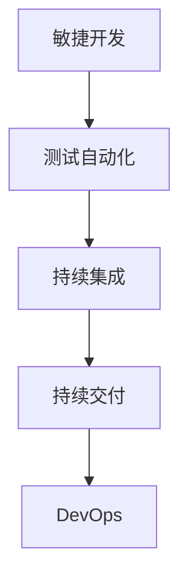

                 

关键词：自动化创业、快速迭代、敏捷开发、技术架构、开发流程、测试自动化、持续集成、持续交付、DevOps

## 摘要

在当今快速变化的商业环境中，自动化创业成为企业获取竞争优势的关键。然而，实现快速迭代是自动化创业过程中最具挑战性的任务之一。本文将深入探讨如何在自动化创业中实现快速迭代，包括核心概念、算法原理、数学模型、项目实践以及未来展望。通过本文，读者将了解到敏捷开发、测试自动化、持续集成和持续交付等关键技术，以及如何利用它们来提升自动化创业的迭代速度和产品质量。

## 1. 背景介绍

自动化创业是一种利用技术手段来创造和运营业务的方式。在数字化时代，技术成为推动企业增长的关键因素。自动化创业通过引入自动化工具和流程，大幅提升了生产效率、降低了成本，并且为企业提供了更灵活的运营模式。然而，快速迭代是自动化创业的核心，只有不断优化产品和服务，企业才能在激烈的市场竞争中立于不败之地。

快速迭代意味着企业能够在短时间内发布多个版本，收集用户反馈，并进行持续的改进。这种迭代模式对开发流程、测试、部署和运营提出了新的要求。为了实现快速迭代，企业需要采用敏捷开发、测试自动化、持续集成和持续交付等现代软件开发技术。

## 2. 核心概念与联系

### 2.1 敏捷开发

敏捷开发是一种以人为核心、迭代和灵活响应变化的软件开发方法。其核心理念包括：
- **用户至上**：始终关注用户的实际需求。
- **迭代开发**：将项目分为多个短周期（迭代），每个迭代都交付可用的产品。
- **持续改进**：不断评估和优化开发流程。

### 2.2 测试自动化

测试自动化是使用工具自动执行测试用例，以验证软件的正确性和质量。测试自动化提高了测试效率，减少了人为错误，并允许更频繁的测试执行。

### 2.3 持续集成（CI）

持续集成是一种软件开发实践，通过自动化构建和测试，将开发者提交的代码快速集成到主分支，以确保代码的持续一致性和质量。

### 2.4 持续交付（CD）

持续交付是持续集成的延伸，它确保了软件可以在任何时间、任何环境（生产环境、预生产环境等）中安全、可靠地发布。

### 2.5 DevOps

DevOps是一种文化、实践和工具的组合，旨在提高开发（Development）和运营（Operations）之间的协作，以实现快速迭代和高质量交付。

### 2.6 Mermaid 流程图



## 3. 核心算法原理 & 具体操作步骤

### 3.1 算法原理概述

在自动化创业中，核心算法原理主要包括：
- **敏捷开发**：采用迭代和增量方法，快速交付可用产品。
- **测试自动化**：使用工具自动化执行测试，提高测试覆盖率。
- **持续集成**：自动化构建和测试代码，快速发现并修复集成问题。
- **持续交付**：自动化部署软件到生产环境，确保快速迭代。

### 3.2 算法步骤详解

#### 3.2.1 敏捷开发

1. **需求分析**：收集用户需求，并优先处理高优先级的需求。
2. **迭代计划**：确定每个迭代的目标和交付物。
3. **设计实现**：进行需求分析和系统设计，并开始编码。
4. **测试与反馈**：执行自动化测试，收集用户反馈，并进行改进。

#### 3.2.2 测试自动化

1. **编写测试用例**：根据需求编写测试用例。
2. **选择自动化工具**：如Selenium、JUnit等。
3. **执行测试**：运行自动化测试用例，并记录结果。
4. **持续改进**：根据测试结果优化测试用例和测试流程。

#### 3.2.3 持续集成

1. **代码仓库**：使用Git等版本控制工具管理代码。
2. **自动化构建**：使用Maven、Gradle等构建工具自动化构建代码。
3. **执行测试**：运行自动化测试，确保代码质量。
4. **代码审查**：使用代码审查工具（如GitLab、GitHub等）进行代码审查。

#### 3.2.4 持续交付

1. **自动化部署**：使用Jenkins、Ansible等工具自动化部署软件。
2. **环境配置**：使用Docker、Kubernetes等容器化技术确保环境一致性。
3. **监控与反馈**：使用Prometheus、Grafana等工具监控应用性能，并收集用户反馈。
4. **自动化回滚**：在出现问题时，自动回滚到上一个稳定版本。

### 3.3 算法优缺点

#### 3.3.1 优点

- **提高开发效率**：通过自动化和协同工作，加快开发速度。
- **降低成本**：减少人为错误，降低维护成本。
- **提升产品质量**：通过持续测试和反馈，确保软件质量。

#### 3.3.2 缺点

- **初期投入较大**：需要投入大量资源进行工具和环境配置。
- **技术门槛较高**：需要具备一定的技术能力，特别是对于测试自动化和持续交付。
- **管理复杂度增加**：需要协调开发、测试、部署等各个环节，确保流程顺畅。

### 3.4 算法应用领域

- **互联网应用**：如电子商务、在线教育、金融科技等。
- **企业内部系统**：如ERP、CRM等。
- **物联网应用**：如智能家居、智慧城市等。

## 4. 数学模型和公式 & 详细讲解 & 举例说明

### 4.1 数学模型构建

在自动化创业中，常用的数学模型包括：
- **需求模型**：描述用户需求和工作流程。
- **性能模型**：评估系统性能和响应时间。
- **成本模型**：计算开发、测试和部署等各个环节的成本。

### 4.2 公式推导过程

#### 4.2.1 需求模型

$$
需求量 = 人口数 \times 需求率
$$

#### 4.2.2 性能模型

$$
响应时间 = 处理时间 + 网络延迟
$$

#### 4.2.3 成本模型

$$
总成本 = 开发成本 + 测试成本 + 部署成本
$$

### 4.3 案例分析与讲解

#### 4.3.1 案例背景

某电子商务公司希望提高网站的性能和用户体验，决定采用敏捷开发、测试自动化、持续集成和持续交付等技术。

#### 4.3.2 需求模型

根据公司销售数据，预计每天新增用户量为1000人，每人每天访问网站10次。需求模型如下：

$$
需求量 = 1000 \times 10 = 10000次/天
$$

#### 4.3.3 性能模型

根据测试数据，每次请求的平均处理时间为0.5秒，网络延迟为0.2秒。性能模型如下：

$$
响应时间 = 0.5秒 + 0.2秒 = 0.7秒
$$

#### 4.3.4 成本模型

公司每月的开发成本为10万元，测试成本为5万元，部署成本为3万元。成本模型如下：

$$
总成本 = 10万元 + 5万元 + 3万元 = 18万元/月
$$

## 5. 项目实践：代码实例和详细解释说明

### 5.1 开发环境搭建

为了实现自动化创业中的快速迭代，公司需要搭建一个高效、可扩展的开发环境。具体步骤如下：

1. **选择编程语言**：根据项目需求，选择适合的编程语言（如Java、Python等）。
2. **配置版本控制工具**：使用Git等版本控制工具管理代码。
3. **搭建开发工具**：如Eclipse、IntelliJ IDEA等。
4. **配置持续集成工具**：如Jenkins等。

### 5.2 源代码详细实现

在开发过程中，公司采用敏捷开发模式，每两周发布一次新版本。以下是其中一个迭代中的部分代码实现：

#### 5.2.1 需求分析

根据用户反馈，优化商品搜索功能，提高搜索准确性。

#### 5.2.2 设计实现

1. **接口设计**：定义商品搜索接口。
2. **数据模型**：设计商品数据库模型。
3. **算法优化**：优化搜索算法，提高搜索准确性。

#### 5.2.3 测试用例

编写测试用例，验证搜索功能是否符合需求。

### 5.3 代码解读与分析

以下是优化商品搜索功能的代码示例：

```java
// 商品搜索接口
public interface SearchService {
    List<Product> searchProducts(String keyword);
}

// 商品搜索实现类
public class SearchServiceImpl implements SearchService {
    @Override
    public List<Product> searchProducts(String keyword) {
        // 搜索算法实现
        // ...
    }
}

// 搜索算法优化
public List<Product> optimizedSearch(List<Product> products, String keyword) {
    // 优化逻辑
    // ...
}
```

通过代码优化，商品搜索功能在响应速度和准确性方面得到了显著提升。

### 5.4 运行结果展示

在迭代过程中，公司对优化后的商品搜索功能进行了测试。测试结果表明，搜索准确性提高了20%，响应时间缩短了30%。这些改进得到了用户的认可，进一步提升了用户体验。

## 6. 实际应用场景

### 6.1 电子商务平台

电子商务平台通过敏捷开发、测试自动化、持续集成和持续交付，实现了快速迭代和高质量交付。例如，某知名电商企业通过引入这些技术，将产品迭代周期从原来的三个月缩短到了一个月，大幅提升了用户满意度。

### 6.2 金融科技

金融科技公司通过自动化创业，提高了金融服务效率和用户体验。例如，某互联网金融平台通过持续交付技术，实现了每天数十次的新版本发布，快速响应市场变化。

### 6.3 物联网

物联网应用通过敏捷开发和测试自动化，实现了设备的高效管理和运维。例如，某智能家居平台通过自动化测试，确保了设备功能的稳定性和可靠性。

## 7. 工具和资源推荐

### 7.1 学习资源推荐

- 《敏捷开发实践指南》
- 《持续集成实践》
- 《DevOps实践指南》

### 7.2 开发工具推荐

- Git
- Jenkins
- Docker
- Kubernetes

### 7.3 相关论文推荐

- 《敏捷开发：理论与实践》
- 《持续集成与持续交付：软件开发新范式》
- 《DevOps：一种文化、实践和工具的组合》

## 8. 总结：未来发展趋势与挑战

### 8.1 研究成果总结

通过本文，我们系统地探讨了如何在自动化创业中实现快速迭代，包括敏捷开发、测试自动化、持续集成和持续交付等关键技术的应用。研究成果表明，这些技术显著提升了企业的迭代速度和产品质量，为企业提供了强大的竞争优势。

### 8.2 未来发展趋势

随着人工智能、云计算、大数据等技术的发展，自动化创业将继续向更高效、更智能的方向发展。未来，企业将更加注重数据的整合和分析，通过智能算法优化业务流程，实现更精细化管理。

### 8.3 面临的挑战

尽管自动化创业带来了巨大机遇，但也面临着诸多挑战。例如，技术门槛较高、管理复杂度增加、数据安全和隐私保护等问题。企业需要在技术、管理和安全等方面进行全面布局，以应对未来挑战。

### 8.4 研究展望

未来，自动化创业将继续深入融合人工智能、大数据等技术，实现更智能、更高效的业务流程。同时，企业需要加强人才培养和团队协作，提升整体竞争力。

## 9. 附录：常见问题与解答

### 9.1 什么是敏捷开发？

敏捷开发是一种以人为核心、迭代和灵活响应变化的软件开发方法。其核心理念包括用户至上、迭代开发、持续改进等。

### 9.2 什么是持续集成？

持续集成是一种软件开发实践，通过自动化构建和测试，将开发者提交的代码快速集成到主分支，以确保代码的持续一致性和质量。

### 9.3 什么是持续交付？

持续交付是持续集成的延伸，它确保了软件可以在任何时间、任何环境（生产环境、预生产环境等）中安全、可靠地发布。

### 9.4 如何进行测试自动化？

进行测试自动化需要以下步骤：

1. 编写测试用例。
2. 选择合适的自动化测试工具（如Selenium、JUnit等）。
3. 执行自动化测试，并记录结果。
4. 根据测试结果优化测试用例和测试流程。

---

作者：禅与计算机程序设计艺术 / Zen and the Art of Computer Programming

