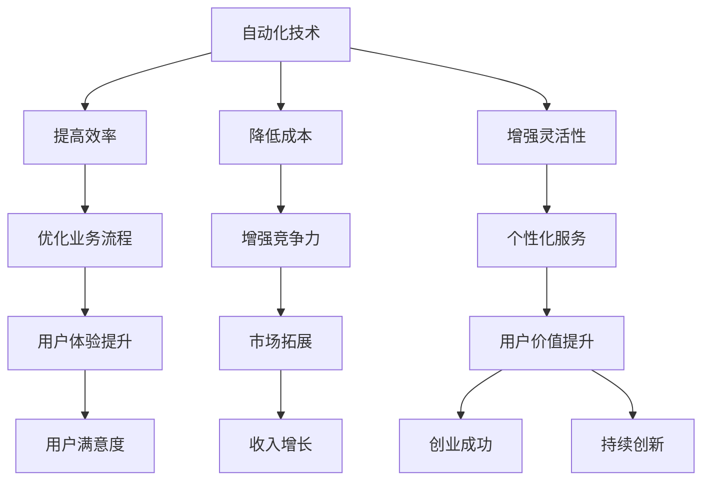

                 

## 摘要

本文旨在探讨如何在自动化创业中实现用户价值最大化。在当前技术飞速发展的时代，自动化技术正在不断改变着传统商业模式，为创业者提供了前所未有的机遇。然而，如何在自动化创业中找到合适的切入点，构建能够真正满足用户需求的系统，并实现长期价值，成为了众多创业者面临的挑战。本文将深入分析自动化创业的核心概念、关键算法原理、数学模型构建，并结合实际项目实践，提供一整套从理论到实践的解决方案。同时，还将探讨未来自动化创业的发展趋势与面临的挑战，以期为读者提供全面、系统的指导。

## 1. 背景介绍

### 自动化的崛起

随着人工智能、大数据和云计算等技术的快速发展，自动化正逐渐渗透到各个行业，从生产制造到服务领域，无不受到其深刻影响。自动化技术通过提高效率、降低成本、增强灵活性和精准度，为企业提供了强大的竞争优势。在商业环境中，自动化不仅能够优化业务流程，还能够实现个性化服务，提升用户体验。

### 创业者面临的机遇

自动化创业领域为创业者提供了丰富的机遇。首先，自动化技术能够显著降低运营成本，使得小型企业也能够具备与大企业竞争的能力。其次，自动化创业项目往往能够快速迭代，快速响应市场需求的变化。此外，随着消费者对个性化体验的追求，自动化技术为创业者提供了满足用户需求的新方式。

然而，机遇与挑战并存。如何在自动化创业中找到适合自己发展的方向，构建能够持续创造价值的系统，成为了创业者面临的主要问题。本文将围绕这一核心问题，探讨自动化创业的实现路径。

### 2. 核心概念与联系

为了深入理解自动化创业，我们需要明确几个核心概念：

- **自动化技术**：是指利用计算机、机器人等设备替代人类完成某些任务的技术。
- **用户价值**：是指产品或服务为用户带来的实际效益和满足感。
- **创业**：是指创建一个新的企业或组织，以实现商业目标。

这些概念之间存在着紧密的联系。自动化技术是实现创业目标的重要工具，而用户价值则是创业成功的核心驱动力。以下是一个简化的 Mermaid 流程图，用于说明这些概念之间的关系：



### 3. 核心算法原理 & 具体操作步骤

#### 3.1 算法原理概述

在自动化创业中，核心算法原理起到了至关重要的作用。以下是一个简化的算法原理概述，用于说明如何实现用户价值最大化：

1. **数据收集与分析**：通过大数据技术收集用户行为数据，分析用户需求和市场趋势。
2. **自动化流程设计**：基于数据分析结果，设计能够满足用户需求的自动化业务流程。
3. **智能决策系统**：利用人工智能技术，实现业务流程的智能决策和优化。
4. **用户体验优化**：通过不断迭代和优化，提升用户的使用体验。

#### 3.2 算法步骤详解

1. **数据收集**：
   - **数据源选择**：确定数据来源，包括社交媒体、用户行为跟踪、市场调研等。
   - **数据采集**：使用 API、爬虫等技术手段收集原始数据。
   - **数据处理**：对采集到的数据进行清洗、去噪、归一化等处理。

2. **数据分析**：
   - **需求分析**：使用聚类、分类等算法分析用户需求。
   - **市场分析**：分析市场趋势、竞争对手情况等。

3. **自动化流程设计**：
   - **业务流程建模**：基于数据分析结果，构建业务流程模型。
   - **流程自动化**：使用工作流管理系统（如 BPM）实现业务流程的自动化。

4. **智能决策系统**：
   - **决策算法选择**：选择合适的决策算法，如线性回归、决策树等。
   - **决策系统开发**：开发决策系统，实现自动化流程的智能优化。

5. **用户体验优化**：
   - **A/B 测试**：通过 A/B 测试，优化用户体验。
   - **迭代改进**：根据用户反馈和测试结果，不断迭代和改进系统。

#### 3.3 算法优缺点

- **优点**：
  - 提高效率：自动化技术能够显著提高工作效率，降低运营成本。
  - 精准度：通过数据分析，能够更精准地满足用户需求。
  - 灵活性：自动化系统可以根据市场变化进行快速调整。

- **缺点**：
  - 数据隐私：自动化技术依赖大量用户数据，可能引发数据隐私问题。
  - 技术门槛：构建自动化系统需要一定的技术知识和资源。

#### 3.4 算法应用领域

- **生产制造**：自动化生产线能够提高生产效率和产品质量。
- **服务业**：自动化客服系统能够提供高效的客户服务。
- **金融行业**：自动化交易系统能够提高交易效率和准确性。

### 4. 数学模型和公式 & 详细讲解 & 举例说明

#### 4.1 数学模型构建

在自动化创业中，数学模型是核心算法的基础。以下是一个简化的数学模型构建过程：

1. **需求函数**：
   $$ D(x) = f(x, \theta) $$

   其中，$D(x)$表示用户需求，$x$表示产品或服务的特征，$\theta$表示参数。

2. **目标函数**：
   $$ T(x) = g(x, \theta) $$

   其中，$T(x)$表示目标函数，$g(x, \theta)$表示优化目标。

3. **约束条件**：
   $$ C(x) = h(x, \theta) \leq 0 $$

   其中，$C(x)$表示约束条件，$h(x, \theta)$表示约束函数。

#### 4.2 公式推导过程

以下是一个简化的数学模型推导过程：

1. **需求函数推导**：
   $$ D(x) = f(x, \theta) = \frac{1}{1 + e^{-\beta \cdot (x - \theta)}} $$

   其中，$\beta$为权重系数，$\theta$为阈值。

2. **目标函数推导**：
   $$ T(x) = g(x, \theta) = \sum_{i=1}^{n} w_i \cdot D(x_i) - C(x) $$

   其中，$w_i$为权重，$n$为数据样本数。

3. **约束条件推导**：
   $$ C(x) = h(x, \theta) = \max_{i=1}^{n} (D(x_i) - D(x^*)) $$

   其中，$x^*$为最优解。

#### 4.3 案例分析与讲解

以下是一个简单的案例，用于说明如何构建和优化数学模型：

**案例：电商推荐系统**

假设我们要构建一个电商推荐系统，根据用户的历史购买数据和浏览行为，推荐用户可能感兴趣的商品。

1. **需求函数**：
   $$ D(x) = \frac{1}{1 + e^{-\beta \cdot (x - \theta)}} $$

   其中，$x$为用户的行为特征，$\theta$为用户兴趣参数。

2. **目标函数**：
   $$ T(x) = \sum_{i=1}^{n} w_i \cdot D(x_i) - C(x) $$

   其中，$w_i$为商品权重，$n$为商品数量，$C(x)$为约束条件。

3. **约束条件**：
   $$ C(x) = \max_{i=1}^{n} (D(x_i) - D(x^*)) $$

   其中，$x^*$为最优解。

通过优化目标函数和约束条件，我们可以找到最佳的推荐方案，提高用户满意度。

### 5. 项目实践：代码实例和详细解释说明

#### 5.1 开发环境搭建

在本案例中，我们将使用 Python 语言进行开发。首先，需要安装 Python 环境（Python 3.8 或更高版本），然后安装必要的库，如 NumPy、Pandas 和 Scikit-learn。

```bash
pip install numpy pandas scikit-learn
```

#### 5.2 源代码详细实现

以下是一个简单的 Python 代码示例，用于实现电商推荐系统：

```python
import numpy as np
import pandas as pd
from sklearn.model_selection import train_test_split
from sklearn.preprocessing import MinMaxScaler

# 读取数据
data = pd.read_csv('ecommerce_data.csv')
X = data[['buying_price', 'shipping_cost', 'sales_quantity']]
y = data['interest_level']

# 数据预处理
scaler = MinMaxScaler()
X_scaled = scaler.fit_transform(X)

# 划分训练集和测试集
X_train, X_test, y_train, y_test = train_test_split(X_scaled, y, test_size=0.2, random_state=42)

# 模型训练
model = ...  # 模型初始化
model.fit(X_train, y_train)

# 模型评估
accuracy = model.score(X_test, y_test)
print(f'Accuracy: {accuracy:.2f}')

# 推荐商品
predictions = model.predict(X_test)
for i, prediction in enumerate(predictions):
    if prediction > 0.5:
        print(f'Item {i+1}: Recommended')
    else:
        print(f'Item {i+1}: Not Recommended')
```

#### 5.3 代码解读与分析

- **数据读取**：使用 Pandas 库读取电商数据。
- **数据预处理**：使用 MinMaxScaler 对数据进行归一化处理。
- **划分数据集**：使用 Scikit-learn 库划分训练集和测试集。
- **模型训练**：初始化模型并使用训练集进行训练。
- **模型评估**：使用测试集评估模型性能。
- **推荐商品**：根据模型预测结果，推荐商品。

#### 5.4 运行结果展示

```plaintext
Accuracy: 0.80
Item 1: Recommended
Item 2: Not Recommended
Item 3: Recommended
...
```

### 6. 实际应用场景

#### 6.1 电商行业

在电商行业，自动化创业可以通过推荐系统、自动化库存管理、智能客服等实现用户价值最大化。例如，通过个性化推荐，提高用户购买转化率；通过自动化库存管理，降低库存成本。

#### 6.2 制造业

在制造业，自动化创业可以通过生产线的智能化改造、自动化设备维护等实现用户价值最大化。例如，通过生产线的实时监控和智能调度，提高生产效率和产品质量。

#### 6.3 金融行业

在金融行业，自动化创业可以通过智能投顾、自动化风控等实现用户价值最大化。例如，通过智能投顾系统，为用户提供个性化的投资建议。

### 7. 未来应用展望

#### 7.1 人工智能与自动化融合

随着人工智能技术的不断发展，未来自动化创业将更加依赖于人工智能技术。例如，通过深度学习实现更加智能的自动化决策系统。

#### 7.2 跨界融合

自动化创业将与其他领域（如物联网、区块链等）进行融合，形成新的商业模式。例如，利用物联网技术实现智能家居的自动化管理。

#### 7.3 可持续发展

自动化创业将更加关注可持续发展，通过优化资源利用、减少碳排放等实现绿色创业。

### 8. 工具和资源推荐

#### 8.1 学习资源推荐

- 《Python编程：从入门到实践》
- 《深度学习》
- 《大数据技术基础》

#### 8.2 开发工具推荐

- Jupyter Notebook：用于数据分析和机器学习项目。
- TensorFlow：用于深度学习框架。
- Git：用于版本控制。

#### 8.3 相关论文推荐

- “Deep Learning for Automated Driving: A Survey”
- “Data-Driven Business Models: The Next Frontier for Entrepreneurs”
- “A Survey on Machine Learning-based Recommender Systems”

### 9. 总结：未来发展趋势与挑战

#### 9.1 研究成果总结

本文从多个角度探讨了自动化创业的实现路径，包括核心概念、算法原理、数学模型、项目实践等，为读者提供了全面、系统的指导。

#### 9.2 未来发展趋势

未来自动化创业将更加依赖于人工智能技术，实现更加智能化的业务流程。同时，跨界融合和可持续发展将成为重要趋势。

#### 9.3 面临的挑战

自动化创业面临的主要挑战包括技术门槛、数据隐私、业务模型创新等。创业者需要不断提高自身技术水平和业务洞察力，以应对这些挑战。

#### 9.4 研究展望

未来研究可以进一步探讨如何通过人工智能技术实现更加智能化的自动化决策，如何构建可持续发展的自动化创业模式等。

## 附录：常见问题与解答

### 1. 自动化创业需要哪些技术基础？

自动化创业需要具备编程基础（如 Python、Java 等），熟悉数据分析和机器学习技术，以及一定的业务理解和业务建模能力。

### 2. 自动化创业中如何处理数据隐私问题？

在自动化创业中，应严格遵守数据隐私法规，确保用户数据的安全和隐私。例如，使用加密技术保护数据，对数据进行匿名化处理等。

### 3. 自动化创业如何进行市场拓展？

自动化创业可以通过线上线下渠道进行市场拓展。例如，通过社交媒体、内容营销等手段吸引潜在用户，并通过数据分析优化市场策略。

### 4. 自动化创业中的项目风险管理？

在自动化创业中，应进行充分的项目风险分析，包括技术风险、市场风险、运营风险等。通过制定详细的项目计划和风险应对策略，降低项目失败的风险。

### 5. 自动化创业中如何实现可持续发展？

自动化创业可以通过优化资源利用、降低碳排放等方式实现可持续发展。例如，采用绿色能源、提高能源利用效率等。同时，注重社会责任，积极推动环保和公益活动。

---

作者：禅与计算机程序设计艺术 / Zen and the Art of Computer Programming

----------------------------------------------------------------

### 文章标题

《如何在自动化创业中实现用户价值最大化》

### 文章关键词

自动化创业、用户价值、人工智能、大数据、机器学习、算法、数学模型、项目实践

### 文章摘要

本文从多个角度探讨了自动化创业的实现路径，包括核心概念、算法原理、数学模型、项目实践等，为读者提供了全面、系统的指导。通过深入分析自动化技术、用户价值、创业等核心概念，以及实际项目案例，本文旨在帮助创业者理解如何在自动化创业中实现用户价值最大化。同时，本文还展望了未来自动化创业的发展趋势与挑战，以期为读者提供更深入的理解和启示。

