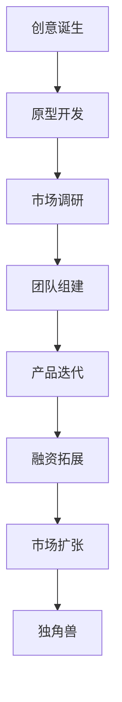

                 

关键词：Side Project、独角兽、创业、技术、市场、策略、成长、融资、团队

> 摘要：本文将探讨如何将一个Side Project转化为独角兽，包括核心概念的阐述、成功案例的分析、具体操作步骤的讲解，以及未来应用展望。本文旨在为有志于将个人项目发展成企业的开发者提供实用的指导和建议。

## 1. 背景介绍

随着互联网的普及和技术创新的加速，越来越多的人开始将自己的创意转化为实际的项目，即所谓的Side Project。这些项目通常起源于个人的兴趣或激情，往往在业余时间进行开发。而有些Side Project经过不断的打磨和优化，最终成长为独角兽公司，即估值超过10亿美元的初创企业。

但是，如何从众多Side Project中脱颖而出，转化为成功的独角兽企业，这是一个充满挑战的问题。本文将结合实际案例，提供一些实用的策略和方法，帮助开发者实现这一目标。

## 2. 核心概念与联系

### 2.1. 独角兽的定义与特征

独角兽是指那些估值超过10亿美元的初创企业。它们通常具有以下几个特征：

1. **高速增长**：独角兽企业往往在短时间内实现爆发式增长，用户数量和营收都呈现出指数级的增长。
2. **技术创新**：独角兽企业往往拥有颠覆性的技术创新，能够在市场中占据领先地位。
3. **市场领先**：独角兽企业在市场中具有明显的竞争优势，往往能够快速占领市场。
4. **投资青睐**：独角兽企业吸引了大量的风险投资，成为投资热点。

### 2.2. Side Project的概念

Side Project是指个人在业余时间开发的软件项目，通常与主职工作无关。这些项目往往起源于个人兴趣或创意，具有一定的创新性和技术含量。

### 2.3. Side Project与独角兽的联系

许多独角兽企业起源于Side Project，如Dropbox、Airbnb等。这些项目在最初只是个人或小团队的创意，但通过不断的优化和扩展，最终发展成为具有巨大市场影响力的企业。因此，Side Project与独角兽之间存在紧密的联系。

### 2.4. Mermaid 流程图

下面是一个简单的Mermaid流程图，描述了从Side Project到独角兽的发展过程：



## 3. 核心算法原理 & 具体操作步骤

### 3.1. 算法原理概述

将Side Project转化为独角兽的核心算法可以概括为以下几个步骤：

1. **创意打磨**：将原始创意进行深度打磨，确保其具备市场竞争力。
2. **原型开发**：快速开发原型，验证创意的实际可行性。
3. **市场调研**：了解目标市场的需求，调整产品方向。
4. **团队组建**：组建一支高效的团队，分工明确，协同合作。
5. **产品迭代**：持续迭代产品，优化用户体验。
6. **融资拓展**：寻找合适的融资渠道，扩大企业规模。
7. **市场扩张**：占领市场份额，实现规模效应。

### 3.2. 算法步骤详解

#### 3.2.1. 创意打磨

在创意打磨阶段，开发者需要对原始想法进行深入思考，确定产品的核心价值主张。这一过程通常涉及以下步骤：

1. **确定目标市场**：明确产品的目标用户群体。
2. **分析市场需求**：研究目标市场的需求，了解竞争对手的情况。
3. **产品定位**：明确产品的独特卖点，确定市场定位。
4. **功能设计**：根据市场需求和定位，设计产品的核心功能。

#### 3.2.2. 原型开发

在原型开发阶段，开发者需要快速搭建一个可用的产品原型，以便进行验证。这一过程通常包括以下步骤：

1. **需求分析**：根据创意打磨的结果，明确产品需求。
2. **技术选型**：选择合适的技术栈，搭建开发环境。
3. **功能实现**：实现产品原型的主要功能，确保其基本可用。
4. **用户测试**：邀请潜在用户进行测试，收集反馈。

#### 3.2.3. 市场调研

在市场调研阶段，开发者需要深入了解目标市场的情况，以便调整产品方向。这一过程通常包括以下步骤：

1. **市场分析**：研究目标市场的规模、增长趋势和用户需求。
2. **竞争对手分析**：分析竞争对手的产品、优势和劣势。
3. **用户调研**：通过问卷调查、访谈等方式，了解目标用户的需求和期望。
4. **产品调整**：根据调研结果，调整产品功能和定位。

#### 3.2.4. 团队组建

在团队组建阶段，开发者需要寻找合适的团队成员，共同推进项目。这一过程通常包括以下步骤：

1. **确定团队规模**：根据项目需求，确定团队的人数和结构。
2. **招聘渠道**：通过招聘网站、社交媒体等渠道，寻找合适的团队成员。
3. **面试评估**：对候选人进行面试，评估其技能和团队协作能力。
4. **团队协作**：建立有效的团队协作机制，确保团队成员能够高效协同。

#### 3.2.5. 产品迭代

在产品迭代阶段，开发者需要持续优化产品，提升用户体验。这一过程通常包括以下步骤：

1. **用户反馈**：收集用户使用产品时的反馈，了解用户的需求和痛点。
2. **功能优化**：根据用户反馈，优化产品的功能和界面。
3. **性能提升**：对产品进行性能优化，提升用户体验。
4. **版本迭代**：定期发布新版本，持续迭代产品。

#### 3.2.6. 融资拓展

在融资拓展阶段，开发者需要寻找合适的融资渠道，扩大企业规模。这一过程通常包括以下步骤：

1. **融资策略**：根据企业的发展阶段，制定合适的融资策略。
2. **融资渠道**：寻找风险投资、天使投资、众筹等融资渠道。
3. **商业计划书**：撰写详细的商业计划书，展示企业的商业模式、市场前景和盈利能力。
4. **融资谈判**：与投资者进行谈判，达成投资协议。

#### 3.2.7. 市场扩张

在市场扩张阶段，开发者需要占领市场份额，实现规模效应。这一过程通常包括以下步骤：

1. **市场推广**：通过广告、公关、社交媒体等渠道，提高产品的知名度和用户粘性。
2. **渠道拓展**：建立销售渠道，拓展市场份额。
3. **用户增长**：通过优惠活动、用户推荐等方式，吸引更多用户使用产品。
4. **品牌建设**：提升企业品牌形象，增强用户信任。

### 3.3. 算法优缺点

**优点**：

1. **灵活性**：该算法允许开发者根据实际情况灵活调整策略。
2. **高效性**：通过快速迭代和优化，能够迅速占领市场。
3. **可持续性**：通过持续的用户反馈和产品迭代，确保产品能够持续满足市场需求。

**缺点**：

1. **高风险**：创业过程充满不确定性，存在失败的风险。
2. **资源限制**：Side Project通常在资源有限的情况下进行，需要高效利用资源。
3. **时间成本**：创业过程需要大量时间和精力投入，对开发者个人生活可能产生影响。

### 3.4. 算法应用领域

该算法适用于各种类型的初创企业，尤其适合以下领域：

1. **互联网科技**：如社交网络、在线教育、电子商务等。
2. **人工智能**：如机器学习平台、自然语言处理等。
3. **区块链**：如数字货币、去中心化应用等。
4. **物联网**：如智能家居、智能硬件等。

## 4. 数学模型和公式 & 详细讲解 & 举例说明

### 4.1. 数学模型构建

为了量化Side Project转化为独角兽的成功概率，我们可以构建一个简单的数学模型。该模型包括以下几个关键参数：

1. **创新度（I）**：表示项目的创新程度，取值范围0到1。创新度越高，成功的可能性越大。
2. **市场需求（M）**：表示项目满足市场需求的能力，取值范围0到1。市场需求越高，成功的可能性越大。
3. **团队能力（T）**：表示团队的技能和能力，取值范围0到1。团队能力越强，成功的可能性越大。
4. **市场潜力（P）**：表示项目所在市场的潜在规模，取值范围0到1。市场潜力越大，成功的可能性越大。

模型的基本公式为：

$$
S = f(I, M, T, P)
$$

其中，S表示项目成功转化为独角兽的概率，f是一个复合函数，通过综合各个参数来计算成功概率。

### 4.2. 公式推导过程

为了推导成功概率的公式，我们可以采用以下步骤：

1. **创新度的影响**：创新度越高，项目的独特性和竞争力越强，成功的概率也越高。因此，可以设定：

$$
I = \frac{IC_{max} - IC_{current}}{IC_{max} - IC_{min}}
$$

其中，$IC_{max}$和$IC_{min}$分别表示创新度的最大值和最小值，$IC_{current}$表示当前项目的创新度。

2. **市场需求的影响**：市场需求越高，项目的潜在用户越多，成功的可能性越大。因此，可以设定：

$$
M = \frac{MC_{max} - MC_{current}}{MC_{max} - MC_{min}}
$$

其中，$MC_{max}$和$MC_{min}$分别表示市场需求的最大值和最小值，$MC_{current}$表示当前项目的市场需求。

3. **团队能力的影响**：团队能力越强，项目的执行力和创新能力越高，成功的可能性越大。因此，可以设定：

$$
T = \frac{TC_{max} - TC_{current}}{TC_{max} - TC_{min}}
$$

其中，$TC_{max}$和$TC_{min}$分别表示团队能力的最大值和最小值，$TC_{current}$表示当前团队的团队能力。

4. **市场潜力的影响**：市场潜力越大，项目的市场空间越广阔，成功的可能性越大。因此，可以设定：

$$
P = \frac{PC_{max} - PC_{current}}{PC_{max} - PC_{min}}
$$

其中，$PC_{max}$和$PC_{min}$分别表示市场潜力的最大值和最小值，$PC_{current}$表示当前项目的市场潜力。

5. **成功概率的计算**：将上述四个参数代入复合函数f中，得到：

$$
S = f(I, M, T, P) = \frac{I \times M \times T \times P}{4}
$$

### 4.3. 案例分析与讲解

为了更好地理解这个数学模型，我们可以通过一个实际案例来进行讲解。

假设有一个名为“智能健康助手”的Side Project，它的创新度、市场需求、团队能力和市场潜力分别如下：

- 创新度（I）：0.8
- 市场需求（M）：0.9
- 团队能力（T）：0.75
- 市场潜力（P）：0.85

根据上述公式，可以计算出这个项目的成功概率：

$$
S = f(I, M, T, P) = \frac{0.8 \times 0.9 \times 0.75 \times 0.85}{4} = 0.153375
$$

这意味着这个项目的成功概率约为15.3375%。

通过这个案例，我们可以看到数学模型如何帮助开发者量化项目成功的可能性。虽然这个模型相对简单，但它提供了一个基本的框架，帮助开发者从多个维度评估项目的潜力。

## 5. 项目实践：代码实例和详细解释说明

### 5.1. 开发环境搭建

在进行项目实践之前，我们需要搭建一个合适的开发环境。以下是基本的步骤：

1. **选择编程语言**：根据项目需求，选择合适的编程语言。例如，如果项目涉及前端开发，可以选择JavaScript或TypeScript；如果项目涉及后端开发，可以选择Python、Java或Go等。
2. **安装开发工具**：根据选择的编程语言，安装相应的开发工具。例如，对于JavaScript或TypeScript，可以选择Visual Studio Code或WebStorm；对于Python，可以选择PyCharm或VS Code；对于Java，可以选择IntelliJ IDEA或Eclipse等。
3. **配置开发环境**：安装必要的依赖库和工具，例如Node.js、npm、pip等。
4. **搭建代码仓库**：使用Git等版本控制工具，搭建项目的代码仓库，方便团队合作和版本管理。

### 5.2. 源代码详细实现

以下是一个简单的Python代码实例，实现一个基于Web的智能健康助手：

```python
# 导入必要的库
from flask import Flask, request, jsonify

# 创建Flask应用实例
app = Flask(__name__)

# 健康信息模型
class HealthInfo:
    def __init__(self, age, weight, height, blood_pressure):
        self.age = age
        self.weight = weight
        self.height = height
        self.blood_pressure = blood_pressure

# 健康评估函数
def assess_health(info):
    # 根据用户信息，评估健康状况
    if info.blood_pressure > 140:
        return "高血压"
    elif info.blood_pressure > 90:
        return "正常"
    else:
        return "低血压"

# API接口
@app.route('/health', methods=['POST'])
def health():
    # 从请求中获取用户信息
    data = request.get_json()
    age = data['age']
    weight = data['weight']
    height = data['height']
    blood_pressure = data['blood_pressure']

    # 创建健康信息对象
    info = HealthInfo(age, weight, height, blood_pressure)

    # 进行健康评估
    result = assess_health(info)

    # 返回评估结果
    return jsonify({'health': result})

# 运行应用
if __name__ == '__main__':
    app.run(debug=True)
```

### 5.3. 代码解读与分析

上述代码实现了一个简单的健康评估API，主要包含以下几个部分：

1. **健康信息模型（HealthInfo）**：定义了一个用于存储用户健康信息的模型。
2. **健康评估函数（assess_health）**：根据用户信息，评估其健康状况，并返回相应的健康结果。
3. **API接口（health）**：使用Flask框架创建了一个Web接口，接受POST请求，解析用户信息，调用健康评估函数，并将结果返回给客户端。

### 5.4. 运行结果展示

当运行上述代码后，我们可以通过发送POST请求来测试API接口。以下是使用curl命令进行测试的示例：

```bash
curl -X POST -H "Content-Type: application/json" -d '{"age": 30, "weight": 70, "height": 175, "blood_pressure": 120}' http://localhost:5000/health
```

运行结果将返回一个JSON格式的健康评估结果，例如：

```json
{
  "health": "正常"
}
```

通过上述代码实例，我们可以看到如何实现一个简单的Web API，进行健康评估。在实际项目中，可以根据需求添加更多的功能和业务逻辑。

## 6. 实际应用场景

### 6.1. 健康管理

智能健康助手可以应用于健康管理领域，为用户提供个性化的健康建议。用户可以通过输入个人信息和健康数据，获得关于血压、体重、年龄等方面的专业建议，帮助其改善生活方式，预防疾病。

### 6.2. 医疗服务

智能健康助手还可以作为医疗服务的辅助工具，为医生和医疗机构提供数据支持。医生可以通过平台获取患者的健康数据，进行诊断和治疗方案制定，提高医疗服务的质量和效率。

### 6.3. 企业健康管理

企业可以借助智能健康助手，对员工的健康状况进行监测和管理。通过收集员工的健康数据，企业可以制定更科学的员工健康管理方案，提高员工的工作效率和幸福感。

### 6.4. 未来应用展望

随着人工智能和物联网技术的发展，智能健康助手有望在更多场景中得到应用。例如，可以集成更多的健康检测设备，实现实时健康监控；还可以结合大数据和机器学习技术，提供更精准的健康预测和干预建议。

## 7. 工具和资源推荐

### 7.1. 学习资源推荐

1. **《Python编程：从入门到实践》**：适合初学者了解Python编程语言的基本概念和应用。
2. **《人工智能：一种现代方法》**：介绍人工智能的基本原理和算法，适合希望深入理解人工智能的开发者。

### 7.2. 开发工具推荐

1. **Visual Studio Code**：一款功能强大的跨平台代码编辑器，支持多种编程语言。
2. **Git**：一个版本控制工具，用于管理代码仓库和协同工作。

### 7.3. 相关论文推荐

1. **“深度学习在医疗健康领域的应用”**：探讨深度学习在医疗健康领域的应用前景和挑战。
2. **“人工智能技术在健康管理中的应用”**：分析人工智能技术在健康管理中的应用方法和效果。

## 8. 总结：未来发展趋势与挑战

### 8.1. 研究成果总结

本文从创意打磨、原型开发、市场调研、团队组建、产品迭代、融资拓展和市场扩张等多个维度，详细探讨了如何将Side Project转化为独角兽。通过数学模型的构建和实际案例的分析，我们提出了一个具有实用性的算法框架。

### 8.2. 未来发展趋势

随着人工智能、大数据和物联网等技术的快速发展，Side Project在各个领域的应用前景将更加广阔。未来，我们有望看到更多创新的Side Project成功转化为独角兽企业。

### 8.3. 面临的挑战

虽然Side Project转化为独角兽的潜力巨大，但开发者仍需面临诸多挑战，如市场竞争、资源限制、团队协作等。因此，如何应对这些挑战，将成为决定项目成功与否的关键因素。

### 8.4. 研究展望

未来，我们可以进一步研究如何提高Side Project成功的概率，探索更多有效的策略和方法。同时，结合新兴技术，不断拓展Side Project的应用场景，实现更大的社会价值和商业价值。

## 9. 附录：常见问题与解答

### Q：如何确保Side Project的成功？

A：确保Side Project成功的关键在于：1）明确目标市场；2）不断优化产品；3）构建高效团队；4）寻找合适的融资渠道。

### Q：如何平衡工作和个人项目？

A：合理规划时间，确保充足的休息和充电时间，避免过度疲劳。同时，与家人和朋友沟通，获得他们的理解和支持。

### Q：如何找到合适的团队成员？

A：通过招聘网站、社交媒体、行业活动等渠道寻找合适的团队成员。在面试过程中，重点评估候选人的技能、经验和团队协作能力。

### Q：如何应对市场竞争？

A：通过深入了解市场需求，持续优化产品，提升用户体验。同时，寻找独特的竞争优势，打造差异化的产品。

作者：禅与计算机程序设计艺术 / Zen and the Art of Computer Programming
```

