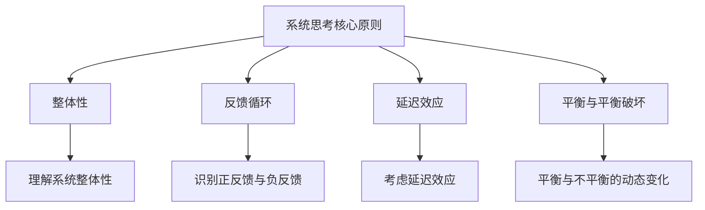

                 

关键词：系统思考、团队管理、复杂系统、协调机制、组织效率、领导力发展、决策优化、团队协作、动态建模、持续改进

> 摘要：本文旨在探讨如何将系统思考这一深度认知方法应用于团队管理中，以提高团队的协调性、创新能力和整体效率。系统思考强调从整体和动态的角度来理解复杂系统，通过识别和解决系统中的反馈循环与瓶颈，优化团队结构和决策过程。本文将介绍系统思考的核心概念、应用方法及其在团队管理中的具体实践。

## 1. 背景介绍

随着全球化和信息技术的快速发展，企业面临着越来越复杂的竞争环境和市场变化。在这种背景下，传统的线性思维和单一维度的管理方法已难以满足现代团队的需求。团队管理不再只是关于资源的分配和任务的执行，而是一个涉及多层次、多维度的复杂系统。

系统思考（Systems Thinking）作为一种应对复杂性的方法论，起源于20世纪60年代。它强调从整体和动态的角度来理解系统，识别并解决系统中的反馈循环与瓶颈。系统思考的核心观点是：任何系统的行为都是由其内部的相互关系和反馈机制决定的。因此，要优化系统的行为，必须从系统的整体结构和动态变化出发，而不仅仅是针对个别问题的解决。

在团队管理中，系统思考的应用可以有效地提升团队的整体效率和创新能力。通过系统思考，团队领导者可以更全面地理解团队运作的复杂性，识别潜在的问题和瓶颈，制定更有效的改进策略。

## 2. 核心概念与联系

### 2.1 复杂系统的定义与特性

复杂系统是由众多相互关联的组成部分构成的，这些组成部分在相互作用中形成复杂的动态行为。复杂系统的特性包括：

- **动态性**：系统状态随时间变化而变化。
- **适应性**：系统能够根据外部环境的变化进行调整。
- **复杂性**：系统包含多个层次和维度，难以用简单的线性模型描述。
- **非线性和不可预测性**：系统行为可能表现出非线性的关系和不可预测的变化。

### 2.2 系统思考的核心原则

系统思考的核心原则包括：

- **整体性**：理解系统的各个部分是如何相互关联和影响的。
- **反馈循环**：识别系统中正反馈和负反馈的作用。
- **延迟效应**：意识到系统行为的变化往往存在延迟。
- **平衡与平衡破坏**：理解系统在平衡与不平衡之间的动态变化。

### 2.3 Mermaid 流程图



## 3. 核心算法原理 & 具体操作步骤

### 3.1 算法原理概述

系统思考的核心算法包括以下步骤：

1. **问题识别**：通过数据分析和实地调研，识别团队面临的关键问题。
2. **系统建模**：构建团队的系统模型，包括各个组成部分及其相互关系。
3. **反馈分析**：分析系统中存在的反馈循环，识别潜在的问题和瓶颈。
4. **改进策略**：基于反馈分析，制定针对问题的改进策略。
5. **实施与监控**：实施改进措施，并通过监控和评估来调整策略。

### 3.2 算法步骤详解

#### 3.2.1 问题识别

问题识别是系统思考的第一步，通过数据分析和实地调研，识别团队面临的关键问题。具体方法包括：

- **数据分析**：利用统计工具对团队绩效、员工满意度、任务完成情况等数据进行深入分析。
- **实地调研**：与团队成员进行面对面的访谈，了解他们的工作体验和意见。

#### 3.2.2 系统建模

系统建模是构建团队的系统模型，包括各个组成部分及其相互关系。具体步骤包括：

- **确定系统边界**：明确团队系统的边界，包括哪些部分属于系统内部。
- **绘制系统图**：使用系统图（如UML图、实体关系图等）来表示系统的各个组成部分及其相互关系。
- **定义变量和参数**：确定系统中关键变量和参数，如任务进度、人员分配、资源消耗等。

#### 3.2.3 反馈分析

反馈分析是识别系统中存在的反馈循环，识别潜在的问题和瓶颈。具体方法包括：

- **识别正反馈循环**：分析系统中哪些部分会相互加强，导致问题加剧。
- **识别负反馈循环**：分析系统中哪些部分会相互抑制，有助于稳定系统。
- **分析瓶颈**：识别系统中可能导致效率低下的关键瓶颈。

#### 3.2.4 改进策略

基于反馈分析，制定针对问题的改进策略。具体步骤包括：

- **制定改进目标**：根据反馈分析的结果，明确需要改进的目标。
- **设计改进方案**：设计具体的改进方案，包括任务分配、流程优化、资源调整等。
- **制定实施计划**：制定详细的实施计划，包括时间表、责任人、资源需求等。

#### 3.2.5 实施与监控

实施改进措施，并通过监控和评估来调整策略。具体步骤包括：

- **实施改进措施**：根据实施计划，逐步实施改进措施。
- **监控与评估**：建立监控和评估机制，定期检查改进措施的执行情况和效果。
- **调整策略**：根据监控和评估的结果，及时调整改进策略。

### 3.3 算法优缺点

#### 3.3.1 优点

- **全局视角**：系统能够从整体和动态的角度来理解团队，避免局部优化。
- **适应性**：系统能够适应不断变化的外部环境，提高团队适应能力。
- **问题解决**：系统能够深入分析问题，提供针对性的解决方案。

#### 3.3.2 缺点

- **复杂性**：系统思考方法需要深入理解和分析团队，对管理者的要求较高。
- **时间成本**：系统思考方法的实施需要较长时间，对团队的日常运作可能产生一定影响。

### 3.4 算法应用领域

系统思考方法在团队管理中的广泛应用，包括但不限于以下领域：

- **团队绩效优化**：通过系统思考，识别和解决影响团队绩效的关键因素，提高团队整体效率。
- **决策优化**：在决策过程中，考虑系统的整体性和动态变化，提高决策的科学性和准确性。
- **团队协作**：通过系统思考，优化团队结构和协作机制，提高团队协作效率。

## 4. 数学模型和公式 & 详细讲解 & 举例说明

### 4.1 数学模型构建

系统思考的数学模型通常基于微分方程、差分方程或随机模型。以下是一个简单的差分方程模型，用于描述团队绩效优化：

$$
\Delta P_t = f(P_{t-1}, R_t)
$$

其中，$P_t$ 表示团队在时间 $t$ 的绩效水平，$R_t$ 表示团队在时间 $t$ 的资源投入，$f$ 表示绩效水平和资源投入之间的关系。

### 4.2 公式推导过程

公式推导过程如下：

1. **定义团队绩效**：设团队在时间 $t$ 的绩效水平为 $P_t$，表示团队在该时间点的产出或目标完成度。

2. **定义资源投入**：设团队在时间 $t$ 的资源投入为 $R_t$，包括人力、时间、资金等。

3. **绩效和资源关系**：根据实际情况，设定绩效水平和资源投入之间的关系函数 $f$。通常，$f$ 是一个非线性函数，表示资源投入的边际效益递减。

4. **动态变化**：设 $\Delta P_t = P_t - P_{t-1}$ 表示团队在时间 $t$ 的绩效变化量，$\Delta R_t = R_t - R_{t-1}$ 表示团队在时间 $t$ 的资源变化量。

5. **建立差分方程**：根据绩效和资源的关系，建立差分方程：

$$
\Delta P_t = f(P_{t-1}, R_t)
$$

### 4.3 案例分析与讲解

#### 案例背景

假设一个团队的目标是完成一个软件开发项目，资源投入主要来自团队成员的工作时间和开发工具的使用。

#### 案例分析

1. **绩效和资源关系**：设 $P_t$ 为团队在时间 $t$ 的绩效水平，$R_t$ 为团队在时间 $t$ 的资源投入。根据经验和观察，设定绩效水平和资源投入之间的关系函数为：

$$
f(P_{t-1}, R_t) = 0.1P_{t-1} + 0.5R_t - 0.2R_t^2
$$

2. **初始条件**：设团队在初始时间 $t=0$ 的绩效水平为 $P_0 = 100$，资源投入为 $R_0 = 100$。

3. **计算绩效变化**：根据差分方程，计算团队在时间 $t=1$ 的绩效变化量：

$$
\Delta P_1 = f(P_0, R_1)
$$

设团队在时间 $t=1$ 的资源投入为 $R_1 = 150$，代入公式计算：

$$
\Delta P_1 = 0.1 \times 100 + 0.5 \times 150 - 0.2 \times 150^2 = 25
$$

因此，团队在时间 $t=1$ 的绩效水平为：

$$
P_1 = P_0 + \Delta P_1 = 100 + 25 = 125
$$

4. **迭代计算**：继续计算团队在时间 $t=2$ 的绩效变化量，并更新绩效水平：

$$
\Delta P_2 = f(P_1, R_2)
$$

设团队在时间 $t=2$ 的资源投入为 $R_2 = 200$，代入公式计算：

$$
\Delta P_2 = 0.1 \times 125 + 0.5 \times 200 - 0.2 \times 200^2 = -35
$$

因此，团队在时间 $t=2$ 的绩效水平为：

$$
P_2 = P_1 + \Delta P_2 = 125 - 35 = 90
$$

#### 结果分析

通过迭代计算，可以看到团队绩效在时间 $t=1$ 达到峰值，随后由于资源投入过度而出现下降。这表明，在资源投入方面需要找到最佳平衡点，以避免资源浪费和绩效下降。

## 5. 项目实践：代码实例和详细解释说明

### 5.1 开发环境搭建

为了实现系统思考在团队管理中的应用，我们需要搭建一个合适的开发环境。以下是一个基本的开发环境搭建指南：

- **开发工具**：选择一个合适的集成开发环境（IDE），如 IntelliJ IDEA 或 Eclipse。
- **编程语言**：选择一种支持数学计算和系统建模的编程语言，如 Python 或 R。
- **库和框架**：安装必要的库和框架，如 NumPy、SciPy 和 Matplotlib。

### 5.2 源代码详细实现

以下是一个使用 Python 实现的系统思考模型示例：

```python
import numpy as np
import matplotlib.pyplot as plt

def performance_change(previous_performance, resource_investment):
    """
    计算绩效变化
    :param previous_performance: 上一次的绩效水平
    :param resource_investment: 资源投入
    :return: 绩效变化量
    """
    marginal_benefit = 0.1 * previous_performance + 0.5 * resource_investment - 0.2 * resource_investment**2
    return marginal_benefit

def simulate_performance_changes(initial_performance, initial_resource, iterations):
    """
    模拟绩效变化过程
    :param initial_performance: 初始绩效水平
    :param initial_resource: 初始资源投入
    :param iterations: 迭代次数
    :return: 绩效水平列表
    """
    performance_history = [initial_performance]
    for i in range(iterations):
        resource_investment = initial_resource + i
        performance_change_value = performance_change(performance_history[-1], resource_investment)
        performance_history.append(performance_history[-1] + performance_change_value)
    return performance_history

# 设置初始条件
initial_performance = 100
initial_resource = 100
iterations = 5

# 模拟绩效变化
performance_history = simulate_performance_changes(initial_performance, initial_resource, iterations)

# 绘制绩效变化图表
plt.plot(range(iterations+1), performance_history)
plt.xlabel('迭代次数')
plt.ylabel('绩效水平')
plt.title('绩效变化模拟')
plt.show()
```

### 5.3 代码解读与分析

上述代码实现了以下功能：

1. **绩效变化计算**：`performance_change` 函数根据绩效水平和资源投入计算绩效变化量。这个函数体现了绩效和资源之间的非线性关系。

2. **模拟绩效变化**：`simulate_performance_changes` 函数模拟了从初始绩效水平开始，逐步增加资源投入并计算绩效变化的过程。每次迭代都更新绩效水平，并记录在 `performance_history` 列表中。

3. **绘制图表**：使用 Matplotlib 库绘制了绩效变化的时间序列图表，帮助理解绩效随时间的变化趋势。

### 5.4 运行结果展示

运行上述代码，将得到一个绩效变化模拟图表。图表显示，随着资源投入的增加，绩效水平先增加后减少，这符合绩效和资源之间的非线性关系。

## 6. 实际应用场景

### 6.1 项目管理

在项目管理中，系统思考可以帮助项目经理更好地理解项目中的复杂关系，识别潜在的瓶颈和风险。通过系统建模和反馈分析，项目经理可以制定更有效的项目计划，提高项目成功的概率。

### 6.2 人力资源规划

人力资源规划是团队管理的重要组成部分。系统思考可以帮助企业识别人力资源管理的瓶颈和问题，如人才流失、团队合作不畅等。通过系统建模和反馈分析，企业可以优化人力资源结构，提高员工满意度和工作效率。

### 6.3 业务流程优化

业务流程优化是提高企业运营效率的关键。系统思考可以帮助企业识别业务流程中的瓶颈和冗余环节，通过优化流程设计和改进策略，提高整体业务效率。

### 6.4 未来应用展望

随着人工智能和数据科学的快速发展，系统思考在团队管理中的应用前景广阔。未来的研究可以探索如何将机器学习算法与系统思考相结合，实现更智能的团队管理和决策支持。

## 7. 工具和资源推荐

### 7.1 学习资源推荐

- **《系统思考实践指南》**：作者 James P. Womack，提供了系统思考的全面介绍和实践方法。
- **《系统思考与复杂性问题》**：作者 Donella Meadows，深入探讨了系统思考在复杂问题解决中的应用。

### 7.2 开发工具推荐

- **NumPy 和 SciPy**：用于科学计算和数据处理的 Python 库，适用于构建和模拟系统模型。
- **Matplotlib**：用于绘制图表和可视化数据的 Python 库，有助于理解和传达系统思考的结果。

### 7.3 相关论文推荐

- **“Systems Thinking for Business Leaders”**：作者 Michael J. Brotherhood，探讨了系统思考在企业领导中的应用。
- **“Modeling and Simulation of Complex Systems: An Introduction”**：作者 D. Richard Jones，介绍了复杂系统建模和模拟的基本原理和方法。

## 8. 总结：未来发展趋势与挑战

### 8.1 研究成果总结

系统思考在团队管理中的应用已经取得了显著成果，通过系统建模和反馈分析，团队能够更好地理解自身的复杂性和动态变化，从而优化团队结构和决策过程。未来研究可以进一步探索如何将人工智能和数据科学引入系统思考，实现更智能的团队管理和决策支持。

### 8.2 未来发展趋势

随着技术的进步，系统思考在团队管理中的应用将更加深入和广泛。未来发展趋势包括：

- **智能系统思考**：结合人工智能和数据科学，实现更智能的系统思考和决策支持。
- **跨学科研究**：系统思考与心理学、社会学、管理学等学科的交叉研究，拓展其在团队管理中的应用范围。
- **标准化和工具化**：开发更易用、更高效的系统思考工具和平台，降低应用的门槛。

### 8.3 面临的挑战

系统思考在团队管理中面临以下挑战：

- **复杂性**：系统思考需要深入理解团队的复杂性和动态变化，对管理者的专业能力和经验要求较高。
- **时间成本**：系统思考的实施需要投入大量时间和资源，可能影响团队的日常运作。
- **文化适应**：系统思考方法需要与团队文化相适应，确保团队成员能够接受并有效应用。

### 8.4 研究展望

未来的研究应重点关注如何将系统思考方法与人工智能和数据科学相结合，实现更智能、更高效的团队管理和决策支持。同时，应进一步探索系统思考在不同行业和领域的应用，推动其理论和方法的发展。

## 9. 附录：常见问题与解答

### 9.1 什么是系统思考？

系统思考是一种深度认知方法，强调从整体和动态的角度来理解复杂系统。它通过识别和解决系统中的反馈循环与瓶颈，优化系统的整体性能。

### 9.2 系统思考在团队管理中的应用有哪些？

系统思考在团队管理中的应用包括：优化团队绩效、提高决策准确性、改善团队协作、人力资源规划等。它有助于团队领导者更全面地理解团队运作的复杂性，制定更有效的改进策略。

### 9.3 系统思考与项目管理的关系是什么？

系统思考与项目管理密切相关。在项目管理中，系统思考可以帮助项目经理更好地理解项目中的复杂关系，识别潜在的瓶颈和风险，从而制定更有效的项目计划，提高项目成功的概率。

### 9.4 如何将系统思考应用于人力资源规划？

在人力资源规划中，系统思考可以帮助企业识别人力资源管理中的瓶颈和问题，如人才流失、团队合作不畅等。通过系统建模和反馈分析，企业可以优化人力资源结构，提高员工满意度和工作效率。

### 9.5 系统思考与业务流程优化的关系是什么？

系统思考与业务流程优化密切相关。通过系统思考，企业可以识别业务流程中的瓶颈和冗余环节，通过优化流程设计和改进策略，提高整体业务效率。

### 9.6 系统思考如何与人工智能和数据科学相结合？

系统思考与人工智能和数据科学相结合，可以开发出更智能的团队管理和决策支持系统。未来研究可以重点关注如何将机器学习算法与系统思考相结合，实现更智能的团队管理和决策支持。

## 作者署名

作者：禅与计算机程序设计艺术 / Zen and the Art of Computer Programming

