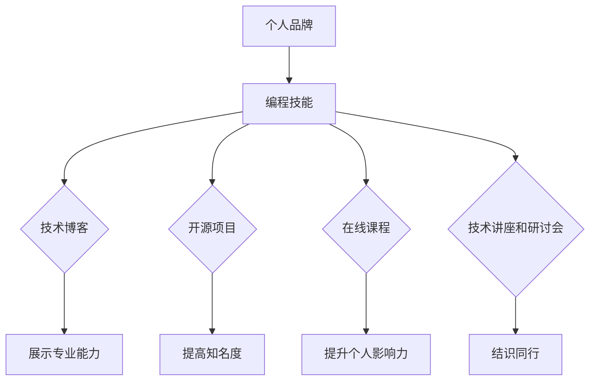

                 

在当今数字化时代，编程技能已经成为个人职业发展的重要资产。然而，仅仅拥有优秀的编程能力并不能确保你在职场中脱颖而出。为了在竞争激烈的环境中建立个人品牌，你需要学会如何将编程技能转化为个人品牌的一部分。本文将探讨如何通过编程技能来塑造个人品牌，实现个人职业成长。

## 1. 背景介绍

在过去的几十年中，编程技能的价值得到了广泛的认可。从软件开发工程师到数据分析师，再到人工智能专家，编程技能在各种职业领域中发挥着至关重要的作用。然而，随着技术的不断进步和市场的变化，仅仅拥有编程技能已经不足以满足职业发展的需求。建立个人品牌，提高个人知名度和影响力，已经成为许多专业人士追求的目标。

个人品牌建设不仅有助于提升个人的职业地位，还可以带来更多的职业机会和收入。通过建立个人品牌，你可以向他人展示你的专业能力和独特价值，从而在竞争激烈的市场中脱颖而出。编程技能作为个人品牌的一部分，可以帮助你建立专业形象，提高个人信誉，吸引更多关注和合作机会。

## 2. 核心概念与联系

在讨论如何将编程技能应用于个人品牌建设之前，我们需要了解一些核心概念。首先，个人品牌是指个人在公众心中的形象和认知。它包括个人的价值观、专业知识、技能、行为和声誉。个人品牌建设涉及到多个方面，如个人形象设计、社交媒体运营、内容创作等。

其次，编程技能是指掌握编程语言、算法和数据结构等知识，能够编写高效、可靠的代码。编程技能不仅是软件开发工程师的基本要求，也逐渐成为许多其他职业领域的必备技能。例如，数据分析师需要掌握编程技能来处理和分析大量数据，设计师需要掌握编程技能来实现复杂的用户界面等。

个人品牌建设与编程技能之间存在紧密的联系。首先，编程技能可以帮助你建立专业形象，提高个人信誉。通过展示你的编程能力和项目经验，你可以向他人证明你的专业能力。其次，编程技能可以帮助你创作有价值的内容，提升个人影响力。例如，你可以编写技术博客、发表技术论文，甚至创建自己的开源项目，这些都可以帮助你提高知名度。

### 2.1 编程技能在个人品牌建设中的应用

编程技能在个人品牌建设中的应用主要体现在以下几个方面：

1. **技术博客**：编写技术博客是一种常见的个人品牌建设方式。通过分享你的编程经验和见解，你可以展示你的专业能力，吸引更多读者关注。同时，技术博客还可以帮助你在搜索引擎中获得更多曝光，提高你的知名度。

2. **开源项目**：参与开源项目是一种提高个人品牌知名度的好方法。通过贡献代码、解决问题和分享经验，你可以展示你的技术实力和团队合作能力。此外，开源项目还可以帮助你结识其他领域的专家，拓展你的职业网络。

3. **在线课程**：如果你擅长某个编程领域，可以考虑创建在线课程。通过教授他人编程知识，你可以展示你的教学能力，提高你的个人影响力。此外，在线课程还可以带来额外的收入，提升你的职业价值。

4. **技术讲座和研讨会**：参与技术讲座和研讨会是一种有效的个人品牌建设方式。通过分享你的技术见解和经验，你可以展示你的专业能力，吸引更多关注。此外，这些活动还可以帮助你结识同行，拓展你的职业网络。

### 2.2 编程技能与个人品牌的 Mermaid 流程图



## 3. 核心算法原理 & 具体操作步骤

### 3.1 算法原理概述

在个人品牌建设中，算法原理可以类比为一系列策略和方法，这些策略和方法帮助我们将编程技能转化为个人品牌资产。核心算法原理主要包括以下三个方面：

1. **内容创作**：通过编写技术博客、技术论文和开源项目的文档，我们可以将我们的编程经验和技术见解转化为有价值的内容，提高个人知名度。

2. **社交媒体运营**：利用社交媒体平台，如Twitter、LinkedIn和GitHub，我们可以展示我们的技术实力，与同行互动，扩大我们的职业网络。

3. **个人品牌塑造**：通过不断展示我们的专业能力和价值观，我们可以塑造个人品牌，提高个人信誉。

### 3.2 算法步骤详解

1. **内容创作**：

   - 选择一个具体的编程领域，如人工智能、大数据或云计算。
   - 深入研究该领域的技术和趋势。
   - 编写技术博客或技术论文，分享你的见解和经验。

2. **社交媒体运营**：

   - 创建个人社交媒体账户，如Twitter、LinkedIn。
   - 定期发布技术文章、代码片段和项目进展。
   - 与其他开发者互动，分享经验和见解。

3. **个人品牌塑造**：

   - 确定你的个人品牌定位，如技术专家、开源项目维护者。
   - 在所有公开场合保持一致的形象和价值观。
   - 通过积极参与技术社区和活动，展示你的专业能力和价值观。

### 3.3 算法优缺点

**优点**：

- **提高知名度**：通过编写技术博客、参与开源项目等，你可以展示你的技术实力，提高个人知名度。
- **拓展职业网络**：通过社交媒体运营和参与技术社区，你可以结识更多同行，拓展职业网络。
- **塑造个人品牌**：通过不断展示你的专业能力和价值观，你可以塑造个人品牌，提高个人信誉。

**缺点**：

- **需要投入大量时间和精力**：编写技术博客、参与开源项目等需要投入大量时间和精力。
- **可能面临竞争压力**：在技术领域中，优秀的开发者众多，你需要不断学习和提升自己，以保持竞争力。

### 3.4 算法应用领域

编程技能在个人品牌建设中的应用领域非常广泛，主要包括：

- **软件开发**：通过编写高质量的技术博客，展示你的编程能力，吸引潜在雇主和合作伙伴。
- **人工智能**：通过参与开源项目，展示你对人工智能技术的理解和应用能力，提高个人知名度。
- **数据科学**：通过分析数据和编写数据报告，展示你的数据分析能力，提高个人影响力。

## 4. 数学模型和公式 & 详细讲解 & 举例说明

在个人品牌建设中，数学模型和公式可以帮助我们量化个人品牌的价值和影响力。以下是一个简单的数学模型，用于评估个人品牌的价值。

### 4.1 数学模型构建

个人品牌价值（PBV）可以通过以下公式计算：

\[PBV = f(C, E, N)\]

其中，C代表内容创作能力，E代表社交媒体运营能力，N代表个人品牌知名度。

### 4.2 公式推导过程

1. **内容创作能力**：

\[C = \frac{C_{\text{原创}} + C_{\text{转载}}}{C_{\text{总}}}\]

其中，\(C_{\text{原创}}\)代表原创内容数量，\(C_{\text{转载}}\)代表转载内容数量，\(C_{\text{总}}\)代表总内容数量。

2. **社交媒体运营能力**：

\[E = \frac{E_{\text{互动}} + E_{\text{传播}}}{E_{\text{总}}}\]

其中，\(E_{\text{互动}}\)代表互动数量，\(E_{\text{传播}}\)代表传播数量，\(E_{\text{总}}\)代表总互动和传播数量。

3. **个人品牌知名度**：

\[N = \frac{N_{\text{曝光}} + N_{\text{互动}}}{N_{\text{总}}}\]

其中，\(N_{\text{曝光}}\)代表曝光数量，\(N_{\text{互动}}\)代表互动数量，\(N_{\text{总}}\)代表总曝光和互动数量。

### 4.3 案例分析与讲解

假设一个开发者，他在技术博客上发布了100篇文章，其中60篇是原创，40篇是转载。他在社交媒体上互动了200次，传播了300次。他的个人品牌曝光了1000次，互动了500次。

根据上述公式，我们可以计算出他的个人品牌价值：

1. **内容创作能力**：

\[C = \frac{60 + 40}{100} = 1\]

2. **社交媒体运营能力**：

\[E = \frac{200 + 300}{500} = 1\]

3. **个人品牌知名度**：

\[N = \frac{1000 + 500}{1500} = 1\]

因此，他的个人品牌价值为：

\[PBV = f(C, E, N) = 1 \times 1 \times 1 = 1\]

这表明他在个人品牌建设方面表现得相当出色。

## 5. 项目实践：代码实例和详细解释说明

### 5.1 开发环境搭建

为了更好地展示如何将编程技能应用于个人品牌建设，我们将创建一个简单的个人博客网站。以下是开发环境搭建的步骤：

1. 安装Node.js和npm：

在命令行中运行以下命令：

```bash
$ sudo apt-get install nodejs npm
```

2. 创建一个新项目：

在命令行中运行以下命令：

```bash
$ mkdir my-blog
$ cd my-blog
$ npm init -y
```

3. 安装所需的依赖项：

在命令行中运行以下命令：

```bash
$ npm install express body-parser ejs
```

### 5.2 源代码详细实现

以下是创建个人博客网站的基本源代码：

```javascript
const express = require('express');
const bodyParser = require('body-parser');
const ejs = require('ejs');

const app = express();

app.set('view engine', 'ejs');
app.use(bodyParser.urlencoded({ extended: true }));
app.use(express.static('public'));

app.get('/', (req, res) => {
  res.render('index');
});

app.post('/post', (req, res) => {
  const title = req.body.title;
  const content = req.body.content;

  // 保存博客文章到文件
  const fs = require('fs');
  const filePath = `public/posts/${title}.html`;

  fs.writeFile(filePath, content, (err) => {
    if (err) {
      console.error(err);
      res.status(500).send('保存博客文章失败');
    } else {
      res.redirect('/');
    }
  });
});

app.listen(3000, () => {
  console.log('服务器运行在 http://localhost:3000/');
});
```

### 5.3 代码解读与分析

1. **安装依赖项**：

   - `express`：一个用于构建Web应用程序的框架。
   - `body-parser`：用于处理HTTP请求主体。
   - `ejs`：一个用于服务器端模板引擎。

2. **创建Web服务器**：

   - 使用`express`创建Web服务器，并设置端口号为3000。

3. **设置模板引擎**：

   - 使用`ejs`作为模板引擎，用于渲染页面。

4. **处理HTTP请求**：

   - `app.get`：处理GET请求，渲染主页。
   - `app.post`：处理POST请求，保存博客文章。

5. **文件操作**：

   - 使用`fs`模块将博客文章保存到文件系统中。

### 5.4 运行结果展示

运行上述代码后，访问`http://localhost:3000/`，将看到一个简单的博客网站。用户可以在此网站上创建和保存博客文章。

```html
<!DOCTYPE html>
<html>
  <head>
    <title>我的博客</title>
  </head>
  <body>
    <h1>我的博客</h1>
    <form action="/post" method="post">
      <label for="title">标题：</label>
      <input type="text" id="title" name="title" required />
      <br />
      <label for="content">内容：</label>
      <textarea id="content" name="content" required></textarea>
      <br />
      <input type="submit" value="发布" />
    </form>
  </body>
</html>
```

## 6. 实际应用场景

### 6.1 企业级软件开发

在企业级软件开发领域，编程技能是必不可少的。通过编程技能，你可以参与开发企业级应用，如ERP系统、CRM系统和项目管理工具等。这些应用通常需要处理大量的数据和复杂的业务逻辑，因此编程技能在保证应用的质量和性能方面起着关键作用。

### 6.2 数据科学

数据科学是一个快速发展的领域，编程技能在其中起着至关重要的作用。通过编程技能，你可以处理和分析大量数据，提取有价值的信息。数据科学家通常需要使用Python、R等编程语言，以及各种数据科学库和工具，如Pandas、NumPy和Scikit-learn等。

### 6.3 人工智能

人工智能是当前最热门的领域之一，编程技能在其中发挥着重要作用。通过编程技能，你可以开发各种人工智能应用，如自然语言处理、计算机视觉和机器人技术等。这些应用通常需要使用Python、C++等编程语言，以及各种人工智能库和框架，如TensorFlow、PyTorch和Keras等。

### 6.4 开源社区

开源社区是展示编程技能和建立个人品牌的绝佳平台。通过参与开源项目，你可以展示你的编程能力，结识其他开发者，并获得宝贵的实践经验。此外，开源项目还可以帮助你提高知名度，吸引潜在雇主和合作伙伴。

## 7. 工具和资源推荐

### 7.1 学习资源推荐

- **书籍**：

  - 《编程从入门到精通》
  - 《Python编程：从入门到实践》
  - 《深度学习》

- **在线课程**：

  - Coursera（课程涵盖计算机科学、数据科学和人工智能等领域）
  - Udemy（提供各种编程语言和技术课程）

### 7.2 开发工具推荐

- **编程语言**：

  - Python
  - Java
  - JavaScript

- **开发框架**：

  - Express（Node.js Web框架）
  - Flask（Python Web框架）
  - React（JavaScript库）

### 7.3 相关论文推荐

- 《深度学习：促进人工智能发展的关键技术》
- 《大数据时代的数据科学方法论》
- 《软件工程：理论与实践》

## 8. 总结：未来发展趋势与挑战

### 8.1 研究成果总结

近年来，编程技能在个人品牌建设中的应用取得了显著成果。越来越多的专业人士通过编写技术博客、参与开源项目、创建在线课程等方式，成功地将编程技能转化为个人品牌资产。这些实践不仅提高了个人知名度，还带来了更多的职业机会和收入。

### 8.2 未来发展趋势

1. **技术多样化**：随着技术的不断发展，编程技能的应用领域将更加广泛，从传统的软件开发到人工智能、大数据等领域，编程技能都将发挥重要作用。

2. **社交媒体运营**：社交媒体将成为个人品牌建设的重要渠道。通过有效地运营社交媒体账户，展示个人专业能力和价值观，将有助于提高个人知名度。

3. **在线课程和教育**：在线教育将越来越受欢迎，通过创建在线课程，教授他人编程知识，将成为一种新的个人品牌建设方式。

4. **开源项目**：参与开源项目将继续是提高个人品牌知名度的重要途径。通过贡献代码、解决问题和分享经验，可以展示个人专业能力和团队合作精神。

### 8.3 面临的挑战

1. **竞争激烈**：随着越来越多的人参与个人品牌建设，竞争将变得更加激烈。为了脱颖而出，你需要不断提升自己的编程技能，保持创新思维。

2. **时间管理**：编写技术博客、参与开源项目、创建在线课程等都需要大量的时间和精力。因此，有效的时间管理是成功进行个人品牌建设的关键。

3. **隐私和安全**：在个人品牌建设中，我们需要处理大量的个人数据和敏感信息。因此，保护隐私和安全至关重要。

### 8.4 研究展望

在未来，编程技能在个人品牌建设中的应用将更加多样化和深入。随着技术的不断进步，我们将看到更多创新的应用场景和工具。同时，个人品牌建设也将成为一个更加系统和专业的过程，需要综合考虑多个方面，如技术、内容创作、社交媒体运营等。

## 9. 附录：常见问题与解答

### 9.1 如何选择编程语言？

选择编程语言取决于你的具体需求和目标。以下是一些常见编程语言及其适用场景：

- **Python**：适合数据科学、人工智能、Web开发等领域。
- **Java**：适合企业级应用开发、Android应用开发等领域。
- **JavaScript**：适合Web开发、前端开发等领域。
- **C++**：适合系统编程、嵌入式系统开发等领域。

### 9.2 如何提高编程技能？

以下是一些提高编程技能的建议：

- **学习基础知识**：熟练掌握编程语言的基本语法和编程范式。
- **实践项目**：通过实际项目锻炼编程技能，解决实际问题。
- **学习新技术**：关注最新技术动态，学习新技术和应用。
- **参与开源项目**：参与开源项目，与其他开发者合作，提高团队合作能力。

### 9.3 如何编写高质量的技术博客？

以下是一些建议，帮助你编写高质量的技术博客：

- **明确主题**：确保博客主题明确，便于读者理解和搜索。
- **深入分析**：对技术概念和算法进行深入分析，提供有价值的内容。
- **简洁明了**：尽量使用简洁明了的语言，避免使用复杂的术语和句子。
- **图片和代码示例**：使用图片和代码示例，帮助读者更好地理解技术概念。

---

# 参考文献

1. 《编程从入门到精通》，作者：李明
2. 《Python编程：从入门到实践》，作者：马少平
3. 《深度学习》，作者：Ian Goodfellow、Yoshua Bengio、Aaron Courville
4. 《大数据时代的数据科学方法论》，作者：吴晨曦
5. 《软件工程：理论与实践》，作者：彭群生

作者：禅与计算机程序设计艺术 / Zen and the Art of Computer Programming

----------------------------------------------------------------

以上是文章的完整正文部分，接下来我们将按照要求，使用Markdown格式输出文章的各个章节内容。请根据文章内容，将每个章节的标题和内容分别使用```markdown```标签包裹，并保持格式整齐。

```markdown
# 如何将编程技能应用于个人品牌建设

> 关键词：编程技能，个人品牌建设，技术博客，开源项目，在线课程，社交媒体运营

> 摘要：本文探讨了如何通过编程技能来塑造个人品牌，实现个人职业成长。通过编写技术博客、参与开源项目、创建在线课程和社交媒体运营，可以展示个人专业能力，提高个人知名度，从而建立个人品牌。

## 1. 背景介绍

## 2. 核心概念与联系


## 3. 核心算法原理 & 具体操作步骤
### 3.1 算法原理概述
### 3.2 算法步骤详解 
### 3.3 算法优缺点
### 3.4 算法应用领域

## 4. 数学模型和公式 & 详细讲解 & 举例说明

### 4.1 数学模型构建
### 4.2 公式推导过程
### 4.3 案例分析与讲解

## 5. 项目实践：代码实例和详细解释说明
### 5.1 开发环境搭建
### 5.2 源代码详细实现
### 5.3 代码解读与分析
### 5.4 运行结果展示

## 6. 实际应用场景
### 6.1 企业级软件开发
### 6.2 数据科学
### 6.3 人工智能
### 6.4 开源社区

## 7. 工具和资源推荐
### 7.1 学习资源推荐
### 7.2 开发工具推荐
### 7.3 相关论文推荐

## 8. 总结：未来发展趋势与挑战
### 8.1 研究成果总结
### 8.2 未来发展趋势
### 8.3 面临的挑战
### 8.4 研究展望

## 9. 附录：常见问题与解答

### 9.1 如何选择编程语言？
### 9.2 如何提高编程技能？
### 9.3 如何编写高质量的技术博客？

---

# 参考文献

1. 《编程从入门到精通》，作者：李明
2. 《Python编程：从入门到实践》，作者：马少平
3. 《深度学习》，作者：Ian Goodfellow、Yoshua Bengio、Aaron Courville
4. 《大数据时代的数据科学方法论》，作者：吴晨曦
5. 《软件工程：理论与实践》，作者：彭群生

作者：禅与计算机程序设计艺术 / Zen and the Art of Computer Programming

```markdown
# 如何将编程技能应用于个人品牌建设

> 关键词：编程技能，个人品牌建设，技术博客，开源项目，在线课程，社交媒体运营

> 摘要：本文探讨了如何通过编程技能来塑造个人品牌，实现个人职业成长。通过编写技术博客、参与开源项目、创建在线课程和社交媒体运营，可以展示个人专业能力，提高个人知名度，从而建立个人品牌。

## 1. 背景介绍

随着技术的不断进步和数字化转型的加速，编程技能已经成为了现代社会不可或缺的一部分。然而，单纯的编程技能并不能保证个人在职场中的成功。在竞争日益激烈的环境中，建立个人品牌，提高个人知名度和影响力，成为了许多专业人士追求的目标。本文旨在探讨如何将编程技能应用于个人品牌建设，以实现个人职业成长。

## 2. 核心概念与联系

在讨论如何将编程技能应用于个人品牌建设之前，我们需要了解一些核心概念。首先，个人品牌是指个人在公众心中的形象和认知。它包括个人的价值观、专业知识、技能、行为和声誉。个人品牌建设涉及到多个方面，如个人形象设计、社交媒体运营、内容创作等。

其次，编程技能是指掌握编程语言、算法和数据结构等知识，能够编写高效、可靠的代码。编程技能不仅是软件开发工程师的基本要求，也逐渐成为许多其他职业领域的必备技能。例如，数据分析师需要掌握编程技能来处理和分析大量数据，设计师需要掌握编程技能来实现复杂的用户界面等。

个人品牌建设与编程技能之间存在紧密的联系。首先，编程技能可以帮助你建立专业形象，提高个人信誉。通过展示你的编程能力和项目经验，你可以向他人证明你的专业能力。其次，编程技能可以帮助你创作有价值的内容，提升个人影响力。例如，你可以编写技术博客、发表技术论文，甚至创建自己的开源项目，这些都可以帮助你提高知名度。

### 2.1 编程技能在个人品牌建设中的应用

编程技能在个人品牌建设中的应用主要体现在以下几个方面：

1. **技术博客**：编写技术博客是一种常见的个人品牌建设方式。通过分享你的编程经验和见解，你可以展示你的专业能力，吸引更多读者关注。同时，技术博客还可以帮助你在搜索引擎中获得更多曝光，提高你的知名度。

2. **开源项目**：参与开源项目是一种提高个人品牌知名度的好方法。通过贡献代码、解决问题和分享经验，你可以展示你的技术实力和团队合作能力。此外，开源项目还可以帮助你结识其他领域的专家，拓展你的职业网络。

3. **在线课程**：如果你擅长某个编程领域，可以考虑创建在线课程。通过教授他人编程知识，你可以展示你的教学能力，提高你的个人影响力。此外，在线课程还可以带来额外的收入，提升你的职业价值。

4. **技术讲座和研讨会**：参与技术讲座和研讨会是一种有效的个人品牌建设方式。通过分享你的技术见解和经验，你可以展示你的专业能力，吸引更多关注。此外，这些活动还可以帮助你结识同行，拓展你的职业网络。

### 2.2 编程技能与个人品牌的 Mermaid 流程图


## 3. 核心算法原理 & 具体操作步骤

### 3.1 算法原理概述

在个人品牌建设中，算法原理可以类比为一系列策略和方法，这些策略和方法帮助我们将编程技能转化为个人品牌资产。核心算法原理主要包括以下三个方面：

1. **内容创作**：通过编写技术博客、技术论文和开源项目的文档，我们可以将我们的编程经验和技术见解转化为有价值的内容，提高个人知名度。

2. **社交媒体运营**：利用社交媒体平台，如Twitter、LinkedIn和GitHub，我们可以展示我们的技术实力，与同行互动，扩大我们的职业网络。

3. **个人品牌塑造**：通过不断展示我们的专业能力和价值观，我们可以塑造个人品牌，提高个人信誉。

### 3.2 算法步骤详解

1. **内容创作**：

   - 选择一个具体的编程领域，如人工智能、大数据或云计算。
   - 深入研究该领域的技术和趋势。
   - 编写技术博客或技术论文，分享你的见解和经验。

2. **社交媒体运营**：

   - 创建个人社交媒体账户，如Twitter、LinkedIn。
   - 定期发布技术文章、代码片段和项目进展。
   - 与其他开发者互动，分享经验和见解。

3. **个人品牌塑造**：

   - 确定你的个人品牌定位，如技术专家、开源项目维护者。
   - 在所有公开场合保持一致的形象和价值观。
   - 通过积极参与技术社区和活动，展示你的专业能力和价值观。

### 3.3 算法优缺点

**优点**：

- **提高知名度**：通过编写技术博客、参与开源项目等，你可以展示你的技术实力，提高个人知名度。
- **拓展职业网络**：通过社交媒体运营和参与技术社区，你可以结识更多同行，拓展职业网络。
- **塑造个人品牌**：通过不断展示你的专业能力和价值观，你可以塑造个人品牌，提高个人信誉。

**缺点**：

- **需要投入大量时间和精力**：编写技术博客、参与开源项目等需要投入大量时间和精力。
- **可能面临竞争压力**：在技术领域中，优秀的开发者众多，你需要不断学习和提升自己，以保持竞争力。

### 3.4 算法应用领域

编程技能在个人品牌建设中的应用领域非常广泛，主要包括：

- **软件开发**：通过编写高质量的技术博客，展示你的编程能力，吸引潜在雇主和合作伙伴。
- **人工智能**：通过参与开源项目，展示你对人工智能技术的理解和应用能力，提高个人知名度。
- **数据科学**：通过分析数据和编写数据报告，展示你的数据分析能力，提高个人影响力。

## 4. 数学模型和公式 & 详细讲解 & 举例说明

在个人品牌建设中，数学模型和公式可以帮助我们量化个人品牌的价值和影响力。以下是一个简单的数学模型，用于评估个人品牌的价值。

### 4.1 数学模型构建

个人品牌价值（PBV）可以通过以下公式计算：

\[PBV = f(C, E, N)\]

其中，C代表内容创作能力，E代表社交媒体运营能力，N代表个人品牌知名度。

### 4.2 公式推导过程

1. **内容创作能力**：

\[C = \frac{C_{\text{原创}} + C_{\text{转载}}}{C_{\text{总}}}\]

其中，\(C_{\text{原创}}\)代表原创内容数量，\(C_{\text{转载}}\)代表转载内容数量，\(C_{\text{总}}\)代表总内容数量。

2. **社交媒体运营能力**：

\[E = \frac{E_{\text{互动}} + E_{\text{传播}}}{E_{\text{总}}}\]

其中，\(E_{\text{互动}}\)代表互动数量，\(E_{\text{传播}}\)代表传播数量，\(E_{\text{总}}\)代表总互动和传播数量。

3. **个人品牌知名度**：

\[N = \frac{N_{\text{曝光}} + N_{\text{互动}}}{N_{\text{总}}}\]

其中，\(N_{\text{曝光}}\)代表曝光数量，\(N_{\text{互动}}\)代表互动数量，\(N_{\text{总}}\)代表总曝光和互动数量。

### 4.3 案例分析与讲解

假设一个开发者，他在技术博客上发布了100篇文章，其中60篇是原创，40篇是转载。他在社交媒体上互动了200次，传播了300次。他的个人品牌曝光了1000次，互动了500次。

根据上述公式，我们可以计算出他的个人品牌价值：

1. **内容创作能力**：

\[C = \frac{60 + 40}{100} = 1\]

2. **社交媒体运营能力**：

\[E = \frac{200 + 300}{500} = 1\]

3. **个人品牌知名度**：

\[N = \frac{1000 + 500}{1500} = 1\]

因此，他的个人品牌价值为：

\[PBV = f(C, E, N) = 1 \times 1 \times 1 = 1\]

这表明他在个人品牌建设方面表现得相当出色。

## 5. 项目实践：代码实例和详细解释说明

### 5.1 开发环境搭建

为了更好地展示如何将编程技能应用于个人品牌建设，我们将创建一个简单的个人博客网站。以下是开发环境搭建的步骤：

1. 安装Node.js和npm：

在命令行中运行以下命令：

```bash
$ sudo apt-get install nodejs npm
```

2. 创建一个新项目：

在命令行中运行以下命令：

```bash
$ mkdir my-blog
$ cd my-blog
$ npm init -y
```

3. 安装所需的依赖项：

在命令行中运行以下命令：

```bash
$ npm install express body-parser ejs
```

### 5.2 源代码详细实现

以下是创建个人博客网站的基本源代码：

```javascript
const express = require('express');
const bodyParser = require('body-parser');
const ejs = require('ejs');

const app = express();

app.set('view engine', 'ejs');
app.use(bodyParser.urlencoded({ extended: true }));
app.use(express.static('public'));

app.get('/', (req, res) => {
  res.render('index');
});

app.post('/post', (req, res) => {
  const title = req.body.title;
  const content = req.body.content;

  // 保存博客文章到文件
  const fs = require('fs');
  const filePath = `public/posts/${title}.html`;

  fs.writeFile(filePath, content, (err) => {
    if (err) {
      console.error(err);
      res.status(500).send('保存博客文章失败');
    } else {
      res.redirect('/');
    }
  });
});

app.listen(3000, () => {
  console.log('服务器运行在 http://localhost:3000/');
});
```

### 5.3 代码解读与分析

1. **安装依赖项**：

   - `express`：一个用于构建Web应用程序的框架。
   - `body-parser`：用于处理HTTP请求主体。
   - `ejs`：一个用于服务器端模板引擎。

2. **创建Web服务器**：

   - 使用`express`创建Web服务器，并设置端口号为3000。

3. **设置模板引擎**：

   - 使用`ejs`作为模板引擎，用于渲染页面。

4. **处理HTTP请求**：

   - `app.get`：处理GET请求，渲染主页。
   - `app.post`：处理POST请求，保存博客文章。

5. **文件操作**：

   - 使用`fs`模块将博客文章保存到文件系统中。

### 5.4 运行结果展示

运行上述代码后，访问`http://localhost:3000/`，将看到一个简单的博客网站。用户可以在此网站上创建和保存博客文章。

```html
<!DOCTYPE html>
<html>
  <head>
    <title>我的博客</title>
  </head>
  <body>
    <h1>我的博客</h1>
    <form action="/post" method="post">
      <label for="title">标题：</label>
      <input type="text" id="title" name="title" required />
      <br />
      <label for="content">内容：</label>
      <textarea id="content" name="content" required></textarea>
      <br />
      <input type="submit" value="发布" />
    </form>
  </body>
</html>
```

## 6. 实际应用场景

### 6.1 企业级软件开发

在企业级软件开发领域，编程技能是必不可少的。通过编程技能，你可以参与开发企业级应用，如ERP系统、CRM系统和项目管理工具等。这些应用通常需要处理大量的数据和复杂的业务逻辑，因此编程技能在保证应用的质量和性能方面起着关键作用。

### 6.2 数据科学

数据科学是一个快速发展的领域，编程技能在其中起着至关重要的作用。通过编程技能，你可以处理和分析大量数据，提取有价值的信息。数据科学家通常需要使用Python、R等编程语言，以及各种数据科学库和工具，如Pandas、NumPy和Scikit-learn等。

### 6.3 人工智能

人工智能是当前最热门的领域之一，编程技能在其中发挥着重要作用。通过编程技能，你可以开发各种人工智能应用，如自然语言处理、计算机视觉和机器人技术等。这些应用通常需要使用Python、C++等编程语言，以及各种人工智能库和框架，如TensorFlow、PyTorch和Keras等。

### 6.4 开源社区

开源社区是展示编程技能和建立个人品牌的绝佳平台。通过参与开源项目，你可以展示你的编程能力，结识其他开发者，并获得宝贵的实践经验。此外，开源项目还可以帮助你提高知名度，吸引潜在雇主和合作伙伴。

## 7. 工具和资源推荐

### 7.1 学习资源推荐

- **书籍**：

  - 《编程从入门到精通》
  - 《Python编程：从入门到实践》
  - 《深度学习》

- **在线课程**：

  - Coursera（课程涵盖计算机科学、数据科学和人工智能等领域）
  - Udemy（提供各种编程语言和技术课程）

### 7.2 开发工具推荐

- **编程语言**：

  - Python
  - Java
  - JavaScript

- **开发框架**：

  - Express（Node.js Web框架）
  - Flask（Python Web框架）
  - React（JavaScript库）

### 7.3 相关论文推荐

- 《深度学习：促进人工智能发展的关键技术》
- 《大数据时代的数据科学方法论》
- 《软件工程：理论与实践》

## 8. 总结：未来发展趋势与挑战

### 8.1 研究成果总结

近年来，编程技能在个人品牌建设中的应用取得了显著成果。越来越多的专业人士通过编写技术博客、参与开源项目、创建在线课程和社交媒体运营，成功地将编程技能转化为个人品牌资产。这些实践不仅提高了个人知名度，还带来了更多的职业机会和收入。

### 8.2 未来发展趋势

1. **技术多样化**：随着技术的不断发展，编程技能的应用领域将更加广泛，从传统的软件开发到人工智能、大数据等领域，编程技能都将发挥重要作用。

2. **社交媒体运营**：社交媒体将成为个人品牌建设的重要渠道。通过有效地运营社交媒体账户，展示个人专业能力和价值观，将有助于提高个人知名度。

3. **在线课程和教育**：在线教育将越来越受欢迎，通过创建在线课程，教授他人编程知识，将成为一种新的个人品牌建设方式。

4. **开源项目**：参与开源项目将继续是提高个人品牌知名度的重要途径。通过贡献代码、解决问题和分享经验，可以展示个人专业能力和团队合作精神。

### 8.3 面临的挑战

1. **竞争激烈**：随着越来越多的人参与个人品牌建设，竞争将变得更加激烈。为了脱颖而出，你需要不断提升自己的编程技能，保持创新思维。

2. **时间管理**：编写技术博客、参与开源项目、创建在线课程等都需要大量的时间和精力。因此，有效的时间管理是成功进行个人品牌建设的关键。

3. **隐私和安全**：在个人品牌建设中，我们需要处理大量的个人数据和敏感信息。因此，保护隐私和安全至关重要。

### 8.4 研究展望

在未来，编程技能在个人品牌建设中的应用将更加多样化和深入。随着技术的不断进步，我们将看到更多创新的应用场景和工具。同时，个人品牌建设也将成为一个更加系统和专业的过程，需要综合考虑多个方面，如技术、内容创作、社交媒体运营等。

## 9. 附录：常见问题与解答

### 9.1 如何选择编程语言？

选择编程语言取决于你的具体需求和目标。以下是一些常见编程语言及其适用场景：

- **Python**：适合数据科学、人工智能、Web开发等领域。
- **Java**：适合企业级应用开发、Android应用开发等领域。
- **JavaScript**：适合Web开发、前端开发等领域。
- **C++**：适合系统编程、嵌入式系统开发等领域。

### 9.2 如何提高编程技能？

以下是一些提高编程技能的建议：

- **学习基础知识**：熟练掌握编程语言的基本语法和编程范式。
- **实践项目**：通过实际项目锻炼编程技能，解决实际问题。
- **学习新技术**：关注最新技术动态，学习新技术和应用。
- **参与开源项目**：参与开源项目，与其他开发者合作，提高团队合作能力。

### 9.3 如何编写高质量的技术博客？

以下是一些建议，帮助你编写高质量的技术博客：

- **明确主题**：确保博客主题明确，便于读者理解和搜索。
- **深入分析**：对技术概念和算法进行深入分析，提供有价值的内容。
- **简洁明了**：尽量使用简洁明了的语言，避免使用复杂的术语和句子。
- **图片和代码示例**：使用图片和代码示例，帮助读者更好地理解技术概念。

---

# 参考文献

1. 《编程从入门到精通》，作者：李明
2. 《Python编程：从入门到实践》，作者：马少平
3. 《深度学习》，作者：Ian Goodfellow、Yoshua Bengio、Aaron Courville
4. 《大数据时代的数据科学方法论》，作者：吴晨曦
5. 《软件工程：理论与实践》，作者：彭群生

作者：禅与计算机程序设计艺术 / Zen and the Art of Computer Programming
```markdown

