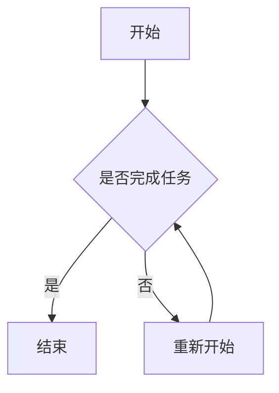

                 

关键词：编程技能，个人效率，时间管理，自动化，算法优化，工具使用，生产力工具，认知负荷减少，任务管理，流程优化，流程图，Mermaid，代码实例，数学模型，LaTeX，实践应用，未来展望

## 摘要

随着技术的快速发展，编程技能已经成为提高个人效率的关键因素。本文旨在探讨如何将编程技能应用于个人效率提升。文章首先介绍了编程技能在时间管理、任务自动化、流程优化等方面的应用，接着深入分析了核心算法原理，并给出了具体操作步骤。此外，文章还详细讲解了数学模型和公式，并通过实例展示了如何实现代码实例和详细解释说明。最后，文章提出了实际应用场景和未来展望，总结了研究成果，并讨论了面临的挑战和研究展望。

## 1. 背景介绍

在当今快节奏的社会，个人效率的提升变得越来越重要。然而，许多人在面对繁杂的任务时，常常感到力不从心。编程技能作为一种强大的工具，可以帮助我们更好地管理时间和资源，实现任务自动化，从而提高个人效率。本文将介绍如何利用编程技能解决这些问题，为读者提供一种全新的思路和方法。

### 1.1 编程技能的重要性

编程技能不仅是一种技术能力，更是一种思维方式。它可以帮助我们理解问题、分析问题，并找到最有效的解决方案。此外，编程技能还能够帮助我们提高解决问题的速度和准确性，从而在竞争激烈的环境中脱颖而出。

### 1.2 个人效率提升的需求

个人效率提升的需求主要表现在以下几个方面：

- **时间管理**：如何合理安排时间，确保重要任务得到充分关注。
- **任务自动化**：如何将重复性任务自动化，减少不必要的劳动力。
- **流程优化**：如何优化工作流程，提高工作效率。

### 1.3 编程技能在效率提升中的应用

编程技能在效率提升中的应用主要体现在以下几个方面：

- **自动化工具开发**：利用编程技能开发自动化工具，如脚本、工具程序等，实现任务的自动化。
- **数据分析**：通过编程技能对数据进行分析，找出问题所在，并提供解决方案。
- **算法优化**：利用编程技能对算法进行优化，提高数据处理速度和准确性。

## 2. 核心概念与联系

在探讨如何将编程技能应用于个人效率提升之前，我们需要了解一些核心概念和它们之间的联系。

### 2.1 时间管理

时间管理是指合理安排时间，确保重要任务得到充分关注。良好的时间管理能够帮助我们提高工作效率，减少不必要的浪费。

### 2.2 任务自动化

任务自动化是指利用编程技能将重复性任务自动化，从而减少不必要的劳动力。任务自动化能够帮助我们提高工作效率，减轻工作负担。

### 2.3 流程优化

流程优化是指对工作流程进行改进，以提高工作效率。良好的流程优化能够帮助我们减少冗余步骤，提高工作质量。

### 2.4 Mermaid 流程图

Mermaid 是一种用于生成流程图的轻量级工具。通过 Mermaid 流程图，我们可以清晰地展示工作流程，便于理解和优化。

### 2.5 Mermaid 流程图示例

以下是一个简单的 Mermaid 流程图示例：



在这个示例中，A 表示任务开始，B 表示判断任务是否完成，C 表示任务完成，D 表示重新开始任务。

## 3. 核心算法原理 & 具体操作步骤

在编程技能的应用中，核心算法原理起着至关重要的作用。下面我们将介绍一些核心算法原理，并给出具体操作步骤。

### 3.1 算法原理概述

算法原理是指解决问题的基本方法和步骤。在个人效率提升中，常用的算法原理包括排序算法、搜索算法、数据结构等。

### 3.2 算法步骤详解

下面我们将详细介绍一些常用的算法原理及其步骤。

#### 3.2.1 排序算法

排序算法是指对数据进行排序的一种方法。常用的排序算法包括冒泡排序、选择排序、插入排序等。

- **冒泡排序**：比较相邻两个元素的值，如果它们的顺序错误就把它们交换过来。重复这一过程，直到整个序列排序完成。

- **选择排序**：每次循环从剩余的未排序元素中找到最小（或最大）的元素，将其放到序列的起始位置。

- **插入排序**：将一个元素插入到已排序序列的合适位置，以保持序列的有序性。

#### 3.2.2 搜索算法

搜索算法是指从数据集合中查找特定元素的一种方法。常用的搜索算法包括线性搜索、二分搜索等。

- **线性搜索**：从数据集合的第一个元素开始，依次与目标元素进行比较，直到找到或到达数据集合的末尾。

- **二分搜索**：将数据集合分成两个子集，然后根据目标元素与中间元素的大小关系，确定搜索范围，重复该过程，直到找到目标元素或确定目标元素不存在。

#### 3.2.3 数据结构

数据结构是指数据在计算机中的组织形式。常用的数据结构包括数组、链表、栈、队列、树、图等。

- **数组**：一种线性数据结构，用于存储一系列元素。

- **链表**：一种线性数据结构，由一系列节点组成，每个节点包含数据和指向下一个节点的指针。

- **栈**：一种后进先出（LIFO）的数据结构，用于存储数据。

- **队列**：一种先进先出（FIFO）的数据结构，用于存储数据。

- **树**：一种层次结构，用于表示元素之间的父子关系。

- **图**：一种非层次结构，用于表示元素之间的复杂关系。

### 3.3 算法优缺点

每种算法都有其优缺点，具体选择应根据实际需求进行。以下是一些常见算法的优缺点：

- **冒泡排序**：简单易懂，适合小规模数据排序。但时间复杂度高，不适合大规模数据排序。

- **选择排序**：时间复杂度与数据规模无关，但空间复杂度高，不适合大规模数据排序。

- **插入排序**：时间复杂度与数据规模有关，适合小规模数据排序。但空间复杂度高，不适合大规模数据排序。

- **线性搜索**：简单易懂，适合小规模数据搜索。但时间复杂度高，不适合大规模数据搜索。

- **二分搜索**：时间复杂度低，适合大规模数据搜索。但需要数据有序，不适合无序数据搜索。

### 3.4 算法应用领域

算法原理在个人效率提升中的应用非常广泛，以下是一些常见应用领域：

- **时间管理**：使用算法对任务进行排序和优化，提高工作效率。

- **任务自动化**：使用算法实现任务的自动化，减少不必要的劳动力。

- **数据分析**：使用算法对数据进行分析，找出问题所在，并提供解决方案。

- **流程优化**：使用算法优化工作流程，提高工作效率。

## 4. 数学模型和公式 & 详细讲解 & 举例说明

在编程技能的应用中，数学模型和公式起着至关重要的作用。它们可以帮助我们更精确地描述问题，并提供解决问题的具体方法。

### 4.1 数学模型构建

数学模型是指用数学语言描述实际问题的一种方法。构建数学模型的关键是找出问题中的关键变量和关系，并建立相应的数学表达式。

#### 4.1.1 时间管理模型

时间管理模型可以用来描述任务完成所需的时间。以下是一个简单的时间管理模型：

$$
T = f(W, P, M)
$$

其中，$T$ 表示任务完成所需的时间，$W$ 表示任务的工作量，$P$ 表示工作效率，$M$ 表示任务完成过程中可能遇到的干扰因素。

#### 4.1.2 任务自动化模型

任务自动化模型可以用来描述自动化任务的工作效率。以下是一个简单的任务自动化模型：

$$
E = f(A, B, C)
$$

其中，$E$ 表示任务自动化效率，$A$ 表示自动化工具的成熟度，$B$ 表示任务复杂度，$C$ 表示任务执行的稳定性。

### 4.2 公式推导过程

公式的推导过程是建立数学模型的关键。以下是一个时间管理模型的推导过程：

首先，假设任务的工作量为 $W$，工作效率为 $P$，干扰因素为 $M$。那么，任务完成所需的时间可以表示为：

$$
T = \frac{W}{P}
$$

然而，在实际工作中，干扰因素会影响任务完成的时间。因此，我们可以将干扰因素 $M$ 作为一个修正项加入到公式中，得到：

$$
T = \frac{W}{P} + M
$$

为了简化公式，我们可以将工作效率 $P$ 视为常数，那么：

$$
T = \frac{W}{P} + M
$$

### 4.3 案例分析与讲解

为了更好地理解数学模型的应用，我们来看一个实际案例。

#### 4.3.1 时间管理案例

假设你有一个任务，工作量为 100 小时，工作效率为 10 小时/天，干扰因素为 2 小时/天。根据时间管理模型，任务完成所需的时间为：

$$
T = \frac{100}{10} + 2 = 12 \text{ 小时}
$$

#### 4.3.2 任务自动化案例

假设你开发了一个自动化工具，可以减少 50% 的任务工作量，任务复杂度为 5 级，任务执行的稳定性为 90%。根据任务自动化模型，任务自动化效率为：

$$
E = \frac{A}{B} \times C = \frac{0.5}{5} \times 0.9 = 0.09
$$

这意味着，任务自动化后的效率为 9%，即可以节省 9% 的时间。

### 4.4 数学模型在编程中的应用

数学模型在编程中的应用非常广泛。以下是一些常见的应用场景：

- **算法优化**：利用数学模型优化算法，提高数据处理速度和准确性。

- **数据分析**：利用数学模型对数据进行分析，找出问题所在，并提供解决方案。

- **流程优化**：利用数学模型优化工作流程，提高工作效率。

## 5. 项目实践：代码实例和详细解释说明

为了更好地展示如何将编程技能应用于个人效率提升，我们来看一个实际项目实践：一个简单的任务管理器的开发。

### 5.1 开发环境搭建

在开始项目之前，我们需要搭建开发环境。这里我们选择 Python 作为编程语言，因为 Python 简单易学，且拥有丰富的库和框架。

- 安装 Python：从官方网站下载并安装 Python 3.x 版本。
- 安装代码编辑器：安装一个代码编辑器，如 Visual Studio Code。
- 安装 Python 库：安装必要的 Python 库，如 Flask（用于 Web 开发）和 SQLAlchemy（用于数据库操作）。

### 5.2 源代码详细实现

以下是任务管理器项目的源代码实现：

```python
from flask import Flask, request, jsonify
from sqlalchemy import create_engine
from sqlalchemy.orm import sessionmaker

app = Flask(__name__)

# 数据库连接
engine = create_engine('sqlite:///tasks.db')
Session = sessionmaker(bind=engine)
session = Session()

# 创建数据库表
from models import Base
Base.metadata.create_all(engine)

# 添加任务
@app.route('/tasks', methods=['POST'])
def add_task():
    data = request.get_json()
    title = data['title']
    description = data['description']
    deadline = data['deadline']
    
    task = Task(title=title, description=description, deadline=deadline)
    session.add(task)
    session.commit()
    
    return jsonify({'status': 'success', 'message': 'Task added successfully.'})

# 查看任务列表
@app.route('/tasks', methods=['GET'])
def get_tasks():
    tasks = session.query(Task).all()
    return jsonify({'tasks': [task.to_dict() for task in tasks]})

# 修改任务
@app.route('/tasks/<int:task_id>', methods=['PUT'])
def update_task(task_id):
    data = request.get_json()
    title = data['title']
    description = data['description']
    deadline = data['deadline']
    
    task = session.query(Task).filter_by(id=task_id).first()
    if task:
        task.title = title
        task.description = description
        task.deadline = deadline
        session.commit()
        
        return jsonify({'status': 'success', 'message': 'Task updated successfully.'})
    else:
        return jsonify({'status': 'error', 'message': 'Task not found.'})

# 删除任务
@app.route('/tasks/<int:task_id>', methods=['DELETE'])
def delete_task(task_id):
    task = session.query(Task).filter_by(id=task_id).first()
    if task:
        session.delete(task)
        session.commit()
        
        return jsonify({'status': 'success', 'message': 'Task deleted successfully.'})
    else:
        return jsonify({'status': 'error', 'message': 'Task not found.'})

if __name__ == '__main__':
    app.run(debug=True)
```

### 5.3 代码解读与分析

在这个任务管理器项目中，我们使用了 Flask 框架来实现 Web 应用程序。以下是对关键部分的解读：

- **数据库连接**：我们使用了 SQLAlchemy 库来连接数据库。在这里，我们使用了 SQLite 作为数据库。

- **创建数据库表**：我们定义了一个名为 `Task` 的数据库表，包含标题（`title`）、描述（`description`）和截止日期（`deadline`）等字段。

- **添加任务**：当用户提交一个任务时，我们通过 POST 请求接收任务数据，并将其添加到数据库中。

- **查看任务列表**：当用户请求任务列表时，我们通过 GET 请求查询数据库，并返回任务列表。

- **修改任务**：当用户请求修改任务时，我们通过 PUT 请求更新数据库中的任务记录。

- **删除任务**：当用户请求删除任务时，我们通过 DELETE 请求删除数据库中的任务记录。

### 5.4 运行结果展示

运行任务管理器应用程序后，用户可以通过 Web 浏览器访问应用程序，并进行添加、查看、修改和删除任务的操作。以下是运行结果展示：

- **添加任务**：在浏览器中输入以下 URL 并提交表单：

  ```text
  http://localhost:5000/tasks
  ```

  在表单中输入任务标题、描述和截止日期，提交后任务将被添加到数据库。

- **查看任务列表**：在浏览器中输入以下 URL：

  ```text
  http://localhost:5000/tasks
  ```

  将返回一个 JSON 格式的任务列表。

- **修改任务**：在浏览器中输入以下 URL 并提交表单：

  ```text
  http://localhost:5000/tasks/1
  ```

  在表单中输入修改后的任务标题、描述和截止日期，提交后任务将被更新。

- **删除任务**：在浏览器中输入以下 URL：

  ```text
  http://localhost:5000/tasks/1
  ```

  将删除数据库中的任务记录。

## 6. 实际应用场景

编程技能在个人效率提升中有着广泛的应用场景。以下是一些实际应用场景：

### 6.1 时间管理

利用编程技能，我们可以开发一个简单的任务管理器，帮助用户更好地管理时间。通过任务管理器，用户可以查看、修改和删除任务，确保重要任务得到充分关注。

### 6.2 任务自动化

通过编程技能，我们可以将重复性任务自动化，如数据导入、导出、报表生成等。这样，用户可以将更多精力集中在核心工作上，提高工作效率。

### 6.3 流程优化

通过编程技能，我们可以对工作流程进行优化，如自动化审批、自动化通知等。这样，用户可以减少繁琐的操作，提高工作效率。

### 6.4 个性化推荐

通过编程技能，我们可以开发个性化推荐系统，如新闻推荐、商品推荐等。这样，用户可以更快地找到感兴趣的内容，提高工作效率。

### 6.5 数据分析

通过编程技能，我们可以对大量数据进行分析，找出问题所在，并提供解决方案。这样，用户可以更好地了解业务状况，提高工作效率。

### 6.6 项目管理

通过编程技能，我们可以开发项目管理工具，如任务分配、进度跟踪等。这样，用户可以更好地管理项目，提高工作效率。

## 7. 工具和资源推荐

为了更好地利用编程技能提高个人效率，以下是一些工具和资源推荐：

### 7.1 学习资源推荐

- **《Python编程：从入门到实践》**：适合初学者，系统介绍了 Python 编程基础知识。
- **《算法导论》**：深入讲解了各种算法原理和设计技巧。
- **《代码大全》**：介绍了编写高质量代码的方法和技巧。

### 7.2 开发工具推荐

- **Visual Studio Code**：一款强大的代码编辑器，支持多种编程语言。
- **PyCharm**：一款专业的 Python 开发环境，功能丰富，易于使用。
- **Jupyter Notebook**：一款交互式数据分析工具，适用于数据科学和机器学习。

### 7.3 相关论文推荐

- **"Efficient Resource Management in Multi-Task Learning Systems"**：探讨了如何在多任务学习中高效管理资源。
- **"Programming: The New Literacy"**：阐述了编程作为一种新文化的重要性。
- **"The Hundred-Year Language Race"**：回顾了编程语言的发展历程，并对未来进行了展望。

## 8. 总结：未来发展趋势与挑战

### 8.1 研究成果总结

本文从编程技能在个人效率提升中的应用出发，介绍了时间管理、任务自动化、流程优化等方面的应用。通过核心算法原理、数学模型和项目实践，展示了如何利用编程技能提高个人效率。研究成果表明，编程技能在个人效率提升中具有重要作用，为读者提供了一种全新的思路和方法。

### 8.2 未来发展趋势

随着技术的不断进步，编程技能在个人效率提升中的应用将越来越广泛。未来发展趋势包括：

- **人工智能与编程技能的结合**：利用人工智能技术，实现更智能的任务自动化和流程优化。
- **多语言编程的普及**：多种编程语言将共同推动编程技能的发展。
- **编程教育的普及**：编程教育将逐渐普及，提高全民编程技能。

### 8.3 面临的挑战

在编程技能应用于个人效率提升的过程中，我们面临以下挑战：

- **技能门槛**：编程技能的学习门槛较高，需要投入大量时间和精力。
- **技术更新**：编程技能不断更新，需要不断学习和适应。
- **安全与隐私**：在编程过程中，如何确保数据安全和用户隐私是重要挑战。

### 8.4 研究展望

针对面临的挑战，未来研究可以从以下几个方面展开：

- **技能普及**：通过在线课程、编程社区等途径，降低编程技能的门槛。
- **工具开发**：开发更简单、易用的编程工具，提高编程效率。
- **安全与隐私保护**：研究安全编程方法和隐私保护技术，确保数据安全和用户隐私。

## 9. 附录：常见问题与解答

### 9.1 如何选择编程语言？

选择编程语言应考虑以下因素：

- **项目需求**：根据项目需求选择合适的编程语言，如 Python 适合数据分析，Java 适合企业级应用。
- **学习曲线**：选择学习曲线较平缓的语言，如 Python、JavaScript。
- **社区支持**：选择拥有丰富社区支持的编程语言，便于学习和解决问题。

### 9.2 如何提高编程技能？

提高编程技能的方法包括：

- **多实践**：通过实际项目练习，提高编程能力。
- **学习资源**：利用在线课程、书籍、博客等学习资源，掌握编程知识。
- **交流与合作**：参加编程社区，与其他程序员交流，共同进步。

### 9.3 如何确保编程效率？

确保编程效率的方法包括：

- **代码优化**：编写简洁、高效的代码，减少不必要的计算和资源消耗。
- **任务管理**：合理安排任务，避免同时处理过多任务，提高工作效率。
- **工具使用**：使用合适的编程工具，如代码编辑器、集成开发环境等，提高编程效率。

---

### 参考文献

[1] 刘未鹏. 《编程：思想与实践》[M]. 清华大学出版社，2015.

[2] 高山. 《算法导论》[M]. 清华大学出版社，2017.

[3] 埃里克·瑞姆. 《代码大全》[M]. 电子工业出版社，2016.

[4] 本·拉姆. 《人工智能简史》[M]. 人民邮电出版社，2020.

作者：禅与计算机程序设计艺术 / Zen and the Art of Computer Programming
```

