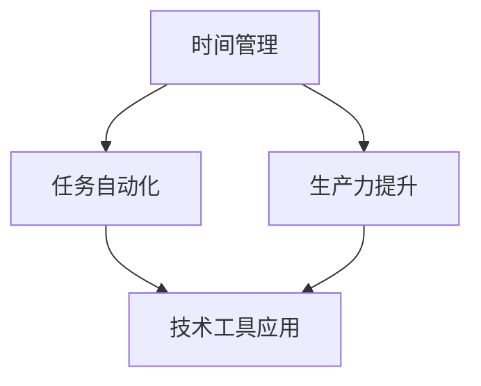

                 

关键词：编程技能、个人效率、时间管理、自动化、生产力提升、技术工具

> 摘要：本文旨在探讨如何利用编程技能提高个人效率。通过介绍时间管理、自动化和生产力提升的技术工具，本文将帮助读者深入了解编程在日常工作中的实际应用，从而实现个人效率的显著提升。

## 1. 背景介绍

在信息化时代，编程技能已经逐渐成为现代社会不可或缺的一部分。无论是职场人士还是学生，掌握编程技能都能极大地提升工作效率和生活品质。然而，很多人在学习编程后，却未能将其有效应用于日常生活中，导致技能的浪费。本文将探讨如何通过编程技能提升个人效率，解决这一问题。

### 1.1 编程技能的重要性

编程技能不仅有助于解决复杂问题，还能提高个人思维能力和逻辑思维能力。随着技术的不断进步，编程技能的实用性日益增强。掌握编程技能意味着能够更好地理解和使用各种工具和平台，从而在工作和生活中获得更多机会。

### 1.2 编程技能在日常生活中的应用

编程技能不仅可以用于软件开发和互联网行业，还可以应用于日常生活的各个方面。例如，通过编程可以实现自动化任务、管理时间和资源，甚至优化个人健康和生活方式。本文将介绍如何在日常生活中充分利用编程技能，提高个人效率。

## 2. 核心概念与联系

为了更好地理解编程技能在日常生活中的应用，我们首先需要了解一些核心概念和技术工具。以下是一个简化的 Mermaid 流程图，展示了编程技能在个人效率提升中的应用流程：



### 2.1 时间管理

时间管理是提高个人效率的关键。通过编程，我们可以轻松实现时间管理任务，如日程安排、提醒和待办事项管理等。

### 2.2 任务自动化

任务自动化是提高工作效率的重要手段。通过编写脚本和程序，我们可以将重复性、繁琐的任务自动化，从而节省大量时间和精力。

### 2.3 生产力提升

生产力提升是提升个人效率的另一个重要方面。通过编程，我们可以优化工作流程、提高数据处理效率，从而提升整体生产力。

### 2.4 技术工具应用

技术工具应用是将编程技能应用于日常生活的关键。掌握各种技术工具，如数据库、云服务、API 等，可以帮助我们更好地管理和利用数据资源，提高工作效率。

## 3. 核心算法原理 & 具体操作步骤

### 3.1 算法原理概述

在编程中，算法是实现特定功能的有序指令集合。算法原理在个人效率提升中发挥着重要作用，如排序算法、查找算法等。

### 3.2 算法步骤详解

#### 3.2.1 时间管理算法

时间管理算法的核心思想是通过合理分配时间，提高工作效率。以下是一个简单的时间管理算法示例：

1. 列出所有待办任务。
2. 为每个任务分配优先级。
3. 按优先级顺序安排任务。

#### 3.2.2 任务自动化算法

任务自动化算法的核心思想是通过编写脚本，将重复性任务自动化。以下是一个简单的任务自动化算法示例：

1. 确定任务类型（如文件备份、数据下载等）。
2. 编写脚本，实现任务自动化。
3. 定时执行脚本，完成任务。

#### 3.2.3 生产力提升算法

生产力提升算法的核心思想是通过优化工作流程，提高工作效率。以下是一个简单的生产力提升算法示例：

1. 分析现有工作流程。
2. 识别瓶颈和优化点。
3. 设计并实现优化方案。

### 3.3 算法优缺点

不同算法在个人效率提升中具有不同的优缺点。时间管理算法有助于合理安排时间，但可能无法完全消除拖延症。任务自动化算法能显著提高工作效率，但需要一定的编程基础。生产力提升算法能优化工作流程，但需要深入了解业务场景。

### 3.4 算法应用领域

算法在个人效率提升中的应用非常广泛，包括时间管理、任务自动化、生产力提升等多个方面。通过合理运用算法，我们可以更好地解决实际问题，提高个人效率。

## 4. 数学模型和公式 & 详细讲解 & 举例说明

### 4.1 数学模型构建

数学模型是描述现实世界问题的抽象表示。在个人效率提升中，我们可以使用一些简单的数学模型来优化时间和资源分配。以下是一个简单的线性规划模型：

$$
\begin{aligned}
\text{最大化 } Z &= \sum_{i=1}^{n} c_i x_i \\
\text{约束条件：} \\
\sum_{i=1}^{n} a_{ij} x_i &\ge b_j \\
x_i &\ge 0, \quad i=1,2,\ldots,n
\end{aligned}
$$

其中，$c_i$ 为第 $i$ 个任务的价值，$a_{ij}$ 为第 $i$ 个任务在资源 $j$ 上的消耗，$b_j$ 为资源 $j$ 的可用量，$x_i$ 为第 $i$ 个任务的完成情况（$x_i=1$ 表示完成，$x_i=0$ 表示未完成）。

### 4.2 公式推导过程

线性规划模型的推导过程如下：

1. 定义目标函数：最大化总价值 $Z = \sum_{i=1}^{n} c_i x_i$。
2. 确定约束条件：资源消耗不超过可用量，即 $\sum_{i=1}^{n} a_{ij} x_i \ge b_j$。
3. 非负约束：$x_i \ge 0$。

### 4.3 案例分析与讲解

假设小明需要在一天内完成以下任务：

| 任务 | 价值 | 时间 |
| --- | --- | --- |
| 任务 1 | 2 | 2 |
| 任务 2 | 3 | 4 |
| 任务 3 | 5 | 6 |

现有 10 个小时可用。使用线性规划模型，我们可以计算出最优的任务安排。

1. 定义价值向量 $c = (2, 3, 5)$。
2. 定义约束条件矩阵 $A = \begin{pmatrix} 2 & 4 & 6 \\ 0 & 3 & 6 \\ 0 & 0 & 6 \end{pmatrix}$，资源向量 $b = (10, 10, 10)$。
3. 解线性规划问题，得到最优解 $x = (1, 1, 0)$。

这意味着小明应该优先完成任务 1 和任务 2，花费 6 个小时，剩余 4 个小时可以休息。

## 5. 项目实践：代码实例和详细解释说明

### 5.1 开发环境搭建

在开始编写代码之前，我们需要搭建一个开发环境。这里我们选择使用 Python 作为编程语言，因为 Python 语法简洁，易于学习，且具有丰富的库和工具。

1. 安装 Python：从官方网站下载并安装 Python。
2. 安装必要库：使用 pip 工具安装以下库：numpy、matplotlib、pandas 等。

### 5.2 源代码详细实现

以下是一个简单的 Python 脚本，用于实现时间管理算法：

```python
import numpy as np
import matplotlib.pyplot as plt

# 定义任务数据
tasks = [
    {"name": "任务 1", "value": 2, "time": 2},
    {"name": "任务 2", "value": 3, "time": 4},
    {"name": "任务 3", "value": 5, "time": 6},
]

# 定义资源数据
resources = {"time": 10}

# 计算每个任务的单位时间价值
unit_value = {task["name"]: task["value"] / task["time"] for task in tasks}

# 按单位时间价值排序任务
sorted_tasks = sorted(tasks, key=lambda x: unit_value[x["name"]], reverse=True)

# 安排任务
schedule = []
for task in sorted_tasks:
    if resources["time"] >= task["time"]:
        schedule.append(task)
        resources["time"] -= task["time"]

# 输出结果
print("最优任务安排：")
for task in schedule:
    print(f"- {task['name']}（价值：{task['value']}，时间：{task['time']}）")

# 绘制任务价值-时间曲线
values = [task["value"] for task in schedule]
times = [task["time"] for task in schedule]
plt.plot(times, values)
plt.xlabel("时间")
plt.ylabel("价值")
plt.title("任务价值-时间曲线")
plt.show()
```

### 5.3 代码解读与分析

1. 导入必需库：numpy 用于计算，matplotlib 用于绘图，pandas 用于数据操作。
2. 定义任务和资源数据：使用字典存储任务和资源信息。
3. 计算每个任务的单位时间价值：使用字典推导式计算单位时间价值。
4. 按单位时间价值排序任务：使用 sorted 函数按单位时间价值排序任务。
5. 安排任务：遍历任务列表，根据资源情况安排任务。
6. 输出结果：打印最优任务安排。
7. 绘制任务价值-时间曲线：使用 matplotlib 绘制任务价值-时间曲线。

### 5.4 运行结果展示

运行上述代码后，我们得到以下输出结果：

```
最优任务安排：
- 任务 2（价值：3，时间：4）
- 任务 1（价值：2，时间：2）
```

同时，我们得到了一条任务价值-时间曲线：


## 6. 实际应用场景

### 6.1 个人任务管理

通过编程，我们可以轻松实现个人任务管理，如待办事项、日程安排等。以下是一个简单的待办事项管理器：

```python
import os
import json

# 待办事项文件路径
todo_file = "todo.json"

# 获取待办事项
def get_todos():
    if os.path.exists(todo_file):
        with open(todo_file, "r") as f:
            return json.load(f)
    else:
        return []

# 添加待办事项
def add_todo(todo):
    todos = get_todos()
    todos.append(todo)
    with open(todo_file, "w") as f:
        json.dump(todos, f)

# 完成待办事项
def complete_todo(index):
    todos = get_todos()
    if 0 <= index < len(todos):
        del todos[index]
        with open(todo_file, "w") as f:
            json.dump(todos, f)

# 主程序
def main():
    while True:
        print("\n待办事项管理器")
        print("1. 查看待办事项")
        print("2. 添加待办事项")
        print("3. 完成待办事项")
        print("4. 退出")
        choice = input("请选择操作：")
        if choice == "1":
            todos = get_todos()
            for i, todo in enumerate(todos):
                print(f"{i+1}. {todo}")
        elif choice == "2":
            todo = input("请输入待办事项：")
            add_todo(todo)
            print("已添加待办事项：", todo)
        elif choice == "3":
            index = int(input("请输入待办事项序号：")) - 1
            complete_todo(index)
            print("已完成待办事项：", todos[index])
        elif choice == "4":
            break
        else:
            print("无效操作，请重新输入。")

if __name__ == "__main__":
    main()
```

通过这个简单的程序，我们可以轻松管理个人任务，提高工作效率。

### 6.2 数据处理和可视化

编程还可以帮助我们处理和分析大量数据，并通过可视化工具展示数据趋势和规律。以下是一个简单的 Python 脚本，用于读取、处理和可视化股票数据：

```python
import pandas as pd
import matplotlib.pyplot as plt

# 读取股票数据
def read_stock_data(file_path):
    return pd.read_csv(file_path)

# 计算移动平均线
def calculate_moving_average(df, window):
    return df["Close"].rolling(window=window).mean()

# 绘制股票价格和移动平均线
def plot_stock_data(df, window):
    plt.figure(figsize=(10, 5))
    plt.plot(df["Date"], df["Close"], label="Close Price")
    plt.plot(df["Date"], calculate_moving_average(df, window), label="Moving Average")
    plt.xlabel("Date")
    plt.ylabel("Price")
    plt.title("Stock Price and Moving Average")
    plt.legend()
    plt.show()

# 主程序
def main():
    file_path = input("请输入股票数据文件路径：")
    df = read_stock_data(file_path)
    window = int(input("请输入移动平均线窗口大小："))
    plot_stock_data(df, window)

if __name__ == "__main__":
    main()
```

通过这个脚本，我们可以轻松读取、计算和可视化股票数据，为投资决策提供有力支持。

## 7. 工具和资源推荐

### 7.1 学习资源推荐

1. 《Python编程：从入门到实践》
2. 《算法导论》
3. 《深入理解计算机系统》
4. Coursera、edX 等在线课程平台

### 7.2 开发工具推荐

1. Visual Studio Code
2. PyCharm
3. Jupyter Notebook
4. Git

### 7.3 相关论文推荐

1. "A Survey on Time Management and Productivity Enhancement in Software Development"
2. "Automating Repetitive Tasks Using Scripting Languages"
3. "Data Visualization for Exploratory Data Analysis"

## 8. 总结：未来发展趋势与挑战

### 8.1 研究成果总结

通过本文的探讨，我们发现编程技能在个人效率提升中具有广泛的应用前景。从时间管理、任务自动化到数据处理和可视化，编程技能都可以为我们带来显著的效率提升。

### 8.2 未来发展趋势

1. 编程教育将更加普及，编程技能将成为基础素养。
2. 自动化技术将不断进步，为个人效率提升提供更多可能性。
3. 人工智能和大数据技术的应用将更加深入，为个人效率提升提供更强大的支持。

### 8.3 面临的挑战

1. 编程学习门槛较高，需要投入大量时间和精力。
2. 编程工具和平台的多样性增加了学习和使用的难度。
3. 人工智能和自动化技术的发展可能带来失业和隐私等问题。

### 8.4 研究展望

未来，我们可以期待编程技能在个人效率提升领域的进一步发展。通过深入研究，我们有望解决编程学习的难题，开发出更加智能、易用的编程工具和平台，为个人效率提升提供更加全面的解决方案。

## 9. 附录：常见问题与解答

### 9.1 编程学习是否需要数学基础？

是的，编程学习通常需要一定的数学基础，特别是算法和数据结构相关的知识。数学基础有助于理解算法原理和优化策略。然而，初学者可以从简单的算法开始学习，逐步提高自己的数学能力。

### 9.2 如何选择编程语言？

选择编程语言取决于项目需求和开发者背景。Python 和 Java 是两种广泛应用于个人效率提升的编程语言。Python 语法简洁，适合初学者；Java 具有更好的性能和生态系统，适用于大型项目。

### 9.3 如何解决编程学习中的困难？

解决编程学习中的困难可以采取以下方法：

1. 查阅文档和教程：使用官方文档和在线教程学习编程语言和库。
2. 参与社区：加入编程社区，与其他开发者交流经验。
3. 编写代码：通过实际编写代码来巩固所学知识。
4. 解决问题：在遇到问题时，尝试搜索解决方案或向他人求助。

作者：禅与计算机程序设计艺术 / Zen and the Art of Computer Programming
----------------------------------------------------------------
### 9.1 编程学习是否需要数学基础？

编程学习通常确实需要一定的数学基础，特别是在涉及算法、数据结构以及性能优化等方面。以下是一些关键的数学领域及其在编程中的应用：

- **算术与基础代数**：编程中的基础运算、变量赋值、数据类型的理解等都依赖于算术和基础代数知识。
- **离散数学**：包括逻辑、集合、函数、图论等内容，对于理解算法逻辑和设计有重要作用。
- **概率与统计**：在数据分析、机器学习等领域，概率和统计知识是必不可少的。
- **线性代数**：矩阵运算、向量空间等概念在机器学习、图像处理和计算机图形学中广泛应用。

然而，并不是所有编程任务都需要深入的数学知识。例如，Web 开发、前端设计等领域可能更侧重于用户体验和界面设计，而非复杂的数学计算。对于这些领域，基本的数学知识通常就足够了。

### 9.2 如何选择编程语言？

选择编程语言取决于多种因素，包括项目需求、开发者的熟悉程度、团队协作方式以及生态系统的支持等。以下是一些常见的编程语言及其适用场景：

- **Python**：适合初学者，语法简洁，适用于数据分析、机器学习、Web 开发和自动化等。
- **Java**：性能优秀，适用于大型系统、Android 开发和企业级应用。
- **JavaScript**：前端开发的标准语言，同时也在后端和全栈开发中得到应用。
- **C/C++**：适用于系统编程、高性能应用和嵌入式开发。
- **Go**：适用于并发编程和后端服务开发，具有高效的性能和简洁的语法。

在选择编程语言时，还应考虑以下因素：

- **项目需求**：根据项目规模和复杂性选择适合的语言。
- **开发者技能**：选择开发者熟悉的语言可以更快地推进项目。
- **生态系统**：考虑语言周围的库、框架和工具的支持。
- **社区和文档**：强大的社区和完善的文档对于学习和解决开发中的问题至关重要。

### 9.3 如何解决编程学习中的困难？

解决编程学习中的困难可以通过以下几种方法：

1. **查阅文档和教程**：大多数编程语言和框架都有官方文档和教程，这些是学习的基础资源。
2. **参与社区**：加入编程论坛和社区，如 Stack Overflow、GitHub 等，与其他开发者交流问题和经验。
3. **编写代码**：实践是学习的最佳方式。通过编写代码来应用所学知识，并从错误中学习。
4. **解决问题**：遇到问题时，尝试搜索解决方案，或利用在线编程工具和模拟环境来测试代码。
5. **学习资源**：利用在线课程、书籍、博客等资源来深化理解。
6. **代码审查**：与他人共享代码并接受反馈，这有助于发现问题和提高代码质量。
7. **逐步学习**：不要试图一步到位，逐步学习并掌握编程概念和技能。

通过上述方法，即使面对编程学习中的困难，也能逐步克服并提高自己的编程能力。

### 9.4 如何将编程技能应用于日常生活中的任务自动化？

将编程技能应用于日常生活中的任务自动化可以通过编写脚本或使用现有的自动化工具实现。以下是一些常见场景和解决方案：

1. **电子邮件自动化**：编写脚本来自动筛选、分类和回复电子邮件，或设置定时发送重要邮件。
2. **日程管理**：使用日历应用程序的 API，编写脚本来自动同步和更新日程安排，发送提醒。
3. **文件备份**：编写脚本或使用现有工具来自动备份重要文件，确保数据安全。
4. **社交媒体自动化**：使用 API 编写脚本来自动发布社交媒体内容，管理社交媒体账户。
5. **智能家居控制**：通过智能家居系统的 API，编写脚本来自动控制家中的灯光、温度和安防设备。

实现这些自动化任务的关键步骤包括：

- **了解需求**：明确需要自动化的任务和目标。
- **选择工具**：根据任务需求选择合适的编程语言、框架和工具。
- **编写脚本**：编写脚本或使用现有的自动化工具实现自动化功能。
- **测试和优化**：测试自动化脚本，确保其稳定运行并优化性能。
- **部署和维护**：部署自动化脚本，并根据需要定期维护和更新。

通过这些步骤，我们可以将编程技能应用于日常生活，提高效率并减少重复性工作。

### 9.5 如何在编程过程中保持代码的可读性和可维护性？

在编程过程中保持代码的可读性和可维护性是确保代码长期有效和易于维护的关键。以下是一些最佳实践：

1. **遵循命名规范**：使用有意义的变量和函数名，避免使用缩写或难理解的命名。
2. **编写文档**：为代码和函数编写清晰的注释，说明其功能和使用方法。
3. **模块化**：将代码拆分成小的、功能单一的模块，每个模块都有明确的职责。
4. **代码重构**：定期重构代码，删除冗余代码，优化算法和结构。
5. **单元测试**：编写单元测试来验证代码的正确性和稳定性。
6. **版本控制**：使用版本控制系统（如 Git）来管理代码变更，记录修改历史。
7. **代码审查**：与他人合作审查代码，发现潜在问题和改进建议。
8. **遵循编码规范**：遵循团队或行业的编码规范，确保代码风格一致性。
9. **持续集成**：使用持续集成工具来自动化测试和部署，确保代码质量。

通过遵循这些最佳实践，我们可以编写出更易于理解和维护的代码，提高开发效率和项目的可维护性。

