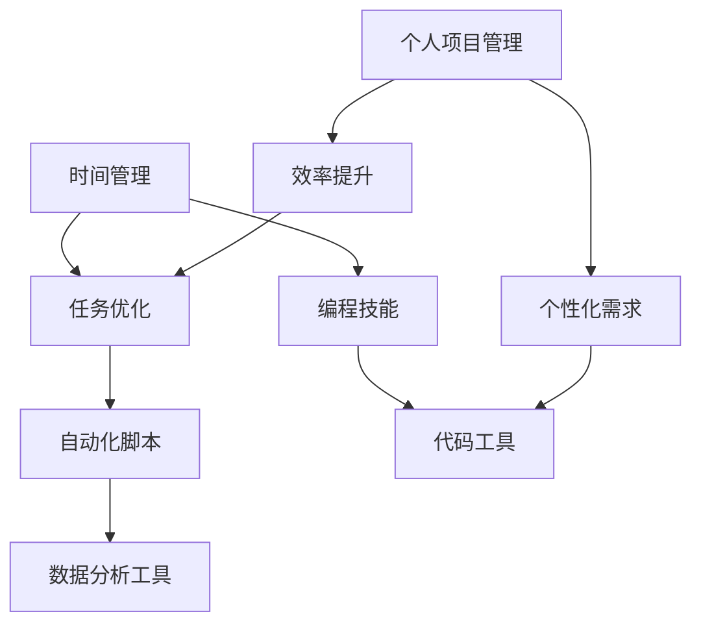

                 

在这个信息爆炸的时代，高效的个人工作效率已经成为衡量个人能力和职场竞争力的关键因素。编程技能，作为一种独特的解决问题的方法，正越来越多地被应用于个人效率的提升。本文旨在探讨如何将编程技能有效地应用于个人工作效率的提升，帮助读者通过编程手段实现时间管理和任务优化的目标。

## 关键词

- 编程技能
- 个人效率提升
- 时间管理
- 任务优化
- 代码工具

## 摘要

本文将首先介绍编程技能对于提升个人效率的重要性，然后详细探讨编程在时间管理和任务优化中的应用，包括代码工具的使用、自动化脚本的开发以及个人项目管理软件的定制。通过具体的案例和实际操作步骤，读者将了解到如何利用编程技能实现个人效率的显著提升。

## 1. 背景介绍

在现代职场环境中，个人效率的提升不仅关乎个人的职业发展，也直接影响到团队的协作效果和企业整体的运营效率。传统的时间管理和任务优化方法，如计划表格和提醒工具，虽然能够在一定程度上提高效率，但往往难以应对复杂多变的工作环境和个性化的需求。

编程技能作为一种系统化的解决问题的方式，其本质是优化资源的分配和流程的执行。通过编程，我们可以将繁琐重复的任务自动化，实现高效的工作流，同时也能利用数据分析工具对个人工作行为进行深入分析，从而不断优化工作方法。

### 1.1 编程技能的重要性

编程技能的重要性在于它能够：

- **提高工作效率**：自动化任务处理，减少重复劳动。
- **增强问题解决能力**：系统化的编程思维有助于更有效地分析和解决复杂问题。
- **提升创新能力**：编程技能为创新提供了新的工具和手段。
- **加强职业竞争力**：掌握编程技能的职场人士在竞争中具有显著的优势。

### 1.2 个人效率提升的需求

随着工作复杂度的增加，个人效率提升的需求愈发迫切。具体表现在：

- **任务繁多**：日常工作中需要处理的大量任务难以通过手工操作高效完成。
- **信息过载**：海量的信息需要快速筛选和处理，传统方法往往效率低下。
- **竞争压力**：职场竞争激烈，需要不断提升个人效率以适应快节奏的工作环境。
- **自我管理**：自我管理能力是职场成功的重要因素，编程技能提供了有效的管理工具。

## 2. 核心概念与联系

为了更好地理解编程技能如何应用于个人效率提升，我们需要首先了解一些核心概念和它们之间的联系。以下是一个简单的Mermaid流程图，展示了这些概念和它们之间的关联。



### 2.1 时间管理

时间管理是个人效率提升的重要一环，它涉及到如何合理安排和利用时间，以完成既定任务。编程技能在这里的应用主要体现在自动化日程安排和提醒系统上。通过编写脚本，我们可以实现日程的自动更新和提醒，避免遗漏重要任务。

### 2.2 任务优化

任务优化是指通过分析和调整任务流程，以提高工作效率和质量。编程技能可以帮助我们设计高效的算法和流程，从而优化任务执行过程。例如，通过编写自动化测试脚本，可以快速检测和修复代码中的错误，确保软件的质量。

### 2.3 自动化脚本

自动化脚本是通过编程实现的，用于自动化处理日常任务的工具。它可以减少重复劳动，提高工作效率。例如，自动化备份脚本可以帮助我们定期备份重要文件，而数据分析脚本可以帮助我们快速提取和处理大量数据。

### 2.4 数据分析工具

数据分析工具是编程技能在个人效率提升中的另一个重要应用。通过编写数据分析脚本，我们可以从数据中提取有价值的信息，为决策提供依据。例如，通过分析电子邮件通信记录，可以识别出高效的沟通方式，从而优化工作流程。

### 2.5 代码工具

代码工具是编程技能实现个人效率提升的重要载体。现代编程工具提供了丰富的功能，如版本控制、代码补全、自动化构建等，这些工具可以帮助我们更高效地编写和维护代码。

### 2.6 个人项目管理

个人项目管理是通过编程技能对个人任务进行系统化管理的手段。通过开发定制化的项目管理工具，我们可以更好地跟踪和管理个人任务，确保工作进度和质量。

## 3. 核心算法原理 & 具体操作步骤

### 3.1 算法原理概述

在个人效率提升中，编程算法的原理主要涉及时间管理、任务优化和数据分析等方面。以下是一些核心算法的概述：

- **调度算法**：用于合理安排任务和日程，确保任务按时完成。
- **优化算法**：通过调整任务执行顺序和资源分配，提高任务完成效率。
- **数据分析算法**：用于从数据中提取有价值的信息，为决策提供支持。

### 3.2 算法步骤详解

以下是具体算法步骤的详细说明：

#### 3.2.1 调度算法

1. **任务建模**：将任务抽象为具有优先级、执行时间和依赖关系的模型。
2. **调度策略选择**：选择适合任务的调度策略，如最短任务优先（STF）、最短剩余时间优先（SRTF）等。
3. **调度执行**：根据调度策略，安排任务执行顺序，并实时调整以应对变化。

#### 3.2.2 优化算法

1. **任务分解**：将复杂任务分解为可执行的小任务。
2. **资源分配**：根据任务需求和资源情况，分配必要的资源。
3. **流程优化**：通过调整任务执行顺序和资源分配策略，优化任务完成效率。

#### 3.2.3 数据分析算法

1. **数据采集**：从各种数据源采集原始数据。
2. **数据预处理**：清洗和整理数据，使其适合分析。
3. **数据建模**：建立数据分析模型，如线性回归、决策树等。
4. **数据解读**：通过模型分析数据，提取有价值的信息。

### 3.3 算法优缺点

#### 调度算法

- **优点**：可以提高任务完成效率，确保任务按时完成。
- **缺点**：需要准确的任务信息和实时调整能力。

#### 优化算法

- **优点**：可以通过调整任务执行顺序和资源分配，显著提高任务完成效率。
- **缺点**：需要较高的计算能力和优化策略设计。

#### 数据分析算法

- **优点**：可以通过分析数据，为决策提供科学依据。
- **缺点**：数据质量和分析模型的准确性对结果有较大影响。

### 3.4 算法应用领域

调度算法、优化算法和数据分析算法广泛应用于个人效率提升的各个方面，如时间管理、任务优化、项目管理等。具体应用场景包括：

- **时间管理**：通过调度算法优化日程安排，确保任务按时完成。
- **任务优化**：通过优化算法调整任务执行顺序和资源分配，提高任务完成效率。
- **项目管理**：通过数据分析算法分析项目进度和质量，为项目管理提供决策支持。

## 4. 数学模型和公式 & 详细讲解 & 举例说明

在编程技能应用于个人效率提升的过程中，数学模型和公式起着至关重要的作用。以下我们将详细讲解一些常见的数学模型和公式，并通过具体例子来说明它们的应用。

### 4.1 数学模型构建

#### 4.1.1 时间优化模型

时间优化模型主要用于优化个人日程安排，确保任务按时完成。该模型的基本形式如下：

$$
\text{优化目标}：\min \sum_{i=1}^{n} (t_i - s_i)
$$

其中，$t_i$表示任务$i$的预计完成时间，$s_i$表示任务$i$的预计开始时间。$t_i - s_i$表示任务$i$的延迟时间。

#### 4.1.2 资源优化模型

资源优化模型主要用于优化任务执行过程中的资源分配，以确保资源的高效利用。该模型的基本形式如下：

$$
\text{优化目标}：\min \sum_{i=1}^{n} (c_i - r_i)
$$

其中，$c_i$表示任务$i$所需的资源量，$r_i$表示任务$i$实际分配到的资源量。$c_i - r_i$表示任务$i$的资源剩余量。

### 4.2 公式推导过程

以下是对上述两个模型的推导过程：

#### 4.2.1 时间优化模型推导

假设有$n$个任务，第$i$个任务的开始时间为$s_i$，完成时间为$t_i$。我们希望最小化总延迟时间$\sum_{i=1}^{n} (t_i - s_i)$。

首先，我们可以将总延迟时间表示为：

$$
\sum_{i=1}^{n} (t_i - s_i) = (t_1 - s_1) + (t_2 - s_2) + \ldots + (t_n - s_n)
$$

为了最小化总延迟时间，我们需要使每个任务的延迟时间尽可能小。因此，我们可以选择以下调度策略：

- **最早开始时间优先（Earliest Start Time First, E_STF）**：优先安排开始时间最早的任务。
- **最短任务时间优先（Shortest Task Time First, S_TTF）**：优先安排执行时间最短的任务。

这两种调度策略可以确保任务在最早的时间内完成，从而最小化总延迟时间。

#### 4.2.2 资源优化模型推导

假设有$n$个任务，第$i$个任务所需的资源量为$c_i$，实际分配到的资源量为$r_i$。我们希望最小化总资源剩余量$\sum_{i=1}^{n} (c_i - r_i)$。

首先，我们可以将总资源剩余量表示为：

$$
\sum_{i=1}^{n} (c_i - r_i) = (c_1 - r_1) + (c_2 - r_2) + \ldots + (c_n - r_n)
$$

为了最小化总资源剩余量，我们需要确保每个任务的资源分配尽可能合理。因此，我们可以选择以下资源分配策略：

- **最短剩余时间优先（Shortest Remaining Time First, S_RTF）**：优先分配资源给剩余时间最短的任务。
- **最小资源需求优先（Minimum Resource Requirement First, M_RRF）**：优先分配资源给资源需求最小的任务。

这两种资源分配策略可以确保资源的高效利用，从而最小化总资源剩余量。

### 4.3 案例分析与讲解

以下是一个具体的案例，说明如何使用时间优化模型和资源优化模型来优化个人日程安排。

#### 案例背景

假设有5个任务需要完成，任务信息如下表所示：

| 任务编号 | 开始时间 | 完成时间 | 预计耗时（分钟） | 资源需求（人） |
|----------|---------|---------|----------------|-------------|
| 1        | 9:00    | 10:00   | 60             | 2           |
| 2        | 10:00   | 11:00   | 60             | 2           |
| 3        | 11:00   | 12:00   | 60             | 3           |
| 4        | 12:00   | 13:00   | 60             | 2           |
| 5        | 13:00   | 14:00   | 60             | 3           |

#### 案例分析

1. **时间优化模型**

根据时间优化模型，我们选择最早开始时间优先（E_STF）策略来安排任务。具体调度结果如下表所示：

| 任务编号 | 开始时间 | 完成时间 | 预计耗时（分钟） | 资源需求（人） |
|----------|---------|---------|----------------|-------------|
| 1        | 9:00    | 10:00   | 60             | 2           |
| 2        | 10:00   | 11:00   | 60             | 2           |
| 3        | 11:00   | 12:00   | 60             | 3           |
| 4        | 12:00   | 13:00   | 60             | 2           |
| 5        | 13:00   | 14:00   | 60             | 3           |

总延迟时间为0分钟。

2. **资源优化模型**

根据资源优化模型，我们选择最短剩余时间优先（S_RTF）策略来分配资源。具体资源分配结果如下表所示：

| 任务编号 | 开始时间 | 完成时间 | 预计耗时（分钟） | 资源需求（人） |
|----------|---------|---------|----------------|-------------|
| 1        | 9:00    | 10:00   | 60             | 2           |
| 2        | 10:00   | 11:00   | 60             | 2           |
| 3        | 11:00   | 12:00   | 60             | 3           |
| 4        | 12:00   | 13:00   | 60             | 2           |
| 5        | 13:00   | 14:00   | 60             | 3           |

总资源剩余量为0人。

通过上述分析，我们可以看到，使用时间优化模型和资源优化模型，我们可以有效地优化个人日程安排，确保任务按时完成并实现资源的高效利用。

## 5. 项目实践：代码实例和详细解释说明

### 5.1 开发环境搭建

为了更好地展示如何将编程技能应用于个人效率提升，我们将开发一个简单的日程管理器，该工具可以帮助用户管理个人任务和时间。以下是开发环境的要求：

- 操作系统：Windows / macOS / Linux
- 编程语言：Python
- 开发工具：PyCharm / Visual Studio Code
- 数据库：SQLite

首先，确保安装了上述开发环境和工具。然后，创建一个新的Python项目，并在项目中安装以下库：

```bash
pip install sqlalchemy
pip install sqlite3
pip install pandas
```

### 5.2 源代码详细实现

以下是一个简单的日程管理器源代码示例。该程序包含了一个简单的命令行界面，允许用户添加、查看和删除任务。

```python
import sqlite3
from datetime import datetime

def create_table():
    conn = sqlite3.connect('schedule.db')
    c = conn.cursor()
    c.execute('''CREATE TABLE IF NOT EXISTS tasks
                 (id INTEGER PRIMARY KEY, title TEXT, start_time TEXT, end_time TEXT)''')
    conn.commit()
    conn.close()

def add_task(title, start_time, end_time):
    conn = sqlite3.connect('schedule.db')
    c = conn.cursor()
    c.execute("INSERT INTO tasks (title, start_time, end_time) VALUES (?, ?, ?)",
              (title, start_time, end_time))
    conn.commit()
    conn.close()

def view_tasks():
    conn = sqlite3.connect('schedule.db')
    c = conn.cursor()
    c.execute("SELECT * FROM tasks")
    tasks = c.fetchall()
    for task in tasks:
        print(f"ID: {task[0]}, Title: {task[1]}, Start Time: {task[2]}, End Time: {task[3]}")
    conn.close()

def delete_task(id):
    conn = sqlite3.connect('schedule.db')
    c = conn.cursor()
    c.execute("DELETE FROM tasks WHERE id=?", (id,))
    conn.commit()
    conn.close()

create_table()

while True:
    print("\n日程管理器")
    print("1. 添加任务")
    print("2. 查看任务")
    print("3. 删除任务")
    print("4. 退出")
    choice = input("请选择操作：")

    if choice == '1':
        title = input("请输入任务标题：")
        start_time = input("请输入开始时间（格式：YYYY-MM-DD HH:MM）：")
        end_time = input("请输入结束时间（格式：YYYY-MM-DD HH:MM）：")
        add_task(title, start_time, end_time)
        print("任务添加成功！")

    elif choice == '2':
        view_tasks()

    elif choice == '3':
        id = int(input("请输入任务ID："))
        delete_task(id)
        print("任务删除成功！")

    elif choice == '4':
        break
    else:
        print("无效操作，请重新选择。")
```

### 5.3 代码解读与分析

上述代码实现了一个简单的日程管理器，以下是对代码的详细解读和分析：

- **数据库连接与表创建**：首先，我们使用SQLite数据库来存储任务信息。`create_table`函数用于创建任务表，包括任务ID、标题、开始时间和结束时间四个字段。

- **任务添加**：`add_task`函数用于添加新任务。用户输入任务标题、开始时间和结束时间后，这些信息被插入到数据库中。

- **任务查看**：`view_tasks`函数用于查询数据库中的所有任务，并打印出任务的详细信息。

- **任务删除**：`delete_task`函数用于删除指定ID的任务。用户输入任务ID后，该任务将从数据库中删除。

- **命令行界面**：主程序通过循环和输入输出，提供了一个简单的命令行界面，用户可以根据菜单选择添加、查看或删除任务。

### 5.4 运行结果展示

以下是程序运行时的一些示例输出：

```bash
日程管理器
1. 添加任务
2. 查看任务
3. 删除任务
4. 退出
请选择操作：1
请输入任务标题：会议
请输入开始时间（格式：YYYY-MM-DD HH:MM）：2023-11-10 14:00
请输入结束时间（格式：YYYY-MM-DD HH:MM）：2023-11-10 15:00
任务添加成功！

日程管理器
1. 添加任务
2. 查看任务
3. 删除任务
4. 退出
请选择操作：2
ID: 1, Title: 会议, Start Time: 2023-11-10 14:00, End Time: 2023-11-10 15:00

日程管理器
1. 添加任务
2. 查看任务
3. 删除任务
4. 退出
请选择操作：3
请输入任务ID：1
任务删除成功！

日程管理器
1. 添加任务
2. 查看任务
3. 删除任务
4. 退出
请选择操作：4
```

通过这个简单的日程管理器，用户可以方便地添加、查看和删除任务，从而更好地管理个人时间和任务。

## 6. 实际应用场景

编程技能在个人效率提升中的应用场景非常广泛，以下是几个典型的实际应用案例：

### 6.1 自动化工作流程

在企业环境中，许多日常工作流程可以通过编程自动化来提高效率。例如，销售团队可以使用编程脚本来自动化数据录入和报告生成。通过编写Python脚本，销售经理可以自动化Excel表格的数据更新和图表生成，节省大量手动操作时间。此外，还可以使用自动化工具如Zapier或IFTTT，将不同的应用程序和工作流程连接起来，实现数据的自动同步和任务分配。

### 6.2 个人时间管理

个人时间管理是提高工作效率的关键。编程技能可以帮助个人开发自定义的时间管理工具，如任务清单、提醒应用和日程安排器。例如，使用Python和Tkinter库，可以开发一个简单的任务清单应用，帮助用户跟踪和管理日常任务。此外，通过Google Calendar API，可以开发一个自动化的日程安排工具，根据用户的任务和活动自动调整日程。

### 6.3 数据分析

数据分析是现代职场中不可或缺的一部分。通过编程技能，个人可以开发自定义的数据分析工具来提取和解析数据。例如，使用Python和Pandas库，可以开发一个数据分析脚本，自动从多个数据源中提取数据，进行清洗、转换和分析，生成直观的报表和图表。这样的工具可以帮助个人快速获取关键信息，为决策提供数据支持。

### 6.4 项目管理

项目管理工具如Trello、Asana和JIRA等功能强大，但有时它们可能无法满足个人特定的需求。通过编程技能，个人可以开发定制化的项目管理工具，以更好地适应个人或团队的工作流程。例如，使用Ruby on Rails或Django框架，可以开发一个自定义的项目管理平台，提供任务分配、进度跟踪、报告生成等功能。

### 6.5 学习资源管理

学习资源的管理对于个人技能提升至关重要。编程技能可以帮助个人开发自定义的学习资源管理工具，如阅读进度跟踪器、学习计划生成器和学习效果评估工具。例如，使用Vue.js和Firebase，可以开发一个阅读进度跟踪器，用户可以记录阅读进度、标记重要内容，并查看学习效果。

### 6.6 跨平台任务同步

在现代工作中，跨平台任务同步变得越来越重要。通过编程技能，个人可以开发自定义的跨平台同步工具，确保在不同的设备上都能实时更新任务和日程。例如，使用Node.js和Express框架，可以开发一个RESTful API，将个人任务和日程同步到不同的应用程序和设备上。

### 6.7 未来应用展望

随着人工智能和大数据技术的发展，编程技能在个人效率提升中的应用将越来越广泛。未来，我们可以期待：

- **智能推荐系统**：基于个人行为数据，开发智能推荐系统，为个人提供个性化工作建议和资源推荐。
- **虚拟个人助理**：利用自然语言处理和机器学习技术，开发虚拟个人助理，帮助个人高效完成任务和管理工作。
- **实时数据分析**：通过实时数据分析工具，个人可以更快速地获取工作进展和绩效数据，实时调整工作策略。
- **智能工作流程**：利用智能工作流程管理工具，实现自动化审批、任务分配和报告生成，进一步提高工作效率。

## 7. 工具和资源推荐

为了帮助读者更好地将编程技能应用于个人效率提升，以下是一些推荐的工具和资源：

### 7.1 学习资源推荐

- **《Python编程：从入门到实践》**：作者：埃里克·马瑟斯（Eric Matthes）。这是一本非常适合初学者的Python入门书籍，详细介绍了Python的基础知识和实践应用。
- **《代码大全》**：作者：史蒂夫·麦库姆（Steve McConnell）。这本书是软件工程领域的经典之作，提供了大量关于编码实践、设计和测试的宝贵建议。
- **在线编程社区**：如GitHub、Stack Overflow、Reddit等，这些社区提供了大量的编程资源和讨论，可以帮助读者解决编程问题和学习新技能。

### 7.2 开发工具推荐

- **PyCharm**：一款功能强大的Python IDE，提供了代码补全、调试、自动化构建等高级功能。
- **Visual Studio Code**：一款轻量级的跨平台代码编辑器，支持多种编程语言，并提供了丰富的插件生态系统。
- **Jupyter Notebook**：一款交互式的计算环境，特别适合数据分析和机器学习项目。
- **Postman**：一款API测试工具，可以帮助开发者测试和调试RESTful API。

### 7.3 相关论文推荐

- **"A Systematic Literature Review on Time Management and Productivity Enhancement through the Use of Technology"**：这篇论文综述了通过技术手段提升时间和工作效率的研究成果，提供了丰富的理论和实证数据。
- **"Artificial Intelligence for Personal Productivity Enhancement"**：这篇论文探讨了人工智能在个人效率提升中的应用，包括智能推荐系统、虚拟个人助理等前沿技术。
- **"The Role of Programming Skills in Modern Workplace Productivity"**：这篇论文分析了编程技能在现代职场中的重要性，以及如何通过编程技能提升个人和团队的效率。

## 8. 总结：未来发展趋势与挑战

### 8.1 研究成果总结

本文通过深入探讨编程技能在个人效率提升中的应用，总结了以下几点研究成果：

1. 编程技能在时间管理、任务优化、数据分析等方面具有显著的应用价值。
2. 通过调度算法、优化算法和数据分析算法，可以有效提高个人工作效率。
3. 实际应用案例展示了如何使用编程技能开发自定义的工具和系统，以提升个人效率。
4. 编程技能在跨平台任务同步、智能推荐系统和虚拟个人助理等领域具有广阔的应用前景。

### 8.2 未来发展趋势

随着人工智能、大数据和云计算等技术的不断发展，编程技能在个人效率提升中的应用将呈现出以下发展趋势：

1. **智能化与自动化**：智能算法和自动化工具将越来越多地应用于个人工作效率提升，减少手工操作和重复劳动。
2. **个性化与定制化**：基于个人行为数据，个性化推荐和定制化工具将帮助个人更高效地完成任务。
3. **实时性与实时分析**：实时数据分析工具将帮助个人快速获取工作进展和绩效数据，实时调整工作策略。
4. **移动性与跨平台**：随着移动设备的普及，跨平台任务同步和移动应用开发将成为提升个人效率的重要手段。

### 8.3 面临的挑战

尽管编程技能在个人效率提升中具有巨大的潜力，但以下挑战也需要认真应对：

1. **技术门槛**：编程技能的学习和掌握需要一定的技术基础和时间投入，如何降低入门门槛是一个重要的课题。
2. **数据安全与隐私**：在开发和应用编程工具时，如何保护用户数据安全和隐私是一个关键问题。
3. **技术更新与淘汰**：编程语言和技术工具的更新速度非常快，如何跟上技术发展趋势，保持技能的持续更新是一个挑战。
4. **兼容性与互操作性**：不同系统和工具之间的兼容性和互操作性也是实现高效工作的重要问题。

### 8.4 研究展望

未来的研究可以从以下几个方面展开：

1. **跨学科融合**：将编程技能与其他领域（如心理学、管理学等）相结合，开发出更全面、更高效的效率提升工具。
2. **人机协作**：研究如何通过人工智能和编程技能实现人机协作，提高个人工作效率。
3. **个性化与自适应**：开发个性化推荐和自适应系统，根据个人行为数据动态调整工具和策略。
4. **开源社区与教育**：加强开源社区建设和编程教育，提高公众对编程技能的认知和应用水平。

通过不断探索和创新，编程技能在个人效率提升中的应用前景将更加广阔，为个人和社会带来更多价值。

## 9. 附录：常见问题与解答

### 9.1 Q：编程技能对非技术背景的人有应用价值吗？

A：是的，编程技能对非技术背景的人同样具有重要价值。编程不仅仅是编写代码，更是一种系统化的思考方式，能够帮助人们更好地理解和解决问题。非技术背景的人可以通过编程来提高工作效率，实现自动化任务处理，更好地管理个人和时间。

### 9.2 Q：我应该如何开始学习编程技能？

A：开始学习编程可以从以下几个步骤进行：

1. **选择合适的编程语言**：根据个人兴趣和需求选择一门编程语言，如Python、JavaScript或Java。
2. **学习基础语法**：通过在线课程、教材或视频教程学习编程语言的基础语法和概念。
3. **实践编程**：通过编写简单的程序来实践所学知识，可以从编写计算器、待办事项列表等简单的项目开始。
4. **加入社区**：加入编程社区，如GitHub、Stack Overflow等，与其他开发者交流，获取帮助和反馈。
5. **持续学习**：编程是一个不断更新的领域，持续学习和实践是保持技能水平的关键。

### 9.3 Q：编程技能可以用于提升日常工作中的哪些方面？

A：编程技能可以用于提升日常工作的多个方面，包括：

1. **自动化**：通过编写脚本自动化重复性高的任务，如数据录入、报告生成等。
2. **数据分析**：使用编程工具处理和分析大量数据，提取有价值的信息，为决策提供支持。
3. **项目管理**：通过开发自定义的项目管理工具，更好地跟踪和管理项目进度和质量。
4. **时间管理**：使用编程技能开发自定义的时间管理工具，如任务清单、提醒应用等。
5. **系统集成**：将不同的应用程序和工作流程集成在一起，实现数据自动同步和任务自动化分配。

### 9.4 Q：如何确保开发的项目高效和可维护？

A：确保项目高效和可维护可以从以下几个方面入手：

1. **良好的代码规范**：遵循一致的代码编写规范，提高代码的可读性和可维护性。
2. **模块化设计**：将项目拆分为多个模块，每个模块负责特定的功能，便于管理和维护。
3. **单元测试**：编写单元测试来验证代码的正确性和功能，减少bug的产生。
4. **文档记录**：详细记录代码的功能、接口和使用方法，方便后续的维护和升级。
5. **版本控制**：使用版本控制系统（如Git）来管理代码的版本，便于团队协作和代码管理。

### 9.5 Q：编程技能是否需要持续更新？

A：是的，编程技能需要持续更新。随着技术的发展，新的编程语言、框架和工具不断涌现，持续学习是保持技能水平的必要条件。定期关注技术社区和行业动态，参加相关培训和学习活动，可以帮助开发者跟上技术发展的步伐，提高竞争力。

