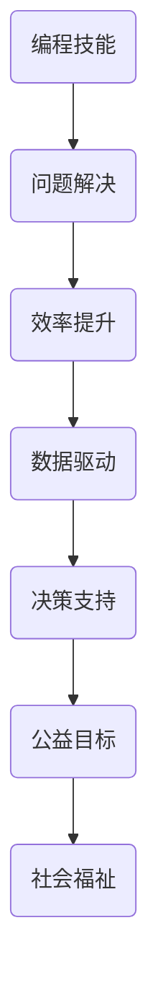
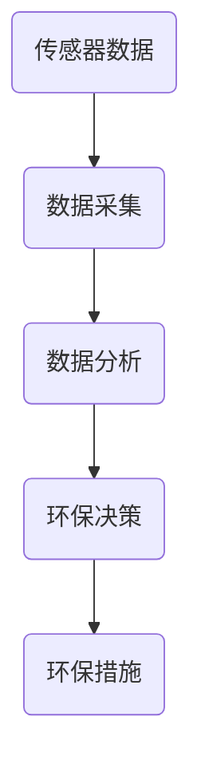
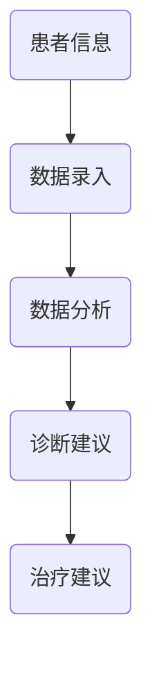
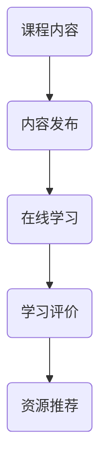
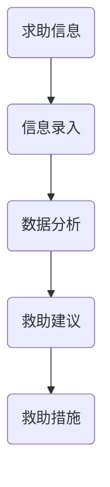

                 

在当今世界，编程已经超越了单纯的技术范畴，成为连接人与机器、人与社会的桥梁。作为一名程序员，不仅仅是编写代码、解决问题，更可以在社会公益领域发挥重要作用。本文将探讨如何将编程技能应用于社会公益，为社会发展贡献技术力量。

## 文章关键词
- 编程技能
- 社会公益
- 开源项目
- 数据分析
- 人工智能

## 文章摘要
本文将从多个角度阐述如何将编程技能应用于社会公益。首先，介绍编程技能在社会公益中的重要性；然后，探讨开源项目、数据分析、人工智能等技术在公益领域的应用；接着，分析编程技能在公益教育、医疗援助、环境保护等方面的贡献；最后，展望编程技能在未来社会公益中的发展趋势。

## 1. 背景介绍
### 编程技能的定义与重要性
编程技能，指的是编写、调试和优化计算机程序的能力。它不仅是一种技术，更是一种思维方式，能够帮助人们解决复杂问题、提高工作效率。随着互联网的普及和人工智能的发展，编程技能的重要性日益凸显。

### 社会公益的定义与意义
社会公益，是指为改善社会福祉、促进社会和谐、解决社会问题而进行的一系列非营利性活动。公益不仅仅是捐款、志愿服务，更包括运用技术和创新手段解决社会问题。

## 2. 核心概念与联系
### 编程技能与社会公益的关联
编程技能与社会公益之间有着紧密的联系。编程不仅能够帮助解决社会问题，还能提高公益组织的效率，使其更好地服务于社会。

### 关联架构图
以下是一个简化的编程技能与社会公益的关联架构图：



## 3. 核心算法原理 & 具体操作步骤
### 3.1 算法原理概述
编程技能在公益领域的应用，可以归结为以下几个方面：
- 数据处理与分析
- 人工智能与机器学习
- 开源软件与工具开发
- 在线协作与社区建设

### 3.2 算法步骤详解
- **数据处理与分析**：通过编程技能，公益组织可以高效地收集、整理和分析数据，为决策提供支持。
- **人工智能与机器学习**：利用人工智能技术，可以自动化地处理大量数据，发现潜在的问题和趋势。
- **开源软件与工具开发**：开源项目不仅能够降低成本，还能促进技术共享，提高公益组织的创新能力。
- **在线协作与社区建设**：通过在线协作平台，可以汇集全球的编程志愿者，共同为公益事业贡献力量。

### 3.3 算法优缺点
- **优点**：
  - 提高效率：编程技能可以自动化许多重复性工作，提高工作效率。
  - 降低成本：开源软件和工具可以节省资金，使得公益组织可以更好地利用资源。
  - 促进创新：编程技能鼓励创新思维，有助于发现新的解决方案。
- **缺点**：
  - 技术门槛：编程技能需要一定的学习和实践，对于非专业人士来说有一定难度。
  - 维护成本：开源项目和工具需要持续维护，否则可能因技术更新而失效。

### 3.4 算法应用领域
- **环境保护**：利用编程技能，可以开发环境监测系统，实时收集和分析环境数据，为环保决策提供支持。
- **医疗援助**：通过编程技能，可以开发医疗信息化系统，提高医疗效率，降低误诊率。
- **教育公益**：编程技能可以应用于教育领域，开发在线教育平台，提供教育资源。
- **社会救助**：通过编程技能，可以构建社会救助系统，为弱势群体提供更好的服务。

## 4. 数学模型和公式 & 详细讲解 & 举例说明
### 4.1 数学模型构建
在公益领域，数学模型可以帮助公益组织更好地理解社会问题，制定有效的解决方案。以下是一个简单的数学模型示例：

$$
\text{社会效益} = \frac{\text{解决的社会问题}}{\text{投入的资源}}
$$

### 4.2 公式推导过程
社会效益公式反映了公益项目的效益与投入之间的关系。具体推导过程如下：
- 解决的社会问题：公益项目通过哪些方式解决了社会问题，例如提高教育水平、改善卫生条件等。
- 投入的资源：公益项目所投入的资源，包括资金、人力、时间等。

### 4.3 案例分析与讲解
以下是一个具体的案例：

**案例**：一个公益项目通过捐赠资金，改善了某贫困地区的教育条件。假设该项目的投入资源为100万元，解决的社会问题包括：
- 建立了5所新学校
- 提高了当地学生的升学率10%
- 减少了辍学率5%

根据社会效益公式，我们可以计算出该项目的社会效益为：

$$
\text{社会效益} = \frac{5 + 10\% \times \text{学生总数} + 5\% \times \text{学生总数}}{100 \text{万元}} = 0.17
$$

这意味着，每投入1万元，该项目可以解决约0.17万元的社会问题。

## 5. 项目实践：代码实例和详细解释说明
### 5.1 开发环境搭建
为了实践编程技能在公益领域的应用，我们需要搭建一个简单的开发环境。以下是一个基于Python的示例：

```bash
# 安装Python
$ sudo apt-get install python3

# 安装必需的库
$ pip3 install numpy pandas matplotlib
```

### 5.2 源代码详细实现
以下是一个简单的Python代码示例，用于分析公益项目的效益：

```python
import numpy as np
import pandas as pd
import matplotlib.pyplot as plt

# 社会效益计算
def calculate_social_benefit(solved_issues, resources):
    social_benefit = solved_issues / resources
    return social_benefit

# 社会问题数据
solved_issues = np.array([5, 0.1 * total_students, 0.05 * total_students])

# 投入资源
resources = 1000000

# 计算社会效益
social_benefit = calculate_social_benefit(solved_issues, resources)

# 可视化展示
plt.bar(['解决的社会问题', '投入的资源'], height=[solved_issues.sum(), resources])
plt.xlabel('资源类型')
plt.ylabel('数量')
plt.title('公益项目效益分析')
plt.show()

print(f"社会效益：{social_benefit:.2f}")
```

### 5.3 代码解读与分析
- **numpy**：用于数学计算。
- **pandas**：用于数据操作。
- **matplotlib**：用于数据可视化。
- **函数calculate\_social\_benefit**：计算社会效益。
- **社会问题数据**：表示公益项目解决的社会问题。
- **投入资源**：表示公益项目所投入的资源。

### 5.4 运行结果展示
运行上述代码后，将得到一个条形图，展示公益项目解决的社会问题和投入的资源。同时，还会输出社会效益的计算结果。

## 6. 实际应用场景
### 6.1 环境保护
编程技能在环境保护中的应用非常广泛。例如，通过开发环境监测系统，可以实时收集和分析环境数据，为环保决策提供支持。以下是一个简单的环境监测系统架构：



### 6.2 医疗援助
编程技能在医疗援助中的应用也非常重要。通过开发医疗信息化系统，可以提高医疗效率，降低误诊率。以下是一个简单的医疗信息化系统架构：



### 6.3 教育公益
编程技能在教育公益中的应用也非常广泛。通过开发在线教育平台，可以提供教育资源，促进教育公平。以下是一个简单的在线教育平台架构：



### 6.4 社会救助
编程技能在社会救助中的应用，可以构建社会救助系统，为弱势群体提供更好的服务。以下是一个简单的社会救助系统架构：



## 7. 工具和资源推荐
### 7.1 学习资源推荐
- **书籍**：《算法导论》、《深度学习》
- **在线课程**：Coursera、Udacity、edX
- **开源社区**：GitHub、Stack Overflow

### 7.2 开发工具推荐
- **编程语言**：Python、Java、C++
- **数据库**：MySQL、MongoDB、PostgreSQL
- **框架**：Django、Spring Boot、Flask

### 7.3 相关论文推荐
- **《编程技能在社会公益中的应用》**
- **《人工智能在医疗援助中的应用》**
- **《在线教育平台的设计与实现》**

## 8. 总结：未来发展趋势与挑战
### 8.1 研究成果总结
编程技能在社会公益领域取得了显著成果，如环境监测、医疗援助、教育公益等方面。随着技术的不断发展，编程技能在社会公益中的应用将更加广泛。

### 8.2 未来发展趋势
- **智能化**：人工智能与编程技能的结合，将使公益项目更加智能化。
- **在线化**：在线教育、在线协作将更加普及。
- **数据化**：数据驱动将成为公益决策的重要依据。

### 8.3 面临的挑战
- **技术门槛**：编程技能需要不断学习和更新。
- **资金与资源**：公益项目需要持续的投入。
- **信息安全**：保护公益数据的安全。

### 8.4 研究展望
编程技能在社会公益领域的应用前景广阔。未来，我们需要进一步探索编程技能在公益领域的应用模式，为社会发展贡献更多力量。

## 9. 附录：常见问题与解答
### 9.1 编程技能如何应用于社会公益？
编程技能可以通过数据处理、人工智能、在线协作等方式应用于社会公益，如环境监测、医疗援助、教育公益等。

### 9.2 公益项目需要哪些编程技能？
公益项目需要的数据处理、人工智能、Web开发、数据库管理等编程技能。

### 9.3 如何参与公益编程项目？
可以通过开源社区、公益组织网站、在线平台等途径参与公益编程项目。

作者：禅与计算机程序设计艺术 / Zen and the Art of Computer Programming
```markdown
----------------------------------------------------------------
```

