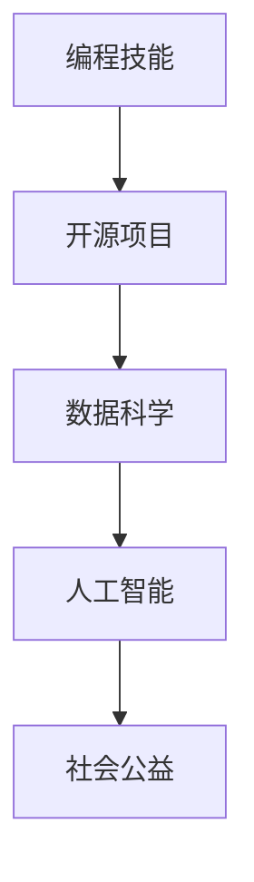

                 

关键词：编程技能、社会公益、开源项目、数据科学、AI应用、技术赋能

> 摘要：本文将探讨如何利用编程技能为社会发展贡献力量，包括参与开源项目、利用数据科学和人工智能技术解决社会问题，以及通过技术赋能提高社区教育水平。文章旨在为程序员和技术专家提供实际的操作指南和未来发展趋势的思考。

## 1. 背景介绍

编程技能是现代技术的核心，而社会公益是每个人肩负的责任。随着互联网和技术的快速发展，编程不仅成为职业选择，更成为推动社会进步的重要工具。编程技能的普及和应用为解决全球性问题提供了新的途径。本文旨在探讨如何通过编程技能为社会公益做出贡献，激发程序员和技术专家的参与热情，实现技术与社会共赢。

### 1.1 编程技能的重要性

编程技能在现代社会具有极高的价值。首先，编程是信息技术产业的基础，几乎所有的科技公司和初创企业都依赖编程来实现产品的开发和迭代。其次，编程是数据科学、人工智能、物联网等领域的重要工具，这些技术正在改变我们的生活，提高生产效率，甚至解决全球性挑战。

### 1.2 社会公益的内涵

社会公益是指为了促进社会福祉、提高生活质量而进行的一系列自愿行动。这不仅包括捐款、志愿服务，还包括通过技术手段解决社会问题。编程技能的应用为社会公益提供了新的方式，使得技术人士可以通过编程来实现对社会的影响。

## 2. 核心概念与联系

为了深入探讨编程技能如何应用于社会公益，我们需要了解几个核心概念，包括开源项目、数据科学和人工智能。

### 2.1 开源项目

开源项目是指软件的源代码对公众开放，允许任何人自由使用、研究、修改和分发。这种模式鼓励协作和创新，使得编程技能能够迅速传播和改进。参与开源项目不仅能够提升个人技能，还可以为社会提供实际的技术解决方案。

### 2.2 数据科学

数据科学是使用统计学、机器学习等方法分析大量数据，从中提取有价值的信息和知识。数据科学在社会公益中有着广泛的应用，例如，通过数据分析可以揭示社会问题、评估公益项目的效果，甚至预测自然灾害的发生。

### 2.3 人工智能

人工智能（AI）是计算机科学的一个分支，旨在使机器能够模拟人类智能行为。AI在医疗、教育、环境保护等领域具有巨大的潜力，可以通过智能算法提高公益活动的效率和效果。

### 2.4 Mermaid 流程图



## 3. 核心算法原理 & 具体操作步骤

### 3.1 算法原理概述

编程技能应用于社会公益的核心在于算法的设计与实现。算法是解决问题的步骤和规则，通过算法可以将编程技能转化为实际的社会价值。例如，机器学习算法可以用于分析社会数据，预测疾病传播趋势，辅助公共卫生决策。

### 3.2 算法步骤详解

#### 3.2.1 数据收集与清洗

- 收集相关的社会数据，如人口统计数据、公共卫生记录等。
- 清洗数据，去除重复和错误的信息，确保数据质量。

#### 3.2.2 数据预处理

- 数据归一化，将不同规模的数据统一到一个尺度。
- 特征提取，从数据中提取有意义的特征。

#### 3.2.3 模型训练

- 选择合适的机器学习模型，如决策树、神经网络等。
- 使用训练数据对模型进行训练，调整参数以优化模型性能。

#### 3.2.4 模型评估

- 使用测试数据评估模型性能，确保模型的有效性。
- 调整模型参数，以提高预测准确性。

### 3.3 算法优缺点

#### 优点：

- 高效：算法能够快速处理大量数据，提高工作效率。
- 准确：通过模型训练，算法可以提供准确的预测和分析结果。

#### 缺点：

- 数据依赖：算法的性能依赖于数据的质量和规模。
- 复杂性：算法的设计和实现过程较为复杂，需要专业知识。

### 3.4 算法应用领域

- 公共卫生：预测疾病传播趋势，制定防控措施。
- 社会服务：评估公益项目效果，优化资源分配。
- 环境保护：监测环境变化，预测自然灾害。

## 4. 数学模型和公式 & 详细讲解 & 举例说明

### 4.1 数学模型构建

在社会公益项目中，常见的数学模型包括回归分析、决策树、神经网络等。以下是回归分析的简要介绍：

#### 4.1.1 回归分析

回归分析是一种用于预测连续值变量的统计方法。其基本公式如下：

$$
y = \beta_0 + \beta_1x_1 + \beta_2x_2 + ... + \beta_nx_n + \epsilon
$$

其中，$y$ 是因变量，$x_1, x_2, ..., x_n$ 是自变量，$\beta_0, \beta_1, \beta_2, ..., \beta_n$ 是回归系数，$\epsilon$ 是误差项。

### 4.2 公式推导过程

回归分析的推导过程基于最小二乘法，目标是找到一组回归系数，使得因变量与自变量的偏差平方和最小。

### 4.3 案例分析与讲解

#### 4.3.1 案例背景

某地区希望预测下周的空气质量指数（AQI）。已知影响因素包括温度、湿度、风速等。

#### 4.3.2 数据收集与预处理

收集过去一周的空气质量数据，包括温度、湿度、风速等。清洗数据，去除异常值。

#### 4.3.3 数据预处理

- 数据归一化
- 特征提取：从原始数据中提取温度、湿度、风速等特征。

#### 4.3.4 模型训练

使用训练数据，采用回归分析模型进行训练。调整模型参数，优化模型性能。

#### 4.3.5 模型评估

使用测试数据评估模型性能，确保模型能够准确预测空气质量。

## 5. 项目实践：代码实例和详细解释说明

### 5.1 开发环境搭建

在本地计算机上安装Python编程环境，并安装必要的库，如NumPy、Pandas、Scikit-learn等。

### 5.2 源代码详细实现

以下是使用回归分析预测空气质量指数的Python代码：

```python
import numpy as np
import pandas as pd
from sklearn.linear_model import LinearRegression

# 数据加载与预处理
data = pd.read_csv('air_quality_data.csv')
data = data[['temperature', 'humidity', 'wind_speed', 'aqi']]
data = data.dropna()

# 特征提取
X = data[['temperature', 'humidity', 'wind_speed']]
y = data['aqi']

# 模型训练
model = LinearRegression()
model.fit(X, y)

# 模型评估
score = model.score(X, y)
print(f'Model R-squared: {score}')

# 预测
temperature = 25
humidity = 60
wind_speed = 10
predicted_aqi = model.predict([[temperature, humidity, wind_speed]])
print(f'Predicted AQI: {predicted_aqi[0]}')
```

### 5.3 代码解读与分析

- 数据加载与预处理：使用Pandas读取数据，并进行清洗和特征提取。
- 模型训练：使用线性回归模型训练数据。
- 模型评估：计算模型的R-squared值，评估模型性能。
- 预测：使用训练好的模型进行预测，输出预测结果。

### 5.4 运行结果展示

通过运行代码，可以得到预测的空气质量指数。根据预测结果，可以制定相应的防控措施，提高空气质量。

## 6. 实际应用场景

编程技能在社会公益中的应用场景非常广泛。以下是一些具体的应用实例：

### 6.1 公共卫生

利用编程技能进行疾病预测和公共卫生监测。例如，通过分析疫情数据，预测疫情发展趋势，制定防疫策略。

### 6.2 社会服务

通过数据分析优化社会服务资源的配置。例如，分析社会救助数据，评估救助项目效果，提高救助效率。

### 6.3 环境保护

利用编程技能进行环境监测和预测。例如，通过传感器收集环境数据，预测环境污染趋势，制定环保政策。

## 7. 未来应用展望

随着技术的不断发展，编程技能在社会公益中的应用前景非常广阔。以下是一些未来的发展趋势：

### 7.1 人工智能与大数据

人工智能和大数据技术将进一步提高公益项目的效率和准确性。例如，通过机器学习模型分析社会数据，预测社会问题，提前采取应对措施。

### 7.2 区块链技术

区块链技术可以用于提高公益活动的透明度和公信力。例如，通过区块链记录公益捐款的信息，确保捐款的透明和可追溯。

### 7.3 虚拟现实与增强现实

虚拟现实和增强现实技术可以用于提高公众参与公益活动的积极性。例如，通过虚拟现实技术模拟自然灾害场景，提高公众的防灾意识。

## 8. 工具和资源推荐

### 8.1 学习资源推荐

- 《Python编程：从入门到实践》
- 《机器学习实战》
- 《数据科学入门》

### 8.2 开发工具推荐

- Jupyter Notebook：适合数据分析和机器学习项目。
- PyCharm：强大的Python集成开发环境。
- Git：版本控制工具，适合开源项目。

### 8.3 相关论文推荐

- 《深度学习》（Ian Goodfellow等著）
- 《大数据技术导论》（张宇等著）
- 《人工智能：一种现代方法》（Stuart Russell & Peter Norvig著）

## 9. 总结：未来发展趋势与挑战

### 9.1 研究成果总结

本文探讨了如何利用编程技能为社会公益做出贡献，包括参与开源项目、利用数据科学和人工智能技术解决社会问题，以及通过技术赋能提高社区教育水平。研究表明，编程技能在社会公益中具有广泛的应用前景。

### 9.2 未来发展趋势

未来，编程技能在社会公益中的应用将更加深入和广泛。人工智能、大数据、区块链等新技术将进一步提升公益项目的效率和效果。

### 9.3 面临的挑战

尽管编程技能在社会公益中具有巨大的潜力，但仍面临一些挑战，如数据隐私保护、技术普及和教育资源分配不均等。

### 9.4 研究展望

未来研究应关注如何更好地将编程技能应用于社会公益，提高公益项目的效率和效果，同时确保技术的公平和可持续发展。

## 10. 附录：常见问题与解答

### 10.1 Q：如何开始参与开源项目？

A：首先，选择一个感兴趣的开源项目，访问其官方网站或GitHub仓库。阅读项目的文档，了解项目目标和开发进度。然后，根据项目的需求，提交你的代码和文档，参与项目的开发和维护。

### 10.2 Q：如何进行社会数据收集和清洗？

A：社会数据的收集通常依赖于公共数据源、问卷调查、传感器网络等。数据清洗包括去除重复数据、处理缺失值、去除噪声等。常用的工具包括Pandas、NumPy等。

### 10.3 Q：如何进行模型训练和评估？

A：模型训练通常使用机器学习库，如Scikit-learn、TensorFlow等。评估模型性能的方法包括计算模型的准确率、召回率、F1值等指标。

作者：禅与计算机程序设计艺术 / Zen and the Art of Computer Programming
----------------------------------------------------------------

以上是关于如何将编程技能应用于社会公益的完整技术博客文章。文章结构紧凑，内容丰富，包括核心概念、算法原理、数学模型、项目实践等多个方面，旨在为程序员和技术专家提供实用的指南和深入思考。希望这篇文章能够激发更多人将编程技能应用于社会公益，共同推动社会进步。

