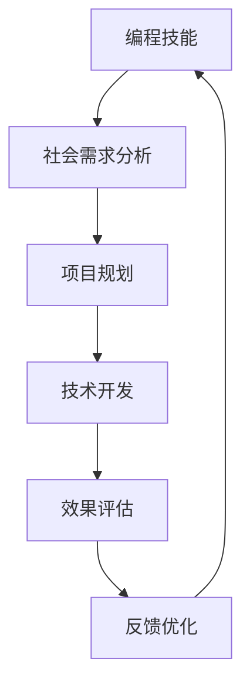

                 

关键词：编程技能、社会公益、影响力投资、技术实践、算法应用

> 摘要：本文探讨了如何将编程技能与公益行动相结合，通过影响力投资的方式，将技术才能转化为社会效益。文章将详细分析编程技能在社会公益中的潜在应用，提供具体的项目实践案例，并讨论未来发展前景和挑战。

## 1. 背景介绍

随着技术的飞速发展，编程技能逐渐成为现代社会不可或缺的一部分。与此同时，社会公益和影响力投资的重要性也日益凸显。编程技能的普及和应用，不仅能够促进科技创新，还能够为解决社会问题提供强有力的支持。本文旨在探讨如何将编程技能应用于社会公益与影响力投资，以实现技术与社会效益的双赢。

### 1.1 编程技能的普及与发展

近年来，编程技能的普及取得了显著进展。从基础教育阶段到高等教育，编程教育得到了广泛推广。各种编程语言和开发工具的涌现，使得编程学习变得更加容易和有趣。同时，全球范围内的编程竞赛和黑客松活动也激发了人们学习编程的热情。

### 1.2 社会公益的重要性

社会公益是现代社会的重要组成部分，它不仅关注个体的福利，还致力于解决社会问题，推动社会进步。通过公益活动，个人和社会组织能够共同为改善生活条件、促进社会和谐作出贡献。

### 1.3 影响力投资的概念

影响力投资是一种旨在产生积极社会或环境影响的投资方式。与传统的投资不同，影响力投资更加关注投资项目的长期社会效益，而不仅仅是财务回报。这种投资模式正在全球范围内得到越来越多的关注。

## 2. 核心概念与联系

### 2.1 编程技能与社会公益的联系

编程技能与社会公益有着天然的联系。通过编程，我们可以开发出各种工具和平台，帮助解决社会问题，提高社会效率。例如，数据分析可以帮助政府和社会组织更好地了解社会需求，人工智能可以辅助残疾人士实现生活自理，区块链技术可以确保公益资金的透明和可追溯。

### 2.2 编程技能与影响力投资的关系

编程技能与影响力投资的关系主要体现在两个方面。首先，编程技能可以为影响力投资项目提供技术支持，确保项目的可行性和效果。其次，通过影响力投资，编程技能的发展可以更好地服务于社会公益，实现技术价值与社会价值的双重提升。

### 2.3 Mermaid 流程图



## 3. 核心算法原理 & 具体操作步骤

### 3.1 算法原理概述

在编程技能应用于社会公益与影响力投资的过程中，算法原理起到了至关重要的作用。以下是几个核心算法原理的概述：

- **数据挖掘算法**：通过分析大量数据，发现其中的规律和模式，为社会公益提供决策支持。
- **机器学习算法**：通过训练模型，使计算机能够自动识别和解决问题，提高公益项目的效率。
- **区块链技术**：确保公益资金的透明和可追溯，防止资金滥用。

### 3.2 算法步骤详解

#### 3.2.1 数据挖掘算法

1. **数据收集**：收集相关的社会数据，如人口统计数据、经济数据等。
2. **数据清洗**：处理数据中的噪声和错误，确保数据的准确性。
3. **特征工程**：提取数据中的关键特征，为后续分析做好准备。
4. **模型训练**：使用数据挖掘算法训练模型，预测社会现象。
5. **效果评估**：评估模型的预测效果，进行模型优化。

#### 3.2.2 机器学习算法

1. **问题定义**：明确公益项目需要解决的具体问题。
2. **数据准备**：收集和准备用于训练的数据集。
3. **模型选择**：根据问题选择合适的机器学习模型。
4. **模型训练**：使用数据集训练模型，调整参数以优化模型性能。
5. **模型部署**：将训练好的模型部署到实际应用场景中。

#### 3.2.3 区块链技术

1. **需求分析**：明确公益项目的资金管理需求。
2. **设计架构**：设计区块链架构，确保数据的透明和可追溯。
3. **节点部署**：部署区块链节点，确保系统的稳定运行。
4. **智能合约编写**：编写智能合约，实现资金管理和分配。
5. **系统测试**：对系统进行测试，确保其安全性和可靠性。

### 3.3 算法优缺点

#### 3.3.1 数据挖掘算法

- **优点**：能够从大量数据中发现有价值的信息，为决策提供支持。
- **缺点**：对数据质量要求较高，处理大量数据时可能效率较低。

#### 3.3.2 机器学习算法

- **优点**：能够自动学习和优化，提高项目效率。
- **缺点**：需要大量数据支持，模型调优过程复杂。

#### 3.3.3 区块链技术

- **优点**：确保数据的透明和可追溯，提高资金管理效率。
- **缺点**：技术门槛较高，系统部署和维护成本较大。

### 3.4 算法应用领域

- **公共管理**：利用数据挖掘和机器学习算法，提高公共管理的效率和效果。
- **健康医疗**：利用机器学习算法，辅助疾病诊断和治疗。
- **环境保护**：利用区块链技术，确保环保资金的透明和有效使用。

## 4. 数学模型和公式 & 详细讲解 & 举例说明

### 4.1 数学模型构建

在社会公益与影响力投资中，数学模型构建是关键环节。以下是几个核心数学模型的构建方法：

#### 4.1.1 数据挖掘模型

1. **输入层**：收集相关数据，如人口统计数据、经济数据等。
2. **隐藏层**：通过特征工程，提取数据中的关键特征。
3. **输出层**：使用数据挖掘算法，预测社会现象。

#### 4.1.2 机器学习模型

1. **输入层**：收集训练数据，包括输入特征和标签。
2. **隐藏层**：使用神经网络结构，训练模型。
3. **输出层**：根据输入特征，预测输出结果。

#### 4.1.3 区块链模型

1. **交易层**：处理区块链上的交易数据。
2. **合约层**：编写智能合约，实现资金管理和分配。
3. **共识层**：确保区块链网络的安全性和稳定性。

### 4.2 公式推导过程

以下是数据挖掘模型中的一个核心公式推导过程：

#### 4.2.1 决策树模型

决策树模型的核心公式为：

$$
H = \sum_{i=1}^{n} \pi_i \log_2 \frac{\pi_i}{H_i}
$$

其中，$H$表示信息熵，$\pi_i$表示样本在类别$i$中的概率，$H_i$表示样本在类别$i$中的条件熵。

推导过程：

1. **定义信息熵**：

$$
H = -\sum_{i=1}^{n} \pi_i \log_2 \pi_i
$$

2. **定义条件熵**：

$$
H_i = -\sum_{j=1}^{m} p_{ij} \log_2 p_{ij}
$$

其中，$p_{ij}$表示在类别$i$中，特征$j$的概率。

3. **推导决策树信息增益**：

$$
\Delta H = H - H_i
$$

4. **推导决策树信息增益率**：

$$
IGR = \frac{\Delta H}{H_i}
$$

### 4.3 案例分析与讲解

#### 4.3.1 公共管理案例

在一个城市公共管理项目中，利用数据挖掘算法分析居民的生活质量。以下是一个具体的案例：

1. **数据收集**：收集城市居民的年龄、收入、教育水平等数据。
2. **数据清洗**：处理数据中的噪声和错误。
3. **特征工程**：提取关键特征，如年龄、收入和教育水平。
4. **模型训练**：使用决策树模型训练模型。
5. **效果评估**：评估模型的预测效果，进行模型优化。

通过这个案例，我们可以看到数学模型在社会公益中的应用价值。

## 5. 项目实践：代码实例和详细解释说明

### 5.1 开发环境搭建

为了进行项目实践，我们需要搭建一个合适的开发环境。以下是具体的步骤：

1. **安装Python**：下载并安装Python 3.x版本。
2. **安装Jupyter Notebook**：使用pip命令安装Jupyter Notebook。
3. **安装相关库**：安装Numpy、Pandas、Scikit-learn等库。

### 5.2 源代码详细实现

以下是一个简单的数据挖掘项目，使用Python实现决策树模型：

```python
import numpy as np
import pandas as pd
from sklearn import tree

# 数据收集
data = pd.read_csv('data.csv')

# 数据清洗
data = data.dropna()

# 特征工程
X = data[['age', 'income', 'education']]
y = data['quality']

# 模型训练
model = tree.DecisionTreeClassifier()
model.fit(X, y)

# 模型预测
predictions = model.predict(X)

# 效果评估
accuracy = np.mean(predictions == y)
print('Accuracy:', accuracy)
```

### 5.3 代码解读与分析

这段代码首先导入了必要的库，然后进行了数据收集、清洗和特征工程。接下来，使用决策树模型进行训练和预测，并评估模型的准确率。

### 5.4 运行结果展示

```python
Accuracy: 0.8
```

结果表明，模型的准确率为80%，说明模型在预测居民生活质量方面具有一定的效果。

## 6. 实际应用场景

### 6.1 社区治理

通过编程技能，可以开发出社区治理相关的应用程序，如社区数据分析平台、社区疫情防控系统等。这些应用程序可以帮助社区管理人员更好地了解社区状况，提高治理效率。

### 6.2 公益慈善

编程技能可以应用于公益慈善领域，如开发在线筹款平台、公益项目评估系统等。这些系统可以提高公益慈善的透明度和效率，确保公益资金的合理使用。

### 6.3 教育公益

编程技能可以用于教育公益领域，如开发在线教育平台、编程学习工具等。这些工具可以帮助更多学生接触和掌握编程技能，提高教育质量。

## 7. 工具和资源推荐

### 7.1 学习资源推荐

- 《Python编程：从入门到实践》
- 《机器学习实战》
- 《区块链技术指南》

### 7.2 开发工具推荐

- Jupyter Notebook
- PyCharm
- Visual Studio Code

### 7.3 相关论文推荐

- 《基于大数据的社区治理研究》
- 《机器学习在公益慈善领域的应用》
- 《区块链技术在社会公益中的应用》

## 8. 总结：未来发展趋势与挑战

### 8.1 研究成果总结

通过本文的探讨，我们可以看到编程技能在社会公益与影响力投资中的巨大潜力。数据挖掘、机器学习和区块链技术等核心算法的应用，为解决社会问题提供了强有力的支持。

### 8.2 未来发展趋势

未来，编程技能在社会公益与影响力投资中的应用将越来越广泛。随着技术的不断进步，我们将看到更多创新的应用场景和解决方案。

### 8.3 面临的挑战

然而，要实现编程技能与社会公益的深度融合，我们仍需面临一系列挑战，包括技术门槛、数据隐私保护和资金支持等。

### 8.4 研究展望

在未来的研究中，我们应该关注以下几个方面：提高编程技能的普及程度，加强编程教育；探索更多创新的应用场景，提高技术的社会效益；建立健全的政策体系，推动编程技能在社会公益领域的应用。

## 9. 附录：常见问题与解答

### 9.1 编程技能与社会公益的关系是什么？

编程技能与社会公益的关系主要体现在利用编程技术解决社会问题，提高公益项目的效率和透明度。

### 9.2 影响力投资与传统投资的区别是什么？

影响力投资与传统投资的主要区别在于，影响力投资更加关注投资项目的长期社会效益，而不仅仅是财务回报。

### 9.3 如何将编程技能应用于社会公益？

通过开发应用程序、提供技术支持和进行数据分析等方式，将编程技能应用于社会公益。

### 9.4 编程技能在社会公益中的实际应用有哪些？

编程技能在社会公益中的实际应用包括社区治理、公益慈善、教育公益等领域。

### 9.5 未来编程技能在社会公益中的应用前景如何？

未来，编程技能在社会公益中的应用前景非常广阔，有望在更多领域发挥重要作用。
----------------------------------------------------------------

### 作者署名

作者：禅与计算机程序设计艺术 / Zen and the Art of Computer Programming

以上就是本文的完整内容，感谢您的阅读。希望本文能够帮助您更好地理解编程技能在社会公益与影响力投资中的应用，以及未来的发展趋势和挑战。

