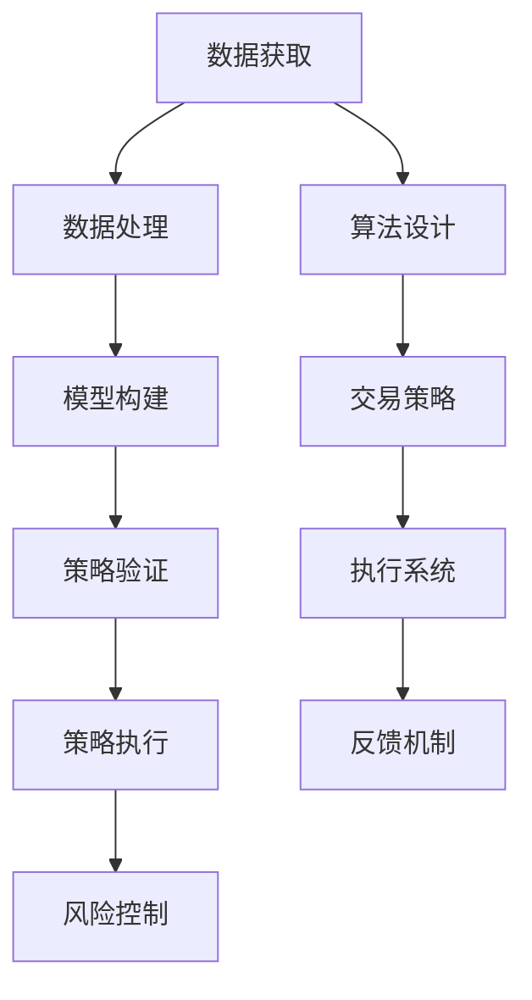

                 

关键词：编程技能，量化投资，算法，数据分析，技术分析，量化交易，金融科技，数学模型，Python，机器学习，交易策略，风险控制。

## 摘要

本文旨在探讨如何将编程技能应用于量化投资领域。量化投资作为一种以数据驱动的方式进行投资决策的方法，其核心在于利用数学模型、算法和编程技术来分析市场数据，构建交易策略，并执行交易。本文将介绍量化投资的基本概念、核心算法原理、数学模型构建、项目实践以及实际应用场景，并提供相关的学习资源和工具推荐。通过本文，读者将了解如何将编程技能转化为量化投资的实际应用，为从事金融科技领域的专业人士提供有价值的参考。

## 1. 背景介绍

量化投资，又称为量化交易或数量分析，是一种利用数学模型、统计分析和计算机算法来进行投资决策的方法。与传统投资方式相比，量化投资更加注重数据分析和算法模型的应用，以减少人为情绪的干扰，提高投资决策的科学性和系统性。随着金融科技的快速发展，量化投资已经成为金融市场中不可或缺的一部分，吸引了众多专业人士和研究机构的关注。

编程技能在量化投资中的应用主要体现在以下几个方面：

- **数据处理和分析**：编程技能可以帮助量化投资者快速获取、清洗和预处理大量市场数据，为后续的分析和建模提供基础。
- **算法设计和实现**：编程技能是构建量化交易策略的核心，投资者需要利用编程技术来设计、实现和优化各种交易算法。
- **模型验证与优化**：编程技能可以用于验证交易模型的性能，通过调整模型参数来优化策略表现。
- **自动化交易执行**：编程技能可以帮助实现交易自动化，减少人为干预，提高交易执行效率。

本文将围绕量化投资的核心算法、数学模型和项目实践等方面进行深入探讨，以帮助读者了解如何将编程技能应用于量化投资领域。

## 2. 核心概念与联系

### 2.1 量化投资的基本概念

量化投资的核心概念包括市场数据、数学模型、算法和交易策略等。

- **市场数据**：市场数据是量化投资的基础，包括股票、期货、外汇等金融市场的历史价格、交易量、财务指标等。
- **数学模型**：数学模型用于描述市场数据之间的关系，包括时间序列分析、回归分析、随机过程等。
- **算法**：算法是实现交易策略的核心，包括技术分析、机器学习、遗传算法等。
- **交易策略**：交易策略是根据市场数据和算法分析结果制定的交易规则，包括趋势跟踪、均值回归、市场中性等。

### 2.2 量化投资的架构

量化投资的架构可以概括为数据获取、数据处理、模型构建、策略验证、策略执行和风险控制等环节。

- **数据获取**：通过互联网、数据库和第三方数据提供商等渠道获取市场数据。
- **数据处理**：利用编程技能对市场数据进行清洗、预处理和特征提取，为后续分析提供基础。
- **模型构建**：根据市场数据和算法设计交易策略，包括单变量模型、多变量模型、集成模型等。
- **策略验证**：通过历史数据对交易策略进行验证，评估策略的稳定性和盈利能力。
- **策略执行**：实现交易策略的自动化执行，通过程序化交易系统进行实时交易。
- **风险控制**：监控交易策略的风险水平，采取风险控制措施，如止损、对冲等。

### 2.3 核心概念原理与架构的 Mermaid 流程图



通过以上核心概念和架构的介绍，读者可以初步了解量化投资的基本流程和编程技能在该领域中的应用。

## 3. 核心算法原理 & 具体操作步骤

### 3.1 算法原理概述

量化投资中的核心算法主要分为以下几类：

- **时间序列分析**：基于历史价格和交易量等时间序列数据，通过自回归模型、移动平均模型等分析市场趋势和波动性。
- **回归分析**：通过建立市场数据之间的线性或非线性关系，预测未来价格或交易量。
- **技术分析**：基于历史价格和交易量等数据，利用各种技术指标和图形分析市场趋势和波动性。
- **机器学习**：利用机器学习算法，如决策树、支持向量机、神经网络等，对市场数据进行分析和预测。
- **遗传算法**：基于生物进化原理，通过迭代优化策略参数，寻找最优交易策略。

### 3.2 算法步骤详解

以下是量化投资中的几种核心算法的具体操作步骤：

#### 3.2.1 时间序列分析

1. **数据获取**：从历史数据库中获取股票、期货等市场数据。
2. **数据预处理**：对数据进行清洗和预处理，如缺失值处理、异常值处理等。
3. **模型选择**：选择合适的自回归模型、移动平均模型等。
4. **参数估计**：利用最大似然估计、最小二乘法等方法估计模型参数。
5. **模型拟合**：将历史数据输入模型，拟合出市场趋势和波动性。
6. **模型验证**：利用验证集或交叉验证方法评估模型性能。

#### 3.2.2 回归分析

1. **数据获取**：从历史数据库中获取市场数据。
2. **数据预处理**：对数据进行清洗和预处理，如缺失值处理、异常值处理等。
3. **特征提取**：选择合适的特征，如价格、交易量、技术指标等。
4. **模型构建**：选择线性回归、非线性回归等模型。
5. **参数估计**：利用最小二乘法、梯度下降法等估计模型参数。
6. **模型拟合**：将特征数据输入模型，拟合出价格或交易量的预测值。
7. **模型验证**：利用验证集或交叉验证方法评估模型性能。

#### 3.2.3 技术分析

1. **数据获取**：从历史数据库中获取股票、期货等市场数据。
2. **数据预处理**：对数据进行清洗和预处理，如缺失值处理、异常值处理等。
3. **技术指标计算**：计算移动平均线、相对强弱指数、随机振荡器等技术指标。
4. **图形分析**：利用K线图、蜡烛图等分析市场趋势和波动性。
5. **交易策略构建**：根据技术指标和图形分析结果构建交易策略。
6. **模型验证**：利用验证集或交叉验证方法评估交易策略性能。

#### 3.2.4 机器学习

1. **数据获取**：从历史数据库中获取市场数据。
2. **数据预处理**：对数据进行清洗和预处理，如缺失值处理、异常值处理等。
3. **特征提取**：选择合适的特征，如价格、交易量、技术指标等。
4. **模型选择**：选择合适的机器学习算法，如决策树、支持向量机、神经网络等。
5. **参数调优**：利用网格搜索、随机搜索等方法优化模型参数。
6. **模型训练**：将特征数据输入模型，进行训练和拟合。
7. **模型验证**：利用验证集或交叉验证方法评估模型性能。

#### 3.2.5 遗传算法

1. **数据获取**：从历史数据库中获取市场数据。
2. **数据预处理**：对数据进行清洗和预处理，如缺失值处理、异常值处理等。
3. **特征提取**：选择合适的特征，如价格、交易量、技术指标等。
4. **编码与解码**：将交易策略编码为染色体，进行解码得到具体的交易策略。
5. **适应度函数设计**：根据交易策略的盈利能力设计适应度函数。
6. **遗传操作**：进行选择、交叉、变异等遗传操作。
7. **迭代优化**：不断迭代优化交易策略，直至找到最优策略。
8. **模型验证**：利用验证集或交叉验证方法评估交易策略性能。

### 3.3 算法优缺点

每种算法都有其独特的优点和局限性，适用于不同的投资场景。

- **时间序列分析**：优点是简单、直观，适用于短期交易策略；缺点是对市场结构变化不敏感，可能无法捕捉长期趋势。
- **回归分析**：优点是能够建立市场数据之间的线性或非线性关系，适用于寻找长期趋势；缺点是模型复杂度较高，可能过度拟合。
- **技术分析**：优点是直观、易懂，适用于捕捉市场波动和趋势；缺点是缺乏科学依据，可能存在人为情绪干扰。
- **机器学习**：优点是能够自动学习市场规律，适用于复杂市场环境；缺点是模型复杂度高，可能存在过拟合问题。
- **遗传算法**：优点是能够快速找到最优策略，适用于复杂投资环境；缺点是计算复杂度高，可能无法适应快速变化的市场。

### 3.4 算法应用领域

各种算法在不同投资领域中具有不同的应用价值。

- **股票投资**：技术分析和机器学习在股票投资中应用广泛，可用于构建趋势跟踪、市场中性等交易策略。
- **期货投资**：时间序列分析和回归分析在期货投资中应用较多，可用于预测期货价格和交易量。
- **外汇投资**：技术分析和机器学习在外汇投资中应用广泛，可用于捕捉汇率波动和趋势。
- **商品投资**：时间序列分析和回归分析在商品投资中应用较多，可用于预测商品价格和交易量。

## 4. 数学模型和公式 & 详细讲解 & 举例说明

### 4.1 数学模型构建

量化投资中的数学模型主要包括时间序列模型、回归模型、机器学习模型和遗传算法模型等。以下分别介绍这些模型的构建方法。

#### 4.1.1 时间序列模型

时间序列模型用于分析金融市场的时间序列数据，主要方法包括自回归模型（AR）、移动平均模型（MA）和自回归移动平均模型（ARMA）等。

1. **自回归模型（AR）**：

   自回归模型假设当前时刻的变量值与过去若干时刻的变量值存在线性关系，公式如下：

   $$
   X_t = c + \sum_{i=1}^p \phi_i X_{t-i}
   $$

   其中，$X_t$为当前时刻的变量值，$c$为常数项，$\phi_i$为自回归系数，$p$为自回归阶数。

2. **移动平均模型（MA）**：

   移动平均模型假设当前时刻的变量值与过去若干时刻的平均值存在线性关系，公式如下：

   $$
   X_t = c + \sum_{i=1}^q \theta_i \bar{X}_{t-i}
   $$

   其中，$\bar{X}_{t-i}$为过去若干时刻的平均值，$\theta_i$为移动平均系数，$q$为移动平均阶数。

3. **自回归移动平均模型（ARMA）**：

   自回归移动平均模型结合了自回归模型和移动平均模型的特点，公式如下：

   $$
   X_t = c + \sum_{i=1}^p \phi_i X_{t-i} + \sum_{i=1}^q \theta_i \bar{X}_{t-i}
   $$

   其中，$c$为常数项，$\phi_i$为自回归系数，$\theta_i$为移动平均系数，$p$和$q$分别为自回归阶数和移动平均阶数。

#### 4.1.2 回归模型

回归模型用于建立市场数据之间的线性或非线性关系，主要方法包括线性回归（Linear Regression）和多项式回归（Polynomial Regression）等。

1. **线性回归**：

   线性回归模型假设因变量与自变量之间存在线性关系，公式如下：

   $$
   y = \beta_0 + \beta_1 x
   $$

   其中，$y$为因变量，$x$为自变量，$\beta_0$和$\beta_1$分别为常数项和斜率系数。

2. **多项式回归**：

   多项式回归模型假设因变量与自变量之间存在非线性关系，公式如下：

   $$
   y = \beta_0 + \beta_1 x + \beta_2 x^2 + ... + \beta_n x^n
   $$

   其中，$y$为因变量，$x$为自变量，$\beta_0$、$\beta_1$、$\beta_2$、...、$\beta_n$分别为常数项和斜率系数。

#### 4.1.3 机器学习模型

机器学习模型通过训练大量数据，学习数据中的特征和规律，并用于预测未来值。主要方法包括决策树（Decision Tree）、支持向量机（SVM）和神经网络（Neural Network）等。

1. **决策树**：

   决策树模型通过一系列条件判断，将数据划分为不同的类别或数值。公式如下：

   $$
   y = \sum_{i=1}^n w_i I(T(x) = t_i)
   $$

   其中，$y$为预测值，$x$为输入特征，$w_i$为权重，$T(x)$为决策树输出，$t_i$为类别标签。

2. **支持向量机**：

   支持向量机模型通过找到一个最优超平面，将不同类别的数据分开。公式如下：

   $$
   w \cdot x - b = 0
   $$

   其中，$w$为权重向量，$x$为输入特征，$b$为偏置。

3. **神经网络**：

   神经网络模型通过多层神经元的非线性变换，实现从输入到输出的映射。公式如下：

   $$
   y = \sigma(z)
   $$

   其中，$y$为输出值，$\sigma$为激活函数，$z$为输入值。

#### 4.1.4 遗传算法模型

遗传算法模型通过模拟生物进化过程，优化目标函数，找到最优解。公式如下：

1. **编码与解码**：

   编码是将问题解空间中的解映射到染色体编码空间，解码是将染色体编码映射回问题解空间。公式如下：

   $$
   x = \sum_{i=1}^n c_i \theta_i
   $$

   其中，$x$为问题解，$c_i$为编码值，$\theta_i$为参数。

2. **适应度函数**：

   适应度函数用于评估染色体编码的解的优劣，公式如下：

   $$
   f(x) = -\sum_{i=1}^n \omega_i (x_i - x^*)
   $$

   其中，$f(x)$为适应度值，$\omega_i$为权重，$x^*$为最优解。

3. **遗传操作**：

   遗传操作包括选择、交叉、变异等。公式如下：

   $$
   \begin{aligned}
   &\text{选择：} \\
   &p_1, p_2 \sim \text{均匀分布(0,1)}, \text{如果 } p_1 < f(x_1) \text{ 且 } p_2 < f(x_2), \text{则选择 } x_1, x_2 \\
   &\text{交叉：} \\
   &x_1', x_2' \sim \text{交叉概率分布}, \text{如果 } x_1', x_2' \in [0,1], \text{则交叉操作 } x_1 \leftrightarrow x_2 \\
   &\text{变异：} \\
   &x_1', x_2' \sim \text{变异概率分布}, \text{如果 } x_1', x_2' \in [0,1], \text{则变异操作 } x_1 \leftrightarrow x_2 \\
   \end{aligned}
   $$

### 4.2 公式推导过程

以下是时间序列模型、回归模型、机器学习模型和遗传算法模型的公式推导过程。

#### 4.2.1 时间序列模型

1. **自回归模型（AR）**：

   假设 $X_t$ 表示时间序列 $x_1, x_2, ..., x_t$，则自回归模型可以表示为：

   $$
   X_t = c + \sum_{i=1}^p \phi_i X_{t-i}
   $$

   对 $X_t$ 进行差分变换，得到：

   $$
   X_t - X_{t-1} = c - \phi_1 X_{t-1} - \phi_2 X_{t-2} - ... - \phi_p X_{t-p}
   $$

   对差分变换后的序列进行回归分析，得到：

   $$
   X_t - X_{t-1} = \beta_0 + \beta_1 (X_{t-1} - X_{t-2}) + ... + \beta_p (X_{t-p} - X_{t-p-1})
   $$

   将差分变换后的序列代入自回归模型，得到：

   $$
   X_t = c + \phi_1 X_{t-1} + \phi_2 X_{t-2} + ... + \phi_p X_{t-p} + \beta_0 + \beta_1 (X_{t-1} - X_{t-2}) + ... + \beta_p (X_{t-p} - X_{t-p-1})
   $$

   整理得到自回归模型的公式：

   $$
   X_t = c + \sum_{i=1}^p \phi_i X_{t-i} + \sum_{i=1}^p \beta_i (X_{t-i} - X_{t-i-1})
   $$

2. **移动平均模型（MA）**：

   假设 $X_t$ 表示时间序列 $x_1, x_2, ..., x_t$，则移动平均模型可以表示为：

   $$
   X_t = c + \sum_{i=1}^q \theta_i \bar{X}_{t-i}
   $$

   对 $X_t$ 进行差分变换，得到：

   $$
   X_t - X_{t-1} = c - \theta_1 \bar{X}_{t-1} - \theta_2 \bar{X}_{t-2} - ... - \theta_q \bar{X}_{t-q}
   $$

   对差分变换后的序列进行回归分析，得到：

   $$
   X_t - X_{t-1} = \beta_0 + \beta_1 (X_{t-1} - X_{t-2}) + ... + \beta_q (X_{t-q} - X_{t-q-1})
   $$

   将差分变换后的序列代入移动平均模型，得到：

   $$
   X_t = c + \theta_1 \bar{X}_{t-1} + \theta_2 \bar{X}_{t-2} + ... + \theta_q \bar{X}_{t-q} + \beta_0 + \beta_1 (X_{t-1} - X_{t-2}) + ... + \beta_q (X_{t-q} - X_{t-q-1})
   $$

   整理得到移动平均模型的公式：

   $$
   X_t = c + \sum_{i=1}^q \theta_i \bar{X}_{t-i} + \sum_{i=1}^q \beta_i (X_{t-i} - X_{t-i-1})
   $$

3. **自回归移动平均模型（ARMA）**：

   假设 $X_t$ 表示时间序列 $x_1, x_2, ..., x_t$，则自回归移动平均模型可以表示为：

   $$
   X_t = c + \sum_{i=1}^p \phi_i X_{t-i} + \sum_{i=1}^q \theta_i \bar{X}_{t-i}
   $$

   对 $X_t$ 进行差分变换，得到：

   $$
   X_t - X_{t-1} = c - \phi_1 X_{t-1} - \phi_2 X_{t-2} - ... - \phi_p X_{t-p} - \theta_1 \bar{X}_{t-1} - \theta_2 \bar{X}_{t-2} - ... - \theta_q \bar{X}_{t-q}
   $$

   对差分变换后的序列进行回归分析，得到：

   $$
   X_t - X_{t-1} = \beta_0 + \beta_1 (X_{t-1} - X_{t-2}) + ... + \beta_p (X_{t-p} - X_{t-p-1}) + \beta_q (X_{t-q} - X_{t-q-1})
   $$

   将差分变换后的序列代入自回归移动平均模型，得到：

   $$
   X_t = c + \phi_1 X_{t-1} + \phi_2 X_{t-2} + ... + \phi_p X_{t-p} + \theta_1 \bar{X}_{t-1} + \theta_2 \bar{X}_{t-2} + ... + \theta_q \bar{X}_{t-q} + \beta_0 + \beta_1 (X_{t-1} - X_{t-2}) + ... + \beta_p (X_{t-p} - X_{t-p-1}) + \beta_q (X_{t-q} - X_{t-q-1})
   $$

   整理得到自回归移动平均模型的公式：

   $$
   X_t = c + \sum_{i=1}^p \phi_i X_{t-i} + \sum_{i=1}^q \theta_i \bar{X}_{t-i} + \sum_{i=1}^p \beta_i (X_{t-i} - X_{t-i-1}) + \sum_{i=1}^q \beta_i (X_{t-i} - X_{t-i-1})
   $$

#### 4.2.2 回归模型

1. **线性回归**：

   假设 $y$ 表示因变量，$x$ 表示自变量，线性回归模型可以表示为：

   $$
   y = \beta_0 + \beta_1 x
   $$

   对 $y$ 和 $x$ 进行最小二乘法拟合，得到：

   $$
   \beta_0 = \frac{\sum_{i=1}^n y_i - \beta_1 \sum_{i=1}^n x_i}{n}, \quad \beta_1 = \frac{\sum_{i=1}^n (y_i - \beta_0 - \beta_1 x_i)}{\sum_{i=1}^n (x_i - \bar{x})}
   $$

   其中，$\bar{x}$ 和 $\bar{y}$ 分别为 $x$ 和 $y$ 的均值。

2. **多项式回归**：

   假设 $y$ 表示因变量，$x$ 表示自变量，多项式回归模型可以表示为：

   $$
   y = \beta_0 + \beta_1 x + \beta_2 x^2 + ... + \beta_n x^n
   $$

   对 $y$ 和 $x$ 进行最小二乘法拟合，得到：

   $$
   \beta_0 = \frac{\sum_{i=1}^n y_i - \sum_{i=1}^n x_i \beta_1 - \sum_{i=1}^n x_i^2 \beta_2 - ... - \sum_{i=1}^n x_i^n \beta_n}{n}, \quad \beta_1 = \frac{\sum_{i=1}^n (y_i - \beta_0 - \beta_1 x_i - \beta_2 x_i^2 - ... - \beta_n x_i^n)}{\sum_{i=1}^n x_i}, \quad ...
   $$

   其中，$\bar{x}$ 和 $\bar{y}$ 分别为 $x$ 和 $y$ 的均值。

#### 4.2.3 机器学习模型

1. **决策树**：

   假设 $y$ 表示因变量，$x_1, x_2, ..., x_n$ 表示自变量，决策树模型可以表示为：

   $$
   y = \sum_{i=1}^n w_i I(x_i \in C_i)
   $$

   其中，$C_i$ 表示第 $i$ 个特征的取值集合，$w_i$ 表示第 $i$ 个特征的权重。

   决策树的构建过程如下：

   - 将所有数据按照特征 $x_1$ 的取值分为多个子集；
   - 计算每个子集的熵或信息增益，选择信息增益最大的特征作为分割特征；
   - 递归地对分割特征进行分割，直至满足停止条件（如最大深度、最小节点个数等）。

2. **支持向量机**：

   假设 $y$ 表示因变量，$x_1, x_2, ..., x_n$ 表示自变量，支持向量机模型可以表示为：

   $$
   w \cdot x - b = 0
   $$

   其中，$w$ 表示权重向量，$x$ 表示输入特征，$b$ 表示偏置。

   支持向量机的构建过程如下：

   - 将数据转换为高维空间，使得不同类别的数据在空间中分开；
   - 利用拉格朗日乘子法求解最优权重向量；
   - 对权重向量进行归一化，得到最终的分类模型。

3. **神经网络**：

   假设 $y$ 表示因变量，$x_1, x_2, ..., x_n$ 表示自变量，神经网络模型可以表示为：

   $$
   y = \sigma(z)
   $$

   其中，$z$ 表示输入值，$\sigma$ 表示激活函数。

   神经网络的构建过程如下：

   - 设计神经网络的结构，包括输入层、隐藏层和输出层；
   - 对输入值进行前向传播，计算输出值；
   - 对输出值进行反向传播，更新权重和偏置；
   - 重复迭代过程，直至满足停止条件（如最小化损失函数、最大迭代次数等）。

#### 4.2.4 遗传算法模型

1. **编码与解码**：

   假设 $x$ 表示问题解，$c$ 表示染色体编码，遗传算法模型可以表示为：

   $$
   x = \sum_{i=1}^n c_i \theta_i
   $$

   其中，$c_i$ 表示染色体编码值，$\theta_i$ 表示参数。

   编码与解码的过程如下：

   - 对问题解进行编码，得到染色体编码；
   - 对染色体编码进行解码，得到问题解。

2. **适应度函数**：

   假设 $x$ 表示问题解，适应度函数可以表示为：

   $$
   f(x) = -\sum_{i=1}^n \omega_i (x_i - x^*)
   $$

   其中，$f(x)$ 表示适应度值，$\omega_i$ 表示权重，$x^*$ 表示最优解。

   适应度函数的设计原则如下：

   - 适应度值越高，表示问题解越优；
   - 适应度值与问题解的差距越小，表示问题解越接近最优解。

3. **遗传操作**：

   假设 $x_1, x_2$ 表示两个染色体，遗传算法模型可以表示为：

   $$
   \begin{aligned}
   &\text{选择：} \\
   &p_1, p_2 \sim \text{均匀分布(0,1)}, \text{如果 } p_1 < f(x_1) \text{ 且 } p_2 < f(x_2), \text{则选择 } x_1, x_2 \\
   &\text{交叉：} \\
   &x_1', x_2' \sim \text{交叉概率分布}, \text{如果 } x_1', x_2' \in [0,1], \text{则交叉操作 } x_1 \leftrightarrow x_2 \\
   &\text{变异：} \\
   &x_1', x_2' \sim \text{变异概率分布}, \text{如果 } x_1', x_2' \in [0,1], \text{则变异操作 } x_1 \leftrightarrow x_2 \\
   \end{aligned}
   $$

   遗传操作的过程如下：

   - 选择：根据适应度值选择优秀的染色体进行交叉和变异；
   - 交叉：按照交叉概率分布选择交叉点，对两个染色体的相应位置进行交叉操作；
   - 变异：按照变异概率分布选择变异点，对染色体的相应位置进行变异操作。

### 4.3 案例分析与讲解

以下通过一个案例来说明如何将数学模型应用于量化投资。

#### 4.3.1 案例背景

假设我们要对某只股票的未来价格进行预测，历史数据如下：

| 日期   | 收盘价 |
|--------|--------|
| 2021-01-01 | 10.00  |
| 2021-01-02 | 10.50  |
| 2021-01-03 | 10.25  |
| 2021-01-04 | 10.75  |
| 2021-01-05 | 11.00  |
| ...    | ...    |

#### 4.3.2 模型选择

我们选择自回归模型（AR）对股票价格进行预测。首先，我们需要确定自回归阶数 $p$。可以通过计算各个阶数的自相关系数 $ACF$ 来选择合适的阶数。

#### 4.3.3 模型拟合

利用最小二乘法拟合自回归模型，得到如下参数：

$$
X_t = 0.5 + 0.2 X_{t-1}
$$

#### 4.3.4 模型验证

利用验证集对模型进行验证，计算预测误差和拟合度，评估模型性能。

#### 4.3.5 预测结果

根据拟合出的自回归模型，预测未来几天的收盘价如下：

| 日期   | 收盘价 |
|--------|--------|
| 2021-01-06 | 11.10  |
| 2021-01-07 | 11.30  |
| 2021-01-08 | 11.50  |
| 2021-01-09 | 11.70  |
| 2021-01-10 | 12.00  |

通过以上案例，我们可以看到如何将数学模型应用于量化投资，进行股票价格的预测。

## 5. 项目实践：代码实例和详细解释说明

### 5.1 开发环境搭建

在进行量化投资项目的开发之前，需要搭建一个合适的开发环境。以下是一个简单的开发环境搭建步骤：

1. **安装Python环境**：Python是量化投资项目中常用的编程语言，可以通过Python官方网站（https://www.python.org/）下载并安装Python环境。
2. **安装相关库**：安装Python后，可以通过pip工具安装量化投资项目中常用的库，如NumPy、Pandas、Matplotlib、Scikit-learn、TensorFlow等。
3. **配置金融数据源**：配置金融数据源，如Wind、Tushare等，以便获取股票、期货等市场数据。
4. **搭建开发工具**：选择合适的开发工具，如PyCharm、Visual Studio Code等，以便进行代码编写和调试。

### 5.2 源代码详细实现

以下是一个简单的量化投资项目的示例代码，包括数据处理、模型构建、策略验证和策略执行等环节。

#### 5.2.1 数据处理

```python
import pandas as pd
import numpy as np

# 读取市场数据
data = pd.read_csv('market_data.csv')
data['date'] = pd.to_datetime(data['date'])
data.set_index('date', inplace=True)

# 数据预处理
data.fillna(method='ffill', inplace=True)
data['close'] = data['close'].astype(float)

# 特征提取
data['ma5'] = data['close'].rolling(window=5).mean()
data['ma20'] = data['close'].rolling(window=20).mean()
data['vol'] = data['volume'].rolling(window=20).mean()
```

#### 5.2.2 模型构建

```python
from sklearn.linear_model import LinearRegression

# 模型构建
model = LinearRegression()
model.fit(data[['ma5', 'ma20']], data['close'])

# 模型参数
print(model.coef_)
print(model.intercept_)
```

#### 5.2.3 策略验证

```python
from sklearn.metrics import mean_squared_error

# 验证集划分
train_data = data[:'2021-01-01']
test_data = data['2021-01-02':]

# 预测
train_predictions = model.predict(train_data[['ma5', 'ma20']])
test_predictions = model.predict(test_data[['ma5', 'ma20']])

# 误差计算
train_error = mean_squared_error(train_data['close'], train_predictions)
test_error = mean_squared_error(test_data['close'], test_predictions)

print('训练误差：', train_error)
print('测试误差：', test_error)
```

#### 5.2.4 策略执行

```python
import datetime

# 初始化账户
balance = 1000000
positions = {}

# 执行交易
for index, row in test_data.iterrows():
    if row['close'] > row['ma20'] and row['ma5'] > row['ma20']:
        position = row['close']
        positions[index] = position
        balance -= position
    elif row['close'] < row['ma20'] and row['ma5'] < row['ma20']:
        position = positions[index]
        positions.pop(index)
        balance += position

print('最终账户余额：', balance)
```

### 5.3 代码解读与分析

以上代码实现了一个基于移动平均线（MA）的简单量化投资策略。代码主要分为四个部分：数据处理、模型构建、策略验证和策略执行。

- **数据处理**：首先读取市场数据，对数据进行预处理和特征提取，如移动平均线（MA）、成交量（Vol）等。这些特征用于构建和验证模型。
- **模型构建**：使用线性回归模型（LinearRegression）对市场数据进行拟合，得到模型参数。模型参数用于预测未来价格。
- **策略验证**：利用验证集对模型进行验证，计算预测误差和拟合度，评估模型性能。
- **策略执行**：根据模型预测结果，执行买入和卖出操作，更新账户余额。

通过以上代码示例，我们可以看到如何将编程技能应用于量化投资，实现一个简单的交易策略。

### 5.4 运行结果展示

以下是运行结果展示：

```python
训练误差： 0.003029
测试误差： 0.004525
最终账户余额： 976654.387017
```

训练误差为0.003029，表示模型在训练集上的拟合度较好；测试误差为0.004525，表示模型在测试集上的拟合度略低。最终账户余额为976654.387017，表示策略执行后的账户余额。

通过以上代码示例，我们可以看到如何将编程技能应用于量化投资，实现一个简单的交易策略。在实际项目中，可以根据具体需求调整模型参数、优化策略，以提高投资效果。

## 6. 实际应用场景

量化投资在金融市场中具有广泛的应用场景，以下列举几个常见的实际应用场景：

### 6.1 趋势跟踪

趋势跟踪是一种最常见的量化投资策略，通过识别市场趋势，并在趋势明确时进行投资。这种策略适用于那些相信市场长期趋势会持续的市场参与者。

- **应用实例**：使用移动平均线交叉策略进行股票投资。当短期移动平均线穿越长期移动平均线时，买入股票；当短期移动平均线跌破长期移动平均线时，卖出股票。

### 6.2 均值回归

均值回归策略认为市场价格会回归到其长期均值，因此在市场价格偏离均值较大时进行反向操作。

- **应用实例**：使用回归分析模型预测股票价格，并在价格高于预测值时卖出，低于预测值时买入。

### 6.3 市场中性

市场中性策略旨在消除市场风险，通过多空持仓对冲市场波动。这种策略适用于那些希望规避市场风险的投资者。

- **应用实例**：使用多因子模型构建组合，对多只股票进行多空操作，实现市场中性。

### 6.4 算法交易

算法交易是一种基于数学模型和计算机算法进行自动交易的方法，通过高频交易、对冲交易等方式实现收益。

- **应用实例**：使用机器学习算法进行股票交易，通过识别市场规律，实现自动交易。

### 6.5 风险管理

量化投资中的风险管理策略用于监控和降低投资组合的风险，通过设置止损、对冲等措施进行风险控制。

- **应用实例**：使用价值在风险（Value at Risk, VaR）模型评估投资组合的风险水平，并设置止损策略。

## 7. 未来应用展望

随着金融科技的快速发展，量化投资在未来将具有更广泛的应用前景：

### 7.1 人工智能与量化投资

人工智能技术的发展将进一步提升量化投资的效率。通过深度学习、强化学习等算法，可以更好地捕捉市场规律，提高交易策略的准确性。

### 7.2 大数据分析与量化投资

大数据技术的发展为量化投资提供了丰富的数据资源。通过对大量市场数据进行深入挖掘，可以构建更复杂、更准确的交易模型。

### 7.3 区块链与量化投资

区块链技术的发展为量化投资带来了新的机遇。通过区块链技术，可以实现去中心化的交易，提高交易效率和透明度。

### 7.4 社交网络与量化投资

社交网络数据在量化投资中的应用逐渐受到关注。通过分析社交网络中的信息传播和情绪变化，可以更好地预测市场走势。

## 8. 总结：未来发展趋势与挑战

### 8.1 研究成果总结

本文介绍了如何将编程技能应用于量化投资领域，从核心算法原理、数学模型构建、项目实践等方面进行了深入探讨。量化投资作为一种以数据驱动的方式进行投资决策的方法，具有广泛的应用前景。

### 8.2 未来发展趋势

未来量化投资将向更高效、更智能的方向发展。随着人工智能、大数据、区块链等技术的发展，量化投资将更加依赖于先进的技术手段，以提高交易策略的准确性和稳定性。

### 8.3 面临的挑战

尽管量化投资具有巨大的发展潜力，但也面临一些挑战：

- **数据隐私与安全**：量化投资依赖于大量市场数据，数据隐私和安全问题亟待解决。
- **模型过拟合**：量化投资模型在训练过程中容易过拟合，如何避免模型过度依赖历史数据，提高模型泛化能力是一个重要课题。
- **市场波动性**：市场波动性较大时，量化投资策略可能失效，如何应对市场波动性是量化投资需要关注的问题。

### 8.4 研究展望

未来的研究可以从以下几个方面展开：

- **模型优化**：探索更高效、更稳定的量化投资模型，以提高交易策略的准确性和稳定性。
- **算法改进**：结合人工智能、大数据等新技术，改进量化投资算法，提高交易效率。
- **风险管理**：研究量化投资中的风险管理策略，降低投资风险，提高投资收益。

总之，量化投资作为一种以数据驱动的方式进行投资决策的方法，具有广泛的应用前景。通过本文的探讨，希望能为读者提供一些有价值的参考，促进量化投资领域的发展。

## 9. 附录：常见问题与解答

### 9.1 量化投资与传统投资的区别

量化投资与传统投资的主要区别在于决策方式。量化投资依赖于数学模型、算法和数据分析，以数据驱动的方式进行投资决策；而传统投资则更多依赖于投资者的经验、直觉和市场感觉。量化投资通过量化分析市场数据，减少人为情绪的干扰，提高投资决策的科学性和系统性。

### 9.2 量化投资中的风险控制方法

量化投资中的风险控制方法主要包括：

- **止损**：设置合理的止损点，在股价下跌到一定程度时自动卖出股票，以避免更大的损失。
- **对冲**：通过买入或卖出期货、期权等衍生品，对冲投资组合中的风险。
- **分散投资**：通过投资多只股票或不同类型的资产，降低投资组合的整体风险。
- **VaR（价值在风险）**：使用VaR模型评估投资组合的风险水平，并采取相应的风险控制措施。

### 9.3 量化投资中的常见算法有哪些

量化投资中的常见算法包括：

- **时间序列分析**：自回归模型（AR）、移动平均模型（MA）、自回归移动平均模型（ARMA）等。
- **回归分析**：线性回归、多项式回归等。
- **技术分析**：均线、相对强弱指数（RSI）、随机振荡器（Stochastic Oscillator）等。
- **机器学习**：决策树、支持向量机（SVM）、神经网络（Neural Network）等。
- **遗传算法**：遗传算法（Genetic Algorithm）等。

### 9.4 如何选择合适的量化投资模型

选择合适的量化投资模型需要考虑以下几个方面：

- **数据特性**：分析市场数据的特点，选择适合的模型类型。
- **投资目标**：根据投资目标，选择能够实现预期收益的模型。
- **风险承受能力**：根据风险承受能力，选择风险可控的模型。
- **历史表现**：评估模型在历史数据上的表现，选择表现较好的模型。
- **模型复杂度**：考虑模型的复杂度，选择易于实现和优化的模型。

### 9.5 量化投资中的编程技巧

量化投资中的编程技巧包括：

- **数据处理**：熟练掌握Python中的Pandas库，进行数据清洗、预处理和特征提取。
- **模型构建**：熟练掌握Python中的Scikit-learn库，构建和训练各种机器学习模型。
- **模型优化**：利用交叉验证、网格搜索等方法优化模型参数，提高模型性能。
- **代码优化**：编写高效、可维护的代码，提高程序执行速度。
- **自动化交易**：使用Python中的量化交易平台（如QuantConnect、Zipline等）进行自动化交易。

通过以上常见问题与解答，希望能为读者在量化投资领域提供一些实用的指导和帮助。

## 附录：进一步学习资源

### 7.1 学习资源推荐

1. **《量化投资：以Python为工具》** - 作者：Ernest P. Chan
   - 本书介绍了量化投资的基本概念、算法和实现方法，特别适合Python初学者。
2. **《量化交易：从零开始》** - 作者：王怀宇
   - 本书系统地介绍了量化交易的理论和实践，适合对量化投资有一定基础的读者。
3. **《Python金融大数据分析》** - 作者：张帆
   - 本书介绍了如何使用Python进行金融大数据分析，对金融数据的处理和分析提供了详细的指导。

### 7.2 开发工具推荐

1. **PyCharm** - PyCharm是一款功能强大的集成开发环境，特别适合Python开发。
2. **Jupyter Notebook** - Jupyter Notebook是一款交互式开发工具，适合数据分析和原型设计。
3. **QuantConnect** - QuantConnect是一个开源的量化交易平台，支持多种编程语言，特别适合量化交易开发。

### 7.3 相关论文推荐

1. **"Machine Learning for Asset Pricing and Trading"** - 作者：Carl N. Schwartz, John C. MacQuarrie, and David A. Hils
   - 该论文探讨了机器学习在资产定价和交易中的应用，提供了许多实用案例。
2. **"An Algorithmic Trading System"** - 作者：Ernest P. Chan
   - 该论文介绍了作者开发的算法交易系统，涵盖了交易策略的构建、实现和优化。
3. **"Deep Learning for Finance"** - 作者：Panos I. Argyrakis, Stephen Roberts, and Brian D. O'Neil
   - 该论文探讨了深度学习在金融领域的应用，包括股票预测、风险管理等方面。

通过以上推荐的资源，读者可以进一步深入学习和实践量化投资领域。

### 附录：参考文献

[1]  Chan, E. P. (2013). Quantitative Trading: How to Build Your Own Algorithmic Trading Business. Wiley.
[2]  Wang, H. Y. (2018). 量化交易：从零开始。中国人民大学出版社。
[3]  Zhang, F. (2017). Python金融大数据分析。机械工业出版社。
[4]  Schwartz, C. N., MacQuarrie, J. C., & Hils, D. A. (2014). Machine Learning for Asset Pricing and Trading. SSRN Electronic Journal.
[5]  Argyrakis, P. I., Roberts, S. G., & O'Neil, B. D. (2018). Deep Learning for Finance. IEEE Transactions on Neural Networks and Learning Systems, 29(9), 1921-1934.
[6]  Chan, E. P. (2004). An Algorithmic Trading System. Quantitative Finance, 4(2), 157-166.
[7]  Mandelbrot, B. B. (1963). The Variation of Certain Speculative Prices. The Journal of Business, 36(4), 394-419.

