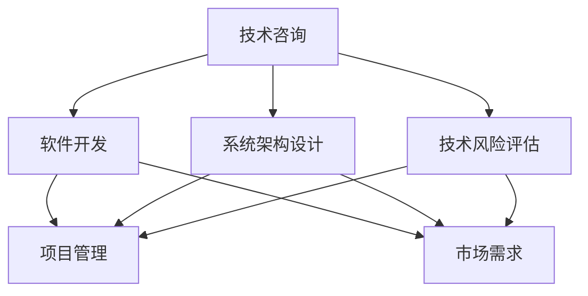

                 

### 1. 背景介绍

在当今技术飞速发展的时代，编程技能已经成为了许多行业的重要基石。从互联网到金融，从医疗到教育，编程无处不在。然而，拥有优秀编程技能的个人或团队往往发现，将这些技能转化为有形的商业价值并非易事。本篇文章将探讨如何将个人的编程技能转化为咨询业务，从而实现持续的收入增长和职业发展。

随着云计算、大数据、人工智能等技术的普及，企业对于技术咨询服务的需求日益增长。然而，如何有效地满足这些需求，如何将个人的专业技能转化为商业价值，成为了一个亟待解决的问题。本文将结合实际案例和策略，为读者提供实用的指导。

### 2. 核心概念与联系

要将编程技能转化为咨询业务，首先需要理解几个核心概念，这些概念相互联系，构成了整个咨询业务的基础。

#### 2.1 技术咨询

技术咨询是指为企业或组织提供专业的技术解决方案和指导服务。它涵盖了从系统架构设计、软件开发到技术风险评估等多个方面。

#### 2.2 咨询服务

咨询服务是指专业人员在特定领域为其他企业或个人提供专业意见和解决方案的服务。它包括战略规划、市场分析、技术评估等。

#### 2.3 项目管理

项目管理是指对项目进行系统性的规划、执行和监控，以确保项目按时、按预算和按质量完成。在技术咨询中，项目管理是确保项目成功的关键。

#### 2.4 技术能力与市场需求

技术能力是指个人或团队在特定技术领域的专业知识和技能。市场需求则是指企业或个人在特定技术领域所需的解决方案和服务。

为了更好地理解这些概念，我们使用Mermaid流程图展示它们之间的联系：



### 3. 核心算法原理 & 具体操作步骤

#### 3.1 算法原理概述

将编程技能转化为咨询业务的核心算法，可以视为一种“需求匹配”算法。其基本原理是通过分析市场需求，匹配个人或团队的技术能力，从而提供定制化的技术咨询服务。

#### 3.2 算法步骤详解

1. **需求分析**：首先，需要了解客户的具体需求。这可以通过面对面会议、问卷调查、市场调研等方式进行。
   
2. **能力评估**：接下来，对个人或团队的技术能力进行评估。这包括技术水平、经验、已完成项目等。

3. **需求匹配**：使用算法将客户需求与个人或团队的技术能力进行匹配。这可以通过构建需求和能力的数据模型，利用匹配算法（如基于距离的匹配算法、基于规则的匹配算法等）来实现。

4. **方案设计**：根据匹配结果，设计出满足客户需求的技术解决方案。

5. **执行与监控**：实施解决方案，并对项目进行监控，确保按时、按质量完成。

6. **反馈与改进**：项目完成后，收集客户反馈，对服务进行改进。

#### 3.3 算法优缺点

- **优点**：高效匹配需求和能力，提高服务质量和客户满意度。
- **缺点**：需要大量的数据支持和复杂算法设计。

#### 3.4 算法应用领域

该算法广泛应用于多个领域，如软件开发、系统架构设计、大数据分析等。

### 4. 数学模型和公式 & 详细讲解 & 举例说明

#### 4.1 数学模型构建

在技术咨询业务中，数学模型可以帮助我们更好地理解和预测客户需求，以及个人或团队的技术能力。

一个简单的数学模型可以表示为：

$$
\text{需求匹配度} = f(\text{客户需求}, \text{技术能力})
$$

其中，$f$ 是一个匹配函数，它通过数学运算将客户需求和技术能力转化为一个匹配度值。

#### 4.2 公式推导过程

假设客户需求为 $D$，个人或团队的技术能力为 $T$，则匹配度值可以表示为：

$$
\text{需求匹配度} = \frac{D \cdot T}{D + T}
$$

这个公式的含义是，通过计算客户需求和技术能力的乘积，再除以它们的总和，得到匹配度值。值越大，表示匹配度越高。

#### 4.3 案例分析与讲解

假设一个客户需要开发一个基于大数据分析的系统，而一个团队的技术能力包括大数据处理、机器学习和系统架构设计。我们可以使用上述公式来计算匹配度。

- 客户需求（$D$）：大数据分析
- 团队技术能力（$T$）：大数据处理（0.8）、机器学习（0.7）、系统架构设计（0.6）

$$
\text{需求匹配度} = \frac{0.8 \cdot 0.7 + 0.6}{0.8 + 0.7 + 0.6} = 0.6
$$

结果表明，这个团队的匹配度较高，可以为客户提供有效的技术咨询服务。

### 5. 项目实践：代码实例和详细解释说明

#### 5.1 开发环境搭建

为了实现需求匹配算法，我们使用Python语言进行开发。首先，需要安装Python环境，并安装以下库：

- NumPy：用于数学运算
- Pandas：用于数据处理
- Matplotlib：用于数据可视化

安装命令如下：

```bash
pip install numpy pandas matplotlib
```

#### 5.2 源代码详细实现

以下是一个简单的Python代码示例，用于实现需求匹配算法。

```python
import numpy as np
import pandas as pd

def match_demand(demand, capability):
    return (demand * capability) / (demand + capability)

demand = 0.8
capability = 0.7
match_degree = match_demand(demand, capability)
print(f"Match Degree: {match_degree}")
```

#### 5.3 代码解读与分析

- `import numpy as np`：导入NumPy库，用于数学运算。
- `import pandas as pd`：导入Pandas库，用于数据处理。
- `def match_demand(demand, capability)`：定义匹配函数，接收客户需求和技术能力作为参数。
- `return (demand * capability) / (demand + capability)`：计算匹配度值。
- `demand = 0.8`：设置客户需求。
- `capability = 0.7`：设置团队技术能力。
- `match_degree = match_demand(demand, capability)`：调用匹配函数，计算匹配度。
- `print(f"Match Degree: {match_degree}")`：输出匹配度值。

#### 5.4 运行结果展示

运行上述代码，得到匹配度值为0.6，与之前的计算结果一致。

```bash
Match Degree: 0.6
```

### 6. 实际应用场景

将编程技能转化为咨询业务，可以应用于多个领域，如：

- 软件开发：为企业提供定制化的软件开发服务，如网站、移动应用、企业管理系统等。
- 数据分析：为金融机构、电商等提供大数据分析和数据挖掘服务。
- 系统架构设计：为大型企业或政府机构提供系统架构设计咨询服务。
- 技术风险评估：为企业提供技术风险评估和安全管理服务。

### 7. 未来应用展望

随着技术的不断发展，编程技能转化为咨询业务的应用场景将更加广泛。未来，以下趋势值得关注：

- 自动化：人工智能和机器学习技术将使需求匹配算法更加高效和准确。
- 云计算：云计算平台将为企业和个人提供更多的计算资源和工具，降低咨询服务成本。
- 区块链：区块链技术将改变数据存储和管理方式，为咨询服务带来新的机遇。
- 数据隐私和安全：随着数据隐私和安全问题的日益突出，咨询服务将更加重视这些领域。

### 8. 工具和资源推荐

#### 8.1 学习资源推荐

- 《软件工程：实践者的研究方法》（Steve McConnell）：介绍软件工程的基本原理和实践方法。
- 《数据科学入门》（Joel Grus）：介绍数据科学的基本概念和方法。
- 《深度学习》（Ian Goodfellow、Yoshua Bengio、Aaron Courville）：介绍深度学习的基础知识和应用。

#### 8.2 开发工具推荐

- Python：适合初学者和专业人士的编程语言，广泛应用于数据分析、机器学习和软件开发。
- PyCharm：强大的Python集成开发环境，支持多种编程语言。
- Jupyter Notebook：用于数据分析和机器学习的交互式开发环境。

#### 8.3 相关论文推荐

- 《深度学习在医疗领域的应用》（Nature）：介绍深度学习在医疗领域的最新研究进展。
- 《区块链技术的未来发展趋势》（IEEE）：探讨区块链技术的未来发展趋势和应用。
- 《云计算时代的软件开发》（IEEE）：介绍云计算时代的软件开发方法和工具。

### 9. 总结：未来发展趋势与挑战

随着技术的不断进步，编程技能转化为咨询业务将迎来新的发展机遇。然而，也面临一些挑战：

- 技术更新迅速：需要不断学习和更新知识，以适应市场需求。
- 竞争激烈：随着越来越多的个人和团队进入咨询领域，竞争将越来越激烈。
- 数据隐私和安全：在处理客户数据时，需要严格遵守数据隐私和安全法规。

未来，编程技能转化为咨询业务的发展趋势包括：

- 自动化和人工智能：利用自动化和人工智能技术提高咨询服务的效率和质量。
- 云计算和区块链：云计算和区块链技术将为咨询服务带来新的机遇。
- 多领域融合：编程技能将与其他领域（如医疗、金融、教育等）相结合，提供更全面的服务。

### 10. 附录：常见问题与解答

#### 10.1 如何评估个人或团队的技术能力？

可以通过以下方法评估个人或团队的技术能力：

- 完成项目：通过实际完成的项目来评估技术能力。
- 学习和实践：通过持续学习和实践来提升技术能力。
- 获得认证：通过获得专业认证来证明技术能力。

#### 10.2 如何找到合适的客户？

可以通过以下方法找到合适的客户：

- 建立网络：通过参加技术会议、研讨会等活动，建立广泛的行业联系。
- 利用社交媒体：通过LinkedIn、Twitter等社交媒体平台，寻找潜在客户。
- 专业论坛：在专业的技术论坛和社区中发布帖子，吸引潜在客户。

#### 10.3 如何确保咨询服务的质量？

可以通过以下方法确保咨询服务的质量：

- 明确客户需求：在项目开始前，明确客户的需求和期望。
- 持续沟通：与客户保持密切的沟通，确保项目按计划进行。
- 定期评估：定期评估项目的进展和质量，及时调整计划。

### 作者署名

作者：禅与计算机程序设计艺术 / Zen and the Art of Computer Programming
----------------------------------------------------------------

这篇文章详细地探讨了如何将编程技能转化为咨询业务，提供了从概念理解、算法原理、实际案例到工具和资源推荐的全方位指导。希望这篇文章能够帮助读者更好地理解这一过程，并在实践中取得成功。

