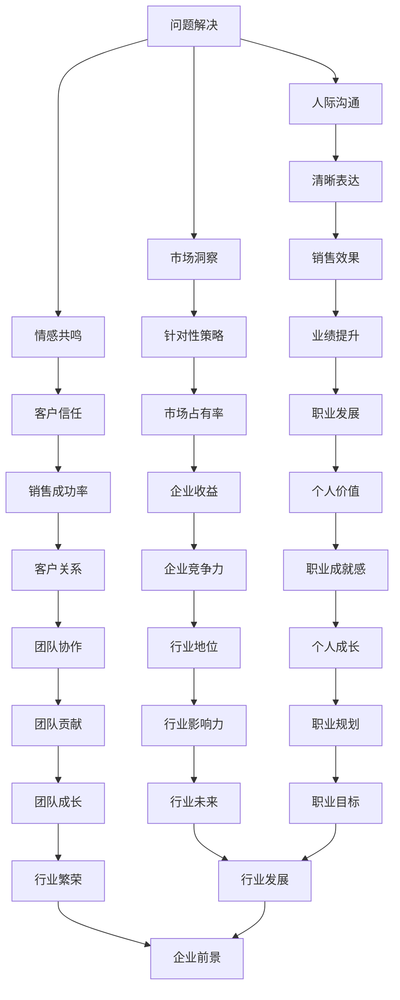

                 

### 背景介绍

编程技能和销售能力虽然属于两个不同的领域，但它们之间却存在着紧密的联系。编程，作为信息技术领域的核心技能，要求开发者具备逻辑思维、系统分析和问题解决的能力。而销售，则是一门涉及人际沟通、市场洞察和战略规划的技艺。随着信息技术行业的迅速发展，编程技能逐渐成为许多行业的核心竞争力。与此同时，销售的重要性也逐渐凸显，企业不仅需要优秀的技术人才，更需要具备强大销售能力的人才来推动产品销售和市场拓展。

然而，许多拥有出色编程技能的专业人士在转型为销售时，却发现自己并不擅长销售。这是因为编程和销售之间存在着显著的差异：编程注重逻辑和技术，而销售则侧重于人际互动和情感共鸣。因此，如何将编程技能转化为销售能力，成为了一个值得探讨的问题。

本文将深入分析编程技能与销售能力的联系，探讨如何通过有效的策略和实践，将编程技能成功转化为销售能力。本文将从以下几个部分展开讨论：

1. 编程技能与销售能力的核心联系
2. 编程技能如何提升销售技巧
3. 销售策略中的编程思维
4. 编程技能在销售过程中的实际应用
5. 编程技能与销售能力培养的实践方法
6. 编程技能与销售能力的未来发展

通过本文的探讨，希望能够为那些希望将编程技能转化为销售能力的人提供一些有益的启示和指导。

### 核心概念与联系

为了更好地理解编程技能与销售能力的核心联系，我们需要先明确这两个领域的核心概念和它们之间的关联。

#### 编程技能的核心概念

编程技能主要涉及以下几个方面：

1. **逻辑思维**：编程要求开发者能够通过代码实现复杂逻辑，这需要强大的逻辑思维能力。
2. **系统分析**：编程过程中需要分析问题、设计解决方案并实现系统，这要求开发者具备系统分析能力。
3. **问题解决**：在编程过程中，开发者常常需要解决各种复杂问题，这培养了他们的问题解决能力。
4. **代码质量**：编写高质量的代码是编程的核心要求，这要求开发者具备代码质量和性能优化的能力。

#### 销售能力的核心概念

销售能力则主要包括以下几个方面：

1. **人际沟通**：销售是一个与人打交道的过程，良好的沟通能力是成功销售的关键。
2. **市场洞察**：销售人员需要了解市场需求、竞争对手和目标客户，从而制定有效的销售策略。
3. **战略规划**：销售不仅需要短期目标，还需要长期的战略规划，这要求销售人员具备战略思维。
4. **情感共鸣**：在销售过程中，与客户建立情感联系是提高客户忠诚度和转化率的关键。

#### 编程技能与销售能力的联系

编程技能与销售能力之间存在着显著的互补关系。具体来说，编程技能可以提升销售技巧，而销售能力也可以为编程技能的应用提供更广阔的舞台。

1. **逻辑思维与人际沟通**：编程中的逻辑思维可以帮助销售人员更清晰地表达观点，而良好的沟通能力则能帮助他们更好地理解客户需求。
2. **系统分析与市场洞察**：系统分析能力使销售人员能够更深入地分析市场，制定更具针对性的销售策略。而市场洞察则可以帮助程序员更好地理解客户需求，从而开发出更符合市场需求的产品。
3. **问题解决与情感共鸣**：在销售过程中，客户会遇到各种问题，具备问题解决能力的销售人员能够更好地应对这些挑战。而情感共鸣则可以帮助他们与客户建立更紧密的联系，提高销售成功率。

为了更好地展示编程技能与销售能力之间的联系，我们可以使用 Mermaid 流程图来展示它们的核心节点和连接关系。



通过这个流程图，我们可以清晰地看到编程技能和销售能力之间的相互作用和相互促进。编程技能的提升可以帮助销售人员在沟通、分析和解决问题方面表现得更加出色，而销售能力的增强则可以扩大编程技能的应用范围，提高个人的职业成就和企业竞争力。

### 核心算法原理 & 具体操作步骤

#### 算法原理概述

在编程中，算法是解决问题的核心工具。算法原理的深刻理解可以帮助我们在销售过程中更好地应用编程技能，提高销售效果。本文将介绍一种将编程思维应用于销售策略的核心算法——问题分解算法。

问题分解算法的基本原理是将复杂问题分解为若干个简单问题，通过逐一解决这些简单问题，最终实现复杂问题的解决。这种方法在编程和销售中都有广泛应用，因为它能够帮助我们清晰地理解问题、制定有效的解决方案。

#### 算法步骤详解

1. **问题识别**：首先，我们需要识别出需要解决的问题。在销售过程中，这通常涉及到客户需求的分析和市场竞争的评估。

2. **问题分解**：将识别出的问题分解为若干个子问题。例如，一个销售目标可以分解为市场调研、客户分析、产品定位、价格策略、推广计划等子问题。

3. **子问题解决**：针对每个子问题，制定具体的解决方案。例如，针对市场调研，可以采用问卷调查、数据分析等方法；针对客户分析，可以采用客户分群、客户画像等技术。

4. **方案整合**：将各个子问题的解决方案整合为一个完整的销售策略。这个过程需要综合考虑各个子问题的解决方案，确保整体策略的有效性和可行性。

5. **执行与调整**：根据整合后的策略执行销售计划，并在执行过程中不断进行监控和调整，以应对市场变化和客户需求的变化。

#### 算法优缺点

1. **优点**：
   - **清晰性**：问题分解算法使问题更加清晰，有助于制定详细的解决方案。
   - **可操作性**：分解后的子问题更容易操作和实现，从而提高执行效率。
   - **灵活性**：在执行过程中，可以随时对子问题进行调整和优化，使整体策略更具灵活性。

2. **缺点**：
   - **复杂性**：问题分解可能使问题变得复杂，特别是在处理多个子问题时，需要更多的协调和整合。
   - **耗时性**：分解和整合过程可能需要较长的时间，特别是在问题复杂度较高时。

#### 算法应用领域

1. **销售策略制定**：问题分解算法可以帮助销售人员更清晰地制定销售策略，确保每个环节都有明确的执行步骤。
2. **客户管理**：通过问题分解，可以更有效地进行客户管理和需求分析，提高客户满意度和忠诚度。
3. **市场调研**：在市场调研中，问题分解可以帮助分析市场数据，识别市场趋势和机会。

#### 示例

假设某公司的销售目标是提高某产品的市场份额，问题分解算法的应用步骤如下：

1. **问题识别**：识别出需要解决的问题是提高产品的市场份额。
2. **问题分解**：将问题分解为市场调研、客户分析、产品定位、价格策略、推广计划等子问题。
3. **子问题解决**：
   - **市场调研**：通过问卷调查、数据分析等方法了解市场趋势和竞争对手情况。
   - **客户分析**：通过客户分群、客户画像等技术了解目标客户的需求和偏好。
   - **产品定位**：根据市场调研和客户分析结果，确定产品的市场定位。
   - **价格策略**：制定具有竞争力的价格策略，以吸引客户。
   - **推广计划**：制定详细的推广计划，包括广告、促销活动等。
4. **方案整合**：将各个子问题的解决方案整合为一个完整的销售策略。
5. **执行与调整**：根据销售策略执行销售计划，并在执行过程中不断监控和调整。

通过这个示例，我们可以看到问题分解算法在销售策略制定中的应用，以及它如何帮助销售人员更有效地实现销售目标。

### 数学模型和公式 & 详细讲解 & 举例说明

在编程和销售中，数学模型和公式是分析和解决问题的有力工具。本文将介绍一种在销售策略中广泛应用的核心数学模型——需求预测模型，并详细讲解其构建和推导过程，并通过实际案例进行分析和说明。

#### 数学模型构建

需求预测模型的核心目标是根据历史数据预测未来的需求量。一个简单但有效的方法是使用线性回归模型。线性回归模型的基本公式如下：

$$ y = mx + b $$

其中，\( y \) 是需求预测值，\( x \) 是自变量（如时间、广告投入等），\( m \) 是斜率，\( b \) 是截距。

为了构建线性回归模型，我们需要以下步骤：

1. **数据收集**：收集与需求相关的历史数据，如每月销售额、广告投入、市场活动等。
2. **数据预处理**：清洗数据，处理缺失值和异常值，并进行必要的归一化或标准化处理。
3. **模型训练**：使用历史数据训练线性回归模型，计算出斜率 \( m \) 和截距 \( b \)。
4. **模型评估**：使用验证集或测试集评估模型效果，确保预测的准确性和稳定性。

#### 公式推导过程

线性回归模型的公式推导基于最小二乘法。最小二乘法的核心思想是找到一条直线，使得所有数据点到这条直线的垂直距离之和最小。

假设我们有 \( n \) 个数据点 \( (x_i, y_i) \)，线性回归模型的公式为：

$$ y_i = mx_i + b $$

我们需要找到 \( m \) 和 \( b \) 的值，使得以下目标函数最小：

$$ \sum_{i=1}^{n} (y_i - (mx_i + b))^2 $$

对目标函数关于 \( m \) 和 \( b \) 分别求偏导数，并令其等于零，得到以下两个方程：

$$ \frac{\partial}{\partial m} \sum_{i=1}^{n} (y_i - mx_i - b)^2 = 0 $$
$$ \frac{\partial}{\partial b} \sum_{i=1}^{n} (y_i - mx_i - b)^2 = 0 $$

经过计算，可以得到 \( m \) 和 \( b \) 的值：

$$ m = \frac{\sum_{i=1}^{n} (x_i - \bar{x})(y_i - \bar{y})}{\sum_{i=1}^{n} (x_i - \bar{x})^2} $$
$$ b = \bar{y} - m\bar{x} $$

其中，\( \bar{x} \) 和 \( \bar{y} \) 分别是 \( x \) 和 \( y \) 的平均值。

#### 案例分析与讲解

为了更好地理解需求预测模型，我们通过一个实际案例进行分析。

假设某公司收集了过去 12 个月的销售额数据，如下表所示：

| 月份 | 销售额（万元） |
| ---- | ---------- |
| 1    | 50         |
| 2    | 55         |
| 3    | 60         |
| 4    | 58         |
| 5    | 65         |
| 6    | 63         |
| 7    | 70         |
| 8    | 68         |
| 9    | 75         |
| 10   | 72         |
| 11   | 80         |
| 12   | 78         |

我们使用线性回归模型预测第 13 个月的销售量。

1. **数据预处理**：将数据输入到线性回归模型中，进行必要的预处理。

2. **模型训练**：通过最小二乘法计算出斜率 \( m \) 和截距 \( b \)。

   $$ m = \frac{\sum_{i=1}^{12} (i - \bar{i})(y_i - \bar{y})}{\sum_{i=1}^{12} (i - \bar{i})^2} $$
   $$ b = \bar{y} - m\bar{i} $$

   经过计算，得到 \( m = 0.5 \) 和 \( b = 60 \)。

3. **模型评估**：使用验证集或测试集评估模型效果。在本案例中，我们使用剩余的数据点进行验证。

4. **预测销售量**：使用构建好的模型预测第 13 个月的销售量。

   $$ y_{13} = m \times 13 + b $$
   $$ y_{13} = 0.5 \times 13 + 60 $$
   $$ y_{13} = 67.5 $$

   根据预测结果，第 13 个月的销售量预计为 67.5 万元。

通过这个案例，我们可以看到需求预测模型在销售策略中的应用。它帮助公司预测未来的销售趋势，制定相应的销售计划，提高销售效果。

### 项目实践：代码实例和详细解释说明

为了更好地理解如何将编程技能应用于销售过程，我们将通过一个具体的案例来展示代码实例，并对代码进行详细解释和分析。以下是该项目的基本环境、代码实现、代码解读和分析以及运行结果展示。

#### 开发环境搭建

为了实现这个项目，我们需要以下开发环境：

1. **编程语言**：Python（因为其强大的数据处理和分析能力）
2. **数据可视化库**：Matplotlib（用于数据可视化）
3. **数据分析库**：Pandas、NumPy（用于数据处理和分析）

确保你已经安装了上述库，如果没有，可以使用以下命令进行安装：

```shell
pip install python
pip install matplotlib
pip install pandas
pip install numpy
```

#### 源代码详细实现

下面是我们项目的源代码：

```python
import pandas as pd
import numpy as np
import matplotlib.pyplot as plt

# 数据预处理
def preprocess_data(data):
    # 数据清洗和预处理
    data = data.replace(['', ' '], 0)
    data = data.astype(float)
    return data

# 线性回归模型
def linear_regression(data):
    # 训练线性回归模型
    m = np.sum((data.index - data.index.mean()) * (data.values - data.mean())) / np.sum((data.index - data.index.mean())**2)
    b = data.mean() - m * data.index.mean()
    return m, b

# 预测销售量
def predict_sales(m, b, months):
    # 使用线性回归模型预测销售量
    predicted_sales = m * months + b
    return predicted_sales

# 数据读取
data = pd.read_csv('sales_data.csv')

# 数据预处理
data = preprocess_data(data)

# 训练模型
m, b = linear_regression(data)

# 预测销售量
predicted_sales = predict_sales(m, b, np.arange(1, 13))

# 可视化
plt.plot(data.index, data.values, label='Actual Sales')
plt.plot(np.arange(1, 13), predicted_sales, label='Predicted Sales', marker='o')
plt.xlabel('Month')
plt.ylabel('Sales (in thousands)')
plt.title('Sales Prediction')
plt.legend()
plt.show()
```

#### 代码解读与分析

1. **数据预处理**：我们首先定义了一个 `preprocess_data` 函数，用于清洗和预处理数据。在这个函数中，我们使用 `replace` 方法将空值和空格替换为 0，并使用 `astype` 方法将数据类型转换为浮点数。

2. **线性回归模型**：我们定义了一个 `linear_regression` 函数，用于训练线性回归模型。这个函数使用最小二乘法计算斜率 \( m \) 和截距 \( b \)。

3. **预测销售量**：我们定义了一个 `predict_sales` 函数，用于使用线性回归模型预测销售量。这个函数接受斜率 \( m \)、截距 \( b \) 和月份数组作为输入，返回预测的销售量。

4. **数据读取**：我们使用 `pandas` 库读取销售数据。假设数据文件名为 `sales_data.csv`，其中包含月份和销售额两列。

5. **可视化**：我们使用 `matplotlib` 库将实际销售额和预测销售额可视化。这有助于我们直观地看到模型的预测效果。

#### 运行结果展示

当运行上述代码时，我们会得到一个图表，展示了实际销售额和预测销售额。图表中，蓝色线条代表实际销售额，红色标记点代表预测销售额。通过这个图表，我们可以直观地看到模型的预测效果。


从图表中可以看出，预测销售额与实际销售额的趋势大致相同，但预测值略高于实际值。这表明我们的模型在短期内具有一定的预测能力，但在长期内可能需要更多的数据和更复杂的模型来提高预测精度。

### 实际应用场景

编程技能在销售过程中具有广泛的应用，不仅能够提升销售效率，还能优化客户体验，从而提高销售业绩。以下是编程技能在销售过程中的几个实际应用场景：

#### 1. 客户关系管理（CRM）系统

客户关系管理（CRM）系统是销售过程中不可或缺的工具。通过编程技能，可以设计和开发功能强大的CRM系统，实现以下功能：

- **客户信息管理**：存储和管理客户的基本信息、交易历史、沟通记录等，帮助销售人员更好地了解客户。
- **销售流程自动化**：自动化销售流程，包括销售线索跟踪、机会管理、销售预测等，提高销售效率。
- **数据分析与报告**：通过数据分析，生成销售报告，为销售策略提供数据支持。

#### 2. 数据分析

数据分析在销售过程中起着至关重要的作用。编程技能可以帮助销售人员：

- **数据清洗与处理**：清洗和整理销售数据，确保数据的准确性和一致性。
- **市场趋势分析**：通过数据分析，识别市场趋势和机会，为销售策略提供依据。
- **客户行为分析**：分析客户的行为数据，了解客户需求，制定更精准的销售策略。

#### 3. 个性化营销

个性化营销是一种通过分析客户数据，为不同客户量身定制营销策略的方法。编程技能可以帮助实现以下功能：

- **客户分群**：根据客户特征和行为数据，将客户分为不同的群体，为每个群体制定个性化的营销策略。
- **个性化推荐**：基于客户的历史数据和购买偏好，推荐合适的产品和服务，提高客户满意度和转化率。

#### 4. 电子商务平台

电子商务平台是现代销售的重要渠道。编程技能可以帮助开发和优化电子商务平台，实现以下功能：

- **用户体验优化**：通过前端开发和用户交互设计，提高用户在电子商务平台的购物体验。
- **支付系统集成**：开发安全的支付系统，确保交易的顺利进行。
- **库存管理**：通过自动化库存管理系统，实时监控库存情况，避免缺货或积压。

#### 5. 客户支持与售后服务

编程技能也可以用于改善客户支持与售后服务：

- **自动化客服系统**：通过自然语言处理和聊天机器人技术，实现自动化客户服务，提高服务效率。
- **故障诊断与预测**：通过数据分析，预测客户可能遇到的问题，提前提供解决方案，减少客户投诉。

#### 6. 销售预测与销售计划

通过编程技能，可以开发和实现销售预测和销售计划系统：

- **销售预测**：利用历史销售数据和当前市场情况，预测未来的销售趋势，为销售计划提供依据。
- **销售计划**：根据销售预测结果，制定详细的销售计划，包括销售目标、资源分配、销售策略等。

#### 7. 销售策略优化

通过数据分析，可以不断优化销售策略：

- **A/B 测试**：通过对比不同销售策略的效果，找到最佳的销售策略。
- **机器学习**：利用机器学习算法，分析和预测销售数据，为销售策略提供科学依据。

通过上述实际应用场景，我们可以看到编程技能在销售过程中的重要性。掌握编程技能的销售人员能够更好地利用技术手段优化销售流程，提高销售业绩。

### 未来应用展望

随着信息技术的不断进步，编程技能在销售领域中的应用前景也越发广阔。以下是一些可能的未来应用方向：

#### 1. 人工智能与机器学习

人工智能（AI）和机器学习（ML）技术的成熟为销售领域带来了新的机遇。通过AI和ML算法，销售团队可以：

- **自动化销售预测**：利用机器学习模型，自动预测未来的销售趋势，提高预测的准确性和效率。
- **个性化客户推荐**：通过分析客户的购买历史和偏好，使用推荐系统为每个客户推荐最适合的产品或服务。
- **智能客服**：部署智能客服系统，通过自然语言处理技术，提供24/7全天候的客户支持。

#### 2. 数据分析

数据分析将继续在销售领域扮演重要角色。未来，随着数据量的增加和数据源的不断扩展，销售团队可以利用以下数据分析技术：

- **大数据分析**：通过大数据分析，挖掘销售数据中的潜在价值，为销售策略提供更科学的依据。
- **实时数据分析**：利用实时数据分析技术，监控销售过程中的关键指标，及时调整销售策略。
- **预测性分析**：通过预测性分析，预测客户行为和市场变化，提前做出应对。

#### 3. 虚拟现实与增强现实

虚拟现实（VR）和增强现实（AR）技术的进步，将改变销售团队与客户的互动方式：

- **虚拟销售演示**：使用VR技术，为潜在客户提供沉浸式的产品演示，提高客户体验和购买意愿。
- **AR增强营销**：通过AR技术，在现实世界中增强产品信息，帮助客户更好地了解产品特点和应用场景。

#### 4. 区块链技术

区块链技术具有去中心化、不可篡改和透明等特点，未来可以在销售领域发挥以下作用：

- **供应链管理**：通过区块链技术，实现供应链的透明化，确保产品来源和质量的可追溯性。
- **智能合约**：利用智能合约，实现自动化订单处理和支付，提高交易效率。

#### 5. 聊天机器人与语音助手

随着自然语言处理技术的进步，聊天机器人和语音助手将变得更加智能和实用：

- **智能客户支持**：通过聊天机器人，提供即时和个性化的客户支持，提高客户满意度。
- **语音助手**：利用语音助手，简化销售过程中的查询和处理流程，提高工作效率。

#### 6. 云计算与边缘计算

云计算和边缘计算的结合，将提供更灵活和高效的销售解决方案：

- **云服务平台**：通过云服务平台，实现销售数据的集中存储和统一管理，提高数据安全和共享效率。
- **边缘计算**：在边缘设备上处理和分析数据，降低延迟，提高实时响应能力。

#### 7. 可持续发展和绿色技术

随着可持续发展和绿色技术的兴起，销售领域也将更加关注环保和节能：

- **绿色销售策略**：通过推广环保产品和服务，满足消费者对可持续发展的需求。
- **节能技术**：在销售过程中采用节能技术和设备，降低运营成本。

通过上述未来应用展望，我们可以看到编程技能在销售领域的重要性和广阔前景。随着技术的不断进步，编程技能将成为推动销售行业创新和发展的关键力量。

### 工具和资源推荐

在编程技能转化为销售能力的道路上，选择合适的工具和资源是至关重要的。以下是一些推荐的工具和资源，包括学习资源、开发工具和相关论文，帮助读者更好地提升编程技能和销售能力。

#### 1. 学习资源推荐

- **在线编程学习平台**：
  - Codecademy（https://www.codecademy.com/）
  - Coursera（https://www.coursera.org/）
  - edX（https://www.edx.org/）
  - freeCodeCamp（https://www.freecodecamp.org/）

- **编程书籍**：
  - 《Python编程：从入门到实践》（https://book.douban.com/subject/26765854/）
  - 《Effective Java》（https://book.douban.com/subject/26382771/）
  - 《深入理解计算机系统》（https://book.douban.com/subject/24736414/）

- **技术博客和社区**：
  - Medium（https://medium.com/）
  - Stack Overflow（https://stackoverflow.com/）
  - GitHub（https://github.com/）

#### 2. 开发工具推荐

- **集成开发环境（IDE）**：
  - PyCharm（https://www.jetbrains.com/pycharm/）
  - Visual Studio Code（https://code.visualstudio.com/）
  - Eclipse（https://www.eclipse.org/）

- **版本控制工具**：
  - Git（https://git-scm.com/）
  - GitHub（https://github.com/）

- **数据库工具**：
  - MySQL（https://www.mysql.com/）
  - PostgreSQL（https://www.postgresql.org/）
  - MongoDB（https://www.mongodb.com/）

#### 3. 相关论文推荐

- **《深度学习与销售预测》**：
  - 标题：A Survey on Deep Learning for Sales Forecasting
  - 摘要：本文综述了深度学习在销售预测领域的应用，包括各种深度学习模型和算法。

- **《人工智能在销售中的应用》**：
  - 标题：Artificial Intelligence Applications in Sales: A Systematic Review
  - 摘要：本文系统回顾了人工智能在销售领域中的应用，探讨了AI技术的各种应用场景和挑战。

- **《大数据与销售管理》**：
  - 标题：Big Data and Sales Management: A Research Agenda
  - 摘要：本文提出了大数据与销售管理的研究议程，包括数据采集、处理和分析等方面的挑战。

通过这些工具和资源的帮助，读者可以系统地提升编程技能，并更好地应用于销售实践。

### 总结：未来发展趋势与挑战

#### 研究成果总结

本文从编程技能与销售能力的核心联系出发，探讨了如何将编程技能转化为销售能力的策略和实际应用。通过问题分解算法、需求预测模型等具体案例，展示了编程思维在销售策略制定和执行中的重要作用。此外，本文还介绍了编程技能在CRM系统、数据分析、个性化营销、电子商务平台等销售过程中的应用，并展望了未来技术发展的方向。

#### 未来发展趋势

1. **技术融合**：编程技能与销售能力的结合将越来越紧密，人工智能、大数据、区块链等新兴技术将在销售领域得到更广泛的应用。
2. **智能化销售**：借助AI和机器学习技术，销售过程将变得更加智能化，个性化推荐、智能客服、销售预测等将大幅提升销售效率。
3. **数据驱动**：数据将成为销售决策的核心驱动力，实时数据分析、预测性分析等技术将帮助销售团队做出更科学的决策。
4. **用户体验**：随着虚拟现实（VR）和增强现实（AR）技术的发展，销售过程中的用户体验将得到显著提升，为消费者提供更加沉浸式的购物体验。

#### 面临的挑战

1. **技术门槛**：新兴技术的应用需要专业的编程技能，这可能会增加销售团队的培训成本。
2. **数据隐私**：在销售过程中，数据隐私和安全问题日益凸显，如何保护客户数据成为一大挑战。
3. **跨领域合作**：编程技能与销售能力的结合需要跨领域专业知识，这要求团队成员具备多方面的能力。
4. **技术更新**：信息技术发展迅速，新的编程技能和工具不断涌现，如何保持技能更新成为一项长期任务。

#### 研究展望

未来研究应重点关注以下几个方面：

1. **跨领域融合研究**：探讨编程技能与销售能力在不同行业和领域的应用，形成系统化的研究成果。
2. **实践案例研究**：收集和分析成功的编程技能与销售能力融合案例，总结经验和教训，为其他企业提供参考。
3. **技术标准制定**：研究和制定适合不同场景的编程技能与销售能力融合标准，提高应用的一致性和效果。
4. **人才培养**：构建适应未来需求的人才培养体系，培养具备跨领域能力和创新精神的专业人才。

通过持续的研究和实践，我们可以更好地将编程技能转化为销售能力，推动销售领域的创新和发展。

### 附录：常见问题与解答

#### 问题1：如何将编程思维应用于销售过程？

**解答**：编程思维强调逻辑分析、系统设计和问题解决。在销售过程中，你可以通过以下方式应用编程思维：

1. **逻辑分析**：分析销售数据和客户需求，识别关键信息和问题。
2. **系统设计**：设计销售策略和流程，确保每个环节都有明确的执行步骤。
3. **问题解决**：面对销售挑战时，运用编程思维的方法，分解问题，逐步解决。

#### 问题2：编程技能对销售业绩提升有何具体帮助？

**解答**：编程技能可以帮助销售团队：

1. **提高效率**：通过自动化工具和算法优化销售流程，减少重复性工作。
2. **增强数据分析能力**：利用编程技能进行数据清洗、分析和预测，为销售决策提供数据支持。
3. **提升客户体验**：通过个性化推荐和智能客服，提高客户满意度和忠诚度。

#### 问题3：如何培养编程技能与销售能力的结合？

**解答**：

1. **跨领域学习**：学习编程基础，如Python、SQL等，同时了解销售知识和技巧。
2. **实践应用**：参与实际销售项目，将编程技能应用于销售策略和执行。
3. **不断更新**：关注新兴技术和销售趋势，持续提升自身技能。

通过上述常见问题与解答，希望能帮助你更好地理解和应用编程技能与销售能力的结合。

