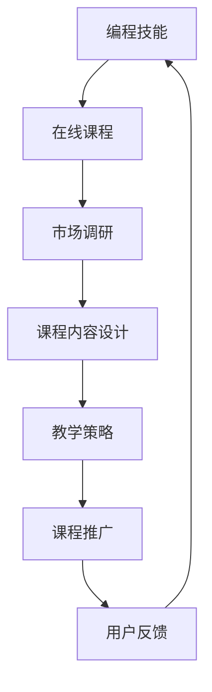

                 

关键词：编程技能，在线课程，高利润，教学策略，市场调研，内容制作，课程推广

> 摘要：在信息技术快速发展的时代，编程技能变得日益重要。本文旨在探讨如何将个人编程技能转化为高利润的在线课程。通过深入分析市场调研、课程内容设计、教学策略、课程推广等多个方面，提供一套系统化的方法，帮助编程爱好者和专业人员将他们的知识和技能转化为收益可观的在线课程。

## 1. 背景介绍

编程技能作为现代科技的核心能力，在过去的几十年中经历了爆炸性的增长。随着人工智能、大数据、物联网等新兴技术的兴起，编程已经不仅仅是计算机科学专业的专属技能，它正逐渐渗透到各行各业。因此，拥有编程技能的个人和企业都有着巨大的竞争优势。

在线教育作为信息技术的一个分支，正以前所未有的速度蓬勃发展。根据市场调研，全球在线教育市场规模在过去五年中持续增长，预计到2025年将达到近6000亿美元。在这个庞大的市场中，编程相关的在线课程需求尤为旺盛，成为教育培训领域的一个重要组成部分。

然而，如何将个人的编程技能转化为高利润的在线课程，不仅需要深厚的专业知识，还需要了解市场动态、教学策略和课程推广等多个方面。本文将围绕这一核心问题，探讨如何有效地将编程技能转化为具有市场竞争力的高利润在线课程。

### 1.1 编程技能的重要性

编程技能不仅是进入信息技术行业的关键，也正在成为许多其他领域的基础技能。以下是一些编程技能的重要应用：

1. **人工智能与机器学习**：编程是人工智能和机器学习的基石，能够帮助研究人员和开发人员构建智能系统。
2. **数据分析**：编程技能使得处理和分析大数据变得更加高效，为商业决策提供了数据支持。
3. **软件开发**：编程是软件开发的核心，无论是移动应用、网站还是复杂的系统，都需要编程实现。
4. **网络安全**：随着网络攻击的日益增多，网络安全成为企业关注的重点，编程技能对于开发和维护安全系统至关重要。
5. **自动化与效率提升**：编程技能可以帮助企业实现业务流程的自动化，提高工作效率。

### 1.2 在线教育的崛起

在线教育之所以能迅速崛起，得益于以下几个因素：

1. **技术进步**：互联网和移动设备的普及，使得在线学习变得更加便捷。
2. **市场需求**：随着人们对教育和技能提升的需求增加，在线教育提供了一个灵活、高效的学习渠道。
3. **经济因素**：在线教育降低了学习成本，使更多的人能够承担高质量的教育资源。
4. **环境因素**：尤其是在COVID-19疫情期间，在线教育成为了保持教育连续性的重要手段。

## 2. 核心概念与联系

在将编程技能转化为在线课程的过程中，我们需要理解几个核心概念，并建立它们之间的联系。以下是核心概念及其联系的 Mermaid 流程图：



### 2.1 市场调研

市场调研是成功课程的起点。通过了解目标市场的需求、竞争对手的情况以及潜在客户的需求，我们可以确定课程的主题、内容和推广策略。市场调研的深度和广度直接影响课程的市场接受度和盈利能力。

### 2.2 课程内容设计

课程内容设计是课程的灵魂。一个高质量的课程需要系统地组织知识点，确保内容既全面又有深度。课程内容设计应考虑以下几个方面：

- **知识体系**：构建清晰的课程结构，确保知识点之间逻辑连贯。
- **实践性**：提供实践操作案例，帮助学生将理论知识应用到实际项目中。
- **互动性**：引入互动元素，如在线讨论、作业和测试，提高学生的参与度和学习效果。
- **更新性**：确保课程内容紧跟技术发展的步伐，保持内容的现代性和前瞻性。

### 2.3 教学策略

教学策略是课程成功的关键。不同的课程内容可能需要不同的教学方法。以下是几种常见的教学策略：

- **讲授式教学**：适用于理论知识的传授。
- **项目驱动教学**：通过实际项目，让学生在实践中学习和应用知识。
- **互动式教学**：利用在线讨论、问答等形式，增加学生的互动和参与。
- **游戏化教学**：通过游戏化元素，提高学生的学习兴趣和积极性。

### 2.4 课程推广

课程推广是让课程被更多人知道的重要环节。有效的推广策略可以包括：

- **社交媒体**：利用社交媒体平台，如LinkedIn、Twitter、Facebook等，发布课程信息和优惠活动。
- **内容营销**：通过撰写技术博客、发布教程视频、制作宣传海报等方式，吸引潜在学员。
- **合作伙伴**：与相关行业的企业、培训机构合作，共同推广课程。
- **SEO优化**：通过搜索引擎优化，提高课程在搜索引擎中的排名，增加曝光度。

### 2.5 用户反馈

用户反馈是课程改进的宝贵资源。通过收集和分析用户反馈，我们可以了解课程的实际效果，发现存在的问题，并进行相应的调整。用户反馈还可以帮助课程内容更好地满足市场需求，提高课程的竞争力和盈利能力。

## 3. 核心算法原理 & 具体操作步骤

在将编程技能转化为在线课程的过程中，选择合适的算法和编程语言是非常重要的。以下是核心算法原理及其具体操作步骤的概述：

### 3.1 算法原理概述

核心算法可以分为以下几类：

- **数据结构算法**：如排序、查找、图算法等，是编程中的基础。
- **算法设计模式**：如动态规划、贪心算法、回溯算法等，提供了解决特定问题的通用思路。
- **机器学习算法**：如线性回归、决策树、神经网络等，是人工智能领域的核心。

### 3.2 算法步骤详解

以下是每个算法的具体操作步骤：

#### 3.2.1 数据结构算法

- **排序算法**：
  1. 选择一个排序方法，如快速排序、归并排序或冒泡排序。
  2. 对数组进行排序，确保数组中的元素按照一定的顺序排列。

- **查找算法**：
  1. 选择一个查找方法，如二分查找或线性查找。
  2. 在数据结构中查找指定的元素，返回其位置。

- **图算法**：
  1. 构建图的数据结构，如邻接矩阵或邻接表。
  2. 选择一个图算法，如最短路径算法或图遍历算法。
  3. 对图进行相应的计算，如计算最短路径或拓扑排序。

#### 3.2.2 算法设计模式

- **动态规划**：
  1. 确定问题的状态和状态转移方程。
  2. 使用数组或哈希表保存子问题的解。
  3. 从基例开始，递推计算得到最终解。

- **贪心算法**：
  1. 确定问题的贪心策略。
  2. 在每一步选择中，优先选择当前最优的决策。
  3. 验证算法的正确性，确保最终结果是最优的。

- **回溯算法**：
  1. 确定问题的状态和限制条件。
  2. 从初始状态开始，尝试所有可能的决策。
  3. 当遇到死路时，回溯到上一个决策点，并尝试其他路径。

#### 3.2.3 机器学习算法

- **线性回归**：
  1. 收集数据，确定自变量和因变量。
  2. 使用线性回归模型拟合数据。
  3. 计算模型的预测能力。

- **决策树**：
  1. 选择特征划分数据集。
  2. 根据信息增益或基尼系数选择最优划分。
  3. 递归构建决策树。

- **神经网络**：
  1. 定义神经网络的结构，包括输入层、隐藏层和输出层。
  2. 设置激活函数和损失函数。
  3. 使用反向传播算法训练模型。

### 3.3 算法优缺点

每种算法都有其优缺点：

- **数据结构算法**：
  - 优点：基础性强，易于理解和实现。
  - 缺点：在某些情况下效率较低。

- **算法设计模式**：
  - 优点：提供了解决特定问题的通用思路，适用于多种场景。
  - 缺点：实现复杂，需要深入理解问题背景。

- **机器学习算法**：
  - 优点：强大的预测能力，适用于复杂数据分析。
  - 缺点：需要大量数据训练，模型解释性较弱。

### 3.4 算法应用领域

不同的算法适用于不同的领域：

- **数据结构算法**：主要用于数据处理和算法竞赛。
- **算法设计模式**：广泛应用于各类编程问题和算法竞赛。
- **机器学习算法**：主要用于数据分析、人工智能和自然语言处理等领域。

## 4. 数学模型和公式 & 详细讲解 & 举例说明

在编程和算法中，数学模型和公式扮演着至关重要的角色。它们不仅提供了理论基础，还指导着具体的算法设计和实现。以下将详细讲解数学模型和公式的构建、推导过程，并通过具体案例进行说明。

### 4.1 数学模型构建

数学模型的构建通常遵循以下步骤：

1. **确定问题背景**：明确问题的性质和目标，例如优化问题、预测问题等。
2. **定义变量和参数**：根据问题的需求，设定相关的变量和参数。
3. **建立目标函数**：确定需要优化的目标函数，通常表示为最大化或最小化某个量。
4. **建立约束条件**：根据问题需求，设定约束条件，确保目标函数在可行域内优化。
5. **求解方法**：选择合适的求解方法，如线性规划、非线性规划、动态规划等。

### 4.2 公式推导过程

公式的推导过程通常包括以下步骤：

1. **假设和前提**：根据问题背景，设定一些合理的假设和前提条件。
2. **逻辑推理**：使用逻辑推理和数学方法，逐步推导出所需公式。
3. **验证公式**：通过实例或理论验证，确保公式的正确性和合理性。

### 4.3 案例分析与讲解

以下通过一个简单的线性回归模型为例，进行数学模型和公式的构建、推导及案例说明。

#### 4.3.1 线性回归模型构建

线性回归模型用于预测一个变量（因变量Y）与一个或多个自变量（X1, X2, ..., Xn）之间的关系。其数学模型表示为：

$$Y = \beta_0 + \beta_1X_1 + \beta_2X_2 + ... + \beta_nX_n + \epsilon$$

其中，$\beta_0$ 是截距，$\beta_1, \beta_2, ..., \beta_n$ 是斜率系数，$\epsilon$ 是误差项。

#### 4.3.2 公式推导过程

线性回归模型的推导基于最小二乘法。最小二乘法的核心思想是找到一组参数，使得实际观测值与预测值之间的误差平方和最小。

假设有 n 个观测数据点 $(X_1, Y_1), (X_2, Y_2), ..., (X_n, Y_n)$，则线性回归模型的目标是最小化损失函数：

$$J(\beta_0, \beta_1, ..., \beta_n) = \sum_{i=1}^{n} (Y_i - (\beta_0 + \beta_1X_i + ... + \beta_nX_i))^2$$

对损失函数进行求导并令其导数为零，可以得到：

$$\frac{\partial J}{\partial \beta_0} = -2\sum_{i=1}^{n} (Y_i - \beta_0 - \beta_1X_i - ... - \beta_nX_i) = 0$$

$$\frac{\partial J}{\partial \beta_1} = -2\sum_{i=1}^{n} X_i (Y_i - \beta_0 - \beta_1X_i - ... - \beta_nX_i) = 0$$

...

$$\frac{\partial J}{\partial \beta_n} = -2\sum_{i=1}^{n} X_i^n (Y_i - \beta_0 - \beta_1X_i - ... - \beta_nX_i) = 0$$

解上述方程组，可以得到最小二乘解：

$$\beta_0 = \frac{\sum_{i=1}^{n} Y_i - (\beta_1\sum_{i=1}^{n} X_i + ... + \beta_n\sum_{i=1}^{n} X_i^n)}{n}$$

$$\beta_1 = \frac{\sum_{i=1}^{n} X_i (Y_i - \beta_0 - \beta_2X_i - ... - \beta_nX_i)}{\sum_{i=1}^{n} X_i^2}$$

...

$$\beta_n = \frac{\sum_{i=1}^{n} X_i^n (Y_i - \beta_0 - \beta_1X_i - ... - \beta_{n-1}X_i)}{\sum_{i=1}^{n} X_i^{2n}}$$

#### 4.3.3 案例分析

假设我们有以下观测数据点：

| X | Y |
|---|---|
| 1 | 2 |
| 2 | 4 |
| 3 | 6 |
| 4 | 8 |

要建立线性回归模型，我们需要计算斜率系数 $\beta_1$ 和截距 $\beta_0$。

1. 计算均值：

$$\bar{X} = \frac{1+2+3+4}{4} = 2.5$$

$$\bar{Y} = \frac{2+4+6+8}{4} = 5$$

2. 计算斜率系数：

$$\beta_1 = \frac{\sum_{i=1}^{n} X_i (Y_i - \bar{Y})}{\sum_{i=1}^{n} X_i^2} = \frac{(1-2.5)(2-5) + (2-2.5)(4-5) + (3-2.5)(6-5) + (4-2.5)(8-5)}{(1-2.5)^2 + (2-2.5)^2 + (3-2.5)^2 + (4-2.5)^2} = 2$$

3. 计算截距：

$$\beta_0 = \bar{Y} - \beta_1\bar{X} = 5 - 2 \times 2.5 = 0$$

因此，线性回归模型为：

$$Y = 2X + 0$$

通过这个模型，我们可以预测当 X 为任意值时，Y 的值。例如，当 X 为 5 时，Y 的预测值为：

$$Y = 2 \times 5 + 0 = 10$$

#### 4.3.4 模型评估

为了评估线性回归模型的性能，我们可以计算模型的均方误差（Mean Squared Error, MSE）：

$$MSE = \frac{1}{n}\sum_{i=1}^{n} (Y_i - (\beta_0 + \beta_1X_i))^2$$

在这个例子中：

$$MSE = \frac{1}{4} [(2-10)^2 + (4-10)^2 + (6-10)^2 + (8-10)^2] = \frac{1}{4} [(-8)^2 + (-6)^2 + (-4)^2 + (-2)^2] = \frac{1}{4} [64 + 36 + 16 + 4] = \frac{120}{4} = 30$$

因此，这个线性回归模型的均方误差为 30。我们可以通过调整模型参数或引入更多特征来降低均方误差，提高模型的预测性能。

## 5. 项目实践：代码实例和详细解释说明

在将编程技能转化为在线课程的过程中，实践操作是不可或缺的一部分。通过项目实践，学员能够将理论知识应用到实际场景中，加深对编程概念的理解。以下我们将通过一个简单的Web应用开发项目，详细解释项目的开发环境搭建、源代码实现、代码解读与分析，以及运行结果展示。

### 5.1 开发环境搭建

在开始项目之前，我们需要搭建一个开发环境。以下是一个简单的Web应用开发环境搭建步骤：

1. **安装Python**：Python是一种广泛使用的编程语言，适用于Web开发。您可以从[Python官网](https://www.python.org/downloads/)下载并安装Python。

2. **安装Flask**：Flask是一个轻量级的Web框架，用于构建Web应用。通过命令行安装Flask：

   ```bash
   pip install flask
   ```

3. **安装数据库**：Web应用通常需要使用数据库存储数据。我们选择SQLite作为示例数据库。安装SQLite可以通过以下命令完成：

   ```bash
   pip install sqlite3
   ```

4. **配置数据库**：创建一个名为`database.db`的SQLite数据库，并在其中创建一个表`users`，用于存储用户信息。

   ```sql
   CREATE TABLE users (
       id INTEGER PRIMARY KEY,
       username TEXT NOT NULL,
       password TEXT NOT NULL
   );
   ```

5. **创建虚拟环境**：为了更好地管理项目依赖，我们使用虚拟环境。通过以下命令创建虚拟环境并激活：

   ```bash
   python -m venv venv
   source venv/bin/activate  # 在Windows上使用 `venv\Scripts\activate`
   ```

6. **安装项目依赖**：在虚拟环境中安装项目所需的依赖，如Flask和SQLite：

   ```bash
   pip install flask
   pip install sqlite3
   ```

### 5.2 源代码详细实现

以下是项目的源代码实现，包括路由、数据库操作和HTML模板。

```python
# app.py

from flask import Flask, render_template, request, redirect, url_for
import sqlite3

app = Flask(__name__)

# 连接到SQLite数据库
conn = sqlite3.connect('database.db')
c = conn.cursor()

# 创建表（如果不存在）
c.execute('''CREATE TABLE IF NOT EXISTS users (
                id INTEGER PRIMARY KEY,
                username TEXT NOT NULL,
                password TEXT NOT NULL
            )''')

# 确保数据库连接关闭时自动提交
conn.commit()

@app.route('/')
def index():
    return render_template('index.html')

@app.route('/register', methods=['GET', 'POST'])
def register():
    if request.method == 'POST':
        username = request.form['username']
        password = request.form['password']
        
        # 将用户数据插入数据库
        c.execute("INSERT INTO users (username, password) VALUES (?, ?)", (username, password))
        conn.commit()
        
        return redirect(url_for('login'))
    return render_template('register.html')

@app.route('/login', methods=['GET', 'POST'])
def login():
    if request.method == 'POST':
        username = request.form['username']
        password = request.form['password']
        
        # 从数据库中查询用户
        c.execute("SELECT * FROM users WHERE username=? AND password=?", (username, password))
        user = c.fetchone()
        
        if user:
            return "登录成功，欢迎 {}！".format(user[1])
        else:
            return "登录失败，用户名或密码错误。"
    return render_template('login.html')

if __name__ == '__main__':
    app.run(debug=True)
```

### 5.3 代码解读与分析

1. **导入模块**：代码首先从`flask`模块导入`Flask`类，用于创建Web应用。同时，导入`sqlite3`模块用于数据库操作。

2. **连接数据库**：通过`sqlite3.connect('database.db')`连接到SQLite数据库，并创建一个游标对象`c`用于执行SQL语句。

3. **创建表**：使用`c.execute()`创建一个名为`users`的表，用于存储用户信息。该表包含`id`、`username`和`password`三个字段。

4. **定义路由**：使用`@app.route()`装饰器定义路由。`index()`函数处理主页请求，`register()`函数处理注册请求，`login()`函数处理登录请求。

5. **注册功能**：在`register()`函数中，通过`request.form`获取用户提交的表单数据。然后，使用`c.execute()`将用户数据插入数据库。

6. **登录功能**：在`login()`函数中，通过`request.form`获取用户提交的表单数据，使用`c.execute()`查询数据库以验证用户身份。

### 5.4 运行结果展示

1. **主页**：访问主页`/`时，显示一个简单的登录表单。

2. **注册页面**：访问注册页面`/register`时，显示一个注册表单，用户可以输入用户名和密码进行注册。

3. **登录页面**：访问登录页面`/login`时，显示一个登录表单，用户可以输入用户名和密码进行登录。

4. **注册成功**：用户成功注册后，被重定向到登录页面。

5. **登录成功**：用户成功登录后，显示一个欢迎消息。

通过这个项目，学员可以学习到Python编程、Flask框架、数据库操作等知识，并实践Web应用开发的完整流程。

## 6. 实际应用场景

编程技能的在线课程具有广泛的应用场景，涵盖了许多不同的领域。以下是几个具体的实际应用场景：

### 6.1 教育领域

在线编程课程在教育领域具有极大的应用价值。学生可以通过在线课程学习编程基础知识，如Python、Java和C++等。在线课程还可以提供高级课程，如数据结构、算法和机器学习，帮助学生掌握更复杂的编程技能。此外，在线课程为教师提供了丰富的教学资源，使他们能够更新课程内容，提高教学效果。

### 6.2 企业培训

许多企业需要为其员工提供编程技能培训，以适应不断变化的技术环境。在线编程课程为企业提供了灵活的培训方案，员工可以在工作之余学习编程技能。企业还可以根据自身需求，定制化在线课程内容，确保培训与业务需求紧密相关。这种模式不仅提高了员工技能，还提升了企业的竞争力。

### 6.3 跨领域应用

编程技能在多个领域都有广泛应用。例如，在医疗领域，编程技能可以帮助开发医疗信息系统和健康监测设备。在金融领域，编程技能用于开发交易系统、风险管理和数据分析工具。在艺术领域，编程技能用于数字艺术创作、游戏开发和虚拟现实体验。通过在线编程课程，学员可以学习到跨领域的编程技能，从而在多个领域找到就业机会。

### 6.4 个人项目开发

编程技能的在线课程也为个人项目开发提供了支持。学员可以通过在线课程学习如何构建网站、开发移动应用和创建自动化工具。这些项目不仅可以提升个人技能，还可以成为创业的起点。例如，许多创业公司都是由个人项目演变而来的，编程技能在其中起到了关键作用。

### 6.5 社区互动

在线编程课程还可以促进社区互动。学员可以在论坛和讨论区交流学习心得，分享项目经验，互相帮助。这种互动不仅提高了学员的学习积极性，还促进了知识的传播和共享。一些在线课程平台还提供项目评价和反馈机制，帮助学员不断提高项目质量。

## 7. 工具和资源推荐

为了有效地制作和推广在线编程课程，以下是一些实用的工具和资源推荐：

### 7.1 学习资源推荐

- **在线编程平台**：
  - [Codecademy](https://www.codecademy.com/): 提供互动式的编程学习。
  - [Coursera](https://www.coursera.org/): 提供大量的大学课程和专业认证。
  - [edX](https://www.edx.org/): 提供来自世界一流大学的免费课程。

- **编程语言教程**：
  - [Python官方文档](https://docs.python.org/3/): 官方Python文档，包括教程和参考手册。
  - [Java官方文档](https://docs.oracle.com/javase/): Java官方文档，涵盖Java编程语言的所有方面。

- **编程社区**：
  - [Stack Overflow](https://stackoverflow.com/): 全球最大的开发者社区，提供编程问题解答。
  - [GitHub](https://github.com/): 提供代码托管和协作平台。

### 7.2 开发工具推荐

- **代码编辑器**：
  - [Visual Studio Code](https://code.visualstudio.com/): 功能丰富的开源代码编辑器。
  - [Sublime Text](https://www.sublimetext.com/): 轻量级但强大的代码编辑器。

- **集成开发环境**：
  - [Eclipse](https://www.eclipse.org/): 用于Java和多种其他编程语言的开发。
  - [JetBrains系列产品](https://www.jetbrains.com/): 包括Python、Java等多种语言的IDE。

- **版本控制工具**：
  - [Git](https://git-scm.com/): 最流行的分布式版本控制工具。
  - [GitHub Actions](https://github.com/features/actions): GitHub提供的工作流自动化工具。

### 7.3 相关论文推荐

- **领域驱动设计**：Eric Evans. "领域驱动设计：软件核心复杂性应对之道"。
- **敏捷开发**：Jeff Sutherland. "Scrum: The Art of Doing Twice the Work in Half the Time"。
- **测试驱动开发**：Kent Beck. "Test-Driven Development: By Example"。

这些工具和资源将为您的在线编程课程制作和推广提供有力支持。

## 8. 总结：未来发展趋势与挑战

在将编程技能转化为在线课程的过程中，我们不仅需要掌握核心技术和教学策略，还需要关注行业发展趋势和面临的挑战。以下是对未来发展趋势和挑战的总结：

### 8.1 研究成果总结

近年来，在线教育领域取得了显著进展，尤其是在技术手段和教学模式方面的创新。例如，人工智能和机器学习技术的应用使得个性化学习成为可能，智能推荐系统和智能批改系统大大提高了学习效率。此外，虚拟现实（VR）和增强现实（AR）技术的引入，使得在线教育内容更加生动和互动。同时，开源资源和平台的发展，为编程爱好者提供了丰富的学习资源和交流平台。

### 8.2 未来发展趋势

1. **个性化学习**：随着人工智能和大数据技术的发展，个性化学习将成为主流。在线课程将根据学员的学习进度、兴趣和能力，提供定制化的学习内容和教学服务。

2. **跨界融合**：编程技能与其他领域的结合将越来越紧密，例如，编程与艺术、编程与医疗、编程与金融等。跨领域的编程课程和项目将成为新的增长点。

3. **内容多元化**：在线课程内容将更加丰富和多样化，不仅包括编程语言和工具，还包括算法、数据结构、软件工程等。此外，实践项目和案例分析将成为重要组成部分。

4. **平台生态化**：在线教育平台将构建更加完善的生态系统，包括课程制作、内容分发、用户评价、社区互动等。平台将提供一站式的教育服务，满足学员的多样化需求。

### 8.3 面临的挑战

1. **内容质量**：保证课程内容的高质量和实用性是最大的挑战。在线课程需要紧跟技术发展，不断更新和优化课程内容。

2. **市场竞争**：在线教育市场竞争激烈，如何在众多竞争者中脱颖而出是一个重要问题。课程设计、营销策略和用户体验是关键。

3. **用户留存**：如何提高用户留存率是另一个重要挑战。需要通过课程质量、服务质量和用户体验来提高用户满意度和忠诚度。

4. **技术壁垒**：在线教育技术的发展对从业者提出了更高的要求。需要不断学习和掌握新技术，以适应行业发展的需求。

### 8.4 研究展望

未来，在线教育将朝着更加智能化、个性化、多元化的方向发展。同时，随着技术的不断进步，编程技能的在线课程将迎来更多的发展机遇。为了应对这些机遇和挑战，从业者需要不断提升自身技能，关注行业动态，积极参与技术创新。同时，政策支持和行业标准的制定也将对在线教育的发展产生重要影响。通过不断探索和实践，我们将能够更好地将编程技能转化为高利润的在线课程。

## 9. 附录：常见问题与解答

### 9.1 如何选择课程主题？

选择课程主题时，应考虑以下因素：

- **市场需求**：了解目标受众的需求，选择市场上紧缺的技能。
- **个人专长**：选择您最熟悉和擅长的领域，以确保课程内容的深度和质量。
- **竞争情况**：分析竞争对手的课程，找到差异化的切入点。
- **持续更新**：选择具有持续更新潜力的主题，以保持课程的现代性和前瞻性。

### 9.2 如何制作高质量的课程内容？

制作高质量的课程内容，可以遵循以下步骤：

- **确定目标受众**：明确课程面向的学员群体，包括他们的基础知识、学习目标和需求。
- **构建课程框架**：设计系统的课程结构，确保知识点之间逻辑连贯，难度逐步递增。
- **实践性教学**：提供丰富的实践案例和操作步骤，帮助学生将理论知识应用到实际项目中。
- **互动性设计**：引入互动元素，如在线讨论、问答、作业和测试，提高学员的参与度和学习效果。
- **持续迭代**：根据学员反馈和市场需求，不断优化和更新课程内容。

### 9.3 如何进行课程推广？

有效的课程推广策略包括：

- **内容营销**：通过撰写技术博客、发布教程视频、制作宣传海报等方式，吸引潜在学员。
- **社交媒体**：利用LinkedIn、Twitter、Facebook等社交媒体平台，发布课程信息和优惠活动。
- **合作伙伴**：与相关行业的企业、培训机构合作，共同推广课程。
- **SEO优化**：通过搜索引擎优化，提高课程在搜索引擎中的排名，增加曝光度。
- **用户口碑**：鼓励学员分享学习体验和成果，通过口碑传播扩大影响力。

### 9.4 如何处理学员反馈？

处理学员反馈是提高课程质量的重要环节：

- **及时回复**：对于学员的反馈和问题，及时给予回复和解答，展现教学团队的积极态度。
- **分类整理**：对学员反馈进行分类整理，识别出普遍问题和具体需求。
- **持续改进**：根据反馈意见，对课程内容、教学方法和互动环节进行改进和优化。
- **定期回顾**：定期回顾和总结学员反馈，评估课程效果，为后续教学提供参考。

通过积极处理学员反馈，可以不断提升课程质量，增强学员满意度和忠诚度。

