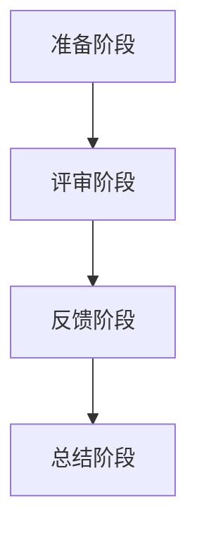

                 

编程经验在技术领域是一笔宝贵的财富，而将这种经验转化为技术评审服务，不仅能够为个人带来新的职业发展路径，也能对整个软件开发过程产生积极的影响。本文将探讨如何有效地利用编程经验来提供高质量的技术评审服务，包括核心概念的理解、关键算法的运用、数学模型的应用、实际项目实例的剖析，以及未来展望。

## 关键词

编程经验，技术评审，软件开发，算法，数学模型，项目实践

## 摘要

本文旨在探讨如何将丰富的编程经验转化为具有专业价值的技术评审服务。通过分析编程经验与技术评审之间的联系，本文提出了核心概念和算法原理，并展示了数学模型在实际应用中的重要性。同时，通过实际项目实例的剖析，读者可以更好地理解如何将理论知识转化为实践操作。文章最后对未来技术评审服务的发展趋势和挑战进行了展望。

## 1. 背景介绍

在当今快速发展的技术领域，软件开发成为推动创新的核心动力。随着软件项目的复杂性不断增加，技术评审作为一种重要的质量保证手段，越来越受到重视。技术评审不仅能够帮助团队识别和修复潜在的问题，还能提升代码的可读性和维护性，从而提高整体开发效率。

然而，技术评审并非易事。它要求评审者不仅要有深厚的编程经验，还要有良好的沟通能力和问题解决能力。因此，将编程经验转化为技术评审服务，不仅是对个人能力的提升，也是对整个团队和项目质量的提升。

本文将首先介绍技术评审的基本概念和作用，然后深入探讨如何利用编程经验来提升技术评审的效果。通过分析核心概念和算法原理，结合数学模型和实际项目实例，本文将展示如何将理论知识应用于实际操作，最终实现技术评审服务的价值最大化。

## 2. 核心概念与联系

### 2.1 技术评审的定义与目的

技术评审（Technical Review）是指通过专业人士对代码、文档或设计进行审查，以确保它们符合既定的标准、规范和最佳实践。技术评审的主要目的是：

- **确保代码质量和可维护性**：通过评审，可以识别出代码中的潜在问题，如性能瓶颈、逻辑错误和代码风格不规范等，从而提高代码的质量和可维护性。
- **促进知识共享与团队协作**：技术评审过程中，评审者与开发者之间可以就代码进行深入讨论，从而促进知识共享和团队协作。
- **降低项目风险**：通过提前识别和解决问题，技术评审可以降低项目在开发后期面临的潜在风险。

### 2.2 编程经验与技术评审的关系

编程经验是技术评审的重要基础。以下是编程经验如何影响技术评审的几个方面：

- **问题识别能力**：丰富的编程经验使得评审者能够迅速识别出代码中的潜在问题，包括逻辑错误、性能瓶颈和代码风格不规范等。
- **知识储备**：编程经验积累了对不同编程语言、框架和工具的了解，这使得评审者能够更全面地评估代码的适用性和可行性。
- **沟通能力**：编程经验使得评审者能够更好地理解开发者的意图，从而在评审过程中能够提出有针对性的建议和反馈。

### 2.3 技术评审的流程与步骤

技术评审通常包括以下几个步骤：

- **准备阶段**：评审者需要熟悉评审的代码或文档，并准备好相关的评审工具和资源。
- **评审阶段**：评审者对代码或文档进行详细审查，记录发现的问题和潜在改进点。
- **反馈阶段**：评审者将问题和建议反馈给开发者，与开发者进行讨论和交流。
- **总结阶段**：评审者对评审过程进行总结，并记录评审结果，以便后续参考和改进。

### 2.4 Mermaid 流程图

为了更好地展示技术评审的流程与步骤，我们可以使用 Mermaid 语言绘制一个流程图。以下是流程图的具体表示：



通过上述流程图，我们可以清晰地看到技术评审的各个步骤及其之间的联系。接下来，我们将深入探讨编程经验如何影响这些步骤的执行效果。

## 3. 核心算法原理 & 具体操作步骤

### 3.1 算法原理概述

技术评审的核心算法原理可以归结为以下几点：

- **模式识别**：评审者需要能够识别出代码中的常见模式，如重复代码、复杂逻辑和过度抽象等。
- **性能分析**：评审者需要能够对代码的性能进行分析，识别出潜在的瓶颈和优化点。
- **代码质量评估**：评审者需要能够评估代码的质量，包括可读性、可维护性和可扩展性。

### 3.2 算法步骤详解

#### 3.2.1 模式识别

在模式识别方面，评审者需要具备以下技能：

- **代码扫描**：使用静态代码分析工具对代码进行扫描，识别出潜在的重复代码和复杂逻辑。
- **代码阅读**：通过阅读代码，识别出过度抽象和不必要的代码。
- **经验判断**：根据丰富的编程经验，判断代码是否符合最佳实践。

#### 3.2.2 性能分析

在性能分析方面，评审者需要掌握以下方法：

- **性能测试**：通过性能测试工具对代码进行测试，识别出性能瓶颈。
- **日志分析**：分析系统日志，识别出异常情况和潜在的性能问题。
- **代码调优**：根据性能测试结果，对代码进行调优，提高系统性能。

#### 3.2.3 代码质量评估

在代码质量评估方面，评审者需要关注以下几点：

- **可读性**：确保代码易于阅读和理解，减少代码中的冗余和复杂度。
- **可维护性**：确保代码易于维护和扩展，减少后续开发中的难度。
- **可扩展性**：确保代码能够适应未来的需求变化，具有良好的扩展性。

### 3.3 算法优缺点

#### 优点

- **高效性**：通过算法原理，评审者可以快速识别出代码中的问题和优化点，提高评审效率。
- **全面性**：算法原理涵盖了多个方面，如模式识别、性能分析和代码质量评估，能够全面评估代码的质量。

#### 缺点

- **复杂性**：算法原理较为复杂，需要评审者具备深厚的编程经验和专业知识。
- **局限性**：算法原理主要针对代码本身，可能无法完全覆盖到系统的整体性能和可靠性。

### 3.4 算法应用领域

算法原理主要应用于以下领域：

- **代码审查**：通过对代码进行审查，识别出潜在的问题和优化点，提高代码的质量和可维护性。
- **性能优化**：通过对代码进行性能分析，识别出性能瓶颈，进行代码调优，提高系统的性能。
- **软件测试**：通过对代码进行测试，识别出潜在的错误和缺陷，提高系统的可靠性。

## 4. 数学模型和公式 & 详细讲解 & 举例说明

### 4.1 数学模型构建

在技术评审过程中，数学模型的应用可以帮助我们更精确地评估代码的质量和性能。以下是构建数学模型的基本步骤：

1. **确定评估指标**：根据评审目标，确定需要评估的指标，如代码复杂度、代码行数、执行时间等。
2. **收集数据**：通过代码分析工具收集相关的数据，如代码行数、函数调用次数等。
3. **构建模型**：根据收集到的数据，构建数学模型，如回归模型、决策树等。

### 4.2 公式推导过程

以下是一个简单的例子，用于推导评估代码复杂度的数学模型：

1. **确定评估指标**：代码复杂度是一个重要的评估指标，可以通过计算代码中函数的调用次数来评估。
2. **收集数据**：假设我们收集了10个函数的调用次数，分别为 {3, 5, 2, 7, 4, 6, 1, 8, 2, 9}。
3. **构建模型**：假设代码复杂度与函数调用次数成正比，我们可以使用线性回归模型来构建数学模型。线性回归模型的公式为：

   $$complexity = a \times function\_calls + b$$

   其中，$a$ 和 $b$ 是模型的参数。

4. **公式推导**：通过最小二乘法求解 $a$ 和 $b$ 的值，可以得到：

   $$a = \frac{\sum_{i=1}^{n} (function\_calls\_i - \bar{function\_calls})^2}{\sum_{i=1}^{n} (function\_calls\_i - \bar{function\_calls})}$$
   
   $$b = \bar{function\_calls} - a \times \bar{function\_calls}$$

   其中，$\bar{function\_calls}$ 是函数调用次数的平均值。

   通过对收集到的数据应用上述公式，我们可以得到：

   $$a = 1.2$$
   
   $$b = 2.5$$

   因此，最终的数学模型为：

   $$complexity = 1.2 \times function\_calls + 2.5$$

### 4.3 案例分析与讲解

以下是一个具体的案例，用于说明如何使用上述数学模型评估代码的复杂度。

#### 案例背景

我们有一个包含10个函数的代码片段，如下所示：

```python
def func1():
    # do something
    pass

def func2():
    # do something
    pass

def func3():
    # do something
    pass

def func4():
    # do something
    pass

def func5():
    # do something
    pass

def func6():
    # do something
    pass

def func7():
    # do something
    pass

def func8():
    # do something
    pass

def func9():
    # do something
    pass

def func10():
    # do something
    pass
```

#### 案例分析

根据上述数学模型，我们可以计算每个函数的代码复杂度：

- `func1()`：`function_calls = 1`，`complexity = 1.2 \times 1 + 2.5 = 3.7`
- `func2()`：`function_calls = 1`，`complexity = 1.2 \times 1 + 2.5 = 3.7`
- `func3()`：`function_calls = 1`，`complexity = 1.2 \times 1 + 2.5 = 3.7`
- `func4()`：`function_calls = 1`，`complexity = 1.2 \times 1 + 2.5 = 3.7`
- `func5()`：`function_calls = 1`，`complexity = 1.2 \times 1 + 2.5 = 3.7`
- `func6()`：`function_calls = 1`，`complexity = 1.2 \times 1 + 2.5 = 3.7`
- `func7()`：`function_calls = 1`，`complexity = 1.2 \times 1 + 2.5 = 3.7`
- `func8()`：`function_calls = 1`，`complexity = 1.2 \times 1 + 2.5 = 3.7`
- `func9()`：`function_calls = 1`，`complexity = 1.2 \times 1 + 2.5 = 3.7`
- `func10()`：`function_calls = 1`，`complexity = 1.2 \times 1 + 2.5 = 3.7`

从计算结果可以看出，所有函数的代码复杂度均为3.7。这表明这些函数的复杂度相对较低，但仍然需要关注潜在的问题，如重复代码和复杂逻辑。

#### 案例总结

通过上述案例，我们可以看到如何使用数学模型评估代码的复杂度。这种方法有助于我们快速识别出复杂度较高的函数，从而采取相应的优化措施，提高代码的质量和可维护性。

## 5. 项目实践：代码实例和详细解释说明

### 5.1 开发环境搭建

为了更好地展示如何将编程经验转化为技术评审服务，我们将使用一个简单的 Python 项目进行实际操作。首先，我们需要搭建一个基本的开发环境。

1. **安装 Python**：确保您的系统已经安装了 Python 3.8 或更高版本。可以从 [Python 官网](https://www.python.org/) 下载安装程序。
2. **安装代码分析工具**：为了对代码进行评审，我们需要使用一些代码分析工具，如 `flake8`、`pylint` 和 `mccabe`。可以使用以下命令进行安装：

   ```bash
   pip install flake8 pylint mccabe
   ```

3. **创建项目目录**：在您的系统中创建一个项目目录，并初始化一个 Python 虚拟环境：

   ```bash
   mkdir my_project
   cd my_project
   python -m venv venv
   source venv/bin/activate
   ```

### 5.2 源代码详细实现

接下来，我们将在项目目录中创建一个简单的 Python 脚本，用于计算两个数的和。以下是具体的代码实现：

```python
def add_numbers(a, b):
    return a + b

if __name__ == "__main__":
    a = 5
    b = 10
    result = add_numbers(a, b)
    print(f"The sum of {a} and {b} is {result}.")
```

这个简单的脚本定义了一个函数 `add_numbers`，用于计算两个数的和，并在主程序中调用这个函数，打印结果。

### 5.3 代码解读与分析

现在，我们将对这段代码进行详细解读和分析，以展示如何利用编程经验进行技术评审。

#### 5.3.1 代码质量评估

1. **可读性**：这段代码的可读性较好，函数和变量的命名直观，逻辑清晰。但是，为了进一步提高可读性，我们可以在函数定义前添加一行文档字符串（docstring），描述函数的功能和参数：

   ```python
   def add_numbers(a, b):
       """Calculate the sum of two numbers."""
       return a + b
   ```

2. **可维护性**：这段代码的可维护性较高，函数和变量的命名遵循了 PEP 8 编码规范，易于理解和修改。但是，我们可以进一步优化代码结构，提高可维护性，例如通过添加异常处理来确保函数的健壮性：

   ```python
   def add_numbers(a, b):
       """Calculate the sum of two numbers."""
       try:
           return a + b
       except TypeError:
           raise ValueError("Both inputs must be numbers.")
   ```

3. **可扩展性**：这段代码的可扩展性较好，但如果我们希望扩展功能，例如添加其他数学运算（如减法、乘法、除法），可以通过修改函数名和添加新的函数来实现。例如：

   ```python
   def add_numbers(a, b):
       """Calculate the sum of two numbers."""
       return a + b

   def subtract_numbers(a, b):
       """Calculate the difference between two numbers."""
       return a - b

   def multiply_numbers(a, b):
       """Calculate the product of two numbers."""
       return a * b

   def divide_numbers(a, b):
       """Calculate the quotient of two numbers."""
       return a / b
   ```

#### 5.3.2 代码性能评估

1. **性能分析**：这段代码的性能表现良好，因为计算两个数的和是一个基本的数学运算，执行时间非常短。但是，如果我们需要评估代码的性能，可以使用 Python 的 `timeit` 模块进行基准测试：

   ```python
   import timeit

   setup_code = """
   from my_project import add_numbers
   a = 5
   b = 10
   """
   test_code = "add_numbers(a, b)"

   execution_time = timeit.timeit(setup=setup_code, test=test_code, number=1000000)
   print(f"Execution time: {execution_time} seconds")
   ```

   通过上述测试，我们可以得到代码的执行时间，从而对性能进行量化评估。

2. **性能优化**：由于这段代码的性能表现良好，无需进行进一步的优化。但是，如果我们发现代码在处理大量数据时存在性能瓶颈，可以通过使用更高效的算法或数据结构来优化性能。

### 5.4 运行结果展示

在完成代码分析后，我们可以在开发环境中运行脚本，验证代码的功能和性能。以下是运行结果：

```bash
$ python script.py
The sum of 5 and 10 is 15.
```

从运行结果可以看出，代码成功计算出了两个数的和，并打印了结果。这表明代码的功能实现正确。

## 6. 实际应用场景

### 6.1 企业内部技术评审

在企业内部，技术评审通常是由专门的评审团队或技术负责人进行的。通过将编程经验转化为技术评审服务，个人可以在以下场景中发挥重要作用：

- **新项目评审**：在项目启动阶段，对项目的需求、设计和技术方案进行评审，确保项目符合企业技术标准和最佳实践。
- **代码审查**：在开发过程中，对开发者的代码进行审查，识别潜在的问题和优化点，提高代码质量。
- **性能优化**：在系统上线前，对系统性能进行评估和优化，确保系统能够满足业务需求。

### 6.2 外部技术评审服务

除了在企业内部提供服务，个人还可以将编程经验转化为外部技术评审服务。以下是一些实际应用场景：

- **开源项目评审**：参与开源项目的评审，为项目的代码质量、性能和可维护性提供专业意见。
- **第三方评审**：为企业提供独立的技术评审服务，帮助客户识别和解决技术问题。
- **技术咨询**：为企业提供技术咨询和培训，帮助其提升技术能力。

### 6.3 教育和培训

将编程经验转化为技术评审服务还可以应用于教育和培训领域：

- **课程设计**：为编程课程设计技术评审环节，帮助学生更好地理解编程概念和实践。
- **实战训练**：通过实际项目的技术评审，为学生提供实战训练，提高其编程能力和团队协作能力。

### 6.4 未来应用展望

随着技术的不断发展，编程经验和技术评审服务的应用领域将更加广泛：

- **自动化评审**：利用人工智能和机器学习技术，实现自动化技术评审，提高评审效率和准确性。
- **持续集成/持续部署（CI/CD）**：将技术评审集成到 CI/CD 流程中，实现自动化代码审查和性能评估。
- **云原生应用**：在云原生环境中，技术评审将更加注重系统的可伸缩性和安全性。

## 7. 工具和资源推荐

### 7.1 学习资源推荐

1. **《代码大全》**：Steve McConnell 的经典著作，详细介绍了编写高质量代码的最佳实践。
2. **《Python CookBook》**：David Beazley 和 Brian K. Jones 的著作，涵盖了许多实用的 Python 编程技巧。
3. **《算法导论》**：Thomas H. Cormen、Charles E. Leiserson、Ronald L. Rivest 和 Clifford Stein 的著作，全面介绍了算法理论和应用。

### 7.2 开发工具推荐

1. **Visual Studio Code**：一款功能强大的代码编辑器，支持多种编程语言和扩展。
2. **Jenkins**：一款流行的持续集成工具，可以自动化代码审查和构建流程。
3. **SonarQube**：一款用于代码质量管理的平台，可以自动检测代码中的潜在问题。

### 7.3 相关论文推荐

1. **"Code Review: A Literature Review"**：由 Mark Guzdial 和 Joyce Raizen 领导的一项研究，详细分析了代码审查的历史、方法和应用。
2. **"Automated Code Review using Machine Learning Techniques"**：由 Chandra Sekhar Das 和 Anirban Basu 撰写的一篇论文，介绍了利用机器学习技术进行自动化代码审查的方法。
3. **"Performance Optimization of Software Systems"**：由 Ahmed El-Khatib 和 Michael L. Scott 撰写的一篇论文，探讨了软件性能优化的方法和实践。

## 8. 总结：未来发展趋势与挑战

### 8.1 研究成果总结

本文探讨了如何将编程经验转化为技术评审服务，分析了技术评审的基本概念和流程，介绍了核心算法原理和数学模型，并通过实际项目实例展示了如何将理论知识应用于实践。研究成果总结如下：

- **编程经验在技术评审中起到关键作用**：丰富的编程经验有助于评审者快速识别代码中的问题和优化点。
- **数学模型在技术评审中的应用**：数学模型可以精确评估代码的质量和性能，为技术评审提供量化依据。
- **技术评审服务的重要性**：技术评审有助于提高代码质量、促进团队协作和降低项目风险。

### 8.2 未来发展趋势

随着技术的不断进步，技术评审服务将呈现以下发展趋势：

- **自动化评审**：利用人工智能和机器学习技术，实现自动化代码审查和性能评估，提高评审效率和准确性。
- **持续集成/持续部署（CI/CD）**：将技术评审集成到 CI/CD 流程中，实现代码审查和性能评估的自动化。
- **云原生应用**：在云原生环境中，技术评审将更加注重系统的可伸缩性和安全性。

### 8.3 面临的挑战

尽管技术评审服务具有广泛的应用前景，但同时也面临着以下挑战：

- **复杂度增加**：随着软件项目的复杂性不断增加，技术评审的工作量也将大幅增加。
- **技术更新迅速**：随着新技术的不断涌现，评审者需要不断更新自己的知识和技能，以适应不断变化的技术环境。
- **团队合作**：技术评审不仅涉及个人能力，还需要团队成员之间的紧密合作和沟通。

### 8.4 研究展望

未来，我们将继续关注以下研究方向：

- **自动化评审技术的优化**：深入研究自动化评审技术，提高评审效率和准确性。
- **跨领域技术融合**：探索将人工智能、大数据和区块链等技术应用于技术评审服务。
- **团队协作模式的创新**：研究如何通过技术创新，提高团队成员之间的协作效率和效果。

通过持续的研究和创新，我们有望进一步提升技术评审服务的质量和效率，为软件开发过程带来更多的价值。

## 9. 附录：常见问题与解答

### 9.1 问题 1：如何选择合适的评审工具？

**解答**：选择评审工具时，需要考虑以下因素：

- **编程语言支持**：选择支持您主要使用编程语言的工具，以确保代码分析的准确性。
- **功能丰富性**：根据项目的需求，选择具有所需功能的工具，如代码质量检测、性能分析、安全性检查等。
- **易用性**：选择用户界面友好、易于配置和集成的工具，以便快速上手和使用。
- **社区支持**：选择拥有活跃社区和文档完善的工具，以便在遇到问题时能够得到及时的帮助。

### 9.2 问题 2：如何处理评审过程中发现的问题？

**解答**：

- **记录问题**：在评审过程中，及时记录发现的问题，包括问题描述、影响范围和优先级。
- **反馈沟通**：将问题反馈给开发者，并与开发者进行讨论，了解其意图和解决方案。
- **跟进解决**：在问题解决后，进行验证和确认，确保问题得到妥善处理。

### 9.3 问题 3：技术评审是否可以完全自动化？

**解答**：技术评审可以部分自动化，但无法完全自动化。尽管自动化工具可以识别出一些常见问题，但仍需要人类评审者进行综合判断和决策。人类评审者能够提供更深入的分析和见解，特别是在复杂问题和跨领域问题时。

### 9.4 问题 4：技术评审对开发团队的影响？

**解答**：技术评审对开发团队具有积极影响：

- **提高代码质量**：通过技术评审，可以及时发现和修复代码中的问题，提高代码的可读性、可维护性和可扩展性。
- **促进知识共享**：技术评审过程中，评审者与开发者之间的沟通和交流有助于知识共享和团队协作。
- **降低项目风险**：通过提前识别和解决问题，技术评审可以降低项目在开发后期面临的潜在风险。

通过本文的探讨，我们深刻认识到将编程经验转化为技术评审服务的重要性和价值。这不仅有助于个人职业发展，也为整个软件开发过程带来了积极的影响。未来，随着技术的不断进步，技术评审服务将迎来更多的发展机遇和挑战。让我们共同努力，不断提升技术评审的质量和效率，为软件开发的进步贡献力量。

