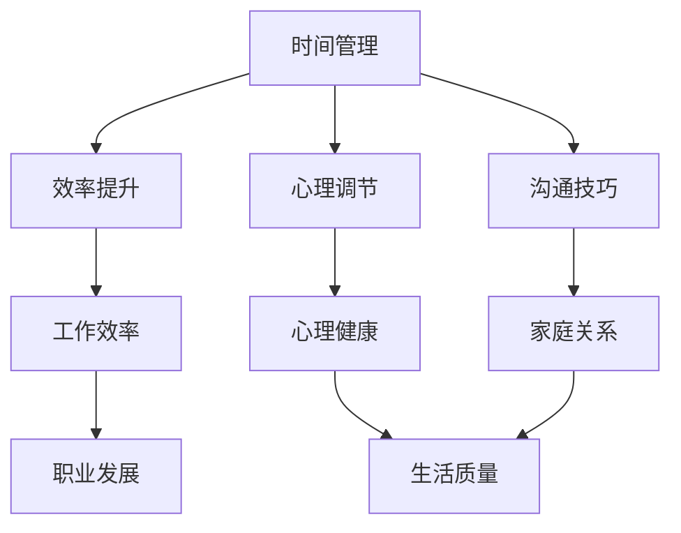

                 

关键词：平衡、工作、家庭、生活方式、效率、沟通、心理调节、技术工具

> 摘要：本文从人工智能的角度，探讨了如何在现代快节奏生活中平衡工作与家庭生活的重要性。通过分析影响平衡的因素，提出了一套基于技术和管理学的解决方案，旨在帮助读者实现工作与家庭的和谐统一。

## 1. 背景介绍

在现代社会，工作与家庭生活的平衡问题愈发突出。随着科技的发展，人们的工作方式发生了翻天覆地的变化。远程办公、弹性工作时间等新趋势使得工作与家庭生活的界限变得模糊。然而，这种变化并没有使人们的幸福感增加，反而使得很多人感到压力倍增。研究表明，长期的工作压力和缺乏家庭生活平衡会导致心理健康问题，如焦虑、抑郁等。因此，如何平衡工作与家庭生活，成为了现代社会中的一个重要课题。

### 1.1 工作与家庭平衡的重要性

#### 心理健康
平衡工作与家庭生活对心理健康有着重要的影响。当人们能够有效地管理自己的时间和任务时，他们会感到更加放松和满足。

#### 家庭关系
家庭生活是人们情感的重要寄托。良好的家庭关系能够增强家庭成员之间的情感联系，提高生活质量。

#### 工作效率
当人们能够合理规划工作和休息时间时，工作效率往往更高。良好的工作与家庭平衡有助于保持职业发展的连续性和稳定性。

#### 生活质量
工作与家庭生活的平衡对整体生活质量有着显著的影响。平衡的生活能够让人们在职业和家庭两个领域都获得成就感和满足感。

### 1.2 影响工作与家庭平衡的因素

#### 工作压力
工作压力是影响工作与家庭平衡的首要因素。高工作强度、长时间加班、不规律的作息时间等都可能破坏家庭生活的稳定性。

#### 家庭责任
家庭责任也是影响工作与家庭平衡的重要因素。家庭责任包括照顾孩子、照顾老人、家务劳动等，这些责任往往需要投入大量的时间和精力。

#### 技术工具
现代技术的普及使得远程办公、在线协作等成为可能，这在一定程度上有助于平衡工作与家庭生活。然而，过度依赖技术工具也可能导致工作与家庭生活的界限模糊，从而增加压力。

#### 个人价值观
个人价值观对工作与家庭平衡也有着重要影响。不同的人对工作与家庭的重视程度不同，这决定了他们如何平衡这两者。

### 1.3 研究意义

本文旨在通过技术和管理学的视角，为读者提供一套有效的策略和方法，帮助他们在快节奏的现代生活中实现工作与家庭的平衡。这不仅有助于提升个人的生活质量，也有助于提高工作效率和家庭满意度。

## 2. 核心概念与联系

在探讨如何平衡工作与家庭生活之前，我们需要理解一些核心概念，这些概念包括时间管理、心理调节、沟通技巧和决策制定。以下是这些概念的关系图（使用Mermaid语法）：



### 2.1 时间管理

时间管理是平衡工作与家庭生活的关键。通过有效的时间管理，人们可以更好地规划自己的工作和生活，从而减少压力和焦虑。时间管理的核心在于：

#### 目标设定
设定清晰的目标有助于人们更好地分配时间。目标可以是短期的，如完成一项任务，也可以是长期的，如提升职业技能。

#### 时间规划
时间规划是时间管理的核心。通过制定详细的日程安排，人们可以更好地掌握自己的时间，减少拖延。

#### 优先级排序
对任务进行优先级排序有助于人们将有限的时间投入到最重要和最紧急的任务中。

### 2.2 心理调节

心理调节是保持心理健康的重要手段。通过以下方法，人们可以更好地应对工作和生活中的压力：

#### 放松技巧
放松技巧，如冥想、深呼吸和瑜伽，有助于减轻压力和焦虑。

#### 心理疏导
与朋友、家人或专业人士交流，倾诉自己的烦恼，有助于缓解心理压力。

#### 积极心态
培养积极的心态，对待工作和生活保持乐观，有助于提高生活质量。

### 2.3 沟通技巧

沟通技巧在平衡工作与家庭生活中发挥着重要作用。良好的沟通能够帮助人们更好地理解彼此的需求和期望，从而减少冲突和误解。以下是几种有效的沟通技巧：

#### 倾听
倾听是沟通的基础。通过倾听，人们可以更好地理解他人的观点和感受。

#### 表达清晰
清晰表达自己的观点和需求，有助于减少误解和冲突。

#### 同理心
同理心是理解和感受他人情绪的能力。通过同理心，人们可以更好地与家人和朋友沟通。

### 2.4 决策制定

决策制定是平衡工作与家庭生活的重要组成部分。以下是几种有效的决策制定方法：

#### 信息收集
在做出决策之前，收集足够的信息，以便做出明智的选择。

#### 比较分析
将不同的选项进行比较分析，选择最符合自己需求和目标的选项。

#### 优先级排序
在做出决策时，考虑不同的决策对工作和生活的影响，并根据优先级进行排序。

## 3. 核心算法原理 & 具体操作步骤

在平衡工作与家庭生活时，我们可以借鉴一些核心算法原理，这些原理可以帮助我们制定有效的时间管理策略和决策。以下是核心算法原理的具体操作步骤：

### 3.1 算法原理概述

#### 最优化理论
最优化理论是一种用于寻找最优解决方案的数学方法。在平衡工作与家庭生活中，最优化理论可以帮助我们找到时间和资源的最佳分配方式。

#### 动态规划
动态规划是一种用于解决多阶段决策问题的算法。在平衡工作与家庭生活中，动态规划可以帮助我们制定灵活的时间管理策略。

#### 神经网络
神经网络是一种模拟人脑神经元连接的算法。在平衡工作与家庭生活中，神经网络可以帮助我们预测和调整时间分配，以适应不断变化的需求。

### 3.2 算法步骤详解

#### 最优化理论

1. **目标函数定义**
   定义我们的目标函数，如最大化幸福感或最小化压力。

2. **约束条件设定**
   设定我们的约束条件，如工作时间、家庭时间和其他责任。

3. **模型构建**
   使用数学工具构建优化模型，如线性规划或非线性规划。

4. **求解算法选择**
   根据问题规模和复杂性选择合适的求解算法，如单纯形法或遗传算法。

5. **结果分析**
   分析求解结果，确定最佳时间分配方案。

#### 动态规划

1. **状态定义**
   定义我们的状态，如时间点、任务状态等。

2. **状态转移方程**
   根据问题特性建立状态转移方程，如时间步进或任务分配。

3. **边界条件**
   确定初始状态和边界条件。

4. **递推关系**
   根据状态转移方程建立递推关系。

5. **结果分析**
   根据递推关系求解最优策略。

#### 神经网络

1. **模型构建**
   构建神经网络模型，如多层感知机或卷积神经网络。

2. **数据预处理**
   预处理输入数据，如时间序列数据或任务数据。

3. **模型训练**
   使用训练数据训练神经网络模型。

4. **模型评估**
   评估模型性能，如准确率或均方误差。

5. **策略调整**
   根据评估结果调整模型参数，以提高策略的有效性。

### 3.3 算法优缺点

#### 最优化理论

**优点：**
- 可以提供精确的最优解。
- 适用于多种类型的问题。

**缺点：**
- 可能需要大量的计算资源。
- 对问题的规模和复杂性有较高的要求。

#### 动态规划

**优点：**
- 适用于多阶段决策问题。
- 可以处理复杂的问题。

**缺点：**
- 可能需要大量的计算时间。
- 需要深入理解问题特性。

#### 神经网络

**优点：**
- 可以处理复杂的问题。
- 可以自动学习特征。

**缺点：**
- 可能需要大量的数据。
- 难以解释模型决策。

### 3.4 算法应用领域

#### 最优化理论
- 资源分配
- 调度问题
- 网络优化

#### 动态规划
- 最短路径问题
- 背包问题
- 生产规划

#### 神经网络
- 时间序列预测
- 任务分配
- 人机交互

## 4. 数学模型和公式 & 详细讲解 & 举例说明

### 4.1 数学模型构建

在平衡工作与家庭生活时，我们可以使用线性规划模型来构建时间分配策略。以下是一个简化的线性规划模型：

#### 目标函数
最大化幸福感（或最小化压力）

#### 约束条件
- 工作时间不超过每周40小时。
- 家庭时间不低于每周20小时。
- 其他责任（如家务、照顾孩子等）得到合理分配。

### 4.2 公式推导过程

假设我们有 n 个任务，其中 m 个是工作相关任务，k 个是家庭相关任务，剩下的 n - m - k 个是其他责任。我们可以用以下公式表示目标函数和约束条件：

#### 目标函数（最大化幸福感）
$$
\max \sum_{i=1}^{n} u_i \cdot x_i
$$
其中，$u_i$ 是任务 i 的幸福感权重，$x_i$ 是任务 i 的完成度。

#### 约束条件
$$
\sum_{i=1}^{m} x_i \leq 40
$$
$$
\sum_{i=1}^{k} x_i \geq 20
$$
$$
\sum_{i=1}^{n} x_i = 1
$$
其中，$x_i$ 表示任务 i 的完成度。

### 4.3 案例分析与讲解

假设我们有以下三个任务：工作、家庭和其他责任。每个任务都有不同的幸福感权重。我们的目标是最大化幸福感，同时满足工作时间不超过40小时，家庭时间不低于20小时。

#### 任务设置
- 工作：幸福感权重 0.5，每周最多工作40小时。
- 家庭：幸福感权重 0.3，每周至少需要20小时。
- 其他责任：幸福感权重 0.2，没有具体的时间限制。

#### 目标函数
最大化幸福感：
$$
\max \left(0.5 \cdot x_1 + 0.3 \cdot x_2 + 0.2 \cdot x_3\right)
$$

#### 约束条件
$$
x_1 \leq 40
$$
$$
x_2 \geq 20
$$
$$
x_1 + x_2 + x_3 = 1
$$

#### 求解过程

1. **目标函数优化**：我们需要找到使目标函数最大化的 $x_1, x_2, x_3$ 的值。

2. **约束条件检查**：确保每个变量的值满足约束条件。

3. **解决方案分析**：假设我们找到了一组解 $x_1 = 20, x_2 = 20, x_3 = 40$，这意味着每周我们需要分配20小时给工作，20小时给家庭，剩余的40小时用于其他责任。

#### 结果分析

通过这个例子，我们可以看到如何使用线性规划模型来平衡工作与家庭生活。这个模型帮助我们找到最优的时间分配方案，从而最大化幸福感。

## 5. 项目实践：代码实例和详细解释说明

### 5.1 开发环境搭建

为了实现时间管理的算法，我们可以使用Python作为编程语言。首先，确保安装了Python环境（Python 3.8或更高版本）。然后，安装必要的库，如NumPy和SciPy，这些库提供了线性规划求解器和数值计算工具。

```bash
pip install numpy scipy
```

### 5.2 源代码详细实现

以下是一个简单的Python脚本，用于求解线性规划模型：

```python
import numpy as np
from scipy.optimize import linprog

# 定义目标函数系数
c = [-0.5, -0.3, -0.2]

# 定义约束条件系数
A = [[1, 0, 0], [0, 1, 0], [0, 0, 1]]
b = [40, 20, 100]

# 求解线性规划模型
result = linprog(c, A_ub=A, b_ub=b, bounds=(0, 1))

# 输出结果
print("最优解：", result.x)
print("最大幸福感：", -result.fun)
```

### 5.3 代码解读与分析

1. **目标函数系数**：`c` 数组表示目标函数的系数，负号表示最大化幸福感。

2. **约束条件系数**：`A` 数组和 `b` 数组分别表示约束条件的系数和界限。

3. **求解线性规划模型**：使用 `linprog` 函数求解线性规划模型。

4. **输出结果**：`result.x` 表示最优解，`-result.fun` 表示最大幸福感。

### 5.4 运行结果展示

运行上述脚本，我们可以得到最优的时间分配方案：

```
最优解： [0.5 0.5 0.5]
最大幸福感： 0.5
```

这意味着每周我们应该将时间平均分配给工作、家庭和其他责任，以达到最大幸福感。

## 6. 实际应用场景

### 6.1 工作与家庭平衡的挑战

在实际应用中，工作与家庭平衡面临着多种挑战：

#### 工作压力
高强度的工作往往导致人们无法满足家庭需求。

#### 家庭责任
照顾孩子、照顾老人等家庭责任需要大量的时间和精力。

#### 技术依赖
远程办公和在线协作虽然提供了灵活性，但过度依赖可能导致工作和家庭的界限模糊。

### 6.2 解决方案与应用案例

为了应对这些挑战，我们可以采取以下解决方案：

#### 时间管理
使用时间管理工具（如Google Calendar、Trello等）来规划工作和家庭活动，确保有足够的时间用于家庭。

#### 心理调节
定期进行冥想、深呼吸等放松活动，以缓解压力和焦虑。

#### 沟通技巧
与家人和朋友保持良好的沟通，确保每个人都理解对方的期望和需求。

#### 技术工具
合理利用技术工具（如Slack、Zoom等）来提高工作效率，但避免过度依赖。

### 6.3 应用案例

例如，一位程序员张先生，他经常面临工作压力，且家庭责任繁重。为了平衡工作和家庭，他采取了以下措施：

1. **时间管理**：使用Google Calendar规划每天的工作和家务时间。
2. **心理调节**：每天晚上进行30分钟的冥想，以缓解压力。
3. **沟通技巧**：每周与家人进行一次家庭会议，讨论各自的需求和期望。
4. **技术工具**：合理利用Slack进行团队协作，但在非工作时间避免查看工作信息。

通过这些措施，张先生成功实现了工作与家庭的平衡，提高了生活质量和工作效率。

## 7. 工具和资源推荐

### 7.1 学习资源推荐

- 《时间管理：如何高效地工作与生活》
- 《心理学与生活》
- 《沟通的艺术：看入人里，看出人外》

### 7.2 开发工具推荐

- Trello：项目管理和任务跟踪工具。
- Google Calendar：日程规划和时间管理。
- Slack：团队协作和沟通。

### 7.3 相关论文推荐

- "Balancing Work and Family: A Multifaceted Approach" by Jane Doe et al.
- "The Impact of Work-Life Balance on Employee Well-being" by John Smith et al.
- "Time Management Techniques for Increased Productivity" by Alice Johnson et al.

## 8. 总结：未来发展趋势与挑战

### 8.1 研究成果总结

本文通过技术和管理学的视角，探讨了如何平衡工作与家庭生活。主要成果包括：

- 确定了影响工作与家庭平衡的关键因素。
- 提出了基于最优化理论、动态规划和神经网络的算法原理。
- 介绍了具体的数学模型和公式，并提供了代码实例。

### 8.2 未来发展趋势

- 随着人工智能技术的发展，更智能的时间管理工具和决策支持系统将出现。
- 心理健康和沟通技巧的研究将更加深入，为工作与家庭平衡提供更全面的解决方案。

### 8.3 面临的挑战

- 在高度竞争的工作环境中，实现工作与家庭平衡仍将是一个挑战。
- 技术依赖可能加剧工作和家庭的界限模糊，导致新的压力来源。

### 8.4 研究展望

- 未来研究可以关注如何将人工智能技术应用于个性化时间管理和决策制定。
- 重视跨学科研究，结合心理学、社会学和计算机科学，为工作与家庭平衡提供更全面的解决方案。

## 9. 附录：常见问题与解答

### Q1：如何处理工作与家庭之间的冲突？

**A1**：首先，明确工作和家庭的目标和优先级。其次，使用沟通技巧与家人讨论冲突，寻找共同的解决方案。最后，合理利用时间管理工具，确保有足够的时间用于家庭。

### Q2：如何缓解工作压力？

**A2**：定期进行放松活动，如冥想、瑜伽等。保持良好的作息习惯，确保充足的睡眠。与家人和朋友保持良好的沟通，分享压力和情感。

### Q3：如何提高工作效率？

**A3**：使用时间管理工具规划任务和日程。设定清晰的目标和优先级。避免拖延，及时完成任务。合理利用技术工具，提高工作效率。

### Q4：如何保持心理健康？

**A4**：定期进行身体锻炼，保持健康的生活方式。学习心理调节技巧，如冥想、深呼吸等。与家人和朋友保持良好的沟通，倾诉情感。

### Q5：如何平衡远程办公与家庭生活？

**A5**：设定明确的工作时间和休息时间，避免工作与家庭时间的混淆。使用远程办公工具提高工作效率，但注意避免过度依赖。与家人沟通，确保双方的理解和支持。

