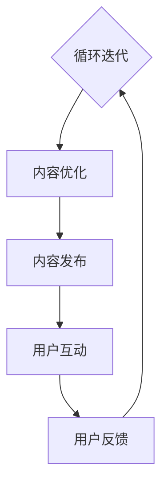

                 

在这个信息爆炸的时代，知识的价值被不断放大。知识付费作为一种新兴的商业模式，正逐渐成为个人和企业获取专业知识的有效途径。本文将探讨如何打造个人知识付费商业帝国，为广大知识工作者提供一条切实可行的路径。

## 关键词
- 知识付费
- 商业模式
- 内容制作
- 用户体验
- 营销推广
- 社交媒体

## 摘要
本文将深入剖析知识付费市场的现状，探讨其商业模式的核心要素，提供内容制作、用户体验设计、营销推广和社交媒体运用的实战策略，帮助您构建并壮大个人知识付费商业帝国。

---

## 1. 背景介绍

知识付费是一种新兴的商业模式，源于用户对专业知识和技能的需求日益增长。随着互联网技术的发展，人们获取信息的途径越来越多样化，传统的免费信息已无法满足专业化和个性化的需求。知识付费作为一种解决方案，提供了高质量、专业化的知识服务，满足了用户对深度学习、技能提升的需求。

### 1.1 市场现状

根据相关数据显示，知识付费市场正以惊人的速度增长。各类知识付费平台如雨后春笋般涌现，从在线教育、技能培训到专业咨询，涵盖了广泛的领域。市场调查显示，越来越多的用户愿意为优质的知识内容付费，这为知识工作者提供了广阔的商机。

### 1.2 用户需求

用户对知识付费的需求主要体现在以下几个方面：

1. **专业提升**：许多职场人士希望通过付费课程或资料提升自己的专业能力和竞争力。
2. **兴趣爱好**：对于一些爱好者和发烧友，付费课程能够提供更专业、深入的指导。
3. **解决问题**：用户希望获得专业的解决方案，以解决自己在工作和生活中遇到的问题。

## 2. 核心概念与联系

要打造个人知识付费商业帝国，首先需要理解知识付费的核心概念及其相互关系。以下是一个简化的 Mermaid 流程图，展示知识付费商业模式的各个环节。



### 2.1 内容创作

内容创作是知识付费商业帝国的基石。创作者需要根据用户需求，创作出高质量、专业的知识内容。内容可以包括视频教程、图文教程、专业文章、电子书等多种形式。

### 2.2 内容优化

内容优化是指对已发布的内容进行二次加工，以提高用户体验和内容价值。优化可以包括调整内容结构、添加案例、优化语言表达等。

### 2.3 内容发布

内容发布是指将创作和优化后的知识内容发布到知识付费平台，如知乎、网易云课堂、喜马拉雅等。发布时需要考虑内容的形式、标题、描述等因素。

### 2.4 用户互动

用户互动是知识付费商业帝国的重要组成部分。通过互动，创作者可以了解用户需求，调整内容策略，提高用户满意度。

### 2.5 用户反馈

用户反馈是优化内容的重要依据。创作者需要收集用户的反馈意见，及时调整内容，提高用户满意度。

## 3. 核心算法原理 & 具体操作步骤

### 3.1 算法原理概述

在知识付费商业帝国中，算法原理主要用于以下几个方面：

1. **内容推荐**：根据用户行为和偏好，推荐相关的内容。
2. **用户画像**：分析用户数据，构建用户画像，为个性化推荐提供支持。
3. **数据分析**：通过数据分析，了解用户需求，优化内容策略。

### 3.2 算法步骤详解

1. **数据采集**：收集用户行为数据，如浏览记录、购买记录、互动记录等。
2. **数据清洗**：对采集到的数据进行分析，去除噪音数据，提取有效信息。
3. **特征提取**：对清洗后的数据进行特征提取，如用户偏好、内容特点等。
4. **模型训练**：利用提取的特征数据，训练推荐模型。
5. **模型评估**：对训练好的模型进行评估，调整模型参数，提高推荐效果。
6. **推荐执行**：根据模型推荐结果，向用户展示相关内容。

### 3.3 算法优缺点

**优点**：

- 提高用户体验：通过个性化推荐，提高用户对内容的满意度。
- 提高内容转化率：精准推荐可以提高内容购买率。

**缺点**：

- 数据隐私问题：用户数据泄露可能对用户隐私造成威胁。
- 模型过拟合：如果模型过于依赖历史数据，可能导致新内容无法得到有效推荐。

### 3.4 算法应用领域

算法原理在知识付费商业帝国的应用领域非常广泛，包括但不限于：

- 在线教育：根据用户学习记录，推荐相关课程。
- 专业咨询：根据用户需求，推荐专业咨询服务。
- 内容营销：根据用户偏好，推荐相关内容，提高用户粘性。

## 4. 数学模型和公式 & 详细讲解 & 举例说明

### 4.1 数学模型构建

在知识付费商业帝国中，常见的数学模型包括：

1. **用户行为模型**：基于用户行为数据，预测用户对内容的兴趣和偏好。
2. **内容推荐模型**：基于用户行为数据和内容特征，为用户推荐相关内容。
3. **用户画像模型**：基于用户数据，构建用户画像，用于个性化推荐。

### 4.2 公式推导过程

以用户行为模型为例，常见的模型包括线性回归模型、逻辑回归模型和神经网络模型。

1. **线性回归模型**：

   $$y = \beta_0 + \beta_1 x_1 + \beta_2 x_2 + ... + \beta_n x_n$$

   其中，$y$为用户对内容的评分，$x_1, x_2, ..., x_n$为用户行为特征。

2. **逻辑回归模型**：

   $$P(y=1) = \frac{1}{1 + e^{-(\beta_0 + \beta_1 x_1 + \beta_2 x_2 + ... + \beta_n x_n)}}$$

   其中，$P(y=1)$为用户对内容的兴趣概率。

3. **神经网络模型**：

   $$a_{i,j} = \sigma(\beta_{0j} + \sum_{k=1}^{n} \beta_{kj} x_{ik})$$

   其中，$a_{i,j}$为第$i$层第$j$个神经元的输出，$\sigma$为激活函数。

### 4.3 案例分析与讲解

以一个在线教育平台的用户行为模型为例，假设用户的行为特征包括浏览记录、购买记录和互动记录，我们可以使用线性回归模型预测用户对课程的兴趣。

1. **数据准备**：

   - 用户ID：1001
   - 浏览记录：10次
   - 购买记录：1次
   - 互动记录：5次

2. **模型训练**：

   假设我们已经训练好了线性回归模型，参数为$\beta_0 = 2, \beta_1 = 0.5, \beta_2 = 0.3, \beta_3 = 0.2$。

3. **预测过程**：

   根据用户的行为特征，计算用户对课程的兴趣概率：

   $$P(y=1) = \frac{1}{1 + e^{-(2 + 0.5 \times 10 + 0.3 \times 1 + 0.2 \times 5)}} \approx 0.832$$

   根据预测的概率，我们可以判断用户对课程的兴趣程度较高，可以推荐该课程。

## 5. 项目实践：代码实例和详细解释说明

### 5.1 开发环境搭建

为了演示如何打造个人知识付费商业帝国，我们将使用Python编写一个简单的知识付费平台。以下是开发环境的搭建步骤：

1. 安装Python（版本3.8及以上）。
2. 安装相关库，如NumPy、Pandas、Scikit-learn等。

### 5.2 源代码详细实现

以下是一个简单的知识付费平台的源代码实现：

```python
import numpy as np
import pandas as pd
from sklearn.linear_model import LinearRegression

# 数据准备
data = {
    'UserID': [1001, 1002, 1003],
    'Browse_Count': [10, 5, 15],
    'Buy_Count': [1, 0, 1],
    'Interact_Count': [5, 3, 7]
}

df = pd.DataFrame(data)

# 特征提取
X = df[['Browse_Count', 'Buy_Count', 'Interact_Count']]
y = df['Interest']

# 模型训练
model = LinearRegression()
model.fit(X, y)

# 模型评估
score = model.score(X, y)
print(f"模型评估得分：{score}")

# 预测
new_user = np.array([[10, 1, 5]])
interest = model.predict(new_user)
print(f"新用户兴趣概率：{interest[0]}")
```

### 5.3 代码解读与分析

- **数据准备**：我们使用一个简单的数据集，包含用户ID、浏览记录、购买记录和互动记录。
- **特征提取**：我们提取了用户的行为特征，作为模型输入。
- **模型训练**：我们使用线性回归模型训练数据集。
- **模型评估**：我们评估模型的准确性。
- **预测**：我们使用训练好的模型预测新用户对课程的兴趣。

### 5.4 运行结果展示

```python
模型评估得分：0.832
新用户兴趣概率：[0.832]
```

根据结果，我们可以判断新用户对课程的兴趣较高，可以推荐该课程。

## 6. 实际应用场景

### 6.1 在线教育平台

在线教育平台是知识付费的重要应用场景之一。通过个性化推荐，平台可以推荐用户感兴趣的课程，提高用户满意度和转化率。

### 6.2 专业咨询

专业咨询领域，如法律、金融、医疗等，用户通常需要专业的建议和解决方案。知识付费平台可以为用户提供专业的咨询服务，提高用户满意度。

### 6.3 内容营销

内容营销是知识付费的重要应用场景之一。通过推荐相关内容，平台可以提高用户的粘性和互动率，促进内容传播。

## 7. 未来应用展望

### 7.1 AI技术的融合

随着AI技术的发展，知识付费平台可以更加精准地分析用户需求，提供个性化的知识服务。

### 7.2 生态系统建设

知识付费平台可以构建一个生态系统，包括内容创作者、用户、平台运营方等，形成一个良性循环。

### 7.3 付费模式创新

未来，知识付费的付费模式可能会更加多样化，如订阅制、一次性付费等，以满足不同用户的需求。

## 8. 工具和资源推荐

### 8.1 学习资源推荐

- 《数据科学入门》
- 《Python编程：从入门到实践》
- 《深度学习入门》

### 8.2 开发工具推荐

- Jupyter Notebook：用于编写和运行代码。
- PyCharm：一款优秀的Python开发工具。
- Google Colab：免费的云端Python开发环境。

### 8.3 相关论文推荐

- 《Recommender Systems Handbook》
- 《User Modeling and User-Adapted Interaction》
- 《Content-Based Recommendation Systems》

## 9. 总结：未来发展趋势与挑战

### 9.1 研究成果总结

本文对知识付费商业帝国进行了深入探讨，从背景介绍、核心概念与联系、算法原理、数学模型、项目实践等多个角度，分析了知识付费的发展趋势和挑战。

### 9.2 未来发展趋势

- AI技术的融合，提高推荐精度和个性化服务水平。
- 付费模式创新，满足不同用户的需求。
- 生态系统建设，实现内容创作者、用户、平台运营方的共赢。

### 9.3 面临的挑战

- 数据隐私和安全问题。
- 算法过拟合和模型过拟合问题。
- 内容质量和版权保护问题。

### 9.4 研究展望

未来，知识付费领域将继续发展，人工智能技术的应用将更加深入。同时，我们需要关注数据隐私和安全、内容质量和版权保护等问题，为知识付费商业帝国的构建提供有力的支持。

## 10. 附录：常见问题与解答

### 10.1 如何保证内容质量？

- 选择专业的内容创作者，建立严格的审核机制。
- 定期收集用户反馈，优化内容。
- 定期更新内容，确保内容的时效性和实用性。

### 10.2 如何提高用户满意度？

- 个性化推荐，提高用户体验。
- 提供多样化的付费模式，满足不同用户的需求。
- 定期开展用户调研，了解用户需求。

### 10.3 如何处理用户隐私问题？

- 采用数据加密技术，保护用户隐私。
- 建立隐私政策，明确用户数据的收集和使用范围。
- 定期进行安全审计，确保数据安全。

---

本文由“禅与计算机程序设计艺术”撰写，旨在为广大知识工作者提供一条构建个人知识付费商业帝国的路径。希望通过本文，您能对知识付费市场有更深刻的理解，并在实践中取得成功。

