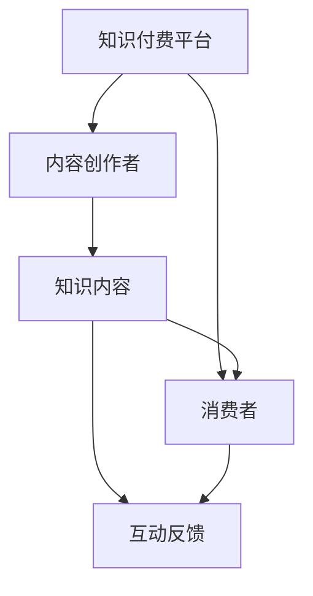

                 

关键词：知识付费，个人品牌，平台建设，用户互动，内容营销，技术架构，商业模式，盈利模式

> 摘要：在数字化时代，打造个人知识付费平台已成为许多专业人士和知识创作者的赚钱之道。本文将深入探讨如何构建一个成功的个人知识付费平台，从核心概念、技术架构、算法原理、项目实践、应用场景以及未来发展等多个维度进行分析，帮助读者全面了解并掌握这一领域的关键技术和策略。

## 1. 背景介绍

在互联网经济快速发展的今天，知识付费作为一种新型的商业模式，已经逐渐成为人们获取知识和服务的首选途径。无论是行业专家、学者，还是拥有特殊技能的个人，都可以通过知识付费平台分享自己的专业知识和经验，实现个人品牌价值的最大化。

个人知识付费平台不仅为知识创作者提供了广阔的展示舞台，也为消费者提供了便捷的学习渠道。平台通常提供的内容形式多样，包括在线课程、图文教程、音频讲座、视频直播等。这些内容不仅可以帮助用户解决实际问题，还可以提升用户的专业技能和职业素养。

### 个人知识付费平台的兴起

随着互联网技术的不断进步，尤其是移动互联网和大数据技术的发展，个人知识付费平台应运而生。这种平台的出现不仅打破了传统知识传播的时空限制，还极大地降低了知识获取的门槛。

- **在线教育平台的兴起**：以 Udemy、Coursera、网易云课堂等为代表的在线教育平台，使得用户可以随时随地学习各种课程，满足了个性化学习需求。
- **内容付费观念的普及**：在内容创作者和消费者之间，付费观念逐渐被接受和认可。知识付费成为了一种新的消费习惯。

### 个人知识付费平台的优势

个人知识付费平台具有以下优势：

- **低门槛**：创作者无需大量资金投入，只需利用自身知识和技能即可开始创建内容。
- **高回报**：优秀的知识内容能够带来稳定的收入，甚至形成规模化的商业模式。
- **品牌建设**：通过知识付费平台，个人可以迅速建立自己的专业品牌形象，提高知名度和影响力。

## 2. 核心概念与联系

### 核心概念

- **知识付费平台**：一个提供知识内容销售、交易、互动的在线平台。
- **内容创作者**：提供知识内容的专业人士或爱好者。
- **消费者**：购买知识内容的用户。

### 核心概念联系

个人知识付费平台通过连接内容创作者和消费者，实现知识的传递和价值的交换。以下是个人知识付费平台的核心概念和其相互关系的 Mermaid 流程图：



### 平台架构

个人知识付费平台的架构可以分为以下几个层次：

- **用户层**：提供用户注册、登录、内容浏览、购买等功能。
- **内容层**：包含课程、教程、音频、视频等多种形式的知识内容。
- **服务层**：提供支付、订单管理、用户互动、数据分析等服务。
- **数据层**：存储用户数据、内容数据、交易数据等。

## 3. 核心算法原理 & 具体操作步骤

### 3.1 算法原理概述

个人知识付费平台的核心算法主要包括推荐算法和支付算法。推荐算法用于根据用户行为和历史数据，为用户推荐感兴趣的知识内容；支付算法则确保交易的顺利进行和支付安全。

### 3.2 算法步骤详解

#### 推荐算法

1. **用户画像构建**：通过用户注册、浏览、购买等行为数据，构建用户画像。
2. **内容标签匹配**：为每条知识内容打上标签，如课程类别、难度等级、授课老师等。
3. **推荐模型训练**：利用机器学习算法，如协同过滤、基于内容的推荐等，训练推荐模型。
4. **推荐结果生成**：根据用户画像和内容标签，生成推荐结果。

#### 支付算法

1. **支付渠道接入**：接入支付宝、微信支付、银行卡支付等主流支付渠道。
2. **支付流程**：用户选择商品 -> 跳转到支付页面 -> 输入支付信息 -> 确认支付。
3. **支付验证**：验证支付信息是否正确，并确保交易安全。
4. **支付通知**：支付成功后，向用户发送支付通知。

### 3.3 算法优缺点

#### 推荐算法

- **优点**：提高用户粘性，增加用户购买意愿，提升平台收益。
- **缺点**：推荐效果受算法质量影响，可能存在数据偏差。

#### 支付算法

- **优点**：提供多种支付方式，提升用户体验，降低交易风险。
- **缺点**：支付环节复杂，可能增加系统负担。

### 3.4 算法应用领域

- **在线教育**：为用户提供个性化课程推荐，提升学习效果。
- **电商购物**：为消费者推荐感兴趣的商品，提高购买转化率。
- **金融支付**：确保交易安全，提高支付效率。

## 4. 数学模型和公式 & 详细讲解 & 举例说明

### 4.1 数学模型构建

个人知识付费平台的核心数学模型主要包括用户行为模型和推荐模型。

#### 用户行为模型

$$
U = f(B, I, C)
$$

其中，$U$ 表示用户行为，$B$ 表示用户背景信息，$I$ 表示用户交互行为，$C$ 表示用户消费行为。

#### 推荐模型

$$
R = f(C, T, S)
$$

其中，$R$ 表示推荐结果，$C$ 表示用户消费记录，$T$ 表示内容标签，$S$ 表示系统设置参数。

### 4.2 公式推导过程

#### 用户行为模型推导

用户行为模型通过分析用户背景信息（如年龄、职业、地域等）、交互行为（如浏览、收藏、评论等）以及消费行为（如购买、评分等），构建用户行为模型。

#### 推荐模型推导

推荐模型基于协同过滤算法和基于内容的推荐算法。协同过滤算法通过分析用户之间的相似度，推荐用户可能感兴趣的内容；基于内容的推荐算法通过分析内容之间的相似度，推荐用户可能感兴趣的内容。

### 4.3 案例分析与讲解

#### 案例一：用户行为模型

假设用户A的背景信息为：年龄30岁，职业软件工程师，地域北京。用户A的交互行为包括：浏览了Python编程课程、收藏了机器学习课程、评论了深度学习课程。用户A的消费行为为：购买了深度学习课程。

根据用户行为模型，可以得出：

$$
U_A = f(B_A, I_A, C_A)
$$

其中，$B_A = (30, 软件工程师, 北京)$，$I_A = (浏览Python, 收藏机器学习, 评论深度学习)$，$C_A = (购买深度学习)$。

#### 案例二：推荐模型

假设内容C1为Python编程课程，内容C2为机器学习课程，内容C3为深度学习课程。系统设置参数为：推荐相似度为0.8。

根据推荐模型，可以得出：

$$
R = f(C_1, C_2, C_3, S)
$$

其中，$S = 0.8$。

根据内容标签，可以得出：

$$
C_1: (编程, Python)\\
C_2: (机器学习)\\
C_3: (深度学习)
$$

根据相似度计算，可以得出：

$$
R = (C_1, C_2, C_3)
$$

因此，系统会推荐Python编程课程、机器学习课程和深度学习课程给用户A。

## 5. 项目实践：代码实例和详细解释说明

### 5.1 开发环境搭建

在构建个人知识付费平台时，选择合适的开发环境和工具是至关重要的。以下是推荐的开发环境和工具：

- **编程语言**：Python、Java 或 Node.js
- **Web框架**：Django、Spring Boot、Express
- **数据库**：MySQL、PostgreSQL、MongoDB
- **前端框架**：React、Vue、Angular
- **后端服务**：Nginx、Docker、Kubernetes

### 5.2 源代码详细实现

以下是一个简单的示例，展示如何使用Python和Django框架实现一个基本的个人知识付费平台。

#### 模型定义

```python
# models.py

from django.db import models

class User(models.Model):
    username = models.CharField(max_length=50)
    email = models.EmailField(unique=True)
    password = models.CharField(max_length=100)

class Course(models.Model):
    title = models.CharField(max_length=100)
    description = models.TextField()
    price = models.DecimalField(max_digits=6, decimal_places=2)
    author = models.ForeignKey(User, on_delete=models.CASCADE)

class Order(models.Model):
    user = models.ForeignKey(User, on_delete=models.CASCADE)
    course = models.ForeignKey(Course, on_delete=models.CASCADE)
    date = models.DateTimeField(auto_now_add=True)
    status = models.CharField(max_length=20)
```

#### 视图实现

```python
# views.py

from django.shortcuts import render
from .models import User, Course, Order

def home(request):
    courses = Course.objects.all()
    return render(request, 'home.html', {'courses': courses})

def course_detail(request, course_id):
    course = Course.objects.get(id=course_id)
    return render(request, 'course_detail.html', {'course': course})

def purchase(request, course_id):
    user = User.objects.get(id=request.user.id)
    course = Course.objects.get(id=course_id)
    order = Order(user=user, course=course, status='paid')
    order.save()
    return render(request, 'purchase.html', {'order': order})
```

#### 模板渲染

```html
<!-- home.html -->


  <div class="course">
    <h2>{{ course.title }}</h2>
    <p>{{ course.description }}</p>
    <p>Price: {{ course.price }}</p>
    <a href="">Details</a>
  </div>

```

### 5.3 代码解读与分析

以上代码展示了如何使用Django框架搭建一个基本的个人知识付费平台。主要模块包括用户管理、课程管理和订单管理。

- **用户管理**：定义了用户模型，用于管理用户信息。
- **课程管理**：定义了课程模型，用于管理课程信息。
- **订单管理**：定义了订单模型，用于管理订单信息。

视图函数则负责处理用户的请求，渲染相应的模板，并执行相应的操作。

### 5.4 运行结果展示

运行上述代码后，可以通过Web浏览器访问平台。主页显示了所有课程，用户可以点击课程详情查看课程信息，并可以购买课程。

## 6. 实际应用场景

个人知识付费平台可以在多个领域得到广泛应用，以下是几个典型的应用场景：

### 在线教育

在线教育是个人知识付费平台最典型的应用场景。通过平台，用户可以学习各种课程，如编程、设计、营销等。平台可以为用户提供个性化的学习路径，提高学习效果。

### 专业培训

专业培训是另一个重要的应用领域。个人知识付费平台可以为专业人士提供专业培训课程，如会计、法律、医疗等。这些课程可以帮助从业者提升专业能力，增加职业竞争力。

### 职业规划

个人知识付费平台还可以为用户提供职业规划服务。通过分析用户的行为数据和职业背景，平台可以为用户提供个性化的职业建议和规划方案。

### 技能提升

技能提升是个人知识付费平台的另一个重要应用领域。用户可以通过平台学习各种实用技能，如烹饪、摄影、手工艺等。这些技能不仅可以提升用户的日常生活品质，还可以为用户提供创业机会。

### 文化娱乐

文化娱乐领域也是个人知识付费平台的应用场景之一。用户可以通过平台学习音乐、绘画、舞蹈等艺术技能，丰富自己的精神生活。

## 7. 工具和资源推荐

### 7.1 学习资源推荐

- **《深度学习》**：由Ian Goodfellow、Yoshua Bengio和Aaron Courville所著，是深度学习的经典教材。
- **《机器学习实战》**：由Peter Harrington所著，通过实际案例教授机器学习算法的应用。
- **《算法导论》**：由Thomas H. Cormen、Charles E. Leiserson、Ronald L. Rivest和Clifford Stein所著，是算法领域的权威教材。

### 7.2 开发工具推荐

- **Django**：一个高生产力的Python Web框架，适合快速搭建个人知识付费平台。
- **React**：一个用于构建用户界面的JavaScript库，适合开发前端应用。
- **MySQL**：一个开源的关系型数据库，适合存储用户和课程数据。

### 7.3 相关论文推荐

- **《Recommender Systems Handbook》**：综述了推荐系统领域的最新研究进展。
- **《Deep Learning for Text Data》**：讨论了深度学习在文本数据上的应用。
- **《Data Mining: Concepts and Techniques》**：介绍了数据挖掘的基本概念和技术。

## 8. 总结：未来发展趋势与挑战

### 8.1 研究成果总结

个人知识付费平台作为一种新兴的商业模式，已经在多个领域取得了显著的成果。通过在线教育、专业培训、职业规划、技能提升和文化娱乐等领域，个人知识付费平台为用户提供了丰富的知识和学习资源。同时，平台也帮助知识创作者实现个人品牌价值的提升和收入的增加。

### 8.2 未来发展趋势

未来，个人知识付费平台将继续保持快速发展态势，主要体现在以下几个方面：

- **技术进步**：随着人工智能、大数据、区块链等技术的不断发展，个人知识付费平台将提供更加智能化、个性化的服务。
- **内容多样化**：平台将提供更多样化的知识内容，满足用户多样化的学习需求。
- **跨平台发展**：平台将逐渐向移动端、社交平台等延伸，实现全渠道覆盖。

### 8.3 面临的挑战

个人知识付费平台在发展过程中也面临着一些挑战：

- **内容质量**：保证知识内容的质量是平台发展的关键。平台需要建立严格的内容审核机制，确保知识内容的准确性、实用性和专业性。
- **用户体验**：提升用户体验是平台成功的关键。平台需要不断优化用户界面和交互设计，提供便捷、高效的学习体验。
- **市场竞争**：随着越来越多的个人和机构进入知识付费领域，市场竞争将日益激烈。平台需要通过创新和差异化竞争策略，提升自身竞争力。

### 8.4 研究展望

未来，个人知识付费平台的发展将继续以用户需求为导向，不断探索新的商业模式和技术应用。通过人工智能、大数据等技术的深度融合，平台将实现更加智能化、个性化的知识服务。同时，平台也将拓展到更多领域，为用户提供更丰富的知识和学习资源。

## 9. 附录：常见问题与解答

### Q：个人知识付费平台如何保证内容质量？

A：平台可以通过以下方式保证内容质量：

- **内容审核**：建立严格的内容审核机制，确保知识内容的准确性、实用性和专业性。
- **用户评价**：鼓励用户对知识内容进行评价和反馈，根据用户评价调整内容质量。
- **讲师资质认证**：对讲师进行资质认证，确保讲师的专业能力和经验。

### Q：个人知识付费平台如何提升用户体验？

A：平台可以通过以下方式提升用户体验：

- **界面优化**：优化用户界面设计，提供简洁、直观的操作体验。
- **个性化推荐**：利用推荐算法，为用户推荐感兴趣的知识内容。
- **学习进度管理**：提供学习进度管理功能，帮助用户更好地管理学习过程。
- **社区互动**：建立社区互动功能，促进用户之间的交流和合作。

### Q：个人知识付费平台如何进行营销推广？

A：平台可以通过以下方式进行营销推广：

- **内容营销**：通过发布高质量的知识内容，吸引潜在用户关注。
- **社交媒体推广**：利用社交媒体平台，发布营销信息和活动，扩大品牌影响力。
- **合作伙伴关系**：与其他平台和机构建立合作伙伴关系，实现资源共享和互利共赢。
- **线上活动**：举办线上活动，如讲座、直播等，提高用户参与度和活跃度。

## 作者署名

作者：禅与计算机程序设计艺术 / Zen and the Art of Computer Programming

----------------------------------------------------------------

以上是关于《如何打造个人知识付费平台》的完整文章。文章涵盖了从背景介绍、核心概念、算法原理、项目实践、实际应用场景、工具和资源推荐到未来发展趋势和挑战的全面内容。希望这篇文章能够为想要构建个人知识付费平台的读者提供有价值的参考和指导。

