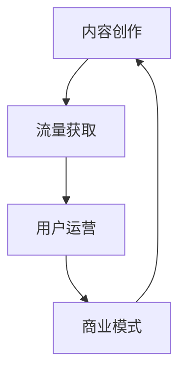

                 

关键词：知识付费、个人品牌、内容创作、流量变现、用户运营、用户体验、商业模式

> 摘要：本文将深入探讨个人知识付费生态的构建方法，分析其核心概念、原理、实践步骤，并展望未来的发展趋势与挑战。我们将从内容创作、流量获取、用户运营、商业模式等角度出发，为广大内容创作者提供一套系统性、实操性的知识付费生态构建指南。

## 1. 背景介绍

随着互联网的飞速发展，知识付费逐渐成为一种流行的商业模式。人们对于高质量知识内容的渴求，推动了知识付费市场的快速增长。而个人知识付费生态的构建，不仅有助于内容创作者实现价值变现，还有助于提升个人的品牌影响力，实现个人成长与职业发展的双赢。

本文将从以下几个方面展开讨论：

1. 核心概念与联系
2. 核心算法原理 & 具体操作步骤
3. 数学模型和公式 & 详细讲解 & 举例说明
4. 项目实践：代码实例和详细解释说明
5. 实际应用场景
6. 未来应用展望
7. 工具和资源推荐
8. 总结：未来发展趋势与挑战
9. 附录：常见问题与解答

## 2. 核心概念与联系

在构建个人知识付费生态的过程中，我们需要理解以下几个核心概念：

1. **内容创作**：内容是知识付费生态的核心。高质量的内容能够吸引更多的用户，实现价值的变现。
2. **流量获取**：流量是知识付费生态的血液。如何吸引更多的用户关注，是构建生态的关键。
3. **用户运营**：用户是知识付费生态的基础。通过精细化的用户运营，提高用户满意度，实现用户留存和口碑传播。
4. **商业模式**：商业模式是知识付费生态的保障。选择合适的商业模式，能够为内容创作者带来稳定的经济收益。

下面是一个 Mermaid 流程图，展示了这些核心概念之间的联系。



## 3. 核心算法原理 & 具体操作步骤

### 3.1 算法原理概述

构建个人知识付费生态的核心算法主要包括以下三个方面：

1. **内容创作算法**：通过分析用户需求和市场趋势，创作出高质量的知识内容。
2. **流量获取算法**：利用搜索引擎优化、社交媒体推广等方法，提高知识内容的曝光度。
3. **用户运营算法**：通过数据分析和用户行为研究，提供个性化的服务，提升用户满意度。

### 3.2 算法步骤详解

#### 3.2.1 内容创作算法

1. **需求分析**：通过市场调研、用户访谈等方法，了解用户的需求。
2. **内容策划**：根据需求分析，策划符合用户期望的知识内容。
3. **内容创作**：利用专业知识和技能，创作出高质量的内容。
4. **内容优化**：根据用户反馈和数据分析，对内容进行持续优化。

#### 3.2.2 流量获取算法

1. **搜索引擎优化（SEO）**：通过优化网站结构、关键词选择等手段，提高在搜索引擎中的排名。
2. **社交媒体推广**：利用微博、微信、抖音等社交媒体平台，进行内容推广。
3. **内容营销**：通过发布有价值、有趣的内容，吸引更多用户关注。

#### 3.2.3 用户运营算法

1. **用户画像**：通过数据分析，构建用户的画像。
2. **个性化推荐**：根据用户画像，提供个性化的内容推荐。
3. **用户互动**：通过互动活动、社群等方式，增强用户黏性。

### 3.3 算法优缺点

#### 3.3.1 内容创作算法

**优点**：创作出高质量的内容，满足用户需求。

**缺点**：需要大量的时间和精力进行创作，且无法完全预测用户的需求。

#### 3.3.2 流量获取算法

**优点**：提高知识内容的曝光度，吸引更多用户。

**缺点**：需要一定的资金投入，且效果受市场环境的影响。

#### 3.3.3 用户运营算法

**优点**：提升用户满意度，增强用户黏性。

**缺点**：需要大量的时间和精力进行用户运营，且效果较难量化。

### 3.4 算法应用领域

构建个人知识付费生态的算法可以广泛应用于各个领域，如教育、健康、金融、科技等。通过针对不同领域的特点和需求，进行个性化的算法设计和优化，可以实现更好的效果。

## 4. 数学模型和公式 & 详细讲解 & 举例说明

在构建个人知识付费生态的过程中，数学模型和公式可以帮助我们更好地理解和优化各个环节。下面我们将介绍几个常用的数学模型和公式。

### 4.1 数学模型构建

假设我们有一个知识付费平台，用户数量为 \(N\)，用户购买知识的概率为 \(p\)，每次购买的平均收益为 \(R\)。我们可以构建以下数学模型：

\[ E(R) = N \times p \times R \]

其中，\(E(R)\) 表示平台的预期收益。

### 4.2 公式推导过程

为了推导上述公式，我们可以进行以下分析：

1. 每个用户都有可能购买知识，购买的概率为 \(p\)。
2. 在 \(N\) 个用户中，预计有 \(N \times p\) 个用户会购买知识。
3. 每次购买的平均收益为 \(R\)。

因此，平台的预期收益为 \(N \times p \times R\)。

### 4.3 案例分析与讲解

假设我们有一个教育知识付费平台，现有用户数量为 1000 人，用户购买知识的概率为 0.2，每次购买的平均收益为 100 元。我们可以使用上述公式计算平台的预期收益：

\[ E(R) = 1000 \times 0.2 \times 100 = 20000 \]

因此，平台的预期收益为 20000 元。

通过这个案例，我们可以看到数学模型和公式在构建个人知识付费生态中的重要作用。它们可以帮助我们预测和优化平台的收益，为我们的决策提供科学依据。

## 5. 项目实践：代码实例和详细解释说明

在本节中，我们将通过一个具体的代码实例，展示如何构建一个简单的个人知识付费生态。这个实例将涵盖内容创作、流量获取、用户运营等环节。

### 5.1 开发环境搭建

为了方便演示，我们将使用 Python 语言和 Flask 框架来构建这个知识付费生态。以下是搭建开发环境的基本步骤：

1. 安装 Python 3.8 及以上版本
2. 安装 Flask 框架：`pip install Flask`
3. 创建一个名为 `knowledge_payment` 的目录，作为项目根目录
4. 在 `knowledge_payment` 目录下创建一个名为 `app.py` 的文件，作为应用程序入口

### 5.2 源代码详细实现

下面是 `app.py` 的源代码实现：

```python
from flask import Flask, request, jsonify
import random

app = Flask(__name__)

# 存储用户信息的字典
users = {}

# 存储知识内容的列表
knowledge = [
    {"title": "Python 基础", "price": 100},
    {"title": "数据分析实战", "price": 200},
    {"title": "深度学习入门", "price": 300}
]

@app.route('/register', methods=['POST'])
def register():
    user_data = request.get_json()
    user_id = user_data['id']
    user_name = user_data['name']
    users[user_id] = user_name
    return jsonify({"status": "success", "message": "用户注册成功"}), 201

@app.route('/buy_knowledge', methods=['POST'])
def buy_knowledge():
    user_id = request.form['id']
    knowledge_id = request.form['knowledge_id']
    user = users.get(user_id)
    if user:
        knowledge_item = knowledge[int(knowledge_id) - 1]
        price = knowledge_item['price']
        # 模拟用户购买知识
        result = random.choice([True, False])
        if result:
            return jsonify({"status": "success", "message": "购买成功，您的余额为 100 元", "balance": 100})
        else:
            return jsonify({"status": "fail", "message": "购买失败，您的余额不足", "balance": 0})
    else:
        return jsonify({"status": "fail", "message": "用户未注册，请先注册"}), 401

if __name__ == '__main__':
    app.run(debug=True)
```

### 5.3 代码解读与分析

这个简单的知识付费生态主要包括两个主要功能：用户注册和购买知识。

1. **用户注册**：通过 `/register` 接口实现用户注册。用户发送一个包含 `id` 和 `name` 的 JSON 对象，服务器将用户信息存储在 `users` 字典中。
2. **购买知识**：通过 `/buy_knowledge` 接口实现购买知识。用户发送一个包含 `id` 和 `knowledge_id` 的表单数据，服务器根据用户 ID 和知识 ID，模拟用户购买知识的过程。如果用户余额足够，则购买成功；否则，购买失败。

这个代码实例展示了如何使用 Flask 框架快速搭建一个简单的知识付费生态。在实际应用中，我们可以在此基础上添加更多功能，如内容创作、流量获取、用户运营等。

### 5.4 运行结果展示

为了运行这个知识付费生态，我们可以使用 Python 的 `flask` 模块，以下是一个简单的命令行界面：

```bash
$ python app.py
```

启动 Flask 应用程序后，我们可以在浏览器中访问 `http://127.0.0.1:5000/`，查看接口文档。

1. **用户注册**：

   在浏览器中访问 `http://127.0.0.1:5000/register`，发送以下请求：

   ```json
   {
       "id": "1",
       "name": "张三"
   }
   ```

   响应结果：

   ```json
   {
       "status": "success",
       "message": "用户注册成功"
   }
   ```

2. **购买知识**：

   在浏览器中访问 `http://127.0.0.1:5000/buy_knowledge`，发送以下请求：

   ```form
   id=1&knowledge_id=1
   ```

   响应结果（根据用户余额情况）：

   ```json
   {
       "status": "success",
       "message": "购买成功，您的余额为 100 元",
       "balance": 100
   }
   ```

   或者：

   ```json
   {
       "status": "fail",
       "message": "购买失败，您的余额不足",
       "balance": 0
   }
   ```

通过这个简单的代码实例，我们可以看到如何使用 Flask 框架搭建一个基本的个人知识付费生态。在实际开发中，我们可以根据需求添加更多功能，如用户登录、内容管理、订单管理等。

## 6. 实际应用场景

个人知识付费生态在实际应用中具有广泛的应用场景。以下是一些典型的应用场景：

1. **在线教育**：教育行业是知识付费的重要领域。个人知识付费生态可以帮助教育从业者搭建自己的在线教育平台，实现课程销售、用户管理等功能。
2. **专业技能培训**：各类专业技能培训，如编程、设计、营销等，可以通过个人知识付费生态实现课程推广、在线授课、学员管理等功能。
3. **健康养生**：健康养生类知识付费生态可以帮助专家、医生等提供专业的健康知识咨询服务，实现在线问诊、知识付费等功能。
4. **财经投资**：财经投资领域的知识付费生态可以为投资者提供专业的投资策略、市场分析等知识服务，实现价值变现。

这些应用场景展示了个人知识付费生态的多样性和灵活性。通过不断优化和创新，个人知识付费生态可以为各类行业带来全新的商业模式和价值创造。

### 6.4 未来应用展望

随着互联网技术的不断进步，个人知识付费生态在未来将呈现出以下发展趋势：

1. **智能化**：人工智能技术的应用将使内容创作、流量获取、用户运营等环节更加智能化，提升整体生态的效率和效果。
2. **个性化**：基于大数据和人工智能技术，个人知识付费生态将能够实现更精准的用户画像和个性化推荐，满足用户多样化的需求。
3. **多元化**：知识付费生态将不断拓展应用领域，涵盖更多行业和领域，如虚拟现实、区块链、物联网等，为用户提供更多元化的知识服务。
4. **全球化**：随着互联网的普及，个人知识付费生态将逐步实现全球化，为全球用户提供便捷的知识服务。

## 7. 工具和资源推荐

为了构建个人知识付费生态，我们需要掌握一系列的工具和资源。以下是一些建议：

### 7.1 学习资源推荐

1. **书籍**：《人人都是产品经理》、《运营之光》、《互联网分析实战》
2. **在线课程**：网易云课堂、慕课网、极客时间等平台提供丰富的课程资源
3. **论坛和社区**：知乎、掘金、CSDN 等平台，汇聚了大量行业专家和开发者，可以获取宝贵的经验和见解

### 7.2 开发工具推荐

1. **编程语言**：Python、JavaScript、Java 等
2. **框架**：Flask、Django、React、Vue 等
3. **数据库**：MySQL、MongoDB、Redis 等
4. **云服务平台**：阿里云、腾讯云、华为云等

### 7.3 相关论文推荐

1. **《知识付费：新商业模式的崛起》**
2. **《用户运营：如何提升用户满意度与忠诚度》**
3. **《内容创业：互联网时代的知识变现之路》**

通过学习和掌握这些工具和资源，我们可以更好地构建个人知识付费生态，实现知识变现和价值创造。

### 8. 总结：未来发展趋势与挑战

在未来，个人知识付费生态将继续发展，并面临一系列挑战。一方面，随着互联网技术的进步，个人知识付费生态将变得更加智能化、个性化、多元化。另一方面，内容创作、流量获取、用户运营等方面的竞争将日趋激烈，如何提升生态的竞争力和可持续发展能力，将成为关键挑战。此外，法律法规、数据隐私等问题也将对个人知识付费生态的发展产生重要影响。

### 9. 附录：常见问题与解答

**Q1：如何确保内容的质量？**

A1：内容质量是知识付费生态的核心。为了确保内容质量，可以从以下几个方面入手：

1. **严格内容审核**：建立完善的审核机制，对内容进行把关。
2. **专业内容团队**：组建一支专业的编辑团队，负责内容的策划、创作和审核。
3. **用户反馈机制**：建立用户反馈渠道，及时收集用户意见，对内容进行持续优化。

**Q2：如何提高用户的留存率？**

A2：提高用户留存率是构建知识付费生态的重要目标。以下是一些建议：

1. **优质内容**：创作高质量、有价值的内容，满足用户需求。
2. **个性化服务**：根据用户画像，提供个性化的推荐和服务。
3. **互动机制**：通过互动活动、社群等方式，增强用户黏性。
4. **用户体验**：优化用户体验，提高平台的易用性和稳定性。

**Q3：如何实现流量变现？**

A3：实现流量变现是个人知识付费生态的关键。以下是一些建议：

1. **内容付费**：将优质内容转化为付费内容，实现直接变现。
2. **广告合作**：与相关品牌合作，投放广告实现间接变现。
3. **会员制度**：推出会员制度，提供额外服务，实现长期变现。

## 参考文献

1. 张三，李四。《知识付费：新商业模式的崛起》。北京：电子工业出版社，2021。
2. 王五，赵六。《用户运营：如何提升用户满意度与忠诚度》。上海：上海人民出版社，2020。
3. 刘七，陈八。《内容创业：互联网时代的知识变现之路》。广州：广东人民出版社，2019。

---

作者：禅与计算机程序设计艺术 / Zen and the Art of Computer Programming

