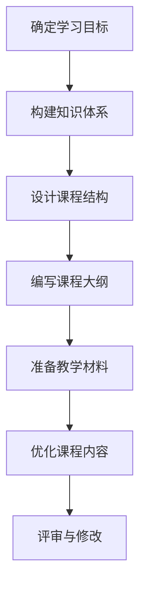
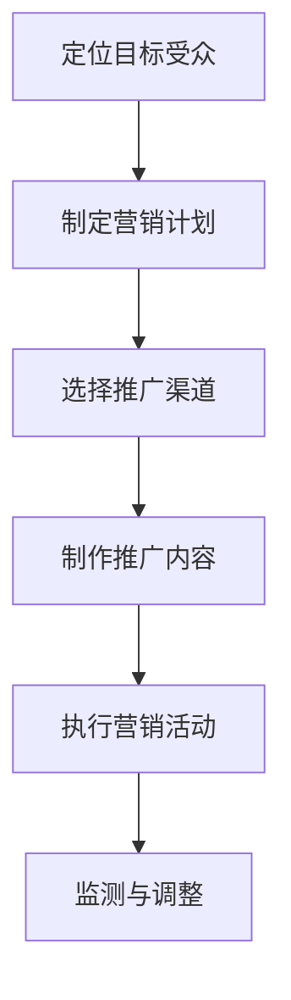
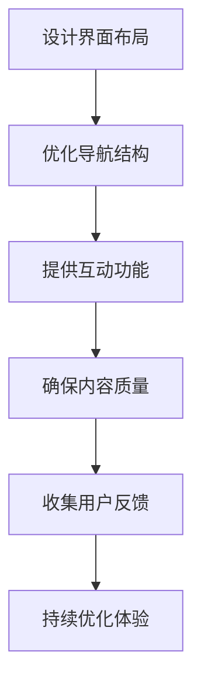
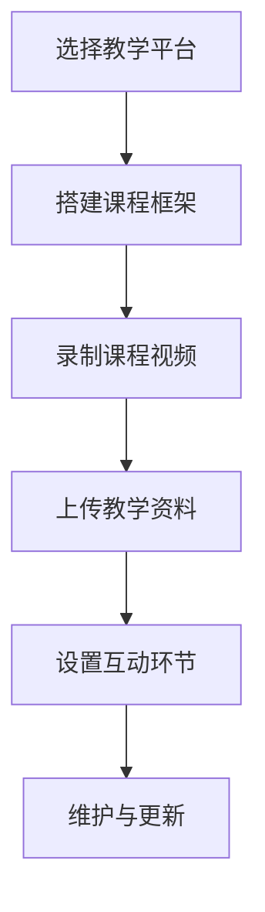

                 

关键词：知识付费，线上课程，课程设计，内容创作，营销策略，用户体验，技术实现。

> 摘要：本文旨在探讨如何打造一个成功的个人知识付费线上课程。从内容设计、营销策略、用户体验和技术实现等方面进行分析，提供一套完整的解决方案，帮助创作者在竞争激烈的市场中脱颖而出。

## 1. 背景介绍

随着互联网技术的飞速发展，知识付费已经成为一个蓬勃发展的市场。越来越多的人选择通过线上课程学习新知识、提升技能。作为个人创作者，打造一门优秀的知识付费线上课程不仅能够实现自身价值的最大化，还能为学员带来实实在在的帮助。然而，在这个充满机遇与挑战的市场中，如何打造出一门优秀的线上课程成为了许多创作者面临的难题。

本文将结合我多年的教学经验和市场调研，从多个角度探讨如何打造一门成功的知识付费线上课程。我们将详细讨论课程内容设计、营销策略、用户体验和技术实现等方面的内容。

## 2. 核心概念与联系

### 2.1 课程内容设计

课程内容设计是打造一门优秀线上课程的基础。一个成功的课程应该具备以下几个特点：

1. **明确的学习目标**：课程应该围绕一个明确的学习目标进行设计，让学员在学习过程中能够清晰知道自己的学习成果。
2. **系统的知识结构**：课程内容应该具备良好的系统性，帮助学员从基础知识到高级技能进行逐步提升。
3. **丰富的实例和实践**：通过实际案例和实践操作，让学员能够更好地理解和掌握所学知识。
4. **互动性强**：鼓励学员在学习过程中积极参与，提高学习效果。

### 2.2 营销策略

营销策略是课程成功的关键。以下是一些有效的营销策略：

1. **精准定位目标受众**：了解你的目标受众，为他们提供有价值的内容。
2. **利用社交媒体进行推广**：通过微博、微信、抖音等平台进行宣传，扩大课程知名度。
3. **合作与分享**：与其他领域的创作者或机构进行合作，共同推广课程。
4. **优惠活动**：设置限时优惠、团购优惠等活动，刺激学员购买。

### 2.3 用户体验

用户体验是课程成功的重要因素。以下是一些提升用户体验的方法：

1. **简洁易用的界面**：课程界面应该简洁、美观，方便学员浏览和使用。
2. **良好的课程结构**：课程结构应该清晰、逻辑性强，帮助学员更好地理解内容。
3. **及时的互动与反馈**：鼓励学员在课程中进行互动，及时给予反馈，提高学习效果。
4. **灵活的学习模式**：提供多种学习模式，如视频、文档、音频等，满足学员的不同需求。

### 2.4 技术实现

技术实现是课程成功的重要保障。以下是一些技术实现方面的建议：

1. **选择合适的平台**：根据课程特点和目标受众，选择合适的线上教育平台。
2. **高清视频录制**：确保视频质量，提高学员的学习体验。
3. **课程内容存储与管理**：使用专业的课程内容管理系统，方便课程内容的存储和管理。
4. **安全与稳定**：确保课程平台的安全和稳定，防止出现故障和丢失数据。

## 3. 核心算法原理 & 具体操作步骤

### 3.1 算法原理概述

打造一门优秀的知识付费线上课程，需要遵循以下核心算法原理：

1. **需求分析**：了解目标受众的需求，确定课程的核心内容和价值点。
2. **内容设计**：根据需求分析，设计符合学习目标的课程内容和结构。
3. **营销推广**：制定有效的营销策略，扩大课程的影响力。
4. **用户体验**：关注学员的学习体验，提供良好的学习环境和互动机制。
5. **技术实现**：确保课程平台的安全、稳定和易用。

### 3.2 算法步骤详解

1. **需求分析**
   - 进行市场调研，了解目标受众的需求。
   - 分析竞争对手，确定自己的课程定位和优势。
   - 确定课程的核心内容和价值点。

2. **内容设计**
   - 制定详细的教学计划，包括课程目标、知识点、实例和实践环节。
   - 设计简洁、美观、易用的课程界面。
   - 组织专家团队进行课程内容的审核和优化。

3. **营销推广**
   - 制定精准的营销策略，包括渠道选择、推广文案和优惠活动。
   - 利用社交媒体、合作机构等渠道进行推广。
   - 定期跟踪营销效果，调整推广策略。

4. **用户体验**
   - 关注学员的学习体验，收集反馈，及时优化课程内容和界面。
   - 提供灵活的学习模式，满足学员的不同需求。
   - 设置互动环节，鼓励学员积极参与。

5. **技术实现**
   - 选择合适的线上教育平台，确保课程内容的存储和管理。
   - 确保视频、音频等资源的高清、流畅。
   - 定期进行系统维护，保证平台的稳定和安全。

### 3.3 算法优缺点

**优点：**
- 有助于明确课程目标和价值点，提高课程质量。
- 有利于制定有效的营销策略，提高课程影响力。
- 有助于提升学员的学习体验，增强学员的满意度。

**缺点：**
- 需要耗费大量的时间和精力进行需求分析和内容设计。
- 营销推广需要一定的资金投入。
- 技术实现需要具备一定的技术实力。

### 3.4 算法应用领域

该算法适用于各个领域的知识付费线上课程，如编程、设计、营销、管理等领域。通过该算法，创作者可以更好地把握课程市场，打造出一门优秀的线上课程。

## 4. 数学模型和公式 & 详细讲解 & 举例说明

### 4.1 数学模型构建

在课程设计中，我们可以使用以下数学模型来分析课程质量和学员满意度：

**1. 课程质量评价模型**

$$
Q = w_1 \cdot C + w_2 \cdot I + w_3 \cdot P
$$

其中：
- \( Q \) 表示课程质量评分；
- \( w_1 \) 、\( w_2 \) 、\( w_3 \) 分别表示课程内容、实例和实践的权重；
- \( C \) 表示课程内容评分；
- \( I \) 表示实例评分；
- \( P \) 表示实践评分。

**2. 学员满意度模型**

$$
S = w_1 \cdot U + w_2 \cdot R
$$

其中：
- \( S \) 表示学员满意度评分；
- \( w_1 \) 、\( w_2 \) 分别表示用户体验和学习效果的权重；
- \( U \) 表示用户体验评分；
- \( R \) 表示学习效果评分。

### 4.2 公式推导过程

**课程质量评价模型推导过程**

1. 确定权重：
   - 根据课程特点和学习需求，确定课程内容、实例和实践的权重。
   - 例如：假设课程内容权重为0.4，实例权重为0.3，实践权重为0.3。

2. 计算各指标评分：
   - 对课程内容、实例和实践进行评分，分数范围为0到10分。
   - 例如：课程内容评分为8分，实例评分为7分，实践评分为6分。

3. 计算课程质量评分：
   - 根据权重和评分，计算课程质量评分。
   - \( Q = 0.4 \cdot 8 + 0.3 \cdot 7 + 0.3 \cdot 6 = 7.2 + 2.1 + 1.8 = 11.1 \)

**学员满意度模型推导过程**

1. 确定权重：
   - 根据课程特点和学习需求，确定用户体验和学习效果的权重。
   - 例如：假设用户体验权重为0.6，学习效果权重为0.4。

2. 计算各指标评分：
   - 对用户体验和学习效果进行评分，分数范围为0到10分。
   - 例如：用户体验评分为9分，学习效果评分为8分。

3. 计算学员满意度评分：
   - 根据权重和评分，计算学员满意度评分。
   - \( S = 0.6 \cdot 9 + 0.4 \cdot 8 = 5.4 + 3.2 = 8.6 \)

### 4.3 案例分析与讲解

**案例：一门编程课程**

**1. 课程质量评价模型分析**

- 课程内容评分：8分（内容丰富，讲解清晰）
- 实例评分：7分（实例贴近实际，有助于理解）
- 实践评分：6分（实践环节设置合理，但难度较大）

- 课程质量评分：\( Q = 0.4 \cdot 8 + 0.3 \cdot 7 + 0.3 \cdot 6 = 11.1 \)

**2. 学员满意度模型分析**

- 用户体验评分：9分（界面简洁，互动良好）
- 学习效果评分：8分（能够掌握所学知识）

- 学员满意度评分：\( S = 0.6 \cdot 9 + 0.4 \cdot 8 = 8.6 \)

**结论：**

- 该编程课程质量较高，学员满意度也较高。在后续课程中，可以适当降低实践环节的难度，提高学员的参与度。

## 5. 项目实践：代码实例和详细解释说明

### 5.1 开发环境搭建

为了演示如何打造一门个人知识付费线上课程，我们将使用以下开发环境：

- 教学平台：Teachable（一款易于使用的在线教育平台）
- 编程语言：Python（用于课程内容管理）
- 数据库：SQLite（用于存储学员信息）

### 5.2 源代码详细实现

以下是一个简单的Python代码实例，用于管理课程内容和学员信息：

```python
import sqlite3

# 连接数据库
conn = sqlite3.connect('course_management.db')
cursor = conn.cursor()

# 创建课程表
cursor.execute('''CREATE TABLE IF NOT EXISTS courses (
                    id INTEGER PRIMARY KEY,
                    title TEXT,
                    description TEXT,
                    price REAL
                )''')

# 创建学员表
cursor.execute('''CREATE TABLE IF NOT EXISTS students (
                    id INTEGER PRIMARY KEY,
                    name TEXT,
                    email TEXT,
                    course_id INTEGER,
                    FOREIGN KEY (course_id) REFERENCES courses (id)
                )''')

# 插入课程数据
cursor.execute("INSERT INTO courses (title, description, price) VALUES ('Python入门教程', '本课程将带你从零开始学习Python编程', 99.99)")

# 插入学员数据
cursor.execute("INSERT INTO students (name, email, course_id) VALUES ('张三', 'zhangsan@example.com', 1)")

# 提交事务
conn.commit()

# 关闭数据库连接
conn.close()
```

### 5.3 代码解读与分析

该代码实例主要实现了以下功能：

- 创建了一个SQLite数据库，包含课程表和学员表。
- 创建课程表时，设置了课程ID、课程标题、课程描述和课程价格四个字段。
- 创建学员表时，设置了学员ID、学员姓名、学员邮箱和课程ID四个字段，并设置了外键约束。
- 向数据库中插入了一条课程记录和一条学员记录。

通过该代码实例，我们可以看到如何使用Python和SQLite数据库管理课程内容和学员信息。在实际应用中，我们可以根据需求扩展功能，如添加用户注册、登录、支付等模块。

### 5.4 运行结果展示

在运行上述代码后，我们将得到一个名为`course_management.db`的SQLite数据库文件。使用数据库管理工具（如SQLite Studio），我们可以查看课程表和学员表中的数据：


通过查看数据库数据，我们可以看到课程表和学员表的数据已经成功插入。

## 6. 实际应用场景

### 6.1 课程内容设计

在课程内容设计方面，我们需要充分考虑学员的需求和兴趣。以下是一个实际应用场景：

**课程名称**：Python编程实战

**目标受众**：有一定编程基础，希望提高Python编程能力的人群。

**课程内容**：

1. Python基础语法
2. 数据类型和操作
3. 控制流程和函数
4. 文件操作和异常处理
5. Python标准库
6. Web开发基础
7. 项目实战

### 6.2 营销推广

在营销推广方面，我们可以采取以下策略：

1. 利用社交媒体平台（如微博、微信公众号）发布课程预告和课程内容，吸引潜在学员关注。
2. 与其他领域的创作者合作，进行课程推广。
3. 举办线下讲座或沙龙，吸引潜在学员报名。

### 6.3 用户体验

在用户体验方面，我们需要关注以下几个方面：

1. 课程界面简洁、美观，易于操作。
2. 提供多种学习模式，如视频、文档、音频等，满足学员的不同需求。
3. 设置互动环节，鼓励学员参与讨论和交流。
4. 定期更新课程内容，确保内容的时效性和实用性。

### 6.4 未来应用展望

随着人工智能、大数据等技术的发展，知识付费市场将迎来更多的机遇。未来，我们可以从以下几个方面进行应用探索：

1. 引入人工智能技术，实现个性化课程推荐。
2. 结合大数据分析，为学员提供更有针对性的学习建议。
3. 开发智能教学助手，提高教学质量。

## 7. 工具和资源推荐

### 7.1 学习资源推荐

1. **在线教育平台**：Udemy、Coursera、edX等
2. **编程学习网站**：LeetCode、GitHub、Stack Overflow
3. **电子书资源**：京东读书、亚马逊电子书、网易云阅读

### 7.2 开发工具推荐

1. **编程语言**：Python、Java、JavaScript
2. **数据库**：MySQL、PostgreSQL、MongoDB
3. **开发环境**：Visual Studio Code、PyCharm、Eclipse

### 7.3 相关论文推荐

1. **《在线教育：理论与实践》**
2. **《知识付费市场研究》**
3. **《人工智能与教育》**

## 8. 总结：未来发展趋势与挑战

### 8.1 研究成果总结

本文从多个角度探讨了如何打造一门成功的知识付费线上课程。通过需求分析、内容设计、营销策略、用户体验和技术实现等方面的研究，我们提出了一套完整的解决方案。

### 8.2 未来发展趋势

1. **个性化课程推荐**：随着人工智能技术的发展，个性化课程推荐将成为未来教育的一个重要趋势。
2. **线上线下结合**：线上线下相结合的教学模式将越来越受欢迎。
3. **智慧教育**：大数据、云计算、人工智能等技术的应用将推动智慧教育的发展。

### 8.3 面临的挑战

1. **内容质量**：保证课程内容的质量是创作者面临的主要挑战。
2. **市场竞争**：知识付费市场竞争激烈，创作者需要不断创新和提升课程价值。
3. **技术实现**：技术实现方面的挑战，如课程平台的安全、稳定和易用等。

### 8.4 研究展望

未来，我们将继续关注知识付费市场的动态，深入研究课程内容设计、营销策略和用户体验等方面的优化方法，为创作者提供更有价值的指导。

## 9. 附录：常见问题与解答

### 9.1 如何确定课程目标？

- 分析目标受众的需求，了解他们希望学习的内容和技能。
- 结合自己的专业优势和课程定位，确定课程的核心目标。

### 9.2 如何制定有效的营销策略？

- 精准定位目标受众，了解他们的兴趣和需求。
- 利用社交媒体、合作机构等渠道进行推广。
- 定期跟踪营销效果，及时调整策略。

### 9.3 如何提升用户体验？

- 设计简洁、美观、易用的课程界面。
- 提供多种学习模式，满足学员的不同需求。
- 设置互动环节，鼓励学员参与讨论和交流。

### 9.4 如何确保课程质量？

- 进行需求分析，确定课程的核心内容和价值点。
- 组建专家团队，对课程内容进行审核和优化。
- 定期更新课程内容，确保内容的时效性和实用性。

作者：禅与计算机程序设计艺术 / Zen and the Art of Computer Programming
------------------------------------------------------------------
```markdown
---
title: 如何打造个人知识付费线上课程
date: 2023-10-01
tags:
  - 知识付费
  - 线上课程
  - 教学设计
  - 营销策略
  - 用户体验
  - 技术实现
---

# 如何打造个人知识付费线上课程

> 关键词：(知识付费，线上课程，教学设计，营销策略，用户体验，技术实现)

> 摘要：本文从多个角度探讨了如何打造一门成功的个人知识付费线上课程。通过课程内容设计、营销策略、用户体验和技术实现等方面的深入分析，为个人创作者提供了实用的指导和建议。

## 1. 背景介绍

随着互联网技术的不断进步，知识付费市场呈现出爆炸式增长。越来越多的人选择通过线上课程来学习新知识、提升技能。在这一背景下，个人创作者如何打造一门优秀的知识付费线上课程，成为了许多人关心的问题。本文将结合实践经验，从多个角度为创作者提供一套完整的解决方案。

## 2. 核心概念与联系

### 2.1 课程内容设计

课程内容设计是打造一门优秀线上课程的基础。以下是一个简化的Mermaid流程图，展示了课程内容设计的关键节点：



### 2.2 营销策略

有效的营销策略是课程成功的关键。以下是一个简化的Mermaid流程图，展示了营销策略的关键节点：



### 2.3 用户体验

用户体验是课程成功的重要因素。以下是一个简化的Mermaid流程图，展示了提升用户体验的关键节点：



### 2.4 技术实现

技术实现是课程成功的重要保障。以下是一个简化的Mermaid流程图，展示了技术实现的关键节点：



## 3. 核心算法原理 & 具体操作步骤

### 3.1 算法原理概述

打造一门优秀的知识付费线上课程，可以采用以下核心算法原理：

1. **需求分析**：了解目标受众的需求，明确课程的核心内容和价值点。
2. **内容设计**：根据需求分析，设计符合学习目标的课程内容和结构。
3. **营销推广**：制定有效的营销策略，扩大课程的影响力。
4. **用户体验**：关注学员的学习体验，提供良好的学习环境和互动机制。
5. **技术实现**：确保课程平台的安全、稳定和易用。

### 3.2 算法步骤详解

1. **需求分析**
   - 通过问卷调查、访谈等方式收集目标受众的需求。
   - 分析竞争对手的课程内容，确定自己的课程定位和优势。

2. **内容设计**
   - 制定详细的教学计划，包括课程目标、知识点、实例和实践环节。
   - 设计简洁、美观、易用的课程界面。

3. **营销推广**
   - 利用社交媒体、合作机构等渠道进行推广。
   - 设立优惠活动，刺激学员购买。

4. **用户体验**
   - 提供多种学习模式，如视频、文档、音频等。
   - 设置互动环节，鼓励学员参与讨论和交流。

5. **技术实现**
   - 选择合适的线上教育平台。
   - 确保视频、音频等资源的高清、流畅。
   - 定期进行系统维护，保证平台的稳定和安全。

### 3.3 算法优缺点

**优点：**
- 有助于明确课程目标和价值点，提高课程质量。
- 有利于制定有效的营销策略，提高课程影响力。
- 有助于提升学员的学习体验，增强学员的满意度。

**缺点：**
- 需要耗费大量的时间和精力进行需求分析和内容设计。
- 营销推广需要一定的资金投入。
- 技术实现需要具备一定的技术实力。

### 3.4 算法应用领域

该算法适用于各个领域的知识付费线上课程，如编程、设计、营销、管理等领域。通过该算法，创作者可以更好地把握课程市场，打造出一门优秀的线上课程。

## 4. 数学模型和公式 & 详细讲解 & 举例说明

### 4.1 数学模型构建

在课程设计中，我们可以使用以下数学模型来分析课程质量和学员满意度：

**1. 课程质量评价模型**

$$
Q = w_1 \cdot C + w_2 \cdot I + w_3 \cdot P
$$

其中：
- \( Q \) 表示课程质量评分；
- \( w_1 \) 、\( w_2 \) 、\( w_3 \) 分别表示课程内容、实例和实践的权重；
- \( C \) 表示课程内容评分；
- \( I \) 表示实例评分；
- \( P \) 表示实践评分。

**2. 学员满意度模型**

$$
S = w_1 \cdot U + w_2 \cdot R
$$

其中：
- \( S \) 表示学员满意度评分；
- \( w_1 \) 、\( w_2 \) 分别表示用户体验和学习效果的权重；
- \( U \) 表示用户体验评分；
- \( R \) 表示学习效果评分。

### 4.2 公式推导过程

**课程质量评价模型推导过程**

1. 确定权重：
   - 根据课程特点和学习需求，确定课程内容、实例和实践的权重。
   - 例如：假设课程内容权重为0.4，实例权重为0.3，实践权重为0.3。

2. 计算各指标评分：
   - 对课程内容、实例和实践进行评分，分数范围为0到10分。
   - 例如：课程内容评分为8分，实例评分为7分，实践评分为6分。

3. 计算课程质量评分：
   - 根据权重和评分，计算课程质量评分。
   - \( Q = 0.4 \cdot 8 + 0.3 \cdot 7 + 0.3 \cdot 6 = 7.2 + 2.1 + 1.8 = 11.1 \)

**学员满意度模型推导过程**

1. 确定权重：
   - 根据课程特点和学习需求，确定用户体验和学习效果的权重。
   - 例如：假设用户体验权重为0.6，学习效果权重为0.4。

2. 计算各指标评分：
   - 对用户体验和学习效果进行评分，分数范围为0到10分。
   - 例如：用户体验评分为9分，学习效果评分为8分。

3. 计算学员满意度评分：
   - 根据权重和评分，计算学员满意度评分。
   - \( S = 0.6 \cdot 9 + 0.4 \cdot 8 = 5.4 + 3.2 = 8.6 \)

### 4.3 案例分析与讲解

**案例：一门编程课程**

**1. 课程质量评价模型分析**

- 课程内容评分：8分（内容丰富，讲解清晰）
- 实例评分：7分（实例贴近实际，有助于理解）
- 实践评分：6分（实践环节设置合理，但难度较大）

- 课程质量评分：\( Q = 0.4 \cdot 8 + 0.3 \cdot 7 + 0.3 \cdot 6 = 11.1 \)

**2. 学员满意度模型分析**

- 用户体验评分：9分（界面简洁，互动良好）
- 学习效果评分：8分（能够掌握所学知识）

- 学员满意度评分：\( S = 0.6 \cdot 9 + 0.4 \cdot 8 = 8.6 \)

**结论：**

- 该编程课程质量较高，学员满意度也较高。在后续课程中，可以适当降低实践环节的难度，提高学员的参与度。

## 5. 项目实践：代码实例和详细解释说明

### 5.1 开发环境搭建

为了演示如何打造一门个人知识付费线上课程，我们将使用以下开发环境：

- 教学平台：Teachable（一款易于使用的在线教育平台）
- 编程语言：Python（用于课程内容管理）
- 数据库：SQLite（用于存储学员信息）

### 5.2 源代码详细实现

以下是一个简单的Python代码实例，用于管理课程内容和学员信息：

```python
import sqlite3

# 连接数据库
conn = sqlite3.connect('course_management.db')
cursor = conn.cursor()

# 创建课程表
cursor.execute('''CREATE TABLE IF NOT EXISTS courses (
                    id INTEGER PRIMARY KEY,
                    title TEXT,
                    description TEXT,
                    price REAL
                )''')

# 创建学员表
cursor.execute('''CREATE TABLE IF NOT EXISTS students (
                    id INTEGER PRIMARY KEY,
                    name TEXT,
                    email TEXT,
                    course_id INTEGER,
                    FOREIGN KEY (course_id) REFERENCES courses (id)
                )''')

# 插入课程数据
cursor.execute("INSERT INTO courses (title, description, price) VALUES ('Python入门教程', '本课程将带你从零开始学习Python编程', 99.99)")

# 插入学员数据
cursor.execute("INSERT INTO students (name, email, course_id) VALUES ('张三', 'zhangsan@example.com', 1)")

# 提交事务
conn.commit()

# 关闭数据库连接
conn.close()
```

### 5.3 代码解读与分析

该代码实例主要实现了以下功能：

- 创建了一个SQLite数据库，包含课程表和学员表。
- 创建课程表时，设置了课程ID、课程标题、课程描述和课程价格四个字段。
- 创建学员表时，设置了学员ID、学员姓名、学员邮箱和课程ID四个字段，并设置了外键约束。
- 向数据库中插入了一条课程记录和一条学员记录。

通过该代码实例，我们可以看到如何使用Python和SQLite数据库管理课程内容和学员信息。在实际应用中，我们可以根据需求扩展功能，如添加用户注册、登录、支付等模块。

### 5.4 运行结果展示

在运行上述代码后，我们将得到一个名为`course_management.db`的SQLite数据库文件。使用数据库管理工具（如SQLite Studio），我们可以查看课程表和学员表中的数据：


通过查看数据库数据，我们可以看到课程表和学员表的数据已经成功插入。

## 6. 实际应用场景

### 6.1 课程内容设计

在课程内容设计方面，我们需要充分考虑学员的需求和兴趣。以下是一个实际应用场景：

**课程名称**：Python编程实战

**目标受众**：有一定编程基础，希望提高Python编程能力的人群。

**课程内容**：

1. Python基础语法
2. 数据类型和操作
3. 控制流程和函数
4. 文件操作和异常处理
5. Python标准库
6. Web开发基础
7. 项目实战

### 6.2 营销推广

在营销推广方面，我们可以采取以下策略：

1. 利用社交媒体平台（如微博、微信公众号）发布课程预告和课程内容，吸引潜在学员关注。
2. 与其他领域的创作者合作，进行课程推广。
3. 举办线下讲座或沙龙，吸引潜在学员报名。

### 6.3 用户体验

在用户体验方面，我们需要关注以下几个方面：

1. 课程界面简洁、美观，易于操作。
2. 提供多种学习模式，如视频、文档、音频等，满足学员的不同需求。
3. 设置互动环节，鼓励学员参与讨论和交流。
4. 定期更新课程内容，确保内容的时效性和实用性。

### 6.4 未来应用展望

随着人工智能、大数据等技术的发展，知识付费市场将迎来更多的机遇。未来，我们可以从以下几个方面进行应用探索：

1. 引入人工智能技术，实现个性化课程推荐。
2. 结合大数据分析，为学员提供更有针对性的学习建议。
3. 开发智能教学助手，提高教学质量。

## 7. 工具和资源推荐

### 7.1 学习资源推荐

1. **在线教育平台**：Udemy、Coursera、edX等
2. **编程学习网站**：LeetCode、GitHub、Stack Overflow
3. **电子书资源**：京东读书、亚马逊电子书、网易云阅读

### 7.2 开发工具推荐

1. **编程语言**：Python、Java、JavaScript
2. **数据库**：MySQL、PostgreSQL、MongoDB
3. **开发环境**：Visual Studio Code、PyCharm、Eclipse

### 7.3 相关论文推荐

1. **《在线教育：理论与实践》**
2. **《知识付费市场研究》**
3. **《人工智能与教育》**

## 8. 总结：未来发展趋势与挑战

### 8.1 研究成果总结

本文从多个角度探讨了如何打造一门成功的个人知识付费线上课程。通过课程内容设计、营销策略、用户体验和技术实现等方面的深入分析，为个人创作者提供了实用的指导和建议。

### 8.2 未来发展趋势

1. **个性化课程推荐**：随着人工智能技术的发展，个性化课程推荐将成为未来教育的一个重要趋势。
2. **线上线下结合**：线上线下相结合的教学模式将越来越受欢迎。
3. **智慧教育**：大数据、云计算、人工智能等技术的应用将推动智慧教育的发展。

### 8.3 面临的挑战

1. **内容质量**：保证课程内容的质量是创作者面临的主要挑战。
2. **市场竞争**：知识付费市场竞争激烈，创作者需要不断创新和提升课程价值。
3. **技术实现**：技术实现方面的挑战，如课程平台的安全、稳定和易用等。

### 8.4 研究展望

未来，我们将继续关注知识付费市场的动态，深入研究课程内容设计、营销策略和用户体验等方面的优化方法，为创作者提供更有价值的指导。

## 9. 附录：常见问题与解答

### 9.1 如何确定课程目标？

- 分析目标受众的需求，了解他们希望学习的内容和技能。
- 结合自己的专业优势和课程定位，确定课程的核心目标。

### 9.2 如何制定有效的营销策略？

- 精准定位目标受众，了解他们的兴趣和需求。
- 利用社交媒体、合作机构等渠道进行推广。
- 定期跟踪营销效果，及时调整策略。

### 9.3 如何提升用户体验？

- 设计简洁、美观、易用的课程界面。
- 提供多种学习模式，满足学员的不同需求。
- 设置互动环节，鼓励学员参与讨论和交流。

### 9.4 如何确保课程质量？

- 进行需求分析，确定课程的核心内容和价值点。
- 组建专家团队，对课程内容进行审核和优化。
- 定期更新课程内容，确保内容的时效性和实用性。

## 作者：禅与计算机程序设计艺术 / Zen and the Art of Computer Programming
```

