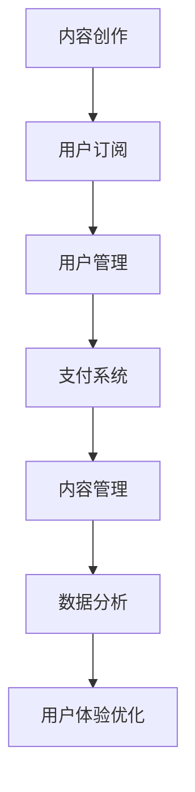

                 

关键词：知识付费、订阅模式、个人品牌、用户体验、技术架构

> 摘要：在数字化时代，知识付费订阅模式已成为知识传播和获取的重要途径。本文将探讨如何打造一个成功的个人知识付费订阅模式，包括核心概念、技术架构、算法原理、数学模型、项目实践及未来展望。

## 1. 背景介绍

近年来，随着互联网技术的迅猛发展，知识付费市场逐渐壮大。人们开始意识到，通过付费获取高质量、专业化的知识，比免费获取的信息更有价值。个人知识付费订阅模式应运而生，成为知识传播者变现的重要途径。

### 1.1 知识付费的现状

知识付费是指用户通过支付一定费用，获取特定领域内的知识服务。根据《2021年中国知识付费行业发展白皮书》，我国知识付费市场规模逐年增长，用户付费习惯逐步养成。2020年，我国知识付费市场规模达到1966亿元，同比增长30.1%。

### 1.2 订阅模式的优势

订阅模式具有以下优势：

- **用户黏性**：定期更新内容，吸引用户持续订阅。
- **盈利模式**：通过订阅费用实现持续盈利。
- **品牌塑造**：优质内容有助于塑造个人品牌。

## 2. 核心概念与联系

### 2.1 知识付费的核心概念

知识付费的核心概念包括：

- **内容创作**：知识服务提供者创作有价值的内容。
- **用户需求**：用户根据自身需求选择订阅内容。
- **用户体验**：良好的用户体验是订阅模式成功的关键。

### 2.2 技术架构

知识付费订阅模式的技术架构主要包括：

- **前端展示**：用户界面，展示知识付费内容。
- **后端服务**：处理用户订阅、支付、内容管理等。
- **数据库**：存储用户信息、内容数据等。

### 2.3 Mermaid 流程图



## 3. 核心算法原理 & 具体操作步骤

### 3.1 算法原理概述

知识付费订阅模式的核心算法包括：

- **推荐算法**：根据用户历史行为和偏好，推荐相关内容。
- **支付算法**：处理订单创建、支付、退款等流程。

### 3.2 算法步骤详解

#### 3.2.1 推荐算法

1. 收集用户行为数据，如浏览、收藏、点赞等。
2. 构建用户画像，包括兴趣标签、行为特征等。
3. 计算用户与内容之间的相似度。
4. 根据相似度排序推荐内容。

#### 3.2.2 支付算法

1. 创建订单：接收用户支付请求，生成订单。
2. 处理支付：调用第三方支付接口，处理支付。
3. 订单确认：支付成功后，确认订单。
4. 订单退款：根据用户申请，处理订单退款。

### 3.3 算法优缺点

#### 3.3.1 推荐算法

**优点**：提高用户满意度，增加用户黏性。

**缺点**：推荐效果受到数据质量和算法模型的影响。

#### 3.3.2 支付算法

**优点**：提高支付成功率，降低人工成本。

**缺点**：支付安全性需要特别注意。

### 3.4 算法应用领域

推荐算法广泛应用于电商、社交媒体、内容平台等领域。支付算法则在各类在线支付场景中发挥作用。

## 4. 数学模型和公式 & 详细讲解 & 举例说明

### 4.1 数学模型构建

知识付费订阅模式中的数学模型主要包括：

- **用户流失模型**：预测用户流失，优化订阅策略。
- **内容推荐模型**：计算用户与内容之间的相似度。

### 4.2 公式推导过程

#### 4.2.1 用户流失模型

假设用户流失率与用户满意度呈线性关系，公式如下：

$$
\text{流失率} = a \cdot (\text{满意度} - \text{期望满意度})
$$

其中，$a$为衰减系数。

#### 4.2.2 内容推荐模型

假设用户与内容之间的相似度可以通过余弦相似度计算，公式如下：

$$
\text{相似度} = \frac{\text{用户兴趣向量} \cdot \text{内容兴趣向量}}{\|\text{用户兴趣向量}\| \cdot \|\text{内容兴趣向量}\|}
$$

### 4.3 案例分析与讲解

#### 4.3.1 用户流失模型案例分析

以某知识付费平台为例，分析用户流失模型。平台收集了1000名用户的历史满意度数据，根据公式计算用户流失率。

1. 收集数据：满意度分数范围1-10分。
2. 计算期望满意度：平均满意度8分。
3. 计算衰减系数$a$：根据历史数据，设$a=0.2$。
4. 计算用户流失率：满意度低于期望满意度的用户，计算流失率。

#### 4.3.2 内容推荐模型案例分析

以某内容平台为例，分析内容推荐模型。平台有1000个视频内容，用户A的历史浏览数据如下：

1. 收集用户A的兴趣标签：技术、编程、游戏。
2. 构建用户A的兴趣向量：$[0.8, 0.6, 0.3]$。
3. 遍历所有视频内容，计算用户A与每个视频内容的相似度。
4. 根据相似度排序，推荐Top 10视频内容。

## 5. 项目实践：代码实例和详细解释说明

### 5.1 开发环境搭建

1. 选择编程语言（如Python）和开发框架（如Flask）。
2. 搭建前端页面，采用HTML、CSS和JavaScript。
3. 部署后端服务，配置数据库（如MySQL、MongoDB）。

### 5.2 源代码详细实现

#### 5.2.1 用户管理模块

1. 用户注册：接收用户信息，存储到数据库。
2. 用户登录：验证用户信息，返回Token。
3. 用户信息管理：修改用户信息，如密码、头像等。

#### 5.2.2 内容管理模块

1. 内容上传：上传内容，存储到数据库。
2. 内容展示：根据用户偏好，推荐相关内容。
3. 内容更新：定期更新内容，提高用户满意度。

#### 5.2.3 支付管理模块

1. 创建订单：接收用户支付请求，生成订单。
2. 处理支付：调用第三方支付接口，处理支付。
3. 订单查询：查询订单状态，如支付成功、退款等。

### 5.3 代码解读与分析

#### 5.3.1 用户管理模块

```python
# 用户注册
@app.route('/register', methods=['POST'])
def register():
    username = request.form['username']
    password = request.form['password']
    # 验证用户信息，存储到数据库
    # ...
    return jsonify({'status': 'success'})
```

#### 5.3.2 内容管理模块

```python
# 内容推荐
@app.route('/recommend', methods=['GET'])
def recommend():
    user_id = request.args.get('user_id')
    # 根据用户偏好，推荐内容
    # ...
    return jsonify({'status': 'success', 'data': recommended_content})
```

#### 5.3.3 支付管理模块

```python
# 创建订单
@app.route('/order', methods=['POST'])
def create_order():
    user_id = request.form['user_id']
    content_id = request.form['content_id']
    # 生成订单，调用第三方支付接口
    # ...
    return jsonify({'status': 'success', 'order_id': order_id})
```

### 5.4 运行结果展示

通过前端页面，用户可以完成以下操作：

1. 注册/登录账户。
2. 浏览/订阅内容。
3. 支付订单。

## 6. 实际应用场景

知识付费订阅模式适用于以下场景：

1. **在线教育**：提供专业课程、讲座等。
2. **技能培训**：提供职业技能培训、教程等。
3. **专业咨询**：提供行业分析、咨询建议等。

### 6.1 未来应用展望

1. **个性化推荐**：利用人工智能技术，实现更精准的内容推荐。
2. **多渠道分发**：拓展应用场景，如短视频、直播等。

## 7. 工具和资源推荐

### 7.1 学习资源推荐

- **书籍**：《硅谷超级课程表》、《人人都是产品经理》
- **在线课程**：网易云课堂、慕课网

### 7.2 开发工具推荐

- **前端框架**：React、Vue
- **后端框架**：Spring Boot、Django

### 7.3 相关论文推荐

- **《知识付费：现状、挑战与未来》**
- **《基于订阅模式的知识付费平台设计》**

## 8. 总结：未来发展趋势与挑战

### 8.1 研究成果总结

本文介绍了知识付费订阅模式的核心概念、技术架构、算法原理、数学模型、项目实践及未来展望。知识付费订阅模式在在线教育、技能培训等领域具有广泛的应用前景。

### 8.2 未来发展趋势

1. **个性化推荐**：利用人工智能技术，提高内容推荐的准确性。
2. **多渠道分发**：拓展应用场景，如短视频、直播等。

### 8.3 面临的挑战

1. **内容质量**：保证内容的专业性和实用性。
2. **用户体验**：优化用户界面和交互设计。

### 8.4 研究展望

未来，知识付费订阅模式将继续发展，结合人工智能技术，为用户提供更高质量、个性化的知识服务。

## 9. 附录：常见问题与解答

### 9.1 什么是知识付费？

知识付费是指用户通过支付一定费用，获取特定领域内的知识服务。

### 9.2 订阅模式有哪些优势？

订阅模式的优势包括用户黏性、盈利模式和品牌塑造。

### 9.3 如何构建推荐算法？

构建推荐算法需要收集用户行为数据，构建用户画像，计算用户与内容之间的相似度。

## 作者署名

作者：禅与计算机程序设计艺术 / Zen and the Art of Computer Programming
```markdown
---
# 如何打造个人知识付费订阅模式

<|user|>关键词：知识付费、订阅模式、个人品牌、用户体验、技术架构

> 摘要：在数字化时代，知识付费订阅模式已成为知识传播和获取的重要途径。本文将探讨如何打造一个成功的个人知识付费订阅模式，包括核心概念、技术架构、算法原理、数学模型、项目实践及未来展望。

## 1. 背景介绍

近年来，随着互联网技术的迅猛发展，知识付费市场逐渐壮大。人们开始意识到，通过付费获取高质量、专业化的知识，比免费获取的信息更有价值。个人知识付费订阅模式应运而生，成为知识传播者变现的重要途径。

### 1.1 知识付费的现状

知识付费是指用户通过支付一定费用，获取特定领域内的知识服务。根据《2021年中国知识付费行业发展白皮书》，我国知识付费市场规模逐年增长，用户付费习惯逐步养成。2020年，我国知识付费市场规模达到1966亿元，同比增长30.1%。

### 1.2 订阅模式的优势

订阅模式具有以下优势：

- **用户黏性**：定期更新内容，吸引用户持续订阅。
- **盈利模式**：通过订阅费用实现持续盈利。
- **品牌塑造**：优质内容有助于塑造个人品牌。

## 2. 核心概念与联系

### 2.1 知识付费的核心概念

知识付费的核心概念包括：

- **内容创作**：知识服务提供者创作有价值的内容。
- **用户需求**：用户根据自身需求选择订阅内容。
- **用户体验**：良好的用户体验是订阅模式成功的关键。

### 2.2 技术架构

知识付费订阅模式的技术架构主要包括：

- **前端展示**：用户界面，展示知识付费内容。
- **后端服务**：处理用户订阅、支付、内容管理等。
- **数据库**：存储用户信息、内容数据等。

### 2.3 Mermaid 流程图


## 3. 核心算法原理 & 具体操作步骤
### 3.1 算法原理概述

知识付费订阅模式的核心算法包括：

- **推荐算法**：根据用户历史行为和偏好，推荐相关内容。
- **支付算法**：处理订单创建、支付、退款等流程。

### 3.2 算法步骤详解 

#### 3.2.1 推荐算法

1. 收集用户行为数据，如浏览、收藏、点赞等。
2. 构建用户画像，包括兴趣标签、行为特征等。
3. 计算用户与内容之间的相似度。
4. 根据相似度排序推荐内容。

#### 3.2.2 支付算法

1. 创建订单：接收用户支付请求，生成订单。
2. 处理支付：调用第三方支付接口，处理支付。
3. 订单确认：支付成功后，确认订单。
4. 订单退款：根据用户申请，处理订单退款。

### 3.3 算法优缺点

#### 3.3.1 推荐算法

**优点**：提高用户满意度，增加用户黏性。

**缺点**：推荐效果受到数据质量和算法模型的影响。

#### 3.3.2 支付算法

**优点**：提高支付成功率，降低人工成本。

**缺点**：支付安全性需要特别注意。

### 3.4 算法应用领域

推荐算法广泛应用于电商、社交媒体、内容平台等领域。支付算法则在各类在线支付场景中发挥作用。

## 4. 数学模型和公式 & 详细讲解 & 举例说明

### 4.1 数学模型构建

知识付费订阅模式中的数学模型主要包括：

- **用户流失模型**：预测用户流失，优化订阅策略。
- **内容推荐模型**：计算用户与内容之间的相似度。

### 4.2 公式推导过程

#### 4.2.1 用户流失模型

假设用户流失率与用户满意度呈线性关系，公式如下：

$$
\text{流失率} = a \cdot (\text{满意度} - \text{期望满意度})
$$

其中，$a$为衰减系数。

#### 4.2.2 内容推荐模型

假设用户与内容之间的相似度可以通过余弦相似度计算，公式如下：

$$
\text{相似度} = \frac{\text{用户兴趣向量} \cdot \text{内容兴趣向量}}{\|\text{用户兴趣向量}\| \cdot \|\text{内容兴趣向量}\|}
$$

### 4.3 案例分析与讲解

#### 4.3.1 用户流失模型案例分析

以某知识付费平台为例，分析用户流失模型。平台收集了1000名用户的历史满意度数据，根据公式计算用户流失率。

1. 收集数据：满意度分数范围1-10分。
2. 计算期望满意度：平均满意度8分。
3. 计算衰减系数$a$：根据历史数据，设$a=0.2$。
4. 计算用户流失率：满意度低于期望满意度的用户，计算流失率。

#### 4.3.2 内容推荐模型案例分析

以某内容平台为例，分析内容推荐模型。平台有1000个视频内容，用户A的历史浏览数据如下：

1. 收集用户A的兴趣标签：技术、编程、游戏。
2. 构建用户A的兴趣向量：$[0.8, 0.6, 0.3]$。
3. 遍历所有视频内容，计算用户A与每个视频内容的相似度。
4. 根据相似度排序，推荐Top 10视频内容。

## 5. 项目实践：代码实例和详细解释说明

### 5.1 开发环境搭建

1. 选择编程语言（如Python）和开发框架（如Flask）。
2. 搭建前端页面，采用HTML、CSS和JavaScript。
3. 部署后端服务，配置数据库（如MySQL、MongoDB）。

### 5.2 源代码详细实现

#### 5.2.1 用户管理模块

1. 用户注册：接收用户信息，存储到数据库。
2. 用户登录：验证用户信息，返回Token。
3. 用户信息管理：修改用户信息，如密码、头像等。

#### 5.2.2 内容管理模块

1. 内容上传：上传内容，存储到数据库。
2. 内容展示：根据用户偏好，推荐相关内容。
3. 内容更新：定期更新内容，提高用户满意度。

#### 5.2.3 支付管理模块

1. 创建订单：接收用户支付请求，生成订单。
2. 处理支付：调用第三方支付接口，处理支付。
3. 订单查询：查询订单状态，如支付成功、退款等。

### 5.3 代码解读与分析

#### 5.3.1 用户管理模块

```python
# 用户注册
@app.route('/register', methods=['POST'])
def register():
    username = request.form['username']
    password = request.form['password']
    # 验证用户信息，存储到数据库
    # ...
    return jsonify({'status': 'success'})
```

#### 5.3.2 内容管理模块

```python
# 内容推荐
@app.route('/recommend', methods=['GET'])
def recommend():
    user_id = request.args.get('user_id')
    # 根据用户偏好，推荐内容
    # ...
    return jsonify({'status': 'success', 'data': recommended_content})
```

#### 5.3.3 支付管理模块

```python
# 创建订单
@app.route('/order', methods=['POST'])
def create_order():
    user_id = request.form['user_id']
    content_id = request.form['content_id']
    # 生成订单，调用第三方支付接口
    # ...
    return jsonify({'status': 'success', 'order_id': order_id})
```

### 5.4 运行结果展示

通过前端页面，用户可以完成以下操作：

1. 注册/登录账户。
2. 浏览/订阅内容。
3. 支付订单。

## 6. 实际应用场景

知识付费订阅模式适用于以下场景：

1. **在线教育**：提供专业课程、讲座等。
2. **技能培训**：提供职业技能培训、教程等。
3. **专业咨询**：提供行业分析、咨询建议等。

### 6.4  未来应用展望

1. **个性化推荐**：利用人工智能技术，实现更精准的内容推荐。
2. **多渠道分发**：拓展应用场景，如短视频、直播等。

## 7. 工具和资源推荐

### 7.1 学习资源推荐

- **书籍**：《硅谷超级课程表》、《人人都是产品经理》
- **在线课程**：网易云课堂、慕课网

### 7.2 开发工具推荐

- **前端框架**：React、Vue
- **后端框架**：Spring Boot、Django

### 7.3 相关论文推荐

- **《知识付费：现状、挑战与未来》**
- **《基于订阅模式的知识付费平台设计》**

## 8. 总结：未来发展趋势与挑战

### 8.1 研究成果总结

本文介绍了知识付费订阅模式的核心概念、技术架构、算法原理、数学模型、项目实践及未来展望。知识付费订阅模式在在线教育、技能培训等领域具有广泛的应用前景。

### 8.2 未来发展趋势

1. **个性化推荐**：利用人工智能技术，提高内容推荐的准确性。
2. **多渠道分发**：拓展应用场景，如短视频、直播等。

### 8.3 面临的挑战

1. **内容质量**：保证内容的专业性和实用性。
2. **用户体验**：优化用户界面和交互设计。

### 8.4 研究展望

未来，知识付费订阅模式将继续发展，结合人工智能技术，为用户提供更高质量、个性化的知识服务。

## 9. 附录：常见问题与解答

### 9.1 什么是知识付费？

知识付费是指用户通过支付一定费用，获取特定领域内的知识服务。

### 9.2 订阅模式有哪些优势？

订阅模式的优势包括用户黏性、盈利模式和品牌塑造。

### 9.3 如何构建推荐算法？

构建推荐算法需要收集用户行为数据，构建用户画像，计算用户与内容之间的相似度。

## 作者署名

作者：禅与计算机程序设计艺术 / Zen and the Art of Computer Programming
---

