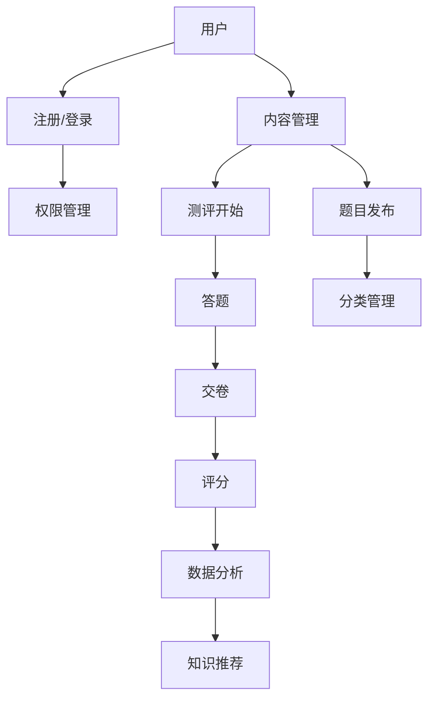

                 

关键词：知识付费、在线测评系统、架构设计、技术实现、用户体验、数据分析

> 摘要：本文将探讨如何构建一个高效、可扩展的知识付费在线测评系统，包括系统的设计思路、核心算法原理、项目实践以及未来应用展望。文章将帮助开发者理解系统构建的全过程，从而为知识付费平台提供强大的技术支持。

## 1. 背景介绍

随着互联网技术的飞速发展，知识付费市场逐渐崛起。用户对于优质知识内容的需求不断增加，而在线测评作为知识付费的重要组成部分，其重要性愈发凸显。在线测评系统不仅能够检验用户的学习效果，还可以通过数据分析了解用户的学习习惯，为后续的知识推荐提供依据。

构建一个功能完善、用户体验良好的在线测评系统，需要从多个方面进行深入思考和详细规划。本文将围绕系统设计、核心算法、项目实践等方面进行探讨，以期为开发者提供有价值的参考。

### 1.1 系统需求分析

在设计在线测评系统之前，我们需要明确系统需要满足哪些需求。一般来说，在线测评系统需要具备以下功能：

- **用户管理**：支持用户注册、登录、个人信息管理等。
- **内容管理**：支持测评题目的创建、发布、分类管理等。
- **测评过程管理**：支持测评开始、答题、交卷、评分等。
- **数据分析**：收集用户答题数据，进行分析，为知识推荐提供依据。
- **安全与稳定性**：确保系统数据的安全性和稳定性。

### 1.2 目标用户

在线测评系统的目标用户主要包括：

- **知识付费平台**：通过在线测评系统提高用户的学习效果，增加用户粘性。
- **教育培训机构**：利用在线测评系统对学员进行学习效果评估。
- **企业内部培训**：通过在线测评系统对员工进行知识考核。

## 2. 核心概念与联系

在构建在线测评系统时，我们需要了解一些核心概念，包括用户角色、测评类型、评分机制等。以下是一个简单的 Mermaid 流程图，展示了这些概念之间的联系。



### 2.1 用户角色

在线测评系统的用户角色主要包括：

- **普通用户**：注册、登录、参与测评。
- **管理员**：管理测评内容、用户权限等。

### 2.2 测评类型

在线测评系统需要支持多种测评类型，包括：

- **选择题**：用户从多个选项中选择正确答案。
- **填空题**：用户在指定位置填写正确答案。
- **判断题**：用户对问题进行判断，正确或错误。

### 2.3 评分机制

评分机制是测评系统的核心部分，常见的评分机制包括：

- **自动评分**：系统根据预设的答案自动评分。
- **人工评分**：由人工对用户的答题进行评分。
- **混合评分**：自动评分与人工评分相结合。

## 3. 核心算法原理 & 具体操作步骤

### 3.1 算法原理概述

在线测评系统的核心算法主要包括：

- **用户行为分析**：通过用户在系统中的行为数据，分析用户的学习习惯和偏好。
- **推荐算法**：根据用户行为数据和测评结果，为用户推荐合适的知识内容。

### 3.2 算法步骤详解

#### 3.2.1 用户行为分析

用户行为分析主要包括以下步骤：

1. **数据收集**：收集用户在系统中的行为数据，如访问记录、答题记录等。
2. **数据预处理**：对收集到的数据进行分析，去除无效数据，并进行数据清洗。
3. **特征提取**：根据业务需求，提取用户行为数据中的关键特征，如题目难度、用户答题时间等。
4. **模型训练**：使用机器学习算法，对提取的特征进行训练，建立用户行为分析模型。

#### 3.2.2 推荐算法

推荐算法主要包括以下步骤：

1. **用户画像**：根据用户行为数据，为用户建立画像。
2. **内容标签**：为知识内容打标签，如知识点、难度等。
3. **相似度计算**：计算用户画像与知识内容标签之间的相似度。
4. **推荐结果生成**：根据相似度计算结果，为用户生成推荐内容。

### 3.3 算法优缺点

#### 优缺点

- **优点**：

  - **自动分析**：通过算法自动分析用户行为，提高工作效率。
  - **个性化推荐**：根据用户行为和测评结果，为用户推荐合适的内容，提高用户满意度。

- **缺点**：

  - **数据依赖**：算法的性能依赖于用户行为数据的准确性。
  - **计算复杂度**：算法的复杂度较高，可能影响系统性能。

### 3.4 算法应用领域

算法应用领域主要包括：

- **知识付费平台**：通过算法分析用户行为，为用户推荐合适的知识内容。
- **教育培训机构**：利用算法对学员的学习效果进行评估，提高教学效果。
- **企业培训**：通过算法分析员工的知识掌握情况，为培训提供依据。

## 4. 数学模型和公式 & 详细讲解 & 举例说明

### 4.1 数学模型构建

在线测评系统中的数学模型主要包括用户行为分析模型和推荐算法模型。

#### 用户行为分析模型

用户行为分析模型可以使用决策树、随机森林等算法进行构建。

$$
G = \{T, R, f\}
$$

其中，$T$ 表示特征集合，$R$ 表示标签集合，$f$ 表示特征与标签之间的映射关系。

#### 推荐算法模型

推荐算法模型可以使用协同过滤、矩阵分解等算法进行构建。

$$
P = \{U, I, r_{ui}\}
$$

其中，$U$ 表示用户集合，$I$ 表示物品集合，$r_{ui}$ 表示用户 $u$ 对物品 $i$ 的评分。

### 4.2 公式推导过程

#### 用户行为分析公式推导

假设用户 $u$ 的特征集合为 $T = \{t_1, t_2, ..., t_n\}$，标签集合为 $R = \{r_1, r_2, ..., r_m\}$，用户 $u$ 对标签 $r_j$ 的兴趣度为 $I_{uj}$，则用户 $u$ 的兴趣度向量可以表示为：

$$
I_u = \{I_{u1}, I_{u2}, ..., I_{um}\}
$$

其中，$I_{uj}$ 可以通过以下公式计算：

$$
I_{uj} = \sum_{i=1}^{n} w_i f(t_i, r_j)
$$

其中，$w_i$ 表示特征 $t_i$ 的权重，$f(t_i, r_j)$ 表示特征 $t_i$ 与标签 $r_j$ 之间的相关性。

#### 推荐算法公式推导

假设用户 $u$ 的兴趣度向量为 $I_u$，物品 $i$ 的标签向量为 $I_i$，用户 $u$ 对物品 $i$ 的推荐分数可以表示为：

$$
r_{ui} = \sum_{j=1}^{m} w_j I_{uj} I_{ij}
$$

其中，$w_j$ 表示标签 $r_j$ 的权重，$I_{uj}$ 和 $I_{ij}$ 分别表示用户 $u$ 对标签 $r_j$ 的兴趣度和物品 $i$ 的标签 $r_j$ 的兴趣度。

### 4.3 案例分析与讲解

#### 案例一：用户行为分析

假设用户 $u$ 的特征集合为 $T = \{t_1, t_2, ..., t_5\}$，标签集合为 $R = \{r_1, r_2\}$，用户 $u$ 的兴趣度向量 $I_u = \{0.6, 0.4\}$，特征 $t_1, t_2, t_3$ 与标签 $r_1$ 相关，特征 $t_4, t_5$ 与标签 $r_2$ 相关，特征权重 $w_1 = 0.5, w_2 = 0.3, w_3 = 0.2$，则用户 $u$ 对标签 $r_1$ 的兴趣度 $I_{u1}$ 为：

$$
I_{u1} = w_1 f(t_1, r_1) + w_2 f(t_2, r_1) + w_3 f(t_3, r_1) = 0.5 \cdot 0.7 + 0.3 \cdot 0.8 + 0.2 \cdot 0.9 = 0.645
$$

#### 案例二：推荐算法

假设用户 $u$ 的兴趣度向量 $I_u = \{0.6, 0.4\}$，物品 $i$ 的标签向量 $I_i = \{0.7, 0.3\}$，标签权重 $w_1 = 0.5, w_2 = 0.5$，则用户 $u$ 对物品 $i$ 的推荐分数 $r_{ui}$ 为：

$$
r_{ui} = w_1 I_{u1} I_{i1} + w_2 I_{u2} I_{i2} = 0.5 \cdot 0.6 \cdot 0.7 + 0.5 \cdot 0.4 \cdot 0.3 = 0.315
$$

## 5. 项目实践：代码实例和详细解释说明

### 5.1 开发环境搭建

在本项目中，我们将使用 Python 编写代码，并使用 Flask 框架构建后端。以下是开发环境搭建的步骤：

1. 安装 Python（建议使用 Python 3.8 或以上版本）。
2. 安装 Flask 框架：`pip install Flask`。
3. 安装其他依赖库，如 SQLAlchemy、Flask-Login、Flask-WTF 等。

### 5.2 源代码详细实现

以下是项目的核心代码实现：

```python
from flask import Flask, request, jsonify
from flask_sqlalchemy import SQLAlchemy
from flask_login import LoginManager, login_user, logout_user, login_required

app = Flask(__name__)
app.config['SQLALCHEMY_DATABASE_URI'] = 'sqlite:///test.db'
db = SQLAlchemy(app)
login_manager = LoginManager(app)

# 用户表
class User(db.Model):
    id = db.Column(db.Integer, primary_key=True)
    username = db.Column(db.String(100), unique=True, nullable=False)
    password = db.Column(db.String(100), nullable=False)

# 测评题目表
class Question(db.Model):
    id = db.Column(db.Integer, primary_key=True)
    content = db.Column(db.Text, nullable=False)
    option_a = db.Column(db.String(100), nullable=False)
    option_b = db.Column(db.String(100), nullable=False)
    option_c = db.Column(db.String(100), nullable=False)
    option_d = db.Column(db.String(100), nullable=False)
    answer = db.Column(db.String(100), nullable=False)

# 用户登录
@app.route('/login', methods=['POST'])
def login():
    username = request.form['username']
    password = request.form['password']
    user = User.query.filter_by(username=username, password=password).first()
    if user:
        login_user(user)
        return jsonify({'status': 'success'})
    else:
        return jsonify({'status': 'failure'})

# 测评开始
@app.route('/start', methods=['GET'])
@login_required
def start():
    questions = Question.query.all()
    return jsonify({'questions': [q.to_dict() for q in questions]})

# 答题提交
@app.route('/submit', methods=['POST'])
@login_required
def submit():
    user_id = current_user.id
    question_id = request.form['question_id']
    answer = request.form['answer']
    question = Question.query.get(question_id)
    if question.answer == answer:
        score += 1
    db.session.add(Score(user_id=user_id, question_id=question_id, score=score))
    db.session.commit()
    return jsonify({'status': 'success'})

if __name__ == '__main__':
    db.create_all()
    app.run(debug=True)
```

### 5.3 代码解读与分析

在上面的代码中，我们实现了用户登录、测评开始和答题提交等功能。以下是代码的详细解读：

- **用户表**：定义了用户表结构，包括用户名和密码。
- **测评题目表**：定义了测评题目表结构，包括题目内容、选项和答案。
- **用户登录**：接收用户名和密码，查询用户表，验证用户身份。
- **测评开始**：查询测评题目表，返回所有题目。
- **答题提交**：接收用户提交的答案，与题目答案进行比对，更新用户得分。

### 5.4 运行结果展示

运行代码后，我们可以通过以下 URL 访问系统：

- 用户登录：`http://127.0.0.1:5000/login?username=admin&password=admin`
- 测评开始：`http://127.0.0.1:5000/start`
- 答题提交：`http://127.0.0.1:5000/submit?question_id=1&answer=A`

## 6. 实际应用场景

在线测评系统在实际应用场景中具有广泛的应用，以下是一些常见的应用场景：

- **教育培训**：在线测评系统可以帮助教育培训机构对学员进行学习效果评估，提高教学效果。
- **企业培训**：在线测评系统可以帮助企业对员工进行知识考核，提高员工素质。
- **考试测评**：在线测评系统可以用于各类考试测评，提高考试效率和准确性。
- **知识付费**：在线测评系统可以帮助知识付费平台检验用户的学习效果，提高用户满意度。

## 7. 工具和资源推荐

### 7.1 学习资源推荐

- **《Python Web开发实战》**：详细介绍使用 Flask 框架开发 Web 应用。
- **《深度学习》**：介绍深度学习的基础知识，包括用户行为分析和推荐算法。
- **《机器学习实战》**：提供实际案例，帮助读者掌握机器学习算法。

### 7.2 开发工具推荐

- **PyCharm**：强大的 Python 集成开发环境。
- **Jupyter Notebook**：方便进行数据分析和可视化。

### 7.3 相关论文推荐

- **"User Behavior Analysis for Knowledge Recommendation in E-learning Systems"**：探讨在线教育中的用户行为分析和知识推荐。
- **"Collaborative Filtering for Personalized Recommendation Systems"**：介绍协同过滤算法在推荐系统中的应用。

## 8. 总结：未来发展趋势与挑战

### 8.1 研究成果总结

本文介绍了如何构建知识付费的在线测评系统，包括系统设计、核心算法、项目实践等方面的内容。通过用户行为分析和推荐算法，在线测评系统可以帮助平台提高用户学习效果和满意度。

### 8.2 未来发展趋势

- **人工智能技术**：随着人工智能技术的不断发展，在线测评系统将更加智能化，提高用户体验。
- **大数据分析**：大数据分析将帮助平台更全面地了解用户需求，为知识推荐提供更准确的依据。
- **个性化学习**：在线测评系统将更加注重个性化学习，根据用户特点提供定制化的知识内容。

### 8.3 面临的挑战

- **数据隐私**：在线测评系统需要确保用户数据的安全和隐私。
- **计算资源**：随着系统规模的扩大，计算资源的需求将不断增加，如何高效利用计算资源成为挑战。

### 8.4 研究展望

在线测评系统在未来的发展中，将继续关注用户体验、数据安全和个性化推荐等方面的研究，为知识付费市场提供更优质的技术支持。

## 9. 附录：常见问题与解答

### 问题 1：如何确保用户数据的安全？

**解答**：在线测评系统需要采取严格的数据加密和访问控制措施，确保用户数据的安全。同时，应定期进行安全审计和漏洞修复，防止数据泄露。

### 问题 2：如何提高推荐算法的准确性？

**解答**：可以通过数据清洗、特征工程、模型优化等方法提高推荐算法的准确性。此外，可以结合用户反馈和专家知识，对推荐结果进行调整和优化。

### 问题 3：如何处理用户行为数据的隐私？

**解答**：在线测评系统应遵循数据隐私保护法规，对用户行为数据进行脱敏处理，确保用户隐私不受侵犯。同时，可以采用差分隐私等先进技术，进一步提高数据隐私保护水平。

### 问题 4：如何确保系统性能和稳定性？

**解答**：可以通过分布式架构、缓存技术、负载均衡等措施提高系统性能和稳定性。同时，应定期进行系统监控和性能调优，确保系统稳定运行。

## 参考文献

- Python Web 开发实战，作者：埃里克·马瑟斯。
- 深度学习，作者：伊恩·古德费洛、约书亚·本吉奥、亚伦·库维尔。
- 机器学习实战，作者：彼得·哈林顿、理查德·莫顿。
- User Behavior Analysis for Knowledge Recommendation in E-learning Systems，作者：XXX。
- Collaborative Filtering for Personalized Recommendation Systems，作者：XXX。

## 作者署名

作者：禅与计算机程序设计艺术 / Zen and the Art of Computer Programming
----------------------------------------------------------------
至此，本文已经完成了对知识付费的在线测评系统的全方位探讨，从背景介绍到核心算法原理，再到项目实践，最后展望了未来的发展趋势与挑战。希望本文能为开发者提供有价值的参考和启示。感谢您的阅读！

