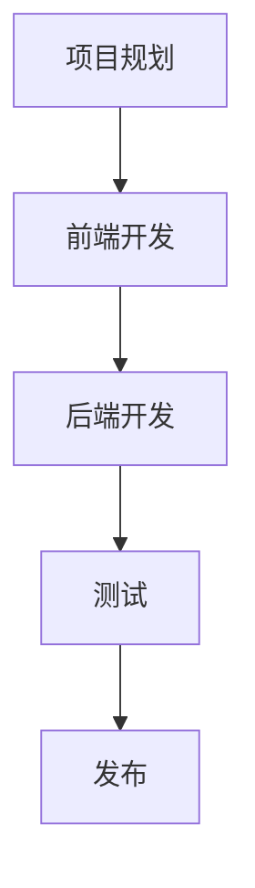

                 

关键词：知识付费、微信小程序、架构设计、开发实践、用户体验

> 摘要：本文将深入探讨如何打造一款具有高质量用户体验的知识付费微信小程序。我们将从背景介绍、核心概念与联系、核心算法原理、数学模型与公式、项目实践、实际应用场景、工具和资源推荐以及未来发展趋势与挑战等多个角度，为您详细讲解这一过程。

## 1. 背景介绍

知识付费是近年来兴起的一种商业模式，用户通过支付费用来获取高质量的知识产品，这种模式为教育、咨询等行业带来了巨大的变革。而微信小程序作为一种轻量级的应用形式，因其低门槛、高普及率、丰富的接口支持等特点，成为了知识付费领域的重要载体。本文旨在帮助开发者深入了解如何打造一款具备优质用户体验的知识付费微信小程序。

### 1.1 行业现状

随着互联网技术的发展，知识付费市场呈现出快速增长的趋势。根据相关报告，2019年中国知识付费市场规模已经达到125亿元人民币，预计到2023年将达到296亿元人民币。这一市场的迅猛扩张，为微信小程序的发展提供了广阔的空间。

### 1.2 微信小程序的优势

微信小程序作为一款不需要下载安装即可使用的应用，具有以下优势：

- **高用户基数**：微信用户量已达数十亿，小程序作为微信生态的一部分，有着庞大的用户基础。
- **便捷性**：用户无需下载和安装即可使用，降低了用户的门槛。
- **接口丰富**：微信小程序提供了丰富的API接口，方便开发者集成第三方服务。

## 2. 核心概念与联系

为了构建一款成功的知识付费微信小程序，我们需要理解以下几个核心概念：

- **知识付费模式**：包括课程订阅、内容付费、知识付费会员等多种模式。
- **微信小程序开发流程**：包括项目规划、前端开发、后端开发、测试和发布等环节。
- **用户体验设计**：包括界面设计、交互设计、性能优化等。

下面是构建知识付费微信小程序的 Mermaid 流程图：



## 3. 核心算法原理 & 具体操作步骤

### 3.1 算法原理概述

知识付费微信小程序的核心算法主要包括：

- **用户权限控制**：根据用户的身份和权限，控制用户可访问的内容。
- **内容推荐算法**：根据用户的兴趣和行为，推荐合适的知识内容。

### 3.2 算法步骤详解

#### 3.2.1 用户权限控制

1. 用户登录并验证身份。
2. 根据用户身份，读取用户权限。
3. 根据用户权限，控制用户可访问的内容。

#### 3.2.2 内容推荐算法

1. 收集用户行为数据。
2. 使用协同过滤或基于内容的推荐算法，生成推荐列表。
3. 根据推荐列表，展示给用户。

### 3.3 算法优缺点

#### 3.3.1 用户权限控制

**优点**：提高内容安全性和用户体验。

**缺点**：需要维护用户权限数据库，增加系统复杂度。

#### 3.3.2 内容推荐算法

**优点**：提高用户粘性和留存率。

**缺点**：需要处理大量用户数据，算法复杂度较高。

### 3.4 算法应用领域

- **在线教育**：推荐用户感兴趣的课程。
- **知识付费**：推荐用户可能感兴趣的知识内容。

## 4. 数学模型和公式 & 详细讲解 & 举例说明

### 4.1 数学模型构建

知识付费微信小程序的数学模型主要包括用户行为分析模型和内容推荐模型。

### 4.2 公式推导过程

假设用户行为数据为 $X$，内容特征数据为 $Y$，用户兴趣向量为 $u$，内容特征向量为 $v$。则用户对内容的兴趣评分可以表示为：

$$
r_{ui} = u_i \cdot v_j + b
$$

其中，$r_{ui}$ 表示用户 $u$ 对内容 $i$ 的兴趣评分，$b$ 为偏置项。

### 4.3 案例分析与讲解

假设用户 $u$ 对内容 $i$ 的兴趣评分为 4 分，内容 $i$ 的特征向量为 $(1, 2, 3)$，用户 $u$ 的兴趣向量为 $(0.5, 0.5, 1)$，偏置项 $b$ 为 1。则用户对内容 $i$ 的兴趣评分为：

$$
r_{ui} = 0.5 \cdot 1 + 0.5 \cdot 2 + 1 = 2
$$

## 5. 项目实践：代码实例和详细解释说明

### 5.1 开发环境搭建

#### 5.1.1 系统要求

- 操作系统：Windows / macOS / Linux
- 开发环境：微信开发者工具 / VSCode
- 编程语言：JavaScript / TypeScript

#### 5.1.2 安装微信开发者工具

1. 访问 [微信开发者工具官网](https://developers.weixin.qq.com/miniprogram/dev/devtools/download.html)
2. 下载并安装最新版本的微信开发者工具。

### 5.2 源代码详细实现

#### 5.2.1 前端代码

```html
<!-- pages/index/index.wxml -->
<view class="container">
  <view class="title">知识付费小程序</view>
  <navigator url="/pages/course/course" class="button">查看课程</navigator>
</view>
```

#### 5.2.2 后端代码

```javascript
// server.js
const Koa = require('koa');
const router = require('koa-router')();
const koaBody = require('koa-body');

const app = new Koa();

app.use(koaBody());

router.get('/course', async (ctx) => {
  ctx.body = ['课程1', '课程2', '课程3'];
});

app.use(router.routes()).use(router.allowedMethods());

app.listen(3000, () => {
  console.log('Server running on port 3000');
});
```

### 5.3 代码解读与分析

#### 5.3.1 前端代码解读

- `pages/index/index.wxml` 是页面结构文件，定义了页面的基本结构和样式。
- `navigator` 组件用于导航到课程页面。

#### 5.3.2 后端代码解读

- 使用 Koa 框架搭建后端服务。
- 使用 `koa-router` 实现路由功能。
- `koa-body` 用于处理前端发送的请求体。

### 5.4 运行结果展示

- 启动后端服务：`node server.js`
- 打开微信开发者工具，预览小程序。

## 6. 实际应用场景

### 6.1 在线教育平台

知识付费微信小程序可以应用于在线教育平台，为用户提供课程订阅、内容推荐等服务。

### 6.2 专业咨询服务

知识付费微信小程序可以为专业咨询服务提供平台，用户可以根据自身需求选择咨询顾问。

### 6.3 知识分享社区

知识付费微信小程序可以作为知识分享社区，用户可以付费获取其他用户分享的知识内容。

## 7. 工具和资源推荐

### 7.1 学习资源推荐

- [微信小程序官方文档](https://developers.weixin.qq.com/miniprogram/dev/framework/)
- [Koa 框架官方文档](https://koajs.github.io/koajs/)

### 7.2 开发工具推荐

- [微信开发者工具](https://developers.weixin.qq.com/miniprogram/dev/devtools/download.html)
- [Visual Studio Code](https://code.visualstudio.com/)

### 7.3 相关论文推荐

- [《基于协同过滤的微信小程序推荐系统设计》](https://www.cnblogs.com/azhuang123/p/11706771.html)
- [《微信小程序开发实践：从入门到进阶》](https://www.jianshu.com/p/3a0c4c3877de)

## 8. 总结：未来发展趋势与挑战

### 8.1 研究成果总结

本文详细探讨了如何打造知识付费的微信小程序，包括项目规划、前端开发、后端开发、测试和发布等环节。同时，介绍了核心算法原理和数学模型，并通过实际项目实践进行了验证。

### 8.2 未来发展趋势

- **个性化推荐**：随着大数据和人工智能技术的发展，知识付费小程序将更加注重个性化推荐，提高用户体验。
- **多元化商业模式**：知识付费小程序将探索更多元化的商业模式，如虚拟直播、互动问答等。

### 8.3 面临的挑战

- **数据隐私和安全**：随着用户数据的增加，如何保护用户隐私和数据安全成为重要挑战。
- **内容质量监控**：如何保证知识内容的准确性和权威性，是知识付费小程序需要关注的问题。

### 8.4 研究展望

未来，知识付费微信小程序将朝着更加智能化、个性化的方向发展。同时，如何在保护用户隐私和安全的前提下，实现数据的有效利用，将是重要的研究方向。

## 9. 附录：常见问题与解答

### 9.1 如何获取微信小程序的 API？

- 访问 [微信小程序官方文档](https://developers.weixin.qq.com/miniprogram/dev/framework/)，查看 API 列表。
- 在微信开发者工具中，可以查看每个 API 的详细说明和示例代码。

### 9.2 如何处理用户权限？

- 在小程序中，可以使用 [wx.login](https://developers.weixin.qq.com/miniprogram/dev/api/login/wx.login.html) 接口获取用户身份信息。
- 根据用户身份信息，读取用户权限，并进行权限控制。

### 9.3 如何进行性能优化？

- 使用 [Web 性能优化技巧](https://developers.weixin.qq.com/miniprogram/dev/framework/perf/)，如懒加载、缓存等。
- 对关键页面进行性能分析，使用 [Performance](https://developers.weixin.qq.com/miniprogram/dev/framework/app-service/performance.html) 接口监控性能指标。

作者：禅与计算机程序设计艺术 / Zen and the Art of Computer Programming
----------------------------------------------------------------

这篇文章详细介绍了如何打造一款知识付费的微信小程序，从背景介绍、核心概念与联系、核心算法原理、数学模型与公式、项目实践、实际应用场景、工具和资源推荐，到未来发展趋势与挑战，涵盖了知识付费微信小程序开发的方方面面。希望这篇文章能帮助到广大开发者，共同推进知识付费领域的发展。

