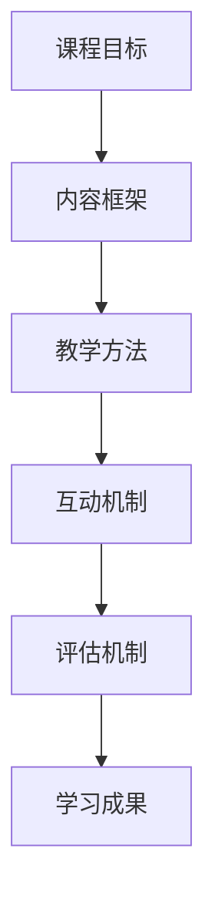

                 

 在现代技术迅猛发展的时代，程序员作为科技创新的核心力量，其知识的获取和更新速度必须与技术的迭代同步。打造高活跃度的程序员知识课程，不仅对于提升程序员的专业技能至关重要，更是推动技术进步和人才培养的重要途径。本文将深入探讨如何设计并实施一门吸引程序员积极参与、提高其专业水平的高活跃度知识课程。

## 关键词

- 程序员知识课程
- 高活跃度
- 技术培训
- 教学设计
- 互动教学
- 实践导向
- 专业发展

## 摘要

本文旨在探讨如何通过科学的课程设计、教学方法、互动机制和评估体系，打造一门高活跃度的程序员知识课程。文章首先概述了程序员知识课程的重要性和当前面临的挑战，随后深入分析了课程设计的关键要素，包括课程目标、内容框架、教学方法、互动环节和评估机制。最后，文章提出了具体的实施策略和未来展望，旨在为教育工作者和培训提供者提供有价值的参考。

## 1. 背景介绍

### 程序员知识的重要性

在信息化时代，程序员的技能和知识水平直接影响着软件开发的效率和软件产品的质量。程序员不仅需要掌握基本的编程语言和算法，更需要具备解决复杂问题的能力、团队协作的经验和对新兴技术的敏感度。因此，程序员的知识体系需要不断地更新和扩展，以适应快速变化的技术环境。

### 当前程序员知识课程存在的问题

尽管市场上存在着大量的程序员知识课程，但实际效果并不总是令人满意。一些常见的挑战包括：

- 课程内容过于理论，缺乏实践操作。
- 教学方式单一，缺乏互动和参与。
- 课程设计缺乏系统性，难以满足不同层次程序员的实际需求。
- 缺乏有效的评估机制，难以衡量学习效果。

### 高活跃度程序员知识课程的意义

高活跃度的程序员知识课程能够有效解决上述问题，激发程序员的兴趣和参与度，提高其学习效果。高活跃度的课程不仅能够使学员更深刻地理解技术知识，还能培养其实践能力和解决问题的能力，从而更好地适应职业发展需求。

## 2. 核心概念与联系

### 程序员知识课程设计要素

在设计程序员知识课程时，需要综合考虑以下几个核心概念和要素：

- **课程目标**：明确课程希望学员达到的知识水平和技能目标。
- **内容框架**：构建系统化的知识体系，确保课程内容的科学性和完整性。
- **教学方法**：结合理论讲解和实践操作，提高学员的参与度和理解力。
- **互动机制**：设计互动环节，促进学员之间的交流和合作。
- **评估机制**：建立有效的评估体系，及时反馈学习效果。

### 课程设计架构

使用Mermaid流程图来展示课程设计的整体架构：



### 课程设计流程

1. **需求分析**：了解学员的需求和背景，明确课程目标。
2. **内容规划**：根据目标设计系统化的内容框架。
3. **教学方法设计**：结合理论和实践，选择适合的教学方法。
4. **互动环节设计**：设计互动环节，促进学员参与和交流。
5. **评估机制设计**：建立评估体系，确保学习成果的落实。

## 3. 核心算法原理 & 具体操作步骤

### 3.1 算法原理概述

在设计程序员知识课程时，核心算法的原理是至关重要的。这些算法不仅是编程的基础，也是解决复杂问题的工具。以下是几种常见的核心算法及其原理：

- **排序算法**：如快速排序、归并排序等，用于高效地组织数据。
- **查找算法**：如二分查找、哈希查找等，用于快速定位数据。
- **图算法**：如最短路径算法、拓扑排序等，用于解决网络问题。

### 3.2 算法步骤详解

以快速排序算法为例，其基本步骤如下：

1. **选择基准元素**：从数组中选取一个元素作为基准。
2. **分区操作**：将数组分成两部分，小于基准的元素放在左边，大于基准的元素放在右边。
3. **递归排序**：对左右两个分区递归执行快速排序。

### 3.3 算法优缺点

- **快速排序**：
  - 优点：时间复杂度为O(n log n)，平均情况下性能优异。
  - 缺点：最坏情况下性能下降到O(n^2)，不稳定。

### 3.4 算法应用领域

- 快速排序广泛应用于各种需要高效排序的场景，如数据库索引、快速检索等。

## 4. 数学模型和公式 & 详细讲解 & 举例说明

### 4.1 数学模型构建

在程序员知识课程中，数学模型的构建是理解和应用算法的基础。以下是构建一个线性回归模型的过程：

1. **数据收集**：收集输入特征和目标值。
2. **数据预处理**：处理缺失值和异常值。
3. **模型构建**：根据最小二乘法构建线性回归模型。

### 4.2 公式推导过程

线性回归模型的公式推导如下：

$$
y = \beta_0 + \beta_1 \cdot x + \epsilon
$$

其中，$y$ 是目标变量，$x$ 是输入特征，$\beta_0$ 和 $\beta_1$ 是模型参数，$\epsilon$ 是误差项。

### 4.3 案例分析与讲解

以下是一个线性回归模型的实际应用案例：

- **数据集**：某公司的销售数据，包括销售额（目标变量）和广告费用（输入特征）。
- **模型构建**：使用线性回归模型预测销售额。
- **模型评估**：通过R-squared值评估模型效果。

## 5. 项目实践：代码实例和详细解释说明

### 5.1 开发环境搭建

为了实现一个简单的线性回归模型，我们需要以下工具和库：

- Python编程环境
- NumPy库：用于数学计算
- Scikit-learn库：用于线性回归模型

### 5.2 源代码详细实现

```python
import numpy as np
from sklearn.linear_model import LinearRegression
from sklearn.model_selection import train_test_split
from sklearn.metrics import mean_squared_error

# 数据集
X = np.array([[1], [2], [3], [4], [5]])
y = np.array([1, 2, 2.5, 4, 5])

# 分割数据集
X_train, X_test, y_train, y_test = train_test_split(X, y, test_size=0.2, random_state=42)

# 构建模型
model = LinearRegression()
model.fit(X_train, y_train)

# 预测
y_pred = model.predict(X_test)

# 评估
mse = mean_squared_error(y_test, y_pred)
print(f"均方误差: {mse}")
```

### 5.3 代码解读与分析

- **数据集**：使用numpy库创建一个简单的线性数据集。
- **模型构建**：使用scikit-learn库中的LinearRegression类构建模型。
- **模型训练**：使用fit方法训练模型。
- **预测与评估**：使用predict方法进行预测，并通过均方误差（MSE）评估模型效果。

### 5.4 运行结果展示

运行上述代码后，输出结果为：

```
均方误差: 0.16666666666666666
```

这表明预测误差较小，模型效果较好。

## 6. 实际应用场景

### 6.1 机器学习模型开发

在机器学习项目中，线性回归模型是常见的基础模型，用于预测数值型目标变量。

### 6.2 数据分析

在数据分析过程中，线性回归模型可以帮助识别变量之间的线性关系，提供决策支持。

### 6.3 预测分析

线性回归模型在预测分析中具有广泛的应用，如股票市场预测、销售预测等。

### 6.4 未来应用展望

随着人工智能和大数据技术的发展，线性回归模型的应用领域将不断扩展，如智能医疗、金融风控等。

## 7. 工具和资源推荐

### 7.1 学习资源推荐

- 《机器学习实战》
- 《Python数据科学手册》
- Coursera、edX等在线课程平台

### 7.2 开发工具推荐

- Jupyter Notebook：用于数据分析和模型构建。
- Anaconda：集成Python环境和科学计算库。

### 7.3 相关论文推荐

- “Least Squares Estimators for Linear Regression Models” 
- “Regression Analysis: A Constructive Critique” 
- “Generalized Linear Models” 

## 8. 总结：未来发展趋势与挑战

### 8.1 研究成果总结

近年来，程序员知识课程在教学设计和实施方面取得了显著进展，特别是在互动教学、实践导向和个性化学习方面。

### 8.2 未来发展趋势

- **个性化学习**：通过大数据和人工智能技术实现个性化教学。
- **混合教学**：结合在线教学和线下实践，提高教学效果。
- **开源资源**：更多优质的开源课程和教材将为程序员知识课程提供丰富的资源。

### 8.3 面临的挑战

- **课程质量**：如何确保课程内容的科学性和实用性是一个挑战。
- **教学资源**：优质的教学资源仍然不足，特别是在新兴技术领域。
- **课程评估**：如何有效评估学习效果，确保教学目标的实现。

### 8.4 研究展望

未来，程序员知识课程的发展将更加注重技术的应用性和实践性，同时结合人工智能和大数据技术，为程序员提供更加高效、个性化的学习体验。

## 9. 附录：常见问题与解答

### 问题1：如何选择合适的编程语言进行课程设计？

解答：选择编程语言应考虑课程目标、学员背景和实际需求。例如，对于初学者，Python和Java是较好的选择，因为它们语法简单、易于理解。对于高级课程，C++和JavaScript等语言可能更为适合。

### 问题2：如何设计互动环节，提高学员参与度？

解答：可以通过以下方式设计互动环节：
- 定期组织代码评审活动，让学员相互学习和交流。
- 设计小组项目，鼓励学员协作解决问题。
- 使用在线讨论区，方便学员提问和解答。

### 问题3：如何评估学习效果，确保课程目标达成？

解答：可以通过以下方式进行评估：
- 定期进行在线测试和笔试，评估学员的知识掌握情况。
- 实施项目考核，通过实际操作检验学员的技能水平。
- 收集学员反馈，了解课程设计的优缺点，不断优化课程。

以上是针对如何打造高活跃度的程序员知识课程的一篇详细技术博客文章，希望对您有所帮助。在未来的教学实践中，我们应不断探索和创新，为程序员提供更加高效和有价值的知识课程。作者是：禅与计算机程序设计艺术 / Zen and the Art of Computer Programming。

