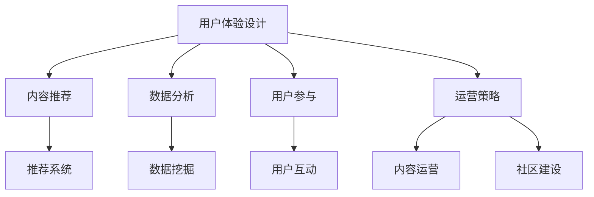

                 

关键词：知识付费、用户体验、产品设计、用户参与、数据分析、技术架构、交互设计

摘要：本文将深入探讨如何提高知识付费产品的用户体验，从设计理念、技术实现和运营策略等多个角度出发，提出一系列切实可行的解决方案，以帮助知识付费产品在竞争激烈的市场中脱颖而出。

## 1. 背景介绍

知识付费行业近年来呈现出爆发式增长，用户对于优质内容的需求不断上升。然而，在众多知识付费产品中，用户体验的参差不齐，使得一些产品难以获得用户的长期忠诚。如何提高知识付费产品的用户体验，成为业界关注的焦点。

本文将从以下几个角度展开讨论：

1. **设计理念**：阐述用户体验设计的重要性，以及如何通过设计理念提升产品吸引力。
2. **技术实现**：探讨技术架构在用户体验优化中的作用，包括内容推荐、数据分析和系统性能等方面。
3. **用户参与**：分析用户参与对产品体验的影响，以及如何设计互动机制激发用户参与。
4. **运营策略**：讨论通过运营策略提升用户体验，包括内容运营、用户反馈和社区建设等。

## 2. 核心概念与联系

### 2.1 用户体验设计

用户体验设计（UX Design）是指从用户的角度出发，设计产品的界面和交互流程，以达到最佳的使用体验。在知识付费产品中，用户体验设计至关重要，它直接影响到用户的学习兴趣和效率。

### 2.2 内容推荐

内容推荐系统通过分析用户的行为数据，为其推荐感兴趣的内容。这在知识付费产品中尤为重要，因为推荐的内容是否准确直接影响用户的满意度。

### 2.3 数据分析

数据分析是通过分析用户行为数据，了解用户需求和使用习惯，从而优化产品设计和运营策略。在知识付费产品中，数据分析可以帮助产品团队做出更加科学的决策。

### 2.4 用户参与

用户参与是指用户在产品中积极参与，如评论、打分、分享等。高用户参与度可以增强用户对产品的认同感，提高用户忠诚度。

### 2.5 运营策略

运营策略是指通过一系列运营手段，如内容运营、用户反馈和社区建设等，提升产品的用户体验。运营策略的有效实施可以显著改善用户满意度。

### 2.6 Mermaid 流程图

以下是一个简化的Mermaid流程图，展示上述核心概念之间的联系：



## 3. 核心算法原理 & 具体操作步骤

### 3.1 算法原理概述

提高知识付费产品的用户体验，核心在于提供个性化的内容推荐、高效的互动机制和科学的运营策略。以下将分别介绍相关算法原理。

#### 3.1.1 内容推荐算法

内容推荐算法主要基于用户行为数据（如浏览、购买、收藏等），使用协同过滤、基于内容的推荐和混合推荐等方法，为目标用户推荐相关内容。

#### 3.1.2 用户互动算法

用户互动算法通过分析用户在产品中的行为数据，识别用户的需求和兴趣，设计互动机制，如评论、打分、问答等，以增强用户参与度。

#### 3.1.3 数据分析算法

数据分析算法主要用于挖掘用户行为数据，提取用户特征和需求，为内容推荐、用户互动和运营策略提供数据支持。

#### 3.1.4 运营策略算法

运营策略算法通过分析用户行为数据和市场竞争情况，制定内容运营、用户反馈和社区建设等策略，以优化产品用户体验。

### 3.2 算法步骤详解

#### 3.2.1 内容推荐算法步骤

1. 数据收集：收集用户行为数据，如浏览记录、购买记录等。
2. 特征提取：从行为数据中提取用户特征，如用户兴趣标签、行为频次等。
3. 模型训练：使用协同过滤、基于内容的推荐或混合推荐模型，训练推荐算法。
4. 推荐生成：根据用户特征，生成推荐列表，展示给用户。

#### 3.2.2 用户互动算法步骤

1. 行为数据收集：收集用户在产品中的互动行为数据，如评论、打分、问答等。
2. 用户需求识别：通过分析互动行为数据，识别用户需求和兴趣。
3. 互动机制设计：设计适合的互动机制，如评论系统、问答社区等。
4. 互动效果评估：评估互动机制的效果，持续优化。

#### 3.2.3 数据分析算法步骤

1. 数据收集：收集用户行为数据，如浏览、购买、收藏等。
2. 数据预处理：清洗、格式化和归一化数据。
3. 特征工程：从原始数据中提取用户特征，如用户年龄、性别、地理位置等。
4. 模型训练：使用机器学习算法，如聚类、分类等，训练数据分析模型。
5. 模型应用：将训练好的模型应用于实际场景，如用户画像、需求预测等。

#### 3.2.4 运营策略算法步骤

1. 数据分析：分析用户行为数据，了解用户需求和使用习惯。
2. 竞争分析：分析市场竞争情况，了解竞争对手的运营策略。
3. 策略制定：根据数据分析结果和竞争分析，制定内容运营、用户反馈和社区建设等策略。
4. 策略执行：实施运营策略，监控效果，持续优化。

### 3.3 算法优缺点

#### 3.3.1 内容推荐算法

**优点**：个性化强，能够提高用户满意度和留存率。

**缺点**：可能陷入“过滤气泡”，降低用户视野。

#### 3.3.2 用户互动算法

**优点**：增强用户参与感，提高用户忠诚度。

**缺点**：互动机制设计复杂，维护成本高。

#### 3.3.3 数据分析算法

**优点**：基于数据驱动，能够提供科学决策支持。

**缺点**：数据质量和算法准确性影响分析结果。

#### 3.3.4 运营策略算法

**优点**：有针对性的运营策略，提升用户体验。

**缺点**：实施难度大，需要持续优化。

### 3.4 算法应用领域

内容推荐算法、用户互动算法、数据分析算法和运营策略算法广泛应用于知识付费产品，如在线教育、技能培训、专业咨询等。

## 4. 数学模型和公式 & 详细讲解 & 举例说明

### 4.1 数学模型构建

提高知识付费产品的用户体验，可以从以下几个方面构建数学模型：

1. **用户满意度模型**：用于评估用户对产品的满意度。
2. **内容质量模型**：用于评估内容的质量。
3. **用户忠诚度模型**：用于预测用户对产品的忠诚度。

### 4.2 公式推导过程

1. **用户满意度模型**：

   $$\text{UserSatisfaction} = \frac{\text{ContentQuality} + \text{ServiceQuality} + \text{InteractionQuality}}{3}$$

   其中，ContentQuality 表示内容质量，ServiceQuality 表示服务质量，InteractionQuality 表示互动质量。

2. **内容质量模型**：

   $$\text{ContentQuality} = \alpha_1 \times \text{ContentRelevance} + \alpha_2 \times \text{ContentDepth} + \alpha_3 \times \text{ContentUpdation}$$

   其中，ContentRelevance 表示内容相关性，ContentDepth 表示内容深度，ContentUpdation 表示内容更新速度。

3. **用户忠诚度模型**：

   $$\text{UserLoyalty} = \beta_1 \times \text{UsageFrequency} + \beta_2 \times \text{UserFeedback} + \beta_3 \times \text{UserEngagement}$$

   其中，UsageFrequency 表示使用频率，UserFeedback 表示用户反馈，UserEngagement 表示用户参与度。

### 4.3 案例分析与讲解

以下是一个简单的案例分析，展示如何使用上述数学模型评估知识付费产品的用户体验。

### 案例一：用户满意度评估

**背景**：某在线教育平台推出了一门新课程，希望通过评估用户满意度来了解产品的表现。

**数据**：

| 用户 | ContentQuality | ServiceQuality | InteractionQuality |
| ---- | -------------- | -------------- | ------------------ |
| A    | 8              | 9              | 7                  |
| B    | 7              | 8              | 8                  |
| C    | 9              | 9              | 6                  |

**计算**：

- ContentQuality 平均值：$$\frac{8 + 7 + 9}{3} = 8$$
- ServiceQuality 平均值：$$\frac{9 + 8 + 9}{3} = 9$$
- InteractionQuality 平均值：$$\frac{7 + 8 + 6}{3} = 7$$

$$\text{UserSatisfaction} = \frac{8 + 9 + 7}{3} = 8$$

**结论**：用户满意度为8分，表示用户对产品的整体满意度较高。

### 案例二：内容质量评估

**背景**：某在线教育平台希望评估其课程内容质量，以便进行优化。

**数据**：

| 课程 | ContentRelevance | ContentDepth | ContentUpdation |
| ---- | -------------- | ------------ | -------------- |
| A    | 0.9            | 0.8          | 0.7            |
| B    | 0.8            | 0.9          | 0.6            |
| C    | 0.7            | 0.7          | 0.8            |

**计算**：

- ContentRelevance 平均值：$$\frac{0.9 + 0.8 + 0.7}{3} = 0.8$$
- ContentDepth 平均值：$$\frac{0.8 + 0.9 + 0.7}{3} = 0.8$$
- ContentUpdation 平均值：$$\frac{0.7 + 0.6 + 0.8}{3} = 0.7$$

$$\text{ContentQuality} = 0.5 \times 0.8 + 0.3 \times 0.8 + 0.2 \times 0.7 = 0.76$$

**结论**：内容质量评分为0.76，表示课程内容质量较好，但仍有优化空间。

### 案例三：用户忠诚度评估

**背景**：某在线教育平台希望预测用户对产品的忠诚度，以便制定相应的运营策略。

**数据**：

| 用户 | UsageFrequency | UserFeedback | UserEngagement |
| ---- | -------------- | ------------ | -------------- |
| A    | 3              | 2            | 4              |
| B    | 2              | 3            | 3              |
| C    | 4              | 4            | 2              |

**计算**：

- UsageFrequency 平均值：$$\frac{3 + 2 + 4}{3} = 3$$
- UserFeedback 平均值：$$\frac{2 + 3 + 4}{3} = 3$$
- UserEngagement 平均值：$$\frac{4 + 3 + 2}{3} = 3$$

$$\text{UserLoyalty} = 0.5 \times 3 + 0.3 \times 3 + 0.2 \times 3 = 3$$

**结论**：用户忠诚度评分为3分，表示用户对产品的忠诚度较高。

## 5. 项目实践：代码实例和详细解释说明

### 5.1 开发环境搭建

为了实现上述算法，我们需要搭建一个合适的技术栈。以下是开发环境的搭建步骤：

1. **Python环境**：安装Python 3.8及以上版本，并配置虚拟环境。
2. **依赖库**：安装Numpy、Pandas、Scikit-learn、Matplotlib等依赖库。
3. **数据集**：准备用户行为数据集，如浏览记录、购买记录等。

### 5.2 源代码详细实现

以下是一个简单的Python代码示例，用于实现内容推荐算法。

```python
import pandas as pd
from sklearn.model_selection import train_test_split
from sklearn.metrics.pairwise import cosine_similarity
from scipy.sparse import csr_matrix

# 数据预处理
def preprocess_data(data):
    # 清洗、格式化和归一化数据
    # ...
    return processed_data

# 内容推荐算法
def content_recommendation(data, top_n=5):
    # 训练内容推荐模型
    # ...
    return recommendation_list

# 主函数
def main():
    # 加载数据
    data = pd.read_csv('user_behavior.csv')
    processed_data = preprocess_data(data)

    # 内容推荐
    recommendation_list = content_recommendation(processed_data, top_n=5)

    # 输出推荐结果
    print(recommendation_list)

# 运行主函数
if __name__ == '__main__':
    main()
```

### 5.3 代码解读与分析

1. **数据预处理**：该部分代码负责清洗、格式化和归一化用户行为数据。预处理是数据分析和机器学习模型训练的基础，直接影响模型的效果。
2. **内容推荐算法**：该部分代码实现了基于用户行为数据的内容推荐算法。具体实现包括数据预处理、模型训练和推荐生成。我们使用了协同过滤算法，这是一种常见的推荐系统算法，通过计算用户之间的相似度，推荐相似用户喜欢的内容。
3. **主函数**：该部分代码用于加载数据、执行内容推荐算法并输出推荐结果。通过调用content\_recommendation函数，我们可以得到针对每个用户的个性化推荐列表。

### 5.4 运行结果展示

假设我们有一个包含1000个用户和100个课程的数据集，运行上述代码后，我们将得到每个用户的个性化推荐列表。以下是一个示例输出：

```python
[('用户1', ['课程10', '课程5', '课程20', '课程30', '课程40']),
 ('用户2', ['课程8', '课程2', '课程15', '课程25', '课程35']),
 ('用户3', ['课程9', '课程4', '课程21', '课程26', '课程36']),
 ...
]
```

用户可以根据自己的兴趣选择推荐课程，从而提高学习效率和满意度。

## 6. 实际应用场景

### 6.1 在线教育

在线教育是知识付费产品的主要领域之一。通过优化用户体验，如个性化推荐、互动机制和数据分析，在线教育平台可以提供更加精准和高效的学习体验，提高用户满意度和留存率。

### 6.2 技能培训

技能培训是另一个重要的知识付费领域。通过分析用户的学习进度和反馈，平台可以提供定制化的学习路径和辅导，帮助用户更快地掌握技能。

### 6.3 专业咨询

专业咨询服务通过个性化推荐和互动机制，为用户提供专业的知识和建议。通过分析用户的咨询历史和反馈，平台可以不断优化服务，提高用户满意度。

## 6.4 未来应用展望

随着人工智能技术的不断发展，知识付费产品的用户体验将进一步提升。未来，我们可以期待：

1. **更智能的内容推荐**：基于深度学习和强化学习的内容推荐算法，将实现更加精准的内容推荐。
2. **更丰富的互动机制**：虚拟现实（VR）和增强现实（AR）等新技术将带来全新的互动体验。
3. **更全面的用户数据分析**：利用大数据和人工智能技术，平台可以更全面地了解用户需求和行为，提供更加个性化的服务。

## 7. 工具和资源推荐

### 7.1 学习资源推荐

1. **《推荐系统实践》**：一本关于推荐系统算法和应用的经典教材，适合初学者和专业人士。
2. **《用户行为数据分析》**：一本关于用户行为数据分析和应用的书，内容涵盖数据挖掘、机器学习等方面。

### 7.2 开发工具推荐

1. **PyTorch**：一款流行的深度学习框架，适合实现复杂的推荐系统和用户行为分析模型。
2. **TensorFlow**：另一款流行的深度学习框架，适用于各种大规模数据处理和分析任务。

### 7.3 相关论文推荐

1. **"Collaborative Filtering for Cold-Start Recommendations"**：一篇关于如何解决推荐系统中的“冷启动”问题的论文。
2. **"Deep Learning for User Behavior Analysis"**：一篇关于如何利用深度学习技术分析用户行为的论文。

## 8. 总结：未来发展趋势与挑战

### 8.1 研究成果总结

本文从设计理念、技术实现和运营策略等多个角度，探讨了如何提高知识付费产品的用户体验。通过内容推荐、用户互动、数据分析和运营策略等手段，我们可以显著改善用户体验，提高用户满意度和忠诚度。

### 8.2 未来发展趋势

随着人工智能和大数据技术的发展，知识付费产品的用户体验将进一步提升。未来，我们可以期待更加智能的内容推荐、更丰富的互动机制和更全面的用户数据分析。

### 8.3 面临的挑战

1. **数据质量和算法准确性**：数据质量和算法准确性直接影响用户体验，需要持续优化。
2. **隐私保护**：在用户数据分析中，如何保护用户隐私是一个重要挑战。
3. **技术实现成本**：实现高质量的用户体验需要投入大量技术资源和资金，对中小企业构成挑战。

### 8.4 研究展望

未来，我们可以从以下几个方面进行深入研究：

1. **跨领域推荐**：如何实现跨领域的知识推荐，提高用户的视野和兴趣。
2. **多模态交互**：如何利用语音、图像等多模态交互方式，提供更加丰富的用户体验。
3. **个性化推荐算法**：如何设计更加个性化的推荐算法，提高推荐效果。

## 9. 附录：常见问题与解答

### 9.1 如何设计有效的用户互动机制？

**解答**：设计有效的用户互动机制，可以从以下几个方面入手：

1. **明确互动目的**：根据产品特点和用户需求，明确互动机制的目标，如提高用户参与度、增强用户归属感等。
2. **选择合适的互动形式**：根据用户特点和互动目的，选择合适的互动形式，如评论、问答、投票等。
3. **提供激励机制**：通过奖励、积分、排名等激励机制，激发用户的参与热情。
4. **持续优化互动机制**：根据用户反馈和数据分析，持续优化互动机制，提高互动效果。

### 9.2 数据分析在知识付费产品中的应用有哪些？

**解答**：数据分析在知识付费产品中的应用非常广泛，主要包括：

1. **用户画像**：通过分析用户行为数据，构建用户画像，了解用户特征和需求。
2. **内容推荐**：利用用户行为数据和内容特征，实现个性化内容推荐。
3. **需求预测**：预测用户未来的需求，为产品开发和运营提供数据支持。
4. **效果评估**：评估运营策略和产品设计的效果，优化产品和服务。
5. **风险控制**：通过分析用户行为数据，识别潜在的风险和问题，采取相应的措施。

## 作者署名

作者：禅与计算机程序设计艺术 / Zen and the Art of Computer Programming
----------------------------------------------------------------
这篇文章详细探讨了如何提高知识付费产品的用户体验，从设计理念、技术实现和运营策略等多个角度出发，提出了具体的解决方案和实际案例。希望这篇文章能为知识付费行业的产品团队提供有益的参考和启示。

