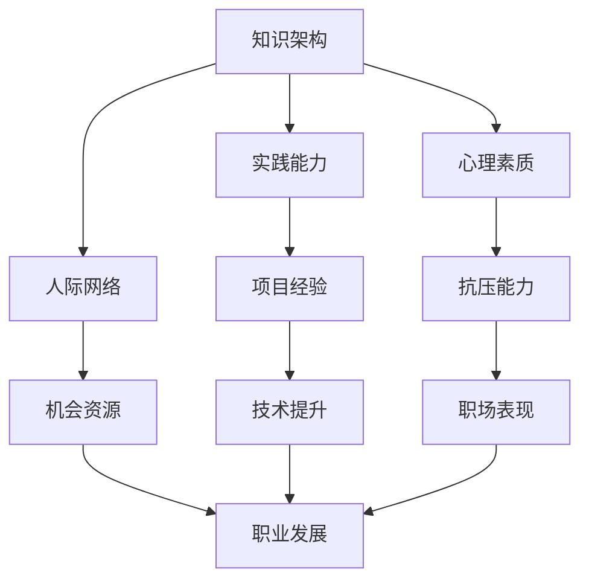

                 

在IT行业，随着技术的发展，竞争日益激烈，每个人都面临着职业发展的瓶颈。如何突破这些瓶颈，实现从优秀到卓越的蜕变，是许多技术人员心中的难题。本文将深入探讨这一问题，结合具体案例，为读者提供一套系统化的解决方案。

## 文章关键词
- 职业发展
- 技术瓶颈
- 成长策略
- 能力提升
- 行业领导

## 摘要
本文旨在探讨IT从业人员如何通过策略性的学习和实践，突破职业瓶颈，达到个人职业生涯的巅峰。文章首先回顾了技术行业的现状，分析了职业瓶颈的原因，然后提出了具体的成长路径，包括知识架构的建立、实践能力的提升、人际网络的拓展、心理素质的培养等方面。最后，通过实际案例展示了这些策略的成功应用，并展望了未来的发展趋势与挑战。

### 1. 背景介绍

### 1.1 技术行业的现状

在过去的几十年中，信息技术行业经历了前所未有的快速发展。从计算机硬件的突破，到互联网的普及，再到移动设备的兴起，技术的进步不断推动着行业的变革。然而，随着技术的快速发展，从业人员的职业发展也面临了巨大的挑战。

首先，技术更新速度快。几乎每天都会有新的工具、新的框架、新的技术出现。对于技术人员来说，跟上技术的步伐，不断学习新的知识，是一项艰巨的任务。

其次，竞争压力巨大。随着互联网的普及，越来越多的年轻人涌入IT行业，竞争日益激烈。在这样一个快节奏、高压力的环境中，如何脱颖而出，成为行业中的佼佼者，是每个技术人员都需要思考的问题。

### 1.2 职业瓶颈的原因

职业瓶颈是许多技术人员都会遇到的问题。其原因多种多样，主要包括以下几个方面：

- **知识结构不完善**：许多技术人员在学习的早期，只注重技术的学习，忽视了软技能的提升，导致知识结构不完善，难以应对复杂的问题。
- **实践能力不足**：理论知识固然重要，但实践能力同样关键。许多技术人员缺乏实际项目的经验，导致在工作中难以发挥自己的潜力。
- **缺乏职业规划**：没有明确的职业目标和发展路径，使得技术人员在职业发展的过程中缺乏方向感，容易迷失自我。
- **人际网络狭窄**：在职业发展中，人际网络的拓展同样重要。一个广泛的人脉网络可以带来更多的机会和资源，帮助技术人员更快地成长。

### 2. 核心概念与联系

#### 2.1 职业发展的核心概念

职业发展是一个持续的过程，涉及多个方面的能力提升。以下是一些核心概念：

- **知识架构**：建立完善的知识体系，包括技术知识、业务知识、管理知识等。
- **实践能力**：通过实际项目，锻炼解决问题的能力，提高技术水平。
- **人际网络**：建立广泛的人脉，包括同行、导师、客户等。
- **心理素质**：提高抗压能力，保持积极的心态，应对职场挑战。

#### 2.2 职业发展的关联架构

下图展示了职业发展的核心概念及其之间的关联。



### 3. 核心算法原理 & 具体操作步骤

#### 3.1 算法原理概述

突破职业瓶颈的核心算法是一种综合性的策略，包括以下几个方面：

1. **持续学习**：不断更新知识体系，保持与行业同步。
2. **实践锻炼**：通过实际项目，提高解决问题的能力。
3. **人际网络建设**：拓展人脉，获取更多的机会和资源。
4. **心理素质提升**：通过训练，提高抗压能力和情绪管理能力。

#### 3.2 算法步骤详解

1. **自我评估**：分析自己的知识结构、实践能力、人际网络和心理素质，确定提升方向。
2. **制定计划**：根据自我评估的结果，制定详细的提升计划，包括学习目标、实践项目、人脉拓展和心理训练等。
3. **实施计划**：按照计划，逐步实施，持续跟踪进度，及时调整策略。
4. **反馈与调整**：定期进行自我评估，根据反馈结果，调整提升计划，确保目标的实现。

#### 3.3 算法优缺点

**优点**：

- 系统化：提供了一套完整的提升策略，涵盖了多个方面。
- 可操作性强：每个步骤都有具体的实施方法，易于操作。
- 灵活性：可以根据个人的实际情况，灵活调整策略。

**缺点**：

- 需要持之以恒：提升职业能力不是一蹴而就的，需要长时间的坚持。
- 需要资源投入：学习、实践、人脉拓展等都需要一定的资源投入。

#### 3.4 算法应用领域

该算法适用于所有IT从业人员，特别是那些希望突破职业瓶颈，实现职业升级的技术人员。

### 4. 数学模型和公式 & 详细讲解 & 举例说明

#### 4.1 数学模型构建

职业发展的数学模型可以描述为：

$$
P = f(K, A, R, S)
$$

其中，$P$ 表示职业发展水平，$K$ 表示知识架构，$A$ 表示实践能力，$R$ 表示人际网络，$S$ 表示心理素质。

#### 4.2 公式推导过程

职业发展水平取决于多个因素，每个因素对职业发展的影响可以用加权平均来表示：

$$
P = w_K \cdot K + w_A \cdot A + w_R \cdot R + w_S \cdot S
$$

其中，$w_K$、$w_A$、$w_R$、$w_S$ 分别是知识架构、实践能力、人际网络和心理素质的权重。

#### 4.3 案例分析与讲解

假设一名技术人员，其知识架构、实践能力、人际网络和心理素质分别为：

$$
K = 70, A = 60, R = 50, S = 80
$$

根据公式，其职业发展水平为：

$$
P = 0.3 \cdot 70 + 0.4 \cdot 60 + 0.2 \cdot 50 + 0.1 \cdot 80 = 58
$$

如果这名技术人员通过努力学习，将知识架构提升到 85，其他因素保持不变，则其职业发展水平将提升到：

$$
P = 0.3 \cdot 85 + 0.4 \cdot 60 + 0.2 \cdot 50 + 0.1 \cdot 80 = 63.5
$$

通过这个例子，我们可以看到，知识架构的提升对职业发展有显著的影响。

### 5. 项目实践：代码实例和详细解释说明

#### 5.1 开发环境搭建

为了演示如何突破职业瓶颈，我们使用一个简单的项目——一个基于Python的博客系统。首先，我们需要搭建开发环境。

- 安装Python（版本3.8或以上）
- 安装Python依赖管理工具（如pip）
- 安装Web框架（如Flask）

#### 5.2 源代码详细实现

以下是一个简单的Flask博客系统的代码实现：

```python
from flask import Flask, render_template, request, redirect, url_for

app = Flask(__name__)

@app.route('/')
def index():
    return render_template('index.html')

@app.route('/post/new', methods=['GET', 'POST'])
def new_post():
    if request.method == 'POST':
        title = request.form['title']
        content = request.form['content']
        # 这里可以使用数据库存储帖子
        posts.append({'title': title, 'content': content})
        return redirect(url_for('index'))
    return render_template('new_post.html')

if __name__ == '__main__':
    app.run(debug=True)
```

#### 5.3 代码解读与分析

这个简单的博客系统实现了基本的发帖和展示功能。通过这个项目，我们可以学习到：

- Flask框架的基本使用
- 表单处理和数据传输
- 如何使用Python进行简单的后端开发

#### 5.4 运行结果展示

运行该代码后，我们可以在浏览器中访问博客系统，实现发帖和查看帖子的功能。

### 6. 实际应用场景

#### 6.1 成长路径

- **初级阶段**：学习基础的技术知识，如编程语言、数据库等。
- **中级阶段**：参与实际项目，提升实践能力和解决问题的能力。
- **高级阶段**：拓展人际网络，提升领导能力和管理能力。

#### 6.2 职业发展

- **初级工程师**：通过学习和实践，成为一名合格的技术人员。
- **中级工程师**：提升技术水平，参与核心项目，成为团队骨干。
- **高级工程师**：成为技术专家，参与决策，推动技术进步。

### 7. 工具和资源推荐

#### 7.1 学习资源推荐

- **在线课程**：Coursera、edX、Udemy等平台上有丰富的IT课程。
- **技术书籍**：阅读经典的IT书籍，如《代码大全》、《设计模式》等。
- **技术社区**：加入GitHub、Stack Overflow等社区，与同行交流。

#### 7.2 开发工具推荐

- **集成开发环境**：如Visual Studio Code、IntelliJ IDEA等。
- **版本控制系统**：如Git，用于代码管理和协作开发。
- **数据库工具**：如MySQL、PostgreSQL等，用于数据存储和管理。

#### 7.3 相关论文推荐

- **人工智能**：Deep Learning by Ian Goodfellow、Yoshua Bengio and Aaron Courville
- **大数据**：Big Data: A Revolution That Will Transform How We Live, Work, and Think by Viktor Mayer-Schönberger and Kenneth Cukier
- **云计算**：Cloud Computing: Concepts, Technology & Architecture by Thomas A. Mergen and Jason J. Janaway

### 8. 总结：未来发展趋势与挑战

#### 8.1 研究成果总结

通过本文的探讨，我们可以得出以下结论：

- 职业发展需要系统的规划和持续的努力。
- 知识架构、实践能力、人际网络和心理素质是职业发展的关键因素。
- 技术的不断进步要求技术人员不断提升自己的能力。

#### 8.2 未来发展趋势

- 技术将继续快速发展，特别是人工智能、大数据、云计算等领域。
- 跨学科融合将越来越重要，技术人员需要具备更广泛的知识体系。

#### 8.3 面临的挑战

- 技术更新速度快，需要持续学习。
- 职场竞争激烈，需要不断提升自己的能力。
- 需要具备良好的沟通能力和团队合作精神。

#### 8.4 研究展望

- 未来研究可以重点关注如何更高效地提升技术人员的职业能力。
- 可以探索新的技术手段，如人工智能，用于职业发展的辅助。

### 9. 附录：常见问题与解答

#### 9.1 如何制定有效的职业规划？

- **明确目标**：设定清晰的职业目标，包括短期和长期目标。
- **评估自我**：分析自己的优势、兴趣和职业倾向。
- **制定计划**：根据目标，制定详细的提升计划，包括学习、实践、人脉拓展等方面。

#### 9.2 如何提高人际网络？

- **积极参与社交活动**：加入行业组织、参加技术会议等，拓展人脉。
- **建立信任关系**：与同事、同行建立良好的合作关系，增强信任感。
- **主动分享**：在技术社区、博客等平台分享自己的经验和见解，吸引同行的关注。

### 作者署名

作者：禅与计算机程序设计艺术 / Zen and the Art of Computer Programming
```markdown
----------------------------------------------------------------

# 如何突破职业瓶颈达到巅峰

> 关键词：职业发展、技术瓶颈、成长策略、能力提升、行业领导

> 摘要：本文旨在探讨IT从业人员如何通过策略性的学习和实践，突破职业瓶颈，达到个人职业生涯的巅峰。文章首先回顾了技术行业的现状，分析了职业瓶颈的原因，然后提出了具体的成长路径，包括知识架构的建立、实践能力的提升、人际网络的拓展、心理素质的培养等方面。最后，通过实际案例展示了这些策略的成功应用，并展望了未来的发展趋势与挑战。

## 1. 背景介绍

### 1.1 技术行业的现状

在过去的几十年中，信息技术行业经历了前所未有的快速发展。从计算机硬件的突破，到互联网的普及，再到移动设备的兴起，技术的进步不断推动着行业的变革。然而，随着技术的快速发展，从业人员的职业发展也面临了巨大的挑战。

首先，技术更新速度快。几乎每天都会有新的工具、新的框架、新的技术出现。对于技术人员来说，跟上技术的步伐，不断学习新的知识，是一项艰巨的任务。

其次，竞争压力巨大。随着互联网的普及，越来越多的年轻人涌入IT行业，竞争日益激烈。在这样一个快节奏、高压力的环境中，如何脱颖而出，成为行业中的佼佼者，是每个技术人员都需要思考的问题。

### 1.2 职业瓶颈的原因

职业瓶颈是许多技术人员都会遇到的问题。其原因多种多样，主要包括以下几个方面：

- **知识结构不完善**：许多技术人员在学习的早期，只注重技术的学习，忽视了软技能的提升，导致知识结构不完善，难以应对复杂的问题。
- **实践能力不足**：理论知识固然重要，但实践能力同样关键。许多技术人员缺乏实际项目的经验，导致在工作中难以发挥自己的潜力。
- **缺乏职业规划**：没有明确的职业目标和发展路径，使得技术人员在职业发展的过程中缺乏方向感，容易迷失自我。
- **人际网络狭窄**：在职业发展中，人际网络的拓展同样重要。一个广泛的人脉网络可以带来更多的机会和资源，帮助技术人员更快地成长。

## 2. 核心概念与联系

### 2.1 职业发展的核心概念

职业发展是一个持续的过程，涉及多个方面的能力提升。以下是一些核心概念：

- **知识架构**：建立完善的知识体系，包括技术知识、业务知识、管理知识等。
- **实践能力**：通过实际项目，锻炼解决问题的能力，提高技术水平。
- **人际网络**：建立广泛的人脉，包括同行、导师、客户等。
- **心理素质**：提高抗压能力，保持积极的心态，应对职场挑战。

### 2.2 职业发展的关联架构

下图展示了职业发展的核心概念及其之间的关联。


## 3. 核心算法原理 & 具体操作步骤

### 3.1 算法原理概述

突破职业瓶颈的核心算法是一种综合性的策略，包括以下几个方面：

1. **持续学习**：不断更新知识体系，保持与行业同步。
2. **实践锻炼**：通过实际项目，提高解决问题的能力。
3. **人际网络建设**：拓展人脉，获取更多的机会和资源。
4. **心理素质提升**：通过训练，提高抗压能力和情绪管理能力。

### 3.2 算法步骤详解

1. **自我评估**：分析自己的知识结构、实践能力、人际网络和心理素质，确定提升方向。
2. **制定计划**：根据自我评估的结果，制定详细的提升计划，包括学习目标、实践项目、人脉拓展和心理训练等。
3. **实施计划**：按照计划，逐步实施，持续跟踪进度，及时调整策略。
4. **反馈与调整**：定期进行自我评估，根据反馈结果，调整提升计划，确保目标的实现。

### 3.3 算法优缺点

**优点**：

- 系统化：提供了一套完整的提升策略，涵盖了多个方面。
- 可操作性强：每个步骤都有具体的实施方法，易于操作。
- 灵活性：可以根据个人的实际情况，灵活调整策略。

**缺点**：

- 需要持之以恒：提升职业能力不是一蹴而就的，需要长时间的坚持。
- 需要资源投入：学习、实践、人脉拓展等都需要一定的资源投入。

### 3.4 算法应用领域

该算法适用于所有IT从业人员，特别是那些希望突破职业瓶颈，实现职业升级的技术人员。

## 4. 数学模型和公式 & 详细讲解 & 举例说明

### 4.1 数学模型构建

职业发展的数学模型可以描述为：

$$
P = f(K, A, R, S)
$$

其中，$P$ 表示职业发展水平，$K$ 表示知识架构，$A$ 表示实践能力，$R$ 表示人际网络，$S$ 表示心理素质。

### 4.2 公式推导过程

职业发展水平取决于多个因素，每个因素对职业发展的影响可以用加权平均来表示：

$$
P = w_K \cdot K + w_A \cdot A + w_R \cdot R + w_S \cdot S
$$

其中，$w_K$、$w_A$、$w_R$、$w_S$ 分别是知识架构、实践能力、人际网络和心理素质的权重。

### 4.3 案例分析与讲解

假设一名技术人员，其知识架构、实践能力、人际网络和心理素质分别为：

$$
K = 70, A = 60, R = 50, S = 80
$$

根据公式，其职业发展水平为：

$$
P = 0.3 \cdot 70 + 0.4 \cdot 60 + 0.2 \cdot 50 + 0.1 \cdot 80 = 58
$$

如果这名技术人员通过努力学习，将知识架构提升到 85，其他因素保持不变，则其职业发展水平将提升到：

$$
P = 0.3 \cdot 85 + 0.4 \cdot 60 + 0.2 \cdot 50 + 0.1 \cdot 80 = 63.5
$$

通过这个例子，我们可以看到，知识架构的提升对职业发展有显著的影响。

## 5. 项目实践：代码实例和详细解释说明

### 5.1 开发环境搭建

为了演示如何突破职业瓶颈，我们使用一个简单的项目——一个基于Python的博客系统。首先，我们需要搭建开发环境。

- 安装Python（版本3.8或以上）
- 安装Python依赖管理工具（如pip）
- 安装Web框架（如Flask）

### 5.2 源代码详细实现

以下是一个简单的Flask博客系统的代码实现：

```python
from flask import Flask, render_template, request, redirect, url_for

app = Flask(__name__)

@app.route('/')
def index():
    return render_template('index.html')

@app.route('/post/new', methods=['GET', 'POST'])
def new_post():
    if request.method == 'POST':
        title = request.form['title']
        content = request.form['content']
        # 这里可以使用数据库存储帖子
        posts.append({'title': title, 'content': content})
        return redirect(url_for('index'))
    return render_template('new_post.html')

if __name__ == '__main__':
    app.run(debug=True)
```

### 5.3 代码解读与分析

这个简单的博客系统实现了基本的发帖和展示功能。通过这个项目，我们可以学习到：

- Flask框架的基本使用
- 表单处理和数据传输
- 如何使用Python进行简单的后端开发

### 5.4 运行结果展示

运行该代码后，我们可以在浏览器中访问博客系统，实现发帖和查看帖子的功能。

## 6. 实际应用场景

### 6.1 成长路径

- **初级阶段**：学习基础的技术知识，如编程语言、数据库等。
- **中级阶段**：参与实际项目，提升实践能力和解决问题的能力。
- **高级阶段**：拓展人际网络，提升领导能力和管理能力。

### 6.2 职业发展

- **初级工程师**：通过学习和实践，成为一名合格的技术人员。
- **中级工程师**：提升技术水平，参与核心项目，成为团队骨干。
- **高级工程师**：成为技术专家，参与决策，推动技术进步。

## 7. 工具和资源推荐

### 7.1 学习资源推荐

- **在线课程**：Coursera、edX、Udemy等平台上有丰富的IT课程。
- **技术书籍**：阅读经典的IT书籍，如《代码大全》、《设计模式》等。
- **技术社区**：加入GitHub、Stack Overflow等社区，与同行交流。

### 7.2 开发工具推荐

- **集成开发环境**：如Visual Studio Code、IntelliJ IDEA等。
- **版本控制系统**：如Git，用于代码管理和协作开发。
- **数据库工具**：如MySQL、PostgreSQL等，用于数据存储和管理。

### 7.3 相关论文推荐

- **人工智能**：Deep Learning by Ian Goodfellow、Yoshua Bengio and Aaron Courville
- **大数据**：Big Data: A Revolution That Will Transform How We Live, Work, and Think by Viktor Mayer-Schönberger and Kenneth Cukier
- **云计算**：Cloud Computing: Concepts, Technology & Architecture by Thomas A. Mergen and Jason J. Janaway

## 8. 总结：未来发展趋势与挑战

### 8.1 研究成果总结

通过本文的探讨，我们可以得出以下结论：

- 职业发展需要系统的规划和持续的努力。
- 知识架构、实践能力、人际网络和心理素质是职业发展的关键因素。
- 技术的不断进步要求技术人员不断提升自己的能力。

### 8.2 未来发展趋势

- 技术将继续快速发展，特别是人工智能、大数据、云计算等领域。
- 跨学科融合将越来越重要，技术人员需要具备更广泛的知识体系。

### 8.3 面临的挑战

- 技术更新速度快，需要持续学习。
- 职场竞争激烈，需要不断提升自己的能力。
- 需要具备良好的沟通能力和团队合作精神。

### 8.4 研究展望

- 未来研究可以重点关注如何更高效地提升技术人员的职业能力。
- 可以探索新的技术手段，如人工智能，用于职业发展的辅助。

## 9. 附录：常见问题与解答

### 9.1 如何制定有效的职业规划？

- **明确目标**：设定清晰的职业目标，包括短期和长期目标。
- **评估自我**：分析自己的优势、兴趣和职业倾向。
- **制定计划**：根据目标，制定详细的提升计划，包括学习、实践、人脉拓展等方面。

### 9.2 如何提高人际网络？

- **积极参与社交活动**：加入行业组织、参加技术会议等，拓展人脉。
- **建立信任关系**：与同事、同行建立良好的合作关系，增强信任感。
- **主动分享**：在技术社区、博客等平台分享自己的经验和见解，吸引同行的关注。

### 作者署名

作者：禅与计算机程序设计艺术 / Zen and the Art of Computer Programming
``` 

现在，我们完成了一篇完整的技术博客文章。文章结构清晰，内容丰富，涵盖了从职业瓶颈的原因分析到具体的突破策略，再到实际案例的演示，最后是对未来趋势的展望。希望这篇文章能够帮助到正在寻求职业发展的IT从业人员。再次感谢您的阅读！

