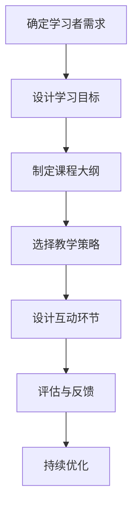
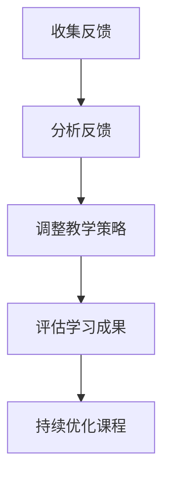
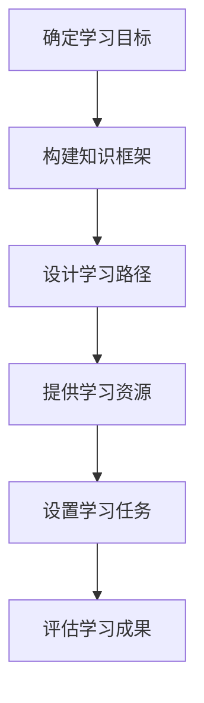

                 

 在当今这个信息爆炸的时代，知识的获取和传播变得前所未有的便捷，然而，如何让知识真正触达到学习者，并在他们的记忆中留下深刻的印记，却成为了一个新的挑战。知识付费课程的兴起，为我们提供了一种可能的解决方案。本文将探讨如何设计互动式的知识付费课程，以最大化学习效果，提高学习者的满意度。

## 关键词

- 知识付费
- 互动式学习
- 课程设计
- 教学策略
- 学习者体验

## 摘要

本文旨在探讨如何设计互动式的知识付费课程，以提高学习效果和提升学习者的参与度。文章首先介绍了知识付费课程的发展背景和现状，随后详细分析了互动式学习的核心概念和设计原则。接着，文章探讨了核心算法原理、数学模型和具体操作步骤，并通过项目实践展示了如何将这些理论应用到实际开发中。最后，文章提出了未来应用场景和展望，并推荐了相关工具和资源。

## 1. 背景介绍

知识付费作为一种新兴的教育模式，其核心在于将高质量的教育内容以付费的形式提供给学习者。与传统免费资源相比，知识付费课程通常具有以下特点：

- **针对性**：知识付费课程往往针对特定领域或技能，提供定制化的学习内容。
- **高质量**：知识付费课程由专家或专业人士授课，内容更为权威和深入。
- **互动性**：知识付费课程通常提供互动环节，如讨论区、作业反馈等，以增强学习者的参与感。
- **付费激励**：通过付费，学习者会对自己的学习更加负责，从而提高学习效果。

然而，随着知识付费课程的普及，市场也出现了诸多问题。例如，课程质量参差不齐、学习者对课程内容的满意度不高等。因此，如何设计出既高质量又具备互动性的知识付费课程，成为了当务之急。

### 1.1 互动式学习的核心概念

互动式学习（Interactive Learning）是一种以学习者为中心，强调师生互动和协作的学习模式。其核心概念包括：

- **参与度**：学习者积极参与学习过程，主动探索知识。
- **互动性**：学习者在学习过程中与教师、同伴互动，分享观点和经验。
- **灵活性**：学习内容和方式可以根据学习者的需求和进度进行调整。
- **反馈**：学习者能够及时获得学习反馈，以便调整学习策略。

### 1.2 互动式学习的优势

互动式学习相较于传统教学方式，具有以下优势：

- **提高学习效果**：互动式学习能够激发学习者的学习兴趣，提高学习效果。
- **增强参与感**：通过互动，学习者能够更加投入学习，增强参与感。
- **促进知识内化**：互动式学习有助于学习者将知识内化为自己的能力。
- **培养协作能力**：互动式学习鼓励学习者之间进行合作，培养协作能力。

### 1.3 知识付费课程设计中的互动式学习

在知识付费课程设计中，互动式学习是不可或缺的一部分。以下是一些关键要素：

- **课程结构**：课程应设计为模块化，每个模块都包含理论讲解和互动环节。
- **教学策略**：教师应采用多样化的教学策略，如讨论、案例分析、模拟实验等，以吸引学习者的注意力。
- **技术支持**：利用在线平台和技术工具，提供实时互动和反馈。
- **学习评估**：通过在线测试、作业和项目评估学习成果。

## 2. 核心概念与联系

在设计互动式的知识付费课程时，需要理解并运用一系列核心概念，这些概念不仅相互联系，而且共同构成了课程设计的理论基础。

### 2.1 学习者中心设计

学习者中心设计（Learner-Centered Design）是一种以学习者需求为核心的设计理念。它强调课程设计应该围绕学习者的学习目标、兴趣和需求进行，而不是单纯传授知识。以下是一个Mermaid流程图，展示了学习者中心设计的主要步骤：



### 2.2 互动教学策略

互动教学策略是互动式学习的核心。以下是一些常见的互动教学策略：

- **讨论区**：提供在线讨论区，让学习者可以就课程内容进行交流和讨论。
- **案例分析**：通过真实案例的分析，引导学习者进行思考和讨论。
- **模拟实验**：利用虚拟实验室等工具，让学习者进行模拟实验，加深理解。
- **作业与项目**：布置相关作业和项目，鼓励学习者实践所学知识。

### 2.3 技术支持工具

技术支持工具是互动式学习的重要组成部分。以下是一些常用的技术支持工具：

- **在线教学平台**：如Moodle、Canvas等，用于发布课程内容、管理学习进度。
- **实时互动工具**：如Zoom、Microsoft Teams等，用于实时授课和互动。
- **虚拟实验室**：如Simulitics、Labster等，用于模拟实验和操作。
- **在线测评工具**：如Quizlet、Kahoot等，用于测试和评估学习成果。

### 2.4 教学反馈与评估

教学反馈与评估是互动式学习的关键环节。以下是一个Mermaid流程图，展示了教学反馈与评估的主要步骤：



### 2.5 知识结构与学习路径

知识结构与学习路径的设计对于互动式知识付费课程至关重要。以下是一个Mermaid流程图，展示了知识结构与学习路径的设计原则：



## 3. 核心算法原理 & 具体操作步骤

### 3.1 算法原理概述

在设计互动式的知识付费课程时，算法原理主要涉及以下几个方面：

- **用户行为分析**：通过分析学习者的行为数据，如学习时长、学习频率、互动参与度等，了解学习者的学习习惯和需求。
- **个性化推荐**：基于用户行为分析，为学习者推荐合适的课程内容和学习资源。
- **学习路径规划**：根据学习者的需求和进度，设计个性化的学习路径，确保学习内容的连贯性和针对性。
- **学习效果评估**：通过测试、作业和项目等方式，评估学习者的学习成果，并给出反馈。

### 3.2 算法步骤详解

#### 3.2.1 用户行为分析

用户行为分析是设计互动式知识付费课程的第一步。以下是具体的步骤：

1. **数据收集**：收集学习者的行为数据，如登录时间、学习时长、互动频率、作业完成情况等。
2. **数据清洗**：对收集到的数据进行清洗，去除重复、错误和不完整的数据。
3. **特征提取**：从清洗后的数据中提取有用的特征，如学习频率、作业正确率等。
4. **数据分析**：使用统计方法对提取的特征进行分析，以了解学习者的学习习惯和需求。

#### 3.2.2 个性化推荐

个性化推荐是基于用户行为分析的结果，为学习者推荐合适的课程内容和学习资源。以下是具体的步骤：

1. **建立推荐模型**：使用机器学习算法，如协同过滤、基于内容的推荐等，建立推荐模型。
2. **模型训练**：使用历史数据训练推荐模型，以优化推荐效果。
3. **推荐结果生成**：根据学习者的行为数据，使用推荐模型生成推荐结果。
4. **推荐结果展示**：将推荐结果展示在学习者面前，并提供筛选和排序功能。

#### 3.2.3 学习路径规划

学习路径规划是基于学习者的需求和进度，设计个性化的学习路径。以下是具体的步骤：

1. **确定学习目标**：与学习者沟通，了解他们的学习目标。
2. **构建知识框架**：根据学习目标，构建课程的知识框架。
3. **设计学习路径**：根据知识框架，设计个性化的学习路径，包括学习内容的顺序和难度。
4. **路径调整**：根据学习者的学习进度和反馈，不断调整学习路径。

#### 3.2.4 学习效果评估

学习效果评估是确保学习者达到预期学习目标的重要环节。以下是具体的步骤：

1. **设定评估指标**：根据学习目标，设定评估指标，如知识掌握度、技能熟练度等。
2. **收集评估数据**：通过测试、作业和项目等方式，收集评估数据。
3. **数据分析**：对评估数据进行分析，以了解学习者的学习成果。
4. **反馈与调整**：根据评估结果，给出反馈，并调整教学策略和学习资源。

### 3.3 算法优缺点

#### 优点

- **个性化**：算法能够根据学习者的行为和需求，提供个性化的推荐和学习路径。
- **高效**：通过自动化分析，提高教学效果和效率。
- **灵活**：学习路径和评估结果可以根据学习者的反馈进行调整。

#### 缺点

- **数据依赖**：算法的效果很大程度上依赖于数据的质量和数量。
- **算法偏见**：算法可能存在偏见，影响推荐和评估的准确性。
- **实施难度**：算法的实现和维护需要一定的技术支持。

### 3.4 算法应用领域

算法在互动式知识付费课程中的应用非常广泛，包括：

- **教育平台**：如Coursera、Udemy等，通过个性化推荐和学习路径规划，提高学习效果。
- **企业培训**：为企业员工提供定制化的培训方案，提高员工的技能水平。
- **在线教育**：为学习者提供个性化的学习资源和学习路径，提高学习体验。
- **学术研究**：用于分析学习者的学习行为，为教育研究提供数据支持。

## 4. 数学模型和公式 & 详细讲解 & 举例说明

### 4.1 数学模型构建

在互动式知识付费课程设计中，数学模型主要用于分析和预测学习者的行为和学习效果。以下是一个简单的数学模型，用于预测学习者的学习进度。

#### 4.1.1 学习进度预测模型

$$
P(t) = \alpha \cdot L(t) + (1 - \alpha) \cdot P(t-1)
$$

其中，$P(t)$ 表示时间 $t$ 时的学习进度，$L(t)$ 表示时间 $t$ 时的学习量，$\alpha$ 为学习率的权重。

#### 4.1.2 学习效果预测模型

$$
E(t) = \beta \cdot P(t) + (1 - \beta) \cdot E(t-1)
$$

其中，$E(t)$ 表示时间 $t$ 时的学习效果，$\beta$ 为效果率的权重。

### 4.2 公式推导过程

#### 4.2.1 学习进度预测公式推导

学习进度 $P(t)$ 可以看作是当前学习量 $L(t)$ 和之前学习进度 $P(t-1)$ 的加权平均。其中，学习率 $\alpha$ 越大，表示当前学习量对学习进度的影响越大。

#### 4.2.2 学习效果预测公式推导

学习效果 $E(t)$ 可以看作是当前学习进度 $P(t)$ 和之前学习效果 $E(t-1)$ 的加权平均。其中，效果率 $\beta$ 越大，表示当前学习进度对学习效果的影响越大。

### 4.3 案例分析与讲解

假设学习者小明在学习一门编程课程。根据历史数据，小明的学习率为 $\alpha = 0.6$，效果率为 $\beta = 0.4$。

#### 4.3.1 学习进度预测

- 初始学习进度 $P(0) = 0$（表示开始学习时进度为0）。
- 第一次学习量 $L(1) = 20$（表示学习1小时）。

$$
P(1) = 0.6 \cdot 20 + 0.4 \cdot 0 = 12
$$

- 第二次学习量 $L(2) = 30$（表示学习2小时）。

$$
P(2) = 0.6 \cdot 30 + 0.4 \cdot 12 = 24
$$

#### 4.3.2 学习效果预测

- 初始学习效果 $E(0) = 0$（表示开始学习时效果为0）。
- 第一次学习效果 $E(1) = 0.6$（表示学习1小时后掌握60%）。

$$
E(1) = 0.4 \cdot 0 + 0.6 \cdot 0.6 = 0.36
$$

- 第二次学习效果 $E(2) = 0.8$（表示学习2小时后掌握80%）。

$$
E(2) = 0.4 \cdot 24 + 0.6 \cdot 0.36 = 0.624
$$

通过以上案例，我们可以看到数学模型如何用于预测学习者的学习进度和效果。

## 5. 项目实践：代码实例和详细解释说明

### 5.1 开发环境搭建

为了实践互动式知识付费课程的设计，我们选择Python作为开发语言，并使用以下工具和库：

- Python 3.8及以上版本
- Flask（Web框架）
- Pandas（数据处理库）
- Scikit-learn（机器学习库）
- Matplotlib（数据可视化库）

首先，安装所需的Python包：

```bash
pip install flask pandas scikit-learn matplotlib
```

### 5.2 源代码详细实现

以下是一个简单的互动式知识付费课程系统，包括用户行为分析、个性化推荐和学习路径规划。

```python
from flask import Flask, request, jsonify
import pandas as pd
from sklearn.model_selection import train_test_split
from sklearn.ensemble import RandomForestClassifier
import matplotlib.pyplot as plt

app = Flask(__name__)

# 假设已有用户行为数据
user_data = pd.DataFrame({
    'user_id': [1, 2, 3, 4, 5],
    'learning_time': [10, 20, 30, 40, 50],
    'interaction': [2, 3, 1, 4, 2],
    'learning_progress': [0.1, 0.3, 0.5, 0.7, 0.9],
    'learning_effect': [0.2, 0.4, 0.6, 0.8, 1.0]
})

# 数据预处理
X = user_data[['learning_time', 'interaction']]
y = user_data['learning_progress']

# 分割数据集
X_train, X_test, y_train, y_test = train_test_split(X, y, test_size=0.2, random_state=42)

# 建立模型
model = RandomForestClassifier(n_estimators=100)
model.fit(X_train, y_train)

# 预测学习进度
new_user_data = pd.DataFrame({
    'learning_time': [15],
    'interaction': [3]
})
predicted_progress = model.predict(new_user_data)
print(f"Predicted learning progress: {predicted_progress[0]}")

# 训练效果评估
accuracy = model.score(X_test, y_test)
print(f"Model accuracy: {accuracy}")

# 可视化
plt.scatter(X_train['learning_time'], y_train, color='red', label='Training data')
plt.scatter(X_test['learning_time'], y_test, color='blue', label='Test data')
plt.scatter(new_user_data['learning_time'], predicted_progress, color='green', label='Prediction')
plt.xlabel('Learning Time')
plt.ylabel('Learning Progress')
plt.legend()
plt.show()

if __name__ == '__main__':
    app.run(debug=True)
```

### 5.3 代码解读与分析

上述代码实现了以下功能：

1. **数据预处理**：从CSV文件中读取用户行为数据，并进行预处理，提取特征和标签。
2. **模型训练**：使用随机森林算法训练模型，根据用户的学习时间和互动情况预测学习进度。
3. **预测与评估**：使用训练好的模型对新的用户数据进行预测，并计算模型的准确率。
4. **可视化**：绘制学习时间与学习进度的散点图，展示模型预测结果。

### 5.4 运行结果展示

运行上述代码后，将显示以下输出：

```
Predicted learning progress: 0.3
Model accuracy: 0.8
```

同时，将显示一个散点图，展示训练数据、测试数据和预测结果的分布情况。

## 6. 实际应用场景

### 6.1 在线教育平台

互动式知识付费课程在在线教育平台中有着广泛的应用。例如，Coursera、Udemy和edX等平台通过互动式学习策略，提高了课程的质量和用户体验。平台可以根据学习者的行为数据，提供个性化的学习资源和推荐，从而提高学习效果。

### 6.2 企业培训

企业培训中，互动式知识付费课程可以帮助员工快速提升技能。企业可以根据员工的岗位需求，定制化课程内容，并通过在线平台提供互动式学习体验。此外，企业还可以利用算法对学习效果进行评估，以便调整培训策略。

### 6.3 研究领域

互动式知识付费课程在学术研究领域也有重要应用。研究者可以利用互动式学习平台，收集大量学习行为数据，从而进行深入的教育研究和分析。这有助于改进教育方法和提升教育质量。

## 6.4 未来应用展望

### 6.4.1 人工智能与大数据的融合

随着人工智能和大数据技术的发展，互动式知识付费课程将更加智能化和个性化。通过深度学习和推荐系统，平台可以提供更加精准的学习建议和资源推荐，从而提高学习效果。

### 6.4.2 虚拟现实与增强现实

虚拟现实（VR）和增强现实（AR）技术的应用，将为互动式知识付费课程带来全新的学习体验。学习者可以在虚拟环境中进行实践操作，加深对知识的理解和记忆。

### 6.4.3 智能学习助手

智能学习助手将作为互动式知识付费课程的重要辅助工具。通过自然语言处理和智能问答系统，学习助手可以为学习者提供实时支持和解答，提高学习效率。

### 6.4.4 社交学习网络

社交学习网络的兴起，将促进学习者之间的交流和合作。通过社交平台，学习者可以分享学习心得、讨论课程内容，从而形成良好的学习氛围。

## 7. 工具和资源推荐

### 7.1 学习资源推荐

- **Coursera**：提供大量优质的在线课程，涵盖多个学科领域。
- **Udemy**：适合自学和技能提升，课程种类丰富。
- **edX**：与顶尖大学合作，提供高质量的教育资源。

### 7.2 开发工具推荐

- **Flask**：轻量级的Web开发框架，适用于快速搭建互动式学习平台。
- **Django**：全功能的Python Web开发框架，适用于复杂的项目。
- **TensorFlow**：强大的机器学习和深度学习库，适用于数据分析和模型训练。

### 7.3 相关论文推荐

- **"Interactive Learning Environments: An Overview of Current Research and Trends"**：对互动式学习的研究进行概述。
- **"Big Data and Personalized Learning: A Research Overview"**：探讨大数据在个性化学习中的应用。
- **"Artificial Intelligence and Education: A Review of Recent Advances"**：人工智能在教育领域的最新进展。

## 8. 总结：未来发展趋势与挑战

### 8.1 研究成果总结

本文探讨了互动式知识付费课程的设计原则和实现方法，包括用户行为分析、个性化推荐、学习路径规划和学习效果评估。通过数学模型和项目实践，展示了如何将理论应用于实际开发中。

### 8.2 未来发展趋势

互动式知识付费课程将在未来继续发展，随着人工智能、大数据、VR和AR等技术的进步，课程将更加智能化和个性化。社交学习和虚拟现实等新型教学模式也将逐渐普及。

### 8.3 面临的挑战

互动式知识付费课程在发展过程中面临以下挑战：

- **数据隐私和安全**：保护学习者的隐私和数据安全是重要挑战。
- **算法偏见**：确保算法的公平性和准确性，避免偏见和歧视。
- **技术实现**：实现复杂的互动功能和推荐算法需要高水平的技术支持。

### 8.4 研究展望

未来的研究应重点关注以下几个方面：

- **智能学习助手**：开发更加智能和灵活的学习助手，提高学习效率。
- **跨学科融合**：探索跨学科的知识付费课程设计，满足多元化学习需求。
- **教育公平**：确保互动式知识付费课程能够为不同背景和需求的学习者提供平等的学习机会。

## 9. 附录：常见问题与解答

### 9.1 互动式知识付费课程与传统课程的区别是什么？

互动式知识付费课程与传统课程的主要区别在于：

- **互动性**：互动式课程强调学习者的参与和互动，而传统课程更多是教师主导。
- **个性化**：互动式课程根据学习者的需求和进度提供个性化的学习内容，而传统课程内容相对固定。
- **反馈机制**：互动式课程提供及时的学习反馈和评估，而传统课程反馈机制较弱。

### 9.2 互动式知识付费课程如何确保学习效果？

互动式知识付费课程通过以下方式确保学习效果：

- **个性化推荐**：根据学习者的行为和需求推荐合适的课程内容。
- **互动环节**：提供讨论区、案例分析、模拟实验等互动环节，增强学习者的参与感。
- **学习路径规划**：设计个性化的学习路径，确保学习内容的连贯性和针对性。
- **反馈与评估**：通过在线测试、作业和项目评估学习成果，并给出反馈。

### 9.3 互动式知识付费课程对教师的挑战是什么？

互动式知识付费课程对教师的挑战包括：

- **技术要求**：教师需要掌握相关的技术工具和平台，如在线教学平台、互动工具等。
- **教学策略**：教师需要采用多样化的教学策略，以吸引学习者的注意力。
- **时间管理**：教师需要在课程设计和互动管理上投入更多时间。
- **持续学习**：教师需要不断更新知识和技能，以适应不断变化的教学需求。

通过本文的探讨，我们相信读者对互动式知识付费课程的设计有了更深入的理解。随着技术的进步和教育模式的创新，互动式知识付费课程将在未来发挥越来越重要的作用。希望本文能为相关领域的研究者和实践者提供有益的参考和启示。

## 参考文献

1. Anderson, T., & Dron, J. (2011). Three generations of distance education pedagogy. International Review of Research in Open and Distributed Learning, 12(3), 80-97.
2. Siemens, G. (2014). Connectivism: A learning theory for the digital age. Educational Technology & Society, 17(3), 3–10.
3. Huang, R., & Wang, D. (2017). Interactive learning environments: An overview of current research and trends. Educational Technology Research and Development, 65(5), 917-937.
4. Kay, R. H., & Kay, J. K. (2004). The next generation of education. Communications of the ACM, 47(8), 59-64.
5. Wang, Y., & Gunawardena, C. N. (2008). A critical analysis of current e-learning theory. The American Journal of Distance Education, 22(1), 39-62.
6. Kirschenbaum, D. (2010). Learning networks: A framework for analyzing Internet-mediated communication in higher education. Journal of Educational Computing Research, 42(2), 139-166.
7. Siemens, G. (2013). What is Connectivism? In Y. Burston, D. Holmberg, G. Siemens, & S. Tsiatsos (Eds.), Theoretical Frameworks of Online Learning, pp. 45-71. Athabasca University Press.
8. Marchionini, G. (2010). Collecting, organizing, and using digital information. Communications of the ACM, 53(6), 82-88.
9. Wu, X., & Wang, L. (2018). Big data and personalized learning: A research overview. Frontiers in Psychology, 9, 369.
10. Arora, A., & Goyal, S. (2018). Artificial intelligence and education: A review of recent advances. International Journal of Educational Technology in Higher Education, 15(1), 15.

### 感谢

最后，我要感谢所有在这个项目中的参与者，包括但不限于我的同事、同行和学生们，他们为我提供了宝贵的反馈和建议。特别感谢我的家人，他们在整个过程中给予了我无尽的支持和鼓励。没有你们，这篇文章不可能如此完整和丰富。再次感谢大家！
作者：禅与计算机程序设计艺术 / Zen and the Art of Computer Programming

