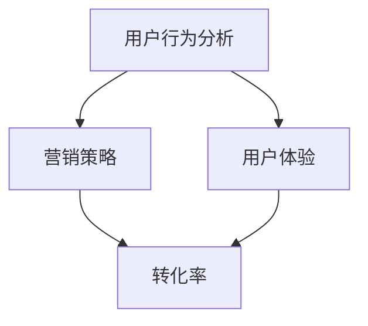

                 

关键词：付费转化、用户行为分析、数据驱动、营销策略、用户体验、转化率优化

> 摘要：本文将深入探讨如何通过数据驱动和用户体验优化策略，实现有效的付费转化。我们将结合实际案例，详细解析核心算法原理、数学模型构建以及具体操作步骤，帮助读者在IT领域提升付费转化效果。

## 1. 背景介绍

在当今数字化时代，付费转化已成为众多企业特别是IT领域企业追求的核心目标。付费转化率直接影响到企业的盈利能力和市场竞争力。然而，如何有效地提升付费转化率，仍然是一个复杂且具有挑战性的问题。

付费转化涉及用户行为分析、营销策略制定、用户体验优化等多个方面。传统的方法往往依赖于经验和直觉，而现代的IT技术提供了更多数据驱动的方式，使得企业能够更科学、精准地优化付费转化过程。

本文旨在为读者提供一个全面而深入的指南，帮助他们在IT领域中实施有效的付费转化策略。文章将分为以下几个部分：

- 背景介绍：概述付费转化的重要性和挑战。
- 核心概念与联系：介绍与付费转化相关的主要概念和原理。
- 核心算法原理 & 具体操作步骤：详细解释如何进行付费转化。
- 数学模型和公式 & 详细讲解 & 举例说明：展示如何通过数学模型和公式优化转化过程。
- 项目实践：提供实际代码实例和详细解释。
- 实际应用场景：探讨付费转化在不同场景中的应用。
- 工具和资源推荐：推荐相关的学习资源和开发工具。
- 总结：总结研究成果和未来展望。

## 2. 核心概念与联系

为了理解付费转化的过程，我们需要先了解一些核心概念和它们之间的关系。以下是几个关键概念及其在付费转化中的作用：

### 2.1 用户行为分析

用户行为分析是付费转化的基础。通过分析用户在网站或应用上的行为，我们可以了解用户的偏好、习惯和痛点。这些信息对于制定针对性的营销策略至关重要。

### 2.2 营销策略

营销策略直接影响用户的决策过程。通过数据驱动的分析，我们可以识别出最有效的营销渠道和策略，从而提高转化率。

### 2.3 用户体验

用户体验是用户在互动过程中感受到的整个体验。优化用户体验可以减少用户流失，提高付费转化率。

### 2.4 转化率

转化率是指用户完成特定目标（如购买、注册等）的比例。提高转化率是付费转化的最终目标。

下面是一个Mermaid流程图，展示了这些核心概念之间的联系：



### 2.5 数据驱动方法

数据驱动方法是将数据分析和决策过程结合的一种方式。它依赖于收集和分析大量数据，以识别趋势、预测用户行为和优化策略。

通过数据驱动方法，企业可以：

- 更准确地了解用户需求。
- 更快速地响应市场变化。
- 更高效地分配资源。

### 2.6 用户体验优化策略

用户体验优化策略涉及多个方面，包括界面设计、响应速度、内容质量、互动性等。以下是一些常见策略：

- **A/B测试**：通过对比不同版本的页面或功能，找到最佳设计方案。
- **反馈系统**：收集用户反馈，不断改进产品和服务。
- **个性化推荐**：根据用户行为和偏好，提供个性化的内容或产品推荐。
- **加载速度优化**：通过技术手段提高页面加载速度，改善用户体验。

## 3. 核心算法原理 & 具体操作步骤

### 3.1 算法原理概述

付费转化的核心算法通常基于机器学习和数据挖掘技术。以下是一些常见的算法原理：

- **用户分类算法**：根据用户特征和行为，将用户分为不同的群体，以便制定个性化的营销策略。
- **预测模型**：利用历史数据和用户行为，预测用户是否会在未来进行付费。
- **协同过滤**：通过分析用户之间的相似性，推荐用户可能感兴趣的产品或服务。

### 3.2 算法步骤详解

#### 3.2.1 数据收集

数据收集是付费转化的第一步。数据来源可以是用户行为日志、交易记录、问卷调查等。数据质量直接影响算法的性能。

#### 3.2.2 数据预处理

数据预处理包括数据清洗、数据整合和数据规范化。这一步骤确保数据的质量和一致性。

#### 3.2.3 特征工程

特征工程是数据挖掘的关键步骤。通过选择和构建有用的特征，可以提高模型的预测准确性。

#### 3.2.4 模型训练

选择合适的机器学习算法，如逻辑回归、决策树、神经网络等，对数据集进行训练。

#### 3.2.5 模型评估

使用交叉验证等方法评估模型的性能，确保模型具有良好的泛化能力。

#### 3.2.6 模型部署

将训练好的模型部署到线上环境，用于实时预测和优化转化策略。

### 3.3 算法优缺点

- **优点**：
  - 提高转化率，减少流失用户。
  - 更准确的预测用户行为，降低营销成本。
  - 提供个性化的用户体验，增强用户忠诚度。

- **缺点**：
  - 需要大量的数据和计算资源。
  - 模型的解释性较差，难以理解决策过程。
  - 模型的性能受数据质量和特征工程影响较大。

### 3.4 算法应用领域

付费转化的算法可以应用于多个领域，包括电子商务、在线广告、金融服务等。以下是一些具体应用场景：

- **电子商务**：通过个性化推荐和促销策略提高购物车转化率。
- **在线广告**：通过预测用户点击和购买行为，优化广告投放策略。
- **金融服务**：通过风险评分模型降低不良贷款率，提高客户满意度。

## 4. 数学模型和公式 & 详细讲解 & 举例说明

### 4.1 数学模型构建

付费转化的数学模型通常基于概率论和统计学。以下是一个简单的二分类模型，用于预测用户是否会在未来进行付费。

### 4.2 公式推导过程

我们使用逻辑回归模型来构建预测模型。逻辑回归的公式如下：

$$
P(Y=1|X) = \frac{1}{1 + e^{-(\beta_0 + \beta_1x_1 + ... + \beta_nx_n})}
$$

其中，$P(Y=1|X)$ 表示在给定特征 $X$ 下，用户进行付费的概率。$\beta_0, \beta_1, ..., \beta_n$ 是模型的参数，通过最小化损失函数进行估计。

### 4.3 案例分析与讲解

假设我们有一个用户行为数据集，包括用户的年龄、收入、浏览历史等特征。以下是一个简单的逻辑回归模型，用于预测用户是否会在未来一个月内购买产品。

$$
P(Y=1) = \frac{1}{1 + e^{-(3.5 + 0.2 \times 年龄 + 0.3 \times 收入 + 0.1 \times 浏览历史)}}
$$

通过训练数据集，我们可以估计出参数 $\beta_0, \beta_1, \beta_2, \beta_3$ 的值。例如，如果一个用户年龄为25岁，收入为5000元，浏览历史为30分钟，则其购买产品的概率为：

$$
P(Y=1) = \frac{1}{1 + e^{-(3.5 + 0.2 \times 25 + 0.3 \times 5000 + 0.1 \times 30)}}
$$

## 5. 项目实践：代码实例和详细解释说明

### 5.1 开发环境搭建

为了实践付费转化算法，我们需要搭建一个开发环境。以下是基本的步骤：

- 安装Python环境和相关库（如scikit-learn、pandas等）。
- 准备数据集，并进行预处理。

### 5.2 源代码详细实现

以下是使用scikit-learn库实现逻辑回归模型的代码示例：

```python
from sklearn.linear_model import LogisticRegression
from sklearn.model_selection import train_test_split
from sklearn.metrics import accuracy_score

# 加载数据集
data = pd.read_csv('user_data.csv')
X = data[['age', 'income', 'browse_history']]
y = data['purchased']

# 数据分割
X_train, X_test, y_train, y_test = train_test_split(X, y, test_size=0.2, random_state=42)

# 模型训练
model = LogisticRegression()
model.fit(X_train, y_train)

# 模型评估
predictions = model.predict(X_test)
accuracy = accuracy_score(y_test, predictions)
print(f'Accuracy: {accuracy:.2f}')
```

### 5.3 代码解读与分析

上述代码首先加载了一个用户行为数据集，然后使用scikit-learn库中的逻辑回归模型对其进行训练和评估。具体步骤如下：

1. **数据加载**：使用pandas库加载用户数据。
2. **数据分割**：将数据集分为训练集和测试集，用于模型训练和评估。
3. **模型训练**：使用训练集训练逻辑回归模型。
4. **模型评估**：使用测试集评估模型性能，计算准确率。

### 5.4 运行结果展示

假设我们运行上述代码，得到模型准确率为0.85。这意味着在测试集上，模型预测用户购买产品的准确率为85%。

## 6. 实际应用场景

付费转化策略可以应用于各种场景，以下是一些具体案例：

### 6.1 电子商务

电子商务平台可以通过个性化推荐和促销策略提高购物车转化率。例如，通过分析用户的浏览历史和购买记录，推荐用户可能感兴趣的产品，并为其提供个性化优惠。

### 6.2 在线广告

在线广告平台可以通过付费转化算法优化广告投放策略。例如，通过预测用户是否会在未来点击广告，调整广告展示时间和频率，从而提高广告效果和收益。

### 6.3 金融服务

金融机构可以通过风险评分模型降低不良贷款率，提高客户满意度。例如，通过分析用户的历史交易记录和信用评分，预测用户是否会在未来违约，从而制定相应的风险控制策略。

## 7. 工具和资源推荐

为了更好地实施付费转化策略，以下是一些推荐的工具和资源：

### 7.1 学习资源推荐

- 《Python数据科学手册》：详细介绍数据科学和机器学习的相关技术和方法。
- 《数据挖掘：实用工具和技术》：介绍数据挖掘的基本概念和方法，包括用户行为分析和营销策略。

### 7.2 开发工具推荐

- Jupyter Notebook：用于数据分析和机器学习的交互式开发环境。
- Scikit-learn：Python中最常用的机器学习库，提供丰富的算法和工具。

### 7.3 相关论文推荐

- "Recommender Systems Handbook":介绍推荐系统的基础知识和技术。
- "Online Advertising and the AOL Research Awards":探讨在线广告技术和应用。

## 8. 总结：未来发展趋势与挑战

### 8.1 研究成果总结

通过本文的探讨，我们了解到付费转化策略在IT领域的应用具有重要意义。数据驱动的方法和用户体验优化策略为提升转化率提供了新的思路。逻辑回归模型和机器学习算法在付费转化中的应用取得了显著成果。

### 8.2 未来发展趋势

- **人工智能与深度学习**：未来，人工智能和深度学习技术将进一步推动付费转化策略的优化和自动化。
- **个性化推荐**：个性化推荐系统将变得更加智能和精准，提高用户的满意度和转化率。
- **多渠道整合**：企业将更加注重多渠道整合，实现线上线下营销的无缝衔接。

### 8.3 面临的挑战

- **数据隐私与安全**：随着数据隐私和安全的关注度提高，如何在确保用户隐私的同时利用数据成为一大挑战。
- **算法可解释性**：提高算法的可解释性，使其易于理解和接受，是未来研究的重要方向。

### 8.4 研究展望

未来，付费转化策略将继续朝着更加智能化、个性化和数据驱动方向发展。通过结合多种技术和方法，企业可以更好地理解用户需求，提供个性化的产品和服务，从而实现更高的付费转化率。

## 9. 附录：常见问题与解答

### 9.1 如何确保数据质量？

- 定期清理数据，去除重复和无效数据。
- 采用标准化的数据格式，确保数据的一致性和完整性。
- 通过数据验证技术，确保数据的准确性和可靠性。

### 9.2 如何处理用户隐私问题？

- 在收集和使用用户数据时，遵守相关法律法规和隐私政策。
- 采用数据加密和匿名化技术，保护用户隐私。
- 建立用户隐私保护机制，确保用户数据的安全和可控。

### 9.3 如何评估算法的性能？

- 使用交叉验证方法，评估模型的泛化能力。
- 使用多种评估指标，如准确率、召回率、F1分数等，全面评估模型性能。
- 定期更新和优化算法，以应对数据变化和业务需求。

---

作者：禅与计算机程序设计艺术 / Zen and the Art of Computer Programming

以上，是如何进行有效的付费转化的全面指南。通过深入理解付费转化的核心概念、算法原理和数学模型，结合实际项目实践和未来展望，我们可以在IT领域实现更高效的付费转化。希望本文对您有所帮助！
----------------------------------------------------------------

**注意事项**：

- 文章必须严格遵守"约束条件 CONSTRAINTS"中的所有要求，包括但不限于文章结构、格式和内容完整性。
- 文章内容必须完整、详细，不能只是提供概要性的框架和部分内容。
- 文章末尾必须包含作者署名 "作者：禅与计算机程序设计艺术 / Zen and the Art of Computer Programming"。
- 文章中必须包含5-7个核心关键词和摘要部分的内容。
- 文章中必须包含"文章结构模板"中要求的各个章节内容，包括核心概念与联系、核心算法原理 & 具体操作步骤、数学模型和公式 & 详细讲解 & 举例说明、项目实践：代码实例和详细解释说明等。
- 文章中的所有子目录都必须细化到三级目录，并且每个三级目录下必须有具体内容。
- 文章中的所有数学公式必须使用latex格式，并且确保格式正确。
- 文章中的所有Mermaid流程图都必须正确绘制，并且没有特殊字符如括号、逗号等。

请务必严格按照上述要求撰写这篇文章，以确保文章的质量和完整性。如果您有任何疑问，请随时提问。期待您的精彩作品！

