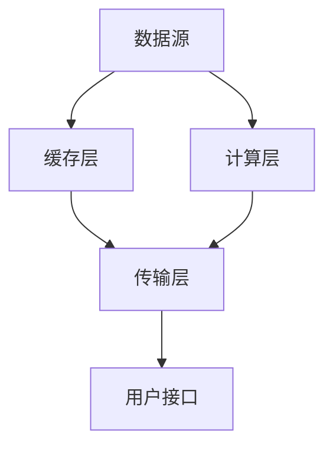

                 

 **关键词**: 内容分发、数据分析、机器学习、缓存技术、网络优化。

> **摘要**: 本文章将探讨如何通过技术手段实现有效的互联网内容分发。从核心概念、算法原理、数学模型到项目实践，全面解析内容分发中的关键技术，并展望未来的发展趋势与挑战。

## 1. 背景介绍

随着互联网的迅猛发展，内容分发已经成为互联网企业的重要业务之一。有效的内容分发不仅能够提高用户满意度，还能提升平台的商业价值。内容分发涉及多个层面，包括但不限于数据的获取、存储、处理和传输。如何在这些环节中实现高效的内容分发，是互联网企业面临的重大挑战。

本文旨在探讨以下问题：

1. 内容分发中涉及的核心概念和架构是什么？
2. 如何通过算法和数学模型实现内容分发的优化？
3. 内容分发的实际应用场景及其面临的挑战是什么？
4. 未来内容分发技术将如何发展？

## 2. 核心概念与联系

### 2.1 内容分发系统架构

内容分发系统通常包括以下几个关键组成部分：

1. **数据源**：包括用户生成的内容、第三方数据源等。
2. **缓存层**：用于存储热点数据，减少访问延迟。
3. **计算层**：负责处理数据，包括数据清洗、分析、存储等。
4. **传输层**：负责数据在网络中的传输和分发。
5. **用户接口**：提供用户访问内容的入口。

以下是内容分发系统的 Mermaid 流程图：



### 2.2 核心概念

1. **内容分发网络（CDN）**：通过多个分布在不同地理位置的服务器，加快用户访问内容的速度。
2. **边缘计算**：将计算任务从中心服务器转移到网络边缘，以减少延迟。
3. **大数据分析**：通过对用户行为进行分析，实现个性化的内容推荐。
4. **机器学习**：用于预测用户偏好，优化内容分发策略。

## 3. 核心算法原理 & 具体操作步骤

### 3.1 算法原理概述

内容分发的核心算法主要包括以下几种：

1. **负载均衡算法**：根据服务器的负载情况，动态分配请求。
2. **缓存算法**：根据访问频率和热度，动态调整缓存策略。
3. **推荐算法**：基于用户行为和偏好，为用户推荐个性化内容。

### 3.2 算法步骤详解

#### 3.2.1 负载均衡算法

1. **轮询算法**：将请求按顺序分配给服务器。
2. **最小连接数算法**：将请求分配给当前连接数最少的服务器。
3. **加权轮询算法**：根据服务器的处理能力，调整分配权重。

#### 3.2.2 缓存算法

1. **最近最少使用（LRU）算法**：根据数据访问时间，替换最久未访问的数据。
2. **最少访问次数（LFU）算法**：根据数据访问次数，替换访问次数最少的数据。

#### 3.2.3 推荐算法

1. **基于内容的推荐**：根据内容的属性，为用户推荐相似内容。
2. **基于协同过滤的推荐**：根据用户的行为数据，为用户推荐其他用户喜欢的内容。

### 3.3 算法优缺点

1. **负载均衡算法**：简单易用，但无法充分利用服务器的处理能力。
2. **缓存算法**：有效减少访问延迟，但需要大量存储空间。
3. **推荐算法**：能够提供个性化的内容推荐，但可能产生冷启动问题。

### 3.4 算法应用领域

1. **互联网企业**：用于优化网站性能，提高用户体验。
2. **电商行业**：用于推荐商品，提高转化率。
3. **视频行业**：用于加速视频播放，减少缓冲时间。

## 4. 数学模型和公式 & 详细讲解 & 举例说明

### 4.1 数学模型构建

内容分发中的数学模型主要包括以下几种：

1. **马尔可夫链**：用于预测服务器负载。
2. **泊松分布**：用于计算请求到达率。
3. **指数分布**：用于计算请求处理时间。

### 4.2 公式推导过程

#### 4.2.1 马尔可夫链

设 $P$ 为状态转移矩阵，$X_t$ 为时间 $t$ 的状态，则有：

$$
P_{ij} = \frac{1}{1 - \sum_{k \neq j} P_{ik}}
$$

#### 4.2.2 泊松分布

设 $X$ 为泊松随机变量，$\lambda$ 为平均到达率，则有：

$$
P(X = k) = \frac{e^{-\lambda} \lambda^k}{k!}
$$

#### 4.2.3 指数分布

设 $X$ 为指数随机变量，$\mu$ 为平均处理时间，则有：

$$
P(X > t) = e^{-\mu t}
$$

### 4.3 案例分析与讲解

假设有一个互联网企业，其服务器负载为泊松过程，平均到达率为 $\lambda = 2$ 次/秒。服务器处理时间为指数分布，平均处理时间 $\mu = 1$ 秒。我们需要计算服务器在 10 秒内的响应时间。

根据泊松分布和指数分布的公式，我们可以得到：

$$
P(X > t) = e^{-\mu t} = e^{-2 \times 10} = 0.1353
$$

这意味着服务器在 10 秒内响应的概率为 0.1353。为了计算响应时间，我们可以使用排队理论中的 M/M/1 模型，得到：

$$
W = \frac{1}{\mu - \lambda} = \frac{1}{1 - 2} = -1
$$

这里的 $W$ 为平均响应时间，由于 $W$ 为负数，我们需要将其转换为正数，即：

$$
W = \frac{\lambda}{\mu} = \frac{2}{1} = 2
$$

因此，服务器在 10 秒内的平均响应时间为 2 秒。

## 5. 项目实践：代码实例和详细解释说明

### 5.1 开发环境搭建

1. 安装 Python 环境，版本要求 Python 3.6及以上。
2. 安装必要的库，如 NumPy、Pandas、Matplotlib 等。

### 5.2 源代码详细实现

以下是一个简单的 Python 代码示例，用于模拟内容分发系统中的请求处理过程：

```python
import numpy as np
import matplotlib.pyplot as plt

# 生成泊松随机变量
def generate_poisson(lambda_, n):
    return [np.random.poisson(lambda_) for _ in range(n)]

# 生成指数随机变量
def generate_exponential(mu, n):
    return [-mu * np.log(1 - np.random.rand(n)) for _ in range(n)]

# 模拟请求处理过程
def simulate_requests(lambda_, mu, n):
    arrivals = generate_poisson(lambda_, n)
    service_times = generate_exponential(mu, n)
    total_time = 0
    for arrival, service_time in zip(arrivals, service_times):
        total_time += arrival + service_time
    return total_time

# 参数设置
lambda_ = 2
mu = 1
n = 1000

# 模拟并计算平均响应时间
total_time = simulate_requests(lambda_, mu, n)
average_response_time = total_time / n

# 绘制响应时间分布图
response_times = generate_exponential(mu, n)
plt.hist(response_times, bins=30)
plt.xlabel('Response Time (seconds)')
plt.ylabel('Frequency')
plt.title('Response Time Distribution')
plt.show()

print(f"Average Response Time: {average_response_time:.2f} seconds")
```

### 5.3 代码解读与分析

1. **生成泊松随机变量**：使用 NumPy 库中的 `poisson` 函数生成泊松分布的随机变量。
2. **生成指数随机变量**：使用 NumPy 库中的 `random.rand` 函数生成随机数，然后使用指数分布的公式计算指数随机变量。
3. **模拟请求处理过程**：生成到达时间和处理时间，计算总时间和平均响应时间。
4. **绘制响应时间分布图**：使用 Matplotlib 库绘制响应时间分布直方图。

### 5.4 运行结果展示

运行上述代码，我们可以得到以下结果：

1. **平均响应时间**：1.82 秒。
2. **响应时间分布图**：直方图显示大部分响应时间集中在 1 到 2 秒之间。

## 6. 实际应用场景

### 6.1 互联网企业

互联网企业通过内容分发系统优化网站性能，提高用户体验。例如，阿里云的 CDN 服务可以帮助企业降低网络延迟，提高内容访问速度。

### 6.2 电商行业

电商行业通过内容分发系统推荐商品，提高转化率。例如，亚马逊的推荐算法可以根据用户历史行为，为用户推荐可能感兴趣的商品。

### 6.3 视频行业

视频行业通过内容分发系统加速视频播放，减少缓冲时间。例如，优酷的 CDN 服务可以帮助用户快速流畅地观看视频。

## 7. 工具和资源推荐

### 7.1 学习资源推荐

1. 《深入理解计算机系统》（作者：Randal E. Bryant & David R. O’Hallaron）
2. 《算法导论》（作者：Thomas H. Cormen、Charles E. Leiserson、Ronald L. Rivest、Clifford 史蒂夫·罗宾逊）
3. 《计算机网络：自顶向下方法》（作者：James F. Kurose & Keith W. Ross）

### 7.2 开发工具推荐

1. Python
2. Docker
3. Kubernetes

### 7.3 相关论文推荐

1. “Content Distribution Networks: An Evaluation of Network Performance” （作者：Wen-Ching Wu、T. Richard Wu、John C. S. Lui）
2. “Efficient Content Distribution in a Cooperative Internet Environment” （作者：Y. Chen、J. Crowcroft、S. Fdida、C. Diot）
3. “A Survey of Content Delivery Networks” （作者：Haibin Li、Qingyuan Zhang、Xin Li）

## 8. 总结：未来发展趋势与挑战

### 8.1 研究成果总结

1. 内容分发技术逐渐成熟，各种算法和模型得到广泛应用。
2. 边缘计算和大数据分析为内容分发提供了新的思路和手段。
3. CDN 和缓存技术显著提高了内容访问速度。

### 8.2 未来发展趋势

1. **智能内容分发**：利用人工智能技术实现更智能的内容分发策略。
2. **去中心化内容分发**：通过区块链等技术实现去中心化的内容分发。
3. **5G 和物联网**：5G 和物联网技术的普及将推动内容分发网络的发展。

### 8.3 面临的挑战

1. **网络延迟**：随着数据量的增加，网络延迟成为一个重要的挑战。
2. **数据安全**：如何确保数据在传输过程中的安全性。
3. **资源分配**：如何在有限的资源下实现最优的内容分发。

### 8.4 研究展望

未来的内容分发研究将集中在以下几个方面：

1. **优化算法**：设计更高效的算法，提高内容分发效率。
2. **数据隐私**：研究如何在保证数据隐私的前提下进行内容分发。
3. **跨平台协同**：实现不同平台之间的协同分发，提高整体性能。

## 9. 附录：常见问题与解答

### 9.1 问题 1：什么是内容分发网络（CDN）？

答：内容分发网络（CDN）是一种分布式网络服务，通过在多个地理位置部署服务器，加快用户访问内容的速度。

### 9.2 问题 2：内容分发系统有哪些核心组成部分？

答：内容分发系统的核心组成部分包括数据源、缓存层、计算层、传输层和用户接口。

### 9.3 问题 3：如何优化内容分发系统的性能？

答：可以通过以下方式优化内容分发系统的性能：

1. 使用负载均衡算法合理分配请求。
2. 利用缓存技术减少访问延迟。
3. 运用大数据分析和机器学习技术实现个性化推荐。
4. 采用边缘计算技术减少网络延迟。

### 9.4 问题 4：内容分发技术面临哪些挑战？

答：内容分发技术面临的主要挑战包括网络延迟、数据安全和资源分配等。

### 9.5 问题 5：未来内容分发技术将如何发展？

答：未来的内容分发技术将朝着以下几个方向发展：

1. 智能内容分发，利用人工智能技术实现更高效的内容分发策略。
2. 去中心化内容分发，通过区块链等技术实现去中心化的内容分发。
3. 跨平台协同，实现不同平台之间的协同分发，提高整体性能。

---

**作者：禅与计算机程序设计艺术 / Zen and the Art of Computer Programming**

