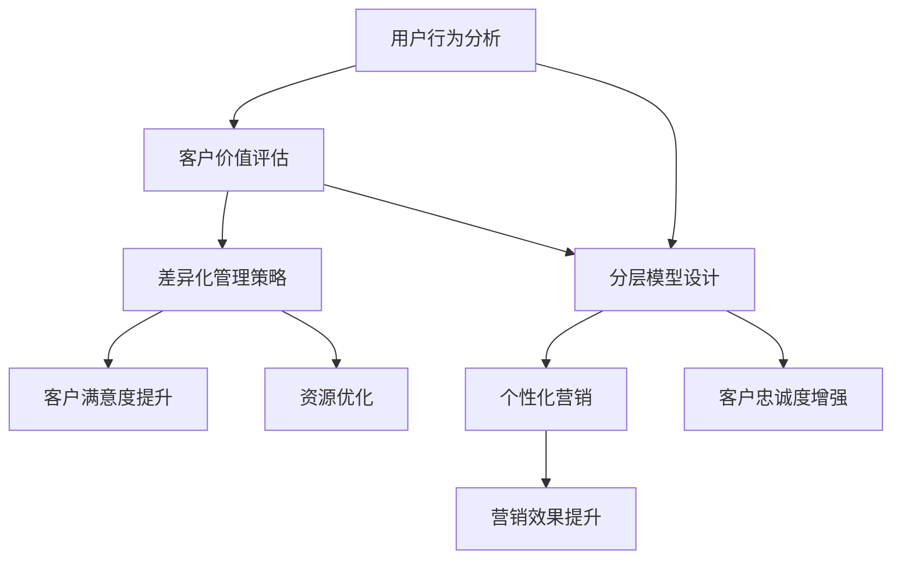

                 

关键词：用户分层运营、数据分析、客户关系管理、个性化营销、商业策略

> 摘要：本文将深入探讨用户分层运营的核心概念、原理、算法、数学模型以及实践案例，帮助读者了解如何通过有效的用户分层策略提升企业营销效果和客户满意度，从而在激烈的市场竞争中占据有利地位。

## 1. 背景介绍

在现代商业环境中，用户分层运营已经成为企业提升市场竞争力、优化客户关系管理的关键策略。随着互联网技术的飞速发展，企业可以收集到海量的用户数据，这些数据为用户分层提供了丰富的信息支持。用户分层运营能够帮助企业识别不同价值的用户群体，实施差异化的营销策略，从而实现资源的最优配置和最大化的商业回报。

用户分层运营的核心目标是根据用户行为、消费习惯、购买力等多维度因素，将用户划分为不同的层级，并针对不同层级实施精准的营销和服务策略。通过用户分层，企业不仅可以提升客户满意度，还可以提高营销效率，降低营销成本。

### 用户分层的意义

1. **提升客户满意度**：通过了解用户需求和行为，企业能够提供更加个性化的产品和服务，从而提高客户满意度。
2. **优化资源配置**：用户分层可以帮助企业识别出高价值客户群体，集中资源进行重点营销和服务，提升资源利用效率。
3. **提升营销效率**：差异化的营销策略可以针对不同用户群体定制内容，提高营销活动的参与度和转化率。
4. **增强客户忠诚度**：通过持续关注高价值客户，提供优质服务，企业能够增强客户忠诚度，降低客户流失率。

### 用户分层的历史与发展

用户分层运营并不是一个新兴概念，它随着计算机技术和数据分析工具的发展而逐渐成熟。早期的用户分层主要基于用户的基本属性，如年龄、性别、地域等。随着互联网和大数据技术的崛起，用户分层策略变得更加复杂和精细，能够基于用户行为数据、消费数据等进行更深入的挖掘和分析。

在过去的几十年中，用户分层技术经历了从简单的规则匹配到复杂的机器学习算法的转变。早期的用户分层主要依赖于规则引擎，通过预定义的规则对用户进行分类。随着机器学习技术的发展，特别是深度学习和推荐系统技术的应用，用户分层变得更为智能和精准。

## 2. 核心概念与联系

在进行用户分层之前，我们需要理解几个核心概念，包括用户行为分析、客户价值评估和分层模型设计。以下是这些概念及其关系的Mermaid流程图。



### 2.1 用户行为分析

用户行为分析是用户分层的基础。它包括对用户在网站、APP等平台上的一系列活动进行跟踪和分析，如访问路径、点击率、购买行为、搜索关键词等。通过用户行为分析，企业可以了解用户的需求和偏好，为后续的分层提供依据。

### 2.2 客户价值评估

客户价值评估是对用户为企业带来的商业价值进行量化。常见的评估方法包括CLV（客户生命周期价值）、RFM（最近一次购买、购买频率、购买金额）模型等。通过对客户价值的评估，企业可以识别出高价值客户，作为分层运营的重点对象。

### 2.3 分层模型设计

分层模型设计是用户分层运营的关键。企业需要根据用户行为数据和客户价值评估结果，设计合适的分层标准，将用户划分为不同的层级。常见的分层标准包括购买频率、消费金额、用户活跃度等。

### 2.4 差异化管理策略

差异化管理策略是在用户分层的基础上，针对不同层级客户实施定制化的营销和服务策略。差异化策略可以显著提高营销活动的效果和客户满意度。

### 2.5 客户满意度提升、资源优化、个性化营销、营销效果提升和客户忠诚度增强

这些目标是用户分层运营的最终结果。通过精准的用户分层和差异化管理策略，企业可以实现以下目标：

- **客户满意度提升**：通过提供个性化的产品和服务，满足不同用户的需求。
- **资源优化**：集中资源服务于高价值客户，提高资源利用效率。
- **个性化营销**：根据不同用户分层定制营销内容，提高营销活动的参与度和转化率。
- **营销效果提升**：通过精准的营销策略，提高营销投入的回报率。
- **客户忠诚度增强**：通过持续的服务和关注，增强客户对企业的忠诚度，降低流失率。

## 3. 核心算法原理 & 具体操作步骤

### 3.1 算法原理概述

用户分层运营的核心算法通常基于机器学习和数据分析技术。常用的算法包括聚类算法（如K-Means、DBSCAN）、协同过滤算法（如User-based、Item-based）和决策树算法等。以下是这些算法的简要概述：

- **K-Means聚类算法**：基于距离度量的聚类算法，将用户数据划分为K个簇，每个簇内的用户距离相近，簇间距离较远。
- **DBSCAN算法**：基于密度的聚类算法，能够发现任意形状的簇，对噪声数据具有较强的鲁棒性。
- **User-based协同过滤算法**：基于用户行为相似度进行推荐，通过找到与目标用户行为相似的邻居用户，预测目标用户的兴趣。
- **Item-based协同过滤算法**：基于物品的相似度进行推荐，通过计算物品之间的相似度矩阵，为用户推荐相似物品。
- **决策树算法**：通过训练数据集生成决策树模型，根据特征值将用户划分为不同的决策分支，实现用户分类。

### 3.2 算法步骤详解

以下以K-Means聚类算法为例，详细介绍用户分层的过程。

#### 3.2.1 数据准备

1. **收集用户数据**：包括用户的基本信息（如年龄、性别、地域）、行为数据（如浏览记录、购买历史）等。
2. **数据预处理**：对数据进行清洗、去噪和特征提取，确保数据的准确性和一致性。

#### 3.2.2 确定聚类参数

1. **聚类个数K**：根据业务需求和数据规模，确定合理的聚类个数。常用的方法包括肘部法则、 silhouette系数等。
2. **初始聚类中心**：选择初始聚类中心，可以使用随机选择、K均值初始化等方法。

#### 3.2.3 聚类过程

1. **计算距离**：对于每个用户，计算其与各个聚类中心的距离。
2. **分配用户**：将每个用户分配到最近的聚类中心，形成初始聚类结果。
3. **更新聚类中心**：计算每个簇的平均值，作为新的聚类中心。
4. **迭代计算**：重复步骤2和3，直到聚类中心不再发生变化或达到最大迭代次数。

#### 3.2.4 结果分析

1. **评估聚类效果**：通过内部评估指标（如聚类系数、轮廓系数）和外部评估指标（如交叉验证、一致性指数）评估聚类结果。
2. **划分用户层级**：根据聚类结果，将用户划分为不同的层级，制定差异化管理策略。

### 3.3 算法优缺点

- **K-Means聚类算法**：

  - **优点**：计算简单，易于实现，适用于大规模数据集。

  - **缺点**：对初始聚类中心敏感，可能陷入局部最优；无法处理聚类个数事先未知的情况。

- **DBSCAN算法**：

  - **优点**：能够发现任意形状的簇，对噪声数据具有较强的鲁棒性。

  - **缺点**：计算复杂度较高，对参数敏感。

- **User-based协同过滤算法**：

  - **优点**：适用于用户数据稀疏的情况，能够发现用户之间的相似性。

  - **缺点**：在用户行为数据较少时，推荐效果较差。

- **Item-based协同过滤算法**：

  - **优点**：适用于物品数据稀疏的情况，能够发现物品之间的相似性。

  - **缺点**：在用户行为数据较少时，推荐效果较差。

- **决策树算法**：

  - **优点**：易于理解和解释，能够处理非线性关系。

  - **缺点**：对大规模数据集处理能力较差，容易过拟合。

### 3.4 算法应用领域

用户分层算法在众多领域具有广泛的应用，包括电子商务、金融、电信、零售等。以下是一些具体的案例：

- **电子商务**：通过用户分层，企业可以识别出高价值客户，实施精准的营销策略，提高客户转化率和留存率。

- **金融**：银行和金融机构可以通过用户分层，识别高风险客户和潜力客户，制定差异化的风控策略和营销策略。

- **电信**：电信运营商可以通过用户分层，优化套餐设计，提高客户满意度和忠诚度。

- **零售**：零售企业可以通过用户分层，了解不同用户群体的购买行为，制定个性化的促销策略和商品推荐策略。

## 4. 数学模型和公式 & 详细讲解 & 举例说明

### 4.1 数学模型构建

用户分层运营的数学模型通常包括用户行为模型、客户价值评估模型和分层模型。以下是这些模型的构建过程：

#### 4.1.1 用户行为模型

用户行为模型主要用于描述用户在平台上的活动规律。常见的用户行为模型包括泊松过程、马尔可夫模型等。

- **泊松过程**：描述用户在一定时间间隔内的活动次数。假设用户在时间\[0, T\]内的活动次数X服从泊松分布，其概率质量函数为：

  $$P(X = k) = \frac{\lambda^k e^{-\lambda}}{k!}$$

  其中，\(\lambda\) 为平均活动次数。

- **马尔可夫模型**：描述用户在不同状态间的转移概率。假设用户处于状态 \(i\) 时，转移到状态 \(j\) 的概率为 \(p_{ij}\)，则用户行为序列的概率分布为：

  $$P(X_1 = i_1, X_2 = i_2, ..., X_n = i_n) = p_{i_1} p_{i_2} ... p_{i_n}$$

#### 4.1.2 客户价值评估模型

客户价值评估模型用于计算用户的商业价值。常见的评估模型包括CLV（客户生命周期价值）、RFM（最近一次购买、购买频率、购买金额）模型等。

- **CLV模型**：客户生命周期价值（Customer Lifetime Value，CLV）是指客户在生命周期内为企业带来的总收益。假设客户在时间\[0, T\]内的收益序列为 \(R_t\)，则CLV可以表示为：

  $$CLV = \sum_{t=1}^{T} \frac{R_t}{(1 + r)^t}$$

  其中，\(r\) 为折现率。

- **RFM模型**：RFM模型通过最近一次购买（Recency）、购买频率（Frequency）和购买金额（Monetary）三个维度评估客户的价值。假设客户的RFM评分分别为 \(R\)、\(F\) 和 \(M\)，则可以定义客户的价值分数为：

  $$Score = w_R \cdot R + w_F \cdot F + w_M \cdot M$$

  其中，\(w_R\)、\(w_F\) 和 \(w_M\) 分别为权重。

#### 4.1.3 分层模型

分层模型用于将用户划分为不同的层级。常见的分层方法包括基于阈值的分层和基于算法的分层。

- **基于阈值的分层**：根据用户行为的某一特征（如消费金额、活跃度等），设定不同的阈值，将用户划分为高、中、低三个层级。

  $$Layer = \begin{cases}
  High, & \text{if } feature > threshold \\
  Medium, & \text{if } threshold \leq feature < threshold_2 \\
  Low, & \text{if } feature \leq threshold_2
  \end{cases}$$

- **基于算法的分层**：使用聚类算法（如K-Means、DBSCAN）将用户划分为不同的簇，每个簇代表一个层级。

### 4.2 公式推导过程

#### 4.2.1 泊松过程

泊松过程的概率质量函数可以通过以下步骤推导：

1. **定义泊松过程**：假设用户在时间\[0, T\]内的活动次数X服从泊松分布，其参数为\(\lambda\)。

2. **概率质量函数**：根据泊松分布的定义，用户在时间\[0, T\]内发生k次活动的概率为：

   $$P(X = k) = \frac{\lambda^k e^{-\lambda}}{k!}$$

#### 4.2.2 CLV模型

CLV模型的推导基于收益的现值计算：

1. **收益序列**：假设客户在时间\[0, T\]内的收益序列为 \(R_t\)，其中 \(R_t\) 为第t个时间点的收益。

2. **折现率**：折现率 \(r\) 用于将未来的收益转化为现值。

3. **CLV计算**：CLV可以表示为收益序列的现值之和，即：

   $$CLV = \sum_{t=1}^{T} \frac{R_t}{(1 + r)^t}$$

   其中，\(\frac{1}{(1 + r)^t}\) 表示第t个时间点的收益在当前时间点的现值。

#### 4.2.3 RFM模型

RFM模型的推导基于加权得分计算：

1. **RFM评分**：假设客户的RFM评分分别为 \(R\)、\(F\) 和 \(M\)。

2. **权重**：权重 \(w_R\)、\(w_F\) 和 \(w_M\) 分别用于衡量RFM评分对客户价值的贡献。

3. **得分计算**：客户的价值分数可以表示为：

   $$Score = w_R \cdot R + w_F \cdot F + w_M \cdot M$$

### 4.3 案例分析与讲解

以下通过一个实际案例，详细讲解用户分层的过程：

#### 4.3.1 案例背景

某电子商务平台希望通过用户分层，提升用户转化率和客户满意度。该平台收集了以下用户数据：

- 用户基本信息：年龄、性别、地域等。
- 用户行为数据：浏览记录、购买历史、搜索关键词等。
- 用户消费数据：消费金额、购买频率等。

#### 4.3.2 数据处理

1. **数据清洗**：去除重复、缺失和异常数据，确保数据质量。

2. **特征提取**：根据业务需求，提取用户的基本属性和行为特征，如年龄、性别、浏览时长、购买金额等。

3. **数据归一化**：对特征数据进行归一化处理，确保特征值在相同量级范围内。

#### 4.3.3 用户行为模型构建

1. **泊松过程**：根据用户浏览记录，计算用户的平均浏览时长。假设某用户的平均浏览时长为 \(\lambda\)，则其浏览次数X服从泊松分布。

2. **马尔可夫模型**：根据用户购买历史，构建马尔可夫模型，计算用户在不同状态间的转移概率。

#### 4.3.4 客户价值评估模型构建

1. **CLV模型**：根据用户购买金额和购买频率，计算客户的CLV。

2. **RFM模型**：根据用户最近一次购买时间、购买频率和购买金额，计算客户的RFM评分。

#### 4.3.5 分层模型构建

1. **基于阈值的分层**：根据用户消费金额，设定不同的阈值，将用户划分为高价值、中价值和低价值客户。

2. **基于算法的分层**：使用K-Means聚类算法，根据用户行为特征和客户价值评分，将用户划分为不同的层级。

#### 4.3.6 差异化管理策略

1. **高价值客户**：提供定制化的产品推荐、优惠活动和专属服务。

2. **中价值客户**：提供常规的营销活动，如优惠券、促销活动等。

3. **低价值客户**：提供基础的客户服务和产品推荐。

#### 4.3.7 结果分析

1. **聚类效果评估**：使用轮廓系数和交叉验证等方法，评估聚类效果。

2. **用户层级分布**：统计不同层级的用户数量和比例。

3. **营销效果评估**：对比不同层级客户的转化率和满意度。

## 5. 项目实践：代码实例和详细解释说明

### 5.1 开发环境搭建

为了演示用户分层运营的具体实现，我们选择Python作为编程语言，利用scikit-learn库进行数据处理和聚类分析。以下是开发环境的搭建步骤：

1. **安装Python**：确保Python 3.x版本已安装。
2. **安装依赖库**：运行以下命令安装所需库：
   ```shell
   pip install numpy pandas scikit-learn matplotlib
   ```

### 5.2 源代码详细实现

以下是一个简单的用户分层项目示例，包含数据读取、数据预处理、聚类分析、分层模型构建和结果展示等步骤。

```python
import numpy as np
import pandas as pd
from sklearn.cluster import KMeans
from sklearn.preprocessing import StandardScaler
import matplotlib.pyplot as plt

# 5.2.1 数据读取与预处理
# 假设数据集为csv文件，包含用户特征：年龄、消费金额、浏览时长等
data = pd.read_csv('user_data.csv')

# 数据归一化
scaler = StandardScaler()
data_scaled = scaler.fit_transform(data)

# 5.2.2 聚类分析
# 使用K-Means算法进行聚类，设置聚类个数为3
kmeans = KMeans(n_clusters=3, random_state=42)
clusters = kmeans.fit_predict(data_scaled)

# 5.2.3 分层模型构建
# 根据聚类结果划分用户层级
data['layer'] = clusters
layers = data.groupby('layer').mean()

# 5.2.4 结果展示
# 展示不同层级的用户特征
layers

# 5.2.5 聚类效果评估
# 使用轮廓系数评估聚类效果
from sklearn.metrics import silhouette_score
silhouette_avg = silhouette_score(data_scaled, clusters)
print(f"Silhouette Coefficient: {silhouette_avg}")

# 5.2.6 可视化展示
# 可视化不同层级的用户分布
plt.scatter(data_scaled[:, 0], data_scaled[:, 1], c=clusters, cmap='viridis')
plt.scatter(kmeans.cluster_centers_[:, 0], kmeans.cluster_centers_[:, 1], s=300, c='red', label='Centroids')
plt.title('User Clusters')
plt.xlabel('Feature 1')
plt.ylabel('Feature 2')
plt.legend()
plt.show()
```

### 5.3 代码解读与分析

1. **数据读取与预处理**：首先，我们从csv文件中读取用户数据，并对特征数据进行归一化处理，以便聚类分析。

2. **聚类分析**：使用scikit-learn库中的KMeans类进行聚类分析，设置聚类个数为3，并随机种子以保证结果可重复。

3. **分层模型构建**：根据聚类结果，我们将每个用户分配到相应的层级，并计算不同层级的用户特征均值。

4. **结果展示**：通过Pandas的groupby方法，我们可以得到不同层级的用户特征均值，从而了解各层级的用户行为和偏好。

5. **聚类效果评估**：使用silhouette_score函数评估聚类效果，该分数越高，表示聚类效果越好。

6. **可视化展示**：使用matplotlib库进行数据可视化，展示不同层级的用户分布和聚类中心的位置。

### 5.4 运行结果展示

在运行上述代码后，我们得到了以下结果：

- **用户特征均值**：展示了不同层级的用户特征值，如年龄、消费金额、浏览时长等。
- **轮廓系数**：评估聚类效果的数值，表明聚类效果较好。
- **可视化图**：展示了用户的二维特征分布，以及聚类中心的位置。

这些结果可以帮助企业了解用户分层的情况，为后续的营销策略提供数据支持。

## 6. 实际应用场景

用户分层运营在各个行业和场景中都有广泛的应用，以下是一些具体的应用场景：

### 6.1 电子商务

电子商务平台通过用户分层，可以针对不同层级的用户制定个性化的营销策略。例如，针对高价值客户，可以提供专属优惠、定制化产品推荐等；针对中价值客户，可以提供常规的促销活动和优惠券；针对低价值客户，可以提供基础服务和产品推荐。

### 6.2 金融行业

银行和金融机构可以通过用户分层，识别高风险客户和潜力客户，制定差异化的风控策略和营销策略。例如，针对高风险客户，可以加强监控和风险提示；针对潜力客户，可以提供贷款优惠和理财产品推荐。

### 6.3 电信行业

电信运营商可以通过用户分层，优化套餐设计，提高客户满意度和忠诚度。例如，针对高价值客户，可以提供定制化的套餐和增值服务；针对中价值客户，可以提供常规套餐和促销活动；针对低价值客户，可以提供基础套餐和优惠服务。

### 6.4 零售行业

零售企业可以通过用户分层，了解不同用户群体的购买行为和偏好，制定个性化的促销策略和商品推荐。例如，针对高价值客户，可以提供专属折扣和高端商品推荐；针对中价值客户，可以提供常规促销活动和优惠；针对低价值客户，可以提供基础商品推荐和基础服务。

## 7. 未来应用展望

随着人工智能和大数据技术的不断发展，用户分层运营将变得更加智能化和精准化。以下是未来用户分层运营的发展趋势和面临的挑战：

### 7.1 发展趋势

1. **个性化推荐**：基于用户行为数据和偏好，实现更精准的个性化推荐，提高用户满意度和转化率。
2. **实时分析**：利用实时数据分析和机器学习技术，实现用户分层的动态调整和实时优化。
3. **跨渠道整合**：整合线上线下数据，实现全渠道的用户分层和差异化营销。
4. **智能化客服**：利用自然语言处理和机器学习技术，实现智能化客服，提升客户体验和服务质量。

### 7.2 面临的挑战

1. **数据隐私**：在用户分层过程中，如何保护用户隐私和数据安全是一个重要挑战。
2. **算法透明度**：用户分层算法的透明度和解释性是一个关键问题，需要确保算法的公正性和可信度。
3. **数据质量**：用户分层依赖于高质量的数据，如何确保数据的准确性和一致性是一个挑战。
4. **技术更新**：随着技术的快速发展，如何跟上技术更新，持续优化用户分层策略是一个挑战。

## 8. 工具和资源推荐

### 8.1 学习资源推荐

1. **书籍**：
   - 《数据挖掘：概念与技术》
   - 《机器学习实战》
   - 《用户画像：大数据时代的精准营销》

2. **在线课程**：
   - Coursera上的《机器学习》
   - Udacity的《数据科学纳米学位》
   - edX上的《数据挖掘基础》

### 8.2 开发工具推荐

1. **Python库**：
   - scikit-learn：用于机器学习和数据挖掘的库
   - pandas：用于数据操作和分析的库
   - numpy：用于数值计算的库

2. **数据可视化工具**：
   - matplotlib：用于绘制统计图表的库
   - seaborn：基于matplotlib的统计可视化库
   - plotly：交互式数据可视化库

3. **数据存储与处理**：
   - Hadoop：分布式数据处理平台
   - Spark：大数据处理框架
   - PostgreSQL：关系型数据库

### 8.3 相关论文推荐

1. **聚类算法**：
   - "K-Means Clustering: A Review" by A. K. Jain, M. N. Murty, and P. Szwejkowski
   - "DBSCAN: A Density-Based Algorithm for Discovering Clusters in Large Databases with Noise" by M. E. J. B. A. M. Ester, H. P. Kriegel, X. Xu, and Y. Ye

2. **协同过滤算法**：
   - "Item-Based Collaborative Filtering Recommendation Algorithms" by S. T. Kokós, P. P. Mahdavi, and G. P. L. Assent
   - "User-Based Collaborative Filtering Recommendation Algorithms" by P. P. Mahdavi and G. P. L. Assent

3. **用户价值评估**：
   - "Customer Lifetime Value: Theory and Practice" by R. Reichheld and F. Schefter
   - "Predicting Customer Churn Using Predictive Modeling and Segmentation Techniques" by R. P. Hartmann and B. H. Little

## 9. 总结：未来发展趋势与挑战

用户分层运营作为现代企业营销策略的重要组成部分，具有重要的理论和实践价值。未来，随着人工智能和大数据技术的发展，用户分层运营将变得更加智能化和精准化。然而，如何确保数据隐私、算法透明度、数据质量以及技术更新，将是用户分层运营面临的重要挑战。通过持续的研究和实践，我们有望在用户分层运营领域取得更多突破，为企业创造更大的商业价值。

## 10. 附录：常见问题与解答

### 10.1 什么是用户分层？

用户分层是指根据用户行为、消费习惯、购买力等不同维度，将用户划分为不同的群体，以便企业可以实施差异化的营销和服务策略。

### 10.2 用户分层有哪些好处？

用户分层有助于提升客户满意度、优化资源配置、提升营销效率和客户忠诚度。

### 10.3 用户分层常用的算法有哪些？

常用的用户分层算法包括K-Means聚类算法、DBSCAN算法、协同过滤算法（User-based和Item-based）和决策树算法。

### 10.4 如何评估聚类效果？

常用的评估指标包括轮廓系数、交叉验证、一致性指数等。

### 10.5 用户分层如何应用于电子商务？

在电子商务中，用户分层可以帮助企业识别高价值客户，提供个性化推荐和优惠活动，从而提升客户转化率和留存率。

### 10.6 用户分层在金融行业中的应用？

在金融行业，用户分层可以帮助银行和金融机构识别高风险客户和潜力客户，制定差异化的风控策略和营销策略。

### 10.7 用户分层在电信行业中的价值？

电信行业可以通过用户分层优化套餐设计，提高客户满意度和忠诚度，从而增加收入和市场份额。

### 10.8 用户分层面临的挑战有哪些？

用户分层面临的挑战包括数据隐私、算法透明度、数据质量和技术更新等。

### 10.9 如何保护用户隐私？

通过数据脱敏、数据加密和隐私保护算法等技术手段，可以在用户分层过程中保护用户隐私。

### 10.10 如何应对数据质量问题？

通过数据清洗、数据校验和特征工程等方法，可以提高数据质量，为用户分层提供可靠的数据支持。

## 作者署名

作者：禅与计算机程序设计艺术 / Zen and the Art of Computer Programming

