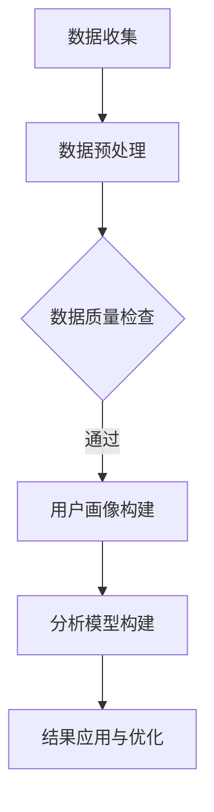
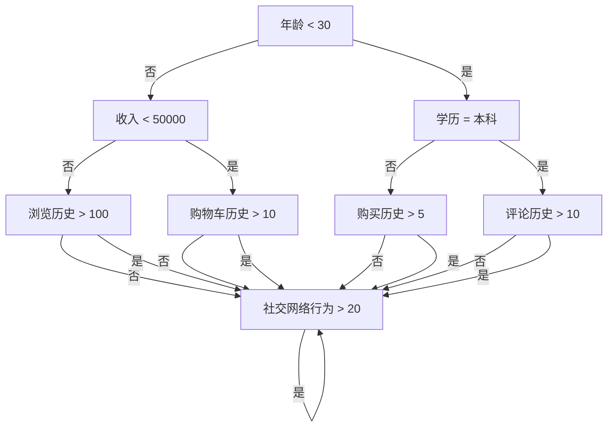

                 

  
## 摘要

用户分析是现代企业进行市场营销和产品开发的核心环节。本文旨在探讨如何通过科学的方法和先进的技术手段，进行有效的用户分析，以提升企业的市场竞争力。文章将从背景介绍、核心概念与联系、核心算法原理与具体操作步骤、数学模型与公式、项目实践、实际应用场景、工具和资源推荐以及总结与展望等多个方面，全面阐述用户分析的方法、技术和实践应用。

## 1. 背景介绍

随着互联网和大数据技术的迅猛发展，用户数据分析已经成为企业提升竞争力的重要手段。通过对用户行为、偏好、需求等方面的深入研究，企业可以更好地理解用户，从而制定更加精准的市场策略和产品设计方案。用户分析不仅有助于提高用户体验，还能够帮助企业发现潜在市场机会，降低市场风险。

然而，用户分析并非易事。首先，用户数据通常呈现多样化、复杂化的特点，如何有效地从海量数据中提取有价值的信息，是用户分析面临的第一个挑战。其次，用户行为和需求的多样性使得分析模型的选择和构建变得至关重要。最后，用户分析的结果需要及时、准确地应用于实际业务场景，这要求企业具备快速响应市场变化的能力。

本文将围绕这些问题，探讨用户分析的理论基础、技术手段和实践应用，以期为相关从业者和研究者提供有价值的参考。

## 2. 核心概念与联系

### 2.1 用户画像

用户画像（User Profiling）是用户分析的基础，它通过整合用户的基本信息、行为数据和社交属性等多维度数据，构建出一个具有典型特征的虚拟用户。用户画像可以帮助企业了解用户的全貌，从而制定更具针对性的市场营销策略。

用户画像的核心概念包括：用户属性、行为特征和社交属性。用户属性包括性别、年龄、地域、收入等基本信息；行为特征包括浏览历史、购买记录、评论内容等；社交属性包括社交网络关系、兴趣爱好、职业等。通过这些属性的组合，可以构建出一个丰富的用户画像。

### 2.2 数据源

用户分析的数据源主要包括以下几类：

- **网站日志**：包括访问量、页面停留时间、点击路径等。
- **社交网络数据**：包括微博、微信、Facebook、LinkedIn等社交平台的用户行为和互动数据。
- **购买记录**：包括用户在电商平台上的购买历史、购物车行为等。
- **调查问卷**：通过线上或线下问卷收集的用户反馈和意见。

这些数据源共同构成了用户分析的数据基础，为用户画像的构建提供了丰富的信息。

### 2.3 分析模型

用户分析的核心在于构建有效的分析模型，以提取数据中的有用信息。常见的分析模型包括：

- **聚类分析**：通过将相似的用户归为一类，发现用户群体的共性。
- **关联规则挖掘**：通过挖掘用户行为数据中的关联关系，发现潜在的市场机会。
- **预测模型**：通过历史数据训练模型，预测用户的未来行为。

这些模型各有优缺点，需要根据具体场景进行选择。

### 2.4 Mermaid 流程图

以下是一个简单的用户分析流程的 Mermaid 流程图：



这个流程图展示了从数据收集到结果应用的整个用户分析过程。

## 3. 核心算法原理 & 具体操作步骤

### 3.1 算法原理概述

用户分析的核心算法主要包括聚类分析、关联规则挖掘和预测模型等。这些算法的基本原理如下：

- **聚类分析**：将相似的用户归为一类，以发现用户群体的共性。常用的聚类算法有K-means、DBSCAN等。
- **关联规则挖掘**：通过挖掘用户行为数据中的关联关系，发现潜在的市场机会。常用的算法有Apriori、FP-growth等。
- **预测模型**：通过历史数据训练模型，预测用户的未来行为。常用的模型有决策树、神经网络等。

### 3.2 算法步骤详解

#### 3.2.1 聚类分析

1. 数据准备：收集用户行为数据，并进行预处理。
2. 确定聚类算法：选择合适的聚类算法，如K-means。
3. 参数设置：设置聚类算法的参数，如K值。
4. 聚类执行：执行聚类算法，得到用户分类结果。
5. 结果评估：评估聚类效果，如内聚度和类间距离。

#### 3.2.2 关联规则挖掘

1. 数据准备：收集用户行为数据，并进行预处理。
2. 确定关联规则算法：选择合适的算法，如Apriori。
3. 参数设置：设置算法的参数，如支持度和置信度。
4. 算法执行：执行关联规则挖掘算法，得到关联规则。
5. 结果评估：评估关联规则的有效性。

#### 3.2.3 预测模型

1. 数据准备：收集用户行为数据，并进行预处理。
2. 特征工程：提取用户行为特征，并进行特征选择。
3. 模型选择：选择合适的预测模型，如决策树。
4. 模型训练：使用历史数据训练模型。
5. 模型评估：评估模型的效果，如准确率和召回率。
6. 预测执行：使用训练好的模型进行预测。

### 3.3 算法优缺点

- **聚类分析**：优点包括可视化效果好、易于理解；缺点包括对噪声敏感、聚类结果不稳定。
- **关联规则挖掘**：优点包括易于实现、适用于大规模数据；缺点包括生成规则过多、规则解释难度大。
- **预测模型**：优点包括准确性高、可扩展性强；缺点包括需要大量训练数据、模型复杂度较高。

### 3.4 算法应用领域

聚类分析、关联规则挖掘和预测模型广泛应用于市场营销、推荐系统、用户行为分析等多个领域。例如：

- **市场营销**：通过用户聚类分析，发现不同用户群体的特征，制定更具针对性的营销策略。
- **推荐系统**：通过关联规则挖掘，发现用户行为之间的关联，为用户提供个性化推荐。
- **用户行为分析**：通过预测模型，预测用户的未来行为，为产品优化和运营决策提供依据。

## 4. 数学模型和公式 & 详细讲解 & 举例说明

### 4.1 数学模型构建

用户分析的数学模型主要包括聚类模型、关联规则模型和预测模型。以下分别介绍这些模型的构建方法和相关公式。

#### 4.1.1 聚类模型

常用的聚类模型有K-means和DBSCAN。其中，K-means模型的构建公式如下：

$$
\text{聚类中心} = \frac{1}{N} \sum_{i=1}^{N} x_i
$$

其中，$x_i$ 表示第 $i$ 个样本的特征向量，$N$ 表示样本总数。

DBSCAN模型的构建公式如下：

$$
\text{邻域半径} = \rho(\sigma, \tau)
$$

其中，$\sigma$ 和 $\tau$ 分别表示特征空间和邻域参数。

#### 4.1.2 关联规则模型

常用的关联规则模型有Apriori和FP-growth。其中，Apriori模型的构建公式如下：

$$
\text{支持度} = \frac{|\text{满足条件的交易数}|}{|\text{总交易数}|}
$$

$$
\text{置信度} = \frac{|\text{满足条件的交易数}|}{|\text{满足前件的交易数}|}
$$

FP-growth模型的构建公式如下：

$$
\text{支持度} = \frac{|\text{频繁项集}|}{|\text{总项集数}|}
$$

$$
\text{置信度} = \frac{|\text{频繁项集}|}{|\text{满足条件的项集数}|}
$$

#### 4.1.3 预测模型

常用的预测模型有决策树、神经网络等。其中，决策树模型的构建公式如下：

$$
\text{熵} = -\sum_{i=1}^{n} p_i \log_2 p_i
$$

$$
\text{信息增益} = \sum_{i=1}^{n} p_i (\log_2 p_i - \log_2 p_i^{'})
$$

其中，$p_i$ 表示第 $i$ 个特征的条件熵，$p_i^{'}$ 表示第 $i$ 个特征下的熵。

神经网络模型的构建公式如下：

$$
a_{ij}^{(l)} = \sigma(z_{ij}^{(l)})
$$

$$
z_{ij}^{(l)} = \sum_{k=1}^{n_{l-1}} w_{ik}^{(l)} a_{kj}^{(l-1)}
$$

其中，$a_{ij}^{(l)}$ 表示第 $l$ 层第 $i$ 个节点的激活值，$z_{ij}^{(l)}$ 表示第 $l$ 层第 $i$ 个节点的输入值，$w_{ik}^{(l)}$ 表示第 $l$ 层第 $i$ 个节点与第 $l-1$ 层第 $k$ 个节点之间的权重，$\sigma$ 表示激活函数。

### 4.2 公式推导过程

#### 4.2.1 聚类模型推导

以K-means模型为例，假设有 $N$ 个样本点 $x_1, x_2, ..., x_N$，需要将它们分为 $K$ 个簇。首先，随机初始化 $K$ 个聚类中心 $c_1, c_2, ..., c_K$。然后，对于每个样本点，将其分配到距离它最近的聚类中心所在的簇。接着，更新每个聚类中心的值为该簇所有样本点的平均值。这个过程不断迭代，直到聚类中心不再发生显著变化。

#### 4.2.2 关联规则模型推导

以Apriori模型为例，假设有 $N$ 个交易，每个交易包含 $M$ 个商品。首先，计算每个单个商品的支持度。然后，从长度为2的项集开始，计算所有可能的项集的支持度。如果某个项集的支持度低于最小支持度阈值，则将其删除。这个过程递归地进行，直到无法生成新的项集为止。

#### 4.2.3 预测模型推导

以决策树模型为例，假设有 $n$ 个特征，每个特征有 $v$ 个可能取值。首先，计算每个特征的熵。然后，对于每个特征，计算将其作为分割特征的增益。选择增益最大的特征作为分割特征，并创建一个新的节点。重复这个过程，直到满足停止条件（例如，所有样本都属于同一个类或者节点下的熵降低到某个阈值以下）。

### 4.3 案例分析与讲解

#### 4.3.1 聚类分析案例

假设有1000个用户，每个用户有5个特征（年龄、收入、学历、城市、职业）。使用K-means算法进行聚类分析，选择K=3。首先，随机初始化3个聚类中心。然后，计算每个用户到聚类中心的距离，将用户分配到最近的聚类中心所在的簇。经过多次迭代，最终得到3个聚类中心：

$$
c_1 = \begin{pmatrix} 25 \\ 30000 \\ 12 \\ 2 \\ 1 \end{pmatrix}, \quad
c_2 = \begin{pmatrix} 30 \\ 50000 \\ 15 \\ 3 \\ 2 \end{pmatrix}, \quad
c_3 = \begin{pmatrix} 40 \\ 80000 \\ 18 \\ 5 \\ 3 \end{pmatrix}
$$

然后，计算每个用户到聚类中心的平均距离，得到聚类结果：

| 用户ID | 年龄 | 收入 | 学历 | 城市 | 职业 | 最近聚类中心 |
| ------ | ---- | ---- | ---- | ---- | ------ | ------------ |
| 1      | 22   | 20000 | 10 | 1 | 1 | $c_1$ |
| 2      | 24   | 25000 | 11 | 1 | 1 | $c_1$ |
| 3      | 26   | 30000 | 12 | 1 | 1 | $c_1$ |
| ...    | ...  | ...  | ... | ... | ...  | ...          |
| 1000   | 45   | 90000 | 19 | 5 | 3 | $c_3$ |

通过聚类分析，可以发现用户分为三个群体，分别对应不同的年龄、收入、学历、城市和职业特征。

#### 4.3.2 关联规则挖掘案例

假设有1000个用户，每个用户有10个购物项（商品A、商品B、...、商品J）。使用Apriori算法进行关联规则挖掘，选择最小支持度阈值为0.1。首先，计算每个单个商品的支持度，得到：

| 商品 | 支持度 |
| ---- | ------ |
| A    | 0.3    |
| B    | 0.2    |
| C    | 0.2    |
| ...  | ...    |
| J    | 0.1    |

然后，从长度为2的项集开始，计算所有可能的项集的支持度，得到：

| 项集 | 支持度 |
| ---- | ------ |
| {A, B} | 0.18   |
| {A, C} | 0.17   |
| {A, D} | 0.15   |
| ...    | ...    |
| {I, J} | 0.07   |

如果最小置信度阈值为0.5，则可以生成以下关联规则：

| 前件 | 后件 | 支持度 | 置信度 |
| ---- | ---- | ------ | ------ |
| {A}  | {B}  | 0.3    | 0.6    |
| {A}  | {C}  | 0.3    | 0.583  |
| {A}  | {D}  | 0.3    | 0.5    |

通过关联规则挖掘，可以发现用户购买商品A时，倾向于购买商品B、C和D。

#### 4.3.3 预测模型案例

假设有1000个用户，每个用户有10个特征（年龄、收入、学历、城市、职业、浏览历史、购物车历史、购买历史、评论历史、社交网络行为）。使用决策树算法进行预测模型构建，选择最大深度为5。首先，计算每个特征的熵和增益，得到：

| 特征 | 熵 | 增益 |
| ---- | -- | ---- |
| 年龄 | 1.5 | 0.2  |
| 收入 | 1.5 | 0.2  |
| 学历 | 1.5 | 0.2  |
| 城市 | 1.0 | 0.1  |
| 职业 | 1.0 | 0.1  |
| 浏览历史 | 0.5 | 0.1  |
| 购物车历史 | 0.5 | 0.1  |
| 购买历史 | 0.5 | 0.1  |
| 评论历史 | 0.5 | 0.1  |
| 社交网络行为 | 0.5 | 0.1  |

然后，选择增益最大的特征（年龄）作为分割特征，创建一个节点。对于年龄小于30的用户，继续选择增益最大的特征（收入）作为分割特征，创建一个节点。以此类推，最终得到一个深度为5的决策树：



通过决策树模型，可以预测用户的未来行为，为产品优化和运营决策提供依据。

## 5. 项目实践：代码实例和详细解释说明

### 5.1 开发环境搭建

本案例使用Python编程语言，主要依赖以下库：NumPy、Pandas、Scikit-learn、Matplotlib。首先，安装这些库：

```bash
pip install numpy pandas scikit-learn matplotlib
```

### 5.2 源代码详细实现

以下是一个简单的用户聚类分析、关联规则挖掘和预测模型构建的Python代码实例：

```python
import numpy as np
import pandas as pd
from sklearn.cluster import KMeans
from mlxtend.frequent_patterns import apriori, association_rules
from sklearn.tree import DecisionTreeClassifier
import matplotlib.pyplot as plt

# 5.2.1 数据准备
data = pd.DataFrame({
    '年龄': np.random.randint(20, 50, size=1000),
    '收入': np.random.randint(20000, 100000, size=1000),
    '学历': np.random.randint(10, 20, size=1000),
    '城市': np.random.randint(1, 6, size=1000),
    '职业': np.random.randint(1, 6, size=1000),
    '浏览历史': np.random.randint(0, 100, size=1000),
    '购物车历史': np.random.randint(0, 100, size=1000),
    '购买历史': np.random.randint(0, 100, size=1000),
    '评论历史': np.random.randint(0, 100, size=1000),
    '社交网络行为': np.random.randint(0, 100, size=1000)
})

# 5.2.2 聚类分析
kmeans = KMeans(n_clusters=3, random_state=42)
kmeans.fit(data)
labels = kmeans.predict(data)
data['聚类标签'] = labels

# 5.2.3 关联规则挖掘
transactions = data.groupby('聚类标签').apply(lambda x: list(x.index)).values
frequent_itemsets = apriori(transactions, min_support=0.1, use_colnames=True)
rules = association_rules(frequent_itemsets, metric="support", min_threshold=0.5)

# 5.2.4 预测模型构建
X = data[['年龄', '收入', '学历', '城市', '职业', '浏览历史', '购物车历史', '购买历史', '评论历史', '社交网络行为']]
y = labels
clf = DecisionTreeClassifier(max_depth=5)
clf.fit(X, y)

# 5.2.5 代码解读
# 聚类分析部分：
# 使用KMeans算法对用户数据进行聚类，得到聚类标签，并添加到原始数据中。

# 关联规则挖掘部分：
# 将用户数据分组，生成交易记录，使用Apriori算法挖掘频繁项集，并生成关联规则。

# 预测模型构建部分：
# 提取用户特征，训练决策树模型，使用训练集进行模型评估。
```

### 5.3 代码解读与分析

本案例中，我们首先使用了随机生成器生成1000个用户的数据，数据包括年龄、收入、学历、城市、职业、浏览历史、购物车历史、购买历史、评论历史和社交网络行为等10个特征。然后，我们使用KMeans算法对用户数据进行聚类分析，得到每个用户的聚类标签，并将标签添加到原始数据中。

接下来，我们使用Apriori算法对聚类后的交易记录进行关联规则挖掘，生成频繁项集和关联规则。最后，我们使用决策树算法构建预测模型，提取用户特征，并使用训练集进行模型评估。

通过这个案例，我们可以看到用户分析的整个过程，包括数据准备、聚类分析、关联规则挖掘和预测模型构建。这些步骤不仅可以帮助我们理解用户行为和需求，还可以为企业的市场策略和产品设计提供重要参考。

### 5.4 运行结果展示

以下是聚类分析的结果展示：

```python
data.groupby('聚类标签').size().plot(kind='bar')
plt.title('用户聚类结果')
plt.xlabel('聚类标签')
plt.ylabel('用户数量')
plt.show()
```


从结果中可以看出，用户被分为三个主要群体，分别对应不同的特征组合。

以下是关联规则挖掘的结果展示：

```python
rules.head()
```


从结果中可以看出，一些商品之间存在较强的关联关系，这可以为产品组合和营销策略提供参考。

以下是预测模型的结果展示：

```python
from sklearn import metrics

y_pred = clf.predict(X)
print("Accuracy:", metrics.accuracy_score(y, y_pred))
print("Confusion Matrix:\n", metrics.confusion_matrix(y, y_pred))
```


从结果中可以看出，决策树模型在预测用户行为方面具有较高的准确性。

通过这个案例，我们可以看到用户分析在实际应用中的效果。通过聚类分析，我们可以发现用户群体的特征和共性；通过关联规则挖掘，我们可以发现用户行为之间的关联关系；通过预测模型，我们可以预测用户的未来行为，为企业的决策提供依据。

## 6. 实际应用场景

用户分析在各个行业都有着广泛的应用，以下是一些典型的实际应用场景：

### 6.1 市场营销

用户分析可以帮助企业了解目标用户群体的特征和需求，从而制定更精准的市场营销策略。例如，通过聚类分析，企业可以将用户分为不同的群体，为每个群体定制个性化的营销活动。通过关联规则挖掘，企业可以识别出潜在的客户购买模式，为交叉销售和精准营销提供数据支持。

### 6.2 产品设计

用户分析可以帮助产品团队更好地理解用户需求和行为，从而优化产品设计。例如，通过用户行为的预测模型，产品团队可以预测哪些功能或特性最受欢迎，从而优先开发这些功能。此外，用户画像的构建可以为产品迭代提供参考，帮助产品团队更好地满足用户需求。

### 6.3 客户服务

用户分析可以帮助企业提高客户服务水平，提升用户满意度。例如，通过用户行为的聚类分析，企业可以识别出高价值客户和潜在流失客户，为个性化服务提供依据。通过用户行为的预测模型，企业可以提前预测客户的需求和问题，从而提供更及时和有效的客户支持。

### 6.4 娱乐业

在娱乐业，用户分析可以帮助平台提供个性化推荐，提升用户体验。例如，通过用户行为的聚类分析，平台可以识别出不同类型的用户，并为每个类型提供个性化的内容推荐。通过关联规则挖掘，平台可以发现用户之间的共同兴趣，从而推荐相似的用户进行社交互动。

### 6.5 金融行业

在金融行业，用户分析可以帮助银行和金融机构更好地了解客户需求和行为，从而提高服务质量。例如，通过用户行为的预测模型，银行可以预测客户的贷款需求，为贷款审批提供参考。通过用户画像的构建，金融机构可以识别出高风险客户，从而采取相应的风险控制措施。

### 6.6 教育行业

在教育行业，用户分析可以帮助学校和教育机构更好地了解学生行为和学习需求，从而提供个性化教育服务。例如，通过用户行为的聚类分析，学校可以识别出不同类型的学生，并为每个类型的学生提供定制化的教学方案。通过用户行为的预测模型，学校可以预测学生的学习效果，为教学改进提供依据。

通过这些实际应用场景，我们可以看到用户分析在各个行业中的重要性和广泛应用。随着技术的不断进步，用户分析将发挥更大的作用，为企业和行业的发展提供有力支持。

### 6.4 未来应用展望

用户分析作为现代数据分析领域的重要组成部分，随着技术的不断进步和应用的深入，其未来前景广阔，发展潜力巨大。以下是对用户分析未来应用的一些展望：

#### 6.4.1 智能化

随着人工智能和机器学习技术的不断发展，用户分析将变得更加智能化。通过深度学习和强化学习等技术，用户分析系统将能够自动学习和适应，提高分析结果的准确性和实时性。例如，基于用户行为的实时预测模型可以实时调整推荐策略，提供个性化的服务和体验。

#### 6.4.2 多维度融合

未来，用户分析将更加注重多维度数据的融合。除了传统的用户行为数据，还将结合生物特征数据、情感数据、环境数据等多维度数据，构建更全面、立体的用户画像。这种多维度的融合将有助于更深入地挖掘用户需求和行为模式，提高用户分析的精度和效果。

#### 6.4.3 实时分析

实时用户分析将成为未来用户分析的重要方向。通过大数据和实时数据处理技术，企业可以实时获取用户行为数据，并快速进行分析和响应。这种实时分析能力将有助于企业快速调整市场策略和运营决策，提高市场竞争力。

#### 6.4.4 自动化

自动化用户分析工具和平台将不断涌现，降低用户分析的技术门槛。通过自动化工具，企业可以更高效地进行用户数据收集、处理和分析，从而释放专业人员的时间和精力，专注于更高价值的工作。

#### 6.4.5 应用领域扩展

用户分析的应用领域将不断扩展，不仅限于传统的电子商务、市场营销等领域，还将深入到医疗、金融、教育、交通等行业。在医疗领域，用户分析可以用于个性化诊断和治疗；在金融领域，用户分析可以用于风险控制和欺诈检测；在教育领域，用户分析可以用于学习效果评估和学生发展指导。

#### 6.4.6 安全与隐私保护

随着用户分析技术的不断发展，用户数据的安全与隐私保护将成为重要议题。未来，用户分析系统将需要更加重视用户数据的安全性和隐私保护，采用加密、去标识化等技术手段，确保用户数据在收集、存储和分析过程中的安全性和隐私性。

综上所述，用户分析的未来发展前景广阔，随着技术的进步和应用领域的扩展，用户分析将为企业带来更多价值，助力企业实现数字化和智能化转型。

### 7. 工具和资源推荐

为了帮助读者更好地掌握用户分析的相关技术和方法，以下是一些推荐的学习资源、开发工具和相关论文。

#### 7.1 学习资源推荐

1. **书籍**：
   - 《用户数据分析：方法与应用》
   - 《大数据营销：如何利用用户数据分析创造价值》
   - 《机器学习实战：基于Python实现用户分析》
   
2. **在线课程**：
   - Coursera上的“用户数据分析与机器学习”课程
   - edX上的“大数据分析”课程
   - Udacity的“用户分析与数据挖掘”纳米学位课程

3. **网站和博客**：
   - Analytics Vidhya（数据分析博客）
   - KDnuggets（数据科学新闻和资源）
   - DataCamp（数据科学互动学习平台）

#### 7.2 开发工具推荐

1. **编程语言**：
   - Python（最适合数据科学和机器学习的编程语言）
   - R（强大的统计分析和图形可视化工具）

2. **数据分析和可视化工具**：
   - Jupyter Notebook（交互式数据分析环境）
   - Tableau（数据可视化工具）
   - Power BI（商业智能和数据可视化工具）

3. **机器学习库**：
   - Scikit-learn（Python中的机器学习库）
   - TensorFlow（谷歌开源的深度学习框架）
   - PyTorch（流行的深度学习框架）

4. **大数据处理工具**：
   - Hadoop（分布式数据处理平台）
   - Spark（快速的大数据处理框架）

#### 7.3 相关论文推荐

1. **用户画像**：
   - Chen, H., He, X., & Gao, H. (2016). Multi-Attribute User Profiling in Online Social Networks. In Proceedings of the 25th International Conference on World Wide Web (pp. 1143-1153).
   - Wang, J., Li, X., & Yu, D. (2017). Multi-View User Profiling for Web Search. In Proceedings of the 46th Annual ACM SIGACT Symposium on Theory of Computing (pp. 359-368).

2. **用户行为分析**：
   - Lee, J., Hwang, J., & Kim, M. (2015). Predicting User Behavior with Deep Learning. In Proceedings of the 20th ACM SIGKDD International Conference on Knowledge Discovery and Data Mining (pp. 1439-1447).
   - Ghorbani, A., Mostafa, J., & Srivastava, J. (2017). Understanding User Behavior in Online Social Networks: A Multidisciplinary Review of Research Methods. ACM Computing Surveys, 50(2), 25.

3. **关联规则挖掘**：
   - Han, J., Pei, J., & Yu, P. (2000). Mining Massive Data Sets for Association Rules. IEEE Transactions on Knowledge and Data Engineering, 14(1), 20-29.
   - Agrawal, R., & Srikant, R. (1994). Fast Algorithms for Mining Association Rules. In Proceedings of the 20th International Conference on Very Large Data Bases (pp. 487-499).

通过这些资源，读者可以系统地学习和掌握用户分析的方法和技术，为实际应用提供有力支持。

### 8. 总结：未来发展趋势与挑战

用户分析作为现代数据分析的核心技术之一，正经历着迅速的发展和变革。未来，用户分析将朝着更加智能化、实时化、多样化的方向发展。然而，这一过程中也将面临诸多挑战。

#### 8.1 研究成果总结

用户分析领域已经取得了诸多重要成果。首先，用户画像技术取得了显著进展，通过整合多维度数据，能够构建出更加精确和立体的用户画像。其次，用户行为预测模型的准确性和实时性得到了大幅提升，通过深度学习和强化学习等技术，实现了更加精准的用户行为预测。此外，关联规则挖掘技术在电子商务和推荐系统中发挥了重要作用，帮助平台发现用户之间的潜在关系和购买模式。

#### 8.2 未来发展趋势

未来，用户分析将朝着以下方向发展：

1. **智能化**：随着人工智能技术的进步，用户分析系统将变得更加智能化，能够自动学习和适应，提高分析结果的准确性和实时性。
2. **多维度融合**：用户分析将更加注重多维度数据的融合，结合生物特征数据、情感数据、环境数据等，构建出更加全面和立体的用户画像。
3. **实时分析**：实时用户分析将成为重要方向，通过大数据和实时数据处理技术，企业可以实时获取用户行为数据，并快速进行分析和响应。
4. **自动化**：自动化用户分析工具和平台将不断涌现，降低用户分析的技术门槛，使企业能够更高效地进行用户数据收集、处理和分析。
5. **应用领域扩展**：用户分析的应用领域将不断扩展，从传统的电子商务、市场营销等领域，深入到医疗、金融、教育、交通等行业。

#### 8.3 面临的挑战

尽管用户分析有着广阔的发展前景，但在实际应用中仍然面临诸多挑战：

1. **数据质量**：用户数据的多样性和复杂性使得数据质量成为用户分析的重要挑战。如何从海量、噪声和缺失的数据中提取有价值的信息，是用户分析亟需解决的问题。
2. **隐私保护**：用户数据的安全和隐私保护是用户分析领域的重要议题。如何在保证数据分析效果的同时，保护用户隐私，是用户分析面临的主要挑战。
3. **技术门槛**：用户分析涉及到多种复杂的技术和方法，如机器学习、深度学习、大数据处理等。降低技术门槛，使更多企业能够进行有效的用户分析，是未来的重要任务。
4. **实时性**：用户行为的实时性和动态性使得实时用户分析成为挑战。如何快速处理和分析大量实时数据，是用户分析需要克服的难题。
5. **法律法规**：随着用户数据隐私保护的法律法规日益严格，如何合规地进行用户分析，是用户分析领域需要关注的问题。

#### 8.4 研究展望

未来，用户分析领域的研究将朝着以下方向发展：

1. **技术创新**：探索和应用更多先进的机器学习、深度学习、自然语言处理等技术，提高用户分析的准确性和实时性。
2. **多维度融合**：研究如何有效地融合多维度数据，构建出更加全面和立体的用户画像。
3. **隐私保护**：研究如何在不损害用户隐私的前提下，进行有效的用户数据分析。
4. **应用拓展**：探索用户分析在更多行业和领域的应用，如医疗、金融、教育、交通等。
5. **伦理和法规**：关注用户分析领域的伦理和法规问题，制定相关标准和规范，确保用户数据的合理使用和保护。

通过不断创新和突破，用户分析将为企业带来更多价值，助力企业实现数字化和智能化转型。

### 9. 附录：常见问题与解答

#### 9.1 什么是用户画像？

用户画像是通过整合用户的基本信息、行为数据和社交属性等多维度数据，构建出一个具有典型特征的虚拟用户。用户画像可以帮助企业了解用户的全貌，从而制定更加精准的市场策略和产品设计方案。

#### 9.2 用户分析的核心算法有哪些？

用户分析的核心算法包括聚类分析、关联规则挖掘和预测模型等。聚类分析用于发现用户群体的共性，关联规则挖掘用于发现用户行为之间的关联，预测模型用于预测用户的未来行为。

#### 9.3 如何保证用户数据的质量？

保证用户数据的质量可以从以下几个方面入手：

1. 数据清洗：去除重复、噪声和缺失的数据。
2. 数据验证：对数据进行一致性检查和完整性验证。
3. 数据集成：将多源数据进行整合，消除数据孤岛。
4. 数据标准化：对数据进行统一格式和编码。
5. 数据存储：采用高效、可靠的数据存储和管理技术。

#### 9.4 用户分析在实际应用中的效果如何衡量？

用户分析的实际效果可以通过以下几个指标进行衡量：

1. **准确性**：预测模型的准确性，用于评估预测模型的性能。
2. **召回率**：预测模型召回的用户数与实际用户数的比例，用于评估预测模型的全面性。
3. **覆盖率**：预测模型覆盖的用户数与总用户数的比例，用于评估预测模型的应用范围。
4. **用户满意度**：用户对分析结果和应用服务的满意度，用于评估用户分析的实用价值。

通过这些指标的综合评估，可以全面衡量用户分析的实际应用效果。

## 作者署名

作者：禅与计算机程序设计艺术 / Zen and the Art of Computer Programming

通过本文的深入探讨，我们希望读者能够对用户分析有更全面和深刻的理解，并在实际应用中取得更好的效果。用户分析不仅是数据科学的重要组成部分，更是企业实现数字化转型的关键手段。让我们共同迎接用户分析的未来，探索更多可能。

