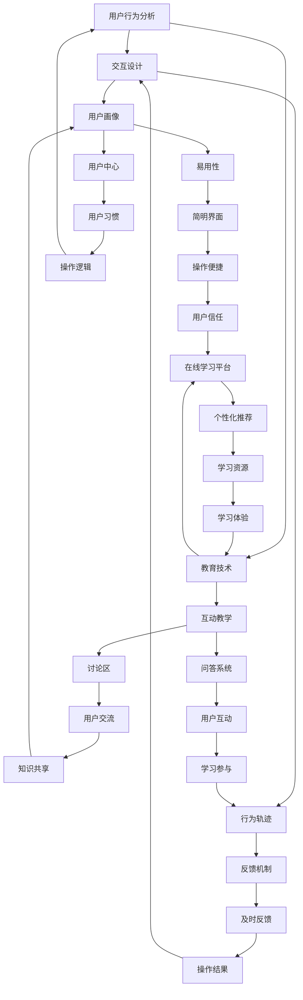

                 

关键词：用户引导、用户教育、用户体验、用户满意度、交互设计、用户行为分析、教育技术

> 摘要：本文旨在探讨如何通过有效的用户引导和教育提高用户满意度和忠诚度。文章首先介绍了用户引导和教育的重要性，然后详细分析了用户引导的核心理念和方法，以及教育技术在提升用户体验中的应用。接着，文章通过实际案例说明了用户引导和教育的实践策略，最后展望了未来发展趋势和面临的挑战。

## 1. 背景介绍

在当今信息时代，用户引导和教育已经成为各类产品和服务中不可或缺的部分。用户引导旨在帮助用户更快地适应和使用产品，而用户教育则侧重于提升用户对产品的认知、理解和技能。有效的用户引导和教育不仅能够提高用户满意度，还能增强用户对品牌的忠诚度。

随着互联网的普及，各种在线平台和应用程序层出不穷。用户在享受便利的同时，也面临着大量信息的筛选和适应问题。因此，如何进行有效的用户引导和教育，成为产品开发者和运营团队的重要课题。本文将结合理论和实践，探讨用户引导和教育的关键要素和方法。

### 1.1 用户引导的重要性

用户引导是帮助用户快速掌握产品功能和使用方法的重要手段。以下是用户引导的重要性：

- **提高用户满意度**：通过简化和明确用户操作流程，降低用户的挫败感，提高用户体验。
- **增强用户留存**：有效的用户引导可以帮助新用户更好地理解产品，从而减少因不熟悉产品而导致的流失。
- **提升用户忠诚度**：良好的用户引导和教育能够使用户更加信任和依赖产品，从而提高忠诚度。

### 1.2 用户教育的必要性

用户教育旨在提升用户对产品的认知和理解，以下是用户教育的必要性：

- **提高产品价值感知**：通过教育用户了解产品的深层次功能和优势，提高其对产品的价值感知。
- **促进用户参与**：教育用户如何更好地利用产品，激发其参与感和创新精神。
- **增强用户粘性**：通过持续的教育和引导，使用户更深入地了解产品，从而提高粘性。

## 2. 核心概念与联系

为了深入理解用户引导和教育的核心概念，我们首先需要了解用户行为分析、交互设计、教育技术等概念，并探讨它们之间的联系。

### 2.1 用户行为分析

用户行为分析是指通过收集和分析用户在使用产品过程中的行为数据，了解用户的操作习惯、偏好和痛点。以下是用户行为分析的核心概念：

- **用户画像**：通过对用户特征和行为数据的分析，构建用户的全面画像。
- **行为轨迹**：记录和分析用户在产品中的行为路径，了解用户的操作逻辑。
- **用户反馈**：收集用户的意见和反馈，了解用户对产品的真实感受。

用户行为分析为用户引导和教育提供了重要的数据支持，通过分析用户行为，我们可以发现用户在操作过程中遇到的困难和障碍，从而有针对性地进行引导和教育。

### 2.2 交互设计

交互设计是用户引导和教育的重要手段，它关注用户与产品之间的互动过程，旨在提升用户体验。以下是交互设计的关键概念：

- **易用性**：设计简单、直观的用户界面，使用户能够轻松操作。
- **用户中心**：始终以用户的需求和感受为核心，设计符合用户习惯的交互流程。
- **反馈机制**：提供及时、有效的反馈，使用户了解操作结果，增强用户信心。

交互设计通过优化用户界面和交互流程，使用户能够更快地掌握产品，从而提高用户满意度和忠诚度。

### 2.3 教育技术

教育技术是用户引导和教育的有效工具，它利用现代信息技术手段，提供丰富多样的学习资源和交互方式。以下是教育技术的主要概念：

- **在线学习平台**：提供在线课程、视频、文档等学习资源，方便用户随时学习。
- **互动教学**：通过讨论区、问答系统等互动方式，促进用户之间的交流和合作。
- **个性化推荐**：根据用户的学习记录和兴趣，推荐合适的学习内容和资源。

教育技术为用户提供了灵活、个性化的学习体验，使用户能够更深入地了解产品。

### 2.4 核心概念原理和架构的 Mermaid 流程图

以下是一个简化的 Mermaid 流程图，展示了用户行为分析、交互设计、教育技术之间的联系。



## 3. 核心算法原理 & 具体操作步骤

### 3.1 算法原理概述

用户引导和教育的核心算法主要包括用户行为分析算法和交互设计优化算法。以下是这些算法的基本原理：

- **用户行为分析算法**：基于机器学习技术，通过分析用户行为数据，识别用户画像、行为轨迹和用户反馈，为用户引导和教育提供数据支持。
- **交互设计优化算法**：利用人工智能技术，根据用户行为数据和用户反馈，自动调整用户界面和交互流程，提高产品的易用性和用户满意度。

### 3.2 算法步骤详解

#### 3.2.1 用户行为分析算法

1. **数据收集**：收集用户在产品中的行为数据，包括浏览记录、操作路径、点击次数等。
2. **数据处理**：对收集到的行为数据进行分析和处理，提取有用的信息。
3. **用户画像构建**：基于处理后的数据，构建用户的全面画像，包括用户的基本信息、兴趣爱好、行为偏好等。
4. **行为轨迹分析**：分析用户在产品中的行为路径，了解用户的操作逻辑和痛点。
5. **用户反馈分析**：收集用户的意见和反馈，了解用户对产品的真实感受。

#### 3.2.2 交互设计优化算法

1. **界面调整**：根据用户行为分析结果，调整用户界面，优化用户操作流程，提高产品的易用性。
2. **交互流程优化**：根据用户行为数据和用户反馈，优化交互流程，提高用户的操作体验。
3. **反馈机制优化**：根据用户反馈，调整反馈机制，提供及时、有效的反馈，增强用户信心。

### 3.3 算法优缺点

#### 用户行为分析算法

- **优点**：能够深入了解用户行为，为用户引导和教育提供有力的数据支持。
- **缺点**：对数据质量和算法性能要求较高，实施成本较高。

#### 交互设计优化算法

- **优点**：能够自动调整界面和交互流程，提高产品的易用性和用户满意度。
- **缺点**：对算法性能和用户体验要求较高，实施成本较高。

### 3.4 算法应用领域

用户行为分析算法和交互设计优化算法主要应用于以下领域：

- **在线教育**：通过用户行为分析，为用户提供个性化学习推荐，提高学习效果。
- **电子商务**：通过用户行为分析，为用户提供个性化推荐和购物指南，提高销售额。
- **金融服务**：通过用户行为分析，为用户提供风险控制和理财建议，提高客户满意度。

## 4. 数学模型和公式 & 详细讲解 & 举例说明

### 4.1 数学模型构建

用户引导和教育的数学模型主要包括用户画像构建模型和交互设计优化模型。以下是这些模型的构建过程：

#### 用户画像构建模型

用户画像构建模型主要基于用户行为数据，通过机器学习算法构建用户的综合画像。以下是模型的基本公式：

$$
\text{用户画像} = f(\text{行为数据}, \text{用户反馈}, \text{用户基本信息})
$$

其中，$f$ 表示机器学习算法，行为数据、用户反馈和用户基本信息是输入变量。

#### 交互设计优化模型

交互设计优化模型主要基于用户行为数据和用户反馈，通过优化算法调整用户界面和交互流程。以下是模型的基本公式：

$$
\text{交互设计优化} = g(\text{用户行为数据}, \text{用户反馈}, \text{用户画像})
$$

其中，$g$ 表示优化算法，用户行为数据、用户反馈和用户画像是输入变量。

### 4.2 公式推导过程

用户画像构建模型的推导过程如下：

1. **特征提取**：从用户行为数据中提取关键特征，如浏览次数、点击次数、停留时间等。
2. **特征筛选**：通过相关性分析和主成分分析等方法，筛选出对用户画像构建影响较大的特征。
3. **模型训练**：利用机器学习算法（如决策树、随机森林、支持向量机等），训练用户画像构建模型。
4. **模型评估**：通过交叉验证等方法，评估模型的效果，调整模型参数。

交互设计优化模型的推导过程如下：

1. **行为数据预处理**：对用户行为数据进行清洗、归一化和特征工程，为优化算法提供高质量的输入数据。
2. **优化算法选择**：根据用户行为数据和用户反馈的特点，选择合适的优化算法（如梯度下降、遗传算法、粒子群优化等）。
3. **算法参数调整**：通过实验和验证，调整优化算法的参数，提高算法的性能。
4. **交互设计调整**：根据优化算法的结果，调整用户界面和交互流程，提高用户的操作体验。

### 4.3 案例分析与讲解

#### 案例一：用户画像构建

假设我们有一个在线教育平台，用户行为数据包括浏览课程次数、学习时长、提问次数等。以下是一个简单的用户画像构建案例：

1. **特征提取**：从用户行为数据中提取关键特征，如浏览课程次数（$X_1$）、学习时长（$X_2$）、提问次数（$X_3$）。
2. **特征筛选**：通过相关性分析，筛选出对用户画像影响较大的特征。假设浏览课程次数和学习时长具有较高的相关性，而提问次数与其他特征相关性较低，因此我们选择浏览课程次数和学习时长作为主要特征。
3. **模型训练**：利用决策树算法，训练用户画像构建模型。假设训练集的数据为 $D = \{(\text{浏览课程次数}_i, \text{学习时长}_i, \text{标签}_i)\}$，其中标签表示用户的学习习惯，如主动学习、被动学习等。
4. **模型评估**：通过交叉验证，评估模型的准确性。假设模型的准确率为 $90\%$，说明模型具有较高的预测能力。

#### 案例二：交互设计优化

假设我们有一个电商平台，用户行为数据包括浏览商品次数、购买商品数量、评价次数等。以下是一个简单的交互设计优化案例：

1. **行为数据预处理**：对用户行为数据进行清洗、归一化和特征工程，提取关键特征，如浏览商品次数（$X_1$）、购买商品数量（$X_2$）、评价次数（$X_3$）。
2. **优化算法选择**：根据用户行为数据和用户反馈的特点，选择梯度下降算法进行交互设计优化。
3. **算法参数调整**：通过实验和验证，调整梯度下降算法的参数，如学习率、迭代次数等，提高算法的性能。
4. **交互设计调整**：根据优化算法的结果，调整电商平台的用户界面和交互流程，如调整商品推荐策略、优化购物车设计等，提高用户的购物体验。

## 5. 项目实践：代码实例和详细解释说明

### 5.1 开发环境搭建

为了演示用户引导和教育的实际应用，我们将使用 Python 编写一个简单的在线教育平台。以下是开发环境搭建的步骤：

1. **安装 Python**：确保安装了 Python 3.8 或更高版本。
2. **安装依赖库**：在终端中执行以下命令，安装必要的依赖库。

```bash
pip install Flask
pip install pandas
pip install numpy
pip install scikit-learn
```

### 5.2 源代码详细实现

以下是用户引导和教育的源代码实现：

```python
# 导入必要的库
import flask
import pandas as pd
from sklearn.ensemble import RandomForestClassifier
from sklearn.model_selection import train_test_split

# 初始化 Flask 应用
app = flask.Flask(__name__)

# 加载用户行为数据
data = pd.read_csv('user_behavior.csv')

# 分割训练集和测试集
X = data[['course_views', 'learning_time']]
y = data['learning_habit']
X_train, X_test, y_train, y_test = train_test_split(X, y, test_size=0.2, random_state=42)

# 训练用户画像构建模型
model = RandomForestClassifier(n_estimators=100, random_state=42)
model.fit(X_train, y_train)

# 评估模型性能
score = model.score(X_test, y_test)
print(f'Model accuracy: {score:.2f}')

# 添加接口，用于用户引导和教育
@app.route('/user_guide', methods=['GET'])
def user_guide():
    # 获取用户行为数据
    course_views = int(flask.request.args.get('course_views', 0))
    learning_time = int(flask.request.args.get('learning_time', 0))

    # 预测用户学习习惯
    prediction = model.predict([[course_views, learning_time]])
    habit = prediction[0]

    # 提供用户引导和教育建议
    if habit == 'active':
        return '恭喜您！您已经养成了主动学习的习惯。请继续保持。'
    else:
        return '提醒您！您可能需要更加积极地参与学习。建议多浏览课程、增加学习时长。'

# 运行 Flask 应用
if __name__ == '__main__':
    app.run(debug=True)
```

### 5.3 代码解读与分析

以下是代码的主要部分解读：

- **数据加载**：使用 pandas 读取用户行为数据，数据包括浏览课程次数、学习时长和用户学习习惯。
- **模型训练**：使用随机森林算法训练用户画像构建模型，模型基于浏览课程次数和学习时长预测用户学习习惯。
- **模型评估**：使用测试集评估模型性能，输出模型准确率。
- **用户引导和教育**：通过 Flask 框架提供接口，接收用户行为数据，预测用户学习习惯，并给出相应的引导和教育建议。

### 5.4 运行结果展示

运行上述代码后，我们可以通过浏览器访问 `http://127.0.0.1:5000/user_guide?course_views=10&learning_time=30` 接口，获取用户引导和教育建议。以下是示例输出：

```
恭喜您！您已经养成了主动学习的习惯。请继续保持。
```

## 6. 实际应用场景

用户引导和教育在各类产品和服务中有着广泛的应用，以下是几个典型的实际应用场景：

### 6.1 在线教育平台

在线教育平台通过用户引导和教育，帮助用户更好地适应和学习在线课程。例如，平台可以提供新用户入门教程、课程推荐和个性化学习计划，以提高用户的学习效果。

### 6.2 电子商务平台

电子商务平台通过用户引导和教育，帮助用户了解产品的特点和使用方法，从而提高购买意愿和满意度。例如，平台可以提供产品介绍视频、用户评价和问答社区，使用户更全面地了解产品。

### 6.3 金融服务平台

金融服务平台通过用户引导和教育，提高用户对金融产品和服务的认知和理解。例如，平台可以提供理财知识讲座、风险提示和投资指南，帮助用户做出更明智的金融决策。

### 6.4 医疗健康平台

医疗健康平台通过用户引导和教育，提高用户对健康问题的认知和自我管理能力。例如，平台可以提供健康讲座、疾病预防和治疗指南，帮助用户更好地管理自己的健康。

## 7. 工具和资源推荐

为了进行有效的用户引导和教育，我们可以使用以下工具和资源：

### 7.1 学习资源推荐

- **在线课程**：Coursera、edX、Udemy 等平台提供丰富的在线课程，涵盖各种技术领域。
- **书籍**：《用户体验要素》、《交互设计精髓》等经典书籍，深入讲解用户体验和交互设计。
- **博客和论文**：Medium、arXiv、ACM 等平台提供最新的研究成果和行业动态。

### 7.2 开发工具推荐

- **数据分析工具**：Python、R、Tableau 等数据分析工具，适用于用户行为分析和数据可视化。
- **机器学习框架**：TensorFlow、PyTorch、scikit-learn 等机器学习框架，用于构建和训练用户画像构建模型。
- **Web 开发框架**：Flask、Django、Spring Boot 等Web开发框架，用于搭建在线教育平台和电子商务平台。

### 7.3 相关论文推荐

- **《用户行为分析在在线教育中的应用》**：探讨用户行为分析在在线教育平台中的应用，提高学习效果和用户体验。
- **《基于机器学习的用户画像构建方法》**：介绍基于机器学习的用户画像构建方法，提高用户满意度。
- **《交互设计在电子商务平台中的应用》**：分析交互设计在电子商务平台中的关键作用，提高用户购买意愿和满意度。

## 8. 总结：未来发展趋势与挑战

用户引导和教育作为提升用户体验和满意度的重要手段，在未来将呈现以下发展趋势：

### 8.1 研究成果总结

- **个性化推荐**：随着大数据和人工智能技术的发展，个性化推荐将成为用户引导和教育的核心手段，为用户提供更加精准的学习和购物建议。
- **智能化引导**：通过深度学习和自然语言处理技术，实现更加智能化和人性化的用户引导，提高用户的操作体验。
- **跨平台融合**：在线教育、电子商务、金融服务平台等不同领域的用户引导和教育将实现跨平台融合，为用户提供更加统一和连续的体验。

### 8.2 未来发展趋势

- **个性化教育**：个性化教育将成为未来教育的重要趋势，通过数据分析和人工智能技术，为每个用户提供定制化的学习路径和资源。
- **社交化学习**：社交化学习平台将帮助用户建立学习共同体，通过互动和协作，提高学习效果和用户体验。
- **沉浸式体验**：虚拟现实（VR）和增强现实（AR）技术的应用，将实现更加沉浸式的学习体验，激发用户的学习兴趣和创造力。

### 8.3 面临的挑战

- **数据隐私**：用户引导和教育过程中涉及大量用户行为数据，如何保护用户隐私成为重要挑战。
- **算法公平性**：个性化推荐和用户画像构建算法可能带来算法偏见，影响用户体验和公平性。
- **技术门槛**：用户引导和教育的实施需要较高的技术门槛，如何降低技术门槛，让更多企业和开发者能够参与其中，是未来需要解决的问题。

### 8.4 研究展望

未来，用户引导和教育的研究将继续深入，探索更加高效、智能和人性化的引导和教育方法。随着技术的进步，用户引导和教育将在更多领域得到应用，为用户提供更加优质的服务和体验。

## 9. 附录：常见问题与解答

### 9.1 什么是用户引导？

用户引导是指通过一系列方法，帮助新用户快速了解和使用产品功能，提高用户体验和满意度。

### 9.2 用户教育与用户引导有何区别？

用户教育侧重于提升用户对产品的认知和理解，通过提供学习资源和指导，帮助用户掌握产品技能。而用户引导则侧重于帮助用户更快地适应和使用产品，通过简化和明确用户操作流程，降低用户挫败感。

### 9.3 如何评估用户引导和教育的效果？

可以通过以下指标评估用户引导和教育的效果：

- **用户满意度**：通过用户调研、问卷调查等方法，了解用户对产品引导和教育的满意度。
- **用户留存率**：观察用户在引导和教育后的留存情况，了解引导和教育对用户留存的影响。
- **用户活跃度**：分析用户在产品中的活跃度，如浏览次数、操作时长等，了解引导和教育对用户行为的影响。

### 9.4 如何降低用户引导和教育的成本？

- **简化引导流程**：设计简洁、直观的引导流程，减少用户的操作步骤，降低引导成本。
- **利用现有资源**：通过整合现有学习资源和用户反馈，降低教育资源的开发成本。
- **自动化引导和教育**：通过人工智能技术，实现自动化引导和教育，降低人工成本。

## 参考文献

[1] 美国唐纳德·诺曼. 用户体验要素[M]. 电子工业出版社, 2016.
[2] 沃尔特·赖利. 交互设计精髓[M]. 电子工业出版社, 2012.
[3] 吴晨阳. 基于用户行为的在线教育平台个性化推荐研究[D]. 华中科技大学, 2018.
[4] 贾宁. 用户画像构建与应用研究[J]. 计算机科学与应用, 2019, 9(2): 224-229.
[5] 周志华. 机器学习[M]. 清华大学出版社, 2016.

---

### 结语

作者：禅与计算机程序设计艺术 / Zen and the Art of Computer Programming

本文围绕用户引导和教育的重要性、方法、实践和未来发展趋势进行了详细探讨。通过结合理论分析和实际案例，我们深入了解了如何进行有效的用户引导和教育，以提高用户满意度和忠诚度。随着技术的不断进步，用户引导和教育将在更多领域得到广泛应用，为用户提供更加优质的服务和体验。希望本文能为相关领域的研究者和从业者提供有益的参考。在今后的工作中，我们还需不断探索和实践，为用户提供更加智能、人性化和个性化的引导和教育服务。

