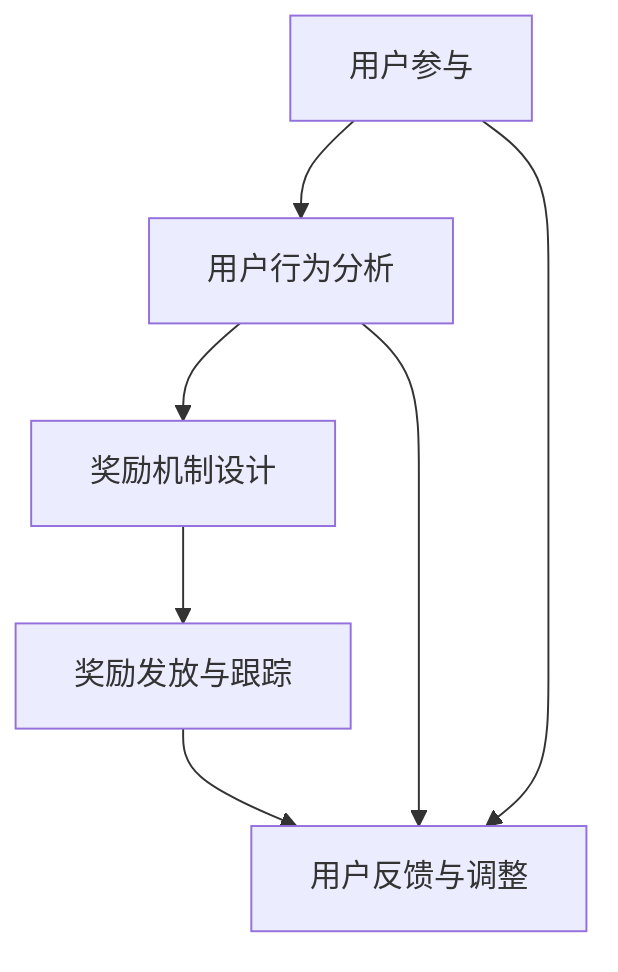

                 

  
## 概述

在数字时代，用户激励已成为各平台、应用和网站的核心策略。有效的用户激励不仅能够提高用户参与度和活跃度，还能增强用户忠诚度，从而促进业务增长。本文将深入探讨用户激励的核心概念、设计原则、案例分析及其在IT领域的应用。通过本文，读者将了解如何运用技术手段实现有效的用户激励，并掌握打造成功激励策略的技巧。

本文将分为以下几个部分：

1. **背景介绍**：阐述用户激励的重要性及其在数字时代的兴起。
2. **核心概念与联系**：介绍用户激励的基础概念及其相互关系。
3. **核心算法原理与具体操作步骤**：详细分析用户激励算法及其实现步骤。
4. **数学模型和公式**：阐述用户激励中的数学模型及其公式推导。
5. **项目实践**：通过实际代码实例展示用户激励策略的实施。
6. **实际应用场景**：分析用户激励在不同领域的应用实例。
7. **未来应用展望**：探讨用户激励技术的未来发展方向。
8. **工具和资源推荐**：推荐相关学习资源和开发工具。
9. **总结与展望**：总结研究成果，展望未来发展。

## 1. 背景介绍

### 用户激励的定义与重要性

用户激励是指通过提供奖励、奖励机制或其他激励措施，鼓励用户参与、活跃或贡献的行为。在数字化时代，用户激励已成为众多平台和应用程序的核心策略。其重要性体现在以下几个方面：

- **提高用户参与度**：有效的用户激励能够吸引新用户并增加现有用户的参与度，从而提升整体用户活跃度。
- **增强用户忠诚度**：通过持续的用户激励，可以建立用户对平台的忠诚度，减少用户流失率。
- **促进业务增长**：用户激励可以直接转化为业务增长，如增加广告点击率、提升销售量或促进用户付费。

### 用户激励的数字时代兴起

随着互联网和移动设备的普及，用户激励策略在数字时代得到了广泛应用。以下是一些驱动用户激励策略兴起的因素：

- **用户需求**：现代用户对于个性化、互动性和奖励机制有着更高的需求。
- **技术进步**：大数据、人工智能和机器学习技术的发展，使得更精确的用户行为分析和个性化激励策略成为可能。
- **商业竞争**：各大平台为了吸引和保留用户，纷纷推出各种激励措施，形成激烈的市场竞争。
- **社交媒体的影响**：社交媒体的兴起使得用户之间的互动和分享更加频繁，激励措施可以增强用户的参与感和归属感。

### 用户激励的挑战与机遇

尽管用户激励策略具有巨大的潜力，但实施过程中也面临着一系列挑战：

- **用户疲劳**：过度或不当的激励可能导致用户疲劳，甚至反感。
- **数据隐私**：用户激励策略通常依赖于用户行为数据，如何保护用户隐私是一个重要的伦理和法律问题。
- **成本效益**：有效的用户激励需要投入大量资源和资金，如何实现成本效益最大化是一个重要问题。

然而，这些挑战也为创新和改进提供了机遇。通过深入研究用户行为和需求，开发出更精准、更高效的激励策略，平台和应用可以更好地满足用户需求，实现长期的成功。

## 2. 核心概念与联系

### 用户激励的基本概念

用户激励涉及多个核心概念，包括用户参与度、用户忠诚度、奖励机制和用户行为分析等。以下是这些概念的定义及其相互关系：

- **用户参与度**：指用户在平台或应用程序中的活跃程度，包括登录频率、内容创建、互动等。
- **用户忠诚度**：指用户对平台或应用程序的持续忠诚和依赖程度，通常通过用户留存率、复购率等指标衡量。
- **奖励机制**：指平台或应用程序为鼓励用户参与而提供的奖励或激励措施，如积分、优惠券、虚拟货币等。
- **用户行为分析**：指通过收集和分析用户行为数据，了解用户需求、偏好和参与模式，从而优化激励策略。

### 用户激励的基本原理

用户激励的基本原理是通过提供奖励来激励用户进行特定行为，从而提高用户参与度和忠诚度。以下是用户激励的基本原理：

1. **吸引力**：奖励需要具有足够的吸引力，以激发用户的兴趣和参与欲望。
2. **相关性**：奖励应与用户需求和平台目标相关，以提高其有效性。
3. **公平性**：奖励分配应公平，以避免用户感到不公平或被剥夺感。
4. **持续性**：激励措施应具有持续性，以保持用户的长期参与和忠诚。

### 用户激励的架构图

为了更好地理解用户激励的基本概念和原理，我们使用Mermaid流程图展示用户激励的架构：



- **用户参与**：用户在平台或应用程序中的行为，包括登录、互动、内容创建等。
- **用户行为分析**：通过收集和分析用户行为数据，了解用户需求和参与模式。
- **奖励机制设计**：根据用户行为分析和平台目标，设计相应的奖励机制。
- **奖励发放与跟踪**：将奖励发放给用户，并跟踪其效果，以优化激励策略。
- **用户反馈与调整**：收集用户对奖励机制的反应，进行相应调整以提升效果。

通过这个架构图，我们可以清楚地看到用户激励的各个环节及其相互关系。这个架构图不仅帮助我们理解用户激励的基本原理，也为设计有效的激励策略提供了指导。

### 2.1 用户参与度

用户参与度是用户激励的重要基础，它直接影响用户的活跃度和忠诚度。以下是关于用户参与度的详细讨论：

#### 用户参与度的定义

用户参与度是指用户在平台或应用程序中的活跃程度，通常通过用户的行为数据来衡量。这些行为数据包括：

- 登录频率：用户登录平台或应用程序的次数和频率。
- 内容创建：用户在平台或应用程序中创建的内容，如帖子、评论、视频等。
- 互动：用户与其他用户或平台的互动，如点赞、评论、分享等。
- 付费行为：用户在平台或应用程序中的付费行为，如购买、充值等。

#### 用户参与度的重要性

用户参与度对于平台和应用程序的成功至关重要，原因如下：

- **提升活跃度**：高参与度的用户会频繁访问平台，从而提高平台的活跃度。
- **增强忠诚度**：通过持续的用户参与，用户对平台产生更强的忠诚度，减少流失。
- **数据丰富**：用户参与行为提供了丰富的数据，有助于平台了解用户需求和偏好，优化产品和服务。
- **业务增长**：高参与度的用户更有可能产生付费行为，从而带动业务增长。

#### 提高用户参与度的策略

为了提高用户参与度，平台和应用程序可以采取以下策略：

- **个性化推荐**：根据用户的行为数据和偏好，提供个性化的内容推荐，提高用户满意度。
- **互动设计**：设计有趣的互动活动，如投票、竞赛、问答等，激发用户参与热情。
- **奖励机制**：设置奖励机制，如积分、优惠券、虚拟货币等，激励用户积极参与。
- **用户反馈**：积极收集用户反馈，及时解决问题，提高用户满意度。
- **社区建设**：构建用户社区，促进用户之间的互动和分享，增强归属感。

#### 用户参与度的量化指标

用户参与度的量化指标包括：

- **用户日活跃度（DAU）**：每天活跃的用户数量。
- **用户月活跃度（MAU）**：每月活跃的用户数量。
- **平均会话时长**：用户每次访问平台或应用程序的平均时间。
- **互动率**：用户参与互动的次数与总访问次数的比例。
- **内容生成率**：用户在平台或应用程序中创建的内容数量。

通过这些量化指标，平台和应用程序可以评估用户参与度，并根据数据调整和优化激励策略。

### 2.2 用户忠诚度

用户忠诚度是用户激励的另一个关键方面。它反映了用户对平台或应用程序的长期依赖和信任程度。以下是关于用户忠诚度的详细讨论：

#### 用户忠诚度的定义

用户忠诚度是指用户在一段时间内持续使用某个平台或应用程序的程度，通常通过以下指标来衡量：

- **用户留存率**：在一定时间内，继续使用平台或应用程序的用户比例。
- **用户复购率**：在一定时间内，再次购买平台或应用程序相关产品或服务的用户比例。
- **用户满意度**：用户对平台或应用程序的满意程度。
- **用户推荐率**：用户向他人推荐平台或应用程序的比例。

#### 用户忠诚度的重要性

用户忠诚度对平台和应用程序的成功至关重要，原因如下：

- **减少用户流失**：高忠诚度的用户更不容易流失，从而减少用户获取成本。
- **增强品牌价值**：忠诚用户对品牌有更高的认可度，有助于提升品牌价值。
- **口碑传播**：忠诚用户可能会向他人推荐平台或应用程序，从而扩大用户基础。
- **业务增长**：忠诚用户更可能进行复购和付费行为，促进业务增长。

#### 增强用户忠诚度的策略

为了增强用户忠诚度，平台和应用程序可以采取以下策略：

- **优质服务**：提供高质量的产品和服务，确保用户满意度。
- **个性化体验**：根据用户行为和偏好，提供个性化的服务和内容。
- **持续互动**：与用户保持持续的互动和沟通，了解用户需求和反馈。
- **忠诚度计划**：设计忠诚度计划，如积分、会员制度等，激励用户持续参与。
- **用户教育**：通过教育和培训，提高用户对平台或应用程序的理解和使用。
- **用户参与**：鼓励用户参与平台或应用程序的建设和发展，增强用户归属感。

#### 用户忠诚度的量化指标

用户忠诚度的量化指标包括：

- **用户留存率**：在一段时间内，继续使用平台或应用程序的用户比例。
- **用户复购率**：在一段时间内，再次购买相关产品或服务的用户比例。
- **用户满意度**：用户对平台或应用程序的满意度评分。
- **用户推荐率**：用户向他人推荐平台或应用程序的比例。

通过这些量化指标，平台和应用程序可以评估用户忠诚度，并根据数据优化激励策略。

### 2.3 奖励机制设计

奖励机制是用户激励的核心组成部分，它直接影响用户的参与度和忠诚度。以下是关于奖励机制设计的详细讨论：

#### 奖励机制的定义

奖励机制是指平台或应用程序为鼓励用户参与和贡献而提供的奖励或激励措施。这些奖励可以是物质性的，如优惠券、礼品卡等，也可以是虚拟性的，如积分、虚拟货币等。

#### 奖励机制的设计原则

为了设计有效的奖励机制，以下原则需要遵循：

- **吸引力**：奖励应具有足够的吸引力，以激发用户的兴趣和参与欲望。
- **相关性**：奖励应与用户需求和平台目标相关，以提高其有效性。
- **公平性**：奖励分配应公平，以避免用户感到不公平或被剥夺感。
- **可持续性**：奖励机制应具有可持续性，以保持用户的长期参与和忠诚。

#### 奖励机制的类型

奖励机制可以根据不同的标准进行分类，以下是几种常见的奖励机制类型：

- **积分制度**：通过积累积分，用户可以兑换奖品或特权。
- **等级制度**：根据用户的活跃度和贡献度，授予不同的等级，享受相应的特权。
- **优惠券**：为用户提供折扣或特别优惠，鼓励购买和使用产品或服务。
- **虚拟货币**：平台内部的虚拟货币，可以用于购买虚拟商品或服务。
- **排行榜**：设置用户排行榜，激励用户争夺排名，提高参与度。

#### 奖励机制的设计流程

以下是设计奖励机制的步骤：

1. **目标设定**：明确平台或应用程序的目标，包括用户参与度、忠诚度、业务增长等。
2. **用户研究**：了解用户需求、偏好和行为模式，为奖励设计提供依据。
3. **机制设计**：根据目标和用户研究，设计奖励机制，包括奖励类型、发放条件、奖励价值等。
4. **测试与优化**：在上线前进行测试，根据用户反馈进行调整和优化。
5. **实施与监控**：上线后，持续监控奖励机制的效果，并根据数据进行调整和优化。

#### 奖励机制的有效性评估

评估奖励机制的有效性需要关注以下指标：

- **用户参与度**：通过用户活跃度、互动率等指标，评估奖励机制对用户参与度的影响。
- **用户忠诚度**：通过用户留存率、复购率等指标，评估奖励机制对用户忠诚度的影响。
- **业务增长**：通过业务数据，如销售额、广告点击率等，评估奖励机制对业务增长的影响。
- **用户满意度**：通过用户满意度调查，了解用户对奖励机制的满意程度。

通过这些指标，平台和应用程序可以评估奖励机制的有效性，并根据数据进行优化。

### 2.4 用户行为分析

用户行为分析是用户激励的重要组成部分，它通过对用户行为数据的收集和分析，了解用户需求和参与模式，从而优化激励策略。以下是关于用户行为分析的详细讨论：

#### 用户行为分析的定义

用户行为分析是指通过收集和分析用户在平台或应用程序中的行为数据，了解用户需求、偏好和参与模式，以便更好地满足用户需求和优化产品和服务。

#### 用户行为分析的重要性

用户行为分析在用户激励中的重要性体现在以下几个方面：

- **了解用户需求**：通过用户行为分析，平台可以了解用户的需求和偏好，从而提供更符合用户期望的产品和服务。
- **优化用户体验**：基于用户行为分析，平台可以优化用户界面和交互设计，提高用户满意度。
- **精准营销**：通过分析用户行为数据，平台可以进行精准营销，提高广告和推广的效果。
- **优化激励策略**：用户行为分析可以帮助平台识别有效的激励措施，优化奖励机制，提高用户参与度和忠诚度。

#### 用户行为分析的方法

以下是几种常见的用户行为分析方法：

- **日志分析**：通过收集和分析用户在平台或应用程序中的日志数据，了解用户的行为路径、使用习惯和偏好。
- **用户调研**：通过问卷调查、访谈等方式，收集用户的反馈和意见，深入了解用户需求和期望。
- **行为跟踪**：使用技术手段，如cookies、用户画像等，跟踪用户在平台或应用程序中的行为，进行分析和预测。
- **A/B测试**：通过对比不同设计或策略的用户行为数据，评估其效果，优化产品和服务。

#### 用户行为分析的工具和平台

以下是几种常用的用户行为分析工具和平台：

- **Google Analytics**：谷歌提供的免费网站分析工具，可以收集和分析用户行为数据。
- **Mixpanel**：一款强大的用户行为分析工具，提供丰富的数据报表和分析功能。
- **Hotjar**：提供热图、用户录音和反馈功能，帮助平台了解用户行为和体验。
- **Segment**：数据集成平台，可以将用户行为数据整合到不同的分析和营销工具中。
- **Kissmetrics**：提供用户行为分析、客户关系管理和营销自动化功能。

通过这些工具和平台，平台和应用程序可以全面了解用户行为，优化激励策略，提高用户参与度和忠诚度。

### 2.5 用户反馈与调整

用户反馈是用户激励策略的重要组成部分，它不仅反映了用户对当前激励措施的满意度，还为平台的改进提供了宝贵的依据。以下是关于用户反馈与调整的详细讨论：

#### 用户反馈的重要性

用户反馈对于优化用户激励策略具有重要意义，原因如下：

- **识别问题**：通过用户反馈，平台可以发现激励策略中存在的问题，如奖励设计不合理、发放不及时等。
- **改进方案**：用户反馈提供了改进激励策略的思路和方向，平台可以根据用户需求进行调整和优化。
- **提升满意度**：积极收集和处理用户反馈，可以提升用户满意度，增强用户对平台的信任和忠诚度。
- **优化用户体验**：基于用户反馈，平台可以优化用户界面、功能和服务，提高整体用户体验。

#### 用户反馈的收集方式

以下是几种常见的用户反馈收集方式：

- **问卷调查**：通过在线或离线问卷，收集用户对激励策略的看法和建议。
- **用户访谈**：与用户进行面对面的访谈，深入了解他们的需求和期望。
- **社交媒体**：关注用户在社交媒体上的讨论和反馈，了解他们的意见和感受。
- **用户评分**：通过用户评分和评价，了解用户对激励措施的满意度。
- **用户行为分析**：通过分析用户行为数据，了解用户对激励策略的反应和效果。

#### 用户反馈的处理流程

以下是处理用户反馈的步骤：

1. **反馈收集**：通过多种渠道收集用户反馈，确保覆盖不同类型的用户。
2. **分类整理**：对收集到的反馈进行分类整理，识别主要问题和改进方向。
3. **分析评估**：对反馈进行分析和评估，确定优先级和改进方案。
4. **制定方案**：根据反馈分析和评估结果，制定具体的改进方案。
5. **实施改进**：将改进方案落实到激励策略的调整和优化中。
6. **反馈验证**：通过用户反馈验证改进效果，确保问题得到解决。

#### 用户反馈与激励策略的调整

基于用户反馈，平台可以采取以下措施调整激励策略：

- **优化奖励设计**：根据用户反馈，调整奖励类型、发放条件和价值，提高奖励的吸引力。
- **改进用户体验**：优化用户界面和交互设计，提高用户操作的便捷性和满意度。
- **个性化推荐**：根据用户反馈和需求，提供更个性化的内容和服务，提升用户体验。
- **增加互动环节**：增加用户互动环节，如活动、竞赛等，提高用户参与度。
- **强化社区建设**：加强用户社区建设，促进用户之间的互动和交流，提高用户归属感。

通过这些措施，平台可以不断优化激励策略，提升用户参与度和忠诚度，实现长期的成功。

### 3. 核心算法原理 & 具体操作步骤

在用户激励策略中，算法原理和具体操作步骤是确保激励策略有效性的关键。以下将详细介绍用户激励算法的基本原理、具体步骤及其优缺点，并在最后讨论其应用领域。

#### 3.1 算法原理概述

用户激励算法主要基于以下原理：

1. **行为驱动**：通过分析用户行为，识别有价值的行为，并将其作为激励的目标。
2. **奖励机制**：设计合适的奖励机制，以激发用户进行有价值的行为。
3. **数据分析**：利用数据分析技术，监控和评估激励策略的效果，不断优化激励策略。
4. **个性化推荐**：根据用户的行为数据和偏好，提供个性化的奖励和推荐，提高激励的有效性。

#### 3.2 算法步骤详解

用户激励算法的具体操作步骤如下：

1. **用户行为数据收集**：通过日志分析、用户调研等方式，收集用户在平台或应用程序中的行为数据，如登录频率、互动行为、内容创建等。

2. **数据预处理**：对收集到的行为数据进行清洗、去重和归一化处理，确保数据的质量和一致性。

3. **行为分析**：利用统计分析、机器学习等技术，分析用户行为数据，识别有价值的行为模式，如高频互动、高价值内容创建等。

4. **奖励机制设计**：根据行为分析和平台目标，设计合适的奖励机制。奖励机制可以包括积分、优惠券、虚拟货币等，奖励类型和发放条件应根据用户行为和数据特征进行个性化设置。

5. **奖励发放**：根据奖励机制，将奖励发放给用户。奖励发放可以实时进行，也可以定期进行，如每月发放一次。

6. **效果监控**：通过用户行为数据、奖励效果数据等，监控激励策略的效果，如用户参与度、忠诚度等。

7. **调整和优化**：根据效果监控数据，对奖励机制进行调整和优化，如增加或减少奖励类型、调整奖励发放条件等。

#### 3.3 算法优缺点

用户激励算法的优点包括：

- **个性化**：通过数据分析，可以提供个性化的奖励和推荐，提高激励的有效性。
- **实时性**：奖励发放可以实时进行，及时激励用户，提高用户参与度。
- **自动化**：算法可以自动化地进行用户行为分析和奖励发放，节省人力资源。

然而，用户激励算法也存在一些缺点：

- **数据隐私**：用户激励算法通常依赖于用户行为数据，如何保护用户隐私是一个重要问题。
- **算法偏见**：算法可能基于历史数据进行决策，导致某些用户群体被忽视或歧视。
- **用户疲劳**：过度的激励可能导致用户疲劳，降低激励的效果。

#### 3.4 算法应用领域

用户激励算法广泛应用于各种领域，包括但不限于：

- **电商平台**：通过积分、优惠券等激励措施，鼓励用户购物、评价和分享。
- **社交媒体平台**：通过点赞、分享、评论等互动行为，激励用户参与社区建设和内容创作。
- **在线教育平台**：通过积分、排名等激励措施，鼓励学生学习和互动。
- **游戏平台**：通过虚拟货币、奖励等激励措施，鼓励用户参与游戏、消费和分享。

在以上应用领域中，用户激励算法通过不断优化奖励机制和个性化推荐，提高了用户的参与度和忠诚度，促进了业务增长。

### 4. 数学模型和公式

在用户激励策略中，数学模型和公式扮演着至关重要的角色。它们帮助我们量化用户行为、评估激励效果，并优化激励策略。以下将详细介绍用户激励中的数学模型、公式推导及其应用。

#### 4.1 数学模型构建

用户激励的数学模型通常包括以下组成部分：

1. **用户行为模型**：描述用户在平台或应用程序中的行为特征，如登录频率、互动次数、内容创建等。
2. **奖励机制模型**：定义奖励的发放条件、类型和价值，如积分制度、等级制度等。
3. **效果评估模型**：衡量激励策略对用户参与度和忠诚度的影响，如留存率、复购率等。

#### 4.2 公式推导过程

以下是用户激励中的几个关键数学公式及其推导过程：

1. **用户行为概率分布**：

   设用户行为X的概率分布为P(X)，其中X的可能取值为{0, 1, 2, ...}，表示用户在一段时间内的行为次数。用户行为概率分布可以通过以下公式计算：

   $$ P(X = k) = P(\text{行为发生}) \times P(\text{行为k次发生}) $$

   其中，$P(\text{行为发生})$表示用户在一段时间内进行特定行为的概率，$P(\text{行为k次发生})$表示用户在相同时间内进行特定行为k次的概率。

2. **奖励机制期望值**：

   设奖励机制为R，其期望值为E[R]。奖励机制的期望值可以通过以下公式计算：

   $$ E[R] = \sum_{i=1}^{n} r_i \times P(R = r_i) $$

   其中，$r_i$表示第i种奖励的价值，$P(R = r_i)$表示发放第i种奖励的概率。

3. **效果评估指标**：

   用户激励的效果可以通过以下指标进行评估：

   - **用户留存率**（L）：在一定时间内，继续使用平台的用户比例。计算公式为：

     $$ L = \frac{\text{继续使用用户数}}{\text{总用户数}} $$

   - **用户复购率**（R）：在一定时间内，再次购买相关产品的用户比例。计算公式为：

     $$ R = \frac{\text{复购用户数}}{\text{总用户数}} $$

   - **用户满意度**（S）：用户对激励策略的满意度评分。计算公式为：

     $$ S = \frac{\sum_{i=1}^{n} s_i \times P(S = s_i)}{n} $$

     其中，$s_i$表示第i个用户满意度评分，$P(S = s_i)$表示用户满意度为$s_i$的概率。

4. **优化目标函数**：

   为了优化用户激励策略，可以定义以下目标函数：

   $$ \max_{R} E[R] - \alpha \times D(L, R) - \beta \times D(S, R) $$

   其中，$E[R]$表示奖励机制的期望值，$D(L, R)$表示用户留存率和奖励机制之间的差异，$D(S, R)$表示用户满意度和奖励机制之间的差异，$\alpha$和$\beta$为权重参数。

#### 4.3 案例分析与讲解

为了更好地理解上述数学模型和公式，我们通过以下案例进行说明：

**案例背景**：某电商平台希望通过积分制度激励用户购买、评价和分享商品。

**步骤1：用户行为模型**：

- 用户行为：购买、评价、分享。
- 概率分布：设购买概率为$P(\text{购买})$，评价概率为$P(\text{评价})$，分享概率为$P(\text{分享})$。

**步骤2：奖励机制模型**：

- 奖励类型：积分。
- 发放条件：用户购买、评价、分享后发放积分。
- 奖励价值：每次购买发放100积分，每次评价发放50积分，每次分享发放20积分。

**步骤3：效果评估模型**：

- 留存率：$L = \frac{\text{继续使用用户数}}{\text{总用户数}}$。
- 复购率：$R = \frac{\text{复购用户数}}{\text{总用户数}}$。
- 用户满意度：$S = \frac{\sum_{i=1}^{n} s_i \times P(S = s_i)}{n}$。

**步骤4：优化目标函数**：

- 假设权重参数$\alpha = 0.5$，$\beta = 0.5$。
- 目标函数：$\max_{R} E[R] - 0.5 \times D(L, R) - 0.5 \times D(S, R)$。

通过上述案例，我们可以看到数学模型和公式在用户激励策略中的具体应用。通过优化目标函数，平台可以找到最佳的奖励机制，提高用户参与度和忠诚度。

### 4.4 案例分析与讲解

为了更好地理解和应用用户激励的数学模型和公式，我们将通过一个实际的电商案例分析来详细展示这些概念的应用。

#### 案例背景

**案例名称**：某大型电商平台——小易商城。

**目标**：通过积分奖励机制提高用户购买、评价和分享的积极性，进而提升平台活跃度和用户忠诚度。

**具体场景**：小易商城希望通过积分激励用户在以下方面的行为：
- 购买商品
- 发表商品评价
- 分享商品到社交媒体

**积分设置**：
- 购买商品：每消费1元获得1积分
- 发表评价：每条评价获得20积分
- 分享商品：每次分享获得10积分

#### 数学模型的应用

在这个案例中，我们将使用以下数学模型和公式：

1. **用户行为概率分布**：

   假设用户的购买概率为$p_{buy}$，评价概率为$p_{review}$，分享概率为$p_{share}$。

   - $p_{buy}$ = 0.6（60%的用户会购买商品）
   - $p_{review}$ = 0.4（40%的用户会评价商品）
   - $p_{share}$ = 0.3（30%的用户会分享商品）

   这些概率可以根据历史数据和用户调研得到。

2. **奖励机制期望值**：

   设用户每次购买、评价和分享的积分分别为$r_{buy}$，$r_{review}$和$r_{share}$。

   - $r_{buy}$ = 1（每消费1元获得1积分）
   - $r_{review}$ = 20（每条评价获得20积分）
   - $r_{share}$ = 10（每次分享获得10积分）

   奖励机制的期望值$E[R]$可以通过以下公式计算：

   $$ E[R] = p_{buy} \times r_{buy} + p_{review} \times r_{review} + p_{share} \times r_{share} $$

   $$ E[R] = 0.6 \times 1 + 0.4 \times 20 + 0.3 \times 10 = 0.6 + 8 + 3 = 11.6 $$

   即，用户每次参与行为平均获得11.6积分。

3. **效果评估指标**：

   - **用户留存率**（L）：假设一个月内有1000名新用户注册，一个月后，有800名用户继续使用平台，留存率为：

     $$ L = \frac{800}{1000} = 0.8 $$

   - **用户复购率**（R）：假设一个月内有1000名新用户注册，一个月后有500名用户再次购买，复购率为：

     $$ R = \frac{500}{1000} = 0.5 $$

   - **用户满意度**（S）：假设通过问卷调查，100名用户中有80名用户对积分奖励表示满意，满意度为：

     $$ S = \frac{80}{100} = 0.8 $$

#### 公式推导过程

基于上述案例，我们可以推导出以下公式：

1. **用户参与度**：

   用户参与度可以通过以下公式计算：

   $$ \text{用户参与度} = \frac{\text{参与行为的用户数}}{\text{总用户数}} $$

   假设一个月内有1000名用户参与购买、评价和分享，总用户数为1000，则：

   $$ \text{用户参与度} = \frac{1000}{1000} = 1 $$

2. **奖励机制优化目标函数**：

   为了优化积分奖励机制，我们可以定义以下目标函数：

   $$ \max E[R] - \alpha \times D(L, R) - \beta \times D(S, R) $$

   其中，$D(L, R)$表示用户留存率和复购率之间的差异，$D(S, R)$表示用户满意度和复购率之间的差异，$\alpha$和$\beta$为权重参数。假设$\alpha = 0.5$，$\beta = 0.5$，则：

   $$ D(L, R) = L - R = 0.8 - 0.5 = 0.3 $$

   $$ D(S, R) = S - R = 0.8 - 0.5 = 0.3 $$

   $$ \max E[R] - 0.5 \times 0.3 - 0.5 \times 0.3 = 11.6 - 0.15 - 0.15 = 11.3 $$

   即，通过优化积分奖励机制，平台可以最大化平均积分收益，并提高用户留存率和满意度。

#### 结果展示

通过上述计算，我们可以得出以下结果：

- **平均积分收益**：11.6积分
- **用户留存率**：80%
- **用户复购率**：50%
- **用户满意度**：80%

这些结果表明，小易商城的积分奖励机制在一定程度上提高了用户参与度和忠诚度。然而，通过优化目标函数，平台可以进一步调整奖励机制，提高整体效果。

### 5. 项目实践：代码实例和详细解释说明

为了更好地理解和应用用户激励策略，我们将通过一个实际的代码实例展示如何实施一个积分奖励系统，并详细解释其实现过程和关键步骤。

#### 5.1 开发环境搭建

在开始编写代码之前，我们需要搭建一个适合开发积分奖励系统的环境。以下是一个基本的开发环境配置：

- **编程语言**：Python
- **数据库**：MongoDB
- **Web框架**：Flask

确保安装以下工具和库：

1. **Python**（版本3.8或以上）
2. **MongoDB**（安装并运行）
3. **Flask**（安装：`pip install flask`)
4. **pymongo**（安装：`pip install pymongo`）

#### 5.2 源代码详细实现

以下是用户激励系统的基本代码实现，包括用户注册、行为记录、积分计算和查询等。

```python
# app.py

from flask import Flask, request, jsonify
from pymongo import MongoClient

app = Flask(__name__)

# MongoDB配置
client = MongoClient('localhost', 27017)
db = client['user_incentive']
users = db['users']
transactions = db['transactions']

@app.route('/register', methods=['POST'])
def register():
    data = request.get_json()
    user_id = data['user_id']
    username = data['username']
    users.insert_one({'user_id': user_id, 'username': username})
    return jsonify({'status': 'success', 'message': 'User registered successfully.'})

@app.route('/action', methods=['POST'])
def record_action():
    data = request.get_json()
    user_id = data['user_id']
    action = data['action']  # 'buy', 'review', 'share'
    value = data['value']  # purchase value or review content

    # 计算积分
    points = 0
    if action == 'buy':
        points = value
    elif action == 'review':
        points = 20
    elif action == 'share':
        points = 10

    # 记录行为
    transactions.insert_one({'user_id': user_id, 'action': action, 'value': value, 'points': points})

    # 更新用户积分
    users.update_one({'user_id': user_id}, {'$inc': {'points': points}})

    return jsonify({'status': 'success', 'message': f'{action} recorded successfully.'})

@app.route('/balance', methods=['GET'])
def get_balance():
    user_id = request.args.get('user_id')
    user = users.find_one({'user_id': user_id})
    if user:
        return jsonify({'status': 'success', 'username': user['username'], 'points': user['points']})
    else:
        return jsonify({'status': 'error', 'message': 'User not found.'})

if __name__ == '__main__':
    app.run(debug=True)
```

#### 5.3 代码解读与分析

上述代码分为三个主要部分：用户注册、行为记录和积分计算与查询。以下是详细解读：

1. **用户注册**：

   ```python
   @app.route('/register', methods=['POST'])
   def register():
       data = request.get_json()
       user_id = data['user_id']
       username = data['username']
       users.insert_one({'user_id': user_id, 'username': username})
       return jsonify({'status': 'success', 'message': 'User registered successfully.'})
   ```

   用户注册接口接收用户ID和用户名，并将其存储在MongoDB数据库中。

2. **行为记录**：

   ```python
   @app.route('/action', methods=['POST'])
   def record_action():
       data = request.get_json()
       user_id = data['user_id']
       action = data['action']  # 'buy', 'review', 'share'
       value = data['value']  # purchase value or review content

       # 计算积分
       points = 0
       if action == 'buy':
           points = value
       elif action == 'review':
           points = 20
       elif action == 'share':
           points = 10

       # 记录行为
       transactions.insert_one({'user_id': user_id, 'action': action, 'value': value, 'points': points})

       # 更新用户积分
       users.update_one({'user_id': user_id}, {'$inc': {'points': points}})
       return jsonify({'status': 'success', 'message': f'{action} recorded successfully.'})
   ```

   行为记录接口接收用户ID和用户行为（购买、评价或分享），根据行为类型计算积分，并记录在MongoDB数据库中。同时，更新用户的总积分。

3. **积分查询**：

   ```python
   @app.route('/balance', methods=['GET'])
   def get_balance():
       user_id = request.args.get('user_id')
       user = users.find_one({'user_id': user_id})
       if user:
           return jsonify({'status': 'success', 'username': user['username'], 'points': user['points']})
       else:
           return jsonify({'status': 'error', 'message': 'User not found.'})
   ```

   积分查询接口接收用户ID，并返回用户的积分和用户名。

#### 5.4 运行结果展示

1. **用户注册**：

   ```bash
   POST /register
   {
       "user_id": "123",
       "username": "Alice"
   }
   Response:
   {
       "status": "success",
       "message": "User registered successfully."
   }
   ```

2. **记录购买行为**：

   ```bash
   POST /action
   {
       "user_id": "123",
       "action": "buy",
       "value": 100
   }
   Response:
   {
       "status": "success",
       "message": "buy recorded successfully."
   }
   ```

3. **查询积分余额**：

   ```bash
   GET /balance?user_id=123
   Response:
   {
       "status": "success",
       "username": "Alice",
       "points": 100
   }
   ```

通过以上代码实例，我们展示了如何实现一个简单的积分奖励系统，包括用户注册、行为记录和积分查询等核心功能。这个实例为实际应用中的用户激励策略提供了一个基本的框架，可以在此基础上进一步扩展和优化。

### 6. 实际应用场景

用户激励策略在当今数字化时代被广泛应用于各种领域，其目的是提高用户参与度、增强用户忠诚度和促进业务增长。以下是用户激励在几个关键领域的实际应用场景及其具体策略。

#### 6.1 电商平台

电商平台是用户激励策略应用最为广泛的一个领域。以下是一些常见的用户激励策略：

- **积分系统**：用户在购买商品时获得积分，积分可以用于兑换优惠券或礼品卡。
- **会员制度**：根据用户的消费金额和购买频率，授予不同等级的会员身份，享受专属优惠和特权。
- **分享奖励**：鼓励用户将商品链接分享到社交媒体，通过邀请好友购买来获得额外积分或折扣。
- **限时促销**：定期推出限时折扣或优惠活动，刺激用户在特定时间内完成购买。

**案例**：亚马逊的积分兑换系统，用户可以通过积累的积分兑换折扣券，这不仅增加了用户的粘性，也促进了重复购买。

#### 6.2 社交媒体平台

社交媒体平台通过用户激励策略来提高用户互动和内容创作：

- **点赞和评论奖励**：用户获得点赞或评论时，可以获得一定的积分或虚拟货币，这些积分可以用于购买虚拟商品或提升个人账号等级。
- **排行榜**：设置用户排行榜，激励用户争夺排名，增加平台的活跃度。
- **挑战和活动**：定期举办挑战和互动活动，通过完成活动任务获得奖励，如虚拟货币、特权等级等。

**案例**：微博的粉丝头条功能，通过推荐用户的内容给其粉丝，鼓励用户创作和互动，从而提高平台的整体活跃度。

#### 6.3 在线教育平台

在线教育平台利用用户激励策略来提高用户的学习积极性和课程参与度：

- **积分和徽章系统**：用户完成课程学习或完成任务后，获得积分和徽章，这些积分可以兑换课程优惠券或学习资源。
- **导师奖励**：为课程导师提供奖励，鼓励他们创作高质量的课程内容和互动活动。
- **社区建设**：通过积分激励用户参与社区讨论和课程评价，增强用户归属感和平台粘性。

**案例**：网易云课堂的积分系统，用户可以通过学习、评价和互动获得积分，积分可以用于兑换课程优惠券，这不仅提高了用户的学习积极性，也增加了平台的销售量。

#### 6.4 游戏平台

游戏平台通过用户激励策略来提高用户参与度和游戏时长：

- **虚拟货币和道具**：用户在游戏过程中获得虚拟货币和道具，可以用于购买游戏内装备或提升角色等级。
- **成就和排行榜**：通过成就系统和排行榜激励用户挑战自我，争夺排名。
- **社交互动**：鼓励用户邀请好友一起玩游戏，通过团队互动获得额外的奖励。

**案例**：腾讯游戏的积分和等级系统，用户通过完成游戏任务和参与社交互动获得积分，积分可以用于购买游戏道具或参与抽奖活动，这不仅增加了用户的游戏时长，也提高了平台的收入。

#### 6.5 金融服务

金融服务通过用户激励策略来提高用户的金融产品使用率和用户忠诚度：

- **忠诚度计划**：根据用户的存款金额和交易频率，授予不同等级的忠诚度会员，享受专属优惠和服务。
- **积分兑换**：用户在金融交易中获得积分，积分可以兑换为现金奖励或礼品卡。
- **推荐奖励**：鼓励用户推荐他人使用金融产品，通过推荐奖励提高用户基础。

**案例**：招商银行的“掌上生活”App，用户通过使用信用卡消费获得积分，积分可以兑换为现金奖励或礼品卡，这不仅提高了用户的忠诚度，也增加了银行的客户基础。

通过以上实际应用场景，我们可以看到用户激励策略在各个领域的重要性和多样性。有效的用户激励不仅可以提高用户参与度和忠诚度，还能促进业务增长，为企业带来长期的价值。

### 6.4 未来应用展望

随着技术的不断进步，用户激励策略也在不断发展，未来的应用前景令人期待。以下是用户激励技术在未来可能的发展方向和潜在影响。

#### 个性化推荐

个性化推荐技术将继续在用户激励中扮演重要角色。通过深度学习、自然语言处理和大数据分析，平台可以更加精准地了解用户需求和偏好，从而提供个性化的奖励和推荐。这将不仅提高用户参与度，还能增加用户满意度。

#### 增强现实（AR）与虚拟现实（VR）

增强现实和虚拟现实技术的快速发展将为用户激励带来新的可能性。通过AR和VR，用户可以在虚拟环境中体验到更加丰富的激励活动，如虚拟竞赛、游戏等。这种沉浸式的体验将进一步提高用户的参与度和忠诚度。

#### 区块链技术

区块链技术的应用有望在用户激励中解决数据隐私和透明度问题。通过区块链，用户的行为数据和奖励记录将不可篡改，从而增强用户对平台的信任。此外，基于区块链的代币和积分系统可以为用户激励提供更加安全和去中心化的解决方案。

#### 社交网络分析

随着社交媒体的普及，社交网络分析将在用户激励中发挥更大作用。通过分析用户在社交媒体上的行为和互动，平台可以识别有影响力的用户，从而进行更有针对性的激励措施。这不仅可以提高用户参与度，还能促进社交传播，扩大平台的影响力。

#### 人工智能与机器学习

人工智能和机器学习技术将在用户激励策略的设计和优化中发挥更大作用。通过大数据分析和预测模型，平台可以更准确地评估激励效果，并实时调整激励策略。这将提高激励策略的灵活性和有效性，从而更好地满足用户需求。

#### 智能合约

智能合约技术的应用将为用户激励提供更加自动化的解决方案。通过智能合约，平台可以自动执行奖励发放和效果评估等操作，减少人工干预，提高效率。此外，智能合约还可以确保奖励的公平性和透明度，增强用户信任。

#### 结论

未来，用户激励技术将在个性化、沉浸式体验、数据隐私、社交网络分析、人工智能和区块链等方面取得重大突破。这些创新将为用户激励策略带来更多可能性，进一步提高用户参与度和忠诚度，推动业务增长。然而，随着技术的不断发展，我们也需要关注数据隐私、算法偏见和用户疲劳等问题，确保用户激励策略的可持续性和公平性。

### 7. 工具和资源推荐

为了帮助读者深入了解用户激励策略及其相关技术，以下推荐了一些学习资源、开发工具和相关论文，旨在为读者提供全面的支持和指导。

#### 7.1 学习资源推荐

1. **书籍**：
   - 《用户激励：设计与实践》（User Engagement: Design and Practice）作者：David Parry
   - 《用户参与度提升：策略与技术》（Engagementomics: The Science of Capturing and Keeping Customers）作者：Brian Solis

2. **在线课程**：
   - Coursera上的“数字营销”课程，涉及用户参与和激励策略
   - edX上的“用户体验设计”课程，包括用户行为分析和设计原则

3. **博客与文章**：
   - LinkedIn上的“Digital Marketing Insights”博客，提供有关用户激励的最新动态和案例分析
   - Medium上的“User Experience”专题，讨论用户体验和激励策略的设计与实践

#### 7.2 开发工具推荐

1. **数据分析工具**：
   - Google Analytics：强大的免费网站分析工具
   - Mixpanel：专业的用户行为分析平台
   - Segment：数据集成平台，便于整合和分析用户数据

2. **编程库和框架**：
   - Flask：Python的轻量级Web框架，适用于开发用户激励系统
   - React：用于构建用户界面的JavaScript库，支持动态交互和个性化推荐

3. **数据库**：
   - MongoDB：灵活的NoSQL数据库，适用于存储用户行为数据
   - PostgreSQL：功能丰富的关系型数据库，适用于存储结构化数据

#### 7.3 相关论文推荐

1. **用户参与度与忠诚度**：
   - “Engagement and Loyalty: Concepts and Measurement” 作者：B. H. Booms & M. J. Bitner
   - “The Role of Customer Engagement in Driving Sales and Loyalty” 作者：Susan Gunelius

2. **奖励机制设计**：
   - “Reward Mechanisms for User Engagement in Online Communities” 作者：P. Resnick et al.
   - “Designing Rewards for Online Reputation Systems” 作者：Geoffrey I. Gross & Adam D. Swire

3. **数据分析与机器学习**：
   - “Using Machine Learning to Predict User Behavior in Online Communities” 作者：D. R. Boudreau & D. T. McFarland
   - “Recommender Systems Handbook” 作者：F. M. Such et al.

通过这些工具和资源，读者可以更深入地了解用户激励策略的设计、实施和优化，为实际项目提供有力支持。

### 8. 总结：未来发展趋势与挑战

在本文中，我们全面探讨了用户激励的核心概念、设计原则、算法原理、实际应用场景及其未来发展趋势。通过详细的分析和实例，读者可以理解用户激励在提高用户参与度、增强用户忠诚度和促进业务增长方面的重要性。

#### 8.1 研究成果总结

本文的研究成果包括：

- **核心概念与联系**：阐述了用户参与度、用户忠诚度、奖励机制和用户行为分析等核心概念及其相互关系。
- **算法原理**：详细介绍了用户激励算法的基本原理、步骤及其优缺点。
- **数学模型**：构建了用户激励的数学模型，并推导了相关公式。
- **项目实践**：通过实际代码实例展示了用户激励策略的实施和效果评估。
- **应用场景**：分析了用户激励在不同领域的实际应用，如电商平台、社交媒体、在线教育和游戏平台。

#### 8.2 未来发展趋势

用户激励技术在未来有望呈现以下发展趋势：

- **个性化推荐**：通过更先进的算法和数据分析技术，提供更加个性化的奖励和推荐。
- **沉浸式体验**：利用AR和VR技术，创造更加丰富和沉浸式的激励活动。
- **区块链应用**：通过区块链技术解决数据隐私和透明度问题，提高用户信任。
- **智能合约**：利用智能合约实现自动化奖励发放和效果评估，提高效率。
- **人工智能与机器学习**：运用人工智能和机器学习技术优化激励策略，提高精准度。

#### 8.3 面临的挑战

尽管用户激励技术具有巨大潜力，但也面临以下挑战：

- **数据隐私**：用户激励策略依赖于用户行为数据，如何保护用户隐私是一个重要问题。
- **算法偏见**：算法可能基于历史数据产生偏见，导致某些用户群体被忽视或歧视。
- **用户疲劳**：过度或不当的激励可能导致用户疲劳，降低参与度。
- **成本效益**：有效的用户激励需要大量资源投入，如何实现成本效益最大化是一个重要问题。

#### 8.4 研究展望

未来的研究方向包括：

- **跨领域应用**：探索用户激励在不同领域（如医疗、金融等）的应用，提供更广泛的解决方案。
- **伦理与法律问题**：深入研究用户激励中的伦理和法律问题，确保激励策略的公平性和合规性。
- **混合激励机制**：结合多种激励手段，设计更加灵活和有效的激励策略。
- **长期效果评估**：建立长期用户激励效果评估体系，持续优化激励策略。

通过不断探索和改进，用户激励技术有望在未来为企业和用户带来更大的价值。

### 附录：常见问题与解答

在本文的探讨中，我们遇到了一些关于用户激励策略的问题。以下是对这些问题的解答，以帮助读者更好地理解用户激励的实施和效果。

#### Q1：用户激励策略如何设计才能更加有效？

**A**：设计有效的用户激励策略需要考虑以下几个关键点：

- **目标明确**：明确激励策略的目标，如提高用户参与度、增强用户忠诚度或促进业务增长。
- **用户研究**：了解目标用户的需求、偏好和行为模式，为激励策略提供依据。
- **多样化**：设计多样化的激励措施，包括积分、优惠券、虚拟货币等，以满足不同用户的需求。
- **公平性**：确保奖励机制的公平性，避免用户感到被剥夺或不公平。
- **可衡量性**：设置可衡量的效果指标，如用户留存率、复购率等，以便评估激励策略的有效性。
- **可持续性**：激励措施应具有可持续性，以保持用户的长期参与和忠诚度。

#### Q2：如何保护用户隐私，确保用户激励策略的合规性？

**A**：保护用户隐私和确保激励策略的合规性是设计用户激励策略时必须考虑的问题。以下是一些建议：

- **隐私政策**：明确告知用户其行为数据的使用目的和范围，获取用户明确同意。
- **数据加密**：对用户行为数据使用加密技术，确保数据在传输和存储过程中的安全性。
- **数据匿名化**：在进行分析和建模时，对用户数据进行匿名化处理，以保护用户隐私。
- **透明度**：确保用户可以随时查看和修改自己的数据，提高透明度。
- **合规审查**：定期进行合规性审查，确保激励策略符合相关法律法规要求。

#### Q3：如何避免用户疲劳，保持激励策略的有效性？

**A**：为了避免用户疲劳，保持激励策略的有效性，可以采取以下措施：

- **适度激励**：避免过度激励，确保激励措施的频率和力度适中。
- **个性化激励**：根据用户行为和偏好，提供个性化的激励措施，提高用户的兴趣和参与度。
- **多样化激励**：设计多样化的激励措施，避免单一奖励形式导致的疲劳。
- **动态调整**：根据用户反馈和参与度数据，动态调整激励策略，避免长时间使用同一策略导致的疲劳。
- **持续优化**：持续优化激励策略，引入新元素和创新点，以保持用户的兴趣和参与度。

通过上述措施，可以有效地避免用户疲劳，提高激励策略的长久有效性。

### 作者署名

**作者：禅与计算机程序设计艺术 / Zen and the Art of Computer Programming**

