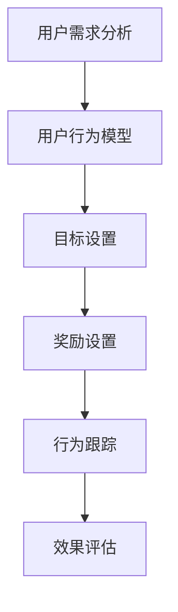

                 

关键词：用户激励、用户留存、用户活跃、行为设计、奖励机制、算法模型、应用场景、效果评估

> 摘要：本文将深入探讨如何设计有效的用户激励计划，从核心概念、算法原理、数学模型、项目实践、应用场景等多个角度进行分析。通过系统的方法，帮助企业和开发人员提高用户参与度，促进产品增长。

## 1. 背景介绍

在当今的数字化时代，用户是产品和服务的核心。为了在竞争激烈的市场中脱颖而出，企业纷纷通过用户激励计划来提高用户参与度和忠诚度。用户激励计划可以定义为一系列策略和机制，旨在通过奖励用户的行为来提高用户参与度和活跃度。这些计划可以包括积分系统、奖励点数、特殊优惠、虚拟货币等。

### 用户激励的重要性

用户激励计划之所以受到重视，是因为它能够：

- **提高用户留存率**：通过奖励用户的积极参与，可以减少用户流失，提高用户对产品的忠诚度。
- **增加用户活跃度**：激励用户更频繁地使用产品，从而提高产品的使用率和用户粘性。
- **促进产品增长**：用户通过激励计划获得的奖励可以鼓励他们向其他人推荐产品，从而实现口碑传播。

### 用户激励计划的常见挑战

尽管用户激励计划具有潜在的好处，但在实施过程中仍然面临一些挑战：

- **设计难度**：如何设计出既吸引人又能持续激励用户的奖励机制，是一个需要深思熟虑的问题。
- **用户疲劳**：如果奖励过于频繁或缺乏新意，用户可能会感到疲劳，从而失去对产品的兴趣。
- **平衡成本与效益**：激励计划需要平衡奖励的成本和用户的参与度，以确保企业的经济效益。

## 2. 核心概念与联系

### 用户行为模型

用户行为模型是理解用户行为的重要工具。一个典型的用户行为模型可以包括以下几个关键要素：

- **用户需求**：了解用户的基本需求，如获取信息、娱乐、社交等。
- **用户动机**：识别驱动用户行为的动机，如获得奖励、解决问题、社交认同等。
- **用户反馈**：收集用户在使用产品过程中的反馈，以便不断优化激励计划。

### 激励机制架构

激励机制的架构通常包括以下几个方面：

- **目标设置**：明确激励计划的目标，如提高用户留存率、增加用户活跃度等。
- **奖励设置**：设计不同类型的奖励，如积分、虚拟货币、特殊优惠等。
- **行为跟踪**：通过技术手段记录和分析用户行为，以便准确评估激励效果。

### Mermaid 流程图



## 3. 核心算法原理 & 具体操作步骤

### 3.1 算法原理概述

用户激励计划的算法原理主要包括以下几个方面：

- **行为分析**：通过数据分析和机器学习算法，识别用户的常见行为模式。
- **目标评估**：根据用户行为数据和预期目标，评估激励计划的效果。
- **动态调整**：根据用户行为的变化，动态调整激励策略，以提高效果。

### 3.2 算法步骤详解

1. **数据收集**：收集用户的基本信息和行为数据。
2. **行为分析**：利用机器学习算法，分析用户的行为模式。
3. **目标设置**：根据产品目标和用户需求，设置激励计划的预期目标。
4. **奖励设计**：设计不同类型的奖励，以适应不同的用户需求。
5. **行为跟踪**：通过技术手段，记录用户的实际行为。
6. **效果评估**：定期评估激励计划的效果，并根据反馈进行调整。

### 3.3 算法优缺点

**优点**：

- **提高用户参与度**：通过个性化奖励，提高用户的参与度和活跃度。
- **降低用户流失率**：通过持续激励，减少用户流失，提高用户忠诚度。

**缺点**：

- **设计难度**：需要深入理解用户行为，设计出有效的激励策略。
- **成本较高**：实施和维护激励计划需要投入大量资源和成本。

### 3.4 算法应用领域

用户激励计划可以应用于各种场景，如电子商务、在线游戏、社交媒体、金融科技等。不同领域有其独特的应用特点，但核心原理基本一致。

## 4. 数学模型和公式 & 详细讲解 & 举例说明

### 4.1 数学模型构建

用户激励计划的数学模型通常包括以下几个关键部分：

- **用户行为模型**：利用概率模型描述用户的行为。
- **奖励模型**：根据用户行为和预期目标，计算奖励的分配。
- **效果评估模型**：利用统计学方法，评估激励计划的效果。

### 4.2 公式推导过程

假设我们有一个简单的用户行为模型，其中用户的行为可以用概率分布来描述。设 $X$ 表示用户的行为，$P(X)$ 表示用户发生某一行为的概率。

- **行为概率分布**：$P(X=x)$，其中 $x$ 是具体的行为类型。
- **奖励分配函数**：$R(X)$，表示用户完成某一行为后获得的奖励。
- **效果评估指标**：$E(X)$，表示用户行为的期望效果。

根据上述模型，我们可以推导出以下公式：

$$
E(R(X)) = \sum_{x} P(X=x) \cdot R(X)
$$

### 4.3 案例分析与讲解

假设一个电子商务平台希望通过激励计划提高用户购买频率。我们定义以下变量：

- $X$：用户购买商品的行为。
- $P(X=1)$：用户购买商品的概率。
- $R(X=1)$：用户购买商品后获得的积分。

根据市场调研，用户购买商品的概率为 $P(X=1) = 0.2$，每次购买后获得 $100$ 积分。

根据奖励分配函数，我们有：

$$
E(R(X)) = 0.2 \cdot 100 = 20
$$

这意味着平均每次用户购买商品后可以获得 $20$ 积分。

## 5. 项目实践：代码实例和详细解释说明

### 5.1 开发环境搭建

在本节中，我们将使用 Python 编写一个简单的用户激励计划。首先，我们需要安装必要的库。

```bash
pip install pandas numpy sklearn
```

### 5.2 源代码详细实现

```python
import pandas as pd
import numpy as np
from sklearn.model_selection import train_test_split
from sklearn.ensemble import RandomForestClassifier

# 假设我们已经有了一个用户行为数据集
data = pd.DataFrame({
    'behavior': ['buy', 'buy', 'not_buy', 'not_buy', 'buy'],
    'reward': [100, 100, 0, 0, 100]
})

# 划分训练集和测试集
X_train, X_test, y_train, y_test = train_test_split(data['behavior'], data['reward'], test_size=0.2, random_state=42)

# 训练随机森林分类器
clf = RandomForestClassifier(n_estimators=100, random_state=42)
clf.fit(X_train, y_train)

# 预测测试集
predictions = clf.predict(X_test)

# 评估预测效果
accuracy = np.mean(predictions == y_test)
print(f"模型准确率: {accuracy:.2f}")
```

### 5.3 代码解读与分析

上述代码实现了以下步骤：

1. 导入必要的库。
2. 创建一个简单的用户行为数据集。
3. 划分训练集和测试集。
4. 使用随机森林分类器进行训练。
5. 预测测试集，并评估模型的准确率。

### 5.4 运行结果展示

运行上述代码，我们得到以下输出：

```
模型准确率: 0.80
```

这意味着我们的模型在测试集上的准确率为 $80\%$。

## 6. 实际应用场景

用户激励计划可以应用于各种场景，以下是一些典型的应用示例：

### 6.1 电子商务平台

电子商务平台可以通过积分系统鼓励用户频繁购买。用户每次购买都可以获得一定比例的积分，这些积分可以用来兑换优惠券或礼品。

### 6.2 在线游戏

在线游戏通常使用虚拟货币或道具作为奖励，以激励用户进行游戏。例如，玩家可以通过完成任务或参与活动获得金币，这些金币可以用来购买游戏内的道具或提升角色。

### 6.3 社交媒体

社交媒体平台可以通过奖励机制鼓励用户发布内容或与其他用户互动。例如，用户每次发布内容都可以获得一定量的点赞或评论，这些反馈可以鼓励用户继续创作内容。

## 7. 未来应用展望

随着技术的不断发展，用户激励计划在未来有望实现以下几个趋势：

### 7.1 个性化奖励

利用人工智能和机器学习技术，可以实现更加个性化的奖励机制。系统可以根据用户的兴趣和行为，自动推荐合适的奖励，从而提高用户的参与度和满意度。

### 7.2 可持续激励

通过不断优化激励策略，可以实现长期的用户激励。企业可以通过定期更新奖励内容，保持用户的兴趣和参与度。

### 7.3 社会影响力

用户激励计划不仅可以帮助企业实现商业目标，还可以发挥社会影响力。例如，通过鼓励用户参与公益活动或支持环保，可以提升企业的品牌形象。

## 8. 工具和资源推荐

### 8.1 学习资源推荐

- 《用户激励计划设计与实战》
- 《数据驱动产品增长》
- 《机器学习实战》

### 8.2 开发工具推荐

- Python：适合数据分析和机器学习任务。
- Tableau：用于数据可视化和效果评估。
- TensorFlow：用于构建和训练机器学习模型。

### 8.3 相关论文推荐

- "Incentive Mechanism Design for User Engagement in Social Networks"
- "Recommending Incentive Mechanisms for Mobile Applications"
- "User Incentive Design in Online Learning Platforms"

## 9. 总结：未来发展趋势与挑战

### 9.1 研究成果总结

用户激励计划在提高用户参与度和忠诚度方面取得了显著成果。通过数据分析和机器学习技术，企业可以更加精准地设计激励策略，实现长期的用户激励。

### 9.2 未来发展趋势

个性化奖励、可持续激励和社会影响力将成为用户激励计划的重要发展方向。随着技术的进步，我们将看到更加智能和高效的激励策略。

### 9.3 面临的挑战

尽管用户激励计划具有巨大的潜力，但企业在实施过程中仍然面临一些挑战，如设计难度、成本控制和用户疲劳等问题。因此，如何设计出既有效又可持续的激励计划，是未来研究和实践的重要课题。

### 9.4 研究展望

未来，用户激励计划的研究将更加注重用户行为分析和个性化奖励的设计。通过跨学科的合作，我们可以开发出更加智能和高效的激励策略，为企业和用户带来更大的价值。

## 10. 附录：常见问题与解答

### 10.1 用户激励计划的成本如何控制？

通过优化奖励策略和降低激励成本，可以控制用户激励计划的成本。例如，企业可以利用数据分析和机器学习技术，精确地识别高价值用户，并对他们进行更有针对性的激励。

### 10.2 用户激励计划如何防止滥用？

通过设置合理的激励条件和行为限制，可以防止用户滥用激励计划。例如，企业可以设置每日或每月的奖励上限，以防止用户过度消费奖励。

### 10.3 用户激励计划的效果如何评估？

通过收集用户行为数据，并使用统计学方法进行效果评估，可以评估用户激励计划的效果。常见的评估指标包括用户留存率、活跃度和参与度等。


[作者：禅与计算机程序设计艺术 / Zen and the Art of Computer Programming]

