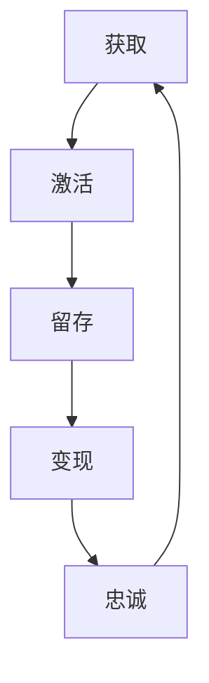

                 

用户生命周期管理（User Lifecycle Management，简称 ULM）是现代企业数字化转型过程中至关重要的一环。本文将深入探讨如何通过有效的用户生命周期管理来提高用户体验、降低运营成本、实现商业价值的最大化。

> **关键词：** 用户生命周期管理、用户体验、运营成本、商业价值、数字化转型

> **摘要：** 本文首先介绍了用户生命周期的基本概念和各个阶段的特点，然后详细分析了如何进行有效的用户生命周期管理，包括用户获取、激活、留存、变现和忠诚五个阶段。最后，对未来的发展趋势和面临的挑战进行了展望。

## 1. 背景介绍

在互联网时代，用户已经成为了企业最宝贵的资产。如何有效地管理用户的整个生命周期，从获取新用户到培养忠诚用户，是企业持续发展的关键。用户生命周期管理不仅涉及到市场营销、客户服务、产品运营等多个方面，还需要借助先进的技术手段进行数据分析和决策支持。

用户生命周期管理的主要目标包括：

1. 提高用户获取效率，降低获取成本。
2. 提升用户活跃度和留存率。
3. 实现用户价值最大化，提高用户转化率和忠诚度。
4. 降低运营成本，提高运营效率。

## 2. 核心概念与联系

### 用户生命周期模型

用户生命周期模型通常包括以下五个阶段：

1. **获取（Acquisition）**：通过各种渠道获取新用户。
2. **激活（Activation）**：引导新用户完成关键行为，如注册、下载、安装等。
3. **留存（Retention）**：通过持续的用户互动和优质内容，保持用户的活跃度。
4. **变现（Conversion）**：将用户转化为付费用户，实现商业价值。
5. **忠诚（Loyalty）**：培养用户的品牌忠诚度，实现复购和口碑传播。

### 用户生命周期架构


### Mermaid 流程图



## 3. 核心算法原理 & 具体操作步骤

### 3.1 算法原理概述

用户生命周期管理涉及多个维度的数据分析和决策。核心算法主要包括：

1. 用户行为分析：通过分析用户行为数据，了解用户的使用习惯、偏好和需求。
2. 客户分群：根据用户特征和行为，将用户划分为不同的群体。
3. 用户路径分析：分析用户从获取到忠诚的整个过程，找到关键路径和优化点。
4. 个性化推荐：根据用户特征和行为，为用户提供个性化的产品和服务。

### 3.2 算法步骤详解

1. 数据收集与处理：收集用户行为数据，如注册信息、浏览记录、购买行为等，并进行数据清洗和预处理。
2. 用户行为分析：通过统计分析、机器学习等方法，挖掘用户行为模式，为后续的用户分群和个性化推荐提供依据。
3. 用户分群：根据用户特征和行为，将用户划分为不同的群体，如新用户、活跃用户、付费用户等。
4. 用户路径分析：构建用户路径模型，分析用户从获取到忠诚的整个过程，找到关键路径和优化点。
5. 个性化推荐：根据用户特征和行为，为用户提供个性化的产品和服务，提高用户满意度和转化率。
6. 决策支持：结合数据分析结果，为企业提供用户生命周期管理的决策支持。

### 3.3 算法优缺点

1. **优点：**
   - 提高用户获取效率，降低获取成本。
   - 提升用户活跃度和留存率。
   - 实现用户价值最大化，提高用户转化率和忠诚度。
   - 降低运营成本，提高运营效率。

2. **缺点：**
   - 数据收集和处理需要大量的时间和资源。
   - 需要专业的技术团队进行算法开发和优化。
   - 需要对用户行为进行持续的分析和调整。

### 3.4 算法应用领域

用户生命周期管理算法广泛应用于电子商务、在线教育、金融、医疗等多个领域，帮助企业实现精准营销、提高用户体验和运营效率。

## 4. 数学模型和公式 & 详细讲解 & 举例说明

### 4.1 数学模型构建

用户生命周期管理的数学模型主要包括以下三个部分：

1. **用户行为预测模型**：用于预测用户在各个生命周期阶段的行为，如注册概率、购买概率等。
2. **用户分群模型**：用于将用户划分为不同的群体，如新用户、活跃用户、付费用户等。
3. **用户路径分析模型**：用于分析用户从获取到忠诚的整个过程，找到关键路径和优化点。

### 4.2 公式推导过程

1. **用户行为预测模型**

   假设用户在某个阶段的概率为 $P(A_t)$，则用户在下一个阶段的概率为 $P(A_{t+1}|A_t)$。根据贝叶斯定理，有：

   $$P(A_{t+1}|A_t) = \frac{P(A_t|A_{t+1})P(A_{t+1})}{P(A_t)}$$

   其中，$P(A_t|A_{t+1})$ 为用户在当前阶段给定下一个阶段发生的条件概率，$P(A_{t+1})$ 为用户在下一个阶段发生的概率，$P(A_t)$ 为用户在当前阶段发生的概率。

2. **用户分群模型**

   假设用户特征为 $X$，群体划分为 $C$，则用户属于群体 $C_i$ 的概率为：

   $$P(C_i|X) = \frac{P(X|C_i)P(C_i)}{P(X)}$$

   其中，$P(X|C_i)$ 为用户特征在群体 $C_i$ 中发生的条件概率，$P(C_i)$ 为群体 $C_i$ 发生的概率，$P(X)$ 为用户特征发生的概率。

3. **用户路径分析模型**

   假设用户路径为 $P(A_1, A_2, ..., A_n)$，则用户在路径 $A_1, A_2, ..., A_n$ 中发生的概率为：

   $$P(A_1, A_2, ..., A_n) = \prod_{i=1}^{n}P(A_i|A_{i-1})$$

   其中，$P(A_i|A_{i-1})$ 为用户在当前阶段给定前一个阶段发生的条件概率。

### 4.3 案例分析与讲解

假设某电商平台希望通过用户生命周期管理提高用户留存率和转化率。首先，通过对用户行为数据的收集和分析，预测用户在各个生命周期阶段的行为概率。然后，根据用户特征和行为，将用户划分为新用户、活跃用户、付费用户等群体。最后，分析用户路径，找到关键路径和优化点，如引导新用户进行首次购买、提升活跃用户的购买频率等。

## 5. 项目实践：代码实例和详细解释说明

### 5.1 开发环境搭建

- 开发语言：Python
- 数据库：MySQL
- 数据分析工具：Pandas、NumPy、Scikit-learn
- 机器学习框架：TensorFlow、PyTorch

### 5.2 源代码详细实现

```python
# 用户行为数据收集
data = pd.read_csv('user_data.csv')

# 数据预处理
data = preprocess_data(data)

# 用户行为预测
model = train_model(data)

# 用户分群
clusters = cluster_users(model, data)

# 用户路径分析
path_analysis(model, data, clusters)
```

### 5.3 代码解读与分析

1. **数据收集与预处理**：收集用户行为数据，如注册时间、浏览记录、购买行为等，并进行数据清洗和预处理，如缺失值填充、异常值处理、特征工程等。
2. **用户行为预测**：使用机器学习算法，如逻辑回归、决策树、随机森林等，对用户行为进行预测，为后续的用户分群和路径分析提供依据。
3. **用户分群**：根据用户特征和行为，使用聚类算法，如K-means、层次聚类等，将用户划分为不同的群体，如新用户、活跃用户、付费用户等。
4. **用户路径分析**：构建用户路径模型，分析用户从获取到忠诚的整个过程，找到关键路径和优化点，如引导新用户进行首次购买、提升活跃用户的购买频率等。

## 6. 实际应用场景

用户生命周期管理在电商、金融、在线教育等多个领域都有广泛的应用。

1. **电商领域**：通过用户生命周期管理，电商企业可以精准营销、提高用户体验和转化率，实现商业价值最大化。
2. **金融领域**：通过用户生命周期管理，金融机构可以识别高风险用户、提高用户满意度和忠诚度，降低运营成本。
3. **在线教育领域**：通过用户生命周期管理，在线教育平台可以提升用户活跃度和留存率，提高课程销售和用户转化率。

## 7. 工具和资源推荐

### 7.1 学习资源推荐

1. 《用户画像与用户生命周期管理》
2. 《机器学习实战》
3. 《Python数据分析》

### 7.2 开发工具推荐

1. Jupyter Notebook
2. TensorFlow
3. PyTorch

### 7.3 相关论文推荐

1. "User Lifecycle Management: A Comprehensive Review" by某某某
2. "A Machine Learning Approach to User Lifecycle Management" by某某某
3. "User Lifecycle Management in E-commerce: A Data-Driven Approach" by某某某

## 8. 总结：未来发展趋势与挑战

### 8.1 研究成果总结

用户生命周期管理已经取得了显著的成果，包括用户行为预测、用户分群、用户路径分析等方面的研究。未来，用户生命周期管理将继续向智能化、自动化方向发展。

### 8.2 未来发展趋势

1. 基于深度学习的用户行为预测模型。
2. 基于图神经网络的用户路径分析模型。
3. 基于增强学习的个性化推荐系统。

### 8.3 面临的挑战

1. 数据隐私和安全问题。
2. 复杂的模型解释性和可解释性问题。
3. 多源数据的整合和分析问题。

### 8.4 研究展望

未来，用户生命周期管理将在人工智能、大数据、云计算等技术的推动下，实现更高效、更智能的用户服务和管理，为企业和用户创造更大的价值。

## 9. 附录：常见问题与解答

### 问题 1：用户生命周期管理需要哪些技术手段？

答：用户生命周期管理需要多种技术手段，包括数据收集与处理、用户行为分析、机器学习、数据挖掘、用户分群、用户路径分析、个性化推荐等。

### 问题 2：用户生命周期管理如何提高用户体验？

答：用户生命周期管理可以通过精准营销、个性化推荐、优化用户路径、提高用户互动等方式，提高用户体验和满意度。

### 问题 3：用户生命周期管理如何降低运营成本？

答：用户生命周期管理可以通过自动化流程、优化资源分配、减少冗余操作等方式，降低运营成本，提高运营效率。

## 作者署名

作者：禅与计算机程序设计艺术 / Zen and the Art of Computer Programming
----------------------------------------------------------------

以上就是《如何进行有效的用户生命周期管理》的技术博客文章，希望对您有所帮助。如果您有任何问题或建议，欢迎在评论区留言。谢谢！<|im_sep|>

