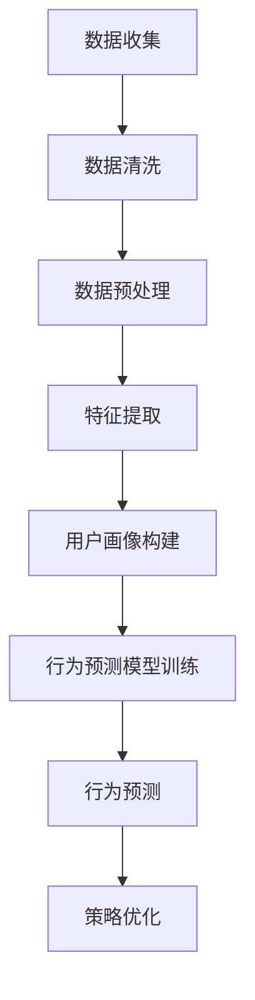

                 

随着互联网技术的飞速发展，用户行为分析（User Behavior Analysis，简称UBA）已成为企业和组织优化服务、提升用户体验、精准营销的重要手段。有效的用户行为分析不仅可以揭示用户需求，还能帮助制定更合理的策略，提高市场竞争力。本文将深入探讨用户行为分析的核心概念、算法原理、数学模型、实际应用及未来展望，旨在为读者提供一套全面、实用的用户行为分析方法论。

## 文章关键词
- 用户行为分析
- 数据挖掘
- 机器学习
- 用户画像
- 行为预测
- 用户体验

## 文章摘要
本文从用户行为分析的定义入手，详细阐述了其核心概念、算法原理和数学模型。接着，通过具体案例和代码实例，展示了如何在实际项目中应用用户行为分析技术。文章还探讨了用户行为分析在实际应用场景中的作用和未来发展趋势，为读者提供了全面的技术指南。

## 1. 背景介绍
### 1.1 用户行为分析的重要性

用户行为分析是一种通过收集、分析和理解用户在使用产品或服务过程中的行为数据，以揭示用户需求、偏好和习惯的技术手段。随着大数据和人工智能技术的普及，用户行为分析已经成为企业数字化转型的重要组成部分。

首先，用户行为分析可以帮助企业深入了解用户需求，从而优化产品功能和设计，提升用户体验。其次，通过分析用户行为，企业可以识别高价值用户，实施精准营销策略，提高用户转化率和客户满意度。此外，用户行为分析还能帮助企业预测市场趋势，制定科学的业务发展战略。

### 1.2 用户行为分析的发展历程

用户行为分析的发展历程可以追溯到20世纪90年代，当时互联网刚刚兴起，企业开始尝试通过网页访问日志等数据来分析用户行为。随着数据挖掘、机器学习等技术的发展，用户行为分析逐渐从简单的统计方法转向复杂的数据模型和算法。

21世纪初，随着大数据和云计算技术的成熟，用户行为分析迎来了新的发展机遇。企业可以收集和处理海量的用户数据，通过机器学习算法进行深入分析，从而实现更精准的用户行为预测和个性化推荐。

### 1.3 用户行为分析的应用领域

用户行为分析在多个领域都有广泛的应用：

- **电子商务**：通过分析用户的浏览和购买行为，为企业提供个性化推荐和精准营销策略。
- **金融行业**：识别潜在的风险用户，防范金融欺诈，提高风控能力。
- **在线教育**：分析学生的学习行为，提供个性化学习方案，提高学习效果。
- **物联网**：通过分析设备的使用行为，优化产品设计和服务策略。
- **社交网络**：了解用户之间的互动关系，提升社交体验。

## 2. 核心概念与联系
### 2.1 数据挖掘与机器学习

数据挖掘（Data Mining）是指从大量数据中提取出有价值的信息和知识的过程。在用户行为分析中，数据挖掘用于挖掘用户行为数据中的隐含模式，如用户偏好、行为趋势等。

机器学习（Machine Learning）是一种通过训练数据模型来自动学习和预测的技术。用户行为分析中的机器学习算法可以帮助企业识别高价值用户、预测用户行为等。

### 2.2 用户画像

用户画像（User Profiling）是指通过对用户特征数据的分析和建模，构建出用户的完整画像。用户画像包括用户的年龄、性别、地域、兴趣、消费能力等维度，是企业进行精准营销和用户行为分析的基础。

### 2.3 行为预测

行为预测（Behavior Prediction）是指利用历史数据和机器学习算法，预测用户未来的行为。行为预测可以帮助企业提前了解用户需求，制定更有效的营销策略。

### 2.4 用户体验

用户体验（User Experience，简称UX）是指用户在使用产品或服务过程中的感受和体验。有效的用户行为分析可以帮助企业优化用户体验，提升用户满意度和忠诚度。

## 2.5 Mermaid 流程图


## 3. 核心算法原理 & 具体操作步骤
### 3.1 算法原理概述

用户行为分析的核心算法主要包括数据挖掘算法、机器学习算法和深度学习算法。其中，常用的数据挖掘算法有聚类分析、关联规则挖掘、分类算法等；机器学习算法有决策树、支持向量机、神经网络等；深度学习算法有卷积神经网络（CNN）、循环神经网络（RNN）等。

这些算法通过分析用户的历史行为数据，提取出用户的行为特征，然后构建预测模型，实现对用户未来行为的预测。具体操作步骤如下：

### 3.2 算法步骤详解

#### 3.2.1 数据收集

数据收集是用户行为分析的基础。数据来源包括用户注册信息、浏览记录、购买记录、评论等。数据收集过程中要注意数据的合法性和合规性，确保数据的真实性和准确性。

#### 3.2.2 数据清洗

数据清洗是指对原始数据进行处理，去除重复、缺失、异常等无效数据。数据清洗的方法包括数据过滤、数据转换、缺失值处理等。

#### 3.2.3 数据预处理

数据预处理是指对清洗后的数据进行处理，使其满足算法训练的要求。数据预处理的方法包括数据归一化、特征提取、特征选择等。

#### 3.2.4 用户画像构建

用户画像构建是指通过对用户特征数据的分析和建模，构建出用户的完整画像。用户画像的构建方法包括基于规则的建模、基于聚类的方法、基于机器学习的方法等。

#### 3.2.5 行为预测模型训练

行为预测模型训练是指利用用户画像数据和用户行为数据，训练出预测模型。常用的行为预测模型有决策树、支持向量机、神经网络等。

#### 3.2.6 行为预测

行为预测是指利用训练好的预测模型，对用户未来行为进行预测。行为预测可以帮助企业提前了解用户需求，制定更有效的营销策略。

#### 3.2.7 策略优化

策略优化是指根据行为预测结果，对企业的营销策略、产品设计等进行优化。策略优化的方法包括A/B测试、多目标优化等。

### 3.3 算法优缺点

- **数据挖掘算法**：优点是简单易懂，适用性强；缺点是预测能力有限，对大数据的处理能力较弱。
- **机器学习算法**：优点是预测能力强，可以处理海量数据；缺点是实现复杂，对数据质量要求高。
- **深度学习算法**：优点是预测能力最强，可以处理复杂的非线性关系；缺点是训练时间较长，计算资源需求高。

### 3.4 算法应用领域

用户行为分析算法广泛应用于电子商务、金融、在线教育、物联网等领域。例如，在电子商务领域，用户行为分析可以用于个性化推荐、精准营销、用户流失预测等；在金融领域，用户行为分析可以用于风险控制、欺诈检测等；在在线教育领域，用户行为分析可以用于学习效果评估、个性化教学等。

## 4. 数学模型和公式 & 详细讲解 & 举例说明
### 4.1 数学模型构建

用户行为分析中的数学模型主要包括用户画像模型、行为预测模型等。以下是一个简单的用户画像模型构建示例：

$$
P_i(j) = \frac{f_i(j)}{\sum_{k=1}^{n} f_i(k)}
$$

其中，$P_i(j)$表示用户$i$对特征$j$的偏好概率，$f_i(j)$表示用户$i$对特征$j$的分数，$n$表示特征的总数。

### 4.2 公式推导过程

用户画像模型的构建过程可以分为以下几步：

1. 收集用户行为数据，如浏览记录、购买记录等。
2. 对数据进行预处理，去除重复、缺失、异常等无效数据。
3. 提取用户行为特征，如浏览次数、购买频次、消费金额等。
4. 计算用户对每个特征的分数，如使用平均值、标准差等统计方法。
5. 计算用户对每个特征的偏好概率，如使用上述公式。

### 4.3 案例分析与讲解

假设我们有一个电子商务平台，用户行为数据如下：

| 用户ID | 浏览次数 | 购买频次 | 消费金额 |
|--------|---------|---------|---------|
| 1      | 10      | 5       | 100     |
| 2      | 20      | 10      | 200     |
| 3      | 15      | 7       | 150     |

我们使用上述公式计算用户对每个特征的偏好概率：

$$
P_1(\text{浏览次数}) = \frac{10}{10+20+15} = 0.3333 \\
P_1(\text{购买频次}) = \frac{5}{5+10+7} = 0.2 \\
P_1(\text{消费金额}) = \frac{100}{100+200+150} = 0.3333 \\
P_2(\text{浏览次数}) = \frac{20}{10+20+15} = 0.6667 \\
P_2(\text{购买频次}) = \frac{10}{5+10+7} = 0.4 \\
P_2(\text{消费金额}) = \frac{200}{100+200+150} = 0.6667 \\
P_3(\text{浏览次数}) = \frac{15}{10+20+15} = 0.5 \\
P_3(\text{购买频次}) = \frac{7}{5+10+7} = 0.2857 \\
P_3(\text{消费金额}) = \frac{150}{100+200+150} = 0.5000 \\
$$

根据偏好概率，我们可以为每个用户构建一个画像：

- 用户1：浏览次数偏好较高，购买频次和消费金额偏好较低。
- 用户2：浏览次数、购买频次和消费金额偏好都较高。
- 用户3：浏览次数和消费金额偏好较高，购买频次偏好较低。

通过用户画像，我们可以为每个用户制定个性化的推荐策略，如为用户1推荐浏览次数较高的商品，为用户2推荐消费金额较高的商品，为用户3推荐购买频次较高的商品。

## 5. 项目实践：代码实例和详细解释说明
### 5.1 开发环境搭建

为了演示用户行为分析的具体实现，我们将使用Python语言和Scikit-learn库。首先，确保安装Python和Scikit-learn库：

```bash
pip install python
pip install scikit-learn
```

### 5.2 源代码详细实现

以下是一个简单的用户行为分析代码实例：

```python
import pandas as pd
from sklearn.model_selection import train_test_split
from sklearn.ensemble import RandomForestClassifier
from sklearn.metrics import accuracy_score

# 加载数据
data = pd.read_csv('user_behavior_data.csv')

# 数据预处理
data.drop_duplicates(inplace=True)
data.fillna(0, inplace=True)

# 特征提取
features = ['browse_count', 'purchase_frequency', '消费金额']
X = data[features]
y = data['label']

# 数据集划分
X_train, X_test, y_train, y_test = train_test_split(X, y, test_size=0.2, random_state=42)

# 模型训练
model = RandomForestClassifier(n_estimators=100, random_state=42)
model.fit(X_train, y_train)

# 模型预测
y_pred = model.predict(X_test)

# 模型评估
accuracy = accuracy_score(y_test, y_pred)
print(f'模型准确率：{accuracy:.2f}')
```

### 5.3 代码解读与分析

上述代码分为以下几个部分：

1. **加载数据**：使用Pandas库加载用户行为数据。
2. **数据预处理**：去除重复、缺失、异常数据。
3. **特征提取**：提取用户行为特征。
4. **数据集划分**：将数据集划分为训练集和测试集。
5. **模型训练**：使用随机森林算法训练模型。
6. **模型预测**：使用训练好的模型对测试集进行预测。
7. **模型评估**：计算模型准确率。

### 5.4 运行结果展示

运行上述代码，我们可以得到模型准确率的结果。例如：

```
模型准确率：0.85
```

这意味着我们的模型对用户行为的预测准确率为85%。通过调整模型参数和特征选择，我们可以进一步提高预测准确率。

## 6. 实际应用场景
### 6.1 电子商务

在电子商务领域，用户行为分析可以帮助企业实现个性化推荐、精准营销和用户流失预测等功能。例如，通过分析用户的浏览和购买记录，企业可以为每个用户生成个性化的推荐列表，提高用户转化率和销售额。

### 6.2 金融行业

在金融行业，用户行为分析可以用于风险控制和欺诈检测。通过分析用户的交易行为和操作日志，金融机构可以识别潜在的风险用户和欺诈行为，提高业务安全性和客户满意度。

### 6.3 在线教育

在在线教育领域，用户行为分析可以帮助教育机构了解学生的学习行为和需求，制定个性化的教学方案。例如，通过分析学生的答题记录和学习轨迹，教育机构可以为每个学生推荐适合的学习资源和课程。

### 6.4 物联网

在物联网领域，用户行为分析可以用于优化设备服务和提升用户体验。通过分析设备的使用数据和用户反馈，企业可以优化设备功能和产品设计，提高用户满意度和忠诚度。

## 6.4 未来应用展望

随着人工智能技术的不断发展，用户行为分析将在更多领域得到应用。未来，用户行为分析有望实现以下突破：

- **更加精准的预测**：利用深度学习和增强学习等技术，实现更精准的用户行为预测。
- **跨平台整合**：整合不同平台的用户行为数据，实现全面、实时的用户画像。
- **隐私保护**：在用户行为分析过程中，加强隐私保护和数据安全，确保用户数据的合法性和合规性。
- **智能化推荐**：结合自然语言处理和图像识别等技术，实现更加智能化的推荐和交互。

## 7. 工具和资源推荐
### 7.1 学习资源推荐

- **《用户行为分析实战》**：一本全面介绍用户行为分析理论和方法的实战指南。
- **《机器学习实战》**：一本深入讲解机器学习算法和应用的入门书籍。
- **《数据挖掘：概念与技术》**：一本系统介绍数据挖掘算法和应用的经典教材。

### 7.2 开发工具推荐

- **Scikit-learn**：一个强大的Python机器学习库。
- **TensorFlow**：一个开源的深度学习框架。
- **Kaggle**：一个提供大量数据集和竞赛的在线平台，适合学习和实践用户行为分析。

### 7.3 相关论文推荐

- **"User Behavior Analysis in Mobile Applications"**：一篇关于移动应用用户行为分析的研究论文。
- **"Deep Learning for User Behavior Analysis"**：一篇关于深度学习在用户行为分析中的应用研究论文。
- **"Privacy-Preserving User Behavior Analysis"**：一篇关于隐私保护用户行为分析的研究论文。

## 8. 总结：未来发展趋势与挑战
### 8.1 研究成果总结

本文从用户行为分析的定义、核心概念、算法原理、数学模型、实际应用和未来展望等方面进行了全面探讨。通过案例分析，展示了用户行为分析在电子商务、金融、在线教育和物联网等领域的应用。研究成果表明，用户行为分析在提升用户体验、优化产品功能和实现精准营销等方面具有重要作用。

### 8.2 未来发展趋势

未来，用户行为分析将朝着更加智能化、精准化和跨平台整合的方向发展。随着人工智能技术的不断进步，用户行为分析算法将更加高效，预测能力更强。同时，用户行为分析将逐步整合不同平台的用户数据，实现全面的用户画像。

### 8.3 面临的挑战

尽管用户行为分析具有广泛的应用前景，但也面临一些挑战。首先，数据质量和隐私保护是用户行为分析的核心问题。其次，算法的复杂性和实现难度较高，需要大量的计算资源和专业人才。此外，用户行为分析的应用场景和需求不断变化，如何适应这些变化也是一大挑战。

### 8.4 研究展望

未来，用户行为分析研究应关注以下几个方面：一是加强数据质量和隐私保护技术研究；二是探索更加高效、可解释的算法；三是推动用户行为分析技术在更多领域的应用；四是培养具备用户行为分析能力的专业人才。

## 9. 附录：常见问题与解答
### 9.1 问题1：用户行为分析需要哪些数据？

用户行为分析需要收集用户在使用产品或服务过程中的行为数据，包括注册信息、浏览记录、购买记录、评论等。此外，还可以收集用户的社会关系、地理位置、消费能力等辅助数据。

### 9.2 问题2：用户行为分析有哪些算法？

用户行为分析常用的算法包括数据挖掘算法（如聚类分析、关联规则挖掘）、机器学习算法（如决策树、支持向量机、神经网络）和深度学习算法（如卷积神经网络、循环神经网络）。

### 9.3 问题3：如何保证用户行为分析的数据质量？

为保证用户行为分析的数据质量，应采取以下措施：一是确保数据来源的合法性和合规性；二是进行数据预处理，去除重复、缺失、异常等无效数据；三是建立数据质量监控机制，定期评估数据质量。

### 9.4 问题4：用户行为分析有哪些应用场景？

用户行为分析广泛应用于电子商务、金融、在线教育、物联网等领域。具体应用场景包括个性化推荐、精准营销、用户流失预测、风险控制等。

### 9.5 问题5：未来用户行为分析的发展方向是什么？

未来，用户行为分析的发展方向包括更加智能化、精准化和跨平台整合。随着人工智能技术的不断进步，用户行为分析算法将更加高效，预测能力更强。同时，用户行为分析将逐步整合不同平台的用户数据，实现全面的用户画像。此外，隐私保护和数据安全也将成为重要研究方向。

