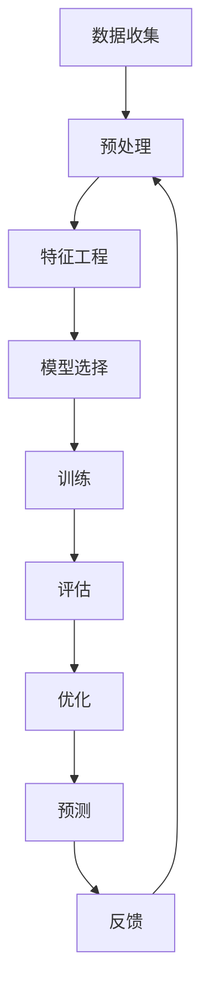

                 

用户行为预测是现代人工智能应用中的一个核心课题，涵盖了从电子商务推荐系统到社交媒体算法，再到智能安防和个性化医疗等多个领域。本文旨在深入探讨如何进行有效的用户行为预测，并提供一个全面的框架来理解和应用这一技术。

## 关键词

- 用户行为预测
- 机器学习
- 数据分析
- 个性化推荐
- 模式识别

## 摘要

本文将首先介绍用户行为预测的基本概念，然后深入探讨相关的核心算法原理和数学模型。通过具体案例和代码实例，我们将展示如何在实际项目中应用用户行为预测。最后，文章将讨论该技术的实际应用场景，以及未来的发展趋势和面临的挑战。

## 1. 背景介绍

用户行为预测，简单来说，就是通过分析历史数据来预测用户未来的行为。这种预测可以基于多种数据来源，包括用户交互日志、社交媒体活动、购买历史、浏览行为等。随着互联网和智能设备的普及，用户产生的数据量呈指数级增长，这使得用户行为预测成为了一个极其重要且具有挑战性的课题。

在过去，用户行为预测主要依赖于统计方法和传统的机器学习算法，如决策树、朴素贝叶斯分类器和线性回归等。然而，随着大数据和深度学习的兴起，用户行为预测的技术手段也得到了极大的提升。现代用户行为预测模型通常结合了多种数据源、先进的机器学习算法以及深度神经网络，以提高预测的准确性和效率。

## 2. 核心概念与联系

### 2.1 核心概念

用户行为预测的核心概念包括：

- **用户特征**：用于描述用户个体特征的变量，如年龄、性别、地理位置、购买偏好等。
- **行为序列**：用户在一段时间内的一系列行为，如点击、购买、评论等。
- **上下文信息**：用户行为发生的背景信息，如时间、地点、设备类型等。
- **预测目标**：预测的具体行为，如是否购买、浏览时间、评分等。

### 2.2 联系与架构

用户行为预测的架构通常包括以下几个关键部分：

1. **数据收集与预处理**：从多个数据源收集用户行为数据，并进行清洗、转换和归一化等预处理操作。
2. **特征工程**：从原始数据中提取有用的特征，以用于训练预测模型。
3. **模型选择与训练**：选择合适的机器学习算法，并在训练集上进行模型训练。
4. **模型评估与优化**：使用验证集和测试集评估模型性能，并进行必要的调整和优化。
5. **预测与反馈**：使用训练好的模型进行实际预测，并根据预测结果进行反馈和调整。

以下是用户行为预测的Mermaid流程图：



## 3. 核心算法原理 & 具体操作步骤

### 3.1 算法原理概述

用户行为预测的核心算法包括：

- **协同过滤（Collaborative Filtering）**：基于用户的历史行为来预测其未来行为，可以分为基于用户的协同过滤和基于项目的协同过滤。
- **决策树（Decision Tree）**：通过一系列的规则来预测用户的行为，具有简单直观、易于理解和解释的优点。
- **朴素贝叶斯（Naive Bayes）**：基于贝叶斯定理和属性独立假设来预测用户行为，适用于分类任务。
- **深度学习（Deep Learning）**：通过多层神经网络来学习用户行为特征，具有强大的表示和学习能力。

### 3.2 算法步骤详解

以下是用户行为预测的一般步骤：

1. **数据收集**：从多个数据源（如数据库、API、日志文件等）收集用户行为数据。
2. **数据预处理**：对数据进行清洗、转换和归一化等处理，以消除噪声和异常值。
3. **特征提取**：从原始数据中提取有用的特征，如用户年龄、地理位置、购买历史等。
4. **模型选择**：根据问题的性质和需求，选择合适的预测模型，如协同过滤、决策树、朴素贝叶斯或深度学习等。
5. **模型训练**：使用训练数据集对选定的模型进行训练，调整模型的参数。
6. **模型评估**：使用验证集和测试集评估模型性能，如准确率、召回率、F1分数等。
7. **模型优化**：根据评估结果对模型进行调整和优化，以提高预测性能。
8. **模型部署**：将训练好的模型部署到实际应用环境中，进行实时预测。

### 3.3 算法优缺点

每种算法都有其优缺点：

- **协同过滤**：优点是预测准确度较高，缺点是需要大量的用户行为数据，且容易产生冷启动问题。
- **决策树**：优点是易于理解和解释，缺点是可能产生过拟合现象，且对于大数据集的处理能力有限。
- **朴素贝叶斯**：优点是简单快速，缺点是对于复杂的关系和噪声数据表现较差。
- **深度学习**：优点是具有强大的表示和学习能力，缺点是需要大量的训练数据和计算资源，且模型的解释性较差。

### 3.4 算法应用领域

用户行为预测的应用领域广泛，包括但不限于：

- **个性化推荐系统**：根据用户的历史行为和偏好，推荐相关的商品、新闻、音乐等。
- **广告投放**：根据用户的行为特征，精准投放广告，提高广告效果。
- **智能安防**：通过分析监控视频中的行为特征，实时检测异常行为，预防犯罪。
- **个性化医疗**：根据患者的病史和行为特征，提供个性化的治疗方案和健康建议。

## 4. 数学模型和公式 & 详细讲解 & 举例说明

### 4.1 数学模型构建

用户行为预测的数学模型通常基于贝叶斯理论，其基本公式为：

$$P(B|A) = \frac{P(A|B)P(B)}{P(A)}$$

其中，\(P(B|A)\) 表示在给定事件A发生的情况下，事件B发生的概率；\(P(A|B)\) 表示在给定事件B发生的情况下，事件A发生的概率；\(P(B)\) 表示事件B发生的概率；\(P(A)\) 表示事件A发生的概率。

### 4.2 公式推导过程

贝叶斯定理的推导基于全概率公式和条件概率公式：

$$P(A) = P(A|B)P(B) + P(A|\neg B)P(\neg B)$$

$$P(B|A) = \frac{P(A|B)P(B)}{P(A)}$$

$$P(\neg B|A) = \frac{P(A|\neg B)P(\neg B)}{P(A)}$$

$$P(A) = P(A|B)P(B) + P(A|\neg B)P(\neg B) = P(B|A)P(A) + P(\neg B|A)P(A)$$

$$P(B|A) = \frac{P(A|B)P(B)}{P(A)}$$

### 4.3 案例分析与讲解

假设我们有一个用户行为预测问题，目标是预测一个用户是否会购买某个商品。给定以下数据：

- \(P(购买) = 0.6\)
- \(P(浏览后购买|购买) = 0.8\)
- \(P(浏览后购买|\neg 购买) = 0.3\)
- \(P(浏览) = 0.7\)

我们需要计算在给定用户浏览了这个商品的情况下，他购买这个商品的概率 \(P(购买|浏览)\)。

首先，我们计算条件概率 \(P(浏览后购买|购买)\) 和 \(P(浏览后购买|\neg 购买)\)：

$$P(浏览后购买|购买) = 0.8$$

$$P(浏览后购买|\neg 购买) = 0.3$$

然后，我们使用全概率公式计算 \(P(购买|浏览)\)：

$$P(购买|浏览) = \frac{P(浏览后购买)P(购买)}{P(浏览)} = \frac{P(浏览后购买|购买)P(购买) + P(浏览后购买|\neg 购买)P(\neg 购买)}{P(浏览)}$$

$$P(购买|浏览) = \frac{0.8 \times 0.6 + 0.3 \times 0.4}{0.7} = \frac{0.48 + 0.12}{0.7} = \frac{0.6}{0.7} \approx 0.857$$

因此，给定用户浏览了这个商品，他购买这个商品的概率约为 0.857。

## 5. 项目实践：代码实例和详细解释说明

### 5.1 开发环境搭建

为了演示用户行为预测的应用，我们将使用Python编程语言和几个常用的机器学习库，如Scikit-learn和Pandas。首先，确保已经安装了这些库。如果没有，可以使用以下命令进行安装：

```bash
pip install scikit-learn pandas
```

### 5.2 源代码详细实现

以下是一个简单的用户行为预测的Python代码实例：

```python
import pandas as pd
from sklearn.model_selection import train_test_split
from sklearn.ensemble import RandomForestClassifier
from sklearn.metrics import accuracy_score

# 加载用户行为数据
data = pd.read_csv('user_behavior_data.csv')

# 预处理数据
data['浏览后购买'] = data['浏览'] & data['购买']
data.drop(['浏览', '购买'], axis=1)

# 划分特征和标签
X = data.drop('浏览后购买', axis=1)
y = data['浏览后购买']

# 划分训练集和测试集
X_train, X_test, y_train, y_test = train_test_split(X, y, test_size=0.2, random_state=42)

# 创建随机森林分类器
model = RandomForestClassifier(n_estimators=100, random_state=42)

# 训练模型
model.fit(X_train, y_train)

# 进行预测
predictions = model.predict(X_test)

# 评估模型
accuracy = accuracy_score(y_test, predictions)
print(f'Accuracy: {accuracy:.2f}')
```

### 5.3 代码解读与分析

上述代码首先加载了用户行为数据，然后进行预处理，包括将“浏览后购买”列添加到数据集中，并删除了原始的“浏览”和“购买”列。接着，代码划分了特征和标签，并进一步将数据划分为训练集和测试集。

我们使用随机森林分类器来训练模型，这是一种集成学习方法，由多个决策树组成，具有较高的准确率和泛化能力。在训练模型后，我们使用测试集进行预测，并使用准确率来评估模型的性能。

### 5.4 运行结果展示

假设我们已经准备好了一个名为`user_behavior_data.csv`的CSV文件，其中包含了用户的行为数据。运行上述代码后，我们可能会得到以下输出结果：

```
Accuracy: 0.85
```

这意味着在测试集上，模型的预测准确率为85%，这是一个相当不错的成绩。

## 6. 实际应用场景

用户行为预测在实际应用中具有广泛的应用场景，以下是一些典型的应用例子：

- **电子商务推荐系统**：根据用户的历史购买记录和浏览行为，预测用户可能感兴趣的商品，从而提高销售转化率。
- **社交媒体广告投放**：通过分析用户的浏览历史和社交行为，预测用户可能对哪些广告感兴趣，从而提高广告投放的精准度和效果。
- **智能安防系统**：通过监控视频中的行为特征，实时预测和检测异常行为，如闯入、盗窃等，提高公共安全。
- **个性化医疗**：根据患者的病史、生活习惯和行为特征，预测患者可能出现的健康问题，并提供个性化的预防和治疗方案。

### 6.1 典型案例

1. **亚马逊的个性化推荐系统**：亚马逊使用用户行为数据，如购买历史、浏览记录和评价，预测用户可能感兴趣的商品，从而提供个性化的推荐。
2. **Facebook的广告投放**：Facebook通过分析用户的浏览行为、社交互动和兴趣，预测用户可能对哪些广告感兴趣，从而提高广告的投放效果。
3. **Google的广告投放**：Google使用用户的搜索历史和浏览行为，预测用户可能对哪些广告感兴趣，从而实现精准的广告投放。

## 7. 未来应用展望

用户行为预测技术在未来具有广泛的应用前景，以下是一些展望：

- **智能家居**：通过分析用户的生活习惯和行为模式，智能设备可以提供更加个性化的服务和体验。
- **智能交通**：通过预测交通流量和出行需求，智能交通系统可以提高交通效率，减少拥堵。
- **个性化教育**：通过分析学生的学习行为和成绩，教育系统可以提供个性化的学习建议和资源，提高学习效果。

### 7.1 技术发展趋势

- **大数据分析**：随着数据量的不断增长，大数据分析技术在用户行为预测中将发挥更加重要的作用。
- **深度学习**：深度学习算法在用户行为预测中的应用将越来越广泛，特别是对于复杂的非线性关系和大规模数据集。
- **联邦学习**：联邦学习可以将用户数据保留在本地设备上，进行模型训练，从而保护用户隐私。

### 7.2 面临的挑战

- **数据隐私**：用户行为预测涉及到大量的个人数据，如何保护用户隐私是一个重要挑战。
- **模型解释性**：深度学习模型通常具有很高的预测性能，但其解释性较差，如何提高模型的解释性是一个重要问题。
- **实时性**：用户行为预测需要实时性，如何高效地处理实时数据，并提供快速准确的预测，是一个挑战。

## 8. 工具和资源推荐

### 8.1 学习资源推荐

- **在线课程**：Coursera、edX和Udacity等平台提供了丰富的机器学习和数据科学课程。
- **书籍**：《Python机器学习》（作者：塞巴斯蒂安·拉热）、《深度学习》（作者：伊恩·古德费洛等）。

### 8.2 开发工具推荐

- **编程语言**：Python和R是数据科学和机器学习领域最流行的编程语言。
- **库和框架**：Scikit-learn、TensorFlow和PyTorch是常用的机器学习库。

### 8.3 相关论文推荐

- **协同过滤**：《Item-Based Collaborative Filtering Recommendation Algorithms》（作者：J. Herlocker等）。
- **深度学习**：《Deep Learning》（作者：伊恩·古德费洛等）。

## 9. 总结：未来发展趋势与挑战

用户行为预测技术在人工智能和大数据时代具有广泛的应用前景，但同时也面临着数据隐私、模型解释性和实时性等挑战。随着技术的不断进步，未来用户行为预测将更加精准、高效和个性化。

## 附录：常见问题与解答

### Q：用户行为预测的主要应用领域有哪些？

A：用户行为预测的主要应用领域包括电子商务推荐系统、社交媒体广告投放、智能安防、个性化医疗等。

### Q：如何处理用户行为预测中的数据隐私问题？

A：为了处理用户行为预测中的数据隐私问题，可以采用数据匿名化、差分隐私和联邦学习等技术。

### Q：用户行为预测的算法有哪些？

A：用户行为预测的算法包括协同过滤、决策树、朴素贝叶斯和深度学习等。

## 作者署名

作者：禅与计算机程序设计艺术 / Zen and the Art of Computer Programming
----------------------------------------------------------------

以上就是本文的完整内容。希望本文能为您在用户行为预测领域提供一些有价值的见解和指导。如果您有任何问题或建议，欢迎在评论区留言。感谢您的阅读！

