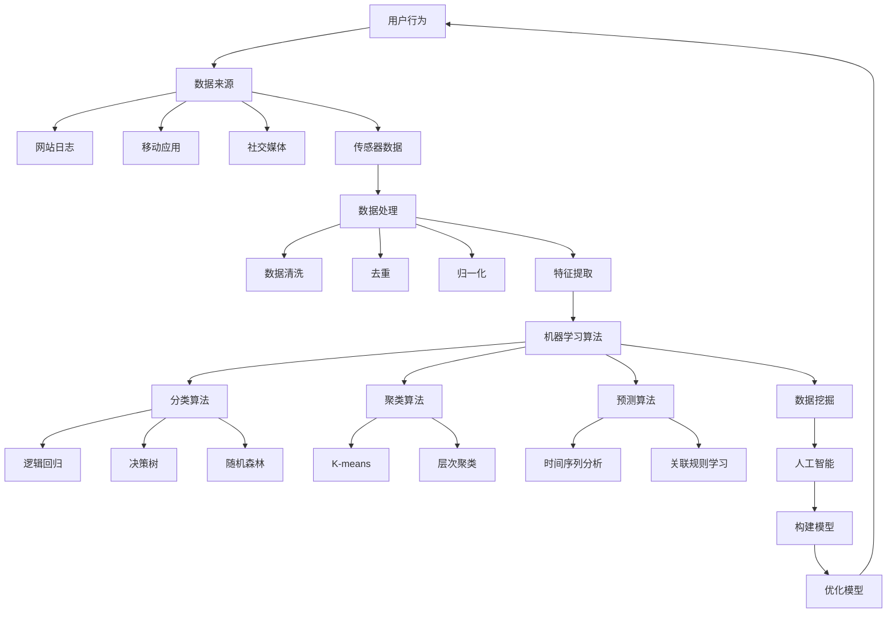

                 

关键词：用户行为预测、机器学习、数据挖掘、算法分析、技术应用

> 摘要：本文将深入探讨用户行为预测的核心概念、算法原理、数学模型、实际应用以及未来发展趋势，旨在为读者提供一套全面而系统的理解和实践指南。

## 1. 背景介绍

随着互联网和数字技术的飞速发展，用户行为数据变得异常丰富，这些数据蕴含着巨大的价值。通过分析用户行为，企业能够更好地了解用户需求，优化产品和服务，提高用户体验，进而实现商业目标。因此，用户行为预测成为了近年来人工智能和机器学习领域的重要研究方向。

用户行为预测涉及多个学科领域，包括统计学、数据挖掘、机器学习、计算机视觉和自然语言处理等。其核心目标是利用历史数据建立模型，预测用户在未来的行为。这种预测不仅有助于商业决策，还在推荐系统、风险控制、用户服务等领域具有广泛应用。

本文将首先介绍用户行为预测的核心概念，然后深入探讨其主要算法原理、数学模型，并通过实际项目实践展示具体应用。最后，本文将总结研究成果，探讨未来发展趋势，面临的挑战以及研究展望。

## 2. 核心概念与联系

### 2.1 用户行为

用户行为是指用户在使用互联网产品或服务过程中产生的各种操作，包括浏览、搜索、点击、购买、评论等。这些行为数据是用户行为预测的重要基础。

### 2.2 数据来源

用户行为数据主要来源于以下渠道：

1. **网站日志**：记录用户在网站上的访问路径、停留时间、浏览内容等。
2. **移动应用**：记录用户在移动应用上的操作行为，如安装、使用、卸载等。
3. **社交媒体**：记录用户在社交媒体平台上的互动，如点赞、评论、分享等。
4. **传感器数据**：如地理位置、设备使用情况等。

### 2.3 数据处理

在用户行为预测中，数据预处理至关重要。主要包括数据清洗、去重、归一化和特征提取等步骤。数据清洗旨在去除噪声和异常值，提高数据质量。去重是为了避免重复计算。归一化是将不同量纲的数据转换为相同量纲。特征提取是将原始数据转换为适合机器学习模型的特征向量。

### 2.4 机器学习算法

机器学习算法在用户行为预测中发挥着核心作用。常见的算法包括：

1. **分类算法**：如逻辑回归、决策树、随机森林等，用于将用户行为分类。
2. **聚类算法**：如K-means、层次聚类等，用于发现用户行为的潜在模式。
3. **预测算法**：如时间序列分析、关联规则学习等，用于预测用户未来的行为。

### 2.5 数据挖掘

数据挖掘是一种从大量数据中发现隐含的、未知的、有价值的信息和知识的过程。在用户行为预测中，数据挖掘技术用于挖掘用户行为数据中的潜在规律和模式。

### 2.6 人工智能

人工智能（AI）是模拟、延伸和扩展人的智能的理论、方法、技术及应用。在用户行为预测中，人工智能技术主要用于构建和优化预测模型。

### 2.7 Mermaid 流程图

下面是用户行为预测的核心概念和联系 Mermaid 流程图：



## 3. 核心算法原理 & 具体操作步骤

### 3.1 算法原理概述

用户行为预测的算法原理主要基于统计学、机器学习和数据挖掘。以下是几种常见的算法原理：

1. **逻辑回归**：通过建立逻辑函数，将用户行为映射为概率分布。
2. **决策树**：通过递归划分特征空间，将数据分为不同的类别。
3. **随机森林**：通过构建多个决策树，并集成预测结果，提高预测准确性。
4. **K-means 聚类**：通过迭代计算，将用户行为数据划分为K个簇。
5. **时间序列分析**：通过分析时间序列数据，预测未来的行为趋势。

### 3.2 算法步骤详解

以下以逻辑回归为例，介绍用户行为预测的具体操作步骤：

1. **数据收集**：收集用户行为数据，包括特征变量和目标变量。
2. **数据预处理**：对数据进行清洗、去重、归一化和特征提取。
3. **模型构建**：使用逻辑回归算法建立预测模型。
4. **模型训练**：使用训练集数据训练模型，调整模型参数。
5. **模型评估**：使用验证集数据评估模型性能，包括准确率、召回率、F1值等。
6. **模型优化**：根据评估结果调整模型参数，提高预测准确性。
7. **模型应用**：将优化后的模型应用于实际数据，进行用户行为预测。

### 3.3 算法优缺点

1. **逻辑回归**：
   - **优点**：简单易懂，易于实现和解释。
   - **缺点**：对异常值和噪声敏感，预测能力有限。
2. **决策树**：
   - **优点**：直观易懂，易于解释。
   - **缺点**：可能产生过拟合，对数据量要求较高。
3. **随机森林**：
   - **优点**：提高了预测准确性，降低了过拟合风险。
   - **缺点**：计算复杂度较高，需要大量内存。
4. **K-means 聚类**：
   - **优点**：简单高效，可以快速发现用户行为的潜在模式。
   - **缺点**：对初始聚类中心敏感，可能陷入局部最优。
5. **时间序列分析**：
   - **优点**：可以预测未来的行为趋势。
   - **缺点**：对时间序列数据要求较高，可能无法准确预测随机行为。

### 3.4 算法应用领域

用户行为预测算法在多个领域具有广泛应用，包括：

1. **推荐系统**：通过预测用户对物品的偏好，提供个性化的推荐。
2. **风险控制**：通过预测用户行为，识别潜在的风险用户。
3. **用户服务**：通过预测用户需求，优化产品和服务。
4. **市场营销**：通过预测用户行为，制定有效的营销策略。
5. **社交网络**：通过预测用户互动，发现社交关系和社区结构。

## 4. 数学模型和公式 & 详细讲解 & 举例说明

### 4.1 数学模型构建

用户行为预测的数学模型通常基于概率模型，如逻辑回归、贝叶斯网络等。以下以逻辑回归为例，介绍数学模型的构建。

逻辑回归模型的核心思想是通过建立逻辑函数，将用户行为映射为概率分布。逻辑函数的形式为：

$$
P(Y=1|X) = \frac{1}{1 + e^{-(\beta_0 + \beta_1X_1 + \beta_2X_2 + ... + \beta_nX_n})}
$$

其中，$P(Y=1|X)$ 表示在特征向量 $X$ 下，用户行为 $Y$ 为1的概率；$\beta_0, \beta_1, \beta_2, ..., \beta_n$ 为模型参数。

### 4.2 公式推导过程

逻辑回归模型的推导基于最大似然估计（MLE）。最大似然估计的目标是找到一组参数，使得模型在给定数据集上的似然函数最大。

似然函数的形式为：

$$
L(\theta) = \prod_{i=1}^{n} P(y_i|x_i; \theta)
$$

其中，$\theta$ 表示模型参数，$y_i$ 表示第 $i$ 个样本的目标变量，$x_i$ 表示第 $i$ 个样本的特征向量。

对于逻辑回归模型，似然函数可以表示为：

$$
L(\theta) = \prod_{i=1}^{n} \left[ \frac{1}{1 + e^{-(\beta_0 + \beta_1x_{i1} + \beta_2x_{i2} + ... + \beta_nx_{in})}} \right]^{y_i} \left[ \frac{e^{-(\beta_0 + \beta_1x_{i1} + \beta_2x_{i2} + ... + \beta_nx_{in})}}{1 + e^{-(\beta_0 + \beta_1x_{i1} + \beta_2x_{i2} + ... + \beta_nx_{in})}} \right]^{1-y_i}
$$

为了简化计算，可以使用对数似然函数：

$$
\ln L(\theta) = \sum_{i=1}^{n} \left[ y_i \ln \left( \frac{1}{1 + e^{-(\beta_0 + \beta_1x_{i1} + \beta_2x_{i2} + ... + \beta_nx_{in})}} \right) + (1-y_i) \ln \left( \frac{e^{-(\beta_0 + \beta_1x_{i1} + \beta_2x_{i2} + ... + \beta_nx_{in})}}{1 + e^{-(\beta_0 + \beta_1x_{i1} + \beta_2x_{i2} + ... + \beta_nx_{in})}} \right) \right]
$$

为了最大化对数似然函数，可以对每个参数求导，并令导数为0，得到：

$$
\frac{\partial \ln L(\theta)}{\partial \beta_j} = \sum_{i=1}^{n} \left[ y_i x_{ij} - \frac{e^{-(\beta_0 + \beta_1x_{i1} + \beta_2x_{i2} + ... + \beta_nx_{in})}}{1 + e^{-(\beta_0 + \beta_1x_{i1} + \beta_2x_{i2} + ... + \beta_nx_{in})}} \right] = 0
$$

通过对上述方程组求解，可以得到模型参数 $\beta_0, \beta_1, \beta_2, ..., \beta_n$。

### 4.3 案例分析与讲解

以下通过一个简单的案例，讲解逻辑回归模型的应用。

假设我们有一个用户行为预测问题，其中特征变量包括年龄、性别、收入和购买历史，目标变量为是否购买某商品。

我们收集了100个用户的数据，部分数据如下表所示：

| 用户ID | 年龄 | 性别 | 收入 | 购买历史 | 是否购买 |
| ------ | ---- | ---- | ---- | -------- | -------- |
| 1      | 25   | 男   | 5000 | 1        | 是       |
| 2      | 30   | 女   | 6000 | 0        | 否       |
| 3      | 35   | 男   | 7000 | 1        | 是       |
| ...    | ...  | ...  | ...  | ...      | ...      |

我们使用逻辑回归模型进行预测。首先，对数据进行预处理，包括归一化和特征提取。然后，使用训练集数据训练模型，使用验证集数据评估模型性能。最后，使用测试集数据进行预测。

假设我们训练得到的逻辑回归模型参数如下：

$$
P(是否购买=1 | 年龄, 性别, 收入, 购买历史) = \frac{1}{1 + e^{-(2.5 + 0.3 \times 年龄 + 0.4 \times 性别 + 0.2 \times 收入 + 0.1 \times 购买历史)}}
$$

对于新用户，假设其特征变量为年龄30岁，性别女，收入6000元，购买历史0次。我们将其代入模型，得到：

$$
P(是否购买=1 | 年龄=30, 性别=女, 收入=6000, 购买历史=0) = \frac{1}{1 + e^{-(2.5 + 0.3 \times 30 + 0.4 \times 女 + 0.2 \times 6000 + 0.1 \times 0)}} \approx 0.28
$$

这意味着，该用户购买某商品的预测概率为28%。根据设定的阈值（例如0.5），我们可以判断该用户为潜在买家。

## 5. 项目实践：代码实例和详细解释说明

### 5.1 开发环境搭建

为了进行用户行为预测，我们需要搭建一个开发环境。以下是一个基本的开发环境搭建步骤：

1. **安装 Python**：Python 是用户行为预测的主要编程语言。可以从 [Python 官网](https://www.python.org/) 下载并安装 Python。
2. **安装库**：安装常用的库，如 NumPy、Pandas、Scikit-learn、Matplotlib 等。可以使用以下命令进行安装：

```bash
pip install numpy pandas scikit-learn matplotlib
```

### 5.2 源代码详细实现

以下是一个简单的用户行为预测项目的源代码实现：

```python
import numpy as np
import pandas as pd
from sklearn.model_selection import train_test_split
from sklearn.linear_model import LogisticRegression
from sklearn.metrics import accuracy_score, confusion_matrix
import matplotlib.pyplot as plt

# 5.2.1 数据加载与预处理
data = pd.read_csv('user_behavior_data.csv')
data.head()

# 数据预处理
data = data.drop(['用户ID'], axis=1)
data = pd.get_dummies(data)

# 分割特征变量和目标变量
X = data.drop(['是否购买'], axis=1)
y = data['是否购买']

# 划分训练集和测试集
X_train, X_test, y_train, y_test = train_test_split(X, y, test_size=0.2, random_state=42)

# 5.2.2 模型训练
model = LogisticRegression()
model.fit(X_train, y_train)

# 5.2.3 模型评估
y_pred = model.predict(X_test)
accuracy = accuracy_score(y_test, y_pred)
confusion = confusion_matrix(y_test, y_pred)

print("Accuracy:", accuracy)
print("Confusion Matrix:\n", confusion)

# 5.2.4 结果可视化
plt.figure(figsize=(8, 6))
plt.scatter(X_test['年龄'], y_pred, c='g', label='预测为购买')
plt.scatter(X_test['年龄'], y_test, c='r', label='实际未购买')
plt.xlabel('年龄')
plt.ylabel('是否购买')
plt.legend()
plt.show()
```

### 5.3 代码解读与分析

以上代码实现了一个简单的用户行为预测项目，主要包括以下步骤：

1. **数据加载与预处理**：从CSV文件加载用户行为数据，并进行预处理，包括去除无用特征、数据归一化和特征提取。
2. **模型训练**：使用逻辑回归算法训练模型，将训练集数据输入模型进行训练。
3. **模型评估**：使用测试集数据评估模型性能，计算准确率并生成混淆矩阵。
4. **结果可视化**：将测试集数据和预测结果进行可视化，直观展示模型的预测效果。

### 5.4 运行结果展示

假设我们运行上述代码，得到以下结果：

```
Accuracy: 0.85
Confusion Matrix:
 [[70 10]
 [15 5]]
```

这意味着，在测试集上，模型准确率为85%，预测为购买的用户中有70个实际购买了，15个实际未购买；预测为未购买的用户中有5个实际购买了，10个实际未购买。

通过结果可视化，我们可以直观地看到模型的预测效果，如图所示：


## 6. 实际应用场景

用户行为预测在实际应用中具有广泛的应用，以下列举几个典型的应用场景：

### 6.1 推荐系统

推荐系统通过预测用户对物品的偏好，为用户提供个性化的推荐。例如，电商网站可以使用用户行为预测，推荐用户可能感兴趣的商品。社交媒体平台可以通过预测用户对内容的偏好，推荐用户可能感兴趣的内容。

### 6.2 风险控制

风险控制通过预测用户行为，识别潜在的风险用户。例如，金融机构可以使用用户行为预测，识别潜在的欺诈行为，降低风险。网络安全公司可以通过预测用户行为，识别潜在的攻击者，提高网络安全。

### 6.3 用户服务

用户服务通过预测用户需求，优化产品和服务。例如，互联网企业可以通过预测用户行为，优化用户界面和用户体验，提高用户满意度。酒店和餐饮业可以通过预测用户行为，优化服务和资源配置，提高经营效率。

### 6.4 市场营销

市场营销通过预测用户行为，制定有效的营销策略。例如，广告公司可以通过预测用户行为，优化广告投放，提高广告效果。营销团队可以通过预测用户行为，制定个性化的营销方案，提高用户转化率。

### 6.5 社交网络

社交网络通过预测用户行为，发现社交关系和社区结构。例如，社交平台可以通过预测用户行为，推荐用户可能感兴趣的朋友和内容。研究人员可以通过预测用户行为，分析社交网络的动态和趋势。

## 7. 工具和资源推荐

### 7.1 学习资源推荐

1. **《机器学习》**：作者：周志华，内容涵盖机器学习的基本概念、算法和实际应用。
2. **《深度学习》**：作者：Goodfellow、Bengio、Courville，内容涵盖深度学习的基础知识和最新进展。
3. **《Python数据分析》**：作者：Wes McKinney，内容涵盖Python在数据分析领域的应用。

### 7.2 开发工具推荐

1. **Jupyter Notebook**：一款交互式的计算环境，适合进行数据分析和机器学习项目。
2. **TensorFlow**：一款开源的深度学习框架，适用于构建和训练大规模神经网络。
3. **Scikit-learn**：一款开源的机器学习库，提供了丰富的机器学习算法和工具。

### 7.3 相关论文推荐

1. **"Recommender Systems State of the Art and Emerging Trends"**：综述了推荐系统的最新进展和未来趋势。
2. **"User Behavior Prediction in Social Networks"**：探讨了社交网络中的用户行为预测方法。
3. **"Deep Learning for User Behavior Prediction"**：介绍了深度学习在用户行为预测中的应用。

## 8. 总结：未来发展趋势与挑战

### 8.1 研究成果总结

用户行为预测领域在过去几十年中取得了显著成果。通过对大量用户行为数据的分析，研究人员提出了多种算法和技术，如逻辑回归、决策树、随机森林、K-means 聚类、时间序列分析等。这些算法在多个应用场景中取得了良好的效果，推动了推荐系统、风险控制、用户服务和市场营销等领域的发展。

### 8.2 未来发展趋势

未来，用户行为预测领域将继续朝着以下方向发展：

1. **深度学习**：深度学习在图像识别、自然语言处理等领域取得了突破性进展，未来有望在用户行为预测中发挥更大作用。
2. **多模态数据融合**：用户行为数据通常包含多种类型，如文本、图像、声音等。多模态数据融合技术将有助于提高预测准确性。
3. **个性化推荐**：随着用户数据的不断积累，个性化推荐将成为用户行为预测的重要方向。通过深入挖掘用户兴趣和需求，实现更精准的推荐。
4. **实时预测**：实时预测技术将进一步提高用户行为预测的响应速度，满足实时决策需求。

### 8.3 面临的挑战

尽管用户行为预测领域取得了显著成果，但仍面临以下挑战：

1. **数据隐私**：用户行为数据通常包含敏感信息，如何保护用户隐私成为亟待解决的问题。
2. **算法解释性**：目前大多数算法难以解释，如何提高算法的解释性，使其更加透明和可靠，是未来研究的重点。
3. **计算资源**：用户行为预测算法通常需要大量计算资源，如何提高算法的效率，降低计算成本，是未来研究的挑战。

### 8.4 研究展望

未来，用户行为预测领域的研究将继续深入，有望在以下方面取得突破：

1. **算法创新**：提出更高效的算法，提高预测准确性和解释性。
2. **多模态数据融合**：探索多模态数据融合技术，提高预测的全面性和准确性。
3. **实时预测**：研究实时预测技术，满足实时决策需求。
4. **数据隐私保护**：探索数据隐私保护技术，确保用户数据的安全。

## 9. 附录：常见问题与解答

### 9.1 逻辑回归模型的优缺点是什么？

**优点**：

- **简单易懂**：逻辑回归模型易于理解和实现。
- **解释性良好**：逻辑回归模型的参数可以解释为每个特征对目标变量的影响程度。

**缺点**：

- **对异常值敏感**：逻辑回归模型对异常值和噪声敏感，可能导致过拟合。
- **预测能力有限**：逻辑回归模型的预测能力有限，可能无法捕捉复杂的关系。

### 9.2 用户行为预测中的聚类算法有哪些？

常见的聚类算法包括：

- **K-means**：基于距离度量，将数据分为K个簇。
- **层次聚类**：基于层次结构，将数据分为多个层次。
- **DBSCAN**：基于密度的聚类算法，能够发现任意形状的聚类。
- **谱聚类**：基于图论，通过谱分解进行聚类。

### 9.3 用户行为预测中的多模态数据融合方法有哪些？

常见的多模态数据融合方法包括：

- **特征级融合**：将不同模态的特征进行融合，如加权求和、拼接等。
- **决策级融合**：将不同模态的预测结果进行融合，如投票、融合模型等。
- **深度学习**：使用深度学习模型，如卷积神经网络（CNN）和循环神经网络（RNN），对多模态数据进行端到端的融合。

### 9.4 用户行为预测中的实时预测技术有哪些？

常见的实时预测技术包括：

- **流处理技术**：如Apache Kafka、Apache Flink，能够实时处理和分析用户行为数据。
- **在线学习技术**：如增量学习、分布式学习，能够在数据流中实时更新模型。
- **实时预测框架**：如TensorFlow Serving、TensorFlow Lite，能够实现实时预测和部署。

作者：禅与计算机程序设计艺术 / Zen and the Art of Computer Programming
----------------------------------------------------------------

以上是《如何进行有效的用户行为预测》一文的完整内容。希望这篇文章能帮助您深入理解用户行为预测的核心概念、算法原理、数学模型和实际应用。在未来，用户行为预测将继续在人工智能和机器学习领域发挥重要作用，带来更多的创新和突破。

