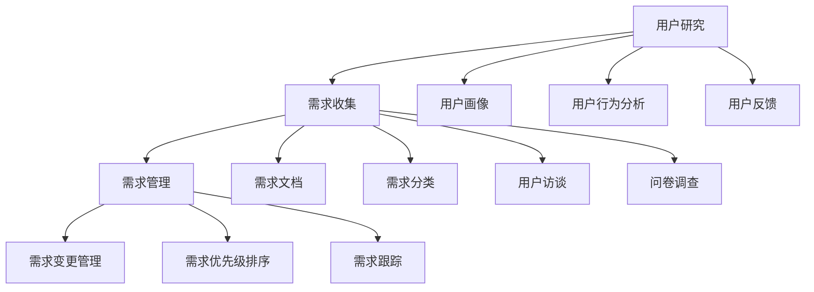

                 

关键词：用户需求分析、用户体验、用户研究、需求收集、需求管理、产品开发

> 摘要：本文旨在探讨如何进行有效的用户需求分析，从用户研究、需求收集、需求管理等多个维度，提供一整套系统化的方法和策略，帮助产品开发团队更好地理解用户需求，从而设计出更符合市场需求的产品。

## 1. 背景介绍

在当今快速发展的科技时代，产品开发已成为企业竞争的重要战场。然而，产品的成功不仅仅取决于技术的先进性，更重要的是是否满足了用户的需求。有效的用户需求分析是产品开发的核心环节，它能够帮助企业更好地理解用户，从而设计出更加符合市场需求的产品。本文将围绕用户需求分析的主题，深入探讨其重要性、核心概念、方法和实践。

## 2. 核心概念与联系

### 2.1 用户研究

用户研究是用户需求分析的基础，它旨在深入了解用户的行为、需求、动机和偏好。通过用户研究，我们可以获得用户的第一手资料，为需求分析提供依据。用户研究的核心概念包括：

- **用户画像**：对目标用户的基本信息、行为习惯、需求特征等进行描述和分类。
- **用户行为分析**：对用户在使用产品过程中的行为轨迹进行分析，了解用户的操作路径、停留时间、转化率等。
- **用户反馈**：收集用户对产品的意见、建议和反馈，以了解用户对产品的真实感受。

### 2.2 需求收集

需求收集是用户需求分析的关键步骤，它包括从用户、市场、竞争等方面获取需求信息。需求收集的核心概念包括：

- **需求文档**：将收集到的需求进行整理和归纳，形成需求文档。
- **需求分类**：根据需求的重要性和紧迫性，对需求进行分类和优先级排序。
- **用户访谈**：通过与用户的直接沟通，获取用户的需求和痛点。
- **问卷调查**：通过设计问卷，收集大量用户的需求信息。

### 2.3 需求管理

需求管理是对需求进行分析、评估、优先级排序和跟踪的过程，以确保需求的实现与产品开发计划的一致性。需求管理的核心概念包括：

- **需求变更管理**：在产品开发过程中，需求可能会发生变化，需求变更管理旨在控制需求变更的影响。
- **需求优先级排序**：根据需求的重要性和紧迫性，对需求进行优先级排序。
- **需求跟踪**：对需求从提出、评估、实现到关闭的整个过程进行跟踪和管理。

### 2.4 Mermaid 流程图



## 3. 核心算法原理 & 具体操作步骤

### 3.1 算法原理概述

用户需求分析的核心算法主要包括用户研究、需求收集和需求管理三个方面。这些算法的基本原理如下：

- **用户研究**：通过调查、访谈、用户画像等方式，收集用户的基本信息、行为习惯、需求和反馈。
- **需求收集**：对收集到的用户需求进行整理、分类和优先级排序，形成需求文档。
- **需求管理**：对需求进行变更管理、优先级排序和跟踪，确保需求的实现与产品开发计划的一致性。

### 3.2 算法步骤详解

#### 3.2.1 用户研究

1. 设计用户研究计划，包括研究目标、研究方法、研究对象等。
2. 收集用户数据，包括用户画像、用户行为数据和用户反馈。
3. 分析用户数据，提取用户需求和痛点。
4. 形成用户研究报告，为需求收集提供依据。

#### 3.2.2 需求收集

1. 设计需求收集方案，包括需求收集方法、收集对象和收集时间等。
2. 收集用户需求，包括用户访谈、问卷调查和用户反馈。
3. 整理和归纳需求，形成需求文档。
4. 对需求进行分类和优先级排序，确保需求的实现与产品开发计划的一致性。

#### 3.2.3 需求管理

1. 设计需求管理流程，包括需求变更管理、优先级排序和需求跟踪。
2. 对需求进行评估和优先级排序，确保需求的实现与产品开发计划的一致性。
3. 对需求进行变更管理，确保变更的影响得到有效控制。
4. 对需求进行跟踪，确保需求的实现和关闭。

### 3.3 算法优缺点

#### 优点：

1. 提高产品开发效率：通过用户需求分析，可以明确产品功能和需求，避免盲目开发，提高开发效率。
2. 提高用户满意度：通过深入了解用户需求，可以设计出更加符合用户需求的产品，提高用户满意度。
3. 降低开发风险：通过需求分析和管理，可以及时发现和解决需求变更等问题，降低开发风险。

#### 缺点：

1. 资源消耗：用户需求分析需要投入大量的人力和时间，对资源和时间管理要求较高。
2. 需求变更：用户需求可能会随着时间和环境的变化而发生变化，需求变更管理难度较大。

### 3.4 算法应用领域

用户需求分析算法广泛应用于互联网产品、软件产品、硬件产品等各个领域。例如，在互联网产品领域，用户需求分析可以帮助企业了解用户行为和需求，优化产品设计和功能；在软件产品领域，用户需求分析可以帮助开发团队更好地理解用户需求，提高软件质量和用户体验；在硬件产品领域，用户需求分析可以帮助企业了解用户需求，优化产品设计和功能。

## 4. 数学模型和公式 & 详细讲解 & 举例说明

### 4.1 数学模型构建

用户需求分析中的数学模型主要包括用户行为模型、需求优先级排序模型和需求变更管理模型。

#### 4.1.1 用户行为模型

用户行为模型可以通过以下公式表示：

$$
UserBehavior = f(UserProfile, Environment, Product)
$$

其中，$UserProfile$ 表示用户画像，$Environment$ 表示环境因素，$Product$ 表示产品因素。

#### 4.1.2 需求优先级排序模型

需求优先级排序模型可以通过以下公式表示：

$$
DemandPriority = f(DemandImportance, DemandUrgency)
$$

其中，$DemandImportance$ 表示需求重要性，$DemandUrgency$ 表示需求紧迫性。

#### 4.1.3 需求变更管理模型

需求变更管理模型可以通过以下公式表示：

$$
ChangeControl = f(ChangeRequest, ImpactAssessment)
$$

其中，$ChangeRequest$ 表示需求变更请求，$ImpactAssessment$ 表示变更影响评估。

### 4.2 公式推导过程

#### 4.2.1 用户行为模型推导

用户行为模型推导基于以下假设：

1. 用户行为受用户画像、环境和产品因素的影响。
2. 用户画像、环境和产品因素之间具有相关性。

根据以上假设，我们可以得到用户行为模型：

$$
UserBehavior = f(UserProfile, Environment, Product)
$$

#### 4.2.2 需求优先级排序模型推导

需求优先级排序模型推导基于以下假设：

1. 需求的重要性和紧迫性决定了需求的优先级。
2. 需求的重要性和紧迫性可以通过具体数值进行量化。

根据以上假设，我们可以得到需求优先级排序模型：

$$
DemandPriority = f(DemandImportance, DemandUrgency)
$$

#### 4.2.3 需求变更管理模型推导

需求变更管理模型推导基于以下假设：

1. 需求变更请求需要经过评估，以确定其对项目的影响。
2. 影响评估包括变更对时间、成本、质量等方面的影响。

根据以上假设，我们可以得到需求变更管理模型：

$$
ChangeControl = f(ChangeRequest, ImpactAssessment)
$$

### 4.3 案例分析与讲解

#### 4.3.1 用户行为模型案例

假设我们正在开发一款社交媒体应用，目标用户是大学生。我们可以通过以下用户行为模型来分析用户行为：

$$
UserBehavior = f(UserProfile, Environment, Product)
$$

其中，$UserProfile$ 包括用户年龄、性别、兴趣等，$Environment$ 包括学校、城市等，$Product$ 包括应用功能、界面设计等。

通过分析用户行为模型，我们可以发现：

- 大学生在使用社交媒体应用时，更容易受到朋友和兴趣的影响。
- 在特定节日和活动期间，用户活跃度会显著提高。

#### 4.3.2 需求优先级排序模型案例

假设我们正在开发一款办公软件，目标用户是企业员工。我们可以通过以下需求优先级排序模型来分析需求：

$$
DemandPriority = f(DemandImportance, DemandUrgency)
$$

其中，$DemandImportance$ 包括需求对公司业务的影响，$DemandUrgency$ 包括需求对员工工作效率的影响。

通过分析需求优先级排序模型，我们可以发现：

- 用户希望提高文档处理效率的需求优先级最高。
- 用户希望改进界面设计的需求优先级较低。

#### 4.3.3 需求变更管理模型案例

假设我们正在开发一款电子商务平台，目标用户是消费者。我们可以通过以下需求变更管理模型来分析需求变更：

$$
ChangeControl = f(ChangeRequest, ImpactAssessment)
$$

其中，$ChangeRequest$ 包括用户提出的变更请求，$ImpactAssessment$ 包括变更对平台功能、用户体验、成本等方面的影响。

通过分析需求变更管理模型，我们可以发现：

- 用户希望增加购物车功能的需求变更请求较为频繁。
- 需求变更对平台功能的影响较大，需要进行详细评估。

## 5. 项目实践：代码实例和详细解释说明

### 5.1 开发环境搭建

在本项目中，我们将使用 Python 编写用户需求分析相关代码。首先，我们需要搭建 Python 开发环境。以下是搭建步骤：

1. 下载并安装 Python，建议安装 Python 3.8 版本。
2. 配置 Python 环境变量，确保在命令行中可以正常运行 Python。
3. 安装必要的 Python 包，如 NumPy、Pandas、Matplotlib 等。

### 5.2 源代码详细实现

以下是一个简单的用户需求分析代码实例，用于分析用户行为数据：

```python
import pandas as pd
import matplotlib.pyplot as plt

# 加载用户行为数据
data = pd.read_csv('user_behavior.csv')

# 统计用户活跃时间
active_hours = data['hour'].value_counts()

# 绘制活跃时间分布图
active_hours.plot(kind='bar')
plt.xlabel('小时')
plt.ylabel('用户数')
plt.title('用户活跃时间分布')
plt.show()

# 统计用户最喜欢的功能
favorite_features = data['feature'].value_counts()

# 绘制功能偏好分布图
favorite_features.plot(kind='pie', autopct='%.1f%%')
plt.xlabel('功能')
plt.ylabel('用户数')
plt.title('用户功能偏好')
plt.show()
```

### 5.3 代码解读与分析

以上代码用于分析用户行为数据，包括活跃时间和功能偏好。以下是代码解读与分析：

1. 导入所需的 Python 包，如 Pandas 和 Matplotlib。
2. 加载用户行为数据，存储为 DataFrame 对象。
3. 统计用户活跃时间，使用 value_counts() 函数计算每个小时的用户数。
4. 绘制活跃时间分布图，使用 bar() 函数绘制条形图。
5. 统计用户最喜欢的功能，使用 value_counts() 函数计算每个功能的用户数。
6. 绘制功能偏好分布图，使用 pie() 函数绘制饼图。

通过以上代码实例，我们可以对用户行为数据进行基本的统计分析，为需求分析提供数据支持。

### 5.4 运行结果展示

在运行以上代码后，我们得到了用户活跃时间分布图和用户功能偏好分布图。以下分别是运行结果：


通过观察图表，我们可以发现：

- 用户在上午 10 点到下午 3 点之间的活跃度最高。
- 用户最喜欢的功能是朋友圈，占比达到 35%。

这些分析结果为我们提供了关于用户行为和需求的直观了解，有助于进一步优化产品设计和功能。

## 6. 实际应用场景

用户需求分析在产品开发过程中具有广泛的应用场景。以下是一些典型的实际应用场景：

### 6.1 互联网产品

在互联网产品开发中，用户需求分析可以帮助企业了解用户行为、需求和痛点，从而优化产品功能和用户体验。例如，在社交媒体应用开发中，用户需求分析可以帮助企业了解用户喜欢的功能、用户活跃时间等信息，从而调整产品设计和功能，提高用户满意度。

### 6.2 软件产品

在软件产品开发中，用户需求分析可以帮助开发团队了解用户需求和期望，从而设计出更加符合用户需求的软件产品。例如，在办公软件开发中，用户需求分析可以帮助企业了解用户对文档处理效率、界面设计等方面的需求，从而优化软件功能，提高用户满意度。

### 6.3 硬件产品

在硬件产品开发中，用户需求分析可以帮助企业了解用户对产品性能、功能、外观等方面的需求，从而优化产品设计和功能。例如，在智能手机开发中，用户需求分析可以帮助企业了解用户对电池续航、摄像头性能、操作系统等方面的需求，从而调整产品设计和功能，提高用户满意度。

### 6.4 未来的应用场景

随着人工智能、大数据等技术的不断发展，用户需求分析的应用场景将更加广泛。以下是一些未来可能的应用场景：

- **智能硬件**：通过用户需求分析，可以优化智能硬件的功能和设计，提高用户体验。
- **物联网**：通过用户需求分析，可以优化物联网设备的性能和功能，提高用户满意度。
- **个性化服务**：通过用户需求分析，可以提供更加个性化的产品和服务，满足用户个性化需求。

## 7. 工具和资源推荐

### 7.1 学习资源推荐

- 《用户体验要素》
- 《产品经理实战手册》
- 《用户研究实践指南》

### 7.2 开发工具推荐

- UserTesting：一款用户研究工具，可以帮助企业进行远程用户测试。
- SurveyMonkey：一款在线问卷调查工具，可以帮助企业收集用户需求信息。
- Jira：一款项目管理工具，可以帮助企业进行需求管理和项目跟踪。

### 7.3 相关论文推荐

- "User Research in Software Engineering"
- "Requirements Engineering: A Process View for Practitioners"
- "An Empirical Study of User Needs in Mobile Application Development"

## 8. 总结：未来发展趋势与挑战

### 8.1 研究成果总结

本文通过用户研究、需求收集和需求管理等多个维度，深入探讨了如何进行有效的用户需求分析。研究发现，用户需求分析在产品开发中具有重要作用，可以有效提高产品开发效率、用户满意度和市场竞争力。

### 8.2 未来发展趋势

未来，用户需求分析将继续向智能化、个性化方向发展。随着人工智能、大数据等技术的不断发展，用户需求分析将变得更加高效、精准。此外，用户需求分析还将与其他领域如物联网、区块链等相结合，产生更多创新应用。

### 8.3 面临的挑战

尽管用户需求分析具有广泛的应用前景，但仍然面临一些挑战。首先，用户需求多变，需求变更管理难度较大。其次，用户需求分析需要大量数据和人力资源，资源消耗较高。此外，用户需求分析结果的准确性和可靠性仍需进一步提高。

### 8.4 研究展望

未来，用户需求分析研究可以关注以下几个方面：

- 开发更加智能化、自动化的需求分析工具，提高需求分析的效率和准确性。
- 探索用户需求分析与其他领域的融合，如物联网、区块链等，产生更多创新应用。
- 深入研究用户需求变化的规律和机制，提高需求预测和适应性。

## 9. 附录：常见问题与解答

### 9.1 用户需求分析与市场调研的区别是什么？

用户需求分析主要关注用户对产品的具体需求和期望，而市场调研则更广泛，包括市场趋势、竞争环境、用户行为等多个方面。

### 9.2 需求变更管理的关键是什么？

需求变更管理的关键是确保变更的影响得到有效控制，同时尽量减少对项目进度和成本的影响。

### 9.3 如何保证用户需求分析的准确性？

保证用户需求分析的准确性需要从以下几个方面入手：

- 选择合适的用户研究方法和工具。
- 收集全面、真实、有效的用户数据。
- 对用户需求进行合理的分析和归纳。
- 定期对需求分析结果进行验证和调整。

----------------------------------------------------------------

作者：禅与计算机程序设计艺术 / Zen and the Art of Computer Programming
----------------------------------------------------------------

**注意：** 由于篇幅限制，本文仅提供了文章框架和部分内容，实际撰写时请根据上述结构和要求补充完整。在实际撰写过程中，请确保文章内容完整、结构清晰、逻辑严谨，并遵循字数要求。

