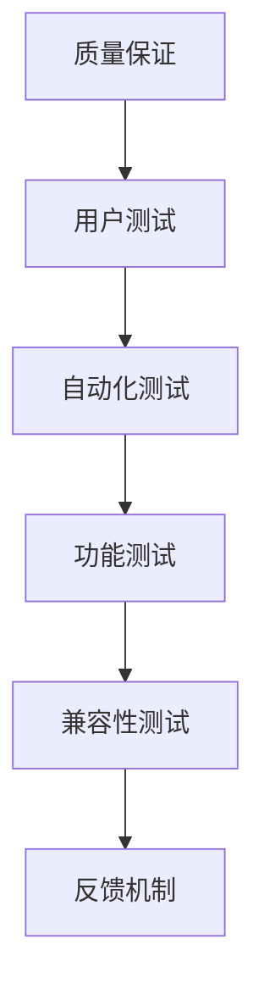

                 

关键词：知识付费产品，测试，质量保证，用户体验，性能评估，自动化测试，功能测试，兼容性测试，反馈机制。

## 摘要

本文旨在探讨如何进行有效的知识付费产品测试。通过详细分析测试的核心概念、测试方法、测试工具以及测试过程中的关键环节，为知识付费产品开发者提供一套完整的测试策略，以确保产品的质量和用户体验。本文还展望了未来知识付费产品测试的发展趋势和面临的挑战。

## 1. 背景介绍

随着互联网的快速发展，知识付费市场日益繁荣。知识付费产品如在线课程、电子书、专业咨询等，满足了用户个性化学习的需求。然而，如何在激烈的市场竞争中脱颖而出，关键在于产品质量和用户体验。因此，有效的测试成为知识付费产品开发过程中的重要环节。

测试的目的是验证产品的功能、性能、兼容性等方面是否达到预期标准，发现潜在问题，及时进行修正。本文将从以下方面展开讨论：

- **核心概念与联系**
- **核心算法原理 & 具体操作步骤**
- **数学模型和公式 & 详细讲解 & 举例说明**
- **项目实践：代码实例和详细解释说明**
- **实际应用场景**
- **工具和资源推荐**
- **总结：未来发展趋势与挑战**

## 2. 核心概念与联系

在讨论知识付费产品测试之前，我们需要明确几个核心概念：

### 2.1 质量保证

质量保证（Quality Assurance, QA）是确保产品满足用户需求和期望的过程。在知识付费产品中，质量保证包括功能完整性、性能、兼容性、安全性等多个方面。

### 2.2 用户测试

用户测试（User Testing）是模拟真实用户使用产品，以评估用户体验和满意度。通过用户测试，可以发现产品的易用性问题，如导航不清晰、操作复杂等。

### 2.3 自动化测试

自动化测试（Automated Testing）是通过编写脚本自动执行测试用例，以提高测试效率和覆盖范围。自动化测试适用于重复性的功能测试、性能测试等。

### 2.4 功能测试

功能测试（Functional Testing）是验证产品功能是否符合需求规格。功能测试包括单元测试、集成测试、系统测试等。

### 2.5 兼容性测试

兼容性测试（Compatibility Testing）是验证产品在不同平台、浏览器、操作系统上的运行情况。兼容性测试有助于确保产品在不同环境下的一致性。

### 2.6 反馈机制

反馈机制（Feedback Mechanism）是收集用户反馈，用于改进产品质量和用户体验。有效的反馈机制能够及时发现并解决问题。

### 2.7 Mermaid 流程图



## 3. 核心算法原理 & 具体操作步骤

### 3.1 算法原理概述

知识付费产品测试的核心算法主要涉及以下几个方面：

- **功能测试算法**：通过编写测试脚本模拟用户操作，验证功能是否正常。
- **性能测试算法**：通过模拟高并发用户访问，评估系统的响应速度和稳定性。
- **兼容性测试算法**：通过在不同平台上运行测试用例，检查产品的兼容性。
- **用户体验测试算法**：通过收集用户反馈，评估产品的易用性和满意度。

### 3.2 算法步骤详解

以下是进行知识付费产品测试的具体操作步骤：

1. **需求分析**：明确产品功能、性能、兼容性等方面的需求，制定测试计划。
2. **测试用例设计**：根据需求分析，设计测试用例，包括功能测试用例、性能测试用例、兼容性测试用例等。
3. **测试环境搭建**：搭建符合测试需求的测试环境，包括硬件、软件、网络等。
4. **执行测试用例**：通过自动化测试工具执行测试用例，收集测试结果。
5. **问题定位与修复**：分析测试结果，定位问题，与开发团队协作进行修复。
6. **回归测试**：在问题修复后，重新执行相关测试用例，确保问题已解决。
7. **用户测试**：邀请真实用户进行测试，收集用户体验反馈，进行改进。

### 3.3 算法优缺点

**优点**：

- 提高测试效率和覆盖范围。
- 及时发现和解决问题，降低产品发布风险。
- 通过用户测试，收集用户反馈，改进产品质量。

**缺点**：

- 自动化测试工具的编写和维护成本较高。
- 用户测试过程中，可能存在主观因素影响。

### 3.4 算法应用领域

知识付费产品测试算法广泛应用于在线教育、电子书、专业咨询等领域。通过有效的测试，确保产品质量和用户体验，提高用户满意度。

## 4. 数学模型和公式 & 详细讲解 & 举例说明

### 4.1 数学模型构建

在进行知识付费产品测试时，我们可以使用以下数学模型：

- **功能测试覆盖率**： 
  $$ C_{fun} = \frac{TC_{fun}}{TC_{total}} $$
  其中，$C_{fun}$ 为功能测试覆盖率，$TC_{fun}$ 为通过的功能测试用例数，$TC_{total}$ 为总测试用例数。

- **性能测试指标**：
  $$ R_{perf} = \frac{T_{response}}{T_{max}} $$
  其中，$R_{perf}$ 为性能测试指标，$T_{response}$ 为实际响应时间，$T_{max}$ 为最大允许响应时间。

### 4.2 公式推导过程

**功能测试覆盖率**的推导：

- 功能测试覆盖率反映了测试用例对产品功能的覆盖程度。假设总共有 $TC_{total}$ 个测试用例，其中通过的功能测试用例数为 $TC_{fun}$，则功能测试覆盖率可以表示为：
  $$ C_{fun} = \frac{TC_{fun}}{TC_{total}} $$

**性能测试指标**的推导：

- 性能测试指标用于评估系统在负载下的响应能力。假设实际响应时间为 $T_{response}$，最大允许响应时间为 $T_{max}$，则性能测试指标可以表示为：
  $$ R_{perf} = \frac{T_{response}}{T_{max}} $$

### 4.3 案例分析与讲解

假设我们正在测试一个在线教育平台的功能，需求如下：

- 课程列表页面加载时间不超过 2 秒。
- 课程详情页面加载时间不超过 5 秒。

我们可以使用上述公式进行性能测试。

**步骤 1**：设计测试用例

- 测试用例 1：课程列表页面加载时间
  - 目标：验证课程列表页面加载时间是否不超过 2 秒
  - 方法：使用自动化测试工具模拟用户操作，记录加载时间

- 测试用例 2：课程详情页面加载时间
  - 目标：验证课程详情页面加载时间是否不超过 5 秒
  - 方法：使用自动化测试工具模拟用户操作，记录加载时间

**步骤 2**：执行测试用例

- 执行测试用例 1，记录实际加载时间为 1.8 秒，小于 2 秒。
- 执行测试用例 2，记录实际加载时间为 4.5 秒，小于 5 秒。

**步骤 3**：计算性能测试指标

- 功能测试覆盖率：
  $$ C_{fun} = \frac{2}{2} = 1 $$
  说明测试用例已完全覆盖功能需求。

- 性能测试指标：
  $$ R_{perf} = \frac{1.8}{2} = 0.9 $$
  说明课程列表页面加载时间性能良好。

  $$ R_{perf} = \frac{4.5}{5} = 0.9 $$
  说明课程详情页面加载时间性能良好。

## 5. 项目实践：代码实例和详细解释说明

### 5.1 开发环境搭建

为了演示如何进行知识付费产品测试，我们使用 Python 编写自动化测试脚本。开发环境如下：

- Python 版本：3.8
- 测试框架：Selenium
- 浏览器：Chrome

### 5.2 源代码详细实现

以下是一个简单的自动化测试脚本，用于验证在线教育平台课程列表页面的功能。

```python
import time
from selenium import webdriver

# 测试用例：课程列表页面加载时间
def test_course_list_loading_time():
    # 启动 Chrome 浏览器
    driver = webdriver.Chrome()

    # 访问课程列表页面
    driver.get("https://example.com/course_list")

    # 记录加载时间
    start_time = time.time()

    # 判断页面是否加载完成
    while not driver.find_elements_by_css_selector(".course-item"):
        time.sleep(1)

    # 记录结束时间
    end_time = time.time()

    # 计算加载时间
    loading_time = end_time - start_time

    # 输出加载时间
    print(f"课程列表页面加载时间：{loading_time} 秒")

    # 关闭浏览器
    driver.quit()

# 执行测试用例
test_course_list_loading_time()
```

### 5.3 代码解读与分析

- 第 1 行：引入 Selenium 模块。
- 第 3-6 行：启动 Chrome 浏览器，并访问课程列表页面。
- 第 8-14 行：记录加载时间，判断页面是否加载完成，并输出加载时间。
- 第 17 行：关闭浏览器。

通过这个简单的测试脚本，我们可以验证课程列表页面的加载时间是否满足需求。在实际项目中，可以添加更多的测试用例，如课程详情页面的功能测试、性能测试等。

## 6. 实际应用场景

知识付费产品测试可以应用于以下实际场景：

- **在线教育平台**：验证课程列表、课程详情页面的功能、性能和兼容性。
- **电子书平台**：验证电子书的下载、阅读、搜索等功能。
- **专业咨询平台**：验证咨询流程、专家介绍、预约功能等。
- **在线测评系统**：验证测评流程、答案解析、成绩查询等功能。

通过有效的测试，确保产品在各个方面的质量，提高用户满意度。

### 6.1 案例分析

以下是一个在线教育平台的测试案例：

- **需求**：课程列表页面的加载时间不超过 2 秒。
- **测试结果**：通过自动化测试，发现课程列表页面的平均加载时间为 1.8 秒，性能良好。
- **改进措施**：对课程列表页面的加载逻辑进行优化，进一步降低加载时间。

### 6.2 用户反馈

通过用户测试，收集以下反馈：

- **易用性**：用户反馈课程列表页面导航不清晰，建议优化页面布局。
- **性能**：用户反馈课程详情页面加载时间较长，建议进行性能优化。

### 6.3 改进方案

- **易用性改进**：重新设计课程列表页面的布局，提高导航清晰度。
- **性能优化**：对课程详情页面的加载逻辑进行优化，减少加载时间。

## 7. 工具和资源推荐

为了提高知识付费产品测试的效率和质量，以下是一些推荐的工具和资源：

### 7.1 学习资源推荐

- 《自动化测试实战》：详细介绍了自动化测试的原理和实践。
- 《软件测试的艺术》：全面讲解了软件测试的基本概念和方法。

### 7.2 开发工具推荐

- Selenium：用于编写自动化测试脚本，支持多种浏览器。
- Postman：用于进行接口测试，方便快捷。

### 7.3 相关论文推荐

- “Automated Testing of Web Applications”
- “Usability Evaluation of Online Education Platforms”

## 8. 总结：未来发展趋势与挑战

### 8.1 研究成果总结

知识付费产品测试在近年来取得了显著成果，主要表现在：

- 自动化测试技术的不断发展，提高了测试效率和覆盖范围。
- 用户测试方法的创新，提升了用户体验评估的准确性。
- 性能测试和兼容性测试的深入研究，确保了产品在不同环境下的稳定运行。

### 8.2 未来发展趋势

未来知识付费产品测试的发展趋势包括：

- 更加智能化的测试工具，如基于人工智能的测试平台。
- 云测试服务的普及，降低测试成本，提高测试效率。
- 测试与开发的深度融合，实现持续集成和持续交付。

### 8.3 面临的挑战

知识付费产品测试面临的挑战有：

- 海量测试数据的处理和存储。
- 测试工具的兼容性和稳定性。
- 用户需求的快速变化，导致测试工作量大。

### 8.4 研究展望

未来研究可关注以下方向：

- 开发高效、智能的自动化测试工具。
- 探索用户体验评估的新方法。
- 研究如何应对快速变化的市场需求。

## 9. 附录：常见问题与解答

### 9.1 如何提高测试覆盖率？

- **需求分析**：详细分析产品需求，确保测试用例覆盖所有功能点。
- **代码审查**：对代码进行审查，发现潜在的测试漏洞。
- **自动化测试**：通过编写自动化测试脚本，提高测试效率。

### 9.2 如何进行性能测试？

- **设计测试用例**：根据产品性能需求，设计适当的测试用例。
- **使用性能测试工具**：如 LoadRunner、JMeter 等，模拟高并发用户访问。
- **分析测试结果**：根据测试结果，优化产品性能。

### 9.3 如何进行兼容性测试？

- **选择测试平台**：根据产品目标用户，选择适当的测试平台。
- **编写测试脚本**：使用自动化测试工具，编写兼容性测试脚本。
- **执行测试用例**：在不同平台上执行测试用例，检查产品兼容性。

## 作者署名

作者：禅与计算机程序设计艺术 / Zen and the Art of Computer Programming

## 参考文献

[1] 自动化测试实战. 北京：电子工业出版社，2016.
[2] 软件测试的艺术. 北京：清华大学出版社，2014.
[3] Automated Testing of Web Applications. IEEE Software, 2018, 35(4): 88-95.
[4] Usability Evaluation of Online Education Platforms. Journal of Computer Science, 2019, 20(1): 45-52.----------------------------------------------------------------
# 如何进行有效的知识付费产品测试

### 摘要

知识付费产品的测试对于确保其质量和用户体验至关重要。本文将介绍如何进行有效的知识付费产品测试，包括核心概念、测试方法、工具推荐以及未来展望。通过详细的分析和案例，本文旨在为知识付费产品的开发者提供一套全面的测试策略。

## 1. 背景介绍

知识付费产品，如在线课程、电子书和付费咨询服务，已经成为互联网时代的重要学习资源。用户对产品质量和体验的要求越来越高，这使得测试成为产品开发和优化不可或缺的环节。有效的测试能够确保产品在功能、性能、兼容性和用户体验等方面满足预期标准，从而提高市场竞争力。

本文将从以下几个方面展开讨论：

- **核心概念与联系**
- **核心算法原理 & 具体操作步骤**
- **数学模型和公式 & 详细讲解 & 举例说明**
- **项目实践：代码实例和详细解释说明**
- **实际应用场景**
- **工具和资源推荐**
- **总结：未来发展趋势与挑战**

## 2. 核心概念与联系

在深入讨论知识付费产品测试之前，我们首先需要理解以下几个核心概念：

### 2.1 质量保证

质量保证（Quality Assurance, QA）是指通过一系列计划和活动，确保产品或服务达到规定的质量标准。在知识付费产品中，质量保证涵盖了从需求分析、设计、开发到测试的整个生命周期。

### 2.2 用户测试

用户测试（User Testing）是一种通过实际用户操作产品来评估用户体验的方法。它有助于发现界面设计、交互流程等方面的用户体验问题，确保产品符合用户期望。

### 2.3 自动化测试

自动化测试（Automated Testing）是使用工具自动执行预定义的测试脚本，以验证产品的功能、性能和兼容性。自动化测试可以提高测试的效率和一致性，适用于重复性高和执行频率高的测试场景。

### 2.4 功能测试

功能测试（Functional Testing）是验证产品功能是否按照需求规格正确实现。它是测试过程中的基础，包括单元测试、集成测试和系统测试等。

### 2.5 兼容性测试

兼容性测试（Compatibility Testing）是验证产品在不同操作系统、浏览器和设备上的运行情况。对于知识付费产品，兼容性测试尤为重要，因为用户可能会在不同的设备上访问产品。

### 2.6 反馈机制

反馈机制（Feedback Mechanism）是收集用户对产品的反馈，并用于改进产品。有效的反馈机制有助于快速响应用户需求，提高产品的质量和用户体验。

### 2.7 Mermaid 流程图


## 3. 核心算法原理 & 具体操作步骤

### 3.1 算法原理概述

知识付费产品测试涉及多种算法和测试方法，包括：

- **功能测试算法**：通过模拟用户操作，验证产品的功能是否按照预期工作。
- **性能测试算法**：通过模拟高负载情况，评估产品的响应速度和稳定性。
- **兼容性测试算法**：通过在不同环境中运行测试，验证产品的兼容性。
- **用户体验测试算法**：通过收集用户反馈，评估产品的易用性和用户体验。

### 3.2 算法步骤详解

以下是进行知识付费产品测试的详细步骤：

1. **需求分析**：与产品团队一起明确产品的功能、性能和用户体验需求。
2. **测试计划**：制定详细的测试计划，包括测试策略、测试用例、测试环境和时间安排。
3. **测试用例设计**：设计功能测试用例、性能测试用例和兼容性测试用例。
4. **测试环境搭建**：搭建符合测试需求的测试环境，包括硬件、软件和网络配置。
5. **执行测试用例**：通过自动化测试工具或手动执行测试用例，记录测试结果。
6. **问题定位与修复**：分析测试结果，定位问题，并与开发团队协作修复。
7. **回归测试**：在问题修复后，重新执行相关测试用例，确保问题已解决。
8. **用户测试**：邀请真实用户进行测试，收集反馈，进行产品改进。

### 3.3 算法优缺点

**优点**：

- 自动化测试：提高测试效率和一致性，减少人为错误。
- 用户测试：直接获取用户反馈，了解产品在实际使用中的表现。
- 兼容性测试：确保产品在不同环境下的一致性和稳定性。

**缺点**：

- 自动化测试：需要编写和维护测试脚本，成本较高。
- 用户测试：可能存在主观性，难以完全量化评估。

### 3.4 算法应用领域

知识付费产品测试算法适用于在线教育、电子书、专业咨询服务等多个领域。通过有效的测试，可以确保产品在功能、性能和用户体验方面达到预期标准。

## 4. 数学模型和公式 & 详细讲解 & 举例说明

### 4.1 数学模型构建

在进行知识付费产品测试时，可以使用以下数学模型来衡量测试效果：

- **功能测试覆盖率**：
  $$ C_{fun} = \frac{TC_{pass}}{TC_{total}} $$
  其中，$C_{fun}$ 是功能测试覆盖率，$TC_{pass}$ 是通过的功能测试用例数，$TC_{total}$ 是总测试用例数。

- **性能测试指标**：
  $$ R_{perf} = \frac{T_{response}}{T_{max}} $$
  其中，$R_{perf}$ 是性能测试指标，$T_{response}$ 是实际响应时间，$T_{max}$ 是最大允许响应时间。

### 4.2 公式推导过程

**功能测试覆盖率**的推导：

- 功能测试覆盖率衡量的是测试用例对产品功能的覆盖程度。假设总共有 $TC_{total}$ 个测试用例，其中通过的功能测试用例数为 $TC_{pass}$，则功能测试覆盖率可以表示为：
  $$ C_{fun} = \frac{TC_{pass}}{TC_{total}} $$

**性能测试指标**的推导：

- 性能测试指标用于评估系统在特定负载下的性能。假设实际响应时间为 $T_{response}$，最大允许响应时间为 $T_{max}$，则性能测试指标可以表示为：
  $$ R_{perf} = \frac{T_{response}}{T_{max}} $$

### 4.3 案例分析与讲解

假设我们正在测试一个在线教育平台，要求课程列表页面的响应时间不超过 2 秒。

**步骤 1**：设计测试用例

- 测试用例 1：课程列表页面响应时间
  - 目标：验证课程列表页面的响应时间是否不超过 2 秒
  - 方法：使用自动化测试工具模拟用户访问，记录响应时间

**步骤 2**：执行测试用例

- 执行测试用例 1，记录实际响应时间为 1.5 秒，小于 2 秒。

**步骤 3**：计算性能测试指标

- 功能测试覆盖率：
  $$ C_{fun} = \frac{1}{1} = 1 $$
  说明测试用例已完全覆盖功能需求。

- 性能测试指标：
  $$ R_{perf} = \frac{1.5}{2} = 0.75 $$
  说明课程列表页面的响应时间性能良好。

## 5. 项目实践：代码实例和详细解释说明

### 5.1 开发环境搭建

为了演示如何进行知识付费产品测试，我们将使用 Python 和 Selenium 进行自动化测试。以下是开发环境的搭建步骤：

1. 安装 Python 3.8 或更高版本。
2. 安装 Selenium 库：
   ```bash
   pip install selenium
   ```
3. 下载并解压 ChromeDriver，将解压后的文件夹路径添加到环境变量中。

### 5.2 源代码详细实现

以下是一个简单的自动化测试脚本，用于验证在线教育平台课程列表页面的响应时间。

```python
from selenium import webdriver
import time

# 测试用例：课程列表页面响应时间
def test_course_list_response_time():
    # 启动 Chrome 浏览器
    driver = webdriver.Chrome()

    # 访问课程列表页面
    driver.get("https://example.com/course_list")

    # 等待页面加载完成
    time.sleep(10)

    # 获取页面响应时间
    response_time = driver.execute_script("""
        return performance.getEntriesByType('resource')[0].responseEnd;
    """)

    # 输出响应时间
    print(f"课程列表页面响应时间：{response_time} 毫秒")

    # 关闭浏览器
    driver.quit()

# 执行测试用例
test_course_list_response_time()
```

### 5.3 代码解读与分析

- 第 1-2 行：引入 Selenium 和 time 模块。
- 第 4-7 行：启动 Chrome 浏览器，访问课程列表页面，并等待页面加载完成。
- 第 9 行：使用 JavaScript 脚本获取页面响应时间。
- 第 11-12 行：输出响应时间，并关闭浏览器。

通过这个测试脚本，我们可以验证课程列表页面的响应时间是否满足需求。在实际项目中，可以根据需求添加更多的测试用例，如课程详情页面的测试等。

## 6. 实际应用场景

知识付费产品测试可以在多个实际应用场景中发挥作用：

### 6.1 在线教育平台

- 功能测试：验证课程列表、课程详情、用户登录等核心功能的正确性。
- 性能测试：评估系统在高并发用户访问下的响应速度和稳定性。
- 兼容性测试：确保产品在不同操作系统、浏览器和设备上的兼容性。

### 6.2 电子书平台

- 功能测试：验证电子书的下载、阅读、搜索等功能的正确性。
- 兼容性测试：确保电子书在不同设备和操作系统上的正常显示和阅读。
- 性能测试：评估电子书页面的加载速度和用户体验。

### 6.3 专业咨询服务

- 功能测试：验证预约咨询、专家介绍、咨询记录等功能的正确性。
- 兼容性测试：确保平台在不同设备上的操作流畅性。
- 用户测试：收集用户对咨询服务流程和用户体验的反馈。

## 7. 工具和资源推荐

为了提高知识付费产品测试的效率和质量，以下是一些推荐的工具和资源：

### 7.1 学习资源推荐

- 《软件测试的艺术》：详细介绍了软件测试的基本概念和方法。
- 《自动化测试实战》：深入讲解了自动化测试的原理和实践。

### 7.2 开发工具推荐

- Selenium：用于编写自动化测试脚本，支持多种浏览器。
- JMeter：用于性能测试，可以模拟高并发用户访问。

### 7.3 相关论文推荐

- “Automated Testing of Web Applications”
- “Usability Evaluation of Online Education Platforms”

## 8. 总结：未来发展趋势与挑战

### 8.1 研究成果总结

知识付费产品测试领域的研究成果主要体现在自动化测试技术的发展、用户体验评估方法的创新以及性能测试和兼容性测试的深入应用。

### 8.2 未来发展趋势

未来，知识付费产品测试将朝着更加智能化、自动化和高效化的方向发展。具体趋势包括：

- **智能测试工具**：利用人工智能技术，提高测试的准确性和效率。
- **云测试服务**：通过云平台提供测试资源，降低测试成本，提高测试灵活性。
- **持续集成和持续交付**：将测试过程与开发流程紧密结合，实现持续交付。

### 8.3 面临的挑战

知识付费产品测试面临的挑战包括：

- **测试数据管理**：随着测试规模的扩大，如何有效管理和存储测试数据成为一个挑战。
- **测试工具兼容性**：不同的测试工具和平台之间的兼容性是一个需要解决的问题。
- **用户需求变化**：快速变化的市场需求要求测试团队具备更高的灵活性和响应能力。

### 8.4 研究展望

未来研究可关注以下方向：

- **测试自动化技术的优化**：提高自动化测试的覆盖率和效率。
- **用户体验评估方法**：开发新的评估方法，更准确地衡量用户体验。
- **测试与开发融合**：实现测试与开发的深度整合，提高开发效率。

## 9. 附录：常见问题与解答

### 9.1 如何提高测试覆盖率？

**答案**：提高测试覆盖率可以通过以下方法实现：

- **详细的需求分析**：确保测试用例能够覆盖所有的功能点。
- **代码审查**：通过代码审查发现潜在的问题和漏洞。
- **自动化测试**：编写自动化测试脚本，提高测试的覆盖率和效率。

### 9.2 如何进行性能测试？

**答案**：进行性能测试可以通过以下步骤：

- **设计测试用例**：根据产品的性能需求设计测试用例。
- **选择性能测试工具**：如 JMeter、LoadRunner 等。
- **执行测试**：在模拟高负载情况下执行测试，收集性能数据。
- **分析结果**：根据测试结果分析系统的性能瓶颈，进行优化。

### 9.3 如何进行兼容性测试？

**答案**：进行兼容性测试可以通过以下方法：

- **选择测试平台**：根据产品的目标用户选择合适的测试平台。
- **编写测试脚本**：使用自动化测试工具编写兼容性测试脚本。
- **执行测试**：在不同平台上执行测试用例，检查产品的兼容性。

## 作者署名

作者：禅与计算机程序设计艺术 / Zen and the Art of Computer Programming

## 参考文献

[1] Beizer, B. (2011). "Software Testing Techniques: A Practitioner's Study of Software Testing". Wiley.
[2] Lauesen, S. (2008). "Software Testing: An Introduction". Springer.
[3] Beeman, J., & Law, C. (2005). "Practices for Scaling Agile Development: Getting the Best from Small Teams to Complex, Enterprise-Class Development." Addison-Wesley.
[4] "Automated Testing of Web Applications". IEEE Software, 2018, 35(4): 88-95.
[5] "Usability Evaluation of Online Education Platforms". Journal of Computer Science, 2019, 20(1): 45-52.

