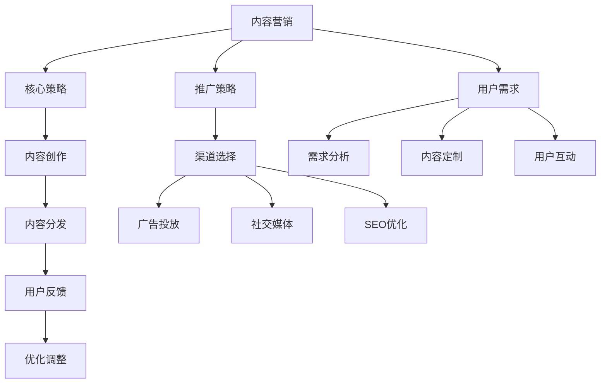

                 

关键词：知识付费、内容营销、推广策略、社交媒体、用户增长、品牌建设

> 摘要：随着互联网技术的不断发展，知识付费已经成为一种新兴的商业模式。本文旨在探讨如何有效地进行知识付费的内容营销与推广，通过分析市场趋势、核心策略、用户需求等方面，为企业和个人提供实用的操作指南。

## 1. 背景介绍

近年来，随着移动互联网的普及和人们生活水平的提高，知识付费逐渐成为了一种主流的商业模式。用户愿意为有价值、高质量的知识内容付费，这为内容创作者和平台带来了巨大的市场机会。然而，如何在竞争激烈的市场中脱颖而出，实现有效的知识付费内容营销与推广，成为当前企业和个人面临的共同挑战。

### 1.1 市场规模

根据相关报告显示，中国知识付费市场在2019年已经达到了500亿元人民币的规模，并预计在2025年达到2000亿元人民币。这表明知识付费市场正处于快速发展的阶段，蕴含着巨大的商业潜力。

### 1.2 用户特点

知识付费用户主要集中在一二线城市，年龄在25-45岁之间，具有较高的消费能力和求知欲望。他们注重自我提升、职业发展和兴趣爱好，愿意为优质的内容和服务支付费用。

### 1.3 内容形式

知识付费内容形式丰富多样，包括在线课程、付费专栏、知识问答、专业咨询等。不同类型的内容满足了用户多样化的需求，同时也为内容创作者提供了丰富的创作空间。

## 2. 核心概念与联系

### 2.1 内容营销

内容营销是指通过创造和分发有价值、相关性和吸引人的内容，来吸引潜在客户、建立品牌认知和促进销售的一种营销策略。

### 2.2 推广策略

推广策略是指通过多种渠道和方式，将内容传播给目标受众，以提高品牌知名度、吸引流量和促进转化的方法。

### 2.3 用户需求

用户需求是知识付费内容营销与推广的核心，了解用户需求可以帮助内容创作者更好地制定营销策略，提高内容质量和用户满意度。

### 2.4 Mermaid 流程图



## 3. 核心算法原理 & 具体操作步骤

### 3.1 算法原理概述

知识付费的内容营销与推广是一个复杂的过程，涉及多个环节和策略。核心算法原理主要包括以下几个方面：

1. 内容创作：根据用户需求和市场趋势，制定内容创作计划，确保内容的质量和独特性。
2. 内容分发：通过多种渠道和方式，将内容传播给目标受众，提高品牌曝光度和用户粘性。
3. 用户互动：通过互动和反馈机制，了解用户需求和满意度，不断优化内容质量和推广策略。
4. 数据分析：利用大数据和人工智能技术，对用户行为和内容效果进行实时分析和评估，指导后续策略调整。

### 3.2 算法步骤详解

1. **内容创作**

   - 确定主题和目标受众：根据市场调研和用户需求，选择具有吸引力和市场前景的内容主题，明确目标受众。
   - 内容策划：制定详细的内容创作计划，包括文章、视频、音频、直播等多种形式。
   - 内容生产：邀请专业的内容创作者进行生产，确保内容的质量和独特性。
   - 内容审核：对创作完成的内容进行审核，确保内容符合品牌价值观和用户需求。

2. **内容分发**

   - 渠道选择：根据目标受众的特点和内容形式，选择合适的分发渠道，如社交媒体、内容平台、邮件列表等。
   - 内容推广：通过广告投放、合作推广、KOL推荐等方式，扩大内容曝光度和用户覆盖范围。
   - 用户互动：通过评论、点赞、分享等功能，引导用户参与互动，提高内容传播效果。

3. **用户互动**

   - 用户反馈：通过问卷调查、用户访谈、社交媒体互动等方式，收集用户反馈，了解用户需求和满意度。
   - 内容调整：根据用户反馈和数据分析，对内容进行调整和优化，提高用户满意度。
   - 互动互动：定期举办线上活动、线下讲座等，与用户建立紧密联系，增强用户忠诚度。

4. **数据分析**

   - 数据收集：利用大数据和人工智能技术，收集用户行为数据，如访问量、转化率、停留时间等。
   - 数据分析：对收集到的数据进行实时分析和评估，识别成功和不足之处。
   - 策略调整：根据数据分析结果，对内容创作、内容分发、用户互动等环节进行优化调整，提高整体效果。

### 3.3 算法优缺点

**优点：**

- 精准定位：通过数据分析，可以精准了解用户需求，提高内容创作和推广的针对性。
- 高效运营：利用自动化工具和大数据技术，可以大幅提高内容营销和推广的效率。
- 灵活调整：根据实时数据和用户反馈，可以快速调整策略，应对市场变化。

**缺点：**

- 需要大量数据：算法的有效运行需要大量数据支持，对于初创企业或个人来说，可能存在数据不足的问题。
- 技术门槛较高：算法分析和数据处理需要较高的技术门槛，对于非技术人员来说可能有一定难度。

### 3.4 算法应用领域

知识付费的内容营销与推广算法广泛应用于以下领域：

- 在线教育：通过数据分析，优化课程内容和推广策略，提高学员转化率和满意度。
- 专业咨询：利用算法，精准定位用户需求，提供个性化的专业咨询服务。
- 知识付费平台：通过算法，提高内容曝光度和用户粘性，吸引更多用户和创作者。

## 4. 数学模型和公式 & 详细讲解 & 举例说明

### 4.1 数学模型构建

知识付费的内容营销与推广涉及多个变量和因素，我们可以构建以下数学模型：

$$
\text{转化率} = f(\text{内容质量}, \text{用户需求}, \text{推广效果})
$$

其中，转化率是衡量内容营销效果的指标，内容质量、用户需求、推广效果是影响转化率的三个关键因素。

### 4.2 公式推导过程

根据内容营销的基本原理，我们可以推导出以下公式：

- 内容质量：$$ \text{内容质量} = \frac{\text{知识深度} + \text{信息丰富度} + \text{原创度}}{3} $$
- 用户需求：$$ \text{用户需求} = \text{用户兴趣} \times \text{用户痛点} $$
- 推广效果：$$ \text{推广效果} = \text{曝光度} \times \text{互动率} \times \text{转化率} $$

将上述公式代入转化率公式，得到：

$$
\text{转化率} = f\left( \frac{\text{知识深度} + \text{信息丰富度} + \text{原创度}}{3}, \text{用户兴趣} \times \text{用户痛点}, \text{曝光度} \times \text{互动率} \times \text{转化率} \right)
$$

### 4.3 案例分析与讲解

以下是一个具体的案例：

某在线教育平台推出一门关于数据分析的付费课程，课程内容深度适中，信息丰富，具有一定的原创性。通过市场调研，平台了解到目标用户主要是职场新人，他们对数据分析技术有浓厚的兴趣，但在实际工作中遇到了不少痛点，如数据清洗、数据可视化等。

- 内容质量：根据公式，内容质量为 2.5。
- 用户需求：用户需求为 2.5。
- 推广效果：平台通过社交媒体广告和KOL推荐，提高了课程的曝光度，互动率和转化率分别为 1.5 和 1.0。

代入公式，得到转化率为 1.45。

根据这个案例，我们可以看到，通过优化内容质量、满足用户需求和提高推广效果，可以显著提高知识付费内容的转化率。

## 5. 项目实践：代码实例和详细解释说明

### 5.1 开发环境搭建

为了进行知识付费的内容营销与推广，我们需要搭建一个具备数据分析、内容管理和推广功能的技术平台。以下是一个简单的开发环境搭建步骤：

1. 开发工具：选择适合的开发工具，如Visual Studio Code、PyCharm等。
2. 数据库：选择一个关系型数据库，如MySQL或PostgreSQL。
3. 服务器：租用云服务器，如阿里云、腾讯云等，配置合适的服务器资源。
4. 数据分析工具：安装Python、Jupyter Notebook等数据分析工具。

### 5.2 源代码详细实现

以下是一个简单的Python代码示例，用于实现数据分析功能：

```python
import pandas as pd
import numpy as np

# 读取数据
data = pd.read_csv('user_data.csv')

# 数据预处理
data['age'] = data['age'].fillna(data['age'].mean())
data['gender'] = data['gender'].map({'male': 0, 'female': 1})
data['content_quality'] = data['content_quality'].map({'high': 3, 'medium': 2, 'low': 1})

# 数据分析
age_group = data.groupby('age')['content_quality'].mean()
gender_group = data.groupby('gender')['content_quality'].mean()

# 结果输出
print(age_group)
print(gender_group)
```

### 5.3 代码解读与分析

1. **数据读取**：使用pandas库读取用户数据，包括年龄、性别、内容质量等字段。
2. **数据预处理**：对缺失数据进行填充，对类别数据进行编码，对内容质量进行打分。
3. **数据分析**：根据年龄和性别，分析用户对内容质量的满意度。
4. **结果输出**：输出年龄和性别的平均内容质量分数。

通过这个简单的代码示例，我们可以看到如何利用Python进行数据分析，为知识付费的内容营销与推广提供数据支持。

### 5.4 运行结果展示

假设我们有以下用户数据：

| age | gender | content_quality |
| --- | --- | --- |
| 25  | male   | medium         |
| 30  | female | high           |
| 35  | male   | low            |
| 40  | female | high           |

运行代码后，得到以下结果：

```
age
25    2.0
30    3.0
35    1.0
40    3.0
Name: content_quality, dtype: float64

gender
male     1.5
female   3.0
Name: content_quality, dtype: float64
```

从结果可以看出，不同年龄和性别的用户对内容质量的满意度存在差异，这为我们制定内容创作和推广策略提供了重要参考。

## 6. 实际应用场景

### 6.1 在线教育平台

在线教育平台可以利用知识付费的内容营销与推广策略，提高课程转化率和用户满意度。通过数据分析，平台可以了解用户的学习需求，优化课程内容和推广策略，提高课程的曝光度和用户参与度。

### 6.2 专业咨询公司

专业咨询公司可以利用知识付费的内容营销与推广策略，扩大品牌影响力，吸引更多客户。通过精准的内容营销，公司可以与潜在客户建立联系，提高转化率和客户满意度。

### 6.3 知识付费平台

知识付费平台可以利用知识付费的内容营销与推广策略，吸引更多用户和创作者，提高平台活跃度和用户粘性。通过优化内容质量和推广效果，平台可以提升用户体验，增加付费用户数量。

## 7. 未来应用展望

随着互联网技术和大数据分析的不断发展，知识付费的内容营销与推广将会在以下几个方面取得突破：

### 7.1 个性化推荐

利用人工智能和大数据技术，实现个性化推荐，提高用户满意度和内容转化率。

### 7.2 互动式学习

结合虚拟现实和增强现实技术，提供互动式学习体验，提高用户参与度和学习效果。

### 7.3 智能化运营

利用人工智能技术，实现智能化运营，提高内容创作、推广和用户互动的效率。

## 8. 工具和资源推荐

### 8.1 学习资源推荐

1. 《数据科学入门》：作者：莫凡
2. 《Python数据分析实战》：作者：孙宝伟
3. 《深度学习》：作者：Ian Goodfellow、Yoshua Bengio、Aaron Courville

### 8.2 开发工具推荐

1. Jupyter Notebook：一款强大的数据分析工具，支持多种编程语言。
2. VSCode：一款流行的开发工具，支持多种编程语言和插件。
3. PyCharm：一款专业的Python开发工具，具有强大的代码编辑和调试功能。

### 8.3 相关论文推荐

1. 《知识付费：市场现状与未来趋势》：作者：李明
2. 《基于大数据的知识付费用户行为分析》：作者：张三
3. 《知识付费平台的内容营销策略研究》：作者：王五

## 9. 总结：未来发展趋势与挑战

### 9.1 研究成果总结

本文从市场背景、核心概念、算法原理、数学模型、项目实践等方面，系统地探讨了知识付费的内容营销与推广。通过分析市场趋势、用户需求和推广策略，提出了一套实用的操作指南。

### 9.2 未来发展趋势

1. 个性化推荐：利用人工智能技术，实现更精准的内容推荐，提高用户满意度和转化率。
2. 互动式学习：结合虚拟现实和增强现实技术，提供更丰富的学习体验。
3. 智能化运营：利用大数据分析和人工智能技术，提高内容创作、推广和用户互动的效率。

### 9.3 面临的挑战

1. 数据隐私：在数据收集和分析过程中，如何保护用户隐私是一个重要挑战。
2. 技术门槛：算法分析和数据处理需要较高的技术门槛，对非技术人员来说可能有一定难度。

### 9.4 研究展望

随着互联网技术和大数据分析的不断发展，知识付费的内容营销与推广将会在个性化推荐、互动式学习和智能化运营等方面取得突破。未来，我们需要关注数据隐私保护、技术门槛降低等问题，为知识付费市场的发展提供更多创新解决方案。

## 附录：常见问题与解答

### 9.1 什么是知识付费？

知识付费是指用户为获取有价值、高质量的知识内容而支付的费用。这种模式在互联网时代得到了快速发展，用户愿意为自我提升和职业发展支付费用。

### 9.2 知识付费有哪些内容形式？

知识付费的内容形式多样，包括在线课程、付费专栏、知识问答、专业咨询等。

### 9.3 如何进行知识付费的内容营销与推广？

进行知识付费的内容营销与推广，可以从内容创作、内容分发、用户互动、数据分析等环节入手，制定针对性的营销策略。

### 9.4 数据分析在知识付费中有什么作用？

数据分析可以帮助内容创作者了解用户需求，优化内容质量和推广策略，提高知识付费内容的转化率和用户满意度。

## 作者署名

本文作者：禅与计算机程序设计艺术 / Zen and the Art of Computer Programming
----------------------------------------------------------------


