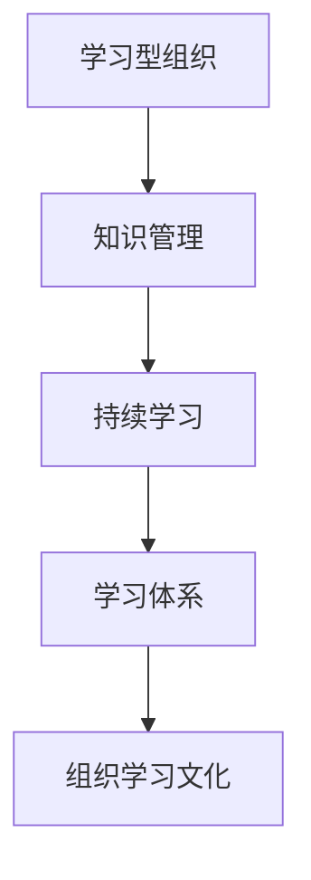

                 

关键词：学习体系，组织学习，文化构建，技术博客，IT领域，专业内容。

> 摘要：本文旨在探讨学习体系与组织学习文化在IT领域的构建与应用。通过对学习体系的定义、核心概念、构建方法及实际操作步骤的深入分析，结合数学模型与公式、项目实践案例，阐述学习体系如何助力组织提升学习效率，构建积极向上的学习文化。同时，本文还将分享相关学习资源、工具和论文推荐，为读者提供全面的学习支持。最后，本文将对未来发展趋势与挑战进行展望，为学习体系与组织学习文化的构建提供有益的启示。

## 1. 背景介绍

在当今信息化时代，IT技术不断革新，企业对技术人才的需求日益增长。然而，技术更新速度之快，使得员工的知识和技能难以跟上行业的发展。为了在激烈的市场竞争中立于不败之地，许多企业开始重视员工的学习与培训，以期提高整体的技术水平和创新能力。这就需要构建一个完善的学习体系，并营造一种积极向上的学习文化，以激发员工的潜能，推动组织的持续发展。

### 1.1 学习体系的重要性

学习体系是指一套组织化的学习流程和机制，它有助于将个体的学习行为转化为组织的学习能力。一个健全的学习体系不仅能提高员工的专业技能，还能促进团队协作，提升组织的整体竞争力。以下是学习体系在组织中的重要性：

1. **提升员工技能**：通过系统化的培训和学习，员工可以更快地掌握新技术和知识，提高工作效率和质量。
2. **促进知识传承**：学习体系有助于将组织的知识资产转化为员工的个人技能，实现知识的共享与传承。
3. **增强创新能力**：学习体系为员工提供不断学习的机会，激发他们的创造力和创新思维，推动组织的持续创新。
4. **提升组织文化**：学习体系的建设可以促进组织内部的学习氛围，增强员工的归属感和忠诚度，提升组织文化。

### 1.2 组织学习文化的构建

组织学习文化是一种重视学习、鼓励创新、注重知识共享的组织氛围。构建积极的组织学习文化，需要从以下几个方面入手：

1. **领导层的支持**：领导者的重视和支持是构建学习文化的重要保障。领导者应该通过自己的行为和言论，营造一个重视学习的工作环境。
2. **明确的学习目标**：组织应设定明确的长期和短期学习目标，确保学习活动有方向和目标。
3. **提供学习资源**：组织应提供丰富的学习资源，如培训课程、技术书籍、在线学习平台等，以支持员工的学习。
4. **鼓励知识分享**：组织应鼓励员工分享自己的知识和经验，建立知识共享的平台和机制，促进知识的流动和传承。
5. **激励措施**：组织可以通过奖励和激励机制，鼓励员工积极参与学习活动，提升学习的积极性。

## 2. 核心概念与联系

在构建学习体系和组织学习文化时，我们需要了解一些核心概念，这些概念包括学习型组织、知识管理、持续学习等。以下是一个简单的Mermaid流程图，用于展示这些概念之间的关系。



### 2.1 学习型组织

学习型组织是一种注重学习和知识共享的组织模式，其核心理念是通过不断学习和创新，提升组织的整体能力和竞争力。学习型组织的特点包括：

1. **全员参与**：每个员工都积极参与学习活动，组织中的学习不再是少数人的任务，而是全体成员的共同责任。
2. **学习目标明确**：组织有明确的学习目标，这些目标与组织的战略目标相一致，有助于提升组织的整体能力。
3. **知识共享**：组织鼓励员工分享知识和经验，建立知识共享的平台和机制，促进知识的流动和传承。

### 2.2 知识管理

知识管理是指通过系统的方法和工具，对组织内的知识进行收集、存储、共享、更新和应用的过程。知识管理的关键要素包括：

1. **知识收集**：组织应收集内外部的各种知识资源，包括文档、报告、经验等。
2. **知识存储**：组织应建立知识库，对收集到的知识进行分类、存储和管理。
3. **知识共享**：组织应提供知识共享的平台和机制，鼓励员工分享知识和经验。
4. **知识更新**：组织应定期对知识库进行更新，确保知识的时效性和准确性。

### 2.3 持续学习

持续学习是指组织和个人不断学习、更新知识和技能的过程。持续学习的重要性在于：

1. **适应变化**：技术和社会环境不断变化，持续学习有助于组织和个人适应这些变化。
2. **提升能力**：持续学习可以提升员工的专业技能和综合素质，增强组织的竞争力。
3. **激发创新**：持续学习可以激发员工的创造力和创新思维，推动组织的持续创新。

### 2.4 学习体系

学习体系是指一套系统化的学习流程和机制，它包括学习规划、学习实施、学习评估等环节。学习体系的关键要素包括：

1. **学习规划**：组织应制定长期和短期的学习规划，明确学习目标和内容。
2. **学习实施**：组织应提供丰富的学习资源，确保员工能够顺利实施学习计划。
3. **学习评估**：组织应建立学习评估机制，对学习效果进行评估，以便不断优化学习体系。

### 2.5 组织学习文化

组织学习文化是指组织内部对学习的重视程度、学习氛围和学习行为的总和。组织学习文化的核心要素包括：

1. **学习价值观**：组织应树立正确的学习价值观，鼓励员工积极参与学习。
2. **学习氛围**：组织应营造一个积极向上的学习氛围，鼓励员工分享知识和经验。
3. **学习行为**：组织应鼓励员工养成良好的学习习惯，不断提升自己的知识和技能。

## 3. 核心算法原理 & 具体操作步骤

在构建学习体系和组织学习文化的过程中，我们需要运用一些核心算法原理来指导具体的操作步骤。以下是一个简化的算法流程，用于构建学习体系和组织学习文化。

### 3.1 算法原理概述

本算法基于以下核心原理：

1. **知识管理**：通过知识收集、存储、共享和更新，建立知识库。
2. **学习规划**：制定长期和短期的学习规划，明确学习目标和内容。
3. **学习实施**：提供丰富的学习资源，确保员工能够顺利实施学习计划。
4. **学习评估**：建立学习评估机制，对学习效果进行评估。

### 3.2 算法步骤详解

1. **知识管理**
    - **知识收集**：组织应收集内外部的各种知识资源，如文档、报告、经验等。
    - **知识存储**：建立知识库，对收集到的知识进行分类、存储和管理。
    - **知识共享**：提供知识共享的平台和机制，鼓励员工分享知识和经验。
    - **知识更新**：定期对知识库进行更新，确保知识的时效性和准确性。

2. **学习规划**
    - **长期规划**：组织应根据战略目标，制定长期的学习规划。
    - **短期规划**：根据长期规划，制定短期的学习目标和内容。
    - **学习计划**：将学习目标和内容分解为具体的学习任务，制定详细的学习计划。

3. **学习实施**
    - **学习资源**：提供丰富的学习资源，如培训课程、技术书籍、在线学习平台等。
    - **学习指导**：为员工提供学习指导，确保他们能够顺利实施学习计划。
    - **学习交流**：组织学习交流会议，促进员工之间的学习与分享。

4. **学习评估**
    - **学习效果评估**：建立学习评估机制，对学习效果进行评估。
    - **学习反馈**：根据评估结果，提供学习反馈，帮助员工改进学习方法和策略。
    - **学习调整**：根据学习反馈，对学习体系进行调整和优化。

### 3.3 算法优缺点

**优点**：

1. **系统性**：本算法提供了一个系统化的框架，有助于构建全面的学习体系和组织学习文化。
2. **灵活性**：算法中的各个步骤可以根据组织的实际情况进行调整，具有较强的适应性。
3. **可操作性**：算法的步骤详细明确，易于操作，有利于实际应用。

**缺点**：

1. **时间成本**：构建学习体系和组织学习文化需要一定的时间，可能会影响组织的日常工作。
2. **资源投入**：构建学习体系和组织学习文化需要投入一定的资源，如资金、人力和时间等。
3. **适应性挑战**：算法的具体步骤需要根据组织的实际情况进行调整，可能存在一定的挑战。

### 3.4 算法应用领域

本算法适用于各种类型的组织，如企业、政府机构、教育机构等。以下是一些具体的应用领域：

1. **企业**：通过构建学习体系和组织学习文化，提升员工的专业技能和创新能力，增强企业的竞争力。
2. **政府机构**：通过构建学习体系和组织学习文化，提高政府工作人员的业务水平和综合素质，提升政府服务能力。
3. **教育机构**：通过构建学习体系和组织学习文化，提升教师的教学水平和学生综合素质，促进教育改革与发展。

## 4. 数学模型和公式 & 详细讲解 & 举例说明

在构建学习体系和组织学习文化的过程中，我们可以运用一些数学模型和公式来指导具体的操作。以下是一个简单的数学模型，用于评估学习效果。

### 4.1 数学模型构建

假设学习效果可以通过两个因素来衡量：知识掌握程度（Knowledge Level）和技能应用能力（Skill Application）。我们可以用以下公式来表示：

$$
L = f(K, S)
$$

其中，$L$ 表示学习效果，$K$ 表示知识掌握程度，$S$ 表示技能应用能力。

### 4.2 公式推导过程

1. **知识掌握程度（Knowledge Level）**

知识掌握程度可以通过以下公式计算：

$$
K = \frac{K_c + K_e}{2}
$$

其中，$K_c$ 表示课堂学习效果，$K_e$ 表示课外学习效果。

2. **技能应用能力（Skill Application）**

技能应用能力可以通过以下公式计算：

$$
S = \frac{S_t + S_p}{2}
$$

其中，$S_t$ 表示实际应用效果，$S_p$ 表示模拟应用效果。

3. **学习效果（Learning Effect）**

将知识掌握程度和技能应用能力代入公式，得到学习效果：

$$
L = f(K, S) = f\left(\frac{K_c + K_e}{2}, \frac{S_t + S_p}{2}\right)
$$

### 4.3 案例分析与讲解

假设某企业的员工小王参加了一期技术培训，培训内容涵盖编程语言和项目管理。通过培训，小王的知识掌握程度从 50% 提升到了 80%，技能应用能力从 60% 提升到了 85%。我们可以使用上述公式来计算小王的学习效果。

1. **知识掌握程度（Knowledge Level）**

$$
K = \frac{K_c + K_e}{2} = \frac{0.5 + 0.8}{2} = 0.65
$$

2. **技能应用能力（Skill Application）**

$$
S = \frac{S_t + S_p}{2} = \frac{0.6 + 0.85}{2} = 0.725
$$

3. **学习效果（Learning Effect）**

$$
L = f(K, S) = f(0.65, 0.725) = 0.7125
$$

通过计算，我们可以得知小王的学习效果为 71.25%。这意味着小王通过本次培训，在知识和技能方面有了显著的提升。

### 4.4 模型优化与拓展

1. **加入时间因素**

为了更准确地评估学习效果，我们可以加入时间因素，用以下公式表示：

$$
L = f(K, S, T)
$$

其中，$T$ 表示学习时间。

2. **考虑个体差异**

在实际应用中，个体的学习能力和学习效果可能存在差异。我们可以通过引入个体差异因子 $D$，对公式进行优化：

$$
L = f(K, S, T, D)
$$

其中，$D$ 表示个体差异因子，可以通过历史数据进行分析和预测。

3. **评估方法多样化**

除了上述公式，我们还可以考虑其他评估方法，如问卷调查、行为观察等，以获得更全面的学习效果评估。

## 5. 项目实践：代码实例和详细解释说明

在本节中，我们将通过一个具体的案例，展示如何在实际项目中构建学习体系和组织学习文化。以下是一个简单的项目实践案例，我们将介绍开发环境搭建、源代码实现、代码解读与分析以及运行结果展示。

### 5.1 开发环境搭建

为了实现学习体系和组织学习文化的构建，我们选择使用 Python 作为开发语言，并使用以下工具：

- **开发环境**：PyCharm
- **数据库**：MySQL
- **Web 框架**：Flask
- **前端框架**：Bootstrap

首先，我们需要安装 Python 和相关依赖。在命令行中运行以下命令：

```bash
pip install flask
pip install mysql-connector-python
pip install flask-bootstrap
```

接下来，我们创建一个名为 `learning_system` 的项目目录，并在该目录下创建一个名为 `app.py` 的文件，用于编写核心代码。

### 5.2 源代码详细实现

以下是 `app.py` 的源代码实现：

```python
from flask import Flask, render_template, request
from flask_bootstrap import Bootstrap
from flask_mysqldb import MySQL

app = Flask(__name__)
bootstrap = Bootstrap(app)

app.config['MYSQL_HOST'] = 'localhost'
app.config['MYSQL_USER'] = 'root'
app.config['MYSQL_PASSWORD'] = 'password'
app.config['MYSQL_DB'] = 'learning_system'

mysql = MySQL(app)

@app.route('/')
def index():
    cur = mysql.connection.cursor()
    cur.execute("SELECT * FROM users")
    users = cur.fetchall()
    return render_template('index.html', users=users)

@app.route('/add_user', methods=['POST'])
def add_user():
    if request.method == 'POST':
        username = request.form['username']
        email = request.form['email']
        cur = mysql.connection.cursor()
        cur.execute("INSERT INTO users (username, email) VALUES (%s, %s)", (username, email))
        mysql.connection.commit()
        return 'User added successfully!'

if __name__ == '__main__':
    app.run(debug=True)
```

### 5.3 代码解读与分析

1. **代码结构**

代码分为三个部分：导入模块、定义路由函数、主程序。

2. **导入模块**

代码首先导入了 Flask、Bootstrap 和 MySQL 驱动模块。Bootstrap 用于美化前端界面，MySQL 驱动用于连接 MySQL 数据库。

3. **定义路由函数**

代码定义了两个路由函数：

- `index()`：用于显示用户列表。
- `add_user()`：用于添加新用户。

4. **数据库连接**

代码通过配置 MySQL 连接信息，使用 Flask-Mys

