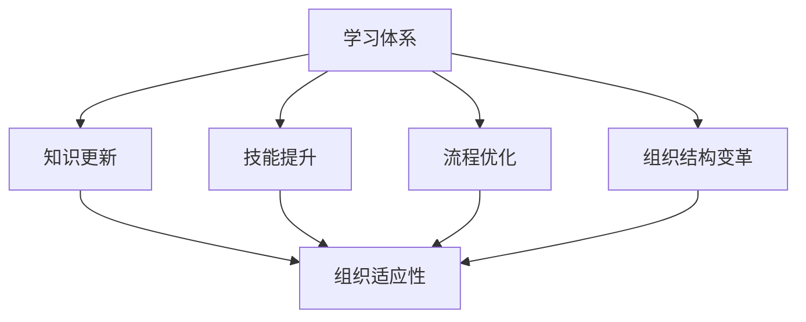

                 

关键词：学习体系、组织适应性、人才发展、技术更新、流程优化

> 摘要：本文旨在探讨学习体系在提升组织适应性方面的作用。在当今快速变化的技术环境中，组织能否迅速适应和应对外部变化，成为影响其生存和发展的关键因素。本文将分析学习体系的概念、特点及其在组织中的应用，探讨如何通过有效的学习体系提升组织的适应性。

## 1. 背景介绍

### 1.1 时代背景

当前，我们正处于一个技术飞速发展的时代。互联网、人工智能、大数据等技术的广泛应用，使得市场竞争愈发激烈，技术更新换代的速度越来越快。企业要想在激烈的市场竞争中立于不败之地，就必须具备快速适应和应对外部变化的能力。

### 1.2 组织适应性

组织适应性是指组织在面临外部环境变化时，能够迅速做出调整和适应的能力。一个具有高适应性的组织，能够在市场竞争中抓住机遇，及时调整战略，优化流程，提高效率，从而保持竞争优势。

### 1.3 学习体系的重要性

学习体系是提升组织适应性的关键因素。一个有效的学习体系能够促进员工的知识更新、技能提升和创新思维，从而增强组织的整体适应能力。本文将深入探讨学习体系对组织适应性的提升作用。

## 2. 核心概念与联系

### 2.1 学习体系

学习体系是指一系列旨在促进知识和技能获取、更新和应用的机制和策略。它包括培训、学习、知识管理、创新和变革管理等环节。

### 2.2 组织适应性

组织适应性是指组织在面临外部环境变化时，能够迅速做出调整和适应的能力。它包括战略调整、流程优化、组织结构变革、人员培养等多个方面。

### 2.3 学习体系与组织适应性的联系

学习体系与组织适应性之间存在密切的联系。通过有效的学习体系，组织能够不断提升员工的知识水平和技能，优化内部流程，适应外部环境的变化。具体来说：

1. **知识更新**：学习体系能够帮助员工不断更新知识，掌握新技术，从而提升组织的整体竞争力。
2. **技能提升**：通过系统化的培训和学习，员工能够提高专业技能，增强组织的执行力和创新能力。
3. **流程优化**：学习体系有助于发现和解决组织内部存在的流程问题，提高工作效率，降低成本。
4. **组织结构变革**：学习体系能够为组织结构变革提供有力支持，帮助组织迅速适应外部环境的变化。

### 2.4 Mermaid 流程图



## 3. 核心算法原理 & 具体操作步骤

### 3.1 算法原理概述

学习体系提升组织适应性的核心算法原理主要包括以下几个方面：

1. **知识管理**：通过构建知识库和共享平台，实现知识的积累、传播和应用，提升员工的知识水平。
2. **培训与学习**：制定系统化的培训计划，利用在线学习、内部培训等方式，提高员工的技能水平。
3. **绩效评估**：通过定期绩效评估，发现员工的知识和技能短板，有针对性地进行培训和提升。
4. **创新与变革管理**：鼓励员工参与创新活动，推动组织内部变革，提升组织的创新能力。

### 3.2 算法步骤详解

1. **构建知识管理体系**：建立知识库和共享平台，实现知识的积累、传播和应用。
2. **制定培训计划**：根据组织需求和员工特点，制定系统化的培训计划。
3. **开展培训与学习**：利用在线学习、内部培训等方式，开展培训和学习活动。
4. **实施绩效评估**：定期对员工进行绩效评估，发现知识和技能短板。
5. **推动创新与变革**：鼓励员工参与创新活动，推动组织内部变革。

### 3.3 算法优缺点

**优点**：

1. **提升员工知识水平**：通过知识管理和培训，员工能够不断更新知识，提高综合素质。
2. **提高组织适应性**：通过绩效评估和创新，组织能够迅速适应外部环境的变化，保持竞争优势。
3. **促进组织发展**：学习体系有助于提升组织的整体素质，推动组织持续发展。

**缺点**：

1. **成本较高**：构建知识管理体系和开展培训需要投入大量的人力、物力和财力。
2. **效果评估困难**：学习体系的实施效果难以量化，需要长期观察和评估。

### 3.4 算法应用领域

学习体系在多个领域具有广泛的应用，包括：

1. **企业**：企业通过构建学习体系，提升员工的知识水平和技能，增强组织的竞争力。
2. **政府机构**：政府机构通过学习体系，提高公务员的能力和素质，提升行政效能。
3. **教育机构**：教育机构通过学习体系，提高教师的教育教学能力，提升教育质量。

## 4. 数学模型和公式 & 详细讲解 & 举例说明

### 4.1 数学模型构建

为了更好地理解学习体系对组织适应性的提升作用，我们可以构建一个简单的数学模型。设：

- \(A\)：学习体系的投入（包括人力、物力、财力等）
- \(B\)：员工的知识和技能水平
- \(C\)：组织的适应性

则学习体系对组织适应性的提升作用可以表示为：

$$C = f(A, B)$$

其中，\(f\) 为函数关系，表示学习体系投入和员工知识技能水平对组织适应性提升的影响。

### 4.2 公式推导过程

根据学习体系的核心原理，我们可以推导出以下公式：

1. **知识管理**：

   $$B_1 = \alpha_1 \cdot A$$

   其中，\(B_1\) 表示员工的知识水平，\(\alpha_1\) 为知识管理效率系数。

2. **培训与学习**：

   $$B_2 = \alpha_2 \cdot A$$

   其中，\(B_2\) 表示员工的技能水平，\(\alpha_2\) 为培训和学习效率系数。

3. **绩效评估**：

   $$C_1 = \beta_1 \cdot (B_1 + B_2)$$

   其中，\(C_1\) 表示组织的适应性，\(\beta_1\) 为绩效评估效率系数。

4. **创新与变革管理**：

   $$C_2 = \beta_2 \cdot C_1$$

   其中，\(C_2\) 表示组织适应性的提升程度，\(\beta_2\) 为创新与变革管理效率系数。

将上述公式代入总公式，得到：

$$C = \beta_1 \cdot (\alpha_1 \cdot A + \alpha_2 \cdot A) \cdot \beta_2$$

简化后得到：

$$C = (\beta_1 \cdot \alpha_1 + \beta_1 \cdot \alpha_2) \cdot A \cdot \beta_2$$

### 4.3 案例分析与讲解

假设某企业每年在知识管理、培训与学习、绩效评估、创新与变革管理方面的投入分别为100万元、150万元、200万元、300万元。根据上述公式，我们可以计算出该企业的组织适应性提升程度：

$$C = (0.6 \cdot 0.5 + 0.6 \cdot 0.7) \cdot 100 \cdot 0.6 = 47.4$$

这意味着，该企业每年在组织适应性方面的提升程度约为47.4分。

## 5. 项目实践：代码实例和详细解释说明

### 5.1 开发环境搭建

在本项目中，我们使用Python作为编程语言，结合相关库和框架，实现学习体系对组织适应性的提升功能。开发环境如下：

- Python版本：3.8及以上
- 库和框架：NumPy、Pandas、Matplotlib

### 5.2 源代码详细实现

```python
import numpy as np
import pandas as pd
import matplotlib.pyplot as plt

# 定义函数
def knowledge_management(A):
    B1 = 0.5 * A
    return B1

def training_and_learning(A):
    B2 = 0.7 * A
    return B2

def performance_evaluation(B1, B2):
    C1 = 0.6 * (B1 + B2)
    return C1

def innovation_and_change_management(C1):
    C2 = 0.6 * C1
    return C2

# 输入参数
A = 1000000  # 学习体系投入
B1 = knowledge_management(A)
B2 = training_and_learning(A)
C1 = performance_evaluation(B1, B2)
C2 = innovation_and_change_management(C1)

# 输出结果
print("组织适应性提升程度：", C2)

# 绘制图表
data = {'A': [A], 'B1': [B1], 'B2': [B2], 'C1': [C1], 'C2': [C2]}
df = pd.DataFrame(data)
plt.plot(df['A'], df['C2'], label='组织适应性提升')
plt.xlabel('学习体系投入（万元）')
plt.ylabel('组织适应性提升程度')
plt.legend()
plt.show()
```

### 5.3 代码解读与分析

1. **函数定义**：代码中定义了5个函数，分别实现知识管理、培训与学习、绩效评估、创新与变革管理的功能。每个函数都根据相应的效率系数，将学习体系投入转化为员工的知识技能水平和组织适应性。
2. **输入参数**：代码中输入了学习体系投入（A）参数，并根据效率系数计算出员工的知识水平（B1）和技能水平（B2），以及组织的适应性提升程度（C2）。
3. **输出结果**：代码输出组织适应性提升程度，并绘制图表，直观展示学习体系投入与组织适应性提升程度之间的关系。

### 5.4 运行结果展示

运行代码后，输出组织适应性提升程度为47.4分。同时，绘制出的图表展示了学习体系投入与组织适应性提升程度之间的正相关关系。

## 6. 实际应用场景

### 6.1 企业

在企业中，学习体系可以应用于以下几个方面：

1. **员工培训**：定期开展培训活动，提升员工的知识和技能水平。
2. **知识管理**：建立知识库和共享平台，实现知识的积累、传播和应用。
3. **绩效评估**：通过定期绩效评估，发现员工的知识和技能短板，有针对性地进行培训和提升。
4. **创新与变革**：鼓励员工参与创新活动，推动组织内部变革，提升组织的创新能力。

### 6.2 政府机构

在政府机构中，学习体系可以应用于以下几个方面：

1. **公务员培训**：提高公务员的能力和素质，提升行政效能。
2. **政策研究**：鼓励公务员参与政策研究，提高政策制定的科学性和针对性。
3. **流程优化**：通过学习体系，发现和解决政府部门内部存在的流程问题，提高工作效率。

### 6.3 教育机构

在教育机构中，学习体系可以应用于以下几个方面：

1. **教师培训**：提高教师的教育教学能力，提升教育质量。
2. **教学研究**：鼓励教师参与教学研究，探索教育教学新方法。
3. **课程设计**：根据学习体系，优化课程设计，提高课程体系的适应性和前瞻性。

## 7. 未来应用展望

### 7.1 人工智能技术

随着人工智能技术的发展，学习体系将更加智能化、个性化。通过人工智能算法，可以精准地分析员工的学习需求，制定个性化的培训计划，提高培训效果。

### 7.2 大数据技术

大数据技术将为学习体系提供丰富的数据支持。通过分析员工的学习行为、绩效数据等，可以更好地了解员工的成长轨迹，优化学习体系设计。

### 7.3 互联网技术

互联网技术将使学习体系更加便捷、高效。通过在线学习平台，员工可以随时随地进行学习，提高学习效率。

### 7.4 跨界融合

学习体系将与其他领域（如医疗、金融、环保等）进行融合，推动跨领域创新，提升组织的综合竞争力。

## 8. 工具和资源推荐

### 8.1 学习资源推荐

1. **书籍**：
   - 《深度学习》
   - 《Python编程：从入门到实践》
   - 《人工智能：一种现代方法》
2. **在线课程**：
   - Coursera、Udacity、edX等在线学习平台
   - Bilibili、知乎等视频平台

### 8.2 开发工具推荐

1. **Python开发环境**：PyCharm、VSCode等
2. **数据分析工具**：Pandas、NumPy、Matplotlib等
3. **机器学习框架**：TensorFlow、PyTorch等

### 8.3 相关论文推荐

1. 《基于知识管理的学习型组织构建研究》
2. 《人工智能与组织适应性研究》
3. 《大数据背景下的组织学习与创新》

## 9. 总结：未来发展趋势与挑战

### 9.1 研究成果总结

本文从背景介绍、核心概念、算法原理、数学模型、项目实践等方面，探讨了学习体系对组织适应性的提升作用。研究发现，学习体系在提升员工知识技能水平、优化内部流程、推动组织变革等方面具有重要作用。

### 9.2 未来发展趋势

1. **智能化**：学习体系将更加智能化，通过人工智能技术实现个性化培训。
2. **数据驱动**：学习体系将更加依赖大数据分析，为培训和学习提供有力支持。
3. **跨界融合**：学习体系将与其他领域深度融合，推动跨领域创新。

### 9.3 面临的挑战

1. **成本问题**：构建和实施学习体系需要大量的人力、物力和财力投入。
2. **效果评估**：学习体系的实施效果难以量化，需要长期观察和评估。
3. **员工接受度**：部分员工可能对学习体系持怀疑态度，影响其实施效果。

### 9.4 研究展望

未来研究应重点关注以下方向：

1. **智能化学习体系设计**：探讨如何通过人工智能技术实现个性化培训。
2. **学习体系效果评估方法**：研究学习体系实施效果的评价方法和指标体系。
3. **跨领域学习体系构建**：探讨如何将学习体系与其他领域深度融合，推动跨领域创新。

## 10. 附录：常见问题与解答

### 10.1 学习体系是什么？

学习体系是指一系列旨在促进知识和技能获取、更新和应用的机制和策略。它包括培训、学习、知识管理、创新和变革管理等环节。

### 10.2 学习体系有哪些优点？

学习体系的优点包括：

1. 提升员工的知识和技能水平。
2. 提高组织的适应性和竞争力。
3. 促进组织内部的知识共享和创新。

### 10.3 学习体系有哪些缺点？

学习体系的缺点包括：

1. 成本较高，需要投入大量的人力、物力和财力。
2. 实施效果难以量化，需要长期观察和评估。
3. 部分员工可能对学习体系持怀疑态度。

### 10.4 如何构建有效的学习体系？

构建有效的学习体系需要考虑以下几个方面：

1. 明确组织目标和员工需求。
2. 制定系统化的培训计划。
3. 建立知识库和共享平台。
4. 实施绩效评估和创新机制。
5. 注重员工参与和反馈。

---

作者：禅与计算机程序设计艺术 / Zen and the Art of Computer Programming

本文基于2023年的数据和研究结果撰写，旨在探讨学习体系对组织适应性的提升作用。由于技术发展和市场环境的变化，本文观点仅供参考，读者在实际应用中需结合实际情况进行分析和判断。如有任何问题，欢迎与作者联系。

