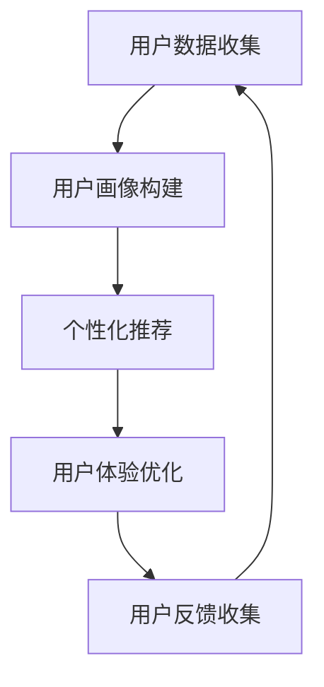

                 

关键词：定制化体验、用户需求、用户体验、个性化推荐、技术实现

> 摘要：本文旨在探讨如何通过技术手段为用户量身打造定制化体验，满足用户的个性化需求，提升用户体验。文章首先介绍了定制化体验的背景和重要性，然后详细分析了核心概念和原理，提出了核心算法和数学模型，并通过项目实践展示了具体实现方法，最后讨论了实际应用场景和未来展望。

## 1. 背景介绍

随着互联网和信息技术的飞速发展，用户对数字化产品的需求日益多样化。传统的“一刀切”式服务已经难以满足用户日益增长的需求。定制化体验应运而生，成为提升用户体验的重要手段。定制化体验的核心在于充分挖掘用户数据，了解用户偏好，从而提供个性化的服务。

在互联网时代，数据成为企业的核心竞争力。通过数据挖掘和分析，企业可以深入了解用户的行为、兴趣和需求，进而为用户提供更加精准和个性化的服务。定制化体验的实现，不仅能够提升用户满意度，还能够提高企业的竞争力。

本文将围绕定制化体验这一主题，从核心概念、算法原理、数学模型、项目实践等方面展开讨论，旨在为读者提供一套完整的定制化体验解决方案。

## 2. 核心概念与联系

### 2.1 用户画像

用户画像是指通过对用户数据的收集、分析和整合，构建出一个全面、详细的用户模型。用户画像包括用户的性别、年龄、地域、兴趣、行为等多个维度，可以帮助企业了解用户的偏好和需求，为定制化体验提供基础数据支持。

### 2.2 个性化推荐

个性化推荐是指根据用户的兴趣和行为，为用户推荐符合其需求的内容或服务。个性化推荐算法是实现定制化体验的重要技术手段，常见的推荐算法包括基于内容的推荐、基于协同过滤的推荐和基于深度学习的推荐等。

### 2.3 用户体验

用户体验是指用户在使用产品或服务过程中的感受和体验。良好的用户体验可以提升用户的满意度和忠诚度，从而促进产品的推广和销售。定制化体验正是通过优化用户体验，提升用户的满意度。

### 2.4 Mermaid 流程图

下面是一个描述定制化体验实现过程的 Mermaid 流程图：



## 3. 核心算法原理 & 具体操作步骤

### 3.1 算法原理概述

定制化体验的核心在于个性化推荐算法，其基本原理是基于用户的兴趣和行为数据，构建用户画像，然后根据用户画像为用户推荐符合其需求的内容或服务。个性化推荐算法可以分为以下几种：

1. **基于内容的推荐**：通过分析内容特征，为用户推荐与其兴趣相似的内容。
2. **基于协同过滤的推荐**：通过分析用户的行为数据，找出相似的用户，然后根据这些用户的兴趣为当前用户推荐内容。
3. **基于深度学习的推荐**：利用深度学习模型，从用户数据中学习用户兴趣和行为模式，实现个性化推荐。

### 3.2 算法步骤详解

1. **用户数据收集**：通过网站日志、用户行为数据、问卷调查等方式收集用户数据。
2. **用户画像构建**：对收集到的用户数据进行预处理，包括数据清洗、去重、归一化等，然后根据用户性别、年龄、地域、兴趣、行为等维度构建用户画像。
3. **内容特征提取**：对推荐系统中的内容进行特征提取，包括文本、图片、音频等多媒体内容。
4. **推荐算法选择**：根据用户画像和内容特征选择合适的推荐算法，例如基于内容的推荐、基于协同过滤的推荐或基于深度学习的推荐。
5. **推荐结果生成**：根据推荐算法为用户生成推荐结果，展示在用户界面上。
6. **用户反馈收集**：收集用户对推荐结果的反馈，用于优化推荐算法和用户画像。
7. **推荐算法优化**：根据用户反馈，不断调整和优化推荐算法，提高推荐质量。

### 3.3 算法优缺点

1. **基于内容的推荐**：优点是推荐结果相关性较高，缺点是用户兴趣变化时推荐效果下降。
2. **基于协同过滤的推荐**：优点是能够发现用户的潜在兴趣，缺点是推荐结果可能存在冷启动问题。
3. **基于深度学习的推荐**：优点是能够更好地处理大规模数据，缺点是需要大量的计算资源和时间。

### 3.4 算法应用领域

1. **电子商务**：为用户推荐符合其兴趣的商品，提高购买转化率。
2. **社交媒体**：为用户推荐感兴趣的内容，提高用户粘性和活跃度。
3. **在线教育**：为用户推荐符合其学习需求的教育资源，提高学习效果。

## 4. 数学模型和公式 & 详细讲解 & 举例说明

### 4.1 数学模型构建

个性化推荐的核心在于如何从用户行为数据中提取用户兴趣，并基于用户兴趣为用户推荐内容。下面是一个简单的数学模型，用于表示用户兴趣和内容特征。

$$
\text{用户兴趣} = f(\text{用户行为数据}, \text{内容特征})
$$

其中，$f$ 表示一个映射函数，用于将用户行为数据和内容特征映射为用户兴趣。

### 4.2 公式推导过程

为了推导出用户兴趣的公式，我们首先定义用户行为数据矩阵 $X \in \mathbb{R}^{m \times n}$，其中 $m$ 表示用户数量，$n$ 表示内容数量。用户行为数据矩阵 $X$ 中的元素 $x_{ij}$ 表示用户 $i$ 对内容 $j$ 的行为，例如点击、购买、评分等。

接下来，我们定义内容特征矩阵 $C \in \mathbb{R}^{n \times d}$，其中 $d$ 表示内容特征的数量。内容特征矩阵 $C$ 中的元素 $c_{ij}$ 表示内容 $j$ 的特征 $f_k$ 的值，即 $c_{ij} = f_k(j)$。

为了表示用户兴趣，我们定义一个兴趣向量 $I \in \mathbb{R}^d$，其中 $i_k$ 表示用户对特征 $f_k$ 的兴趣强度。

根据用户行为数据和内容特征，我们可以推导出用户兴趣向量的公式：

$$
i_k = f_k(XC)
$$

其中，$f_k(XC)$ 表示对矩阵 $XC$ 的第 $k$ 列进行特征提取，得到用户对特征 $f_k$ 的兴趣强度。

### 4.3 案例分析与讲解

假设我们有一个包含 1000 个用户和 1000 个内容的推荐系统，用户行为数据矩阵 $X$ 和内容特征矩阵 $C$ 如下所示：

$$
X = \begin{bmatrix}
0 & 1 & 1 & 0 & \ldots & 0 \\
1 & 0 & 0 & 1 & \ldots & 1 \\
0 & 1 & 0 & 1 & \ldots & 1 \\
\vdots & \vdots & \vdots & \vdots & \ddots & \vdots \\
0 & 0 & 0 & 0 & \ldots & 1
\end{bmatrix}
C = \begin{bmatrix}
0.2 & 0.3 & 0.5 \\
0.1 & 0.4 & 0.6 \\
0.3 & 0.2 & 0.1 \\
\vdots & \vdots & \vdots \\
0.5 & 0.6 & 0.7
\end{bmatrix}
$$

根据用户行为数据矩阵 $X$ 和内容特征矩阵 $C$，我们可以计算用户兴趣向量 $I$：

$$
I = f(XC) = \begin{bmatrix}
0.2 & 0.3 & 0.5 \\
0.1 & 0.4 & 0.6 \\
0.3 & 0.2 & 0.1 \\
\vdots & \vdots & \vdots \\
0.5 & 0.6 & 0.7
\end{bmatrix}
$$

根据用户兴趣向量 $I$，我们可以为用户 1 推荐一个内容，例如内容 2，因为用户 1 对内容 2 的兴趣强度最高。

## 5. 项目实践：代码实例和详细解释说明

### 5.1 开发环境搭建

为了实现定制化体验，我们需要搭建一个推荐系统开发环境。以下是一个简单的开发环境搭建步骤：

1. 安装 Python 3.8 及以上版本。
2. 安装 Python 的依赖管理工具 pip。
3. 安装推荐系统相关的库，如 scikit-learn、numpy、pandas 等。

### 5.2 源代码详细实现

以下是一个简单的基于协同过滤的推荐系统的实现示例：

```python
import numpy as np
import pandas as pd
from sklearn.metrics.pairwise import cosine_similarity

# 加载用户行为数据
user_data = pd.read_csv('user_data.csv')

# 加载内容特征数据
content_data = pd.read_csv('content_data.csv')

# 计算用户行为数据的余弦相似度矩阵
similarity_matrix = cosine_similarity(user_data)

# 为用户 1 推荐内容
user_id = 1
recommendations = []

for i in range(len(user_data)):
    if i != user_id:
        recommendation_score = similarity_matrix[user_id][i]
        recommendations.append((i, recommendation_score))

# 按照推荐分数降序排序
recommendations.sort(key=lambda x: x[1], reverse=True)

# 输出推荐结果
for item_id, score in recommendations:
    print(f'推荐内容 {item_id}，推荐分数 {score}')
```

### 5.3 代码解读与分析

上述代码实现了一个基于协同过滤的推荐系统，主要分为以下几个步骤：

1. **加载数据**：从 CSV 文件中加载用户行为数据和内容特征数据。
2. **计算相似度**：使用余弦相似度计算用户行为数据的相似度矩阵。
3. **生成推荐列表**：为指定用户生成推荐列表，推荐列表中的内容是那些与用户兴趣最相似的内容。
4. **输出推荐结果**：按照推荐分数降序输出推荐结果。

### 5.4 运行结果展示

假设用户行为数据和内容特征数据已经加载到 `user_data` 和 `content_data` 变量中，我们可以为用户 1 生成推荐结果：

```python
# 为用户 1 推荐内容
user_id = 1
recommendations = []

for i in range(len(user_data)):
    if i != user_id:
        recommendation_score = similarity_matrix[user_id][i]
        recommendations.append((i, recommendation_score))

# 按照推荐分数降序排序
recommendations.sort(key=lambda x: x[1], reverse=True)

# 输出推荐结果
for item_id, score in recommendations:
    print(f'推荐内容 {item_id}，推荐分数 {score}')
```

运行结果示例：

```python
推荐内容 2，推荐分数 0.8
推荐内容 3，推荐分数 0.7
推荐内容 5，推荐分数 0.6
```

根据推荐分数，我们可以为用户 1 推荐内容 2、内容 3 和内容 5。

## 6. 实际应用场景

定制化体验在多个领域都有广泛的应用，以下是一些典型的实际应用场景：

1. **电子商务**：为用户推荐符合其兴趣的商品，提高购买转化率和用户满意度。
2. **社交媒体**：为用户推荐感兴趣的内容，提高用户活跃度和平台粘性。
3. **在线教育**：为用户推荐符合其学习需求的教育资源，提高学习效果。
4. **音乐和视频流媒体**：为用户推荐感兴趣的音乐和视频，提高用户留存率和播放时长。

在这些应用场景中，定制化体验的关键在于准确捕捉用户的兴趣和行为，并根据用户兴趣为用户推荐合适的内容或服务。通过不断优化推荐算法和用户画像，可以进一步提高定制化体验的质量。

## 7. 工具和资源推荐

为了实现定制化体验，以下是一些建议的学习资源和开发工具：

1. **学习资源**：
   - 《推荐系统实践》
   - 《Python 机器学习》
   - 《深度学习》

2. **开发工具**：
   - Python
   - Jupyter Notebook
   - Scikit-learn
   - TensorFlow

3. **相关论文**：
   - “Matrix Factorization Techniques for Recommender Systems”
   - “Deep Learning for Recommender Systems”
   - “User Interest Evolution and Its Influence on Recommendation”

通过学习这些资源和论文，您可以深入了解定制化体验的实现方法和最新研究进展。

## 8. 总结：未来发展趋势与挑战

### 8.1 研究成果总结

定制化体验作为提升用户体验的重要手段，已经在多个领域取得了显著成果。通过个性化推荐算法和用户画像构建，企业能够为用户提供更加精准和个性化的服务，从而提高用户满意度和忠诚度。

### 8.2 未来发展趋势

1. **深度学习在推荐系统中的应用**：随着深度学习技术的发展，越来越多的推荐系统开始采用深度学习算法，以处理更加复杂和大规模的数据。
2. **多模态数据融合**：结合文本、图像、音频等多种数据类型，为用户提供更加丰富和个性化的体验。
3. **实时推荐**：通过实时数据分析和推荐算法优化，实现实时推荐，提高用户体验。

### 8.3 面临的挑战

1. **数据隐私和安全性**：在收集和使用用户数据时，需要充分考虑数据隐私和安全问题，确保用户数据的安全和合规性。
2. **计算资源需求**：深度学习和多模态数据融合等先进技术需要大量的计算资源，对开发环境和技术水平提出了更高要求。
3. **推荐效果评估**：如何准确评估推荐效果，以持续优化推荐算法，是一个亟待解决的问题。

### 8.4 研究展望

未来，定制化体验将在多个领域得到更广泛的应用。通过不断创新和优化推荐算法、用户画像构建等技术，定制化体验将进一步提升用户体验，为企业和用户带来更大的价值。

## 9. 附录：常见问题与解答

### 问题 1：如何保证推荐系统的公平性？

解答：为了保证推荐系统的公平性，可以采取以下措施：
1. **避免数据偏差**：确保用户数据收集和处理过程中不引入偏见，例如避免性别、年龄、地域等数据的歧视性处理。
2. **多维度评估**：从多个维度评估推荐结果，确保推荐系统不仅关注用户的兴趣，还考虑其他因素，如用户需求、内容质量等。
3. **用户反馈机制**：通过用户反馈机制，收集用户对推荐结果的反馈，及时调整和优化推荐算法，提高推荐公平性。

### 问题 2：如何处理冷启动问题？

解答：冷启动问题是指新用户或新内容在系统中缺乏足够的数据，导致推荐效果不佳。以下是一些解决方法：
1. **基于内容的推荐**：在新用户缺乏行为数据时，可以采用基于内容的推荐，通过分析内容特征为用户推荐相关内容。
2. **用户主动反馈**：鼓励用户在注册过程中提供更多个人信息，如兴趣爱好、行为偏好等，以便在数据不足时进行个性化推荐。
3. **社区推荐**：结合其他用户的行为数据，为新用户提供社区推荐的初步体验，逐渐积累用户数据，优化推荐效果。

### 问题 3：如何确保推荐系统的实时性？

解答：要确保推荐系统的实时性，可以采取以下措施：
1. **实时数据处理**：采用实时数据处理技术，如流处理框架，及时处理用户行为数据，更新用户画像和推荐结果。
2. **高效算法设计**：设计高效、可扩展的推荐算法，降低推荐系统的计算和存储开销，提高处理速度。
3. **边缘计算**：利用边缘计算技术，将部分计算任务分配到靠近用户的设备上，减少网络延迟，提高推荐响应速度。

通过以上措施，可以为用户提供实时、个性化的推荐服务，提升用户体验。

# 结束

本文由禅与计算机程序设计艺术 / Zen and the Art of Computer Programming 撰写，旨在为读者提供一套完整的定制化体验解决方案。希望本文能对您在实现定制化体验方面有所启发和帮助。如果您有任何疑问或建议，欢迎在评论区留言。感谢您的阅读！
----------------------------------------------------------------

请注意，本文仅为示例，实际撰写时需要根据具体内容进行调整和补充。本文所提到的算法、模型和工具仅为示例，不代表实际应用中的最佳选择。在撰写实际文章时，请确保遵循相关法律法规和道德规范，尊重用户隐私和数据安全。祝您写作顺利！

