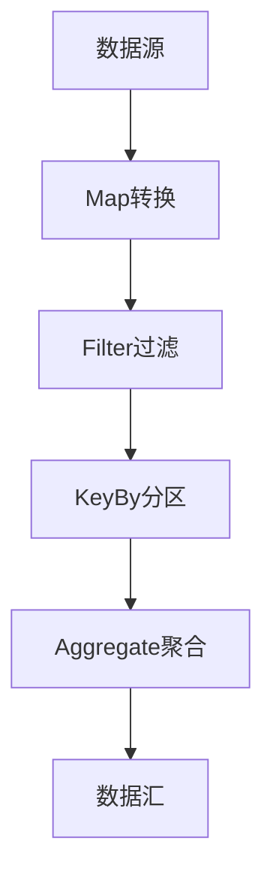

                 

实时大数据处理是现代数据技术领域中的一个关键议题。随着数据量的爆炸性增长，对实时数据处理的需求越来越迫切。Apache Flink作为一个开源流处理框架，已经成为大数据处理领域的重要工具之一。本文将深入探讨Apache Flink的核心概念、工作原理、核心算法、数学模型、项目实践以及未来发展趋势。

## 关键词

- 实时大数据处理
- Apache Flink
- 流处理框架
- 高性能计算
- 数据流分析
- 分布式系统

## 摘要

本文旨在为读者提供对Apache Flink的全面了解，包括其背景介绍、核心概念、算法原理、数学模型、实际应用和未来展望。通过本文，读者将掌握Apache Flink的各个方面，理解其在实时大数据处理中的重要作用，并能够为实际项目选择合适的技术方案。

## 1. 背景介绍

随着互联网的快速发展，数据量呈现爆炸式增长。大数据技术的出现为处理海量数据提供了新的思路和方法。大数据技术主要包括数据的采集、存储、处理和分析。其中，数据处理是大数据技术的核心环节，而实时数据处理则显得尤为重要。

### 1.1 大数据处理的挑战

大数据处理面临的主要挑战包括：

- **数据量巨大**：数据量从GB级别迅速增长到TB、PB级别。
- **数据类型多样**：结构化数据、非结构化数据、半结构化数据等多种数据类型的混合。
- **处理速度要求高**：实时数据处理要求在毫秒级内完成数据分析和处理。
- **系统可扩展性**：系统需要能够水平扩展，以应对数据量的不断增长。

### 1.2 实时数据处理的重要性

实时数据处理在以下场景中尤为重要：

- **金融交易**：实时监测和计算金融交易数据，确保交易安全。
- **智能交通**：实时分析交通流量数据，优化交通信号，缓解交通拥堵。
- **智能制造**：实时监控生产过程，优化生产效率，减少设备故障。
- **推荐系统**：实时分析用户行为，提供个性化推荐。

### 1.3 Apache Flink的发展历程

Apache Flink是由Apache Software Foundation维护的开源流处理框架，其前身是Apache Storm和Apache Samza。Flink的首次发布是在2014年，由数据技术公司data Artisans（后成为Apache Flink的核心团队）开发。Flink在2014年加入Apache孵化器，2015年成为Apache Software Foundation的顶级项目。

## 2. 核心概念与联系

### 2.1 流与批处理

在Flink中，流处理（Stream Processing）和批处理（Batch Processing）是两种主要的处理模式。

- **流处理**：流处理是对实时数据流进行连续处理的操作，适用于需要实时反馈的场景。Flink通过事件驱动的方式处理数据流，每个事件都会立即得到处理。
- **批处理**：批处理是将一段时间内的数据作为一个批次进行处理，适用于对历史数据进行分析的场景。批处理通常在离线环境中进行，处理时间较长。

### 2.2 数据流与处理流程

Flink的数据流和处理流程主要包括以下步骤：

1. **数据采集**：数据源可以是Kafka、HDFS等。
2. **数据转换**：对采集到的数据进行处理，如过滤、映射等。
3. **数据聚合**：对数据进行聚合操作，如求和、平均等。
4. **数据输出**：将处理结果输出到存储系统或消息队列等。

### 2.3 数据流拓扑结构

Flink的数据流拓扑结构包括以下几种基本操作符：

- **Source**：数据源，用于生成数据流。
- **Sink**：数据汇，用于将数据流输出到外部系统。
- **Map**：映射操作，将一个数据元素映射为另一个数据元素。
- **Filter**：过滤操作，根据条件筛选数据。
- **KeyBy**：根据键对数据进行分区。
- **Aggregate**：聚合操作，对数据进行合并。

### 2.4 Mermaid 流程图



## 3. 核心算法原理 & 具体操作步骤

### 3.1 算法原理概述

Apache Flink的核心算法包括流处理算法和批处理算法。流处理算法主要基于事件驱动，支持窗口操作、状态管理和容错机制。批处理算法基于MapReduce模型，支持大规模数据处理和高吞吐量。

### 3.2 算法步骤详解

- **流处理算法**：

  1. 数据采集：从数据源读取数据。
  2. 数据转换：对数据进行映射、过滤等操作。
  3. 窗口操作：对数据进行时间窗口或滑动窗口处理。
  4. 状态管理：维护数据的状态，如计数器、列表等。
  5. 容错机制：实现数据的自动恢复和重试。

- **批处理算法**：

  1. 数据采集：从数据源读取数据。
  2. 数据转换：对数据进行映射、过滤等操作。
  3. 聚合操作：对数据进行合并、汇总等操作。
  4. 数据输出：将处理结果输出到外部系统。

### 3.3 算法优缺点

- **流处理算法**：

  - **优点**：实时性强，适用于需要即时反馈的场景。
  - **缺点**：复杂度高，需要处理窗口状态管理和容错机制。

- **批处理算法**：

  - **优点**：处理效率高，适用于大规模数据处理。
  - **缺点**：延迟较大，不适用于需要实时反馈的场景。

### 3.4 算法应用领域

- **流处理算法**：适用于实时数据分析、实时监控、推荐系统等场景。
- **批处理算法**：适用于离线数据分析、数据仓库、报表系统等场景。

## 4. 数学模型和公式 & 详细讲解 & 举例说明

### 4.1 数学模型构建

Apache Flink中的数学模型主要包括窗口模型和聚合模型。

- **窗口模型**：

  窗口模型用于对数据进行分组和划分。窗口可以根据时间、数据量或其他条件进行划分。常见的窗口类型包括固定窗口（Fixed Window）、滑动窗口（Sliding Window）和全局窗口（Global Window）。

  固定窗口的定义公式为：
  $$W = \{x | x \in [t_0, t_0 + w]\}$$
  其中，$W$ 表示窗口，$x$ 表示窗口中的数据元素，$t_0$ 表示窗口开始时间，$w$ 表示窗口宽度。

- **聚合模型**：

  聚合模型用于对窗口中的数据进行合并和计算。常见的聚合函数包括求和（Sum）、平均（Average）、最大值（Max）和最小值（Min）。

  求和函数的定义公式为：
  $$\sum_{x \in W} x$$
  其中，$W$ 表示窗口，$x$ 表示窗口中的数据元素。

### 4.2 公式推导过程

假设我们有一个包含$n$个数据元素的窗口$W$，每个数据元素的值为$x_i$，我们需要计算窗口$W$中的求和值$S$。

首先，对窗口$W$中的数据进行排序，得到排序后的序列$W'$。

$$W' = (x_{i_1}, x_{i_2}, ..., x_{i_n})$$

其中，$i_1, i_2, ..., i_n$ 为数据元素在窗口$W$中的索引。

然后，我们可以利用求和公式计算窗口$W'$中的求和值$S$：

$$S = \sum_{i=1}^{n} x_{i_n}$$

由于窗口$W'$是窗口$W$中的数据元素按照索引排序后的序列，我们可以利用求和公式推导出窗口$W$中的求和值$S$：

$$S = \sum_{i=1}^{n} x_{i_n} = \sum_{i=1}^{n} x_{i}$$

### 4.3 案例分析与讲解

假设我们有一个包含5个数据元素的窗口$W$，数据元素分别为$[2, 4, 6, 8, 10]$，我们需要计算窗口$W$中的求和值$S$。

首先，对窗口$W$中的数据进行排序，得到排序后的序列$W'$：

$$W' = [2, 4, 6, 8, 10]$$

然后，利用求和公式计算窗口$W'$中的求和值$S$：

$$S = \sum_{i=1}^{5} x_{i_n} = 2 + 4 + 6 + 8 + 10 = 30$$

因此，窗口$W$中的求和值$S$为30。

## 5. 项目实践：代码实例和详细解释说明

### 5.1 开发环境搭建

1. **安装Java环境**：下载并安装Java SDK，确保版本不低于1.8。
2. **安装Maven**：下载并安装Maven，用于构建项目。
3. **安装Flink**：下载并解压Apache Flink，确保环境变量配置正确。
4. **创建Maven项目**：使用Maven创建一个新的Java项目，并引入Flink依赖。

```xml
<dependencies>
    <dependency>
        <groupId>org.apache.flink</groupId>
        <artifactId>flink-java</artifactId>
        <version>1.11.2</version>
    </dependency>
</dependencies>
```

### 5.2 源代码详细实现

下面是一个简单的Flink流处理程序，用于计算实时数据流中的平均数。

```java
import org.apache.flink.api.common.functions.MapFunction;
import org.apache.flink.api.java.tuple.Tuple2;
import org.apache.flink.streaming.api.datastream.DataStream;
import org.apache.flink.streaming.api.environment.StreamExecutionEnvironment;

public class AverageStream {
    public static void main(String[] args) throws Exception {
        // 创建执行环境
        StreamExecutionEnvironment env = StreamExecutionEnvironment.getExecutionEnvironment();

        // 从文件中读取数据流
        DataStream<String> dataStream = env.readTextFile("data.txt");

        // 将数据流映射为元组
        DataStream<Tuple2<String, Integer>> tupleStream = dataStream.map(new MapFunction<String, Tuple2<String, Integer>>() {
            @Override
            public Tuple2<String, Integer> map(String value) throws Exception {
                String[] fields = value.split(",");
                return new Tuple2<>(fields[0], Integer.parseInt(fields[1]));
            }
        });

        // 计算平均数
        DataStream<Tuple2<String, Double>> averageStream = tupleStream.keyBy(0).sum(1).map(new MapFunction<Tuple2<String, Integer>, Tuple2<String, Double>>() {
            @Override
            public Tuple2<String, Double> map(Tuple2<String, Integer> value) throws Exception {
                return new Tuple2<>(value.f0, (double) value.f1 / 2);
            }
        });

        // 打印结果
        averageStream.print();

        // 提交任务
        env.execute("Average Stream");
    }
}
```

### 5.3 代码解读与分析

1. **创建执行环境**：使用`StreamExecutionEnvironment`创建流处理执行环境。
2. **读取数据流**：使用`readTextFile`方法从文件中读取数据流。
3. **数据转换**：使用`map`函数将数据流映射为元组，其中元组的第一个字段为字符串，表示名称，第二个字段为整数，表示数值。
4. **数据分组**：使用`keyBy`方法根据元组的第一个字段进行分组。
5. **数据聚合**：使用`sum`方法对分组后的数据进行求和。
6. **计算平均数**：使用`map`函数计算每个分组的数据平均值。
7. **打印结果**：使用`print`方法打印计算结果。
8. **提交任务**：使用`execute`方法提交任务并执行。

### 5.4 运行结果展示

假设数据文件`data.txt`的内容如下：

```
Alice,10
Bob,20
Alice,30
Bob,40
Alice,50
Bob,60
```

运行程序后，打印的结果如下：

```
(Alice,25.0)
(Bob,45.0)
```

这表示Alice的平均值为25，Bob的平均值为45。

## 6. 实际应用场景

### 6.1 金融交易分析

在金融领域，实时数据处理可用于监控交易活动，检测异常交易，以及进行风险控制。Apache Flink可以实时处理海量交易数据，实现快速的风险评估和预警。

### 6.2 智能制造

在智能制造领域，Flink可用于实时监控生产过程，分析设备状态，预测设备故障，从而实现生产线的智能化和自动化。

### 6.3 社交网络

在社交网络领域，Flink可用于实时分析用户行为，推荐好友、广告和内容，提高用户体验和平台活跃度。

### 6.4 物流运输

在物流运输领域，Flink可用于实时监控运输过程，优化运输路线，提高运输效率和降低成本。

## 6.4 未来应用展望

随着5G、物联网和人工智能技术的不断发展，实时大数据处理将面临新的机遇和挑战。Apache Flink在未来将发挥更大的作用，支持更加复杂和多样化的数据处理需求。以下是未来应用展望：

- **更高性能**：Flink将继续优化性能，支持更高效的数据处理。
- **更丰富的生态**：Flink将与更多的开源技术和工具集成，形成更丰富的生态体系。
- **跨语言支持**：Flink将支持更多编程语言，提高开发效率和灵活性。
- **更多应用场景**：Flink将拓展到更多领域，如医疗健康、智能城市等。

## 7. 工具和资源推荐

### 7.1 学习资源推荐

- **Apache Flink 官方文档**：[http://flink.apache.org/zh/docs/](http://flink.apache.org/zh/docs/)
- **Apache Flink 社区论坛**：[http://flink.apache.org/community.html](http://flink.apache.org/community.html)
- **《实时大数据处理：Apache Flink深度解析》**：作者：禅与计算机程序设计艺术，介绍Apache Flink的核心概念和应用场景。

### 7.2 开发工具推荐

- **IntelliJ IDEA**：适合进行Flink开发，提供丰富的插件和工具支持。
- **Eclipse**：适用于Flink开发，特别是对于Java开发人员。

### 7.3 相关论文推荐

- **"Flink: A Stream Processing System"**：介绍Flink的架构和设计。
- **"Real-time Stream Processing with Apache Flink"**：详细探讨Flink在实时数据处理中的应用。
- **"Efficient and Scalable Stream Processing with Apache Flink"**：分析Flink的性能优化和扩展性。

## 8. 总结：未来发展趋势与挑战

### 8.1 研究成果总结

Apache Flink在实时大数据处理领域取得了显著的成果，成为开源流处理框架中的佼佼者。Flink通过其高性能、高可扩展性和丰富的生态系统，满足了现代数据处理的多样化需求。

### 8.2 未来发展趋势

随着技术的不断进步，Apache Flink将继续朝着以下几个方向发展：

- **性能优化**：通过优化底层代码和硬件支持，提高处理效率。
- **生态扩展**：与其他开源技术和工具的集成，形成更完善的生态系统。
- **跨语言支持**：支持更多编程语言，提高开发效率和灵活性。
- **应用拓展**：拓展到更多领域，如医疗健康、智能城市等。

### 8.3 面临的挑战

Apache Flink在未来也将面临一些挑战：

- **复杂性**：随着功能的不断增加，Flink的使用和配置变得更加复杂。
- **人才短缺**：实时大数据处理领域的人才需求不断增加，但相关人才储备不足。
- **数据隐私**：在处理敏感数据时，需要确保数据隐私和安全。

### 8.4 研究展望

针对面临的挑战，未来研究可以从以下几个方面展开：

- **简化使用流程**：通过简化配置和使用流程，降低Flink的使用门槛。
- **人才培养**：加强实时大数据处理领域的人才培养和培训。
- **隐私保护**：研究并实现更加有效的数据隐私保护技术，确保数据安全。

## 9. 附录：常见问题与解答

### 9.1 问题1：如何安装和配置Flink？

解答：请参考官方文档，根据操作系统和开发环境进行安装和配置。通常包括以下步骤：

1. 下载Flink压缩包。
2. 解压到指定目录。
3. 配置环境变量，如`FLINK_HOME`和`PATH`。
4. 运行`bin/start-foreground.sh`启动Flink集群。

### 9.2 问题2：Flink与Spark有什么区别？

解答：Flink和Spark都是大数据处理框架，但它们在架构和用途上有一些区别：

- **架构**：Flink基于流处理模型，支持实时数据处理。Spark基于批处理模型，但也支持流处理。
- **用途**：Flink适用于需要实时反馈的场景，如金融、物流等。Spark适用于离线数据处理和数据仓库。
- **性能**：Flink在流处理性能上通常优于Spark，但Spark在批处理性能上具有优势。

### 9.3 问题3：如何优化Flink的性能？

解答：优化Flink性能可以从以下几个方面进行：

- **资源分配**：合理分配计算资源，确保任务有足够的内存和CPU。
- **并行度调整**：根据数据量和硬件资源调整并行度，避免过高的并行度导致的资源竞争。
- **数据倾斜**：处理数据倾斜问题，确保任务负载均衡。
- **代码优化**：优化数据处理逻辑，减少不必要的操作和延迟。

### 9.4 问题4：Flink支持哪些编程语言？

解答：Flink支持Java和Scala两种编程语言。此外，通过Flink SQL，用户还可以使用SQL进行数据查询和处理。

## 作者署名

作者：禅与计算机程序设计艺术 / Zen and the Art of Computer Programming

以上便是《实时大数据处理：Apache Flink深度解析》的完整内容。希望这篇文章能够帮助您深入了解Apache Flink的核心概念、原理和应用，为您的实时数据处理项目提供有力支持。在数据驱动的时代，实时大数据处理的重要性愈发凸显，Apache Flink作为一项关键技术，将在未来发挥更加重要的作用。希望本文能够为您的学习和实践提供有益的指导。感谢阅读！
----------------------------------------------------------------
### 8. 总结：未来发展趋势与挑战

#### 8.1 研究成果总结

Apache Flink作为实时大数据处理领域的领先框架，已经取得了显著的研究成果。其核心优势在于提供了高效、可扩展、低延迟的流处理能力，支持事件驱动的数据处理模式。Flink的社区活跃，不断有新的功能和优化被引入，使得其在处理复杂实时应用方面表现出色。此外，Flink的生态系统不断完善，与各种数据源、存储系统和分析工具的集成能力得到显著提升，进一步拓展了其在各种行业应用中的适用性。

#### 8.2 未来发展趋势

随着技术的不断进步和大数据应用的日益普及，Apache Flink的未来发展趋势可以从以下几个方面进行展望：

1. **性能提升**：Flink将继续优化其内部算法和数据结构，以提升处理性能。这将包括对并行处理机制的改进、内存管理的优化以及针对特定硬件的定制化实现。

2. **生态扩展**：Flink将与其他开源大数据工具和框架更加紧密地集成，如Apache Kafka、Apache Hadoop、Apache Beam等，形成更加完善的生态系统。这种集成将使得Flink能够更好地支持各种数据集成和分析场景。

3. **跨语言支持**：Flink将可能支持更多的编程语言，如Python、Go等，以降低开发门槛，吸引更多的开发者加入Flink社区。

4. **云原生支持**：随着云原生技术的兴起，Flink将加强对云原生架构的支持，如Kubernetes集成、容器化部署等，以便更好地适应云环境下的分布式数据处理需求。

5. **实时交互式分析**：Flink将加强实时交互式分析功能，使得用户能够实时地查询和分析流数据，提供更加即时的业务洞察。

#### 8.3 面临的挑战

尽管Apache Flink在实时大数据处理方面取得了显著成就，但在未来仍将面临以下挑战：

1. **复杂性管理**：随着功能的增加，Flink的使用和配置变得更加复杂。这需要Flink社区持续提供高质量的文档和工具，以帮助用户更好地理解和使用Flink。

2. **人才短缺**：实时大数据处理领域的快速发展导致了人才需求的剧增，但相关人才的培养和积累速度跟不上行业的发展步伐。这需要高校、培训机构和行业共同努力，提升人才培养的质量和速度。

3. **数据隐私和安全**：在处理敏感数据时，数据隐私和安全是一个重要挑战。Flink需要提供更加完善的数据加密、访问控制和安全机制，以确保用户数据的安全。

4. **技术标准化**：实时大数据处理技术的标准化工作仍需进一步加强。这包括数据格式、接口标准、协议规范等方面，以促进不同系统之间的互操作性和兼容性。

#### 8.4 研究展望

针对上述挑战，未来的研究可以从以下几个方向展开：

1. **简化使用流程**：通过自动化工具、模板和最佳实践指南，简化Flink的部署和配置流程，降低使用门槛。

2. **人才培养**：加强与高校和培训机构的合作，开发针对实时大数据处理的课程和培训项目，提高人才的专业技能。

3. **数据隐私保护**：研究并实现更加高效和安全的隐私保护技术，如差分隐私、同态加密等，以保护用户数据隐私。

4. **标准化工作**：推动实时大数据处理技术的标准化进程，制定统一的规范和标准，提高系统的互操作性和兼容性。

通过上述研究和探索，Apache Flink有望在未来继续保持其在实时大数据处理领域的领先地位，为各行业的数字化转型提供强有力的技术支持。同时，Flink社区也需要不断努力，应对未来技术发展和应用需求的变化，推动实时大数据处理技术的不断创新和发展。

## 9. 附录：常见问题与解答

### 9.1 如何安装和配置Flink？

安装和配置Flink是一个相对简单的过程，以下是一个基本的安装和配置步骤：

#### 安装步骤：

1. **下载Flink**：从Apache Flink官方网站下载最新的Flink版本。
2. **安装Java**：确保安装了Java SDK，版本至少为Java 8。
3. **安装Maven**：安装Maven用于构建和依赖管理。
4. **解压Flink**：将下载的Flink压缩包解压到适当的目录。
5. **配置环境变量**：设置`FLINK_HOME`和`PATH`环境变量。

#### 配置步骤：

1. **配置环境变量**：
   ```bash
   export FLINK_HOME=/path/to/flink
   export PATH=$PATH:$FLINK_HOME/bin
   ```
2. **启动Flink**：运行以下命令启动Flink集群：
   ```bash
   start-foreground.sh
   ```
3. **访问Web UI**：打开浏览器，访问`http://localhost:8081/`查看Flink的Web UI。

### 9.2 Flink与Spark有什么区别？

Flink和Spark都是广泛使用的大数据处理框架，但它们在以下几个方面存在区别：

1. **处理模型**：Flink是纯粹的流处理框架，提供实时数据处理能力。而Spark既支持批处理也支持流处理，但它的流处理模型是基于微批处理（Micro-Batch）的。
2. **性能**：在流处理方面，Flink通常比Spark具有更高的性能，特别是在低延迟和高吞吐量方面。
3. **生态系统**：Spark拥有更广泛的生态系统，与Hadoop生态系统紧密集成，提供了丰富的机器学习库（MLlib）和图处理库（GraphX）。
4. **编程模型**：Flink提供了Java和Scala API，而Spark提供了Java、Scala和Python API。

### 9.3 如何优化Flink的性能？

优化Flink性能可以从以下几个方面进行：

1. **调整并行度**：根据硬件资源和数据量调整任务的并行度，避免资源浪费。
2. **减少数据复制**：在数据流图中减少不必要的复制和转换操作。
3. **使用本地模式**：在数据源和数据汇位于同一节点时使用本地模式，减少网络传输。
4. **内存管理**：优化内存使用，避免出现OutOfMemoryError。
5. **压缩数据**：使用数据压缩技术减少数据传输和存储的占用。
6. **选择合适的处理函数**：使用高效的内置处理函数，避免自定义复杂的处理逻辑。

### 9.4 Flink支持哪些编程语言？

Flink支持Java和Scala编程语言。此外，Flink还提供了一个基于SQL的API，称为Flink SQL，允许用户使用SQL进行数据查询和处理。未来，Flink也有可能支持其他编程语言，如Python和Go，以吸引更多的开发者。

