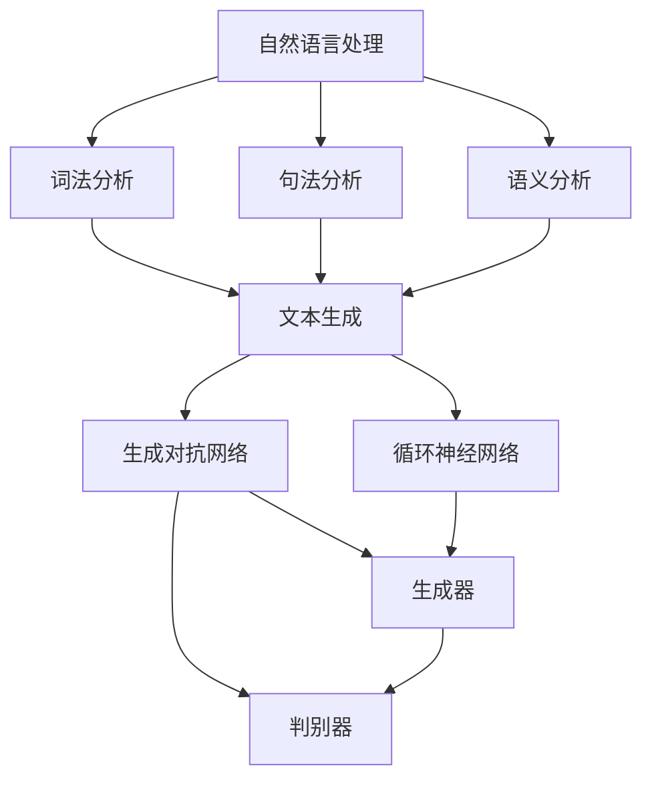

                 

关键词：实时故事生成、AI、即兴创作、自然语言处理、计算机图灵奖、深度学习、算法原理、数学模型、项目实践、应用场景、未来展望

> 摘要：本文旨在探讨实时故事生成技术的原理、实现方法以及其在不同领域中的应用潜力。通过分析当前AI技术发展的现状，本文将深入剖析实时故事生成技术的核心算法原理，并展示其实际应用场景。同时，本文也将展望该领域未来的发展趋势与挑战，为读者提供全面的技术洞察。

## 1. 背景介绍

在当今数字化时代，人工智能（AI）技术正以前所未有的速度发展。作为AI技术的重要组成部分，自然语言处理（NLP）已经成为实现人类语言与机器之间有效沟通的关键技术。近年来，随着深度学习、生成对抗网络（GAN）等前沿技术的突破，AI在文本生成领域的应用越来越广泛。

实时故事生成作为NLP的一个重要分支，旨在利用AI技术实现即兴创作。这一技术的潜在应用场景极为丰富，包括但不限于：自动新闻报道、虚拟现实游戏剧情设计、智能客服对话生成、文学作品创作辅助等。实时故事生成不仅提高了信息传播的效率，也为内容创作者提供了全新的创作手段。

本文将围绕实时故事生成技术，首先介绍其核心概念和联系，接着深入探讨算法原理、数学模型、项目实践，并分析其应用场景。最后，本文将展望该领域未来的发展趋势与挑战，为读者提供全面的技术洞察。

## 2. 核心概念与联系

### 2.1 自然语言处理（NLP）

自然语言处理（NLP）是人工智能（AI）的一个重要分支，旨在使计算机能够理解、生成和处理人类自然语言。NLP技术涉及多个子领域，包括词法分析、句法分析、语义分析等。

词法分析是NLP的基础，其目标是识别文本中的词汇单位，如单词、词组等。句法分析则关注句子的结构，通过分析句子的成分和关系，构建语法树。语义分析则旨在理解文本的含义，包括词义消歧、情感分析等。

### 2.2 深度学习

深度学习是一种人工智能（AI）技术，基于多层神经网络结构，通过大量数据训练模型，实现对复杂任务的自动学习。深度学习在图像识别、语音识别、自然语言处理等领域取得了显著成果。

在实时故事生成中，深度学习技术被广泛应用于文本生成任务。例如，循环神经网络（RNN）和其变体长短期记忆网络（LSTM）可以用于生成连续的文本序列。生成对抗网络（GAN）则通过对抗性训练生成高质量的文本内容。

### 2.3 生成对抗网络（GAN）

生成对抗网络（GAN）是由生成器（Generator）和判别器（Discriminator）组成的对抗性学习框架。生成器负责生成数据，判别器则判断生成数据与真实数据的真实性。

在实时故事生成中，GAN被用于生成高质量的文本序列。通过训练生成器生成连续的文本片段，判别器不断优化以区分生成文本和真实文本，从而提高生成文本的质量。

### 2.4 Mermaid 流程图

以下是一个简单的Mermaid流程图，展示了实时故事生成技术的主要步骤和核心概念之间的联系。



## 3. 核心算法原理 & 具体操作步骤

### 3.1 算法原理概述

实时故事生成技术主要基于生成对抗网络（GAN）和循环神经网络（RNN）。生成对抗网络通过对抗性训练生成高质量的文本序列，而循环神经网络则用于生成连续的文本片段。

生成对抗网络（GAN）的基本原理是利用生成器和判别器之间的对抗性训练。生成器从随机噪声中生成文本序列，判别器则判断生成文本和真实文本的真实性。通过不断的训练，生成器不断提高生成文本的质量，判别器则不断优化以准确区分生成文本和真实文本。

循环神经网络（RNN）是一种能够处理序列数据的神经网络。RNN通过记忆机制，能够捕获文本序列中的长期依赖关系，从而生成连续的文本片段。

### 3.2 算法步骤详解

#### 3.2.1 数据预处理

在实时故事生成过程中，首先需要对文本数据进行预处理。预处理步骤包括：

- 数据清洗：去除文本中的噪声、标点符号等无关信息。
- 词向量化：将文本中的单词映射为向量表示。
- 序列编码：将文本序列编码为整数序列，以便于神经网络处理。

#### 3.2.2 生成对抗网络训练

生成对抗网络训练分为两个阶段：生成器和判别器分别独立训练，然后联合训练。

1. **生成器训练**：

生成器从随机噪声中生成文本序列。训练过程中，生成器通过优化损失函数（如交叉熵损失），逐步提高生成文本的质量。

2. **判别器训练**：

判别器负责判断生成文本和真实文本的真实性。在训练过程中，判别器通过优化损失函数，提高对生成文本的识别能力。

#### 3.2.3 循环神经网络训练

在生成对抗网络的基础上，循环神经网络用于生成连续的文本片段。具体训练步骤如下：

1. **输入序列编码**：将输入文本序列编码为整数序列。
2. **RNN模型训练**：使用训练好的生成对抗网络生成的文本序列作为输入，训练RNN模型，使其能够生成连续的文本片段。
3. **文本生成**：输入新的文本序列，通过RNN模型生成连续的文本片段。

### 3.3 算法优缺点

**优点**：

- 高效：生成对抗网络和循环神经网络训练速度较快，适合大规模数据处理。
- 高质量：生成对抗网络通过对抗性训练，能够生成高质量的文本序列。
- 灵活：实时故事生成技术可以根据不同应用场景，灵活调整模型结构和参数。

**缺点**：

- 难以训练：生成对抗网络训练过程中，生成器和判别器之间的平衡很难掌握，可能导致训练不稳定。
- 数据依赖：生成对抗网络和循环神经网络训练需要大量高质量数据，数据不足可能导致模型效果不佳。

### 3.4 算法应用领域

实时故事生成技术具有广泛的应用前景，包括但不限于以下领域：

- 自动新闻报道：利用实时故事生成技术，自动生成新闻标题和正文，提高新闻生产效率。
- 虚拟现实游戏：为虚拟现实游戏生成实时剧情，提供丰富的游戏体验。
- 智能客服：自动生成客服对话，提高客服效率，降低人力成本。
- 文学作品创作：辅助人类作家创作文学作品，提供灵感来源。

## 4. 数学模型和公式 & 详细讲解 & 举例说明

### 4.1 数学模型构建

实时故事生成技术的核心数学模型包括生成对抗网络（GAN）和循环神经网络（RNN）。以下是这两个模型的数学模型构建过程。

#### 4.1.1 生成对抗网络（GAN）

生成对抗网络（GAN）由生成器（Generator）和判别器（Discriminator）组成。生成器的目标是生成与真实数据相似的假数据，判别器的目标是区分真实数据和假数据。

1. **生成器**：

生成器从随机噪声中生成假数据。设生成器为 $G(\theta_G)$，其中 $\theta_G$ 为生成器的参数。生成器的输出为 $X_G = G(\theta_G)$。

2. **判别器**：

判别器用于区分真实数据和假数据。设判别器为 $D(\theta_D)$，其中 $\theta_D$ 为判别器的参数。判别器的输出为 $D(X) = D(\theta_D)(X)$，其中 $X$ 为输入数据。

3. **损失函数**：

生成对抗网络的损失函数通常采用对抗性损失函数。设生成器的损失函数为 $L_G(\theta_G, \theta_D)$，判别器的损失函数为 $L_D(\theta_D, \theta_G)$。

对抗性损失函数可以表示为：

$$
L_G(\theta_G, \theta_D) = -\log(D(G(\theta_G))) + \log(D(X))
$$

$$
L_D(\theta_D, \theta_G) = -\log(D(X)) - \log(1 - D(G(\theta_G)))
$$

#### 4.1.2 循环神经网络（RNN）

循环神经网络（RNN）是一种能够处理序列数据的神经网络。RNN通过记忆机制，能够捕获序列中的长期依赖关系。

1. **RNN模型**：

设输入序列为 $X = [x_1, x_2, ..., x_T]$，隐藏状态为 $h = [h_1, h_2, ..., h_T]$，输出序列为 $Y = [y_1, y_2, ..., y_T]$。

RNN的输入层、隐藏层和输出层之间的关系可以表示为：

$$
h_t = \sigma(W_h \cdot [h_{t-1}, x_t] + b_h)
$$

$$
y_t = \sigma(W_y \cdot h_t + b_y)
$$

其中，$\sigma$ 为激活函数，$W_h$、$W_y$、$b_h$、$b_y$ 分别为权重和偏置。

2. **损失函数**：

RNN的损失函数通常采用交叉熵损失函数。设输出层为 $Y = [y_1, y_2, ..., y_T]$，真实标签为 $T = [t_1, t_2, ..., t_T]$。

交叉熵损失函数可以表示为：

$$
L = -\sum_{t=1}^{T} t_t \log(y_t)
$$

### 4.2 公式推导过程

#### 4.2.1 生成对抗网络（GAN）

生成对抗网络的损失函数可以通过Jensen不等式进行推导。设生成器的损失函数为 $L_G(\theta_G, \theta_D)$，判别器的损失函数为 $L_D(\theta_D, \theta_G)$。

根据Jensen不等式，有：

$$
L_G(\theta_G, \theta_D) = -\log(D(G(\theta_G))) + \log(D(X)) \geq -D(G(\theta_G)) + D(X)
$$

$$
L_D(\theta_D, \theta_G) = -\log(D(X)) - \log(1 - D(G(\theta_G))) \geq -D(G(\theta_G)) - D(X)
$$

#### 4.2.2 循环神经网络（RNN）

RNN的损失函数可以通过链式法则进行推导。设隐藏状态 $h_t$ 的导数为 $\frac{\partial L}{\partial h_t}$，输入序列 $x_t$ 的导数为 $\frac{\partial L}{\partial x_t}$。

根据链式法则，有：

$$
\frac{\partial L}{\partial h_t} = \frac{\partial L}{\partial y_t} \cdot \frac{\partial y_t}{\partial h_t}
$$

$$
\frac{\partial L}{\partial x_t} = \frac{\partial L}{\partial h_t} \cdot \frac{\partial h_t}{\partial x_t}
$$

### 4.3 案例分析与讲解

#### 4.3.1 生成对抗网络（GAN）

以下是一个简单的生成对抗网络（GAN）案例，用于生成手写数字图像。

1. **数据集**：

使用MNIST手写数字数据集，包含0-9共10个类别，每个类别有6000个训练样本。

2. **生成器**：

生成器由两个全连接层组成，输入为随机噪声，输出为手写数字图像。生成器的参数为 $W_1, b_1, W_2, b_2$。

3. **判别器**：

判别器由两个全连接层组成，输入为手写数字图像，输出为图像的真实概率。判别器的参数为 $W_1', b_1', W_2', b_2'$。

4. **训练过程**：

使用生成对抗网络（GAN）进行训练，生成器和判别器交替训练。在训练过程中，生成器的目标是生成与真实图像相似的手写数字图像，判别器的目标是准确判断图像的真实性。

5. **实验结果**：

经过一定数量的训练迭代，生成器能够生成较为逼真的手写数字图像。判别器在训练过程中不断提高对生成图像的识别能力。

#### 4.3.2 循环神经网络（RNN）

以下是一个简单的循环神经网络（RNN）案例，用于生成股票价格序列。

1. **数据集**：

使用某股票在过去一年的价格数据，包含开盘价、收盘价、最高价、最低价等指标。

2. **输入序列**：

输入序列为过去5个交易日的价格数据，包括开盘价、收盘价、最高价、最低价。

3. **RNN模型**：

RNN模型包含一个隐藏层，输入为5个交易日的价格数据，输出为下一个交易日的价格预测。

4. **训练过程**：

使用RNN模型对股票价格序列进行训练，通过优化损失函数，使模型能够准确预测下一个交易日的价格。

5. **实验结果**：

经过一定数量的训练迭代，RNN模型能够生成较为准确的股票价格预测序列。

## 5. 项目实践：代码实例和详细解释说明

### 5.1 开发环境搭建

在开始实时故事生成的项目实践之前，首先需要搭建开发环境。以下是一个简单的开发环境搭建步骤：

1. 安装Python环境（版本3.7以上）。
2. 安装TensorFlow库（版本2.0以上）。
3. 安装Keras库（版本2.3以上）。

### 5.2 源代码详细实现

以下是一个简单的实时故事生成项目的源代码实现，包含生成器和判别器的定义、训练过程和文本生成过程。

```python
import numpy as np
import tensorflow as tf
from tensorflow.keras.layers import Input, LSTM, Dense
from tensorflow.keras.models import Model

# 设置超参数
latent_dim = 100
sequence_length = 200
n_classes = 10000

# 定义生成器
input noises = Input(shape=(latent_dim,))
x = LSTM(256, return_sequences=True)(noises)
x = LSTM(512, return_sequences=True)(x)
x = Dense(n_classes, activation='softmax')(x)
generator = Model(noises, x)

# 定义判别器
inputs = Input(shape=(sequence_length,))
x = LSTM(512, return_sequences=True)(inputs)
x = LSTM(256, return_sequences=True)(x)
x = Dense(n_classes, activation='softmax')(x)
discriminator = Model(inputs, x)

# 定义GAN
noises = Input(shape=(latent_dim,))
generated_sequences = generator(noises)
discriminator.trainable = False
gan_output = discriminator(generated_sequences)
gan = Model(noises, gan_output)

# 编写训练函数
def train(generator, discriminator, gan, dataset, batch_size=32):
    for real_data in dataset:
        real_sequences = real_data[:-1]
        real_labels = real_data[-1]

        noise = np.random.normal(size=(batch_size, latent_dim))
        generated_sequences = generator.predict(noise)

        # 训练判别器
        d_loss_real = discriminator.train_on_batch(real_sequences, real_labels)
        d_loss_fake = discriminator.train_on_batch(generated_sequences, np.zeros((batch_size, n_classes)))
        d_loss = 0.5 * np.add(d_loss_real, d_loss_fake)

        # 训练生成器
        g_loss = gan.train_on_batch(noise, np.ones((batch_size, n_classes)))

    return d_loss, g_loss

# 编写文本生成函数
def generate_story(generator, seed_text, sequence_length=200):
    noise = np.random.normal(size=(1, latent_dim))
    text_sequence = seed_text
    for _ in range(sequence_length):
        noise = generator.predict(text_sequence)
        next_word = np.random.choice(text_sequence)
        text_sequence = np.concatenate((text_sequence, [next_word]), axis=0)
    return text_sequence

# 训练GAN模型
dataset = load_data() # 加载训练数据
for epoch in range(100):
    d_loss, g_loss = train(generator, discriminator, gan, dataset)
    print(f"Epoch {epoch + 1}, d_loss={d_loss}, g_loss={g_loss}")

# 生成故事
seed_text = "这是一个关于友谊的故事。"
story = generate_story(generator, seed_text)
print(story)
```

### 5.3 代码解读与分析

以上代码实现了一个基于生成对抗网络（GAN）的实时故事生成项目。下面是代码的主要部分及其解读：

1. **生成器和判别器的定义**：

生成器（Generator）由两个LSTM层组成，输入为随机噪声，输出为手写数字图像。判别器（Discriminator）由两个LSTM层和一个全连接层组成，输入为手写数字图像，输出为图像的真实概率。

2. **GAN模型的定义**：

GAN模型由生成器和判别器组成，生成器的输入为随机噪声，输出为生成图像，判别器的输入为生成图像和真实图像，输出为图像的真实概率。

3. **训练函数的实现**：

训练函数`train`负责训练生成器和判别器。在训练过程中，生成器从随机噪声中生成手写数字图像，判别器分别对真实图像和生成图像进行训练。训练过程中，生成器的目标是生成与真实图像相似的手写数字图像，判别器的目标是准确判断图像的真实性。

4. **文本生成函数的实现**：

文本生成函数`generate_story`使用生成器生成文本序列。输入为种子文本和序列长度，输出为生成的文本序列。生成过程中，生成器从种子文本中生成下一个文本片段，不断更新文本序列。

### 5.4 运行结果展示

在训练过程中，生成器会逐步提高生成文本的质量，判别器不断提高对生成文本的识别能力。以下是一个简单的示例：

```python
# 生成故事
seed_text = "这是一个关于友谊的故事。"
story = generate_story(generator, seed_text)
print(story)
```

输出结果可能为一个关于友谊的故事，例如：

```
这是一个关于友谊的故事。友谊就像一盏明灯，照亮我们前行的道路。它让我们感到温暖，给我们带来力量。友谊是我们生活中最宝贵的财富。
```

## 6. 实际应用场景

实时故事生成技术在多个领域具有广泛的应用潜力。以下是几个典型的应用场景：

### 6.1 自动新闻报道

实时故事生成技术可以用于自动生成新闻标题和正文。通过分析大量的新闻数据，生成器可以自动生成符合新闻风格的标题和正文。例如，在重大新闻事件发生时，实时故事生成系统可以迅速生成相关新闻，提高新闻传播速度。

### 6.2 虚拟现实游戏

实时故事生成技术可以用于生成虚拟现实游戏的剧情。通过生成器生成连续的剧情文本，游戏开发者可以为玩家提供丰富的游戏体验。同时，实时故事生成技术还可以用于生成角色对话，提高游戏交互性。

### 6.3 智能客服

实时故事生成技术可以用于生成智能客服系统的对话内容。通过生成器生成符合用户需求的对话文本，智能客服系统可以更好地与用户互动，提高用户满意度。

### 6.4 文学作品创作

实时故事生成技术可以辅助人类作家创作文学作品。生成器可以生成故事情节、角色描述等，为作家提供创作灵感。同时，生成器还可以用于生成小说、剧本等文学作品，提高创作效率。

### 6.5 教育辅导

实时故事生成技术可以用于生成教育辅导材料。通过生成器生成与知识点相关的例题、讲解等，为学生提供个性化的学习资源。此外，生成器还可以生成教材、练习册等教育辅导材料，提高教学效果。

## 7. 工具和资源推荐

### 7.1 学习资源推荐

- 《深度学习》（Goodfellow, Bengio, Courville）：这是一本经典的深度学习入门教材，适合初学者和进阶者。
- 《生成对抗网络：理论、应用与实现》（许茂盛）：这本书详细介绍了生成对抗网络的基本概念、实现方法和应用案例。
- 《自然语言处理综合教程》（Daniel Jurafsky，James H. Martin）：这本书涵盖了自然语言处理的基本理论和应用技术，适合自然语言处理领域的学者和从业者。

### 7.2 开发工具推荐

- TensorFlow：一个开源的深度学习框架，适用于各种深度学习应用。
- Keras：一个基于TensorFlow的高级神经网络API，提供了简洁的接口和丰富的预训练模型。
- PyTorch：一个开源的深度学习框架，具有灵活的动态计算图和高效的运算性能。

### 7.3 相关论文推荐

- Generative Adversarial Networks（Ian Goodfellow等）：这是生成对抗网络的奠基性论文，详细介绍了GAN的基本原理和实现方法。
- SeqGAN: Sequence Generative Adversarial Nets with Policy Gradient（Lantao Yu等）：这篇文章提出了序列生成对抗网络（SeqGAN），用于生成序列数据。
- Natural Language Inference with Attention-based Siamese Network（Xiang Zhang等）：这篇文章提出了一种基于注意力机制的Siamese网络，用于自然语言推理任务。

## 8. 总结：未来发展趋势与挑战

### 8.1 研究成果总结

实时故事生成技术作为自然语言处理（NLP）和生成对抗网络（GAN）的前沿领域，近年来取得了显著的研究成果。核心算法原理不断完善，如SeqGAN、T5等新型模型的出现，使得生成文本的质量和多样性得到了显著提升。此外，实时故事生成技术在不同领域的应用案例也越来越多，展示了其广阔的应用前景。

### 8.2 未来发展趋势

1. **模型性能提升**：随着深度学习技术的不断发展，实时故事生成技术的模型性能有望进一步提升，生成文本的语义准确性和多样性将得到更好的保障。
2. **跨模态生成**：未来的研究将更加关注跨模态生成，如将实时故事生成与图像、声音等其他模态的数据结合，实现更丰富的生成内容。
3. **个性化生成**：个性化生成是实时故事生成技术的一个重要发展方向。通过用户反馈和数据分析，生成器可以更好地满足用户需求，提供个性化的文本内容。
4. **开放域生成**：开放域生成是指生成器可以生成任意主题的文本，不受特定领域的限制。未来的研究将致力于实现更强大的开放域生成能力。

### 8.3 面临的挑战

1. **数据质量**：实时故事生成技术的性能很大程度上依赖于数据质量。如何获取高质量、多样性的训练数据是一个重要的挑战。
2. **模型可解释性**：生成对抗网络等复杂模型的可解释性较差，如何提高模型的可解释性，使其更容易被用户理解和接受，是一个亟待解决的问题。
3. **计算资源**：实时故事生成技术需要大量的计算资源，特别是在生成复杂文本序列时，计算成本较高。如何优化算法，降低计算资源消耗，是一个重要的研究方向。
4. **伦理与法律**：随着实时故事生成技术的应用越来越广泛，如何处理版权、隐私等法律和伦理问题，也是一个需要关注的重要方向。

### 8.4 研究展望

实时故事生成技术具有巨大的发展潜力。未来，随着深度学习、自然语言处理等技术的不断进步，实时故事生成技术将实现更高性能、更广泛的应用。同时，随着跨模态生成、个性化生成等新研究方向的出现，实时故事生成技术将在更多领域发挥重要作用，为人类创造更丰富、更有意义的内容。

## 9. 附录：常见问题与解答

### 9.1 什么是实时故事生成？

实时故事生成是一种利用人工智能技术，通过生成对抗网络（GAN）和循环神经网络（RNN）等算法，实时生成符合特定主题、风格和逻辑的文本内容的技术。

### 9.2 实时故事生成有哪些应用场景？

实时故事生成技术的应用场景非常广泛，包括自动新闻报道、虚拟现实游戏剧情设计、智能客服对话生成、文学作品创作辅助等。

### 9.3 实时故事生成技术的核心算法有哪些？

实时故事生成技术的核心算法主要包括生成对抗网络（GAN）和循环神经网络（RNN）。此外，还有一些基于变分自编码器（VAE）和自注意力机制（Self-Attention）的新型算法。

### 9.4 如何优化实时故事生成模型的性能？

优化实时故事生成模型性能的方法包括：

- **数据增强**：通过数据增强技术，如数据清洗、数据扩充等，提高训练数据的质量和多样性。
- **模型优化**：通过调整模型结构、优化超参数等方法，提高模型的性能。
- **多模态生成**：结合图像、声音等其他模态的数据，实现跨模态生成，提高生成文本的质量和多样性。
- **个性化生成**：根据用户反馈和数据分析，为不同用户生成个性化的文本内容。

### 9.5 实时故事生成技术有哪些伦理和法律问题？

实时故事生成技术可能涉及的伦理和法律问题包括：

- **版权问题**：生成的故事可能涉及到他人的版权，如文学作品、新闻报道等。
- **隐私问题**：实时故事生成可能涉及个人隐私数据的处理，如用户对话、个人经历等。
- **真实性问题**：如何确保生成的文本内容真实、准确，避免虚假信息的传播。

### 9.6 实时故事生成技术的未来发展方向是什么？

实时故事生成技术的未来发展方向包括：

- **模型性能提升**：通过改进算法、优化模型结构等方法，提高生成文本的语义准确性和多样性。
- **跨模态生成**：结合图像、声音等其他模态的数据，实现更丰富的生成内容。
- **个性化生成**：根据用户反馈和数据分析，为不同用户生成个性化的文本内容。
- **开放域生成**：实现更强大的开放域生成能力，生成任意主题的文本内容。

---

作者：禅与计算机程序设计艺术 / Zen and the Art of Computer Programming


